패턴 일치는 C#에서 코드의 가독성과 정확성을 높이기 위해 사용되는 중요한 기법이다. 이 기법은 특정 조건을 만족하는지 확인하기 위해 식을 테스트하는 방법으로, 특히 null 검사와 형식 테스트에서 유용하게 활용된다. 예를 들어, nullable 형식의 변수를 검사할 때 패턴 일치를 사용하면 변수가 null이 아닌 경우에만 안전하게 접근할 수 있는 방법을 제공한다. 또한, switch 식을 통해 다양한 조건에 따라 작업을 수행할 수 있으며, 이를 통해 코드의 가독성을 높이고 오류를 줄일 수 있다. 패턴 일치는 다양한 유형의 패턴을 지원하며, 이를 통해 복잡한 조건을 간결하게 표현할 수 있다. 예를 들어, 관계형 패턴을 사용하여 특정 값의 범위를 검사하거나, 목록 패턴을 통해 배열의 요소를 확인하는 등의 작업을 수행할 수 있다. 이러한 패턴들은 코드의 안전성을 높이고, 유지보수성을 향상시키는 데 기여한다. C#의 패턴 일치는 현대적인 프로그래밍 언어에서 필수적인 요소로 자리 잡고 있으며, 개발자들이 보다 효율적으로 코드를 작성할 수 있도록 돕는다.

<!--
##### Outline #####
-->

<!--
# 패턴 일치 개요 목차

## 개요
   - 패턴 일치란?
   - C#에서의 패턴 일치의 중요성

## 이 문서의 내용
   - 패턴 일치의 기본 개념
   - C#에서의 패턴 일치 구문

## null 검사
   - null 검사 패턴
   - 예제: nullable 타입 검사
   - 예제: null 비교를 위한 'not' 패턴

## 형식 테스트
   - 형식 테스트의 필요성
   - 예제: IList<T> 형식 검사
   - 예제: switch 식을 통한 형식 테스트

## 불연속 값 비교
   - 열거형 값 비교
   - 예제: 열거형을 사용한 메서드 디스패치
   - 예제: 문자열 명령어 처리

## 관계형 패턴
   - 관계형 패턴의 개념
   - 예제: 온도에 따른 물의 상태 반환
   - 예제: 패턴 리팩토링

## 여러 입력
   - 여러 속성 검사 패턴
   - 예제: Order 레코드의 할인 계산
   - 예제: 분해를 통한 속성 검사

## 목록 패턴
   - 목록 패턴의 개념
   - 예제: CSV 형식의 데이터 처리
   - 예제: 무시 항목 및 슬라이스 패턴 활용

## 예제
   - 다양한 패턴 일치 예제 모음
   - 실용적인 코드 스니펫

## FAQ
   - 패턴 일치와 일반 조건문 차이점
   - 패턴 일치의 성능에 대한 질문
   - C#의 다른 언어와의 패턴 일치 비교

## 관련 기술
   - C#의 다른 기능 (LINQ, async/await 등)
   - 패턴 일치와 함수형 프로그래밍
   - 디자인 패턴과의 관계

## 결론
   - 패턴 일치의 장점 요약
   - 향후 패턴 일치의 발전 방향
   - 추가 학습 자료 및 참고 링크

## 참고 항목
   - 관련 문서 및 자료 링크
   - C# 공식 문서 및 언어 참조

이 목차는 패턴 일치에 대한 포괄적인 이해를 돕기 위해 다양한 주제를 포함하고 있습니다. 각 섹션은 독자가 패턴 일치의 개념을 깊이 있게 이해할 수 있도록 구성되었습니다.
-->

<!--
## 개요
   - 패턴 일치란?
   - C#에서의 패턴 일치의 중요성
-->

## 개요

**패턴 일치란?**

패턴 일치(Pattern Matching)는 프로그래밍 언어에서 특정 데이터 구조의 형태를 검사하고, 그에 따라 적절한 동작을 수행하는 기능이다. 이는 조건문을 사용하여 데이터의 타입이나 구조를 확인하고, 그에 따라 분기 처리를 할 수 있도록 도와준다. 패턴 일치는 코드의 가독성을 높이고, 복잡한 조건문을 간결하게 표현할 수 있는 장점이 있다.

C#에서는 패턴 일치가 다양한 형태로 제공되며, 특히 switch 문과 함께 사용될 때 강력한 기능을 발휘한다. 예를 들어, 객체의 타입을 검사하고 그에 따라 다른 로직을 실행할 수 있다.

```csharp
object obj = "Hello, World!";
switch (obj)
{
    case string str:
        Console.WriteLine($"문자열: {str}");
        break;
    case int number:
        Console.WriteLine($"정수: {number}");
        break;
    default:
        Console.WriteLine("알 수 없는 타입");
        break;
}
```

위의 코드에서 `obj`의 타입에 따라 다른 메시지를 출력하는 것을 볼 수 있다. 이는 패턴 일치의 기본적인 사용 예시로, 코드의 가독성을 높이고 유지보수를 용이하게 한다.

**C#에서의 패턴 일치의 중요성**

C#에서 패턴 일치는 코드의 명확성과 간결성을 높이는 데 중요한 역할을 한다. 전통적인 조건문을 사용하여 타입을 검사하는 대신, 패턴 일치를 통해 더 직관적이고 간결한 코드를 작성할 수 있다. 이는 특히 복잡한 데이터 구조를 다룰 때 유용하다.

또한, 패턴 일치는 코드의 오류를 줄이는 데 기여한다. 타입 검사와 분기 처리를 명확하게 표현함으로써, 개발자는 의도하지 않은 동작을 방지할 수 있다. 이러한 특성 덕분에 패턴 일치는 C#의 현대적인 프로그래밍 패러다임에서 필수적인 요소로 자리 잡고 있다.

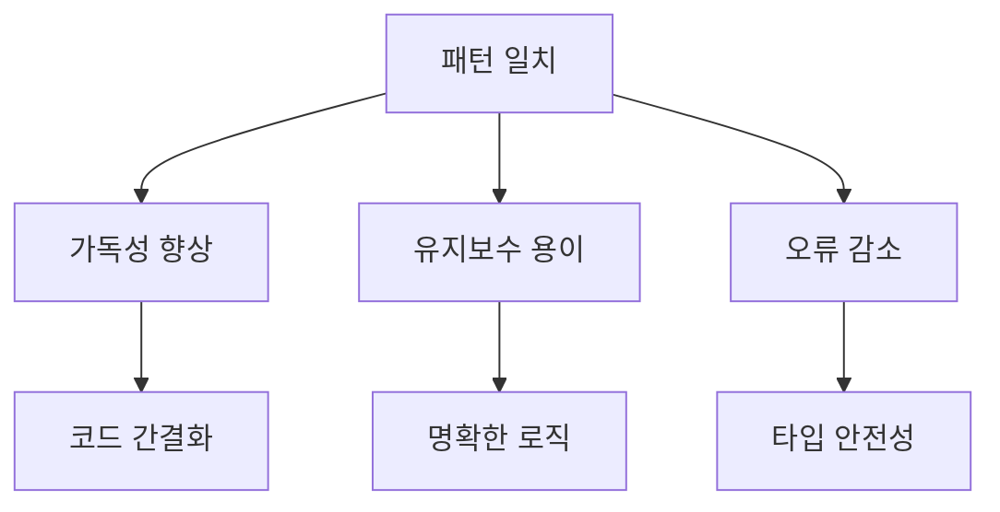

위의 다이어그램은 패턴 일치가 가져오는 여러 가지 이점을 시각적으로 나타낸 것이다. 이러한 이유로 C#에서 패턴 일치는 매우 중요한 기능으로 자리 잡고 있다.

<!--
## 이 문서의 내용
   - 패턴 일치의 기본 개념
   - C#에서의 패턴 일치 구문
-->

## 이 문서의 내용

### 패턴 일치의 기본 개념

패턴 일치는 프로그래밍에서 특정 데이터 구조나 값의 형태를 검사하고, 그에 따라 적절한 동작을 수행하는 기법이다. 이는 주로 조건문을 간소화하고 가독성을 높이는 데 기여한다. 패턴 일치를 사용하면 복잡한 조건문을 간단하게 표현할 수 있으며, 코드의 유지보수성을 향상시킬 수 있다.

예를 들어, 패턴 일치를 통해 다양한 데이터 타입을 쉽게 검사하고, 그에 따라 적절한 로직을 적용할 수 있다. 이는 특히 객체 지향 프로그래밍에서 유용하게 사용된다.

### C#에서의 패턴 일치 구문

C#에서는 패턴 일치를 다양한 방식으로 구현할 수 있다. 기본적인 구문은 `switch` 문과 함께 사용되며, 다양한 패턴을 지원한다. 다음은 C#에서 패턴 일치를 사용하는 기본적인 예제이다.

```csharp
public void ProcessInput(object input)
{
    switch (input)
    {
        case null:
            Console.WriteLine("입력이 null입니다.");
            break;
        case int number when number > 0:
            Console.WriteLine($"양수: {number}");
            break;
        case string text:
            Console.WriteLine($"문자열: {text}");
            break;
        default:
            Console.WriteLine("알 수 없는 타입입니다.");
            break;
    }
}
```

위의 예제에서 `switch` 문을 사용하여 입력값의 타입과 조건을 검사하고, 그에 따라 적절한 메시지를 출력한다. 이처럼 패턴 일치는 코드의 가독성을 높이고, 다양한 조건을 간단하게 처리할 수 있는 장점을 제공한다.

다음은 패턴 일치의 흐름을 나타내는 다이어그램이다.

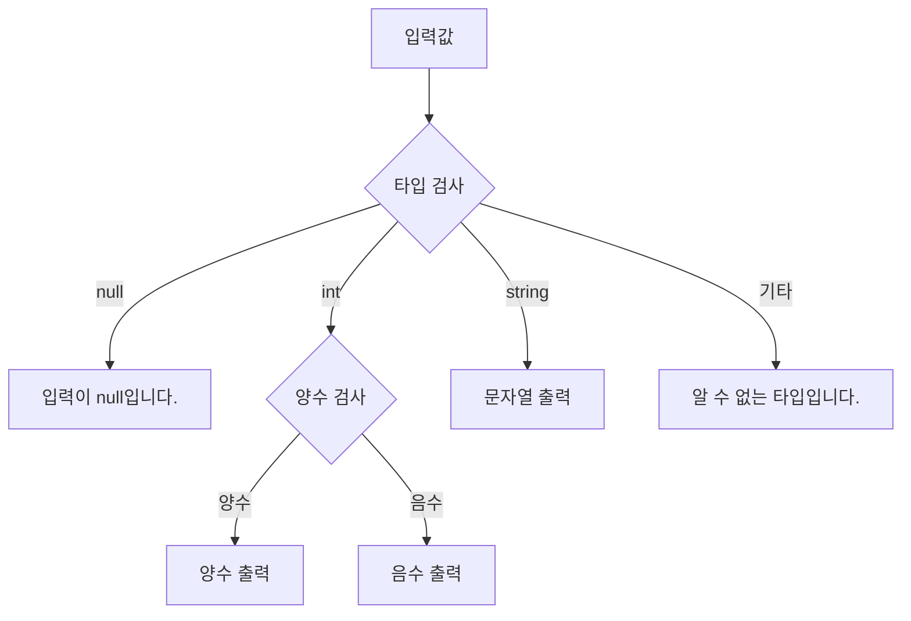

이 다이어그램은 입력값에 따라 어떤 경로로 진행되는지를 시각적으로 나타낸다. 패턴 일치를 통해 코드의 흐름을 명확하게 이해할 수 있다.

<!--
## null 검사
   - null 검사 패턴
   - 예제: nullable 타입 검사
   - 예제: null 비교를 위한 'not' 패턴
-->

## null 검사

**null 검사 패턴**

null 검사는 프로그래밍에서 매우 중요한 개념이다. C#에서는 null 값을 처리하기 위해 다양한 패턴을 제공한다. null 검사 패턴은 객체가 null인지 여부를 확인하고, 그에 따라 적절한 처리를 수행할 수 있도록 돕는다. 이를 통해 NullReferenceException과 같은 오류를 예방할 수 있다.

C#에서 null 검사를 수행하는 기본적인 방법은 `is` 키워드를 사용하는 것이다. 예를 들어, 특정 객체가 null인지 확인하고, null이 아닐 경우에만 해당 객체의 속성이나 메서드에 접근할 수 있다.

**예제: nullable 타입 검사**

nullable 타입은 값 타입이 null 값을 가질 수 있도록 해주는 기능이다. C#에서는 `Nullable<T>` 구조체를 사용하여 nullable 타입을 정의할 수 있다. 다음은 nullable 타입을 검사하는 예제이다.

```csharp
int? nullableInt = null;

if (nullableInt is null)
{
    Console.WriteLine("nullableInt는 null입니다.");
}
else
{
    Console.WriteLine($"nullableInt의 값은 {nullableInt.Value}입니다.");
}
```

위의 코드에서 `nullableInt`가 null인지 확인하고, 그에 따라 다른 메시지를 출력한다. 이와 같은 방식으로 nullable 타입을 안전하게 검사할 수 있다.

**예제: null 비교를 위한 'not' 패턴**

C# 9.0부터 도입된 'not' 패턴을 사용하면 null 비교를 더욱 간결하게 수행할 수 있다. 'not' 패턴은 특정 값이 아닌 경우를 검사하는 데 유용하다. 다음은 'not' 패턴을 사용한 null 비교의 예제이다.

```csharp
object obj = null;

if (obj is not null)
{
    Console.WriteLine("obj는 null이 아닙니다.");
}
else
{
    Console.WriteLine("obj는 null입니다.");
}
```

위의 코드에서 'not' 패턴을 사용하여 `obj`가 null이 아닌 경우를 간단하게 검사할 수 있다. 이와 같은 패턴을 활용하면 코드의 가독성을 높이고, null 검사를 보다 직관적으로 수행할 수 있다.

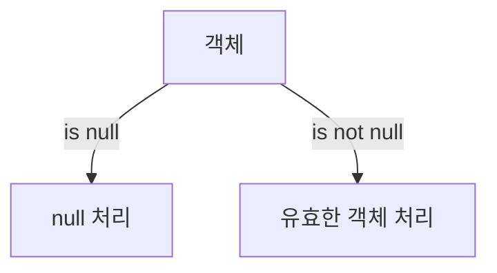

위의 다이어그램은 null 검사 패턴의 흐름을 나타낸다. 객체가 null인지 여부에 따라 다른 경로로 처리되는 과정을 시각적으로 표현하였다. 이러한 패턴을 통해 C#에서 null 검사를 효과적으로 수행할 수 있다.

<!--
## 형식 테스트
   - 형식 테스트의 필요성
   - 예제: IList<T> 형식 검사
   - 예제: switch 식을 통한 형식 테스트
-->

## 형식 테스트

형식 테스트는 프로그래밍에서 객체의 형식을 확인하고, 그에 따라 적절한 처리를 수행하는 중요한 과정이다. C#에서는 다양한 형식 테스트 방법을 제공하여, 개발자가 코드의 안정성과 가독성을 높일 수 있도록 돕는다. 이 섹션에서는 형식 테스트의 필요성과 몇 가지 예제를 통해 이를 살펴보겠다.

### 형식 테스트의 필요성

형식 테스트는 여러 이유로 필요하다. 첫째, 다양한 형식의 객체를 처리하는 경우, 특정 형식에 대한 처리를 명확히 하기 위해 형식 검사가 필요하다. 둘째, 형식에 따라 다른 동작을 수행해야 할 때, 형식 테스트를 통해 코드의 흐름을 제어할 수 있다. 마지막으로, 형식 테스트는 코드의 안전성을 높이고, 런타임 오류를 줄이는 데 기여한다.

### 예제: IList<T> 형식 검사

IList<T> 형식은 C#에서 자주 사용되는 컬렉션 형식 중 하나이다. 이 형식이 맞는지 검사하는 방법을 살펴보겠다.

```csharp
public void ProcessList(object input)
{
    if (input is IList<string> stringList)
    {
        foreach (var item in stringList)
        {
            Console.WriteLine(item);
        }
    }
    else
    {
        Console.WriteLine("입력된 객체는 IList<string> 형식이 아닙니다.");
    }
}
```

위의 코드에서는 `input`이 `IList<string>` 형식인지 검사하고, 맞다면 해당 리스트의 요소를 출력한다. 형식이 맞지 않을 경우, 적절한 메시지를 출력한다.

### 예제: switch 식을 통한 형식 테스트

C# 7.0부터 도입된 switch 식을 사용하여 형식 테스트를 수행할 수 있다. 아래의 예제를 통해 형식에 따라 다른 처리를 하는 방법을 살펴보겠다.

```csharp
public string GetTypeDescription(object input)
{
    return input switch
    {
        int _ => "정수형입니다.",
        string _ => "문자열형입니다.",
        IList<string> _ => "문자열 리스트입니다.",
        _ => "알 수 없는 형식입니다."
    };
}
```

위의 코드에서는 `input`의 형식에 따라 다른 문자열을 반환한다. 각 형식에 대한 처리를 간결하게 표현할 수 있어 가독성이 높아진다.

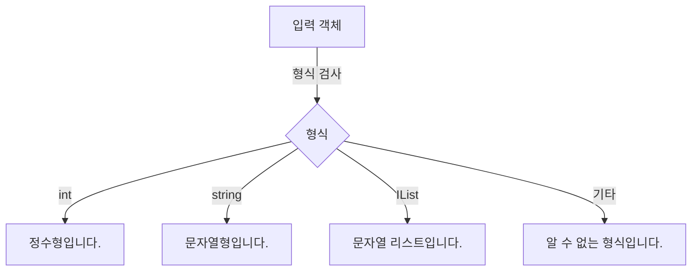

위의 다이어그램은 입력 객체가 형식 검사 후 어떤 결과를 반환하는지를 시각적으로 나타낸 것이다. 형식 테스트는 코드의 흐름을 명확히 하고, 다양한 형식에 대한 처리를 용이하게 한다. 

형식 테스트는 C#에서 매우 유용한 기능으로, 이를 통해 코드의 안정성과 가독성을 높일 수 있다. 다양한 형식에 대한 처리를 명확히 하고, 런타임 오류를 줄이는 데 기여하는 형식 테스트를 적극 활용하길 권장한다.

<!--
## 불연속 값 비교
   - 열거형 값 비교
   - 예제: 열거형을 사용한 메서드 디스패치
   - 예제: 문자열 명령어 처리
-->

## 불연속 값 비교

불연속 값 비교는 특정 값이 열거형(Enumeration)과 같은 제한된 집합에 속하는지를 확인하는 과정이다. 이 방법은 코드의 가독성을 높이고, 오류를 줄이며, 유지보수를 용이하게 한다. 특히, 열거형을 사용하면 코드의 의미를 명확히 할 수 있어, 개발자가 의도를 쉽게 파악할 수 있다.

### 열거형 값 비교

열거형은 관련된 상수 집합을 정의하는 데 유용하다. C#에서 열거형을 사용하면 코드의 의미를 명확히 하고, 특정 값이 유효한지를 쉽게 검사할 수 있다. 예를 들어, 다음과 같은 열거형을 정의할 수 있다.

```csharp
public enum OrderStatus
{
    Pending,
    Shipped,
    Delivered,
    Canceled
}
```

이 열거형을 사용하여 주문의 상태를 관리할 수 있으며, 특정 상태에 대한 비교를 통해 로직을 구현할 수 있다.

### **예제: 열거형을 사용한 메서드 디스패치**

열거형을 활용하여 메서드를 디스패치하는 예제를 살펴보자. 다음은 주문 상태에 따라 다른 처리를 수행하는 메서드이다.

```csharp
public void ProcessOrder(OrderStatus status)
{
    switch (status)
    {
        case OrderStatus.Pending:
            Console.WriteLine("주문이 대기 중입니다.");
            break;
        case OrderStatus.Shipped:
            Console.WriteLine("주문이 발송되었습니다.");
            break;
        case OrderStatus.Delivered:
            Console.WriteLine("주문이 배달되었습니다.");
            break;
        case OrderStatus.Canceled:
            Console.WriteLine("주문이 취소되었습니다.");
            break;
        default:
            throw new ArgumentOutOfRangeException(nameof(status), status, null);
    }
}
```

위의 코드에서 `ProcessOrder` 메서드는 `OrderStatus` 열거형을 인자로 받아, 각 상태에 따라 적절한 메시지를 출력한다. 이와 같은 방식으로 열거형을 사용하면 코드의 가독성이 높아지고, 각 상태에 대한 처리를 명확히 할 수 있다.

### **예제: 문자열 명령어 처리**

열거형을 사용하여 문자열 명령어를 처리하는 방법도 있다. 다음은 문자열 명령어를 열거형으로 정의하고, 해당 명령어에 따라 다른 동작을 수행하는 예제이다.

```csharp
public enum Command
{
    Start,
    Stop,
    Pause,
    Resume
}

public void ExecuteCommand(string commandString)
{
    if (Enum.TryParse(commandString, true, out Command command))
    {
        switch (command)
        {
            case Command.Start:
                Console.WriteLine("시작합니다.");
                break;
            case Command.Stop:
                Console.WriteLine("중지합니다.");
                break;
            case Command.Pause:
                Console.WriteLine("일시 정지합니다.");
                break;
            case Command.Resume:
                Console.WriteLine("재개합니다.");
                break;
            default:
                Console.WriteLine("알 수 없는 명령어입니다.");
                break;
        }
    }
    else
    {
        Console.WriteLine("유효하지 않은 명령어입니다.");
    }
}
```

위의 코드에서 `ExecuteCommand` 메서드는 문자열로 입력된 명령어를 열거형으로 변환한 후, 해당 명령어에 따라 적절한 동작을 수행한다. 이와 같은 방식으로 문자열 명령어를 처리하면, 코드의 유연성과 가독성을 높일 수 있다.

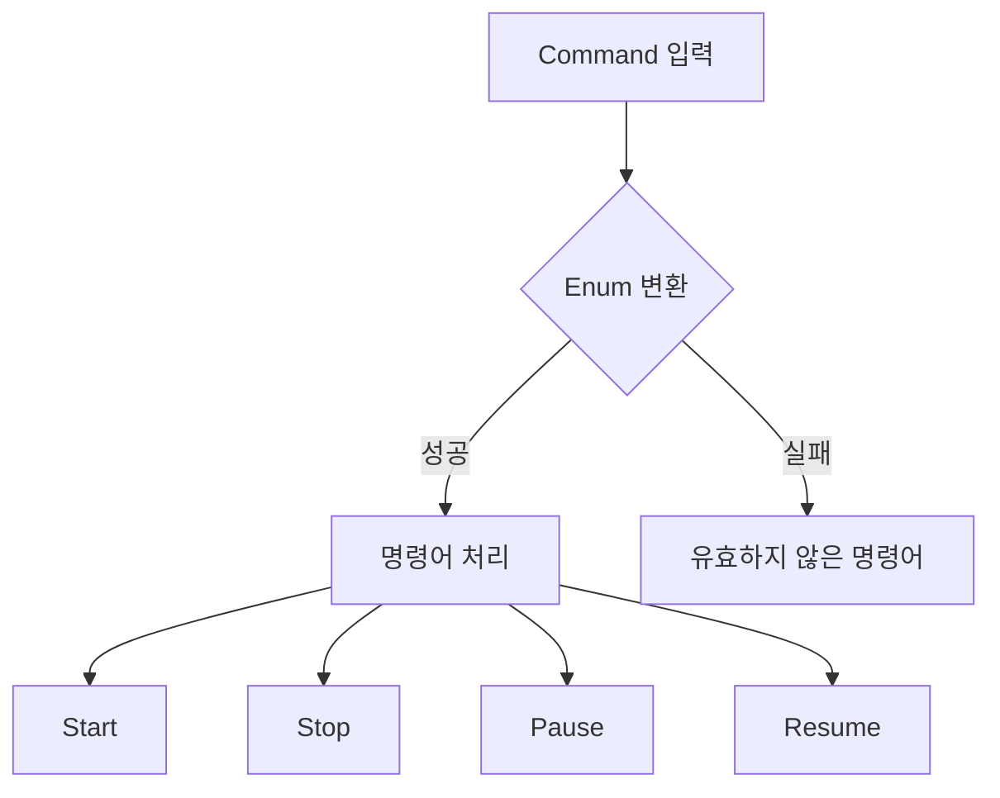

위의 다이어그램은 명령어 입력 후 Enum 변환 과정을 나타낸다. 성공적으로 변환되면 해당 명령어에 따라 처리되고, 실패할 경우 유효하지 않은 명령어 메시지가 출력된다. 

이와 같이 불연속 값 비교는 열거형을 통해 코드의 가독성을 높이고, 명확한 로직을 구현하는 데 큰 도움이 된다.

<!--
## 관계형 패턴
   - 관계형 패턴의 개념
   - 예제: 온도에 따른 물의 상태 반환
   - 예제: 패턴 리팩토링
-->

## 관계형 패턴

관계형 패턴은 특정 조건에 따라 객체의 상태를 평가하고, 그에 따라 적절한 동작을 수행하는 패턴이다. 이 패턴은 주로 값의 범위나 관계를 기반으로 하여 다양한 조건을 처리할 수 있도록 돕는다. C#에서는 `switch` 문과 함께 사용하여 코드의 가독성을 높이고, 복잡한 조건문을 간결하게 표현할 수 있다.

**온도에 따른 물의 상태 반환**

온도에 따라 물의 상태(고체, 액체, 기체)를 반환하는 예제를 살펴보자. 이 예제에서는 관계형 패턴을 사용하여 온도 값에 따라 적절한 상태를 반환하는 메서드를 구현할 것이다.

```csharp
public string GetWaterState(double temperature)
{
    return temperature switch
    {
        < 0 => "고체", // 얼음
        0 => "고체와 액체", // 얼음과 물
        > 0 and < 100 => "액체", // 물
        100 => "액체와 기체", // 물과 수증기
        _ => "기체" // 수증기
    };
}
```

위의 코드에서 `switch` 식을 사용하여 온도에 따라 물의 상태를 반환하고 있다. 이처럼 관계형 패턴을 활용하면 조건문을 간결하게 작성할 수 있다.

**패턴 리팩토링**

패턴 리팩토링은 기존의 복잡한 조건문을 관계형 패턴으로 변환하여 코드의 가독성과 유지보수성을 높이는 과정이다. 예를 들어, 여러 개의 `if-else` 문을 사용하여 특정 조건을 처리하는 대신, 관계형 패턴을 사용하여 코드를 간결하게 만들 수 있다.

다음은 리팩토링 전후의 예시이다.

리팩토링 전:

```csharp
public string GetDiscount(double price)
{
    if (price < 100)
    {
        return "할인 없음";
    }
    else if (price < 500)
    {
        return "10% 할인";
    }
    else if (price < 1000)
    {
        return "20% 할인";
    }
    else
    {
        return "30% 할인";
    }
}
```

리팩토링 후:

```csharp
public string GetDiscount(double price)
{
    return price switch
    {
        < 100 => "할인 없음",
        < 500 => "10% 할인",
        < 1000 => "20% 할인",
        _ => "30% 할인"
    };
}
```

위의 리팩토링된 코드는 가독성이 높아지고, 유지보수가 용이해졌다. 관계형 패턴을 사용함으로써 조건을 명확하게 표현할 수 있으며, 코드의 길이도 줄어들었다.

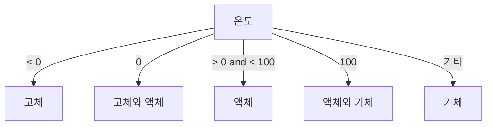

위의 다이어그램은 온도에 따른 물의 상태를 시각적으로 표현한 것이다. 각 조건에 따라 물의 상태가 어떻게 변화하는지를 보여준다. 이러한 관계형 패턴을 통해 복잡한 로직을 간단하게 표현할 수 있다.

<!--
## 여러 입력
   - 여러 속성 검사 패턴
   - 예제: Order 레코드의 할인 계산
   - 예제: 분해를 통한 속성 검사
-->

## 여러 입력

여러 입력을 처리하는 패턴은 복잡한 데이터 구조를 다룰 때 유용하다. 특히, 여러 속성을 동시에 검사하거나 조합하여 특정 조건을 만족하는지를 확인할 수 있다. 이러한 패턴은 코드의 가독성을 높이고, 유지보수를 용이하게 한다.

### 여러 속성 검사 패턴

여러 속성 검사 패턴은 객체의 여러 속성을 동시에 검사할 수 있는 방법이다. 예를 들어, 특정 조건을 만족하는 객체를 찾기 위해 여러 속성을 조합하여 검사할 수 있다. C#에서는 `when` 절을 사용하여 이러한 조건을 명확하게 표현할 수 있다.

**예제: Order 레코드의 할인 계산**

아래의 예제는 `Order` 객체의 여러 속성을 검사하여 할인 여부를 결정하는 코드이다. 이 예제에서는 `Order` 객체가 특정 조건을 만족할 때 할인 금액을 계산한다.

```csharp
public class Order
{
    public decimal TotalAmount { get; set; }
    public bool IsMember { get; set; }
    public int ItemCount { get; set; }
}

public decimal CalculateDiscount(Order order)
{
    return order switch
    {
        { IsMember: true, TotalAmount: > 100 } => order.TotalAmount * 0.1m, // 10% 할인
        { ItemCount: > 5 } => order.TotalAmount * 0.05m, // 5% 할인
        _ => 0m // 할인 없음
    };
}
```

위의 코드에서 `switch` 식을 사용하여 `Order` 객체의 여러 속성을 검사하고, 조건에 따라 할인 금액을 계산한다. 이와 같은 방식은 코드의 가독성을 높이고, 조건을 명확하게 표현할 수 있게 해준다.

**예제: 분해를 통한 속성 검사**

분해를 통한 속성 검사는 객체의 속성을 분해하여 개별적으로 검사하는 방법이다. 이 방법은 특히 복잡한 객체 구조를 다룰 때 유용하다. 아래의 예제는 `Customer` 객체의 속성을 분해하여 특정 조건을 검사하는 코드이다.

```csharp
public class Customer
{
    public string Name { get; set; }
    public Address Address { get; set; }
}

public class Address
{
    public string City { get; set; }
    public string Country { get; set; }
}

public bool IsInEligibleArea(Customer customer)
{
    return customer switch
    {
        { Address.City: "Seoul", Address.Country: "South Korea" } => true,
        _ => false
    };
}
```

위의 코드에서 `Customer` 객체의 `Address` 속성을 분해하여 `City`와 `Country`를 검사한다. 이와 같은 방식은 객체의 속성을 명확하게 분리하여 조건을 검사할 수 있게 해준다.

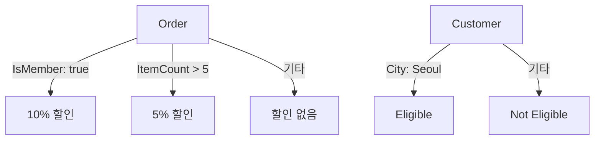

위의 다이어그램은 `Order` 객체와 `Customer` 객체의 조건 검사 흐름을 나타낸다. 이러한 패턴을 활용하면 복잡한 조건을 간단하게 처리할 수 있다. 여러 입력을 처리하는 패턴은 코드의 가독성을 높이고, 유지보수를 용이하게 하는 데 큰 도움이 된다.

<!--
## 목록 패턴
   - 목록 패턴의 개념
   - 예제: CSV 형식의 데이터 처리
   - 예제: 무시 항목 및 슬라이스 패턴 활용
-->

## 목록 패턴

목록 패턴(List Pattern)은 C# 8.0에서 도입된 기능으로, 배열이나 리스트와 같은 컬렉션의 요소를 쉽게 검사하고 조작할 수 있는 방법을 제공한다. 이 패턴은 특히 데이터 구조가 고정된 경우에 유용하며, 특정 조건을 만족하는 요소를 찾거나, 요소의 개수에 따라 다른 처리를 할 수 있도록 돕는다. 목록 패턴을 사용하면 코드의 가독성과 유지보수성을 높일 수 있다.

**목록 패턴의 개념**

목록 패턴은 주로 다음과 같은 두 가지 형태로 사용된다:

1. **고정 길이 패턴**: 특정 길이의 배열이나 리스트를 검사할 때 사용된다. 예를 들어, 배열의 길이가 3인 경우, 각 요소를 특정 값과 비교할 수 있다.
2. **슬라이스 패턴**: 배열이나 리스트의 일부를 선택하여 검사할 수 있는 기능이다. 이를 통해 특정 인덱스의 요소를 무시하거나, 나머지 요소를 처리할 수 있다.

이러한 패턴은 복잡한 조건문을 간소화하고, 코드의 의도를 명확히 하는 데 도움을 준다.

**예제: CSV 형식의 데이터 처리**

CSV(Comma-Separated Values) 형식의 데이터를 처리할 때 목록 패턴을 활용할 수 있다. 아래는 CSV 데이터를 파싱하여 특정 조건을 만족하는 행을 찾는 예제이다.

```csharp
using System;
using System.Collections.Generic;

class Program
{
    static void Main()
    {
        var csvData = new List<string>
        {
            "Name,Age,Location",
            "Alice,30,New York",
            "Bob,25,Los Angeles",
            "Charlie,35,Chicago"
        };

        foreach (var line in csvData)
        {
            if (line is [var name, var age, var location])
            {
                Console.WriteLine($"Name: {name}, Age: {age}, Location: {location}");
            }
        }
    }
}
```

위의 코드에서 `line`이 목록 패턴을 사용하여 각 요소를 분해하고, 이를 통해 CSV 데이터를 쉽게 처리할 수 있다.

**예제: 무시 항목 및 슬라이스 패턴 활용**

슬라이스 패턴을 사용하면 특정 인덱스의 요소를 무시하고 나머지 요소를 처리할 수 있다. 아래는 리스트의 첫 번째 요소를 무시하고 나머지 요소를 출력하는 예제이다.

```csharp
using System;
using System.Collections.Generic;

class Program
{
    static void Main()
    {
        var numbers = new List<int> { 1, 2, 3, 4, 5 };

        if (numbers is [_, var second, var third, .. var rest])
        {
            Console.WriteLine($"Second: {second}, Third: {third}");
            Console.WriteLine("Rest: " + string.Join(", ", rest));
        }
    }
}
```

위의 코드에서 `_`는 첫 번째 요소를 무시하고, `var second`와 `var third`는 각각 두 번째와 세 번째 요소를 가져온다. `.. var rest`는 나머지 요소를 리스트로 가져온다.

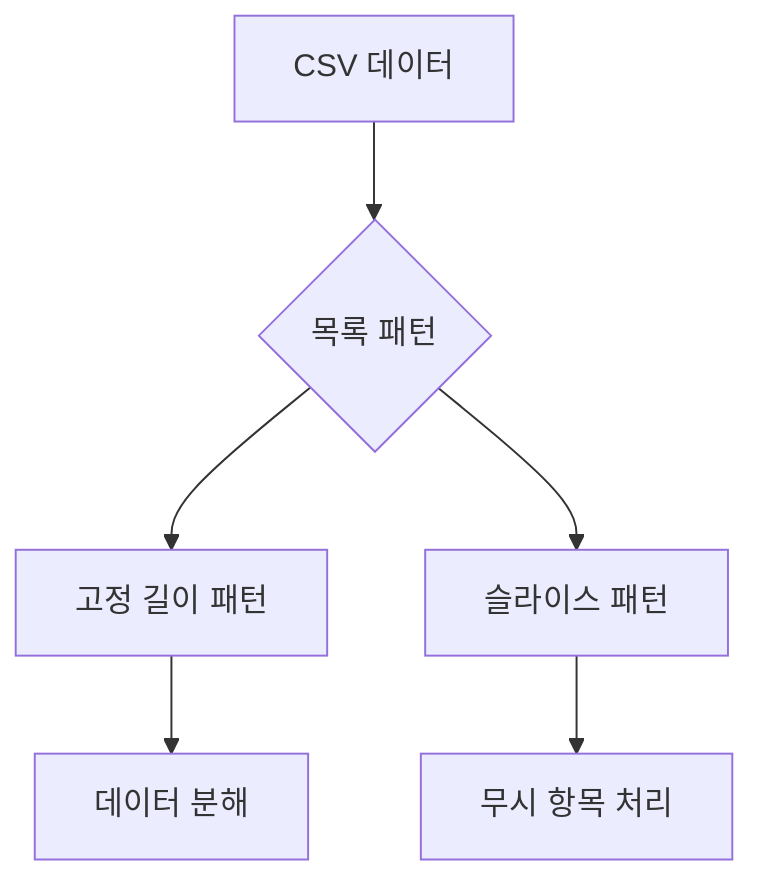

위의 다이어그램은 목록 패턴의 개념과 그 활용 방법을 시각적으로 나타낸 것이다. 목록 패턴은 C#에서 데이터 처리의 효율성을 높이는 데 중요한 역할을 한다.

<!--
## 예제
   - 다양한 패턴 일치 예제 모음
   - 실용적인 코드 스니펫
-->

## 예제

패턴 일치는 C#에서 매우 유용한 기능으로, 다양한 상황에서 코드의 가독성과 유지보수성을 높이는 데 기여한다. 이번 섹션에서는 여러 가지 패턴 일치의 예제를 통해 그 활용 방법을 살펴보겠다.

### 다양한 패턴 일치 예제 모음

**패턴 일치**는 다양한 데이터 구조와 조건을 처리하는 데 유용하다. 아래는 몇 가지 예제를 통해 패턴 일치의 사용 사례를 살펴보겠다.

1. **null 검사 패턴**

   ```csharp
   object obj = null;

   if (obj is null)
   {
       Console.WriteLine("obj는 null입니다.");
   }
   ```

2. **형식 테스트**

   ```csharp
   object list = new List<int> { 1, 2, 3 };

   if (list is IList<int> intList)
   {
       Console.WriteLine($"리스트의 첫 번째 요소: {intList[0]}");
   }
   ```

3. **열거형 값 비교**

   ```csharp
   enum Status { Active, Inactive, Pending }

   Status currentStatus = Status.Active;

   switch (currentStatus)
   {
       case Status.Active:
           Console.WriteLine("상태: 활성");
           break;
       case Status.Inactive:
           Console.WriteLine("상태: 비활성");
           break;
       default:
           Console.WriteLine("상태: 대기 중");
           break;
   }
   ```

### 실용적인 코드 스니펫

아래는 패턴 일치를 활용한 실용적인 코드 스니펫이다. 이 코드는 다양한 입력을 처리하고, 각 입력에 따라 다른 동작을 수행한다.

```csharp
public void ProcessInput(object input)
{
    switch (input)
    {
        case null:
            Console.WriteLine("입력이 null입니다.");
            break;
        case int number when number > 0:
            Console.WriteLine($"양수: {number}");
            break;
        case string text:
            Console.WriteLine($"문자열: {text}");
            break;
        case IList<int> numbers:
            Console.WriteLine($"리스트의 크기: {numbers.Count}");
            break;
        default:
            Console.WriteLine("알 수 없는 입력입니다.");
            break;
    }
}
```

### 다이어그램

아래는 패턴 일치의 흐름을 나타내는 다이어그램이다. 이 다이어그램은 입력에 따라 어떤 패턴이 적용되는지를 시각적으로 보여준다.

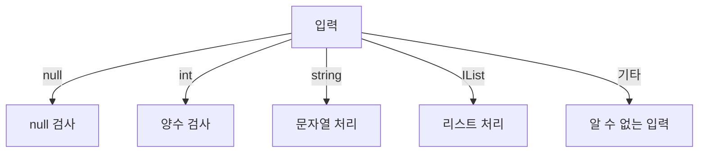

이와 같이 패턴 일치는 다양한 데이터 타입과 조건을 간결하게 처리할 수 있는 강력한 도구이다. 이를 통해 코드의 가독성을 높이고, 유지보수성을 향상시킬 수 있다.

<!--
## FAQ
   - 패턴 일치와 일반 조건문 차이점
   - 패턴 일치의 성능에 대한 질문
   - C#의 다른 언어와의 패턴 일치 비교
-->

## FAQ

### 패턴 일치와 일반 조건문 차이점

패턴 일치는 C#에서 제공하는 강력한 기능으로, 객체의 형식이나 속성을 검사하는 데 사용된다. 일반 조건문은 주로 `if` 문을 사용하여 조건을 평가하는 방식이다. 패턴 일치는 코드의 가독성을 높이고, 다양한 조건을 간결하게 표현할 수 있는 장점이 있다. 예를 들어, 패턴 일치를 사용하면 여러 조건을 하나의 구문으로 처리할 수 있다.

**예제: 패턴 일치와 일반 조건문 비교**

```csharp
// 일반 조건문
if (obj is string)
{
    Console.WriteLine("문자열입니다.");
}
else if (obj is int)
{
    Console.WriteLine("정수입니다.");
}

// 패턴 일치
switch (obj)
{
    case string s:
        Console.WriteLine("문자열입니다.");
        break;
    case int i:
        Console.WriteLine("정수입니다.");
        break;
}
```

위의 예제에서 볼 수 있듯이, 패턴 일치를 사용하면 코드가 더 간결하고 명확해진다.

### 패턴 일치의 성능에 대한 질문

패턴 일치는 성능 측면에서도 유리하다. 일반적으로 패턴 일치는 컴파일 타임에 최적화되므로, 런타임 성능이 향상된다. 특히, 복잡한 조건문을 사용할 때 패턴 일치를 통해 불필요한 조건 평가를 줄일 수 있다. 그러나 성능은 사용되는 패턴의 종류와 상황에 따라 다를 수 있으므로, 실제 성능을 측정하는 것이 중요하다.

**성능 비교 다이어그램**

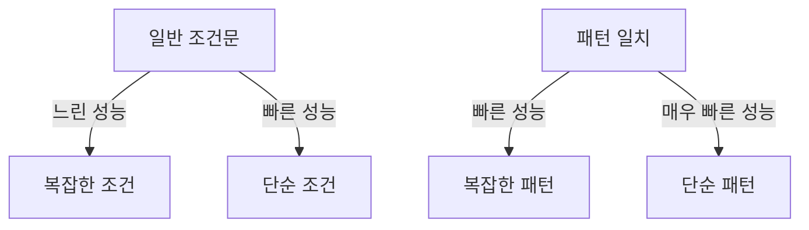

위의 다이어그램은 일반 조건문과 패턴 일치의 성능 차이를 시각적으로 나타낸 것이다. 패턴 일치는 복잡한 조건에서도 성능이 우수함을 보여준다.

### C#의 다른 언어와의 패턴 일치 비교

C#의 패턴 일치는 다른 프로그래밍 언어에서도 유사한 개념이 존재하지만, 각 언어마다 구현 방식이 다르다. 예를 들어, Java에서는 `instanceof` 키워드를 사용하여 형식을 검사하지만, C#에서는 `is` 키워드와 `switch` 문을 통해 더 직관적인 방식으로 패턴 일치를 구현할 수 있다. Python에서는 `match` 문을 사용하여 패턴 일치를 지원하며, 이는 C#의 패턴 일치와 유사한 기능을 제공한다.

**C#과 다른 언어의 패턴 일치 비교**

| 언어   | 패턴 일치 구문          | 특징                       |
|--------|------------------------|----------------------------|
| C#     | `is`, `switch`        | 강력한 형식 검사 지원     |
| Java   | `instanceof`          | 형식 검사만 지원          |
| Python | `match`               | 패턴 매칭 기능 제공       |

이 표는 C#과 다른 언어의 패턴 일치 구문과 특징을 비교한 것이다. C#은 다양한 패턴을 지원하여 개발자가 더 유연하게 코드를 작성할 수 있도록 돕는다.

<!--
## 관련 기술
   - C#의 다른 기능 (LINQ, async/await 등)
   - 패턴 일치와 함수형 프로그래밍
   - 디자인 패턴과의 관계
-->

## 관련 기술

### C#의 다른 기능 (LINQ, async/await 등)

C#은 다양한 기능을 제공하며, 그 중 LINQ(Language Integrated Query)와 async/await는 매우 유용한 기능이다. LINQ는 데이터 쿼리를 간결하게 작성할 수 있도록 도와주며, 데이터 소스에 대한 일관된 접근 방식을 제공한다. async/await는 비동기 프로그래밍을 쉽게 구현할 수 있게 해주어, UI 응답성을 유지하면서도 긴 작업을 수행할 수 있도록 한다.

**LINQ 예제:**

```csharp
using System;
using System.Collections.Generic;
using System.Linq;

class Program
{
    static void Main()
    {
        List<int> numbers = new List<int> { 1, 2, 3, 4, 5 };
        var evenNumbers = numbers.Where(n => n % 2 == 0).ToList();
        
        Console.WriteLine("Even Numbers: " + string.Join(", ", evenNumbers));
    }
}
```

**async/await 예제:**

```csharp
using System;
using System.Net.Http;
using System.Threading.Tasks;

class Program
{
    static async Task Main()
    {
        string result = await FetchDataAsync("https://api.example.com/data");
        Console.WriteLine(result);
    }

    static async Task<string> FetchDataAsync(string url)
    {
        using HttpClient client = new HttpClient();
        return await client.GetStringAsync(url);
    }
}
```

### 패턴 일치와 함수형 프로그래밍

패턴 일치는 함수형 프로그래밍의 중요한 개념 중 하나로, 데이터 구조를 쉽게 다룰 수 있도록 해준다. 함수형 프로그래밍에서는 불변성과 고차 함수의 개념이 강조되며, 패턴 일치를 통해 이러한 개념을 효과적으로 적용할 수 있다. 예를 들어, 패턴 일치를 사용하여 다양한 데이터 구조를 처리할 수 있으며, 이는 코드의 가독성과 유지보수성을 높이는 데 기여한다.

**함수형 프로그래밍 예제:**

```csharp
using System;

class Program
{
    static void Main()
    {
        Func<int, string> classifyNumber = number => number switch
        {
            < 0 => "Negative",
            0 => "Zero",
            _ => "Positive"
        };

        Console.WriteLine(classifyNumber(-5)); // Negative
        Console.WriteLine(classifyNumber(0));  // Zero
        Console.WriteLine(classifyNumber(5));  // Positive
    }
}
```

### 디자인 패턴과의 관계

디자인 패턴은 소프트웨어 설계에서 자주 발생하는 문제를 해결하기 위한 일반적인 솔루션이다. 패턴 일치는 이러한 디자인 패턴을 구현하는 데 유용하게 사용될 수 있다. 예를 들어, 전략 패턴이나 상태 패턴을 구현할 때 패턴 일치를 활용하면 코드의 복잡성을 줄이고, 명확한 구조를 유지할 수 있다.

**전략 패턴 예제:**

```csharp
using System;

interface IStrategy
{
    void Execute();
}

class ConcreteStrategyA : IStrategy
{
    public void Execute() => Console.WriteLine("Executing Strategy A");
}

class ConcreteStrategyB : IStrategy
{
    public void Execute() => Console.WriteLine("Executing Strategy B");
}

class Context
{
    private IStrategy _strategy;

    public void SetStrategy(IStrategy strategy) => _strategy = strategy;

    public void ExecuteStrategy() => _strategy.Execute();
}

class Program
{
    static void Main()
    {
        Context context = new Context();
        
        context.SetStrategy(new ConcreteStrategyA());
        context.ExecuteStrategy(); // Executing Strategy A
        
        context.SetStrategy(new ConcreteStrategyB());
        context.ExecuteStrategy(); // Executing Strategy B
    }
}
```

이와 같이 패턴 일치는 C#의 다양한 기능과 밀접하게 연관되어 있으며, 이를 통해 코드의 품질과 유지보수성을 높일 수 있다.

<!--
## 결론
   - 패턴 일치의 장점 요약
   - 향후 패턴 일치의 발전 방향
   - 추가 학습 자료 및 참고 링크
-->

## 결론

### 패턴 일치의 장점 요약

패턴 일치는 C# 프로그래밍에서 코드의 가독성과 유지보수성을 크게 향상시키는 기능이다. 이를 통해 복잡한 조건문을 간결하게 표현할 수 있으며, 다양한 데이터 구조를 효과적으로 처리할 수 있다. 특히, 패턴 일치는 다음과 같은 장점을 제공한다.

- **가독성 향상**: 패턴 일치를 사용하면 코드가 더 직관적으로 변하여, 다른 개발자가 이해하기 쉬운 형태로 작성할 수 있다.
- **유지보수 용이**: 코드의 구조가 명확해지므로, 수정이나 확장이 필요할 때 더 쉽게 접근할 수 있다.
- **성능 최적화**: 패턴 일치는 컴파일러가 최적화할 수 있는 기회를 제공하여, 실행 성능을 개선할 수 있다.

### 향후 패턴 일치의 발전 방향

패턴 일치는 C#의 발전과 함께 지속적으로 개선될 가능성이 높다. 향후 발전 방향으로는 다음과 같은 점들이 예상된다.

- **더 많은 패턴 추가**: 새로운 데이터 구조나 프로그래밍 패러다임에 맞춘 다양한 패턴이 추가될 것으로 보인다.
- **성능 개선**: 패턴 일치의 성능을 더욱 향상시키기 위한 최적화가 이루어질 것이다.
- **도구 지원 강화**: IDE와 같은 개발 도구에서 패턴 일치 기능을 보다 잘 지원하여, 개발자가 쉽게 활용할 수 있도록 할 것이다.

### 추가 학습 자료 및 참고 링크

패턴 일치에 대한 더 깊은 이해를 원한다면 다음의 자료를 참고하는 것이 좋다.

- [C# 공식 문서](https://docs.microsoft.com/en-us/dotnet/csharp/)

아래는 패턴 일치의 예제를 보여주는 간단한 코드 스니펫이다.

```csharp
public string GetDescription(object obj)
{
    return obj switch
    {
        null => "객체가 null입니다.",
        int i when i < 0 => "음수입니다.",
        int i => "양수입니다.",
        string s => $"문자열: {s}",
        _ => "알 수 없는 타입입니다."
    };
}
```

이 코드는 다양한 타입의 객체에 대해 패턴 일치를 사용하여 설명을 반환하는 예제이다. 각 경우에 따라 적절한 메시지를 반환하여, 코드의 가독성을 높이고 유지보수를 용이하게 한다.

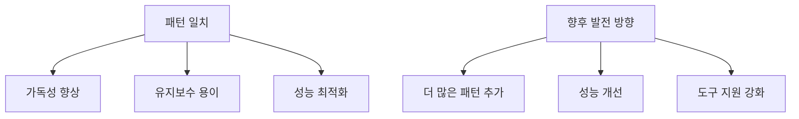

위의 다이어그램은 패턴 일치의 장점과 향후 발전 방향을 시각적으로 나타낸 것이다. 패턴 일치는 C# 프로그래밍에서 중요한 역할을 하며, 앞으로도 많은 발전이 기대된다.

<!--
## 참고 항목
   - 관련 문서 및 자료 링크
   - C# 공식 문서 및 언어 참조
-->

## 참고 항목

**관련 문서 및 자료 링크**

패턴 일치에 대한 더 깊은 이해를 원한다면 다음의 자료를 참고하는 것이 좋다. 

- [Microsoft Docs - Pattern Matching in C#](https://docs.microsoft.com/en-us/dotnet/csharp/language-reference/operators/patterns)  
  이 문서는 C#에서의 패턴 일치에 대한 공식적인 설명을 제공하며, 다양한 예제와 함께 구문을 설명하고 있다.

**C# 공식 문서 및 언어 참조**

C#의 공식 문서는 언어의 다양한 기능을 이해하는 데 필수적이다. 다음 링크를 통해 C#의 공식 문서에 접근할 수 있다.

- [C# Language Specification](https://docs.microsoft.com/en-us/dotnet/csharp/language-reference/language-specification/)  
  C# 언어의 공식 사양으로, 패턴 일치와 관련된 세부 사항을 포함하고 있다.

### 샘플 코드

다음은 C#에서 패턴 일치를 사용하는 간단한 예제 코드이다.

```csharp
public string GetDescription(object obj)
{
    return obj switch
    {
        null => "객체가 null입니다.",
        int i when i < 0 => "음수입니다.",
        int i => "양수입니다.",
        string s => $"문자열: {s}",
        _ => "알 수 없는 타입입니다."
    };
}
```

이 코드는 입력된 객체의 타입에 따라 다른 설명을 반환하는 패턴 일치의 예시이다.

### 다이어그램

다음은 패턴 일치의 흐름을 나타내는 다이어그램이다.

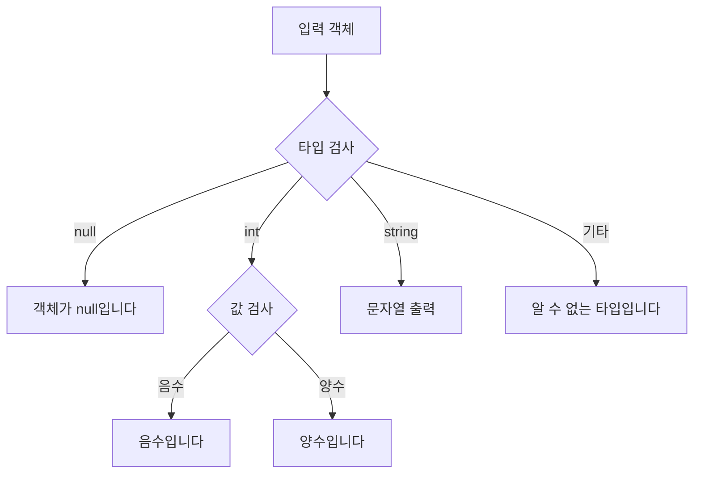

이 다이어그램은 입력된 객체가 어떤 타입인지에 따라 어떻게 처리되는지를 시각적으로 나타낸다. 패턴 일치는 코드의 가독성을 높이고, 다양한 조건을 간결하게 처리할 수 있는 강력한 도구이다.

<!--
##### Reference #####
-->

## Reference


* [https://learn.microsoft.com/ko-kr/dotnet/csharp/fundamentals/functional/pattern-matching](https://learn.microsoft.com/ko-kr/dotnet/csharp/fundamentals/functional/pattern-matching)

