튜플은 메서드 호출에서 여러 값을 검색할 수 있는 간단한 방법을 제공한다. 그러나 튜플을 검색한 후에는 튜플의 개별 요소를 처리해야 하므로, 이 과정이 번거로울 수 있다. 예를 들어, `QueryCityData` 메서드는 3개의 튜플을 반환하며, 각 요소는 별도의 작업을 통해 변수에 할당된다. 이러한 방식은 코드의 가독성을 떨어뜨리고 유지보수를 어렵게 만들 수 있다. C#에서는 튜플 분해를 기본적으로 지원하여 한 작업에서 튜플의 모든 항목을 패키지 해제할 수 있다. 튜플을 분해하는 일반 구문은 대입문 왼쪽에서 각 요소가 할당되는 변수를 괄호로 묶는 것이다. 또한, C# 10부터는 분해 시 변수 선언과 할당을 혼합할 수 있는 기능이 추가되었다. 이와 같은 기능은 코드의 간결성을 높이고, 불필요한 변수 선언을 줄여준다. 무시 항목을 사용하여 튜플의 일부 요소를 무시할 수도 있으며, 이는 특정 값에만 관심이 있을 때 유용하다. 사용자 정의 형식에서도 `Deconstruct` 메서드를 구현하여 형식의 인스턴스를 분해할 수 있으며, 이는 코드의 재사용성을 높인다. 이러한 다양한 기능들은 C# 프로그래밍에서 튜플과 객체를 보다 효율적으로 다룰 수 있게 해준다.

<!--
##### Outline #####
-->

<!--
# 목차

## 개요
   - 튜플과 형식 분해의 중요성
   - C#에서의 튜플 사용 사례

## 튜플
   - 튜플의 정의 및 기본 개념
   - 튜플 분해의 구문
   - 튜플 분해 방법
     - 명시적 형식 선언
     - 형식 유추 사용
     - 이미 선언된 변수로 분해
     - C# 10의 혼합 선언 및 할당

## 무시 항목이 있는 튜플 요소
   - 무시 항목의 개념
   - 무시 항목을 사용한 튜플 분해 예제

## 사용자 정의 형식
   - 사용자 정의 형식에서의 분해
   - `Deconstruct` 메서드의 구현
   - 다양한 조합으로 반환하는 `Deconstruct` 메서드 오버로드 예제

## 무시 항목이 포함된 사용자 정의 형식
   - 사용자 정의 형식에서 무시 항목 사용 예제

## 사용자 정의 형식의 확장 메서드
   - 확장 메서드를 통한 분해
   - `PropertyInfo` 클래스에 대한 `Deconstruct` 확장 메서드 예제

## 시스템 형식의 확장 메서드
   - 시스템 형식에서의 `Deconstruct` 메서드 사용
   - `Nullable<T>` 형식의 확장 메서드 예제

## `record` 형식
   - `record` 형식의 정의 및 사용
   - `record` 형식의 `Deconstruct` 메서드 자동 생성

## 예제
   - 튜플 및 형식 분해를 활용한 실제 코드 예제
   - 사용자 정의 형식의 분해 예제

## FAQ
   - 튜플과 형식 분해에 대한 자주 묻는 질문
   - C#에서의 튜플 사용 시 주의사항

## 관련 기술
   - C#의 다른 데이터 구조 (예: List, Dictionary)
   - LINQ와의 통합
   - C# 10의 새로운 기능

## 결론
   - 튜플 및 형식 분해의 장점 요약
   - 향후 개발에서의 활용 가능성

## 참고 항목
   - 관련 문서 및 자료 링크
   - C# 공식 문서 및 튜토리얼
-->

<!--
## 개요
   - 튜플과 형식 분해의 중요성
   - C#에서의 튜플 사용 사례
-->

## 개요

### 튜플과 형식 분해의 중요성

튜플(Tuple)은 여러 값을 하나의 단위로 묶어주는 데이터 구조이다. 이는 특히 여러 개의 반환 값을 필요로 하는 메서드에서 유용하게 사용된다. 형식 분해(Deconstruction)는 튜플이나 객체의 값을 개별 변수로 쉽게 분리할 수 있는 기능으로, 코드의 가독성을 높이고 불필요한 변수를 줄이는 데 기여한다. 이러한 기능은 C#에서의 프로그래밍을 더욱 간결하고 효율적으로 만들어준다.

형식 분해를 통해 개발자는 복잡한 데이터 구조를 간단하게 다룰 수 있으며, 이는 코드 유지보수성을 향상시키는 데 중요한 역할을 한다. 예를 들어, 튜플을 사용하여 여러 값을 반환하는 메서드를 작성할 때, 형식 분해를 통해 반환된 값을 쉽게 사용할 수 있다.

```csharp
// 튜플을 사용한 메서드 예제
public (int, string) GetPersonInfo()
{
    return (25, "Alice");
}

// 형식 분해를 통한 값 추출
var (age, name) = GetPersonInfo();
Console.WriteLine($"Name: {name}, Age: {age}");
```

### C#에서의 튜플 사용 사례

C#에서 튜플은 다양한 상황에서 활용될 수 있다. 예를 들어, 데이터베이스 쿼리 결과를 반환할 때 여러 필드를 하나의 튜플로 묶어 반환할 수 있다. 또한, 여러 개의 값을 반환해야 하는 메서드에서 튜플을 사용하면 코드가 간결해진다.

다음은 C#에서 튜플을 활용한 간단한 예제이다.

```csharp
// 두 수의 합과 곱을 반환하는 메서드
public (int sum, int product) Calculate(int a, int b)
{
    return (a + b, a * b);
}

// 메서드 호출 및 형식 분해
var (sum, product) = Calculate(3, 4);
Console.WriteLine($"Sum: {sum}, Product: {product}");
```

이와 같이, C#에서 튜플과 형식 분해는 코드의 가독성을 높이고, 여러 값을 효율적으로 처리할 수 있는 강력한 도구이다. 이러한 기능을 적절히 활용하면, 개발자는 더욱 깔끔하고 유지보수하기 쉬운 코드를 작성할 수 있다.

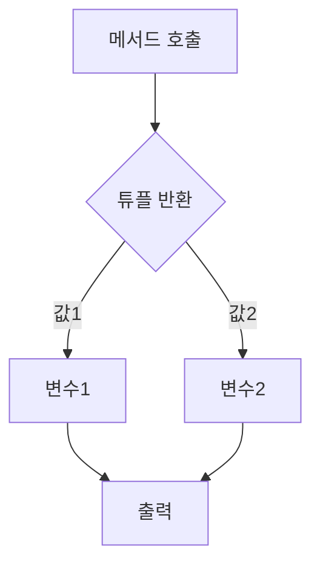

<!--
## 튜플
   - 튜플의 정의 및 기본 개념
   - 튜플 분해의 구문
   - 튜플 분해 방법
     - 명시적 형식 선언
     - 형식 유추 사용
     - 이미 선언된 변수로 분해
     - C# 10의 혼합 선언 및 할당
-->

## 튜플

### 튜플의 정의 및 기본 개념

튜플(Tuple)은 여러 개의 값을 하나의 단위로 묶어주는 데이터 구조이다. C#에서는 튜플을 사용하여 서로 다른 데이터 타입의 값을 함께 저장하고, 이를 쉽게 전달하거나 반환할 수 있다. 튜플은 불변(immutable) 특성을 가지며, 생성 후에는 그 값을 변경할 수 없다. 이러한 특성 덕분에 튜플은 데이터의 일관성을 유지하는 데 유용하다.

### 튜플 분해의 구문

튜플 분해는 튜플의 각 요소를 개별 변수에 할당하는 과정을 의미한다. C#에서는 튜플 분해를 통해 코드의 가독성을 높이고, 여러 값을 동시에 처리할 수 있다. 튜플 분해의 기본 구문은 다음과 같다.

```csharp
var (firstName, lastName) = ("John", "Doe");
```

위의 코드에서 `firstName`과 `lastName` 변수는 각각 튜플의 첫 번째와 두 번째 요소에 할당된다.

### 튜플 분해 방법

#### **명시적 형식 선언**

명시적 형식 선언을 사용하면 튜플의 각 요소에 대해 변수의 타입을 명시적으로 지정할 수 있다. 다음은 명시적 형식 선언을 사용한 튜플 분해의 예이다.

```csharp
(string firstName, string lastName) = ("Jane", "Doe");
```

이 경우, `firstName`과 `lastName` 변수는 각각 `string` 타입으로 선언된다.

#### **형식 유추 사용**

형식 유추를 사용하면 변수의 타입을 명시하지 않고도 튜플의 요소를 분해할 수 있다. C# 컴파일러가 자동으로 타입을 추론한다. 다음은 형식 유추를 사용한 예이다.

```csharp
var (age, height) = (30, 5.9);
```

여기서 `age`는 `int` 타입, `height`는 `double` 타입으로 자동으로 추론된다.

#### **이미 선언된 변수로 분해**

이미 선언된 변수를 사용하여 튜플을 분해할 수도 있다. 이 경우, 변수의 타입은 이미 선언된 타입을 따르게 된다. 다음은 이미 선언된 변수를 사용한 예이다.

```csharp
int x, y;
(x, y) = (10, 20);
```

이 코드에서 `x`와 `y`는 각각 10과 20으로 초기화된다.

#### **C# 10의 혼합 선언 및 할당**

C# 10에서는 혼합 선언 및 할당이 가능해졌다. 이를 통해 튜플의 요소를 분해하면서 동시에 새로운 변수를 선언할 수 있다. 다음은 혼합 선언 및 할당의 예이다.

```csharp
var (name, age) = ("Alice", 25);
int height = 170;
```

이 경우, `name`과 `age`는 튜플에서 분해된 값이고, `height`는 별도로 선언된 변수이다.

### 다이어그램

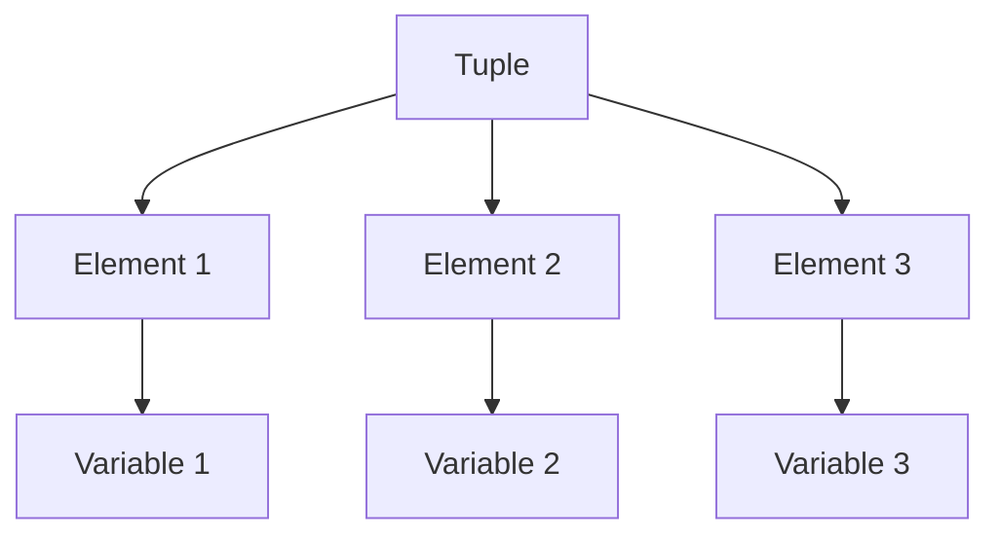

위의 다이어그램은 튜플이 여러 요소로 구성되어 있으며, 각 요소가 개별 변수에 할당되는 과정을 나타낸다. 튜플을 사용하면 여러 값을 효율적으로 관리할 수 있다.

<!--
## 무시 항목이 있는 튜플 요소
   - 무시 항목의 개념
   - 무시 항목을 사용한 튜플 분해 예제
-->

## 무시 항목이 있는 튜플 요소

### 무시 항목의 개념

무시 항목은 튜플 분해 시 특정 요소를 사용하지 않겠다는 의도를 나타내는 기능이다. C#에서는 튜플을 분해할 때, 필요 없는 요소를 무시할 수 있는 문법을 제공한다. 이를 통해 코드의 가독성을 높이고, 불필요한 변수를 선언하지 않아도 된다. 무시 항목은 주로 `_` 기호를 사용하여 표현되며, 이는 해당 요소가 사용되지 않음을 명시적으로 나타낸다.

### 무시 항목을 사용한 튜플 분해 예제

다음은 무시 항목을 사용하여 튜플을 분해하는 간단한 예제이다. 이 예제에서는 튜플의 두 번째 요소를 무시하고, 나머지 요소만을 사용한다.

```csharp
var person = ("John", 30, "Engineer");

// 튜플 분해 시 두 번째 요소를 무시
var (name, _, occupation) = person;

Console.WriteLine($"Name: {name}, Occupation: {occupation}");
```

위의 코드에서 `person` 튜플은 이름, 나이, 직업을 포함하고 있다. 그러나 나이는 필요하지 않으므로 `_`를 사용하여 무시하였다. 결과적으로 출력되는 내용은 다음과 같다.

```
Name: John, Occupation: Engineer
```

### 다이어그램

다음은 무시 항목을 사용한 튜플 분해 과정을 나타내는 다이어그램이다.

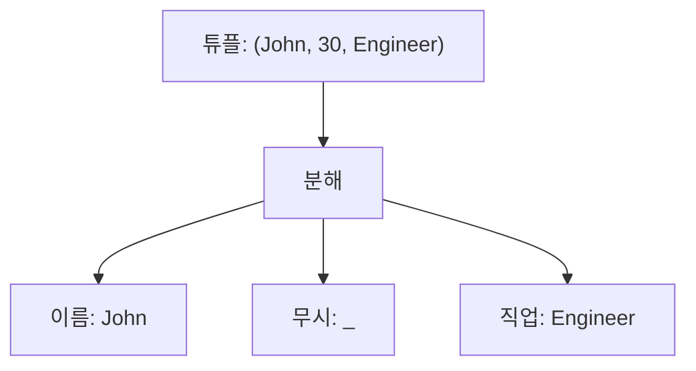

이 다이어그램은 튜플을 분해하는 과정을 시각적으로 나타내며, 무시 항목이 어떻게 사용되는지를 보여준다. 무시 항목을 통해 필요한 정보만을 선택적으로 사용할 수 있음을 알 수 있다. 

무시 항목은 특히 많은 데이터를 다루는 경우 유용하며, 코드의 간결함과 명확성을 높이는 데 기여한다.

<!--
## 사용자 정의 형식
   - 사용자 정의 형식에서의 분해
   - `Deconstruct` 메서드의 구현
   - 다양한 조합으로 반환하는 `Deconstruct` 메서드 오버로드 예제
-->

## 사용자 정의 형식

사용자 정의 형식은 개발자가 필요에 따라 정의할 수 있는 데이터 구조이다. C#에서는 클래스나 구조체를 사용하여 사용자 정의 형식을 만들 수 있으며, 이러한 형식은 튜플과 유사한 방식으로 분해할 수 있다. 사용자 정의 형식에서의 분해는 코드의 가독성을 높이고, 데이터의 구조를 명확하게 표현하는 데 도움을 준다.

**사용자 정의 형식에서의 분해**

사용자 정의 형식에서 분해를 수행하기 위해서는 `Deconstruct` 메서드를 구현해야 한다. 이 메서드는 객체의 속성을 분해하여 여러 개의 변수에 할당할 수 있도록 해준다. 예를 들어, 다음과 같은 사용자 정의 형식이 있다고 가정해보자.

```csharp
public class Point
{
    public int X { get; }
    public int Y { get; }

    public Point(int x, int y)
    {
        X = x;
        Y = y;
    }

    public void Deconstruct(out int x, out int y)
    {
        x = X;
        y = Y;
    }
}
```

위의 코드에서 `Point` 클래스는 `X`와 `Y`라는 두 개의 속성을 가지고 있으며, `Deconstruct` 메서드를 통해 이 속성들을 분해할 수 있다. 이제 이 클래스를 사용하는 방법은 다음과 같다.

```csharp
var point = new Point(3, 4);
var (x, y) = point; // Deconstruct 메서드를 통해 분해
Console.WriteLine($"X: {x}, Y: {y}");
```

이와 같이 `Deconstruct` 메서드를 구현하면, 사용자 정의 형식의 인스턴스를 간편하게 분해할 수 있다.

**Deconstruct 메서드의 구현**

`Deconstruct` 메서드는 반환할 값을 `out` 매개변수로 정의하여, 객체의 속성을 외부 변수에 할당할 수 있도록 한다. 이 메서드는 선택적으로 여러 개의 매개변수를 가질 수 있으며, 이를 통해 다양한 조합으로 값을 반환할 수 있다.

**다양한 조합으로 반환하는 Deconstruct 메서드 오버로드 예제**

`Deconstruct` 메서드는 오버로드가 가능하므로, 다양한 방식으로 값을 반환할 수 있다. 예를 들어, 다음과 같이 `Point` 클래스를 수정하여 두 가지 형태의 `Deconstruct` 메서드를 제공할 수 있다.

```csharp
public class Point
{
    public int X { get; }
    public int Y { get; }

    public Point(int x, int y)
    {
        X = x;
        Y = y;
    }

    public void Deconstruct(out int x, out int y)
    {
        x = X;
        y = Y;
    }

    public void Deconstruct(out int x)
    {
        x = X;
    }
}
```

이제 `Deconstruct` 메서드를 호출할 때, 필요한 매개변수의 수에 따라 적절한 메서드가 호출된다. 다음은 이 클래스를 사용하는 예제이다.

```csharp
var point = new Point(5, 10);
var (x, y) = point; // 두 개의 매개변수로 분해
Console.WriteLine($"X: {x}, Y: {y}");

var (xOnly) = point; // 하나의 매개변수로 분해
Console.WriteLine($"X: {xOnly}");
```

이와 같이 사용자 정의 형식에서 `Deconstruct` 메서드를 구현하고 오버로드함으로써, 다양한 방식으로 객체를 분해할 수 있다. 이는 코드의 유연성을 높이고, 개발자가 원하는 형태로 데이터를 처리할 수 있게 해준다.

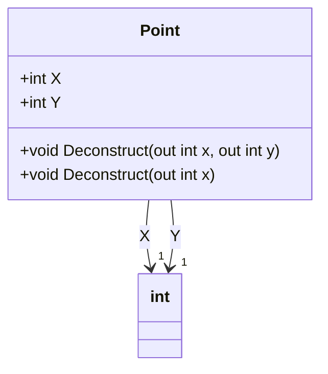

위의 다이어그램은 `Point` 클래스의 구조를 나타내며, `Deconstruct` 메서드의 오버로드를 통해 다양한 방식으로 속성을 분해할 수 있음을 보여준다. 사용자 정의 형식에서의 분해는 코드의 가독성을 높이고, 데이터 구조를 명확하게 표현하는 데 중요한 역할을 한다.

<!--
## 사용자 정의 형식의 확장 메서드
   - 확장 메서드를 통한 분해
   - `PropertyInfo` 클래스에 대한 `Deconstruct` 확장 메서드 예제
-->

## 사용자 정의 형식의 확장 메서드

C#에서는 사용자 정의 형식에 대해 확장 메서드를 정의할 수 있다. 이를 통해 기존 형식에 새로운 기능을 추가할 수 있으며, 특히 형식 분해와 같은 작업을 보다 간편하게 수행할 수 있다. 확장 메서드는 정적 클래스 내에 정적 메서드로 정의되며, 첫 번째 매개변수에 `this` 키워드를 사용하여 확장할 형식을 지정한다.

### **확장 메서드를 통한 분해**

사용자 정의 형식에 대한 확장 메서드를 사용하면, 해당 형식의 인스턴스를 보다 쉽게 분해할 수 있다. 예를 들어, 다음과 같은 사용자 정의 형식 `Person`이 있다고 가정하자.

```csharp
public class Person
{
    public string FirstName { get; set; }
    public string LastName { get; set; }
}
```

이제 `Person` 형식에 대한 `Deconstruct` 확장 메서드를 정의할 수 있다.

```csharp
public static class PersonExtensions
{
    public static void Deconstruct(this Person person, out string firstName, out string lastName)
    {
        firstName = person.FirstName;
        lastName = person.LastName;
    }
}
```

이제 `Person` 객체를 다음과 같이 분해할 수 있다.

```csharp
var person = new Person { FirstName = "John", LastName = "Doe" };
var (firstName, lastName) = person;
```

이와 같이 확장 메서드를 사용하면 코드의 가독성을 높이고, 형식 분해를 보다 직관적으로 수행할 수 있다.

### **PropertyInfo 클래스에 대한 Deconstruct 확장 메서드 예제**

`PropertyInfo` 클래스는 리플렉션을 통해 객체의 속성 정보를 제공하는 클래스이다. 이 클래스에 대한 `Deconstruct` 확장 메서드를 정의하여, 속성 이름과 속성 타입을 쉽게 분해할 수 있다.

```csharp
using System.Reflection;

public static class PropertyInfoExtensions
{
    public static void Deconstruct(this PropertyInfo propertyInfo, out string name, out Type type)
    {
        name = propertyInfo.Name;
        type = propertyInfo.PropertyType;
    }
}
```

이제 `PropertyInfo` 객체를 다음과 같이 분해할 수 있다.

```csharp
var propertyInfo = typeof(Person).GetProperty("FirstName");
var (name, type) = propertyInfo;
```

이 예제에서는 `PropertyInfo` 객체에서 속성 이름과 타입을 쉽게 추출할 수 있다. 이러한 방식으로 확장 메서드를 활용하면, 코드의 재사용성과 유지보수성을 높일 수 있다.

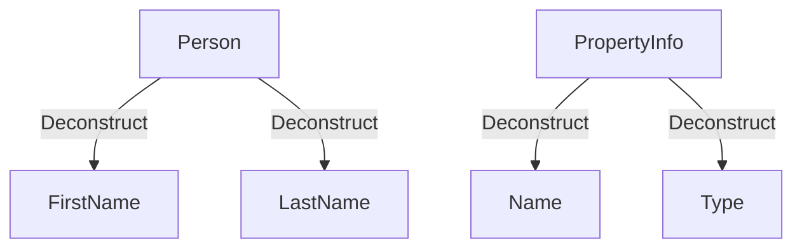

위의 다이어그램은 `Person` 클래스와 `PropertyInfo` 클래스의 `Deconstruct` 확장 메서드를 통해 각각의 속성을 분해하는 과정을 나타낸다. 이러한 방식으로 사용자 정의 형식에 대한 확장 메서드를 정의하면, 코드의 가독성과 효율성을 높일 수 있다.

<!--
## 시스템 형식의 확장 메서드
   - 시스템 형식에서의 `Deconstruct` 메서드 사용
   - `Nullable<T>` 형식의 확장 메서드 예제
-->

## 시스템 형식의 확장 메서드

### 시스템 형식에서의 `Deconstruct` 메서드 사용

C#에서는 시스템 형식에 대해 `Deconstruct` 메서드를 정의하여, 객체의 속성을 쉽게 분해할 수 있다. 이를 통해 코드의 가독성을 높이고, 데이터의 구조를 명확하게 표현할 수 있다. 시스템 형식에 대한 `Deconstruct` 메서드는 주로 `ValueTuple`과 같은 기본 제공 형식에서 사용된다.

**예제 코드:**

```csharp
using System;

public class Program
{
    public static void Main()
    {
        var point = new Point(3, 4);
        var (x, y) = point; // Deconstructing the Point object
        Console.WriteLine($"X: {x}, Y: {y}");
    }
}

public class Point
{
    public int X { get; }
    public int Y { get; }

    public Point(int x, int y)
    {
        X = x;
        Y = y;
    }

    public void Deconstruct(out int x, out int y)
    {
        x = X;
        y = Y;
    }
}
```

위의 코드에서 `Point` 클래스는 `Deconstruct` 메서드를 구현하여, `Point` 객체를 쉽게 분해할 수 있도록 한다. `Deconstruct` 메서드는 `out` 매개변수를 사용하여 객체의 속성을 반환한다.

### `Nullable<T>` 형식의 확장 메서드 예제

`Nullable<T>` 형식은 값 형식에 대해 null 값을 허용하는 특수한 형식이다. 이 형식에 대해서도 `Deconstruct` 메서드를 구현할 수 있으며, 이를 통해 null 여부와 값을 동시에 처리할 수 있다.

**예제 코드:**

```csharp
using System;

public class Program
{
    public static void Main()
    {
        int? nullableInt = 5;
        var (hasValue, value) = nullableInt; // Deconstructing Nullable<int>
        Console.WriteLine($"Has Value: {hasValue}, Value: {value}");
        
        nullableInt = null;
        (hasValue, value) = nullableInt; // Deconstructing Nullable<int>
        Console.WriteLine($"Has Value: {hasValue}, Value: {value}");
    }
}

public static class NullableExtensions
{
    public static void Deconstruct<T>(this T? nullable, out bool hasValue, out T value) where T : struct
    {
        hasValue = nullable.HasValue;
        value = nullable.GetValueOrDefault();
    }
}
```

위의 코드에서 `NullableExtensions` 클래스는 `Nullable<T>` 형식에 대한 `Deconstruct` 확장 메서드를 정의한다. 이 메서드는 null 여부와 값을 동시에 반환하여, 코드의 간결함을 제공한다.

**다이어그램:**

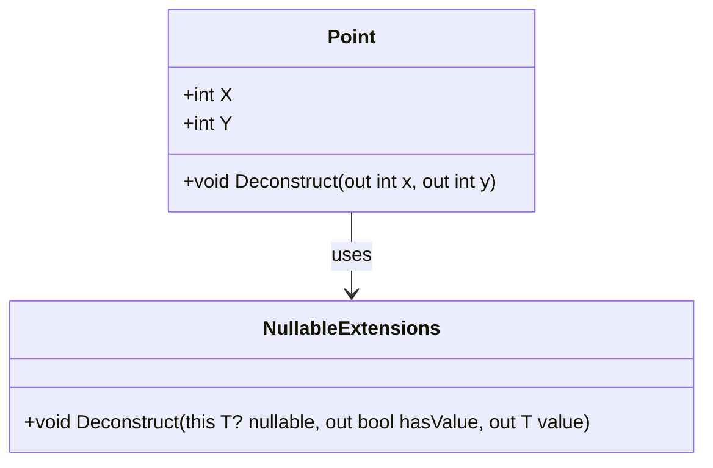

위의 다이어그램은 `Point` 클래스와 `NullableExtensions` 클래스 간의 관계를 나타낸다. `Point` 클래스는 `Deconstruct` 메서드를 통해 객체의 속성을 분해하고, `NullableExtensions` 클래스는 `Nullable<T>` 형식에 대한 분해 기능을 제공한다. 

이와 같이 시스템 형식에 대한 `Deconstruct` 메서드를 활용하면, 코드의 가독성을 높이고, 데이터 구조를 명확하게 표현할 수 있다.

<!--
## `record` 형식
   - `record` 형식의 정의 및 사용
   - `record` 형식의 `Deconstruct` 메서드 자동 생성
-->

## `record` 형식

### `record` 형식의 정의 및 사용

`record` 형식은 C# 9.0에서 도입된 새로운 데이터 구조로, 주로 불변(immutable) 데이터를 표현하는 데 사용된다. `record` 형식은 클래스와 유사하지만, 데이터의 동등성(equality) 비교를 위해 자동으로 `Equals`, `GetHashCode`, `ToString` 메서드를 생성한다. 이러한 특성 덕분에 `record` 형식은 데이터 전송 객체(Data Transfer Object, DTO)나 값 객체(Value Object)를 구현하는 데 매우 유용하다.

`record` 형식은 다음과 같이 정의할 수 있다.

```csharp
public record Person(string FirstName, string LastName);
```

위의 예제에서 `Person`이라는 `record` 형식은 두 개의 속성인 `FirstName`과 `LastName`을 가진다. 이 `record` 형식의 인스턴스를 생성할 때는 다음과 같이 할 수 있다.

```csharp
var person = new Person("John", "Doe");
```

이제 `person` 객체는 `FirstName`과 `LastName` 속성을 가지며, 이 속성들은 기본적으로 불변이다. 즉, 생성 후에는 변경할 수 없다.

### `record` 형식의 `Deconstruct` 메서드 자동 생성

`record` 형식은 자동으로 `Deconstruct` 메서드를 생성하여, 객체의 속성을 쉽게 분해할 수 있도록 지원한다. 이를 통해 `record` 형식의 인스턴스를 튜플처럼 사용할 수 있다. 예를 들어, 다음과 같이 `Deconstruct` 메서드를 활용할 수 있다.

```csharp
var person = new Person("John", "Doe");
var (firstName, lastName) = person;
```

위의 코드에서 `person` 객체의 `FirstName`과 `LastName` 속성을 각각 `firstName`과 `lastName` 변수에 할당할 수 있다. 이처럼 `record` 형식의 `Deconstruct` 메서드는 코드의 가독성을 높이고, 데이터의 분해를 간편하게 만들어준다.

다음은 `record` 형식과 `Deconstruct` 메서드를 활용한 예제 코드이다.

```csharp
public record Person(string FirstName, string LastName);

public class Program
{
    public static void Main()
    {
        var person = new Person("John", "Doe");
        var (firstName, lastName) = person;

        Console.WriteLine($"First Name: {firstName}, Last Name: {lastName}");
    }
}
```

이 코드를 실행하면 다음과 같은 결과가 출력된다.

```
First Name: John, Last Name: Doe
```

### 다이어그램

다음은 `record` 형식과 `Deconstruct` 메서드의 관계를 나타내는 다이어그램이다.

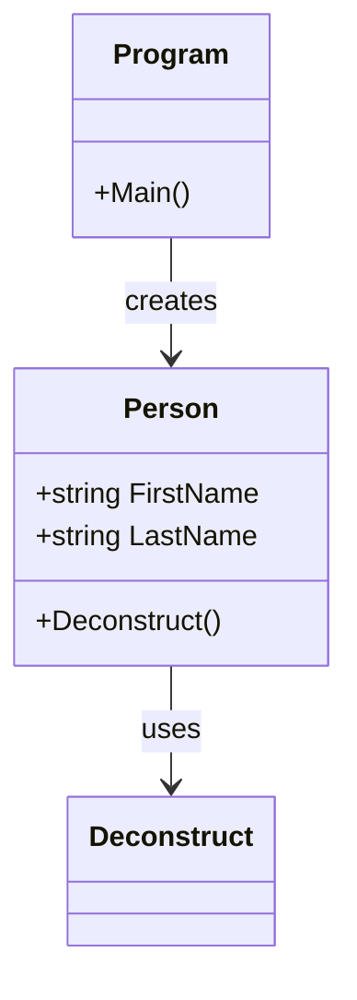

위의 다이어그램에서 `Program` 클래스는 `Person` 객체를 생성하고, `Deconstruct` 메서드를 사용하여 속성을 분해하는 관계를 나타낸다. `record` 형식은 데이터의 구조를 명확하게 정의하고, 이를 쉽게 사용할 수 있도록 돕는 중요한 기능이다.

<!--
## 예제
   - 튜플 및 형식 분해를 활용한 실제 코드 예제
   - 사용자 정의 형식의 분해 예제
-->

## 예제

### 튜플 및 형식 분해를 활용한 실제 코드 예제

C#에서 튜플은 여러 값을 하나의 단위로 묶어 반환할 수 있는 유용한 기능이다. 튜플을 사용하면 메서드에서 여러 값을 반환할 때 유용하게 활용할 수 있다. 아래는 튜플을 활용한 간단한 코드 예제이다.

```csharp
public (int, string) GetPersonInfo()
{
    int age = 30;
    string name = "John Doe";
    return (age, name);
}

public void DisplayPersonInfo()
{
    var personInfo = GetPersonInfo();
    Console.WriteLine($"Name: {personInfo.Item2}, Age: {personInfo.Item1}");
}
```

위의 코드에서 `GetPersonInfo` 메서드는 나이와 이름을 튜플로 반환한다. `DisplayPersonInfo` 메서드에서는 이 튜플을 분해하여 값을 출력한다.

**다이어그램:**

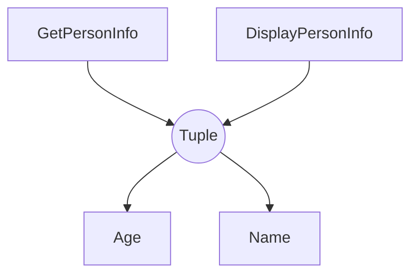

### 사용자 정의 형식의 분해 예제

사용자 정의 형식에서도 형식 분해를 활용할 수 있다. 아래는 사용자 정의 형식과 `Deconstruct` 메서드를 사용한 예제이다.

```csharp
public class Person
{
    public int Age { get; set; }
    public string Name { get; set; }

    public void Deconstruct(out int age, out string name)
    {
        age = Age;
        name = Name;
    }
}

public void DisplayUserInfo()
{
    var person = new Person { Age = 25, Name = "Jane Doe" };
    var (age, name) = person;
    Console.WriteLine($"Name: {name}, Age: {age}");
}
```

위의 코드에서 `Person` 클래스는 `Deconstruct` 메서드를 구현하여 객체의 속성을 분해할 수 있도록 한다. `DisplayUserInfo` 메서드에서는 `Person` 객체를 분해하여 나이와 이름을 출력한다.

**다이어그램:**

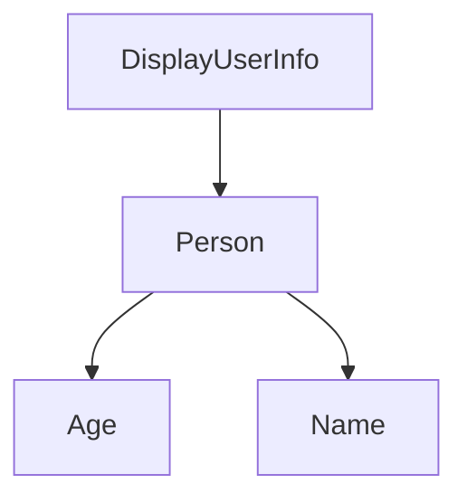

이와 같이 튜플과 사용자 정의 형식의 분해를 통해 코드의 가독성을 높이고, 여러 값을 효율적으로 처리할 수 있다.

<!--
## FAQ
   - 튜플과 형식 분해에 대한 자주 묻는 질문
   - C#에서의 튜플 사용 시 주의사항
-->

## FAQ

### 튜플과 형식 분해에 대한 자주 묻는 질문

**튜플이란 무엇인가?**

튜플(Tuple)은 여러 개의 값을 하나의 단위로 묶어주는 데이터 구조이다. C#에서는 튜플을 사용하여 여러 값을 반환하거나, 관련된 데이터를 그룹화할 수 있다.

**튜플을 사용할 때의 장점은 무엇인가?**

튜플을 사용하면 코드의 가독성이 향상되고, 여러 값을 반환할 때 메서드의 시그니처를 간단하게 유지할 수 있다. 또한, 튜플은 불변(immutable) 특성을 가지므로 데이터의 무결성을 보장할 수 있다.

**형식 분해(Deconstruction)란 무엇인가?**

형식 분해는 튜플이나 사용자 정의 형식의 값을 개별 변수로 분리하는 과정을 의미한다. 이를 통해 각 요소에 쉽게 접근할 수 있다.

**형식 분해를 사용할 때 주의할 점은 무엇인가?**

형식 분해를 사용할 때는 분해할 변수의 수와 순서가 원본 튜플의 요소와 일치해야 한다. 그렇지 않으면 컴파일 오류가 발생할 수 있다.

```csharp
var tuple = (1, "Hello", true);
var (number, text, flag) = tuple; // 형식 분해
```

### C#에서의 튜플 사용 시 주의사항

**튜플의 불변성**

C#의 튜플은 기본적으로 불변이다. 즉, 튜플의 요소를 수정할 수 없으므로, 필요한 경우 새로운 튜플을 생성해야 한다. 이 점을 유의하여 사용해야 한다.

**명명된 튜플 사용**

C# 7.0 이상에서는 튜플의 요소에 이름을 지정할 수 있다. 명명된 튜플을 사용하면 코드의 가독성이 더욱 향상된다.

```csharp
var namedTuple = (Id: 1, Name: "Alice");
Console.WriteLine(namedTuple.Name); // "Alice" 출력
```

**튜플의 성능**

튜플은 간단한 데이터 구조이지만, 많은 요소를 포함하는 경우 성능에 영향을 줄 수 있다. 따라서, 성능이 중요한 경우에는 다른 데이터 구조를 고려하는 것이 좋다.

**다이어그램**

아래는 튜플과 형식 분해의 개념을 설명하는 다이어그램이다.

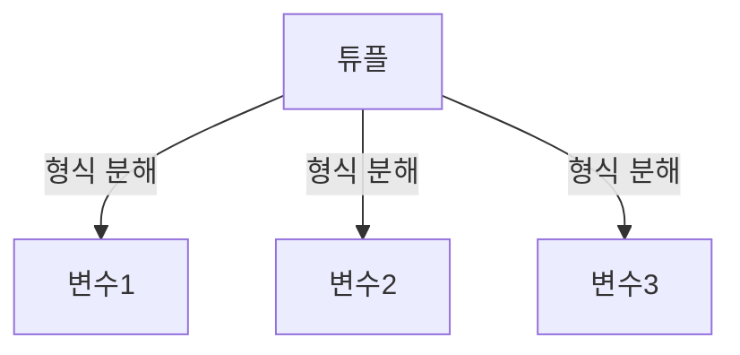

이와 같은 주의사항을 염두에 두고 튜플과 형식 분해를 활용하면, C#에서 더욱 효과적으로 데이터를 관리할 수 있다.

<!--
## 관련 기술
   - C#의 다른 데이터 구조 (예: List, Dictionary)
   - LINQ와의 통합
   - C# 10의 새로운 기능
-->

## 관련 기술

### C#의 다른 데이터 구조 (예: List, Dictionary)

C#에서는 다양한 데이터 구조를 제공하여 개발자가 필요에 따라 적절한 구조를 선택할 수 있도록 한다. 그 중에서도 `List<T>`와 `Dictionary<TKey, TValue>`는 매우 유용한 데이터 구조이다.

- **List<T>**: 동적 배열로, 요소의 추가 및 삭제가 용이하다. 인덱스를 통해 요소에 접근할 수 있으며, 다양한 LINQ 메서드와 함께 사용하여 데이터를 쉽게 조작할 수 있다.
  
- **Dictionary<TKey, TValue>**: 키-값 쌍으로 데이터를 저장하는 해시 테이블 기반의 데이터 구조이다. 키를 통해 빠르게 값을 검색할 수 있으며, 중복된 키를 허용하지 않는다.

다음은 `List<T>`와 `Dictionary<TKey, TValue>`의 간단한 사용 예제이다.

```csharp
// List<T> 사용 예제
List<string> fruits = new List<string> { "Apple", "Banana", "Cherry" };
fruits.Add("Date");
Console.WriteLine(fruits[1]); // 출력: Banana

// Dictionary<TKey, TValue> 사용 예제
Dictionary<int, string> students = new Dictionary<int, string>();
students.Add(1, "Alice");
students.Add(2, "Bob");
Console.WriteLine(students[2]); // 출력: Bob
```

### LINQ와의 통합

LINQ(Language Integrated Query)는 C#에서 데이터 쿼리를 간편하게 수행할 수 있도록 해주는 기능이다. LINQ를 사용하면 `List<T>`와 `Dictionary<TKey, TValue>`와 같은 데이터 구조에서 데이터를 쉽게 필터링, 정렬 및 변환할 수 있다.

예를 들어, `List<T>`에서 특정 조건을 만족하는 요소를 찾는 방법은 다음과 같다.

```csharp
List<int> numbers = new List<int> { 1, 2, 3, 4, 5 };
var evenNumbers = numbers.Where(n => n % 2 == 0).ToList();
```

위의 코드에서 `Where` 메서드를 사용하여 짝수만 필터링하고, 결과를 새로운 리스트로 반환한다.

### C# 10의 새로운 기능

C# 10에서는 여러 가지 새로운 기능이 추가되었다. 그 중에서도 주목할 만한 기능은 다음과 같다.

- **전역 using**: 파일의 최상단에 `using` 지시문을 선언하여 모든 파일에서 사용할 수 있도록 한다.
  
- **파일 스코프 네임스페이스**: 네임스페이스를 파일 전체에 적용할 수 있어 코드의 가독성을 높인다.

- **레코드 구조체**: 레코드 타입을 구조체로 정의할 수 있어 불변성을 유지하면서도 값 타입의 이점을 누릴 수 있다.

다음은 C# 10의 전역 using을 사용하는 예제이다.

```csharp
// 전역 using 예제
global using System;
global using System.Collections.Generic;

// 이제 모든 파일에서 System 및 System.Collections.Generic을 사용할 수 있다.
```

이와 같은 C#의 다양한 데이터 구조와 LINQ의 통합, 그리고 C# 10의 새로운 기능들은 개발자가 더 효율적으로 코드를 작성할 수 있도록 돕는다. 이러한 기술들을 적절히 활용하면 코드의 가독성과 유지보수성을 높일 수 있다.

<!--
## 결론
   - 튜플 및 형식 분해의 장점 요약
   - 향후 개발에서의 활용 가능성
-->

## 결론

### **튜플 및 형식 분해의 장점 요약**

튜플(Tuple)과 형식 분해(Deconstruction)는 C# 프로그래밍에서 매우 유용한 기능이다. 이 두 가지 기능은 코드의 가독성을 높이고, 데이터 구조를 보다 간결하게 다룰 수 있도록 도와준다. 튜플을 사용하면 여러 값을 하나의 객체로 묶을 수 있으며, 형식 분해를 통해 이러한 값을 쉽게 추출할 수 있다. 

주요 장점은 다음과 같다:

1. **가독성 향상**: 튜플을 사용하면 여러 값을 명확하게 그룹화할 수 있어 코드의 가독성이 높아진다.
2. **간결한 코드**: 형식 분해를 통해 변수에 값을 직접 할당할 수 있어 코드가 간결해진다.
3. **유연성**: 튜플은 다양한 데이터 타입을 포함할 수 있어 유연한 데이터 구조를 제공한다.

아래는 튜플과 형식 분해를 활용한 간단한 예제 코드이다.

```csharp
var person = ("John", 30);
var (name, age) = person;

Console.WriteLine($"Name: {name}, Age: {age}");
```

### **향후 개발에서의 활용 가능성**

향후 개발에서 튜플과 형식 분해는 더욱 다양한 방식으로 활용될 가능성이 크다. 특히, 다음과 같은 분야에서 그 활용도가 높아질 것으로 예상된다:

1. **비동기 프로그래밍**: 비동기 메서드에서 여러 값을 반환할 때 튜플을 사용하면 코드가 더욱 깔끔해질 수 있다.
2. **데이터 전송**: API 호출 시 여러 값을 반환해야 할 경우, 튜플을 사용하여 간편하게 데이터를 전송할 수 있다.
3. **함수형 프로그래밍**: 함수형 프로그래밍 패러다임에서 튜플과 형식 분해는 데이터의 불변성을 유지하면서도 효율적인 데이터 처리를 가능하게 한다.

아래는 향후 활용 가능성을 나타내는 다이어그램이다.

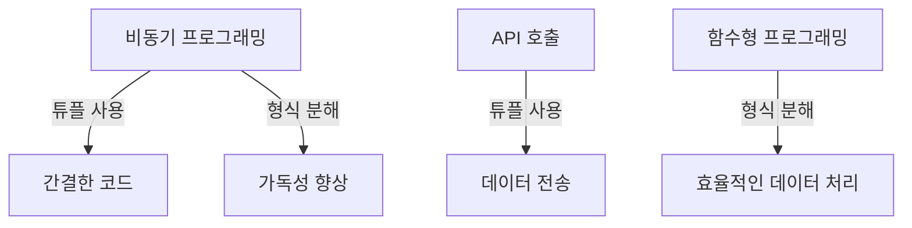

결론적으로, 튜플과 형식 분해는 C# 개발자에게 매우 유용한 도구이며, 앞으로의 개발에서도 그 활용 가능성이 무궁무진하다. 이러한 기능들을 적절히 활용하면 코드의 품질을 높이고, 유지보수성을 향상시킬 수 있다.

<!--
## 참고 항목
   - 관련 문서 및 자료 링크
   - C# 공식 문서 및 튜토리얼
-->

## 참고 항목

### 관련 문서 및 자료 링크

C#에서 튜플과 형식 분해에 대한 더 깊은 이해를 원한다면, 다음의 자료를 참고하는 것이 좋다. 

- [C# 10 Features](https://docs.microsoft.com/en-us/dotnet/csharp/whats-new/csharp-10)

이 외에도 다양한 블로그와 커뮤니티에서 C#의 튜플과 형식 분해에 대한 논의가 이루어지고 있으니, 검색을 통해 추가 자료를 찾아보는 것도 유익하다.

### C# 공식 문서 및 튜토리얼

C#의 공식 문서는 튜플과 형식 분해에 대한 기초부터 심화 내용까지 폭넓은 정보를 제공한다. 특히, 튜플의 사용 사례와 형식 분해의 구문에 대한 예제는 실무에서 매우 유용하다. 

- [C# Official Documentation](https://docs.microsoft.com/en-us/dotnet/csharp/)

이러한 자료들은 C#을 배우고자 하는 개발자에게 큰 도움이 될 것이다.

### 샘플 코드

다음은 튜플을 사용하여 두 개의 값을 반환하고, 형식 분해를 통해 이를 사용하는 간단한 예제이다.

```csharp
public (int, int) GetCoordinates()
{
    return (10, 20);
}

public void Example()
{
    var (x, y) = GetCoordinates();
    Console.WriteLine($"X: {x}, Y: {y}");
}
```

위의 코드에서 `GetCoordinates` 메서드는 튜플을 반환하고, `Example` 메서드에서는 형식 분해를 통해 튜플의 값을 각각 `x`와 `y` 변수에 할당한다.

### 다이어그램

다음은 튜플과 형식 분해의 관계를 나타내는 다이어그램이다.

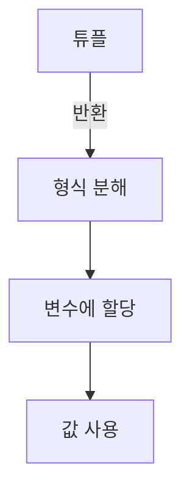

이 다이어그램은 튜플이 어떻게 형식 분해를 통해 변수에 할당되고, 이후에 값이 사용되는지를 시각적으로 나타낸다. 

이와 같은 자료들은 C#의 튜플과 형식 분해를 이해하는 데 큰 도움이 될 것이다.

<!--
##### Reference #####
-->

## Reference


* [https://learn.microsoft.com/ko-kr/dotnet/csharp/fundamentals/functional/deconstruct](https://learn.microsoft.com/ko-kr/dotnet/csharp/fundamentals/functional/deconstruct)

