투 포인터 알고리즘은 1차원 배열에서 두 개의 포인터를 조작하여 원하는 값을 찾는 효율적인 탐색 기법이다. 이 알고리즘은 주로 정렬된 배열에서 특정 조건을 만족하는 쌍을 찾는 데 사용된다. 예를 들어, 주어진 배열에서 두 수의 합이 특정 목표값과 일치하는 쌍을 찾는 문제를 해결할 수 있다. 투 포인터 기법은 배열의 양 끝에서 시작하여, 두 포인터를 이동시키며 조건을 만족하는 쌍을 찾는 방식으로 작동한다. 이 과정에서 한 포인터는 왼쪽에서 오른쪽으로, 다른 포인터는 오른쪽에서 왼쪽으로 이동한다. 이 방법은 O(n)의 시간 복잡도로 문제를 해결할 수 있어, 기존의 O(n^2) 시간 복잡도를 가진 중첩 루프 방식보다 훨씬 효율적이다. 투 포인터 알고리즘은 다양한 문제에 적용될 수 있으며, 특히 배열의 합, 부분 배열의 합, 특정 조건을 만족하는 연속적인 수열을 찾는 문제에서 유용하다. 이 알고리즘을 통해 우리는 더 나은 성능을 가진 코드를 작성할 수 있으며, 이는 실제 프로그래밍 인터뷰에서도 자주 등장하는 주제이다.

<!--
##### Outline #####
-->

<!--
# 목차: Two Pointers 기법

## 개요
   - Two Pointers 기법의 정의
   - 사용 사례 및 장점
   - 시간 복잡도 및 공간 복잡도

## Two Pointers 기법의 동작 원리
   - 기본 개념
   - 포인터 초기화 및 조건 설정
   - 포인터 이동 방식

## 문제 해결을 위한 예제
   - 예제 1: 주어진 합을 가지는 두 수 찾기
     - 입력 및 출력 예시
     - 설명 및 코드 구현
   - 예제 2: 부분 연속 수열의 합 찾기
     - 입력 및 출력 예시
     - 설명 및 코드 구현

## 다양한 프로그래밍 언어로의 구현
   - C++
   - Python
   - Java
   - C#
   - JavaScript

## 더 나은 접근법
   - Naive Method (O(n^2) 시간 복잡도)
   - Binary Search
   - Hashing 기법

## Two Pointers 기법의 장단점
   - 장점: 효율성 및 간결성
   - 단점: 특정 조건에서만 유효함 (예: 정렬된 배열)

## Two Pointers 기법을 활용한 문제들
   - Two Sum 문제
   - Three Sum 문제
   - Four Sum 문제
   - Trapping Rain Water 문제

## FAQ
   - Q1: Two Pointers 기법은 언제 사용해야 하나요?
   - Q2: 이 기법의 시간 복잡도는 어떻게 되나요?
   - Q3: Two Pointers 기법이 아닌 다른 방법으로 해결할 수 있는 문제는 무엇인가요?

## 관련 기술
   - Sliding Window 기법
   - Binary Search 기법
   - Dynamic Programming 기법

## 결론
   - Two Pointers 기법의 중요성
   - 실전에서의 활용 가능성
   - 추가 학습 자료 및 참고 링크

이 목차는 Two Pointers 기법에 대한 포괄적인 이해를 돕기 위해 구성되었습니다. 각 섹션은 기법의 기본 개념부터 다양한 예제와 구현 방법, 관련 기술까지 포함하여 독자가 이 기법을 효과적으로 활용할 수 있도록 안내합니다.
-->

<!--
## 개요
   - Two Pointers 기법의 정의
   - 사용 사례 및 장점
   - 시간 복잡도 및 공간 복잡도
-->

## 개요

### Two Pointers 기법의 정의

Two Pointers 기법은 배열이나 리스트와 같은 데이터 구조에서 두 개의 포인터를 사용하여 문제를 해결하는 알고리즘 기법이다. 이 기법은 주로 정렬된 데이터에서 특정 조건을 만족하는 쌍을 찾거나, 특정 범위의 합을 계산하는 데 유용하다. 두 포인터는 일반적으로 배열의 시작과 끝에서 시작하여 서로를 향해 이동하면서 조건을 검사한다.

### 사용 사례 및 장점

Two Pointers 기법은 다양한 문제 해결에 활용될 수 있다. 예를 들어, 주어진 합을 가지는 두 수를 찾는 문제, 부분 연속 수열의 합을 찾는 문제 등에서 효과적이다. 이 기법의 주요 장점은 다음과 같다:

- **효율성**: O(n) 시간 복잡도로 문제를 해결할 수 있어, Naive Method에 비해 성능이 뛰어나다.
- **간결성**: 코드가 간단하고 이해하기 쉬워 유지보수가 용이하다.

### 시간 복잡도 및 공간 복잡도

Two Pointers 기법의 시간 복잡도는 O(n)이다. 이는 배열의 모든 요소를 한 번씩만 검사하기 때문이다. 공간 복잡도는 O(1)로, 추가적인 데이터 구조를 사용하지 않기 때문에 메모리 사용이 최소화된다. 이러한 특성 덕분에 이 기법은 메모리와 시간 모두에서 효율적인 해결책을 제공한다.

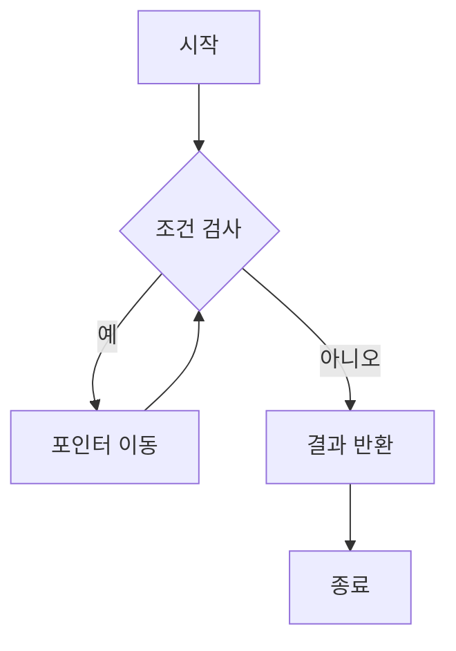

위의 다이어그램은 Two Pointers 기법의 기본적인 흐름을 나타낸다. 조건을 검사하고, 조건이 만족되면 포인터를 이동시키며, 그렇지 않으면 결과를 반환하는 구조이다. 이와 같은 방식으로 문제를 해결할 수 있다.

<!--
## Two Pointers 기법의 동작 원리
   - 기본 개념
   - 포인터 초기화 및 조건 설정
   - 포인터 이동 방식
-->

## Two Pointers 기법의 동작 원리

### 기본 개념

Two Pointers 기법은 배열이나 리스트와 같은 데이터 구조에서 두 개의 포인터를 사용하여 문제를 해결하는 알고리즘 기법이다. 이 기법은 주로 정렬된 배열에서 특정 조건을 만족하는 쌍을 찾거나, 특정 범위의 합을 계산하는 데 유용하다. 두 포인터는 일반적으로 배열의 양 끝에서 시작하여 서로를 향해 이동하거나, 한쪽 방향으로만 이동하면서 조건을 체크하는 방식으로 동작한다.

### 포인터 초기화 및 조건 설정

Two Pointers 기법을 사용할 때, 포인터를 초기화하는 방법은 문제의 요구 사항에 따라 달라진다. 일반적으로 두 포인터는 배열의 시작과 끝에 위치하게 설정된다. 예를 들어, 정렬된 배열에서 두 수의 합이 특정 값이 되는 쌍을 찾는 경우, 하나의 포인터는 배열의 첫 번째 요소를 가리키고, 다른 포인터는 마지막 요소를 가리킨다.

포인터의 이동 조건은 문제에 따라 다르며, 일반적으로 다음과 같은 조건을 설정한다:

- 두 포인터가 서로 교차하지 않을 때까지 반복
- 특정 조건이 만족될 때 포인터 이동

### 포인터 이동 방식

포인터의 이동 방식은 문제의 요구 사항에 따라 다르다. 일반적으로 두 포인터는 다음과 같은 방식으로 이동한다:

1. **양쪽 포인터 이동**: 두 포인터가 서로를 향해 이동하며 조건을 체크한다. 예를 들어, 두 수의 합이 특정 값보다 작으면 왼쪽 포인터를 오른쪽으로 이동시키고, 크면 오른쪽 포인터를 왼쪽으로 이동시킨다.
   
2. **한쪽 포인터 고정**: 한 포인터는 고정하고 다른 포인터를 이동시키는 방식이다. 이 경우, 고정된 포인터의 위치에 따라 조건을 체크하고, 필요한 경우 고정된 포인터를 이동시킨다.

다음은 Two Pointers 기법의 동작을 시각적으로 나타낸 다이어그램이다:

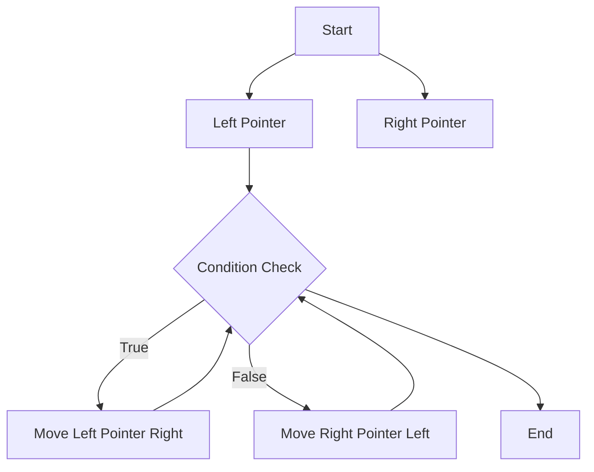

이 다이어그램은 Two Pointers 기법의 기본적인 흐름을 보여준다. 포인터가 조건을 체크하고, 그에 따라 이동하는 과정을 시각적으로 표현하였다. 

이와 같은 방식으로 Two Pointers 기법을 활용하면, 다양한 문제를 효율적으로 해결할 수 있다.

<!--
## 문제 해결을 위한 예제
   - 예제 1: 주어진 합을 가지는 두 수 찾기
     - 입력 및 출력 예시
     - 설명 및 코드 구현
   - 예제 2: 부분 연속 수열의 합 찾기
     - 입력 및 출력 예시
     - 설명 및 코드 구현
-->

## 문제 해결을 위한 예제

### 예제 1: 주어진 합을 가지는 두 수 찾기

**입력 및 출력 예시**

입력: `nums = [2, 7, 11, 15], target = 9`  
출력: `[0, 1]` (nums[0] + nums[1] = 9)

**설명 및 코드 구현**

이 문제는 주어진 배열에서 두 수의 합이 특정 값이 되는 인덱스를 찾는 문제이다. Two Pointers 기법을 사용하여 배열의 양 끝에서 포인터를 설정하고, 두 수의 합을 비교하여 포인터를 이동시키는 방식으로 해결할 수 있다.

다음은 Python으로 구현한 코드이다.

```python
def two_sum(nums, target):
    left, right = 0, len(nums) - 1
    while left < right:
        current_sum = nums[left] + nums[right]
        if current_sum == target:
            return [left, right]
        elif current_sum < target:
            left += 1
        else:
            right -= 1
    return None

# 예제 실행
nums = [2, 7, 11, 15]
target = 9
print(two_sum(nums, target))  # 출력: [0, 1]
```

### 예제 2: 부분 연속 수열의 합 찾기

**입력 및 출력 예시**

입력: `nums = [1, 2, 3, 4, 5], target = 9`  
출력: `[2, 4]` (nums[2] + nums[3] + nums[4] = 9)

**설명 및 코드 구현**

이 문제는 연속된 수의 합이 특정 값이 되는 부분 수열을 찾는 문제이다. Two Pointers 기법을 사용하여 시작 포인터와 끝 포인터를 설정하고, 현재 합이 목표 값보다 작거나 클 때 포인터를 조정하여 해결할 수 있다.

다음은 Python으로 구현한 코드이다.

```python
def subarray_sum(nums, target):
    left, current_sum = 0, 0
    for right in range(len(nums)):
        current_sum += nums[right]
        while current_sum > target and left <= right:
            current_sum -= nums[left]
            left += 1
        if current_sum == target:
            return [left, right]
    return None

# 예제 실행
nums = [1, 2, 3, 4, 5]
target = 9
print(subarray_sum(nums, target))  # 출력: [2, 4]
```

### 다이어그램

다음은 Two Pointers 기법을 사용한 예제의 동작 과정을 나타내는 다이어그램이다.

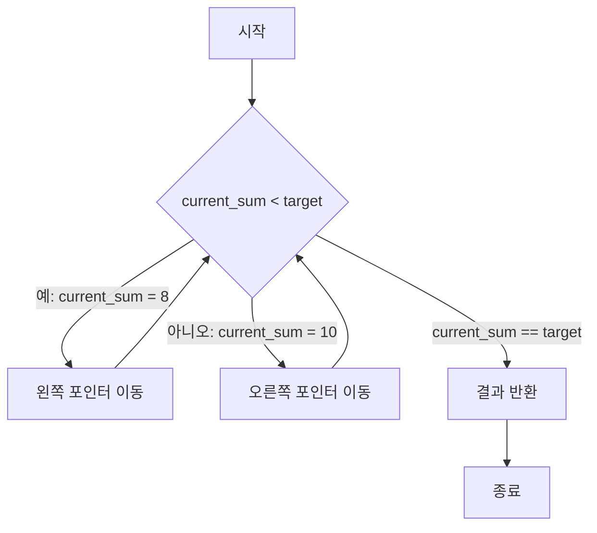

이와 같이 Two Pointers 기법을 활용하여 다양한 문제를 해결할 수 있으며, 효율적인 알고리즘을 구현할 수 있다.

<!--
## 다양한 프로그래밍 언어로의 구현
   - C++
   - Python
   - Java
   - C#
   - JavaScript
-->

## 다양한 프로그래밍 언어로의 구현

Two Pointers 기법은 다양한 프로그래밍 언어에서 쉽게 구현할 수 있다. 각 언어의 문법적 특성과 기능을 활용하여 효율적으로 문제를 해결할 수 있는 방법을 살펴보겠다.

### C++

C++에서 Two Pointers 기법을 구현하는 것은 매우 직관적이다. 다음은 주어진 합을 가지는 두 수를 찾는 예제 코드이다.

```cpp
#include <iostream>
#include <vector>
#include <unordered_map>

using namespace std;

vector<int> twoSum(vector<int>& nums, int target) {
    unordered_map<int, int> numMap;
    for (int i = 0; i < nums.size(); i++) {
        int complement = target - nums[i];
        if (numMap.find(complement) != numMap.end()) {
            return {numMap[complement], i};
        }
        numMap[nums[i]] = i;
    }
    return {};
}
```

### Python

Python에서는 리스트와 딕셔너리를 활용하여 간결하게 구현할 수 있다. 아래는 동일한 문제를 해결하는 Python 코드이다.

```python
def two_sum(nums, target):
    num_map = {}
    for i, num in enumerate(nums):
        complement = target - num
        if complement in num_map:
            return [num_map[complement], i]
        num_map[num] = i
    return []
```

### Java

Java에서는 HashMap을 사용하여 Two Pointers 기법을 구현할 수 있다. 다음은 Java로 작성한 예제 코드이다.

```java
import java.util.HashMap;

public class Solution {
    public int[] twoSum(int[] nums, int target) {
        HashMap<Integer, Integer> numMap = new HashMap<>();
        for (int i = 0; i < nums.length; i++) {
            int complement = target - nums[i];
            if (numMap.containsKey(complement)) {
                return new int[] { numMap.get(complement), i };
            }
            numMap.put(nums[i], i);
        }
        return new int[] {};
    }
}
```

### C#

C#에서도 유사한 방식으로 구현할 수 있다. 아래는 C#으로 작성한 Two Pointers 기법의 예제 코드이다.

```csharp
using System;
using System.Collections.Generic;

public class Solution {
    public int[] TwoSum(int[] nums, int target) {
        Dictionary<int, int> numMap = new Dictionary<int, int>();
        for (int i = 0; i < nums.Length; i++) {
            int complement = target - nums[i];
            if (numMap.ContainsKey(complement)) {
                return new int[] { numMap[complement], i };
            }
            numMap[nums[i]] = i;
        }
        return new int[] {};
    }
}
```

### JavaScript

JavaScript에서도 객체를 활용하여 간단하게 구현할 수 있다. 다음은 JavaScript로 작성한 예제 코드이다.

```javascript
function twoSum(nums, target) {
    const numMap = {};
    for (let i = 0; i < nums.length; i++) {
        const complement = target - nums[i];
        if (numMap[complement] !== undefined) {
            return [numMap[complement], i];
        }
        numMap[nums[i]] = i;
    }
    return [];
}
```

### 다이어그램

다음은 Two Pointers 기법의 동작 원리를 나타내는 다이어그램이다.

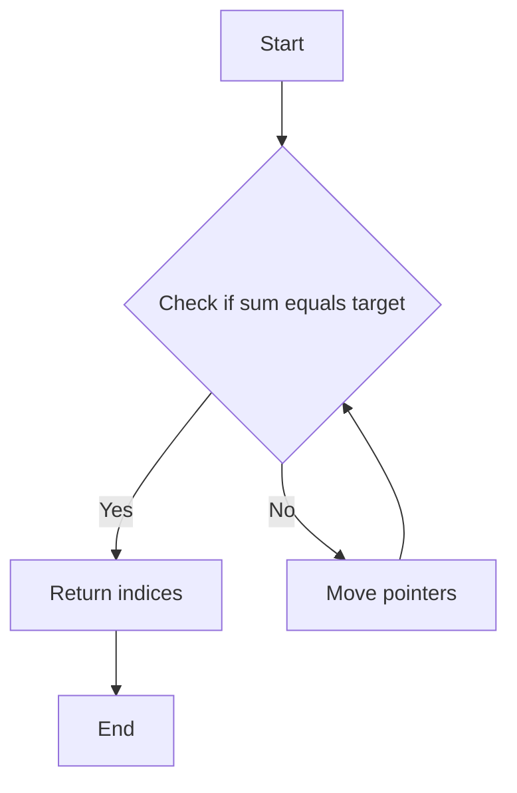

이와 같이 다양한 프로그래밍 언어에서 Two Pointers 기법을 활용하여 문제를 해결할 수 있다. 각 언어의 문법에 맞게 구현하면 효율적인 알고리즘을 작성할 수 있다.

<!--
## 더 나은 접근법
   - Naive Method (O(n^2) 시간 복잡도)
   - Binary Search
   - Hashing 기법
-->

## 더 나은 접근법

Two Pointers 기법은 효율적인 문제 해결을 위한 유용한 방법이지만, 특정 상황에서는 다른 접근법이 더 나은 성능을 발휘할 수 있다. 이 섹션에서는 Naive Method, Binary Search, Hashing 기법에 대해 살펴보겠다.

### Naive Method (O(n^2) 시간 복잡도)

Naive Method는 가장 기본적인 접근법으로, 모든 가능한 조합을 탐색하여 문제를 해결하는 방법이다. 이 방법은 시간 복잡도가 O(n^2)로, 입력 데이터의 크기가 커질수록 성능이 급격히 저하된다. 예를 들어, 두 수의 합을 찾는 문제에서 Naive Method는 다음과 같이 구현할 수 있다.

```python
def two_sum_naive(nums, target):
    for i in range(len(nums)):
        for j in range(i + 1, len(nums)):
            if nums[i] + nums[j] == target:
                return (nums[i], nums[j])
    return None
```

이 코드는 모든 쌍을 비교하여 주어진 합을 찾는다. 그러나 입력 데이터가 커질 경우 비효율적이다.

### Binary Search

Binary Search는 정렬된 배열에서 특정 값을 찾는 데 매우 효율적인 방법이다. 이 기법은 배열을 반으로 나누어 검색 범위를 줄여나가므로 시간 복잡도가 O(log n)이다. Two Pointers 기법과 결합하여 사용할 수 있으며, 예를 들어 정렬된 배열에서 두 수의 합을 찾는 문제를 해결할 수 있다.

```python
def two_sum_binary_search(nums, target):
    nums.sort()  # 배열을 정렬
    for i in range(len(nums)):
        complement = target - nums[i]
        left, right = i + 1, len(nums) - 1
        while left <= right:
            mid = (left + right) // 2
            if nums[mid] == complement:
                return (nums[i], complement)
            elif nums[mid] < complement:
                left = mid + 1
            else:
                right = mid - 1
    return None
```

이 방법은 정렬 과정이 필요하므로 전체 시간 복잡도는 O(n log n)이다.

### Hashing 기법

Hashing 기법은 해시 테이블을 사용하여 특정 값을 빠르게 찾는 방법이다. 이 기법은 평균적으로 O(1)의 시간 복잡도로 값을 검색할 수 있어 매우 효율적이다. Two Pointers 기법과 함께 사용하면, 두 수의 합을 찾는 문제를 빠르게 해결할 수 있다.

```python
def two_sum_hashing(nums, target):
    hash_map = {}
    for num in nums:
        complement = target - num
        if complement in hash_map:
            return (complement, num)
        hash_map[num] = True
    return None
```

이 코드는 해시 테이블을 사용하여 각 수를 저장하고, 주어진 합을 만들 수 있는 수를 빠르게 찾는다.

### 결론

Naive Method는 간단하지만 비효율적이며, Binary Search와 Hashing 기법은 더 나은 성능을 제공한다. 각 접근법은 문제의 특성과 데이터의 상태에 따라 적절히 선택하여 사용해야 한다. 

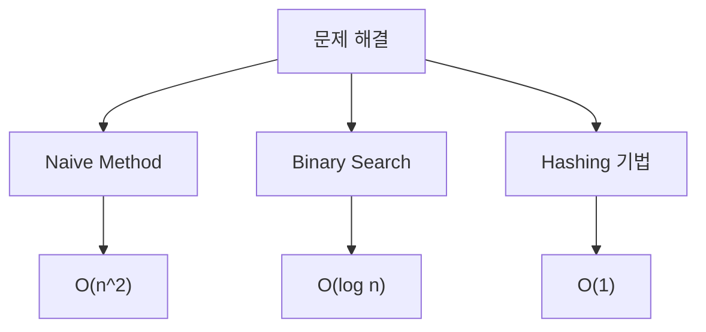

위의 다이어그램은 각 접근법의 시간 복잡도를 시각적으로 나타낸 것이다. 각 방법의 장단점을 이해하고 적절한 상황에서 활용하는 것이 중요하다.

<!--
## Two Pointers 기법의 장단점
   - 장점: 효율성 및 간결성
   - 단점: 특정 조건에서만 유효함 (예: 정렬된 배열)
-->

## Two Pointers 기법의 장단점

### **장점: 효율성 및 간결성**

Two Pointers 기법은 여러 문제를 해결하는 데 있어 매우 효율적이고 간결한 방법이다. 이 기법은 두 개의 포인터를 사용하여 배열이나 리스트를 탐색함으로써, 불필요한 반복을 줄이고 시간 복잡도를 개선할 수 있다. 일반적으로 O(n) 시간 복잡도로 문제를 해결할 수 있어, 특히 대규모 데이터셋을 다룰 때 유리하다.

예를 들어, 정렬된 배열에서 두 수의 합이 특정 값이 되는 경우를 찾는 문제를 생각해보자. 이 경우, 두 포인터를 배열의 양 끝에서 시작하여 합이 목표 값보다 작으면 왼쪽 포인터를 오른쪽으로 이동하고, 크면 오른쪽 포인터를 왼쪽으로 이동하는 방식으로 탐색할 수 있다. 이 방법은 단순한 반복문을 사용하는 것보다 훨씬 효율적이다.

```python
def two_sum(nums, target):
    left, right = 0, len(nums) - 1
    while left < right:
        current_sum = nums[left] + nums[right]
        if current_sum == target:
            return (nums[left], nums[right])
        elif current_sum < target:
            left += 1
        else:
            right -= 1
    return None
```

### **단점: 특정 조건에서만 유효함 (예: 정렬된 배열)**

Two Pointers 기법은 모든 문제에 적용할 수 있는 것은 아니다. 이 기법은 주로 정렬된 배열이나 리스트에서 효과적으로 작동한다. 만약 데이터가 정렬되어 있지 않다면, 포인터를 이동하는 방식이 의미가 없을 수 있으며, 이 경우 다른 알고리즘을 고려해야 한다.

예를 들어, 정렬되지 않은 배열에서 두 수의 합을 찾는 문제를 해결하기 위해 Two Pointers 기법을 사용하면, 포인터의 위치에 따라 잘못된 결과를 도출할 수 있다. 이럴 경우, 해시맵을 사용하는 방법이나 이중 반복문을 사용하는 방법이 더 적합할 수 있다.

```python
def two_sum_unsorted(nums, target):
    num_map = {}
    for i, num in enumerate(nums):
        complement = target - num
        if complement in num_map:
            return (complement, num)
        num_map[num] = i
    return None
```

### 결론

Two Pointers 기법은 효율성과 간결성을 제공하는 강력한 도구이다. 그러나 이 기법이 유효한 조건을 이해하고, 적절한 상황에서 사용하는 것이 중요하다. 정렬된 데이터에서 최적의 성능을 발휘하는 이 기법을 활용하여 다양한 문제를 해결할 수 있다.

<!--
## Two Pointers 기법을 활용한 문제들
   - Two Sum 문제
   - Three Sum 문제
   - Four Sum 문제
   - Trapping Rain Water 문제
-->

## Two Pointers 기법을 활용한 문제들

Two Pointers 기법은 다양한 문제를 효율적으로 해결하는 데 유용하다. 이 섹션에서는 대표적인 문제들을 살펴보며, 각 문제에 대한 설명과 코드 구현을 제공한다.

### Two Sum 문제

**문제 설명:** 주어진 정수 배열과 목표 합이 주어졌을 때, 두 수의 인덱스를 반환하는 문제이다. 두 수는 배열에서 서로 다른 인덱스를 가져야 한다.

**입력 및 출력 예시:**

- 입력: `nums = [2, 7, 11, 15], target = 9`
- 출력: `[0, 1]` (nums[0] + nums[1] = 9)

**설명 및 코드 구현:**

Two Pointers 기법을 사용하여 배열을 정렬한 후, 두 포인터를 사용하여 합을 찾는다.

```python
def two_sum(nums, target):
    nums_with_index = [(num, i) for i, num in enumerate(nums)]
    nums_with_index.sort()  # 정렬
    left, right = 0, len(nums) - 1
    
    while left < right:
        current_sum = nums_with_index[left][0] + nums_with_index[right][0]
        if current_sum == target:
            return [nums_with_index[left][1], nums_with_index[right][1]]
        elif current_sum < target:
            left += 1
        else:
            right -= 1
            
    return []
```

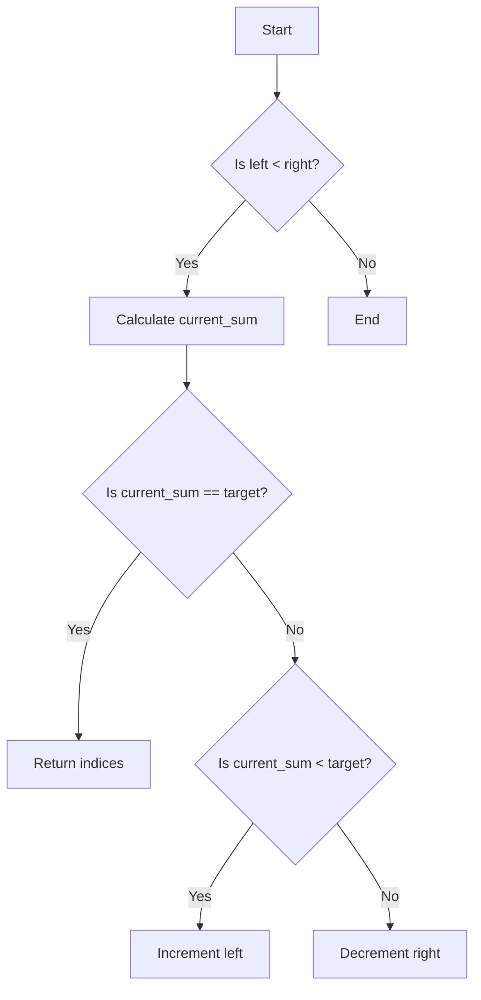

### Three Sum 문제

**문제 설명:** 주어진 정수 배열에서 합이 0인 세 개의 수를 찾는 문제이다. 중복된 조합은 제외해야 한다.

**입력 및 출력 예시:**

- 입력: `nums = [-1, 0, 1, 2, -1, -4]`
- 출력: `[[-1, -1, 2], [-1, 0, 1]]`

**설명 및 코드 구현:**

정렬 후, 첫 번째 포인터를 고정하고 두 번째 포인터를 사용하여 나머지 두 수를 찾는다.

```python
def three_sum(nums):
    nums.sort()
    result = []
    
    for i in range(len(nums) - 2):
        if i > 0 and nums[i] == nums[i - 1]:
            continue  # 중복 제거
        left, right = i + 1, len(nums) - 1
        
        while left < right:
            current_sum = nums[i] + nums[left] + nums[right]
            if current_sum == 0:
                result.append([nums[i], nums[left], nums[right]])
                while left < right and nums[left] == nums[left + 1]:
                    left += 1  # 중복 제거
                while left < right and nums[right] == nums[right - 1]:
                    right -= 1  # 중복 제거
                left += 1
                right -= 1
            elif current_sum < 0:
                left += 1
            else:
                right -= 1
                
    return result
```

### Four Sum 문제

**문제 설명:** 주어진 정수 배열에서 합이 특정 값인 네 개의 수를 찾는 문제이다. 중복된 조합은 제외해야 한다.

**입력 및 출력 예시:**

- 입력: `nums = [1, 0, -1, 0, -2, 2], target = 0`
- 출력: `[[-2, -1, 0, 1], [-2, 0, 0, 2], [-1, 0, 0, 1]]`

**설명 및 코드 구현:**

Three Sum 문제와 유사하게, 네 번째 수를 찾기 위해 첫 번째 포인터를 고정하고 나머지 세 개의 수를 찾는다.

```python
def four_sum(nums, target):
    nums.sort()
    result = []
    
    for i in range(len(nums) - 3):
        if i > 0 and nums[i] == nums[i - 1]:
            continue  # 중복 제거
        for j in range(i + 1, len(nums) - 2):
            if j > i + 1 and nums[j] == nums[j - 1]:
                continue  # 중복 제거
            left, right = j + 1, len(nums) - 1
            
            while left < right:
                current_sum = nums[i] + nums[j] + nums[left] + nums[right]
                if current_sum == target:
                    result.append([nums[i], nums[j], nums[left], nums[right]])
                    while left < right and nums[left] == nums[left + 1]:
                        left += 1  # 중복 제거
                    while left < right and nums[right] == nums[right - 1]:
                        right -= 1  # 중복 제거
                    left += 1
                    right -= 1
                elif current_sum < target:
                    left += 1
                else:
                    right -= 1
                
    return result
```

### Trapping Rain Water 문제

**문제 설명:** 주어진 높이 배열에서 비가 내렸을 때, 얼마나 많은 물이 고일 수 있는지를 계산하는 문제이다.

**입력 및 출력 예시:**

- 입력: `height = [0,1,0,2,1,0,1,3,2,1,2,1]`
- 출력: `6` (고인 물의 양)

**설명 및 코드 구현:**

양쪽에서 포인터를 설정하고, 각 포인터의 최대 높이를 비교하여 물의 양을 계산한다.

```python
def trap(height):
    if not height:
        return 0
    
    left, right = 0, len(height) - 1
    left_max, right_max = height[left], height[right]
    water_trapped = 0
    
    while left < right:
        if left_max < right_max:
            left += 1
            left_max = max(left_max, height[left])
            water_trapped += left_max - height[left]
        else:
            right -= 1
            right_max = max(right_max, height[right])
            water_trapped += right_max - height[right]
    
    return water_trapped
```

이와 같이 Two Pointers 기법은 다양한 문제를 해결하는 데 매우 유용하며, 효율적인 알고리즘을 구현할 수 있도록 돕는다. 각 문제의 접근 방식과 구현 방법을 이해하면, 더 복잡한 문제를 해결하는 데에도 큰 도움이 될 것이다.

<!--
## FAQ
   - Q1: Two Pointers 기법은 언제 사용해야 하나요?
   - Q2: 이 기법의 시간 복잡도는 어떻게 되나요?
   - Q3: Two Pointers 기법이 아닌 다른 방법으로 해결할 수 있는 문제는 무엇인가요?
-->

## FAQ

### Q1: Two Pointers 기법은 언제 사용해야 하나요?

Two Pointers 기법은 주로 정렬된 배열이나 리스트에서 두 개의 포인터를 사용하여 문제를 해결할 때 유용하다. 이 기법은 다음과 같은 상황에서 사용될 수 있다:

- **정렬된 데이터에서 특정 조건을 만족하는 쌍을 찾을 때**: 예를 들어, 두 수의 합이 특정 값이 되는 경우를 찾는 문제에서 효과적이다.
- **부분 연속 수열의 합을 찾을 때**: 연속된 수의 합이 특정 값이 되는 경우, 포인터를 이동시키며 탐색할 수 있다.
- **중복을 제거하거나 특정 조건을 만족하는 요소를 필터링할 때**: 두 포인터를 사용하여 중복된 요소를 건너뛰거나 조건에 맞는 요소만을 선택할 수 있다.

다음은 Two Pointers 기법을 사용한 예시를 나타내는 다이어그램이다:

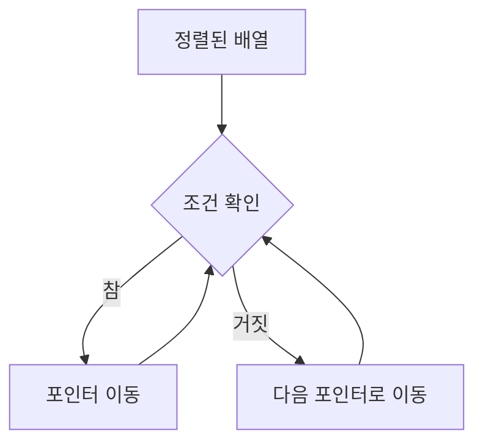

### Q2: 이 기법의 시간 복잡도는 어떻게 되나요?

Two Pointers 기법의 시간 복잡도는 일반적으로 O(n)이다. 이는 배열이나 리스트를 한 번만 순회하기 때문이다. 두 포인터가 각각 배열의 시작과 끝에서 시작하여 서로를 향해 이동하면서 조건을 확인하기 때문에, 최악의 경우에도 모든 요소를 한 번씩만 확인하게 된다. 

공간 복잡도는 O(1)로, 추가적인 데이터 구조를 사용하지 않기 때문에 메모리 사용이 최소화된다. 이러한 특성 덕분에 Two Pointers 기법은 효율적인 알고리즘으로 널리 사용된다.

### Q3: Two Pointers 기법이 아닌 다른 방법으로 해결할 수 있는 문제는 무엇인가요?

Two Pointers 기법이 아닌 다른 방법으로 해결할 수 있는 문제는 다음과 같다:

- **Brute Force 방법**: 모든 가능한 조합을 확인하는 방법으로, 시간 복잡도가 O(n^2)인 경우가 많다. 예를 들어, 두 수의 합을 찾는 문제에서 모든 쌍을 확인하는 방식이다.
- **Hashing 기법**: 해시 테이블을 사용하여 특정 값을 빠르게 찾는 방법이다. 예를 들어, Two Sum 문제에서 해시 맵을 사용하여 시간 복잡도를 O(n)으로 줄일 수 있다.
- **Binary Search**: 정렬된 배열에서 특정 값을 찾는 경우, 이진 탐색을 사용하여 O(log n) 시간 복잡도로 해결할 수 있다.

이러한 방법들은 각각의 문제에 따라 적합할 수 있으며, 상황에 맞는 최적의 알고리즘을 선택하는 것이 중요하다.

<!--
## 관련 기술
   - Sliding Window 기법
   - Binary Search 기법
   - Dynamic Programming 기법
-->

## 관련 기술

Two Pointers 기법은 다양한 알고리즘과 문제 해결 방법과 밀접한 관련이 있다. 이 섹션에서는 Sliding Window 기법, Binary Search 기법, 그리고 Dynamic Programming 기법에 대해 살펴보겠다.

### Sliding Window 기법

Sliding Window 기법은 배열이나 문자열에서 특정 조건을 만족하는 부분 집합을 찾기 위해 사용되는 기법이다. 이 기법은 Two Pointers 기법과 유사하게 두 개의 포인터를 사용하여 효율적으로 문제를 해결할 수 있다. 일반적으로 하나의 포인터는 시작 위치를, 다른 포인터는 끝 위치를 나타내며, 이 두 포인터를 이동시키면서 조건을 체크한다.

**예시 코드 (Python)**:
```python
def max_sum_subarray(arr, k):
    max_sum = 0
    window_sum = sum(arr[:k])
    max_sum = window_sum

    for i in range(len(arr) - k):
        window_sum = window_sum - arr[i] + arr[i + k]
        max_sum = max(max_sum, window_sum)

    return max_sum
```

**다이어그램**:
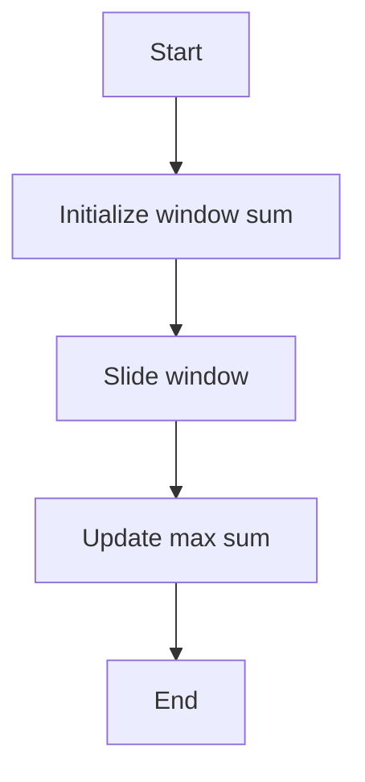

### Binary Search 기법

Binary Search 기법은 정렬된 배열에서 특정 값을 찾기 위해 사용하는 알고리즘이다. 이 기법은 배열의 중간 값을 기준으로 탐색 범위를 반으로 줄여가며 효율적으로 값을 찾는다. Two Pointers 기법과는 다르게, Binary Search는 배열이 정렬되어 있어야만 사용할 수 있다.

**예시 코드 (Python)**:
```python
def binary_search(arr, target):
    left, right = 0, len(arr) - 1

    while left <= right:
        mid = left + (right - left) // 2
        if arr[mid] == target:
            return mid
        elif arr[mid] < target:
            left = mid + 1
        else:
            right = mid - 1

    return -1
```

**다이어그램**:
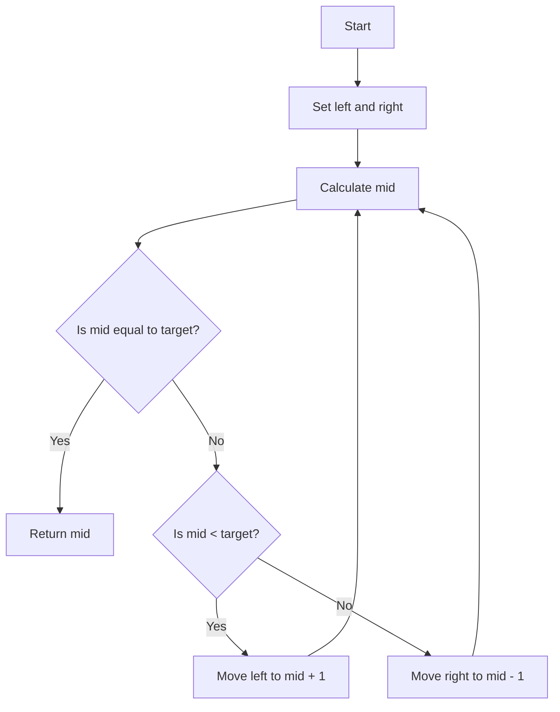

### Dynamic Programming 기법

Dynamic Programming 기법은 복잡한 문제를 더 간단한 하위 문제로 나누어 해결하는 방법이다. 이 기법은 메모이제이션 또는 테이블을 사용하여 중복 계산을 피하고, 최적의 해를 찾는 데 도움을 준다. Two Pointers 기법과 함께 사용될 수 있으며, 특히 최적화 문제에서 유용하다.

**예시 코드 (Python)**:
```python
def fibonacci(n):
    dp = [0] * (n + 1)
    dp[1] = 1

    for i in range(2, n + 1):
        dp[i] = dp[i - 1] + dp[i - 2]

    return dp[n]
```

**다이어그램**:
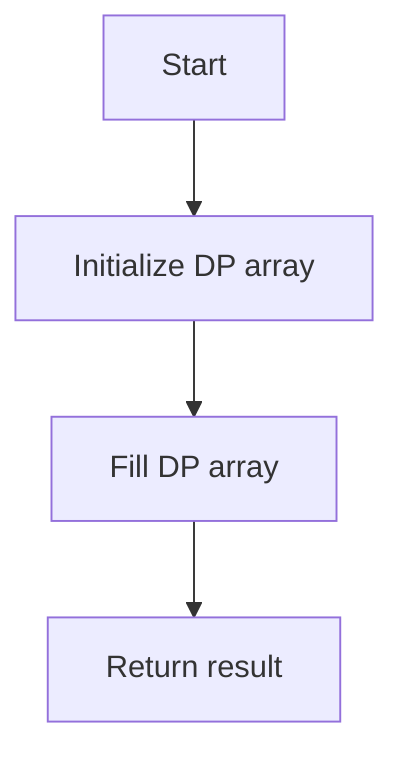

이와 같이 Sliding Window, Binary Search, Dynamic Programming 기법은 각각의 특성과 장점을 가지고 있으며, Two Pointers 기법과 함께 사용될 때 더욱 강력한 문제 해결 도구가 된다.

<!--
## 결론
   - Two Pointers 기법의 중요성
   - 실전에서의 활용 가능성
   - 추가 학습 자료 및 참고 링크
-->

## 결론

### Two Pointers 기법의 중요성

Two Pointers 기법은 알고리즘 문제 해결에서 매우 중요한 역할을 한다. 이 기법은 배열이나 리스트와 같은 데이터 구조를 효율적으로 탐색할 수 있는 방법을 제공하며, 특히 정렬된 데이터에서 유용하다. 시간 복잡도를 O(n)으로 줄일 수 있는 경우가 많아, 대규모 데이터 처리에 적합하다. 이러한 효율성 덕분에 많은 프로그래밍 문제에서 이 기법이 널리 사용되고 있다.

### 실전에서의 활용 가능성

실제 개발 환경에서도 Two Pointers 기법은 다양한 문제를 해결하는 데 활용된다. 예를 들어, 웹 애플리케이션에서 사용자 입력을 처리할 때, 두 개의 포인터를 사용하여 입력된 문자열의 유효성을 검사하거나, 이미지 처리에서 두 개의 포인터를 사용하여 픽셀을 비교하는 등의 작업을 수행할 수 있다. 또한, 데이터 분석 및 머신러닝에서도 이 기법을 활용하여 데이터의 패턴을 찾는 데 도움을 줄 수 있다.

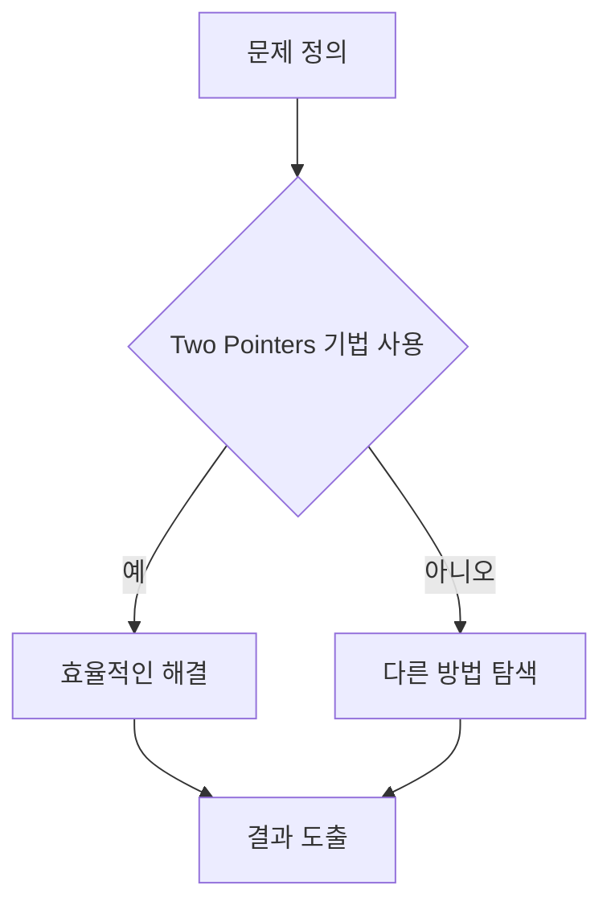

### 추가 학습 자료 및 참고 링크

Two Pointers 기법을 더 깊이 이해하고 싶다면 다음의 자료를 참고하는 것이 좋다:

- [LeetCode - Two Pointers Problems](https://leetcode.com/tag/two-pointers/)
- [GeeksforGeeks - Two Pointers Technique](https://www.geeksforgeeks.org/two-pointers-technique/)
- [YouTube - Two Pointers Algorithm](https://www.youtube.com/results?search_query=two+pointers+algorithm)

이러한 자료들은 Two Pointers 기법을 다양한 문제에 적용하는 방법을 배우는 데 큰 도움이 될 것이다.

<!--
##### Reference #####
-->

## Reference


* [https://www.geeksforgeeks.org/two-pointers-technique/](https://www.geeksforgeeks.org/two-pointers-technique/)
* [https://velog.io/@heyggun/Algorithm-Two-Pointers-Algorithm-%ED%88%AC-%ED%8F%AC%EC%9D%B8%ED%84%B0-%EC%95%8C%EA%B3%A0%EB%A6%AC%EC%A6%98](https://velog.io/@heyggun/Algorithm-Two-Pointers-Algorithm-%ED%88%AC-%ED%8F%AC%EC%9D%B8%ED%84%B0-%EC%95%8C%EA%B3%A0%EB%A6%AC%EC%A6%98)
* [https://butter-shower.tistory.com/226](https://butter-shower.tistory.com/226)
* [https://ssungkang.tistory.com/entry/Algorithm-Two-Pointers-%ED%88%AC-%ED%8F%AC%EC%9D%B8%ED%84%B0](https://ssungkang.tistory.com/entry/Algorithm-Two-Pointers-%ED%88%AC-%ED%8F%AC%EC%9D%B8%ED%84%B0)

