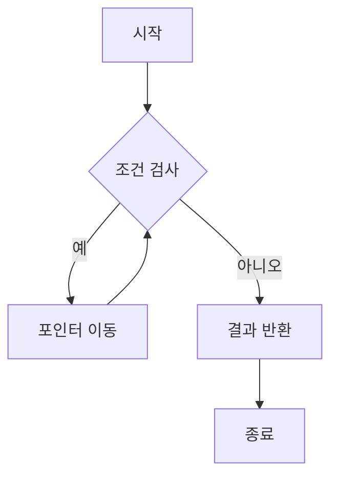
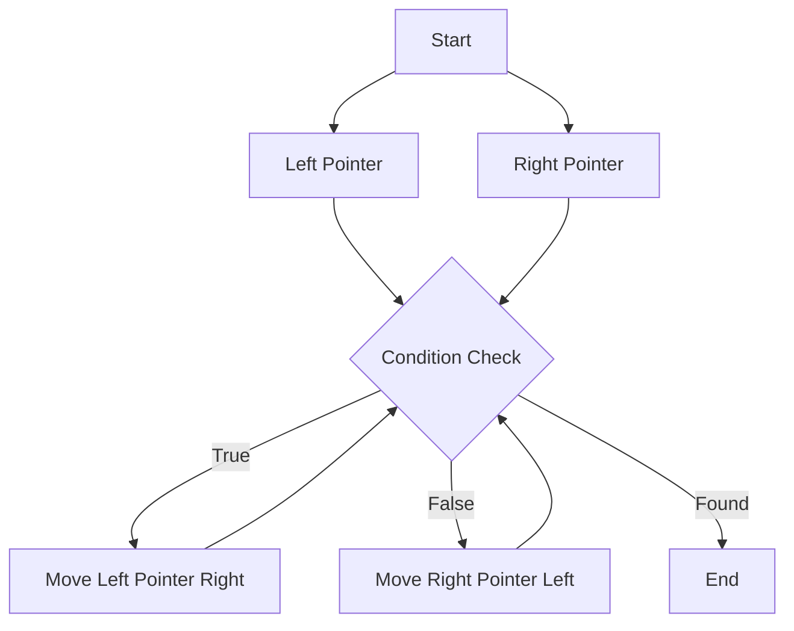
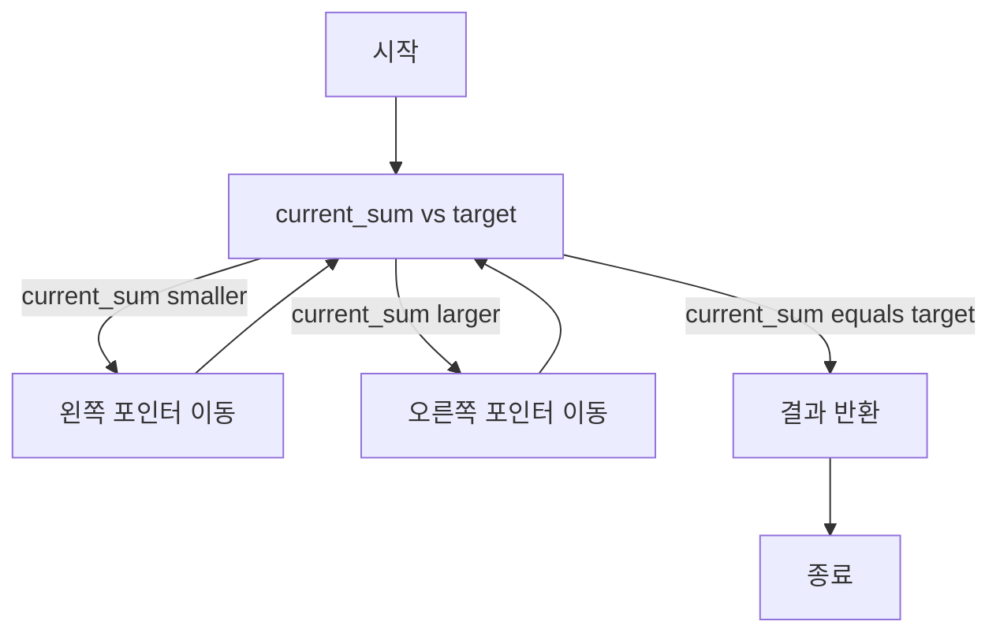
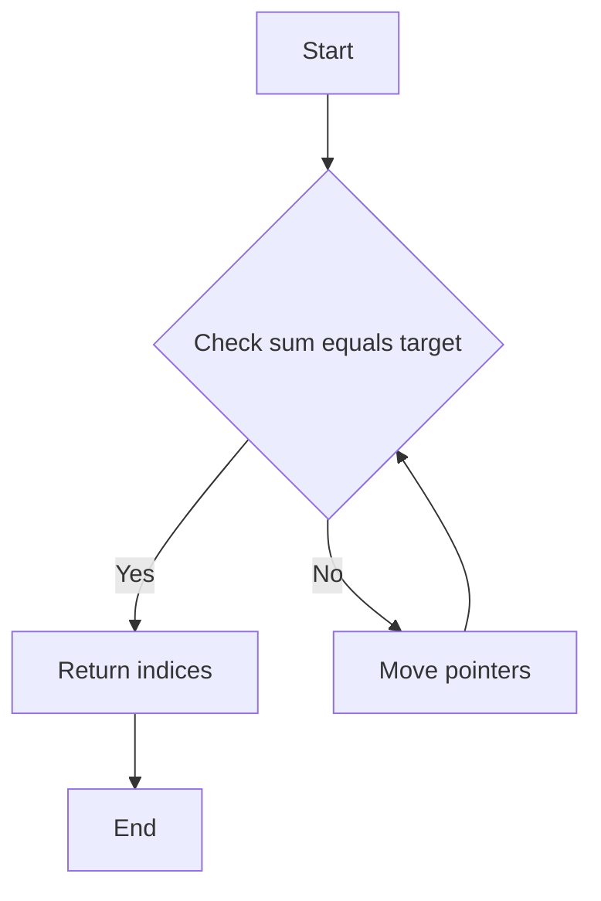
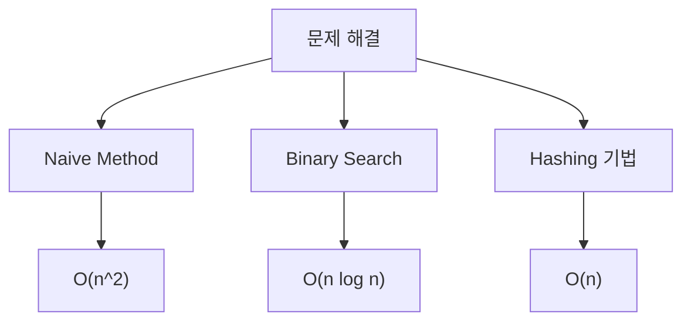
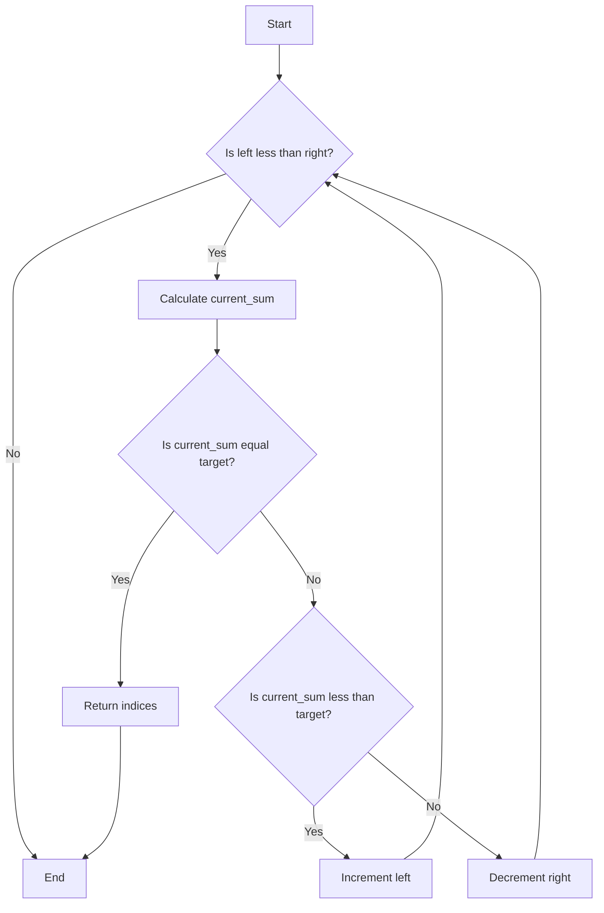
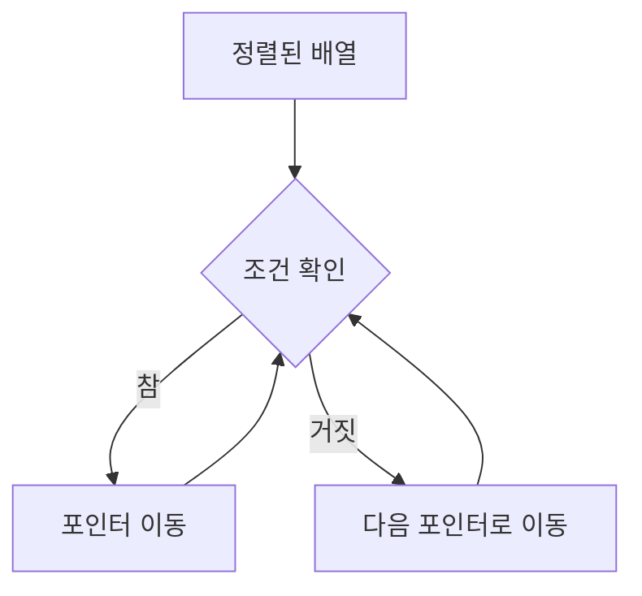

투 포인터(Two Pointers) 알고리즘은 1차원 배열·리스트에서 두 개의 인덱스(포인터)를 조작해 구간 합, 목표 합 쌍, 연속 부분 수열 등을 **O(n)** 에 가깝게 푸는 탐색 기법이다. 정렬된 배열에서의 쌍 찾기, 슬라이딩 윈도우와의 관계, 실전 예제와 다국어 구현까지 한 번에 정리한다.

## 알고리즘 개념 정보

**핵심 요약**: 두 개의 포인터(인덱스)를 배열의 앞·뒤 또는 같은 방향으로 이동시키며 조건을 만족하는 구간·쌍을 찾는다. 정렬된 배열에서는 합이 목표보다 작으면 한쪽 포인터를 진행, 크면 반대쪽을 진행하는 방식으로 불필요한 탐색을 줄인다.

**적용 유형**:
- 정렬된 배열에서 두 수의 합이 target인 쌍 찾기
- 연속 부분 수열의 합이 target인 구간 찾기
- Three Sum / Four Sum (한 포인터 고정 + 나머지 두 포인터)
- Trapping Rain Water, Palindrome 검사, Linked List 순환 탐지 등

**복잡도 요약**:

| 항목 | 복잡도 | 비고 |
|---|---|---|
| **시간 복잡도** | $O(n)$ | 양끝 포인터 이동 시 최대 2n회; 동방향 스위핑도 각 포인터가 배열을 한 번씩만 지남 |
| **공간 복잡도** | $O(1)$ | 추가 자료구조 없이 두 인덱스만 사용 (정렬 시 O(n) 또는 제자리 정렬에 따름) |

---

## 개요

### Two Pointers 기법의 정의

Two Pointers 기법은 배열·리스트 같은 1차원 구조에서 **두 개의 포인터(인덱스)** 를 움직여 조건을 만족하는 구간이나 쌍을 찾는 알고리즘 패턴이다. 주로 **정렬된 데이터**에서 “두 수의 합 = target” 또는 **연속 부분 수열의 합** 문제에 쓰이며, Naive 이중 루프 O(n²)를 O(n)으로 줄일 수 있다.

### 사용 사례 및 장점

- **정렬된 배열에서 target 합 쌍**: left=0, right=n-1에서 시작해 `sum < target`이면 left++, `sum > target`이면 right--.
- **연속 부분 수열 합**: 구간 [left, right]의 합을 유지하며 right 확장 / left 수축으로 목표 합 구간 탐색.
- **Three Sum / Four Sum**: 한(두) 개 인덱스 고정 후 나머지를 두 포인터로 O(n)에 처리.
- **장점**: 구현이 단순하고, 시간·공간 복잡도가 좋으며, 코딩 테스트·인터뷰에서 자주 등장한다.

### 시간·공간 복잡도

| 항목 | 복잡도 | 비고 |
|---|---|---|
| **시간 복잡도** | $O(n)$ | 각 원소를 포인터가 최대 한두 번만 방문 |
| **공간 복잡도** | $O(1)$ | 포인터 변수만 사용 시 (입력 정렬이 필요하면 정렬 비용 별도) |


```mermaid
flowchart TD
    startNode["시작"] --> conditionCheck{"조건 검사"}
    conditionCheck -->|"예"| movePointers["포인터 이동"]
    conditionCheck -->|"아니오"| returnResult["결과 반환"]
    movePointers --> conditionCheck
    returnResult --> endNode["종료"]
```

위 흐름은 “조건 검사 → 만족하면 포인터 이동, 아니면 결과 반환”이라는 Two Pointers의 기본 루프를 나타낸다.

---

## Two Pointers 기법의 동작 원리

### 기본 개념

두 포인터는 보통 **배열의 양끝**(left=0, right=n-1)에서 시작해 서로를 향해 이동하거나, **같은 방향**(둘 다 0에서 시작해 right가 앞서 가며 구간 합 유지)으로만 이동한다. 정렬된 배열에서 “합 = target”일 때는, 합이 작으면 값을 키우기 위해 left를 오른쪽으로, 합이 크면 right를 왼쪽으로 옮긴다.

### 포인터 초기화 및 조건 설정

- **양끝 이동형**: `left = 0`, `right = len(arr) - 1`. 루프 조건 `left < right` (또는 `left <= right`는 문제에 따라).
- **동방향형(구간 합)**: `left = 0`, `right = 0` 또는 `right`만 for로 진행하면서 `current_sum`을 갱신하고, `current_sum > target`이면 `left`를 당긴다.

포인터 이동 조건은 “합과 target의 대소 비교” 또는 “구간 속성(예: 중복 제거, 구간 길이)”에 따라 설정한다.

### 포인터 이동 방식

1. **양쪽 포인터 이동**: `sum < target` → left++; `sum > target` → right--; `sum == target` → 정답 처리 후 left++ 또는 right--.
2. **한쪽 고정·한쪽 진행**: 예) Three Sum에서 첫 번째 수 i를 고정하고, 구간 [i+1, n-1]에서 두 포인터로 “합 = -arr[i]”인 쌍을 찾음.


```mermaid
flowchart TD
    startNode["Start"] --> leftPtr["Left Pointer"]
    startNode --> rightPtr["Right Pointer"]
    leftPtr --> condCheck{"Condition Check"}
    rightPtr --> condCheck
    condCheck -->|"True"| moveLeft["Move Left Pointer Right"]
    condCheck -->|"False"| moveRight["Move Right Pointer Left"]
    moveLeft --> condCheck
    moveRight --> condCheck
    condCheck -->|"Found"| endNode["End"]
```

---

## 문제 해결을 위한 예제

### 예제 1: 주어진 합을 가지는 두 수 찾기 (정렬된 배열)

**입력·출력**: `nums = [2, 7, 11, 15], target = 9` → `[0, 1]` (nums[0] + nums[1] = 9)

정렬된 배열이므로 양끝에서 두 포인터를 움직이며 `current_sum`과 target을 비교한다.

```python
# 42jerrykim.github.io에서 더 많은 정보를 확인할 수 있다
def two_sum(nums, target):
    left, right = 0, len(nums) - 1
    while left < right:
        current_sum = nums[left] + nums[right]
        if current_sum == target:
            return [left, right]
        elif current_sum < target:
            left += 1
        else:
            right -= 1
    return None
```

### 예제 2: 부분 연속 수열의 합 찾기

**입력·출력**: `nums = [1, 2, 3, 4, 5], target = 9` → `[2, 4]` (nums[2]+nums[3]+nums[4] = 9)

오른쪽 포인터로 구간을 넓히고, 합이 target을 초과하면 왼쪽 포인터를 당겨 구간을 줄인다.

```python
# 42jerrykim.github.io에서 더 많은 정보를 확인할 수 있다
def subarray_sum(nums, target):
    left, current_sum = 0, 0
    for right in range(len(nums)):
        current_sum += nums[right]
        while current_sum > target and left <= right:
            current_sum -= nums[left]
            left += 1
        if current_sum == target:
            return [left, right]
    return None
```


```mermaid
flowchart TD
    startNode["시작"] --> sumCheck["current_sum vs target"]
    sumCheck -->|"current_sum smaller"| moveLeft["왼쪽 포인터 이동"]
    sumCheck -->|"current_sum larger"| moveRight["오른쪽 포인터 이동"]
    moveLeft --> sumCheck
    moveRight --> sumCheck
    sumCheck -->|"current_sum equals target"| returnResult["결과 반환"]
    returnResult --> endNode["종료"]
```

---

## 다양한 프로그래밍 언어로의 구현

정렬된 배열에서 “두 수의 합 = target”을 찾는 **Two Pointers** 구현 예시다. (인덱스를 반환하는 버전은 정렬 시 원래 인덱스를 보존해야 하며, 아래는 “값의 쌍” 또는 “정렬된 상태 기준 인덱스”를 반환하는 형태다.)

### C++ (Two Pointers)

```cpp
// 42jerrykim.github.io에서 더 많은 정보를 확인할 수 있다
#include <vector>
using namespace std;

vector<int> twoSumSorted(vector<int>& nums, int target) {
    int left = 0, right = (int)nums.size() - 1;
    while (left < right) {
        int sum = nums[left] + nums[right];
        if (sum == target) return { left, right };
        if (sum < target) left++;
        else right--;
    }
    return {};
}
```

### Python (Two Pointers)

```python
# 42jerrykim.github.io에서 더 많은 정보를 확인할 수 있다
def two_sum(nums, target):
    left, right = 0, len(nums) - 1
    while left < right:
        current_sum = nums[left] + nums[right]
        if current_sum == target:
            return [left, right]
        if current_sum < target:
            left += 1
        else:
            right -= 1
    return []
```

### Java (Two Pointers)

```java
// 42jerrykim.github.io에서 더 많은 정보를 확인할 수 있다
public int[] twoSum(int[] nums, int target) {
    int left = 0, right = nums.length - 1;
    while (left < right) {
        int sum = nums[left] + nums[right];
        if (sum == target) return new int[] { left, right };
        if (sum < target) left++;
        else right--;
    }
    return new int[] {};
}
```

### C# (Two Pointers)

```csharp
// 42jerrykim.github.io에서 더 많은 정보를 확인할 수 있다
public int[] TwoSum(int[] nums, int target) {
    int left = 0, right = nums.Length - 1;
    while (left < right) {
        int sum = nums[left] + nums[right];
        if (sum == target) return new[] { left, right };
        if (sum < target) left++;
        else right--;
    }
    return Array.Empty<int>();
}
```

### JavaScript (Two Pointers)

```javascript
// 42jerrykim.github.io에서 더 많은 정보를 확인할 수 있다
function twoSum(nums, target) {
    let left = 0, right = nums.length - 1;
    while (left < right) {
        const sum = nums[left] + nums[right];
        if (sum === target) return [left, right];
        if (sum < target) left++;
        else right--;
    }
    return [];
}
```


```mermaid
flowchart TD
    startNode["Start"] --> checkSum{"Check sum equals target"}
    checkSum -->|"Yes"| returnIndices["Return indices"]
    checkSum -->|"No"| movePointers["Move pointers"]
    movePointers --> checkSum
    returnIndices --> endNode["End"]
```

---

## 대안 접근법

| 접근법 | 시간 복잡도 | 공간 | 비고 |
|---|---|---|---|
| **Naive (이중 루프)** | $O(n^2)$ | $O(1)$ | 모든 쌍 탐색 |
| **Two Pointers (정렬 후)** | $O(n \log n)$ | $O(1)$ 또는 $O(n)$ | 정렬 비용 포함; 정렬된 배열이면 $O(n)$ |
| **Hashing** | $O(n)$ | $O(n)$ | 정렬 불필요, 인덱스 반환 가능 |
| **Binary Search (한 원소 고정)** | $O(n \log n)$ | $O(1)$ | 고정 후 보수값 이진 탐색 |


```mermaid
flowchart TD
    problem["문제 해결"] --> naive["Naive Method"]
    problem --> binarySearch["Binary Search"]
    problem --> hashing["Hashing 기법"]
    naive --> t2["O(n^2)"]
    binarySearch --> t1["O(n log n)"]
    hashing --> t0["O(n)"]
```

---

## Two Pointers 기법의 장단점

**장점**: O(n)에 가까운 선형 탐색, 코드가 짧고 이해하기 쉬움, 추가 메모리 적음.  
**단점**: 정렬이 필요한 유형에서는 정렬 비용이 들고, “정렬된 배열에서의 쌍 찾기”가 아니면(예: 비정렬 Two Sum) 해싱이 더 나을 수 있다.

---

## Two Pointers 기법을 활용한 문제들

### Two Sum (정렬된 배열 기준)

정렬된 배열에서 합이 target인 두 수의 인덱스. 원본 인덱스가 필요하면 `(값, 인덱스)` 쌍으로 정렬 후 Two Pointers.

```python
# 42jerrykim.github.io에서 더 많은 정보를 확인할 수 있다
def two_sum(nums, target):
    arr = [(v, i) for i, v in enumerate(nums)]
    arr.sort(key=lambda x: x[0])
    left, right = 0, len(arr) - 1
    while left < right:
        s = arr[left][0] + arr[right][0]
        if s == target:
            return [arr[left][1], arr[right][1]]
        if s < target:
            left += 1
        else:
            right -= 1
    return []
```


```mermaid
flowchart TD
    startNode["Start"] --> condLeftRight{"Is left less than right?"}
    condLeftRight -->|"Yes"| calcSum["Calculate current_sum"]
    calcSum --> eqTarget{"Is current_sum equal target?"}
    eqTarget -->|"Yes"| returnIdx["Return indices"]
    eqTarget -->|"No"| cmpTarget{"Is current_sum less than target?"}
    cmpTarget -->|"Yes"| incLeft["Increment left"]
    cmpTarget -->|"No"| decRight["Decrement right"]
    incLeft --> condLeftRight
    decRight --> condLeftRight
    condLeftRight -->|"No"| endNode["End"]
    returnIdx --> endNode
```

### Three Sum

정렬 후 한 인덱스 `i`를 고정하고, 구간 `[i+1, n-1]`에서 합이 `-nums[i]`인 쌍을 Two Pointers로 찾는다. 중복 제거를 위해 같은 값은 스킵한다.

```python
# 42jerrykim.github.io에서 더 많은 정보를 확인할 수 있다
def three_sum(nums):
    nums.sort()
    result = []
    for i in range(len(nums) - 2):
        if i > 0 and nums[i] == nums[i - 1]:
            continue
        left, right = i + 1, len(nums) - 1
        while left < right:
            s = nums[i] + nums[left] + nums[right]
            if s == 0:
                result.append([nums[i], nums[left], nums[right]])
                while left < right and nums[left] == nums[left + 1]:
                    left += 1
                while left < right and nums[right] == nums[right - 1]:
                    right -= 1
                left += 1
                right -= 1
            elif s < 0:
                left += 1
            else:
                right -= 1
    return result
```

### Four Sum

두 인덱스 `i`, `j`를 고정한 뒤 구간 `[j+1, n-1]`에서 Two Pointers로 합이 `target - nums[i] - nums[j]`인 쌍을 찾는다.

```python
# 42jerrykim.github.io에서 더 많은 정보를 확인할 수 있다
def four_sum(nums, target):
    nums.sort()
    result = []
    for i in range(len(nums) - 3):
        if i > 0 and nums[i] == nums[i - 1]:
            continue
        for j in range(i + 1, len(nums) - 2):
            if j > i + 1 and nums[j] == nums[j - 1]:
                continue
            left, right = j + 1, len(nums) - 1
            while left < right:
                s = nums[i] + nums[j] + nums[left] + nums[right]
                if s == target:
                    result.append([nums[i], nums[j], nums[left], nums[right]])
                    while left < right and nums[left] == nums[left + 1]:
                        left += 1
                    while left < right and nums[right] == nums[right - 1]:
                        right -= 1
                    left += 1
                    right -= 1
                elif s < target:
                    left += 1
                else:
                    right -= 1
    return result
```

### Trapping Rain Water

양끝에서 `left_max`, `right_max`를 갱신하며, 더 낮은 쪽의 막대를 기준으로 물 높이를 누적한다.

```python
# 42jerrykim.github.io에서 더 많은 정보를 확인할 수 있다
def trap(height):
    if not height:
        return 0
    left, right = 0, len(height) - 1
    left_max, right_max = height[left], height[right]
    water = 0
    while left < right:
        if left_max < right_max:
            left += 1
            left_max = max(left_max, height[left])
            water += left_max - height[left]
        else:
            right -= 1
            right_max = max(right_max, height[right])
            water += right_max - height[right]
    return water
```


---

## 코너 케이스 및 실수 포인트

| 케이스 | 설명 | 처리 방법 |
|---|---|---|
| **빈 배열** | len(nums) == 0 | 초기 진입 전 검사, 또는 right = -1이 되지 않도록 |
| **원소 1개** | left < right에서 바로 탈출 | 문제가 “정확히 두 개”를 요구하면 불가능 반환 |
| **정렬 가정** | Two Pointers는 정렬된 배열 가정 | 비정렬이면 먼저 정렬하거나 해싱 사용 |
| **중복 쌍** | Three Sum 등에서 같은 조합 중복 | 포인터 이동 시 같은 값 스킵 (while로 건너뛰기) |
| **오버플로우** | 합이 정수 범위 초과 | 언어별 long/bigint 사용 |
| **left == right** | 같은 인덱스 두 번 사용 방지 | 조건을 `left < right`로 유지 |

---

## FAQ

**Q1: Two Pointers는 언제 쓰나요?**  
정렬된 배열에서 “두 수의 합”, 연속 구간 합, 또는 한(두) 개 고정 후 나머지 구간을 선형으로 훑을 때 유용합니다.

**Q2: 시간·공간 복잡도는?**  
전형적으로 시간 O(n), 공간 O(1) (정렬 시 O(n) 또는 O(log n) 스택.)

**Q3: 다른 방법은?**  
비정렬 Two Sum은 해싱 O(n), “쌍 존재 여부만”이면 정렬 후 Two Pointers 또는 이진 탐색으로도 가능합니다.


```mermaid
flowchart TD
    sortedArr["정렬된 배열"] --> condCheck{"조건 확인"}
    condCheck -->|"참"| movePtr["포인터 이동"]
    condCheck -->|"거짓"| nextPtr["다음 포인터로 이동"]
    movePtr --> condCheck
    nextPtr --> condCheck
```

---

## 관련 기술

- **Sliding Window**: 구간 길이가 고정이거나 조건에 따라 한쪽만 움직이는 경우; Two Pointers의 한 형태로 볼 수 있음.
- **Binary Search**: 한 원소 고정 후 “보수” 값을 이진 탐색하면 O(n log n) 풀이.
- **Dynamic Programming**: 구간 최적화(예: 최대 부분 배열 합)는 Kadane 등 DP로도 해결 가능.

---

## 결론

Two Pointers는 정렬된 배열·연속 구간·쌍 찾기 문제에서 **O(n)** 에 가깝게 푸는 실용적인 패턴이다. 구현이 단순하고 코딩 테스트와 인터뷰에서 자주 나오므로, 예제와 코너 케이스를 익혀 두면 유리하다.

### 참고 문헌 및 출처

- [GeeksforGeeks - Two Pointers Technique](https://www.geeksforgeeks.org/two-pointers-technique/)
- [LeetCode - Two Pointers](https://leetcode.com/tag/two-pointers/)
- [티스토리 - 투포인터(Two Pointer) 알고리즘 (butter-shower)](https://butter-shower.tistory.com/226)
- [티스토리 - Two Pointers, 투 포인터 (ssungkang)](https://ssungkang.tistory.com/entry/Algorithm-Two-Pointers-%ED%88%AC-%ED%8F%AC%EC%9D%B8%ED%84%B0)
