데이터 보호는 오늘날 정보 기술 환경에서 매우 중요한 주제이다. 특히, 데이터가 저장된 상태에서의 암호화(data at rest encryption)는 정보 보호의 핵심 방어 수단 중 하나로 자리 잡고 있다. 데이터가 전송 중일 때와는 달리, 저장된 데이터는 이동하지 않지만 여전히 해킹과 같은 위협에 노출되어 있다. 개인 장치에서 기업의 저장 시스템에 이르기까지, 암호화는 무단 접근이 발생하더라도 데이터가 적절한 복호화 키 없이는 읽을 수 없도록 보장한다. 최근 조사에 따르면, 53%의 기업이 1,000개 이상의 민감한 파일과 폴더를 암호화하지 않은 채로 두고 있어 모든 직원이 접근할 수 있는 상황이다. 이러한 문제를 해결하기 위해, 본 글에서는 데이터가 저장된 상태에서의 암호화 방법을 살펴보고, 각 접근 방식의 강점과 한계를 이해하여 저장된 정보를 보다 효과적으로 보호할 수 있는 방법을 제시하고자 한다. 데이터가 저장된 상태에서의 암호화는 개인 정보, 재무 데이터 등 민감한 정보를 보호하는 데 필수적이며, 이를 통해 데이터 유출의 위험을 최소화할 수 있다.

<!--
##### Outline #####
-->

<!--
# 목차

## 개요
   - 데이터 보호의 중요성
   - 데이터가 정지 상태일 때의 위험성
   - 데이터 암호화의 필요성

## 데이터가 정지 상태일 때의 암호화 (Data at Rest Encryption)
   - 데이터가 정지 상태란 무엇인가?
   - 암호화의 기본 개념

## 암호화 방법
   ### 대칭 암호화 (Symmetric Encryption)
   - 정의 및 작동 원리
   - 주요 알고리즘: AES, DES
   - 장점과 단점

   ### 비대칭 암호화 (Asymmetric Encryption)
   - 정의 및 작동 원리
   - 공개 키와 개인 키의 역할
   - 일반적인 사용 사례
   - 장점과 단점

   ### 하이브리드 암호화 (Hybrid Encryption)
   - 정의 및 작동 원리
   - 대칭 및 비대칭 암호화의 조합
   - 실제 적용 사례
   - 장점과 단점

## 파일 수준 암호화 (File-Level Encryption)
   - 정의 및 작동 원리
   - 인기 있는 도구 및 방법: BitLocker, FileVault, VeraCrypt
   - 장점과 단점

## 데이터베이스 암호화 (Database Encryption)
   - 정의 및 중요성
   - 도전 과제 및 모범 사례
   - 키 관리 시스템의 중요성

## 전체 디스크 암호화 (Full-Disk Encryption)
   - 정의 및 작동 원리
   - 주요 도구: BitLocker, FileVault
   - 장점과 단점

## 암호화 방법 선택하기 (Choosing the Right Encryption Method)
   - 위험 평가 (Risk Assessment)
   - 성능 (Performance)
   - 규제 준수 (Regulatory Compliance)

## FAQ
   - 데이터 암호화의 필요성에 대한 일반적인 질문
   - 암호화 키 관리에 대한 질문
   - 암호화 방법의 선택 기준에 대한 질문

## 관련 기술
   - 클라우드 보안 (Cloud Security)
   - 블록체인 기술 (Blockchain Technology)
   - 데이터 프라이버시 법규 (Data Privacy Regulations)

## 결론
   - 데이터가 정지 상태일 때의 암호화 방법 요약
   - 적절한 암호화 방법 선택의 중요성
   - 데이터 보호를 위한 지속적인 노력의 필요성
-->

<!--
## 개요
   - 데이터 보호의 중요성
   - 데이터가 정지 상태일 때의 위험성
   - 데이터 암호화의 필요성
-->

## 개요

데이터 보호의 중요성

현대 사회에서 데이터는 기업과 개인에게 매우 중요한 자산이다. 데이터 유출이나 손실은 재정적 손해뿐만 아니라 신뢰도 하락과 같은 심각한 결과를 초래할 수 있다. 따라서 데이터 보호는 모든 조직의 최우선 과제가 되어야 한다. 데이터 보호를 위한 다양한 방법 중에서도 암호화는 가장 효과적인 수단 중 하나로 자리 잡고 있다.

데이터가 정지 상태일 때의 위험성

데이터가 정지 상태(Data at Rest)란 저장 매체에 저장되어 있는 데이터를 의미한다. 이 상태의 데이터는 외부 공격자나 내부의 악의적인 사용자에 의해 쉽게 접근될 수 있는 위험이 있다. 예를 들어, 하드 드라이브가 도난당하거나, 클라우드 스토리지 서비스의 보안이 취약할 경우, 저장된 데이터는 쉽게 노출될 수 있다. 이러한 위험성을 줄이기 위해서는 데이터가 정지 상태일 때에도 강력한 보호 조치가 필요하다.

데이터 암호화의 필요성

데이터 암호화는 데이터를 읽을 수 없는 형태로 변환하여 무단 접근을 방지하는 기술이다. 암호화된 데이터는 적절한 키 없이는 해독할 수 없기 때문에, 데이터 유출 시에도 정보가 안전하게 보호될 수 있다. 특히, 데이터가 정지 상태일 때 암호화는 필수적이다. 암호화를 통해 데이터의 기밀성을 유지하고, 법적 규제를 준수하며, 고객의 신뢰를 얻을 수 있다.

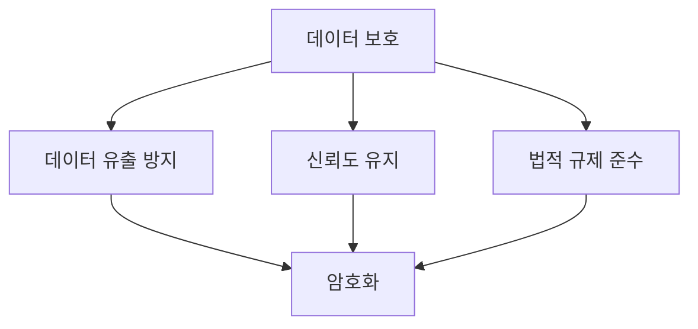

위의 다이어그램은 데이터 보호의 중요성과 암호화의 필요성을 시각적으로 나타낸 것이다. 데이터 보호는 단순한 선택이 아니라 필수적인 조치임을 강조하고 있다. 데이터가 정지 상태일 때의 암호화는 이러한 보호 조치의 핵심 요소로 자리 잡고 있다.

<!--
## 데이터가 정지 상태일 때의 암호화 (Data at Rest Encryption)
   - 데이터가 정지 상태란 무엇인가?
   - 암호화의 기본 개념
-->

## 데이터가 정지 상태일 때의 암호화 (Data at Rest Encryption)

### 데이터가 정지 상태란 무엇인가?

데이터가 정지 상태(Data at Rest)란 저장 매체에 저장되어 있는 데이터로, 전송 중이거나 처리 중이지 않은 상태를 의미한다. 이러한 데이터는 하드 드라이브, SSD, 데이터베이스 등 다양한 저장 장치에 존재할 수 있다. 데이터가 정지 상태일 때는 외부 공격이나 내부 위협으로부터 보호되지 않으면, 해커나 악의적인 사용자에 의해 쉽게 접근될 수 있는 위험이 있다. 따라서 데이터가 정지 상태일 때의 보호는 매우 중요하다.

### 암호화의 기본 개념

암호화(Encryption)는 데이터를 읽을 수 없는 형태로 변환하여, 인가되지 않은 사용자가 접근하지 못하도록 하는 기술이다. 암호화는 일반적으로 두 가지 주요 요소로 구성된다: 암호화 알고리즘과 키(Key)이다. 암호화 알고리즘은 데이터를 변환하는 방법을 정의하며, 키는 이 변환을 수행하는 데 필요한 비밀 정보이다.

암호화의 기본 개념은 다음과 같다:

1. **평문(Plaintext)**: 암호화되지 않은 원본 데이터이다.
2. **암호문(Ciphertext)**: 암호화된 데이터로, 인가되지 않은 사용자는 이를 이해할 수 없다.
3. **키(Key)**: 암호화 및 복호화 과정에서 사용되는 비밀 정보이다.

아래는 암호화 과정의 간단한 다이어그램이다:

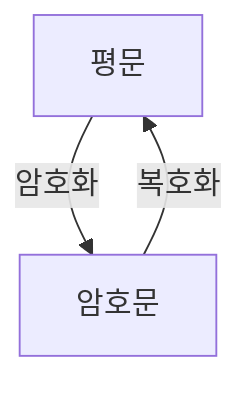

이 다이어그램은 평문이 암호화 과정을 거쳐 암호문으로 변환되고, 다시 복호화 과정을 통해 원래의 평문으로 돌아오는 과정을 보여준다. 데이터가 정지 상태일 때 암호화를 적용하면, 데이터의 기밀성을 유지할 수 있으며, 무단 접근으로부터 보호할 수 있다. 

이러한 암호화 기술은 데이터 보호의 중요한 요소로 자리 잡고 있으며, 다양한 산업 분야에서 필수적으로 사용되고 있다.

<!--
## 암호화 방법
   ### 대칭 암호화 (Symmetric Encryption)
   - 정의 및 작동 원리
   - 주요 알고리즘: AES, DES
   - 장점과 단점
-->

## 암호화 방법

### 대칭 암호화 (Symmetric Encryption)

**정의 및 작동 원리**

대칭 암호화는 동일한 키를 사용하여 데이터를 암호화하고 복호화하는 방식이다. 즉, 암호화와 복호화에 사용되는 키가 동일하므로, 키의 안전한 관리가 매우 중요하다. 대칭 암호화는 일반적으로 빠른 속도로 데이터를 처리할 수 있어 대량의 데이터를 암호화하는 데 적합하다.

**주요 알고리즘: AES, DES**

대칭 암호화에서 가장 널리 사용되는 알고리즘은 AES(Advanced Encryption Standard)와 DES(Data Encryption Standard)이다.  
- **AES**는 128비트, 192비트, 256비트의 키 길이를 지원하며, 현재 가장 안전한 대칭 암호화 알고리즘으로 인정받고 있다.  
- **DES**는 56비트의 키 길이를 사용하며, 과거에는 널리 사용되었으나 현재는 보안성이 낮아 더 이상 권장되지 않는다.

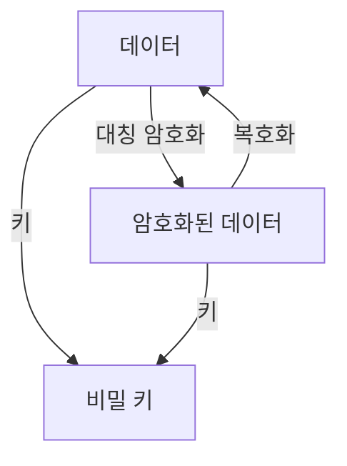

**장점과 단점**

대칭 암호화의 장점은 속도가 빠르고, 구현이 간단하다는 점이다. 그러나 단점으로는 키 관리의 어려움이 있다. 키가 유출될 경우, 모든 암호화된 데이터가 위험에 처할 수 있다. 따라서 안전한 키 관리 시스템이 필수적이다. 

대칭 암호화는 데이터 보호를 위한 중요한 방법 중 하나이며, 적절한 사용과 관리가 이루어질 경우 강력한 보안성을 제공할 수 있다.

<!--
   ### 비대칭 암호화 (Asymmetric Encryption)
   - 정의 및 작동 원리
   - 공개 키와 개인 키의 역할
   - 일반적인 사용 사례
   - 장점과 단점
-->

## 비대칭 암호화 (Asymmetric Encryption)

비대칭 암호화는 두 개의 키, 즉 공개 키(Public Key)와 개인 키(Private Key)를 사용하는 암호화 방식이다. 이 방식은 데이터의 기밀성을 보장하고, 데이터 전송 시의 안전성을 높이는 데 중요한 역할을 한다.

**정의 및 작동 원리**

비대칭 암호화는 공개 키와 개인 키의 쌍을 사용하여 데이터를 암호화하고 복호화하는 방식이다. 공개 키는 누구나 접근할 수 있도록 공개되며, 개인 키는 소유자만 알고 있어야 한다. 데이터는 공개 키로 암호화되고, 해당 데이터는 오직 개인 키로만 복호화할 수 있다. 이로 인해, 데이터 전송 시 중간에서 누군가가 데이터를 가로채더라도, 개인 키가 없으면 복호화할 수 없기 때문에 안전하다.

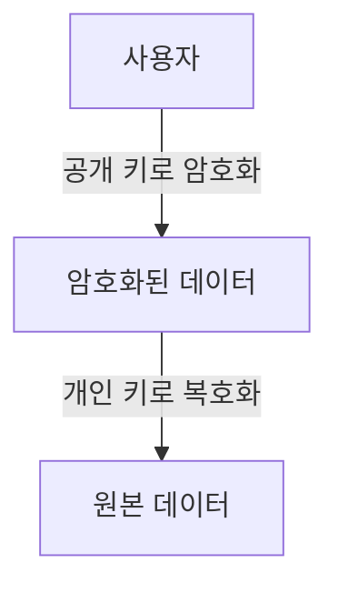

**공개 키와 개인 키의 역할**

공개 키는 데이터를 암호화하는 데 사용되며, 누구나 사용할 수 있다. 반면, 개인 키는 암호화된 데이터를 복호화하는 데 사용되며, 소유자만 알고 있어야 한다. 이 두 키의 조합은 비대칭 암호화의 핵심으로, 데이터의 안전한 전송을 가능하게 한다.

**일반적인 사용 사례**

비대칭 암호화는 여러 분야에서 사용된다. 예를 들어, SSL/TLS 프로토콜에서 웹사이트와 브라우저 간의 안전한 통신을 위해 사용되며, 이메일 암호화 및 디지털 서명에도 활용된다. 이러한 사용 사례는 데이터의 기밀성과 무결성을 보장하는 데 기여한다.

**장점과 단점**

비대칭 암호화의 장점은 다음과 같다. 첫째, 키 관리가 용이하다. 공개 키는 자유롭게 배포할 수 있어, 키 분배 문제를 해결할 수 있다. 둘째, 데이터의 기밀성과 무결성을 보장할 수 있다. 그러나 단점도 존재한다. 비대칭 암호화는 대칭 암호화에 비해 속도가 느리며, 대량의 데이터를 암호화하는 데 비효율적일 수 있다. 이러한 이유로, 비대칭 암호화는 대칭 암호화와 함께 하이브리드 방식으로 사용되는 경우가 많다.

<!--
   ### 하이브리드 암호화 (Hybrid Encryption)
   - 정의 및 작동 원리
   - 대칭 및 비대칭 암호화의 조합
   - 실제 적용 사례
   - 장점과 단점
-->

## 하이브리드 암호화 (Hybrid Encryption)

하이브리드 암호화는 대칭 암호화(Symmetric Encryption)와 비대칭 암호화(Asymmetric Encryption)를 결합하여 데이터 보호를 극대화하는 방법이다. 이 방식은 두 가지 암호화 기술의 장점을 활용하여 보안성과 성능을 동시에 확보할 수 있다.

**정의 및 작동 원리**

하이브리드 암호화는 비대칭 암호화를 사용하여 대칭 키를 안전하게 전송하고, 이후 대칭 키를 사용하여 실제 데이터를 암호화하는 방식이다. 비대칭 암호화는 공개 키(Public Key)와 개인 키(Private Key)를 사용하여 키 교환을 안전하게 수행하며, 대칭 암호화는 빠른 속도로 데이터를 암호화하는 데 사용된다.

다음은 하이브리드 암호화의 작동 원리를 나타내는 다이어그램이다:

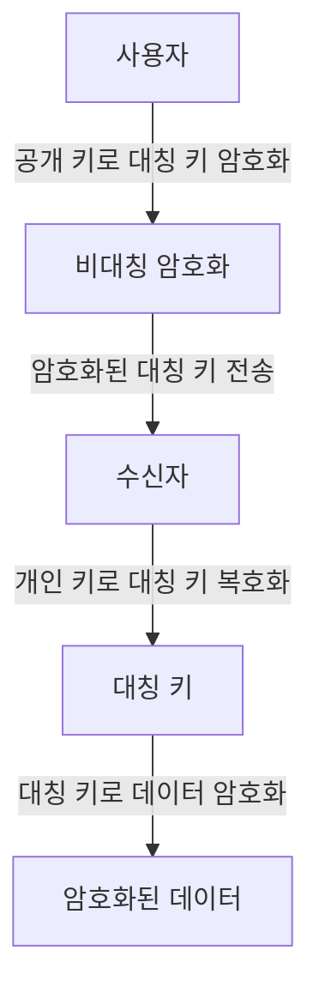

**대칭 및 비대칭 암호화의 조합**

하이브리드 암호화는 대칭 암호화의 빠른 속도와 비대칭 암호화의 안전성을 결합한다. 대칭 암호화는 동일한 키를 사용하여 데이터를 암호화하고 복호화하는 방식으로, 속도가 빠르지만 키 관리가 어렵다. 반면, 비대칭 암호화는 키 쌍을 사용하여 안전하게 키를 전송할 수 있지만, 속도가 느리다. 하이브리드 암호화는 이러한 두 가지 방식의 단점을 보완하여 효율적인 데이터 보호를 가능하게 한다.

**실제 적용 사례**

하이브리드 암호화는 다양한 분야에서 사용된다. 예를 들어, SSL/TLS 프로토콜은 웹 브라우징 시 데이터 전송을 안전하게 보호하기 위해 하이브리드 암호화를 사용한다. 클라우드 스토리지 서비스에서도 하이브리드 암호화를 통해 사용자 데이터를 안전하게 보호하고 있다.

**장점과 단점**

하이브리드 암호화의 장점은 다음과 같다:
- **보안성**: 비대칭 암호화를 통해 대칭 키를 안전하게 전송할 수 있어 보안성이 높다.
- **성능**: 대칭 암호화를 사용하여 데이터 암호화 속도가 빠르다.

단점으로는:
- **복잡성**: 두 가지 암호화 방식을 결합하기 때문에 구현이 복잡할 수 있다.
- **키 관리**: 대칭 키와 비대칭 키 모두를 관리해야 하므로 키 관리가 어려울 수 있다.

하이브리드 암호화는 데이터 보호를 위한 효과적인 방법으로, 다양한 상황에서 활용될 수 있다.

<!--
## 파일 수준 암호화 (File-Level Encryption)
   - 정의 및 작동 원리
   - 인기 있는 도구 및 방법: BitLocker, FileVault, VeraCrypt
   - 장점과 단점
-->

## 파일 수준 암호화 (File-Level Encryption)

**정의 및 작동 원리**

파일 수준 암호화는 특정 파일이나 폴더에 대해서만 암호화를 적용하는 방법이다. 이 방식은 전체 디스크 암호화와는 달리, 사용자가 선택한 파일에 대해서만 데이터를 보호할 수 있도록 해준다. 파일 수준 암호화는 일반적으로 파일이 저장될 때 자동으로 암호화되며, 사용자가 해당 파일에 접근할 때 복호화가 이루어진다. 이를 통해 사용자는 필요한 파일만 안전하게 보호할 수 있다.

작동 원리는 다음과 같다:

1. 사용자가 암호화할 파일을 선택한다.
2. 선택된 파일에 대해 암호화 알고리즘이 적용된다.
3. 암호화된 파일은 원본 파일을 대체하거나 별도로 저장된다.
4. 사용자가 파일에 접근할 때, 암호화된 파일이 복호화되어 사용된다.

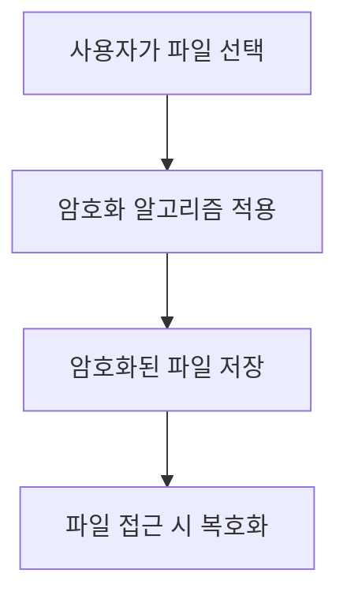

**인기 있는 도구 및 방법: BitLocker, FileVault, VeraCrypt**

파일 수준 암호화를 지원하는 여러 도구가 존재한다. 그 중에서 가장 인기 있는 도구는 다음과 같다:

- **BitLocker**: Windows 운영 체제에서 제공하는 암호화 도구로, 파일 수준 암호화뿐만 아니라 전체 디스크 암호화도 지원한다. BitLocker는 TPM(Trusted Platform Module)과 통합되어 보안성을 높인다.
  
- **FileVault**: macOS에서 제공하는 파일 및 디스크 암호화 도구로, 사용자가 선택한 파일이나 전체 디스크를 암호화할 수 있다. FileVault는 사용자가 로그인할 때 자동으로 복호화된다.

- **VeraCrypt**: 오픈 소스 암호화 소프트웨어로, 파일 수준 암호화와 전체 디스크 암호화 모두 지원한다. VeraCrypt는 다양한 암호화 알고리즘을 제공하여 사용자가 원하는 방식으로 데이터를 보호할 수 있다.

**장점과 단점**

파일 수준 암호화의 장점은 다음과 같다:

- **선택적 암호화**: 사용자가 필요한 파일만 선택적으로 암호화할 수 있어, 불필요한 성능 저하를 방지할 수 있다.
- **유연성**: 다양한 도구와 방법을 통해 사용자가 원하는 방식으로 암호화를 적용할 수 있다.
- **간편한 복호화**: 사용자가 파일에 접근할 때 자동으로 복호화되므로, 사용 편의성이 높다.

반면, 단점도 존재한다:

- **관리의 복잡성**: 여러 파일을 개별적으로 관리해야 하므로, 대규모 데이터 환경에서는 관리가 복잡해질 수 있다.
- **보안 취약점**: 파일 수준 암호화는 전체 디스크 암호화에 비해 보안성이 낮을 수 있으며, 암호화된 파일이 다른 시스템으로 이동할 경우 보안이 취약해질 수 있다.

파일 수준 암호화는 특정 상황에서 매우 유용한 방법이지만, 사용자는 각 도구의 특성과 장단점을 잘 이해하고 선택해야 한다.

<!--
## 데이터베이스 암호화 (Database Encryption)
   - 정의 및 중요성
   - 도전 과제 및 모범 사례
   - 키 관리 시스템의 중요성
-->

## 데이터베이스 암호화 (Database Encryption)

**정의 및 중요성**

데이터베이스 암호화는 데이터베이스에 저장된 정보를 보호하기 위해 데이터를 암호화하는 과정을 의미한다. 이는 데이터 유출이나 무단 접근으로부터 중요한 정보를 보호하는 데 필수적이다. 데이터베이스에 저장된 정보는 종종 개인 식별 정보(PII), 금융 데이터, 의료 기록 등 민감한 정보를 포함하고 있어, 이러한 정보를 안전하게 보호하는 것이 중요하다. 데이터베이스 암호화는 데이터가 정지 상태일 때뿐만 아니라 전송 중에도 보호할 수 있는 방법을 제공한다.

**도전 과제 및 모범 사례**

데이터베이스 암호화는 여러 도전 과제를 동반한다. 첫째, 성능 저하가 발생할 수 있다. 암호화 및 복호화 과정은 추가적인 계산을 요구하므로, 데이터베이스의 성능에 영향을 미칠 수 있다. 둘째, 키 관리가 복잡해질 수 있다. 암호화 키를 안전하게 관리하지 않으면 데이터의 접근이 불가능해질 수 있다. 

모범 사례로는 다음과 같은 것들이 있다:
- **암호화 범위 결정**: 모든 데이터를 암호화할 필요는 없으며, 민감한 데이터만 선택적으로 암호화하는 것이 좋다.
- **키 관리 시스템 사용**: 안전한 키 관리 시스템을 도입하여 키의 생성, 저장, 회전 및 폐기를 관리해야 한다.
- **정기적인 감사 및 모니터링**: 데이터베이스 접근 및 암호화 상태를 정기적으로 감사하여 보안 취약점을 조기에 발견해야 한다.

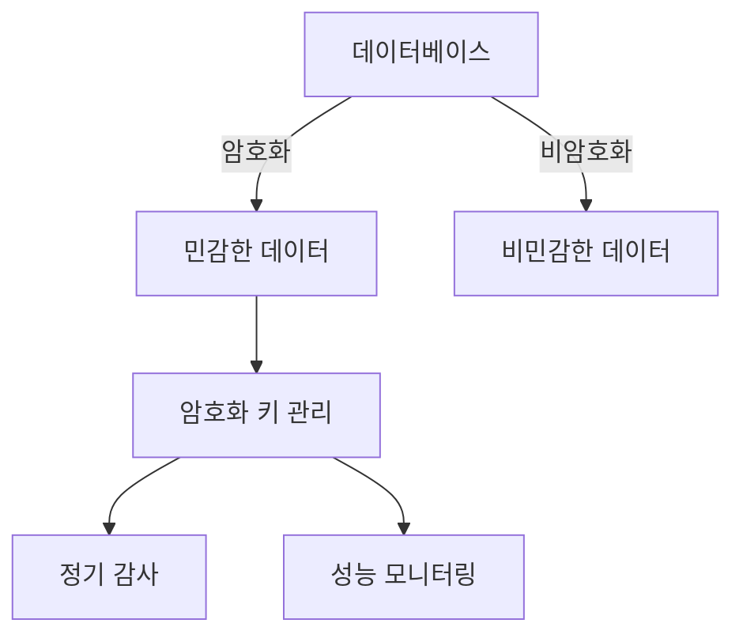

**키 관리 시스템의 중요성**

키 관리 시스템(Key Management System, KMS)은 암호화 키의 생성, 저장, 배포 및 폐기를 관리하는 시스템이다. 데이터베이스 암호화에서 KMS는 매우 중요한 역할을 한다. 안전한 키 관리 없이는 암호화된 데이터에 접근할 수 없으며, 이는 데이터의 가용성을 저하시킬 수 있다. KMS는 다음과 같은 기능을 제공한다:

- **키 생성 및 저장**: 안전한 방법으로 암호화 키를 생성하고 저장한다.
- **키 접근 제어**: 누가 키에 접근할 수 있는지를 관리하여 보안을 강화한다.
- **키 회전 및 폐기**: 정기적으로 키를 회전시키고, 더 이상 사용하지 않는 키를 안전하게 폐기한다.

이러한 기능들은 데이터베이스의 보안을 강화하고, 데이터 유출 사고를 예방하는 데 중요한 역할을 한다. 데이터베이스 암호화와 함께 KMS를 적절히 활용하는 것은 데이터 보호의 핵심 요소이다.

<!--
## 전체 디스크 암호화 (Full-Disk Encryption)
   - 정의 및 작동 원리
   - 주요 도구: BitLocker, FileVault
   - 장점과 단점
-->

## 전체 디스크 암호화 (Full-Disk Encryption)

**정의 및 작동 원리**

전체 디스크 암호화(Full-Disk Encryption, FDE)는 저장 장치의 모든 데이터를 암호화하여 무단 접근을 방지하는 기술이다. 이 방식은 운영 체제와 애플리케이션, 사용자 데이터 등 모든 파일을 포함하여 디스크의 모든 섹터를 암호화한다. 사용자가 시스템을 부팅할 때, 암호화된 데이터를 해독하기 위해서는 인증 정보(예: 비밀번호 또는 암호화 키)가 필요하다. 이로 인해, 물리적으로 장치에 접근하더라도 데이터가 안전하게 보호된다.

작동 원리는 다음과 같다:

1. **부팅 시 암호화 키 요청**: 사용자가 시스템을 부팅할 때, 암호화 키를 입력해야 한다.
2. **디스크 접근 시 해독**: 사용자가 인증에 성공하면, 운영 체제는 암호화된 데이터를 해독하여 접근할 수 있게 한다.
3. **실시간 암호화 및 해독**: 데이터가 디스크에 쓰이거나 읽힐 때, 시스템은 실시간으로 암호화 및 해독을 수행한다.

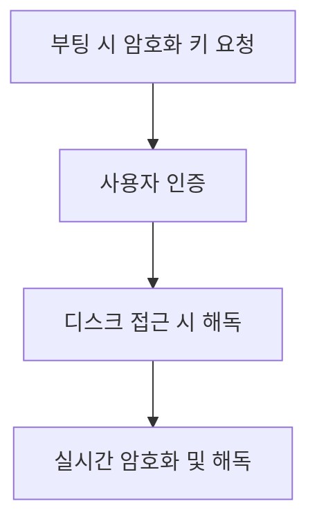

**주요 도구: BitLocker, FileVault**

전체 디스크 암호화를 구현하기 위한 주요 도구로는 Microsoft의 BitLocker와 Apple의 FileVault가 있다. 

- **BitLocker**: Windows 운영 체제에서 제공하는 기능으로, TPM(Trusted Platform Module) 칩을 활용하여 보안을 강화한다. BitLocker는 사용자가 설정한 비밀번호 또는 USB 드라이브에 저장된 키를 통해 디스크를 암호화하고 해독할 수 있다.

- **FileVault**: macOS에서 제공하는 전체 디스크 암호화 도구로, 사용자가 설정한 비밀번호를 통해 디스크의 모든 데이터를 암호화한다. FileVault는 사용자가 로그인할 때 자동으로 해독을 수행하여 사용자 경험을 향상시킨다.

**장점과 단점**

전체 디스크 암호화는 여러 가지 장점과 단점을 가지고 있다.

**장점**:
- **데이터 보호**: 물리적 도난이나 분실 시 데이터가 안전하게 보호된다.
- **사용자 투명성**: 사용자는 암호화된 데이터를 사용할 때 별도의 조작 없이 자연스럽게 사용할 수 있다.
- **규제 준수**: 많은 산업에서 데이터 보호 규제를 준수하는 데 도움이 된다.

**단점**:
- **성능 저하**: 암호화 및 해독 과정에서 시스템 성능이 저하될 수 있다.
- **복구 문제**: 암호화 키를 잃어버리면 데이터 복구가 불가능할 수 있다.
- **설정 복잡성**: 초기 설정 및 관리가 복잡할 수 있으며, 사용자 교육이 필요할 수 있다.

전체 디스크 암호화는 데이터 보호를 위한 강력한 방법이지만, 사용자는 장점과 단점을 충분히 고려하여 적절한 도구와 방법을 선택해야 한다.

<!--
## 암호화 방법 선택하기 (Choosing the Right Encryption Method)
   - 위험 평가 (Risk Assessment)
   - 성능 (Performance)
   - 규제 준수 (Regulatory Compliance)
-->

## 암호화 방법 선택하기 (Choosing the Right Encryption Method)

암호화 방법을 선택하는 것은 데이터 보호 전략에서 매우 중요한 단계이다. 적절한 암호화 방법을 선택하기 위해서는 여러 가지 요소를 고려해야 하며, 그 중에서도 위험 평가, 성능, 그리고 규제 준수가 핵심적인 요소로 작용한다.

### 위험 평가 (Risk Assessment)

위험 평가는 조직의 데이터에 대한 잠재적인 위협과 취약점을 식별하는 과정이다. 이를 통해 어떤 데이터가 가장 중요한지, 그리고 어떤 암호화 방법이 필요한지를 결정할 수 있다. 위험 평가를 수행할 때는 다음과 같은 질문을 고려해야 한다.

- 데이터의 민감도는 어느 정도인가?
- 데이터 유출 시 발생할 수 있는 피해는 무엇인가?
- 현재의 보안 체계에서 어떤 취약점이 존재하는가?

위험 평가의 결과에 따라 적절한 암호화 방법을 선택할 수 있으며, 이는 데이터 보호의 첫걸음이 된다.

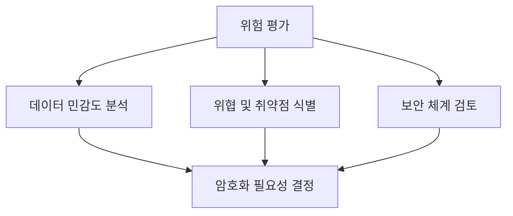

### 성능 (Performance)

암호화 방법을 선택할 때 성능 또한 중요한 고려 사항이다. 암호화는 데이터의 기밀성을 보장하지만, 그 과정에서 시스템의 성능에 영향을 미칠 수 있다. 따라서 다음과 같은 요소를 고려해야 한다.

- 암호화 및 복호화 속도는 얼마나 되는가?
- 시스템 자원(메모리, CPU 등)에 미치는 영향은 어떤가?
- 대량의 데이터를 처리할 때 성능 저하가 발생하는가?

성능을 고려하여 적절한 암호화 방법을 선택하면, 데이터 보호와 시스템 효율성을 동시에 달성할 수 있다.

### 규제 준수 (Regulatory Compliance)

많은 산업에서는 데이터 보호와 관련된 법규 및 규제를 준수해야 한다. 이러한 규제는 특정한 암호화 방법이나 기술을 요구할 수 있으며, 이를 준수하지 않을 경우 법적 제재를 받을 수 있다. 따라서 다음과 같은 질문을 고려해야 한다.

- 해당 산업에서 요구하는 데이터 보호 규정은 무엇인가?
- 암호화 방법이 이러한 규제를 충족하는가?
- 규제 준수를 위한 추가적인 요구 사항은 무엇인가?

규제 준수를 고려하여 암호화 방법을 선택하면, 법적 리스크를 줄이고 조직의 신뢰성을 높일 수 있다.

이와 같이 위험 평가, 성능, 그리고 규제 준수는 암호화 방법을 선택하는 데 있어 필수적인 요소이다. 각 요소를 충분히 고려하여 적절한 암호화 방법을 선택하는 것이 데이터 보호의 핵심이다.

<!--
## FAQ
   - 데이터 암호화의 필요성에 대한 일반적인 질문
   - 암호화 키 관리에 대한 질문
   - 암호화 방법의 선택 기준에 대한 질문
-->

## FAQ

### 데이터 암호화의 필요성에 대한 일반적인 질문

**데이터 암호화는 왜 중요한가?**

데이터 암호화는 민감한 정보를 보호하는 데 필수적이다. 해커가 데이터에 접근하더라도 암호화된 데이터는 해독할 수 없기 때문에, 데이터 유출의 위험을 크게 줄일 수 있다. 특히, 개인 정보나 금융 정보와 같은 민감한 데이터는 암호화를 통해 안전하게 보호해야 한다.

**모든 데이터에 암호화가 필요한가?**

모든 데이터에 암호화를 적용할 필요는 없지만, 민감한 정보가 포함된 데이터는 반드시 암호화해야 한다. 예를 들어, 고객의 개인 정보나 기업의 기밀 정보는 암호화가 필수적이다.

### 암호화 키 관리에 대한 질문

**암호화 키는 어떻게 관리해야 하는가?**

암호화 키는 데이터 보호의 핵심 요소이므로, 안전하게 관리해야 한다. 키 관리 시스템(Key Management System, KMS)을 사용하여 키를 생성, 저장, 배포 및 폐기하는 과정을 안전하게 관리하는 것이 중요하다. 또한, 키에 대한 접근 권한을 제한하고 정기적으로 키를 교체하는 것이 좋다.

**키 분실 시 데이터 복구는 어떻게 하나?**

키를 분실하면 해당 키로 암호화된 데이터는 복구할 수 없다. 따라서, 키를 안전하게 백업하고, 복구 절차를 마련해 두는 것이 중요하다. 예를 들어, 키를 여러 장소에 안전하게 저장하거나, 키 복구를 위한 비상 계획을 수립하는 것이 필요하다.

### 암호화 방법의 선택 기준에 대한 질문

**어떤 암호화 방법을 선택해야 하는가?**

암호화 방법을 선택할 때는 데이터의 민감도, 성능 요구 사항, 규제 준수 등을 고려해야 한다. 대칭 암호화(Symmetric Encryption)는 빠른 성능을 제공하지만, 키 관리가 복잡할 수 있다. 반면, 비대칭 암호화(Asymmetric Encryption)는 키 관리가 용이하지만 성능이 떨어질 수 있다. 하이브리드 암호화(Hybrid Encryption)는 두 가지 방법의 장점을 결합하여 사용할 수 있다.

**암호화 방법의 성능은 어떻게 평가하는가?**

암호화 방법의 성능은 처리 속도, 메모리 사용량, 시스템 자원 소모 등을 기준으로 평가할 수 있다. 성능 테스트를 통해 다양한 암호화 알고리즘의 속도를 비교하고, 실제 환경에서의 성능을 확인하는 것이 중요하다.

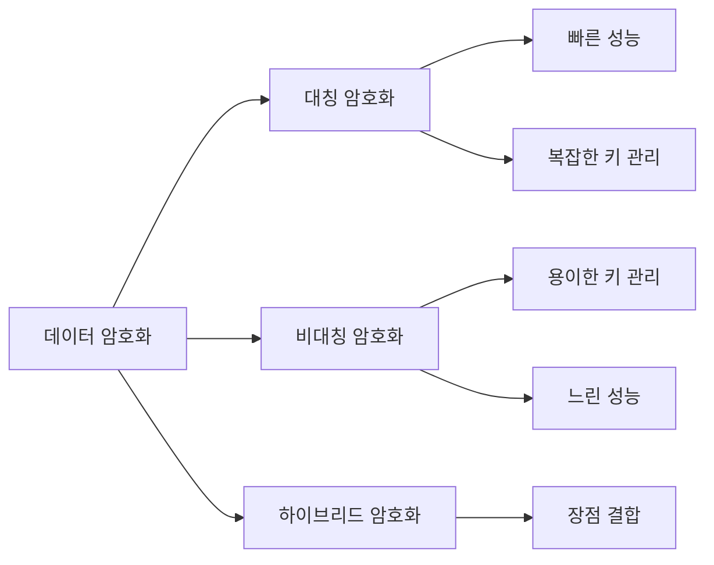

위의 다이어그램은 데이터 암호화의 다양한 방법과 각 방법의 장단점을 시각적으로 나타낸 것이다. 암호화 방법을 선택할 때는 이러한 요소들을 종합적으로 고려해야 한다.

<!--
## 관련 기술
   - 클라우드 보안 (Cloud Security)
   - 블록체인 기술 (Blockchain Technology)
   - 데이터 프라이버시 법규 (Data Privacy Regulations)
-->

## 관련 기술

### 클라우드 보안 (Cloud Security)

클라우드 보안은 클라우드 환경에서 데이터와 애플리케이션을 보호하기 위한 기술과 프로세스를 의미한다. 클라우드 서비스가 증가함에 따라, 데이터 보호의 중요성이 더욱 부각되고 있다. 클라우드 보안은 데이터 암호화, 접근 제어, 네트워크 보안 등 다양한 요소로 구성된다. 특히, 데이터가 정지 상태일 때의 암호화는 클라우드 환경에서도 필수적이다.

**클라우드 보안의 주요 요소:**

- 데이터 암호화
- 접근 제어
- 네트워크 보안
- 보안 모니터링

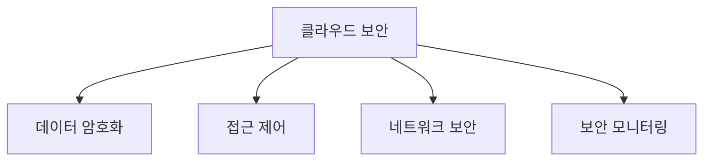

### 블록체인 기술 (Blockchain Technology)

블록체인 기술은 분산 원장 기술로, 데이터의 무결성과 투명성을 보장하는 데 사용된다. 블록체인은 데이터가 여러 노드에 분산되어 저장되기 때문에, 단일 실패 지점이 없고, 데이터의 변경이 어렵다. 이러한 특성 덕분에 블록체인은 데이터 보호와 관련된 다양한 분야에서 활용되고 있다. 특히, 데이터가 정지 상태일 때의 암호화와 결합하여 더욱 안전한 데이터 저장 솔루션을 제공할 수 있다.

**블록체인의 주요 특징:**

- 분산 원장
- 데이터 무결성
- 투명성
- 변경 불가능성

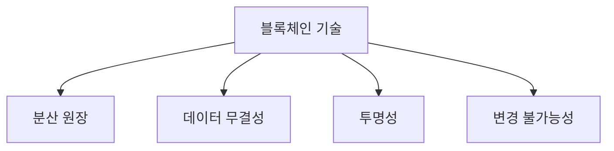

### 데이터 프라이버시 법규 (Data Privacy Regulations)

데이터 프라이버시 법규는 개인 데이터의 수집, 저장, 처리 및 공유에 대한 규제를 의미한다. GDPR(General Data Protection Regulation)과 CCPA(California Consumer Privacy Act)와 같은 법규는 기업이 개인 데이터를 어떻게 처리해야 하는지를 명확히 규정하고 있다. 이러한 법규는 데이터 보호의 중요성을 강조하며, 데이터가 정지 상태일 때의 암호화와 같은 보안 조치를 요구한다.

**주요 데이터 프라이버시 법규:**

- GDPR
- CCPA
- HIPAA(Health Insurance Portability and Accountability Act)

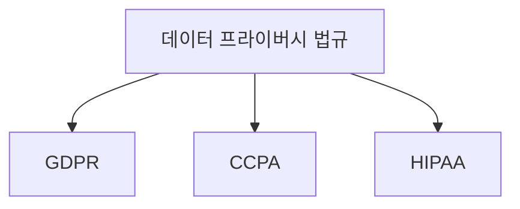

이와 같이 클라우드 보안, 블록체인 기술, 데이터 프라이버시 법규는 데이터 보호와 관련된 중요한 기술 및 규제이다. 이들은 데이터가 정지 상태일 때의 암호화와 함께 데이터 보호의 전반적인 전략을 강화하는 데 기여한다.

<!--
## 결론
   - 데이터가 정지 상태일 때의 암호화 방법 요약
   - 적절한 암호화 방법 선택의 중요성
   - 데이터 보호를 위한 지속적인 노력의 필요성
-->

## 결론

데이터가 정지 상태일 때의 암호화 방법은 데이터 보호의 중요한 요소로 자리 잡고 있다. 데이터가 정지 상태일 때는 해커나 악의적인 공격자가 물리적으로 접근할 수 있는 가능성이 높아지기 때문에, 이를 방지하기 위한 암호화 방법이 필수적이다. 

**데이터가 정지 상태일 때의 암호화 방법 요약**

데이터가 정지 상태일 때 사용할 수 있는 암호화 방법으로는 대칭 암호화(Symmetric Encryption), 비대칭 암호화(Asymmetric Encryption), 하이브리드 암호화(Hybrid Encryption) 등이 있다. 각 방법은 특정한 장점과 단점을 가지고 있으며, 사용자의 요구 사항에 따라 적절한 방법을 선택해야 한다. 

예를 들어, 대칭 암호화는 빠른 속도를 제공하지만 키 관리가 어려울 수 있으며, 비대칭 암호화는 키 관리가 용이하지만 속도가 느릴 수 있다. 하이브리드 암호화는 두 가지 방법의 장점을 결합하여 보안성과 성능을 동시에 만족시킬 수 있다.

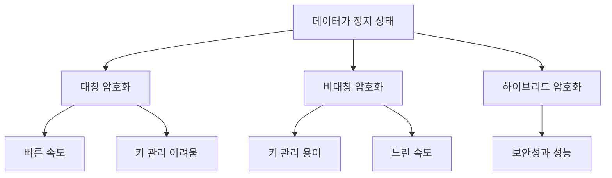

**적절한 암호화 방법 선택의 중요성**

적절한 암호화 방법을 선택하는 것은 데이터 보호에 있어 매우 중요하다. 각 암호화 방법의 특성을 이해하고, 조직의 요구 사항과 환경에 맞는 방법을 선택해야 한다. 예를 들어, 규제 준수가 중요한 산업에서는 강력한 암호화 방법을 선택해야 할 필요가 있다. 

**데이터 보호를 위한 지속적인 노력의 필요성**

마지막으로, 데이터 보호를 위한 지속적인 노력이 필요하다. 기술은 끊임없이 발전하고 있으며, 새로운 위협이 등장하고 있다. 따라서, 정기적인 보안 점검과 암호화 방법의 업데이트가 필수적이다. 데이터 보호는 일회성이 아닌 지속적인 과정임을 인식해야 한다. 

결론적으로, 데이터가 정지 상태일 때의 암호화 방법은 데이터 보호의 핵심 요소이며, 적절한 방법을 선택하고 지속적으로 관리하는 것이 중요하다.

<!--
##### Reference #####
-->

## Reference

* [https://dzone.com/articles/exploring-different-methods-of-data-at-rest-encryp](https://dzone.com/articles/exploring-different-methods-of-data-at-rest-encryp)

