데이터 보호는 오늘날 정보 기술 환경에서 매우 중요한 주제이다. 특히 **데이터가 저장된 상태에서의 암호화(Data at Rest Encryption)**는 정보 보호의 핵심 방어 수단 중 하나로 자리 잡고 있다. 데이터가 전송 중일 때와는 달리, 저장된 데이터는 이동하지 않지만 여전히 해킹·도난·내부 유출과 같은 위협에 노출되어 있다. 개인 장치에서 기업의 저장 시스템에 이르기까지, 암호화는 무단 접근이 발생하더라도 데이터가 적절한 복호화 키 없이는 읽을 수 없도록 보장한다. 최근 조사에 따르면, **53%의 기업**이 1,000개 이상의 민감한 파일과 폴더를 암호화하지 않은 채로 두고 있어 모든 직원이 접근할 수 있는 상황이다. 본 글에서는 데이터가 정지 상태일 때의 암호화 방법을 체계적으로 살펴보고, 각 접근 방식의 강점과 한계, 실제 적용 방법을 제시한다.

---

## 이 포스트에서 다루는 내용

- **개요**: 데이터 보호의 중요성, Data at Rest의 위험성, 암호화 필요성
- **암호화 방법**: 대칭·비대칭·하이브리드 암호화의 원리와 AES·DES, 키 역할
- **적용 수준**: 파일 수준·데이터베이스·전체 디스크 암호화와 BitLocker·FileVault·VeraCrypt
- **선택 기준**: 위험 평가·성능·규제 준수
- **FAQ**: 암호화 필요성·키 관리·방법 선택
- **관련 기술**: 클라우드 보안·블록체인·데이터 프라이버시 법규

---

## 개요

### 데이터 보호의 중요성

현대 사회에서 데이터는 기업과 개인에게 매우 중요한 자산이다. 데이터 유출이나 손실은 재정적 손해뿐만 아니라 신뢰도 하락, 법적 제재, 브랜드 손상과 같은 심각한 결과를 초래할 수 있다. 따라서 데이터 보호는 모든 조직의 최우선 과제가 되어야 하며, 그중 **암호화**는 가장 효과적인 수단 중 하나로 자리 잡고 있다.

### 데이터가 정지 상태일 때의 위험성

**데이터가 정지 상태(Data at Rest)**란 저장 매체에 저장되어 있는 데이터를 의미한다. 이 상태의 데이터는 외부 공격자나 내부의 악의적인 사용자에 의해 쉽게 접근될 수 있는 위험이 있다. 예를 들어, 하드 드라이브가 도난당하거나, 클라우드 스토리지 서비스의 보안이 취약할 경우, 저장된 데이터는 그대로 노출될 수 있다. 이러한 위험을 줄이기 위해서는 데이터가 정지 상태일 때에도 강력한 보호 조치가 필요하다.

### 데이터 암호화의 필요성

데이터 암호화는 데이터를 읽을 수 없는 형태로 변환하여 무단 접근을 방지하는 기술이다. 암호화된 데이터는 적절한 키 없이는 해독할 수 없기 때문에, 데이터 유출 시에도 정보가 안전하게 보호될 수 있다. 특히 Data at Rest 암호화는 **기밀성 유지**, **법적·규제 준수**, **고객 신뢰 확보**에 필수적이다.

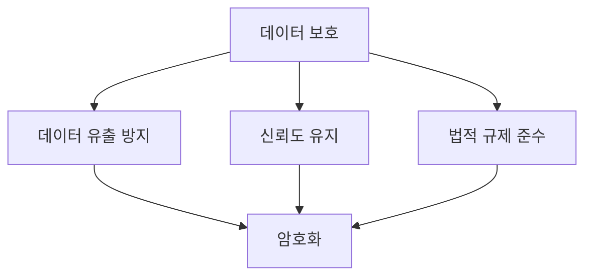
```mermaid
graph TD
    dataProtection["데이터 보호"] --> preventLeak["데이터 유출 방지"]
    dataProtection --> maintainTrust["신뢰도 유지"]
    dataProtection --> complyRegulation["법적 규제 준수"]
    preventLeak --> encryption["암호화"]
    maintainTrust --> encryption
    complyRegulation --> encryption
```

위 다이어그램은 데이터 보호의 목표와 암호화의 필요성을 요약한다. 데이터 보호는 선택이 아니라 필수 조치이며, Data at Rest 암호화는 그 핵심 요소이다.

---

## 데이터가 정지 상태일 때의 암호화 (Data at Rest Encryption)

### 데이터가 정지 상태란 무엇인가?

**Data at Rest**란 저장 매체에 저장되어 있고, 전송 중이거나 처리 중이지 않은 데이터를 말한다. 하드 드라이브, SSD, 데이터베이스, 클라우드 스토리지 등 다양한 저장 장치에 존재한다. 이 상태의 데이터는 외부 공격이나 내부 위협에 노출되면 해커나 악의적인 사용자에 의해 접근될 수 있으므로, 저장 단계에서의 보호가 매우 중요하다.

### 암호화의 기본 개념

암호화(Encryption)는 데이터를 읽을 수 없는 형태로 변환하여, 인가되지 않은 사용자가 접근하지 못하도록 하는 기술이다. 핵심 요소는 **암호화 알고리즘**과 **키(Key)**이다.

- **평문(Plaintext)**: 암호화되지 않은 원본 데이터
- **암호문(Ciphertext)**: 암호화된 데이터로, 키 없이는 이해할 수 없음
- **키(Key)**: 암호화 및 복호화에 사용되는 비밀 정보

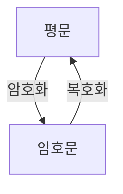
```mermaid
graph TD
    plainText["평문"] -->|"암호화"| cipherText["암호문"]
    cipherText -->|"복호화"| plainText
```

평문이 암호화되어 암호문이 되고, 복호화 시 다시 평문으로 복원되는 구조이다. Data at Rest 암호화를 적용하면 기밀성을 유지하고 무단 접근으로부터 데이터를 보호할 수 있다.

---

## 암호화 방법

### 대칭 암호화 (Symmetric Encryption)

**정의 및 작동 원리**

대칭 암호화는 **동일한 키**로 데이터를 암호화하고 복호화하는 방식이다. 암·복호화에 같은 키를 쓰므로, 키의 안전한 관리가 매우 중요하다. 대량의 데이터를 빠르게 처리할 수 있어 저장 데이터 암호화에 널리 쓰인다.

**주요 알고리즘: AES, DES**

- **AES(Advanced Encryption Standard)**: 128·192·256비트 키 길이를 지원하며, 현재 가장 안전한 대칭 암호화 알고리즘으로 인정받고 있다.
- **DES(Data Encryption Standard)**: 56비트 키를 사용하며, 과거에는 널리 쓰였으나 현재는 보안성이 낮아 권장되지 않는다.

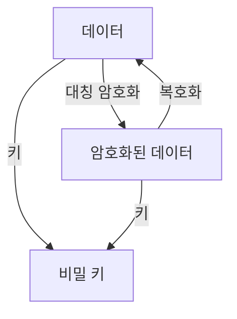
```mermaid
graph TD
    dataNode["데이터"] -->|"대칭 암호화"| encryptedData["암호화된 데이터"]
    encryptedData -->|"복호화"| dataNode
    dataNode -->|"키"| secretKey["비밀 키"]
    encryptedData -->|"키"| secretKey
```

**장점과 단점**

- **장점**: 속도가 빠르고 구현이 비교적 단순하다.
- **단점**: 키가 유출되면 해당 키로 암호화된 모든 데이터가 위험해지므로, 안전한 키 관리 시스템(KMS)이 필수이다.

---

### 비대칭 암호화 (Asymmetric Encryption)

비대칭 암호화는 **공개 키(Public Key)**와 **개인 키(Private Key)** 두 개의 키를 사용한다. 공개 키는 누구나 쓸 수 있고, 개인 키는 소유자만 보관한다. 공개 키로 암호화한 데이터는 오직 대응하는 개인 키로만 복호화할 수 있어, 키를 공유하지 않고도 안전한 전달이 가능하다.

**정의 및 작동 원리**

데이터는 공개 키로 암호화되고, 해당 개인 키로만 복호화된다. 전송 중 데이터를 가로채더라도 개인 키가 없으면 복호화할 수 없어 기밀성이 보장된다.

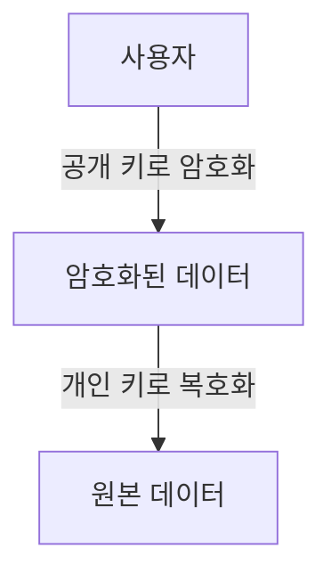
```mermaid
graph TD
    user["사용자"] -->|"공개 키로 암호화"| encryptedPayload["암호화된 데이터"]
    encryptedPayload -->|"개인 키로 복호화"| originalData["원본 데이터"]
```

**공개 키와 개인 키의 역할**

- **공개 키**: 암호화에 사용, 자유롭게 배포 가능
- **개인 키**: 복호화에 사용, 소유자만 보관

**일반적인 사용 사례**

SSL/TLS를 통한 웹 통신, 이메일 암호화, 디지털 서명 등에 활용된다.

**장점과 단점**

- **장점**: 키 배포가 용이하고, 키를 나누어 줄 필요 없이 기밀성·무결성을 보장할 수 있다.
- **단점**: 대칭 암호화보다 느리며, 대량 데이터에는 비효율적이라 실제로는 하이브리드 방식과 함께 쓰는 경우가 많다.

---

### 하이브리드 암호화 (Hybrid Encryption)

하이브리드 암호화는 **대칭**과 **비대칭** 암호화를 결합해, 키 교환의 안전성과 대량 데이터 처리 속도를 동시에 확보하는 방식이다.

**정의 및 작동 원리**

비대칭 암호화로 **대칭 키**를 안전하게 전달한 뒤, 그 대칭 키로 실제 데이터를 암호화한다. 키 교환은 비대칭으로 보호하고, 본문 암호화는 대칭으로 고속 처리한다.

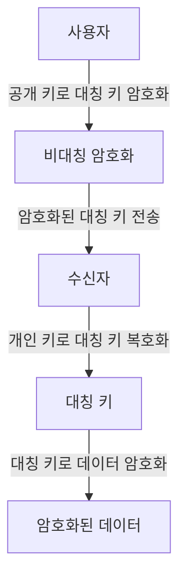
```mermaid
graph TD
    sender["사용자"] -->|"공개 키로 대칭 키 암호화"| asymStep["비대칭 암호화"]
    asymStep -->|"암호화된 대칭 키 전송"| recipient["수신자"]
    recipient -->|"개인 키로 대칭 키 복호화"| symKey["대칭 키"]
    symKey -->|"대칭 키로 데이터 암호화"| encData["암호화된 데이터"]
```

**대칭 및 비대칭의 조합**

대칭의 빠른 속도와 비대칭의 안전한 키 교환을 함께 써서, 실무에서 가장 널리 쓰이는 패턴이다.

**실제 적용 사례**

SSL/TLS, 클라우드 스토리지, 안전한 파일 전송 등에서 사용된다.

**장점과 단점**

- **장점**: 보안성(키 전달 보호)과 성능(대량 데이터 고속 암호화)을 동시에 만족한다.
- **단점**: 구현과 키 관리(대칭·비대칭 키 모두)가 상대적으로 복잡하다.

---

## 파일 수준 암호화 (File-Level Encryption)

**정의 및 작동 원리**

파일 수준 암호화는 **선택한 파일·폴더**에만 암호화를 적용하는 방식이다. 저장 시점에 암호화되고, 접근 시 복호화되며, 전체 디스크 암호화와 달리 필요한 대상만 보호할 수 있다.

1. 사용자가 암호화할 파일을 선택한다.
2. 선택된 파일에 암호화 알고리즘이 적용된다.
3. 암호화된 파일이 저장된다.
4. 접근 시 복호화되어 사용된다.

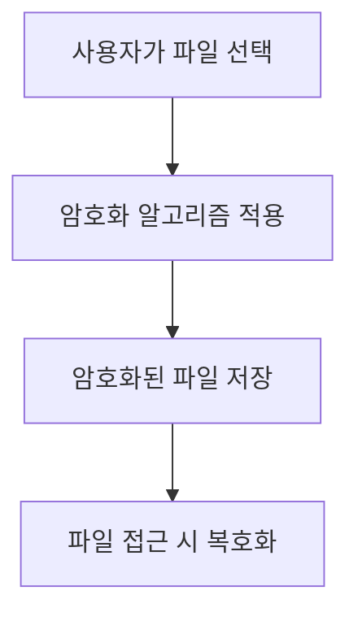
```mermaid
flowchart TD
    selectFile["사용자가 파일 선택"] --> applyAlgo["암호화 알고리즘 적용"]
    applyAlgo --> storeEnc["암호화된 파일 저장"]
    storeEnc --> decryptOnAccess["파일 접근 시 복호화"]
```

**인기 도구: BitLocker, FileVault, VeraCrypt**

- **BitLocker**: Windows 기본 제공. 파일·볼륨·전체 디스크 암호화 지원. TPM(Trusted Platform Module)과 연동해 보안을 강화한다.
- **FileVault**: macOS 제공. 선택 영역 또는 전체 디스크 암호화. 로그인 시 복호화로 사용성을 유지한다.
- **VeraCrypt**: 오픈 소스. 파일·전체 디스크 암호화, 다양한 알고리즘 지원, 크로스 플랫폼.

**장점과 단점**

- **장점**: 필요한 파일만 암호화해 유연하고, 성능 부담을 조절할 수 있으며, 접근 시 자동 복호화로 사용이 편하다.
- **단점**: 파일 단위 관리가 번거로울 수 있고, 전체 디스크 암호화보다는 노출 범위 관리에 신경 써야 한다.

---

## 데이터베이스 암호화 (Database Encryption)

**정의 및 중요성**

데이터베이스 암호화는 DB에 저장된 정보를 암호화해 유출·무단 접근을 막는 것이다. PII(개인 식별 정보), 금융 데이터, 의료 기록 등 민감 데이터를 반드시 보호해야 하며, Data at Rest뿐 아니라 전송 구간 보호와 함께 고려해야 한다.

**도전 과제 및 모범 사례**

- **성능**: 암·복호화 오버헤드를 고려해 민감 컬럼·테이블 위주로 적용하는 것이 좋다.
- **키 관리**: 키 유실 시 데이터 복구가 불가능하므로 KMS 도입과 접근 제어·회전·폐기 정책이 필요하다.
- **모범 사례**: 민감 데이터만 선별 암호화, KMS 사용, 정기 감사 및 모니터링.

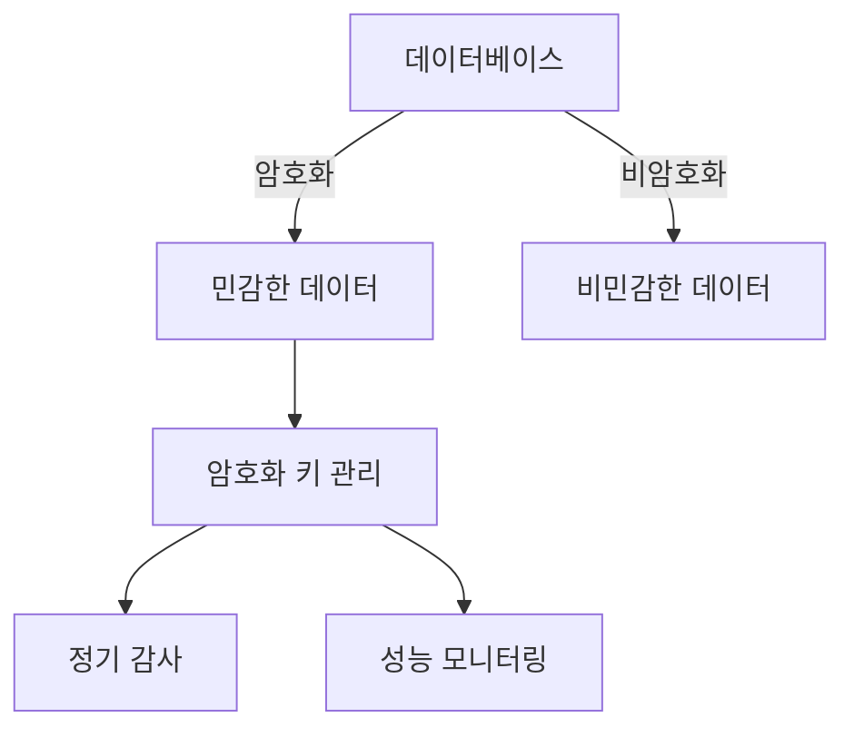
```mermaid
graph TD
    db["데이터베이스"] -->|"암호화"| sensitiveData["민감한 데이터"]
    db -->|"비암호화"| nonSensitive["비민감한 데이터"]
    sensitiveData --> kms["암호화 키 관리"]
    kms --> audit["정기 감사"]
    kms --> perfMonitor["성능 모니터링"]
```

**키 관리 시스템(KMS)의 중요성**

KMS는 키의 생성·저장·배포·회전·폐기를 관리한다. 키 접근 제어와 정기적인 키 회전으로 데이터베이스 보안을 강화하고 유출 사고를 예방할 수 있다.

---

## 전체 디스크 암호화 (Full-Disk Encryption)

**정의 및 작동 원리**

**전체 디스크 암호화(FDE)**는 저장 장치의 **모든 데이터**를 암호화하는 방식이다. OS, 애플리케이션, 사용자 파일까지 모든 섹터가 암호화되며, 부팅 시 인증(비밀번호·복구 키 등)을 거쳐야 해독할 수 있다. 장치를 분실·도난당해도 물리적 접근만으로는 데이터를 읽기 어렵다.

1. **부팅 시**: 암호화 키(또는 복구 키) 입력
2. **인증 성공 후**: 디스크 접근 시 실시간 복호화
3. **쓰기/읽기**: 실시간 암호화·복호화 수행

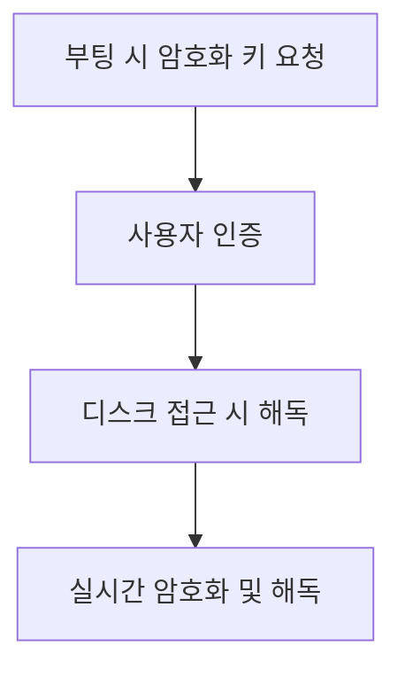
```mermaid
graph TD
    bootKey["부팅 시 암호화 키 요청"] --> userAuth["사용자 인증"]
    userAuth --> diskDecrypt["디스크 접근 시 해독"]
    diskDecrypt --> realtime["실시간 암호화 및 해독"]
```

**주요 도구: BitLocker, FileVault**

- **BitLocker**: Windows. TPM과 연동, PIN·USB 키 등으로 부팅 보안 강화. [Microsoft 공식 문서](https://learn.microsoft.com/en-us/windows/security/information-protection/bitlocker/bitlocker-overview)에서 상세 요구 사항을 확인할 수 있다.
- **FileVault**: macOS. 전체 디스크 암호화, 로그인 시 자동 해독.

**장점과 단점**

- **장점**: 물리적 도난·분실 시 데이터 보호, 사용자는 별도 조작 없이 사용 가능, 많은 규제에서 요구하는 수준을 충족.
- **단점**: 암호화로 인한 일부 성능 저하, 복구 키 분실 시 데이터 복구 불가, 초기 설정·정책 관리가 필요하다.

---

## 암호화 방법 선택하기 (Choosing the Right Encryption Method)

적절한 암호화 방법을 선택할 때는 **위험 평가**, **성능**, **규제 준수**를 함께 고려해야 한다.

### 위험 평가 (Risk Assessment)

조직의 데이터에 대한 위협과 취약점을 식별한다.

- 데이터의 민감도는 어느 정도인가?
- 유출 시 피해 규모는?
- 현재 보안 체계의 취약점은?

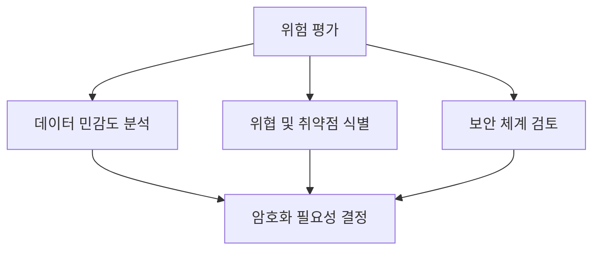
```mermaid
graph TD
    riskAssess["위험 평가"] --> dataSensitivity["데이터 민감도 분석"]
    riskAssess --> threatIdentify["위협 및 취약점 식별"]
    riskAssess --> securityReview["보안 체계 검토"]
    dataSensitivity --> encNeed["암호화 필요성 결정"]
    threatIdentify --> encNeed
    securityReview --> encNeed
```

### 성능 (Performance)

암호화는 기밀성을 높지만 CPU·I/O 부담을 준다.

- 암·복호화 속도와 지연 시간
- 메모리·CPU 사용량
- 대용량 처리 시 성능 저하 여부

민감도와 성능 요구를 균형 있게 고려해 대칭·파일 수준·DB 컬럼 암호화 등을 조합하는 것이 좋다.

### 규제 준수 (Regulatory Compliance)

산업별로 데이터 보호·암호화 요구 수준이 다르다.

- 해당 산업의 데이터 보호 규정(GDPR, CCPA, HIPAA 등)
- 요구되는 암호화 강도·키 관리
- 추가 인증·감사 요구 사항

규제를 충족하는 알고리즘과 키 길이를 선택하고, 필요 시 KMS와 정책을 정비해야 한다.

---

## FAQ

### 데이터 암호화의 필요성

**Q. 데이터 암호화는 왜 중요한가?**

민감한 정보를 읽을 수 없게 만들어, 유출되더라도 키가 없으면 해독할 수 없게 한다. 개인정보·금융 정보는 특히 암호화가 필수이다.

**Q. 모든 데이터에 암호화가 필요한가?**

전부는 아니지만, 민감 정보가 포함된 데이터는 반드시 암호화해야 한다. 고객 PII, 기업 기밀, 의료·금융 데이터 등이 해당한다.

### 암호화 키 관리

**Q. 암호화 키는 어떻게 관리해야 하나?**

KMS를 사용해 키 생성·저장·배포·회전·폐기를 안전하게 관리하고, 접근 권한을 제한하며 정기적으로 키를 교체하는 것이 좋다.

**Q. 키를 잃어버리면?**

해당 키로 암호화된 데이터는 복구할 수 없다. 복구 키 백업과 비상 복구 절차를 미리 마련해야 한다.

### 암호화 방법 선택

**Q. 어떤 암호화 방법을 선택해야 하나?**

민감도·성능·규제를 함께 고려한다. 대칭은 빠르지만 키 관리가 중요하고, 비대칭은 키 배포는 쉽지만 느리며, 하이브리드는 둘의 장점을 결합한 형태로 실무에서 많이 쓴다.

**Q. 성능은 어떻게 평가하나?**

처리 속도, 메모리 사용량, 지연 시간, 처리량을 기준으로 테스트하고, 실제 워크로드에 맞춰 알고리즘과 적용 범위를 조정한다.

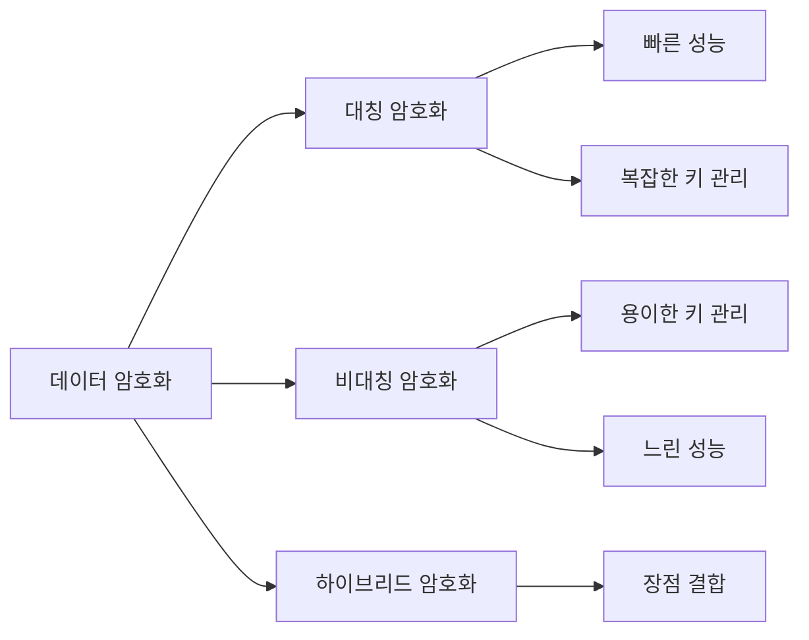
```mermaid
graph LR
    dataEnc["데이터 암호화"] --> symEnc["대칭 암호화"]
    dataEnc --> asymEnc["비대칭 암호화"]
    dataEnc --> hybridEnc["하이브리드 암호화"]
    symEnc --> fastPerf["빠른 성능"]
    symEnc --> complexKey["복잡한 키 관리"]
    asymEnc --> easyKey["용이한 키 관리"]
    asymEnc --> slowPerf["느린 성능"]
    hybridEnc --> combined["장점 결합"]
```

---

## 관련 기술

### 클라우드 보안 (Cloud Security)

클라우드 환경에서도 Data at Rest 암호화는 기본 요구 사항이다. 데이터 암호화, 접근 제어, 네트워크 보안, 보안 모니터링을 함께 설계해야 한다.

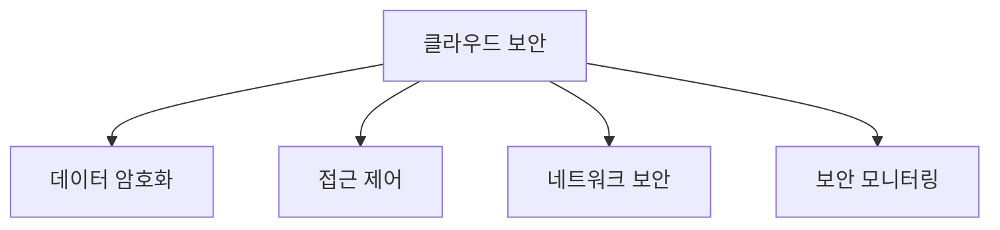
```mermaid
graph TD
    cloudSec["클라우드 보안"] --> dataEnc["데이터 암호화"]
    cloudSec --> accessControl["접근 제어"]
    cloudSec --> networkSec["네트워크 보안"]
    cloudSec --> secMonitoring["보안 모니터링"]
```

### 블록체인 기술 (Blockchain Technology)

블록체인은 분산 원장으로 무결성·투명성을 제공한다. Data at Rest 암호화와 결합하면 저장 단계의 보안을 더욱 강화할 수 있다.

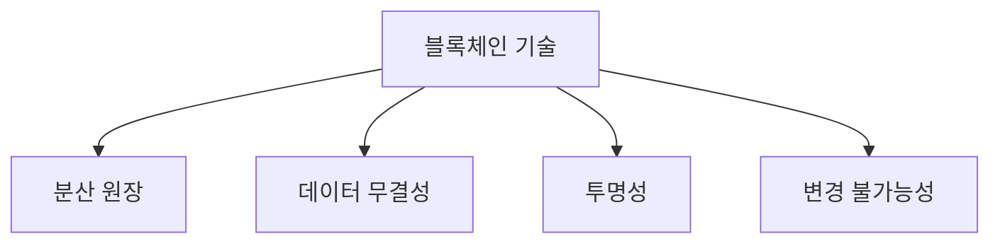
```mermaid
graph TD
    blockchain["블록체인 기술"] --> distributedLedger["분산 원장"]
    blockchain --> dataIntegrity["데이터 무결성"]
    blockchain --> transparency["투명성"]
    blockchain --> immutability["변경 불가능성"]
```

### 데이터 프라이버시 법규 (Data Privacy Regulations)

GDPR, CCPA, HIPAA 등은 개인 데이터의 수집·저장·처리·공유에 대한 요구 사항을 규정하며, 적절한 암호화와 키 관리를 요구한다.

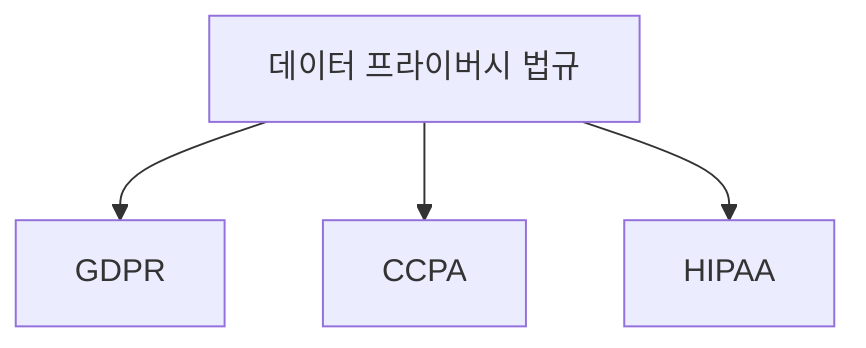
```mermaid
graph TD
    privacyLaw["데이터 프라이버시 법규"] --> gdpr["GDPR"]
    privacyLaw --> ccpa["CCPA"]
    privacyLaw --> hipaa["HIPAA"]
```

---

## 결론

Data at Rest 암호화는 데이터 보호의 핵심이다. 저장된 데이터는 물리적 접근·내부 유출 위험이 있으므로, 대칭·비대칭·하이브리드 방식을 이해하고, **파일 수준·데이터베이스·전체 디스크** 중 요구에 맞는 수준을 선택해야 한다.

- **대칭 암호화**: 속도가 빠르지만 키 관리가 중요하다.
- **비대칭 암호화**: 키 배포는 쉽지만 대량 데이터에는 비효율적이다.
- **하이브리드 암호화**: 키 교환의 안전성과 처리 속도를 함께 확보하는 실무 표준에 가깝다.

위험 평가·성능·규제 준수를 고려해 방법을 선택하고, KMS와 정기 감사를 통해 지속적으로 관리하는 것이 중요하다. 암호화 표준과 권고 사항은 [NIST 암호 표준 및 가이드라인](https://csrc.nist.gov/Projects/cryptographic-standards-and-guidelines)에서 확인할 수 있다.

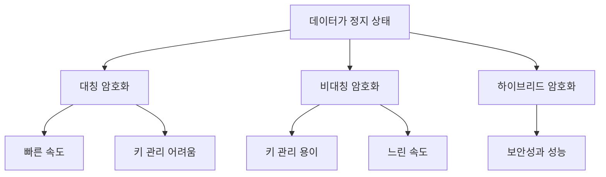
```mermaid
graph TD
    dataAtRest["데이터가 정지 상태"] --> symEnc["대칭 암호화"]
    dataAtRest --> asymEnc["비대칭 암호화"]
    dataAtRest --> hybridEnc["하이브리드 암호화"]
    symEnc --> fastSpeed["빠른 속도"]
    symEnc --> keyHard["키 관리 어려움"]
    asymEnc --> keyEasy["키 관리 용이"]
    asymEnc --> slowSpeed["느린 속도"]
    hybridEnc --> securityPerf["보안성과 성능"]
```

---

## Reference

- [Exploring Different Methods of Data at Rest Encryption (DZone)](https://dzone.com/articles/exploring-different-methods-of-data-at-rest-encryp) — 대칭·비대칭·하이브리드·파일·DB·전체 디스크 암호화 개요
- [BitLocker overview (Microsoft Learn)](https://learn.microsoft.com/en-us/windows/security/information-protection/bitlocker/bitlocker-overview) — Windows 전체 볼륨 암호화 요구 사항 및 동작
- [Cryptographic Standards and Guidelines (NIST CSRC)](https://csrc.nist.gov/Projects/cryptographic-standards-and-guidelines) — 암호 표준·키 관리·알고리즘 권고
