C# 언어의 예외 처리 기능은 프로그램이 실행 중일 때 발생하는 예기치 않은 문제나 예외 상황을 처리하는 데 도움이 된다. 예외 처리는 `try`, `catch`, 및 `finally` 키워드를 사용하여 실패했을 수 있는 작업을 시도하고, 실패를 처리하는 것이 적절하다고 판단될 때 처리하며, 리소스를 정리하는 과정을 포함한다. 예외는 CLR(공용 언어 런타임), .NET, 타사 라이브러리 또는 애플리케이션 코드에서 생성될 수 있으며, `throw` 키워드를 사용하여 생성된다. 대부분의 경우 코드에서 직접 호출한 메서드가 아니라 호출 스택에서 추가로 작동 중단된 다른 메서드에 의해 예외가 throw될 수 있다. 예외가 throw되는 경우 CLR은 스택을 해제하고 특정 예외 형식에 대해 `catch` 블록이 있는 메서드를 찾으며, 해당하는 첫 번째 `catch` 블록을 실행한다. 호출 스택에서 적절한 `catch` 블록을 찾지 못하면 프로세스를 종료하고 사용자에게 메시지를 표시하게 된다. 이러한 예외 처리 메커니즘은 프로그램의 안정성을 높이고, 예외 발생 시 적절한 대응을 가능하게 하여 개발자가 보다 견고한 코드를 작성할 수 있도록 돕는다.

<!--
##### Outline #####
-->

<!--
# 예외 및 예외 처리

## 개요
- 예외 처리의 중요성
- C#에서의 예외 처리 메커니즘

## 예외 개요
- 예외의 정의 및 속성
- 예외의 발생 및 처리 흐름
- CLR(공용 언어 런타임)과 예외 처리

## C# 언어 사양
- C# 언어 사양에서의 예외 처리
- 예외 처리 관련 문서 링크

## 예외 사용
- 예외의 발생 및 전파
- 예외 처리기 및 catch 블록
- 사용자 정의 예외 클래스 생성

## 예외 처리(C# 프로그래밍 가이드)
- try-catch-finally 문 사용법
- catch 블록의 예외 필터
- finally 블록의 역할 및 중요성

## 예외 만들기 및 throw
- 예외 생성 및 throw의 개념
- 예외를 throw할 때의 조건
- 예외 클래스 정의 및 사용

## 예외 처리 예제
- DivideByZeroException 처리 예제
- 사용자 정의 예외 처리 예제
- 다양한 예외 처리 시나리오

## FAQ
- 예외 처리 시 자주 묻는 질문
- 예외 처리의 모범 사례
- 비동기 메서드에서의 예외 처리

## 관련 기술
- 비동기 프로그래밍과 예외 처리
- .NET의 예외 처리 메커니즘
- C#의 예외 처리와 다른 언어의 비교

## 결론
- 예외 처리의 중요성 요약
- C#에서의 예외 처리의 장점
- 향후 예외 처리 개선 방향

## 참고 자료
- C# 공식 문서 링크
- 예외 처리 관련 서적 및 자료
- GitHub에서의 예외 처리 관련 프로젝트 및 코드 예제
-->

<!--
## 개요
- 예외 처리의 중요성
- C#에서의 예외 처리 메커니즘
-->

## 개요

**예외 처리의 중요성**

예외 처리는 소프트웨어 개발에서 매우 중요한 요소이다. 프로그램이 실행되는 동안 예기치 않은 상황이 발생할 수 있으며, 이러한 상황을 적절히 처리하지 않으면 프로그램이 비정상적으로 종료되거나 데이터 손실이 발생할 수 있다. 예외 처리를 통해 개발자는 오류를 관리하고, 사용자에게 친숙한 오류 메시지를 제공하며, 프로그램의 안정성을 높일 수 있다. 

예를 들어, 파일을 열거나 네트워크 요청을 수행할 때 발생할 수 있는 오류를 사전에 처리함으로써, 프로그램이 중단되지 않고 정상적으로 작동할 수 있도록 할 수 있다. 다음은 예외 처리의 중요성을 나타내는 간단한 다이어그램이다.

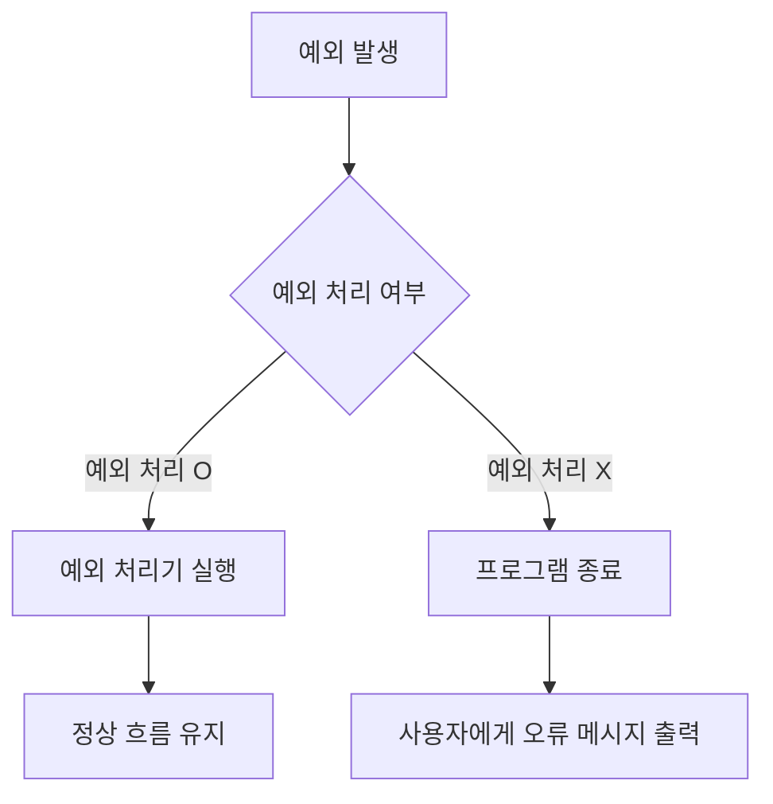

**C#에서의 예외 처리 메커니즘**

C#에서는 예외 처리를 위해 `try`, `catch`, `finally` 블록을 사용한다. `try` 블록 내에서 발생할 수 있는 예외를 감지하고, `catch` 블록에서 해당 예외를 처리한다. `finally` 블록은 예외 발생 여부와 관계없이 항상 실행되는 코드 블록으로, 자원 해제와 같은 정리 작업에 유용하다.

다음은 C#에서의 예외 처리 메커니즘을 보여주는 샘플 코드이다.

```csharp
try
{
    // 예외가 발생할 수 있는 코드
    int result = 10 / int.Parse("0"); // DivideByZeroException 발생
}
catch (DivideByZeroException ex)
{
    Console.WriteLine("0으로 나눌 수 없습니다: " + ex.Message);
}
catch (FormatException ex)
{
    Console.WriteLine("형식이 잘못되었습니다: " + ex.Message);
}
finally
{
    Console.WriteLine("정리 작업 수행");
}
```

위의 코드에서 `try` 블록 내에서 `DivideByZeroException`이 발생할 경우, 해당 예외는 `catch` 블록에서 처리되며, `finally` 블록은 항상 실행되어 정리 작업을 수행한다. 이러한 메커니즘을 통해 C# 개발자는 예외 상황을 효과적으로 관리할 수 있다.

<!--
## 예외 개요
- 예외의 정의 및 속성
- 예외의 발생 및 처리 흐름
- CLR(공용 언어 런타임)과 예외 처리
-->

## 예외 개요

**예외의 정의 및 속성**

예외(Exception)는 프로그램 실행 중에 발생하는 비정상적인 상황을 의미한다. 이러한 상황은 프로그램의 정상적인 흐름을 방해하며, 예외가 발생하면 해당 예외를 처리하기 위한 특별한 코드가 필요하다. 예외는 일반적으로 다음과 같은 속성을 가진다.

- **유형(Type)**: 예외는 특정한 유형을 가지며, 이는 예외가 발생한 원인을 나타낸다. 예를 들어, `DivideByZeroException`은 0으로 나누기를 시도할 때 발생하는 예외이다.
- **메시지(Message)**: 예외는 발생 원인에 대한 설명을 포함하는 메시지를 제공한다. 이 메시지는 디버깅 시 유용하게 사용된다.
- **스택 트레이스(Stack Trace)**: 예외가 발생한 위치와 호출된 메서드의 정보를 포함하여, 문제를 추적하는 데 도움을 준다.

**예외의 발생 및 처리 흐름**

예외는 프로그램 실행 중에 다양한 원인으로 발생할 수 있으며, 이러한 예외를 처리하는 흐름은 다음과 같다.

1. **예외 발생**: 프로그램 실행 중 특정 조건이 충족되면 예외가 발생한다.
2. **예외 전파**: 발생한 예외는 호출 스택을 따라 전파되며, 이를 통해 예외를 처리할 수 있는 적절한 catch 블록을 찾는다.
3. **예외 처리**: 적절한 catch 블록이 발견되면, 해당 블록 내의 코드가 실행되어 예외를 처리한다.
4. **프로그램 종료**: 예외가 처리되지 않으면, 프로그램은 비정상적으로 종료된다.

다음은 예외 발생 및 처리 흐름을 나타내는 다이어그램이다.

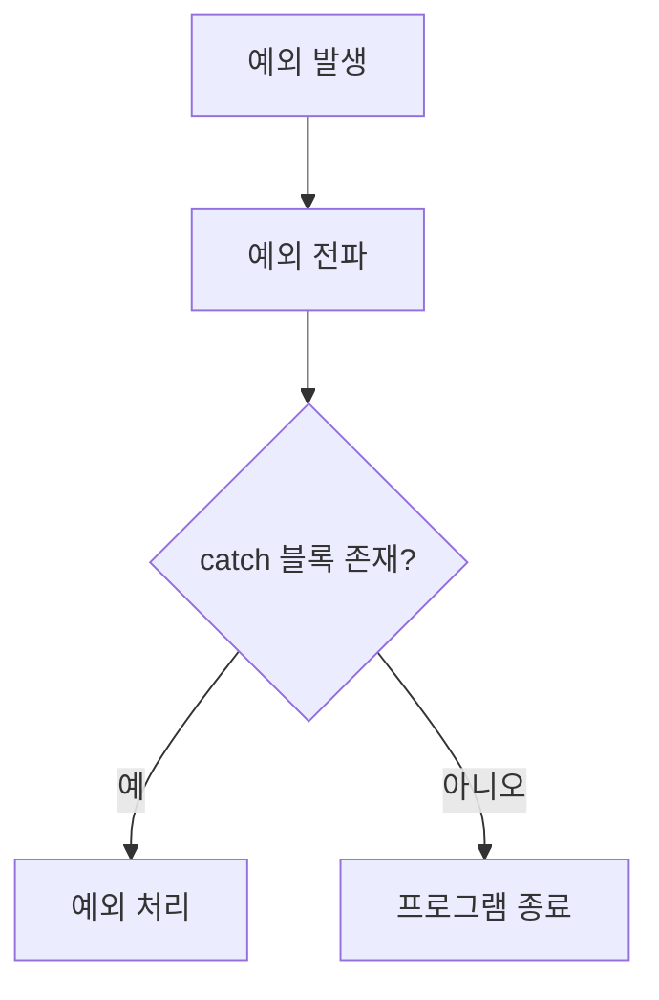

**CLR(공용 언어 런타임)과 예외 처리**

CLR(Common Language Runtime)은 .NET Framework의 핵심 구성 요소로, C#을 포함한 다양한 언어의 실행 환경을 제공한다. CLR은 예외 처리에 대한 메커니즘을 내장하고 있으며, 다음과 같은 기능을 제공한다.

- **예외 감지**: CLR은 예외가 발생했을 때 이를 감지하고, 호출 스택을 따라 적절한 catch 블록을 찾는다.
- **자원 관리**: 예외가 발생하면, CLR은 자동으로 자원을 정리하고, finally 블록을 실행하여 필요한 정리 작업을 수행한다.
- **다양한 언어 지원**: CLR은 여러 언어에서 발생하는 예외를 통합적으로 처리할 수 있도록 설계되어 있다. 이는 다양한 언어 간의 상호 운용성을 높인다.

이와 같은 예외 처리 메커니즘은 C# 프로그래밍에서 안정성과 신뢰성을 높이는 데 중요한 역할을 한다.

<!--
## C# 언어 사양
- C# 언어 사양에서의 예외 처리
- 예외 처리 관련 문서 링크
-->

## C# 언어 사양

C# 언어 사양에서의 예외 처리는 언어의 핵심적인 부분으로, 안정적이고 예측 가능한 소프트웨어 개발을 가능하게 한다. 예외 처리는 프로그램 실행 중 발생할 수 있는 오류를 관리하는 메커니즘으로, 이를 통해 개발자는 프로그램의 흐름을 제어하고, 사용자에게 적절한 피드백을 제공할 수 있다.

**C# 언어 사양에서의 예외 처리**

C#에서는 예외 처리를 위해 `try`, `catch`, `finally` 블록을 사용한다. 이러한 구조는 예외가 발생할 수 있는 코드 블록을 정의하고, 발생한 예외를 처리하는 방법을 명시한다. 예를 들어, 다음과 같은 코드가 있다.

```csharp
try
{
    int result = 10 / 0; // 이 줄에서 DivideByZeroException 발생
}
catch (DivideByZeroException ex)
{
    Console.WriteLine("0으로 나눌 수 없습니다: " + ex.Message);
}
finally
{
    Console.WriteLine("이 블록은 항상 실행됩니다.");
}
```

위의 코드에서 `try` 블록 내에서 0으로 나누는 연산이 시도되며, 이로 인해 `DivideByZeroException`이 발생한다. `catch` 블록은 이 예외를 포착하여 적절한 메시지를 출력하고, `finally` 블록은 예외 발생 여부와 관계없이 항상 실행된다.

**예외 처리 관련 문서 링크**

C#의 예외 처리에 대한 더 자세한 정보는 다음의 공식 문서를 참조할 수 있다:

- [C# 예외 처리 공식 문서](https://docs.microsoft.com/dotnet/csharp/programming-guide/exceptions/)
- [C# 언어 사양](https://docs.microsoft.com/dotnet/csharp/language-reference/language-specification/)

이러한 자료들은 C#에서의 예외 처리 메커니즘을 이해하는 데 큰 도움이 될 것이다. 예외 처리는 소프트웨어의 안정성을 높이는 중요한 요소이므로, 개발자는 이를 충분히 이해하고 활용해야 한다.

<!--
## 예외 사용
- 예외의 발생 및 전파
- 예외 처리기 및 catch 블록
- 사용자 정의 예외 클래스 생성
-->

## 예외 사용

### 예외의 발생 및 전파

예외는 프로그램 실행 중에 발생하는 비정상적인 상황을 나타내는 객체이다. C#에서는 예외가 발생하면, 해당 예외는 호출 스택을 따라 전파된다. 이 과정에서 예외가 발생한 메서드에서 처리되지 않으면, 상위 메서드로 전파되어 결국 프로그램의 최상위 호출 스택까지 도달하게 된다. 만약 최상위 호출 스택에서도 예외가 처리되지 않으면, 프로그램은 비정상적으로 종료된다.

다음은 예외가 발생하고 전파되는 과정을 나타내는 다이어그램이다.

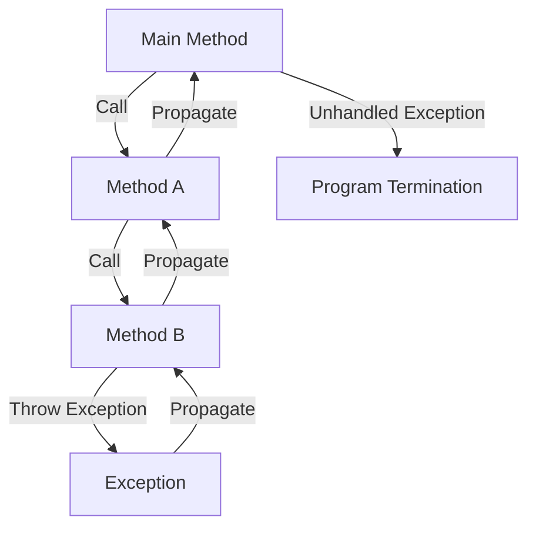

### 예외 처리기 및 catch 블록

C#에서는 try-catch 문을 사용하여 예외를 처리할 수 있다. try 블록 내에서 예외가 발생하면, 해당 예외는 catch 블록으로 전달된다. catch 블록에서는 발생한 예외를 처리하고, 프로그램의 비정상 종료를 방지할 수 있다. 여러 개의 catch 블록을 사용하여 다양한 예외 유형을 처리할 수 있으며, 각 catch 블록은 특정 예외 유형에 대해 정의된다.

다음은 try-catch 문을 사용한 예외 처리의 예시 코드이다.

```csharp
try
{
    int result = 10 / 0; // Divide by zero
}
catch (DivideByZeroException ex)
{
    Console.WriteLine("0으로 나눌 수 없습니다: " + ex.Message);
}
catch (Exception ex)
{
    Console.WriteLine("예외 발생: " + ex.Message);
}
```

위의 코드에서 0으로 나누는 연산이 발생하면, DivideByZeroException이 발생하고 해당 catch 블록이 실행된다.

### 사용자 정의 예외 클래스 생성

C#에서는 필요에 따라 사용자 정의 예외 클래스를 생성할 수 있다. 사용자 정의 예외 클래스는 System.Exception 클래스를 상속받아 구현되며, 추가적인 속성이나 메서드를 포함할 수 있다. 이를 통해 특정한 예외 상황을 보다 명확하게 표현할 수 있다.

다음은 사용자 정의 예외 클래스를 생성하는 예시 코드이다.

```csharp
public class CustomException : Exception
{
    public CustomException(string message) : base(message) { }
}

// 사용 예
try
{
    throw new CustomException("사용자 정의 예외 발생");
}
catch (CustomException ex)
{
    Console.WriteLine("처리된 예외: " + ex.Message);
}
```

위의 코드에서 CustomException 클래스를 정의하고, 이를 통해 예외를 발생시키고 처리하는 과정을 보여준다. 사용자 정의 예외를 사용하면, 특정한 비즈니스 로직에 맞는 예외 처리가 가능해진다.

<!--
## 예외 처리(C# 프로그래밍 가이드)
- try-catch-finally 문 사용법
- catch 블록의 예외 필터
- finally 블록의 역할 및 중요성
-->

## 예외 처리(C# 프로그래밍 가이드)

### try-catch-finally 문 사용법

C#에서 예외 처리를 수행하기 위해 가장 일반적으로 사용되는 구조는 `try-catch-finally` 문이다. 이 구조는 코드 블록에서 발생할 수 있는 예외를 처리하는 데 유용하다. `try` 블록 내에서 예외가 발생하면, 해당 예외는 `catch` 블록으로 전달되어 처리된다. `finally` 블록은 예외 발생 여부와 관계없이 항상 실행되는 코드 블록이다.

다음은 `try-catch-finally` 문을 사용하는 간단한 예제이다.

```csharp
try
{
    int result = 10 / int.Parse("0"); // 예외 발생
}
catch (DivideByZeroException ex)
{
    Console.WriteLine("0으로 나눌 수 없습니다: " + ex.Message);
}
finally
{
    Console.WriteLine("이 블록은 항상 실행됩니다.");
}
```

위의 코드에서 `try` 블록 내에서 `DivideByZeroException`이 발생하면, `catch` 블록이 실행되어 예외 메시지를 출력하고, 마지막으로 `finally` 블록이 실행된다.

### catch 블록의 예외 필터

C# 6.0부터 도입된 예외 필터는 `catch` 블록에서 특정 조건을 만족하는 경우에만 예외를 처리할 수 있도록 해준다. 이를 통해 예외 처리의 유연성을 높일 수 있다. 예외 필터는 `when` 키워드를 사용하여 정의된다.

다음은 예외 필터를 사용하는 예제이다.

```csharp
try
{
    int[] numbers = { 1, 2, 3 };
    Console.WriteLine(numbers[5]); // 예외 발생
}
catch (IndexOutOfRangeException ex) when (ex.Message.Contains("5"))
{
    Console.WriteLine("인덱스 5는 범위를 초과합니다.");
}
```

위의 코드에서 `IndexOutOfRangeException`이 발생하면, `when` 조건이 참일 경우에만 해당 `catch` 블록이 실행된다. 이를 통해 특정 예외에 대한 세부적인 처리가 가능하다.

### finally 블록의 역할 및 중요성

`finally` 블록은 예외 발생 여부와 관계없이 항상 실행되는 코드 블록이다. 주로 리소스를 해제하거나, 파일을 닫는 등의 작업을 수행하는 데 사용된다. 예외가 발생하더라도 `finally` 블록은 반드시 실행되므로, 중요한 정리 작업을 수행하는 데 유용하다.

다음은 `finally` 블록의 사용 예제이다.

```csharp
FileStream fileStream = null;

try
{
    fileStream = new FileStream("example.txt", FileMode.Open);
    // 파일 작업 수행
}
catch (FileNotFoundException ex)
{
    Console.WriteLine("파일을 찾을 수 없습니다: " + ex.Message);
}
finally
{
    if (fileStream != null)
    {
        fileStream.Close(); // 파일 스트림 닫기
        Console.WriteLine("파일 스트림이 닫혔습니다.");
    }
}
```

위의 코드에서 `finally` 블록은 파일 스트림을 닫는 역할을 하며, 예외가 발생하더라도 항상 실행된다. 이를 통해 리소스 누수를 방지할 수 있다.

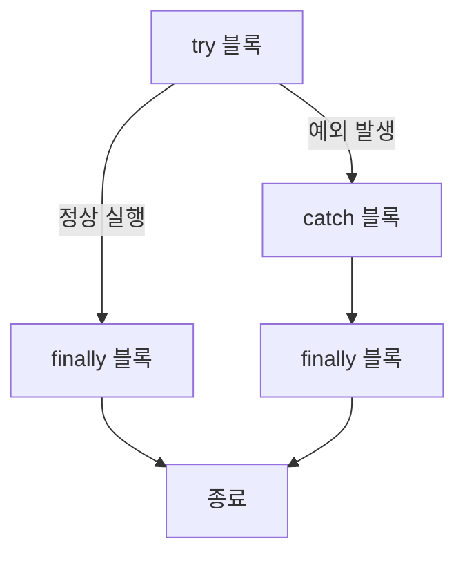

위의 다이어그램은 `try-catch-finally` 문에서의 흐름을 나타낸다. `try` 블록에서 예외가 발생하면 `catch` 블록으로 이동하고, 이후 `finally` 블록이 실행된다. 예외가 발생하지 않으면 `finally` 블록이 바로 실행된다. 

이와 같이 `try-catch-finally` 문은 C#에서 예외 처리를 효과적으로 수행하는 데 필수적인 요소이다.

<!--
## 예외 만들기 및 throw
- 예외 생성 및 throw의 개념
- 예외를 throw할 때의 조건
- 예외 클래스 정의 및 사용
-->

## 예외 만들기 및 throw

### 예외 생성 및 throw의 개념

C#에서 예외는 프로그램 실행 중 발생할 수 있는 오류를 나타내는 객체이다. 예외를 생성하는 것은 특정 조건에서 오류를 발생시키기 위해 예외 객체를 만드는 과정을 의미한다. 예외를 throw하는 것은 이러한 예외 객체를 호출하여 프로그램의 흐름을 중단하고, 예외 처리기를 통해 오류를 처리하도록 하는 것이다.

예를 들어, 사용자가 입력한 값이 유효하지 않을 경우, `ArgumentException`을 생성하고 throw할 수 있다. 아래는 예외를 생성하고 throw하는 간단한 예제 코드이다.

```csharp
public void ValidateInput(int input)
{
    if (input < 0)
    {
        throw new ArgumentException("Input must be a non-negative integer.");
    }
}
```

### 예외를 throw할 때의 조건

예외를 throw할 때는 몇 가지 조건을 고려해야 한다. 첫째, 예외는 프로그램의 정상적인 흐름을 방해하는 상황에서 발생해야 한다. 둘째, 예외를 throw하기 전에 해당 조건이 충족되었는지 확인하는 것이 중요하다. 예를 들어, 파일을 열 때 파일이 존재하지 않는 경우, `FileNotFoundException`을 throw할 수 있다.

아래는 파일을 열 때 예외를 throw하는 예제 코드이다.

```csharp
public void OpenFile(string filePath)
{
    if (!File.Exists(filePath))
    {
        throw new FileNotFoundException("The specified file does not exist.", filePath);
    }
    // 파일 열기 로직
}
```

### 예외 클래스 정의 및 사용

C#에서는 사용자 정의 예외 클래스를 생성하여 특정한 오류 상황을 처리할 수 있다. 사용자 정의 예외 클래스는 `Exception` 클래스를 상속받아 구현하며, 추가적인 속성이나 메서드를 정의할 수 있다. 아래는 사용자 정의 예외 클래스를 정의하는 예제이다.

```csharp
public class CustomException : Exception
{
    public CustomException(string message) : base(message)
    {
    }

    public CustomException(string message, Exception innerException) : base(message, innerException)
    {
    }
}
```

사용자 정의 예외를 throw하는 방법은 다음과 같다.

```csharp
public void ProcessData(int data)
{
    if (data < 0)
    {
        throw new CustomException("Data cannot be negative.");
    }
    // 데이터 처리 로직
}
```

### 다이어그램

아래는 예외 생성 및 throw의 흐름을 나타내는 다이어그램이다.

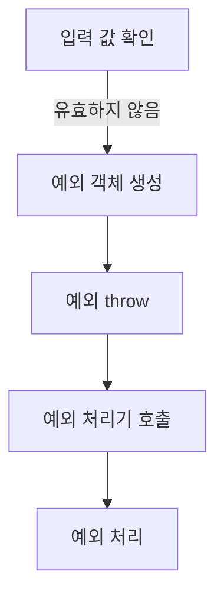

이와 같이 C#에서 예외를 생성하고 throw하는 과정은 프로그램의 안정성을 높이는 데 중요한 역할을 한다. 예외를 적절히 처리함으로써 예기치 않은 오류 상황에서도 프로그램이 정상적으로 작동할 수 있도록 할 수 있다.

<!--
## 예외 처리 예제
- DivideByZeroException 처리 예제
- 사용자 정의 예외 처리 예제
- 다양한 예외 처리 시나리오
-->

## 예외 처리 예제

### DivideByZeroException 처리 예제

C#에서 `DivideByZeroException`은 0으로 나누기를 시도할 때 발생하는 예외이다. 이 예외를 처리하기 위해 `try-catch` 문을 사용할 수 있다. 아래는 `DivideByZeroException`을 처리하는 간단한 예제 코드이다.

```csharp
using System;

class Program
{
    static void Main()
    {
        int numerator = 10;
        int denominator = 0;

        try
        {
            int result = numerator / denominator;
            Console.WriteLine($"결과: {result}");
        }
        catch (DivideByZeroException ex)
        {
            Console.WriteLine("0으로 나눌 수 없습니다: " + ex.Message);
        }
    }
}
```

위의 코드에서 `denominator`가 0일 때 `DivideByZeroException`이 발생하며, catch 블록에서 해당 예외를 처리하여 사용자에게 적절한 메시지를 출력한다.

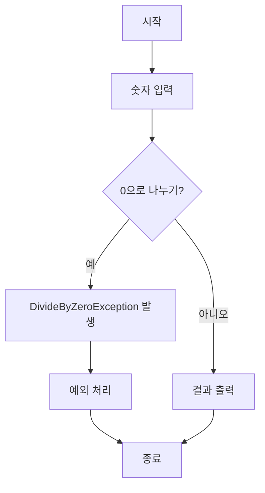

### 사용자 정의 예외 처리 예제

C#에서는 사용자 정의 예외 클래스를 생성하여 특정한 예외 상황을 처리할 수 있다. 사용자 정의 예외 클래스는 `Exception` 클래스를 상속받아 구현할 수 있다. 아래는 사용자 정의 예외를 생성하고 처리하는 예제 코드이다.

```csharp
using System;

public class CustomException : Exception
{
    public CustomException(string message) : base(message) { }
}

class Program
{
    static void Main()
    {
        try
        {
            throw new CustomException("사용자 정의 예외 발생!");
        }
        catch (CustomException ex)
        {
            Console.WriteLine("예외 처리: " + ex.Message);
        }
    }
}
```

위의 코드에서 `CustomException` 클래스를 정의하고, `throw` 문을 사용하여 예외를 발생시킨다. catch 블록에서 해당 예외를 처리하여 사용자에게 메시지를 출력한다.

### 다양한 예외 처리 시나리오

예외 처리 시나리오는 다양한 상황에서 발생할 수 있는 예외를 처리하는 방법을 보여준다. 예를 들어, 파일을 읽는 과정에서 발생할 수 있는 `FileNotFoundException`을 처리하는 예제를 살펴보자.

```csharp
using System;
using System.IO;

class Program
{
    static void Main()
    {
        try
        {
            string content = File.ReadAllText("nonexistentfile.txt");
            Console.WriteLine(content);
        }
        catch (FileNotFoundException ex)
        {
            Console.WriteLine("파일을 찾을 수 없습니다: " + ex.Message);
        }
        catch (Exception ex)
        {
            Console.WriteLine("예기치 않은 오류 발생: " + ex.Message);
        }
    }
}
```

위의 코드에서는 파일을 읽으려 할 때 `FileNotFoundException`이 발생할 수 있으며, 이를 catch 블록에서 처리한다. 또한, 일반적인 예외를 처리하기 위해 `Exception` 클래스를 catch하는 블록도 추가하여 예기치 않은 오류를 처리할 수 있다.

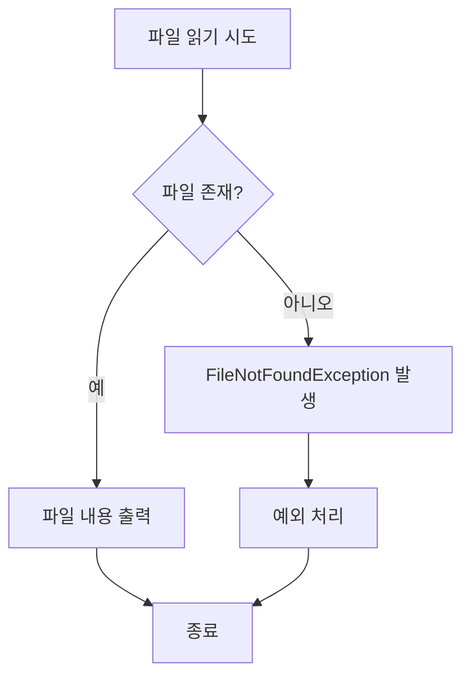

이와 같이 다양한 예외 처리 시나리오를 통해 프로그램의 안정성을 높일 수 있다. 예외 처리는 프로그램의 흐름을 제어하고, 사용자에게 적절한 피드백을 제공하는 데 중요한 역할을 한다.

<!--
## FAQ
- 예외 처리 시 자주 묻는 질문
- 예외 처리의 모범 사례
- 비동기 메서드에서의 예외 처리
-->

## FAQ

### 예외 처리 시 자주 묻는 질문

**예외 처리란 무엇인가?**

예외 처리는 프로그램 실행 중 발생할 수 있는 오류를 관리하는 방법이다. 이를 통해 프로그램이 비정상적으로 종료되는 것을 방지하고, 사용자에게 적절한 피드백을 제공할 수 있다.

**C#에서 예외를 어떻게 발생시킬 수 있는가?**

C#에서는 `throw` 키워드를 사용하여 예외를 발생시킬 수 있다. 예를 들어, 특정 조건이 충족되지 않을 때 사용자 정의 예외를 발생시킬 수 있다.

```csharp
if (value < 0)
{
    throw new ArgumentOutOfRangeException("value", "값은 0보다 커야 합니다.");
}
```

**모든 예외를 catch해야 하는가?**

일반적으로 모든 예외를 catch하는 것은 권장되지 않는다. 특정 예외만을 처리하고, 나머지는 상위 호출 스택으로 전파하는 것이 좋다. 이는 예외의 원인을 파악하고, 디버깅을 용이하게 한다.

### 예외 처리의 모범 사례

**예외를 구체적으로 처리하라**

예외를 처리할 때는 구체적인 예외 클래스를 catch하는 것이 좋다. 이는 코드의 가독성을 높이고, 특정 예외에 대한 적절한 처리를 가능하게 한다.

```csharp
try
{
    // 코드 블록
}
catch (DivideByZeroException ex)
{
    // 0으로 나누기 예외 처리
}
catch (ArgumentNullException ex)
{
    // 인자가 null인 경우 처리
}
```

**finally 블록을 활용하라**

`finally` 블록은 예외 발생 여부와 관계없이 항상 실행되는 코드 블록이다. 자원 해제와 같은 필수 작업을 수행하는 데 유용하다.

```csharp
FileStream fs = null;
try
{
    fs = new FileStream("file.txt", FileMode.Open);
    // 파일 작업
}
catch (IOException ex)
{
    // IO 예외 처리
}
finally
{
    fs?.Close(); // 파일 스트림 닫기
}
```

### 비동기 메서드에서의 예외 처리

비동기 메서드에서 예외를 처리하는 것은 동기 메서드와는 약간 다르다. `async` 메서드 내에서 발생한 예외는 `Task` 객체를 통해 전파된다. `await` 키워드를 사용하여 비동기 작업을 기다릴 때, 예외가 발생하면 해당 예외가 `AggregateException`으로 래핑되어 전달된다.

```csharp
public async Task ExampleAsync()
{
    try
    {
        await Task.Run(() => { throw new InvalidOperationException("비동기 예외 발생"); });
    }
    catch (InvalidOperationException ex)
    {
        // 비동기 예외 처리
    }
}
```

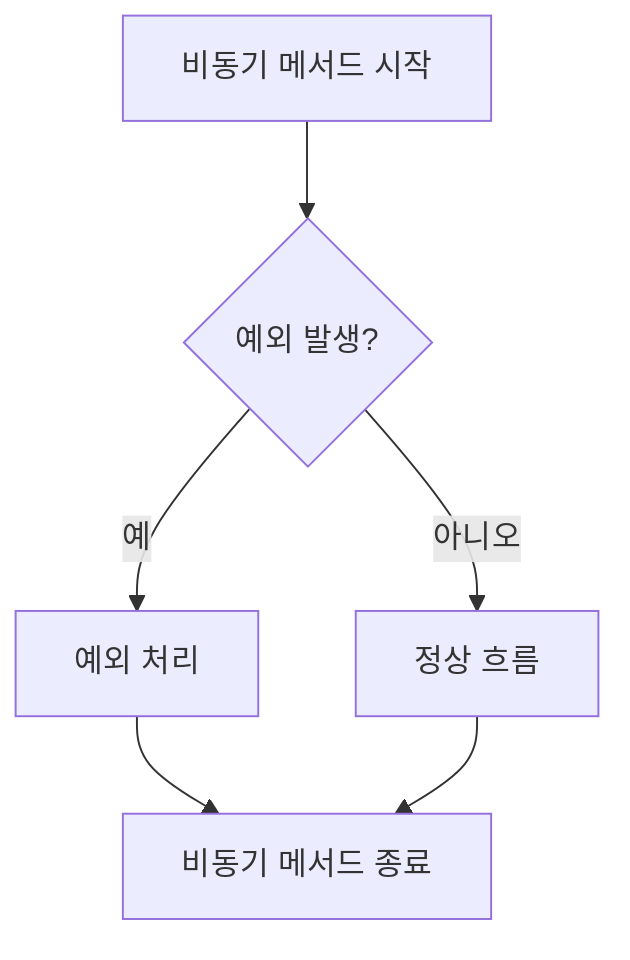

비동기 메서드에서 예외를 처리할 때는 `try-catch` 블록을 사용하여 예외를 적절히 관리하는 것이 중요하다. 이를 통해 비동기 작업의 안정성을 높일 수 있다.

<!--
## 관련 기술
- 비동기 프로그래밍과 예외 처리
- .NET의 예외 처리 메커니즘
- C#의 예외 처리와 다른 언어의 비교
-->

## 관련 기술

### 비동기 프로그래밍과 예외 처리

비동기 프로그래밍은 프로그램의 성능을 향상시키기 위해 사용되는 기법으로, 특히 I/O 작업과 같은 시간이 오래 걸리는 작업을 처리할 때 유용하다. C#에서는 `async`와 `await` 키워드를 사용하여 비동기 메서드를 정의하고 호출할 수 있다. 그러나 비동기 프로그래밍에서는 예외 처리가 복잡해질 수 있다. 비동기 메서드에서 발생한 예외는 호출한 메서드로 전파되지 않기 때문에, 이를 적절히 처리하기 위한 방법이 필요하다.

비동기 메서드에서 예외를 처리하는 방법은 다음과 같다:

1. `try-catch` 블록을 사용하여 예외를 처리한다.
2. `Task` 객체의 `Exception` 속성을 통해 예외를 확인할 수 있다.

아래는 비동기 메서드에서 예외를 처리하는 샘플 코드이다.

```csharp
public async Task<string> GetDataAsync()
{
    try
    {
        // 비동기 작업 수행
        var result = await SomeAsyncOperation();
        return result;
    }
    catch (Exception ex)
    {
        // 예외 처리
        Console.WriteLine($"예외 발생: {ex.Message}");
        throw; // 예외를 다시 던질 수 있다.
    }
}
```

### .NET의 예외 처리 메커니즘

.NET 프레임워크는 예외 처리를 위한 강력한 메커니즘을 제공한다. 모든 예외는 `System.Exception` 클래스를 상속받으며, 이 클래스를 통해 예외의 종류와 정보를 확인할 수 있다. .NET에서는 예외가 발생하면 CLR(Common Language Runtime)이 이를 감지하고, 적절한 예외 처리기를 찾아 실행한다.

다음은 .NET의 예외 처리 흐름을 나타내는 다이어그램이다.

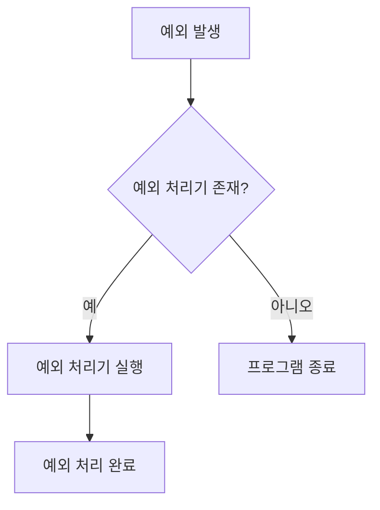

### C#의 예외 처리와 다른 언어의 비교

C#의 예외 처리 메커니즘은 Java와 유사하지만, 몇 가지 차이점이 있다. C#에서는 `try-catch-finally` 문을 사용하여 예외를 처리하며, `catch` 블록에서 여러 개의 예외를 처리할 수 있다. 반면, Java에서는 `throws` 키워드를 사용하여 메서드에서 발생할 수 있는 예외를 명시해야 한다.

또한, C#에서는 사용자 정의 예외 클래스를 쉽게 생성할 수 있으며, 이를 통해 특정한 예외 상황을 처리할 수 있다. 이러한 점에서 C#은 예외 처리의 유연성을 제공한다.

C#과 Java의 예외 처리 비교는 다음과 같다.

| 특징               | C#                          | Java                         |
|------------------|----------------------------|-----------------------------|
| 예외 처리 문법     | try-catch-finally          | try-catch-finally           |
| 사용자 정의 예외   | 가능                        | 가능                        |
| 예외 선언         | 필요 없음                   | throws 키워드 필요          |
| 예외 전파         | throw 키워드 사용          | throw 키워드 사용           |

이와 같이 C#의 예외 처리 메커니즘은 다른 언어와 비교했을 때 유사한 점과 차별화된 점이 존재한다. 이러한 이해는 개발자가 다양한 언어에서 예외 처리를 효과적으로 수행하는 데 도움이 된다.

<!--
## 결론
- 예외 처리의 중요성 요약
- C#에서의 예외 처리의 장점
- 향후 예외 처리 개선 방향
-->

## 결론

### 예외 처리의 중요성 요약

예외 처리는 소프트웨어 개발에서 필수적인 요소이다. 프로그램이 예상치 못한 상황에 직면했을 때, 적절한 예외 처리를 통해 시스템의 안정성을 유지하고 사용자에게 유용한 피드백을 제공할 수 있다. 예외 처리를 통해 오류를 관리하고, 프로그램의 흐름을 제어함으로써, 개발자는 더 나은 사용자 경험을 제공할 수 있다.

### C#에서의 예외 처리의 장점

C#에서의 예외 처리는 강력하고 유연한 메커니즘을 제공한다. C#의 try-catch-finally 구조는 예외 발생 시 프로그램의 흐름을 제어할 수 있는 명확한 방법을 제공하며, 다양한 예외를 처리할 수 있는 catch 블록을 통해 세밀한 오류 관리를 가능하게 한다. 또한, 사용자 정의 예외 클래스를 생성할 수 있어, 특정 비즈니스 로직에 맞는 예외 처리가 가능하다. 이러한 장점들은 C#을 사용하는 개발자에게 높은 생산성과 코드의 가독성을 제공한다.

```csharp
try
{
    // 코드 블록
}
catch (DivideByZeroException ex)
{
    Console.WriteLine("0으로 나눌 수 없습니다: " + ex.Message);
}
finally
{
    Console.WriteLine("예외 처리 완료");
}
```

### 향후 예외 처리 개선 방향

향후 예외 처리의 개선 방향은 비동기 프로그래밍과의 통합, 예외 처리의 자동화 및 예외 발생 시 더 나은 로깅 및 모니터링 기능을 포함해야 한다. 비동기 메서드에서의 예외 처리는 복잡성을 증가시키므로, 이를 보다 쉽게 관리할 수 있는 방법이 필요하다. 또한, 예외 발생 시 개발자가 즉시 문제를 파악할 수 있도록 하는 로깅 시스템의 개선이 요구된다.

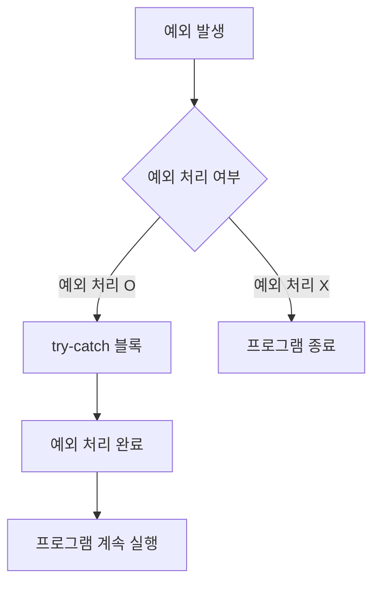

이와 같은 방향으로 예외 처리 메커니즘을 발전시킨다면, C# 개발자들은 더욱 안정적이고 효율적인 소프트웨어를 개발할 수 있을 것이다.

<!--
## 참고 자료
- C# 공식 문서 링크
- 예외 처리 관련 서적 및 자료
- GitHub에서의 예외 처리 관련 프로젝트 및 코드 예제
-->

## 참고 자료

**C# 공식 문서 링크**

C#의 예외 처리에 대한 공식 문서는 Microsoft의 공식 웹사이트에서 확인할 수 있다. 이 문서에서는 예외 처리의 기본 개념부터 고급 주제까지 다양한 내용을 다루고 있으며, 예제 코드와 함께 설명되어 있어 실무에 유용하다. 공식 문서 링크는 다음과 같다: [C# Exception Handling Documentation](https://docs.microsoft.com/en-us/dotnet/csharp/programming-guide/exceptions/)

**예외 처리 관련 서적 및 자료**

예외 처리에 대한 깊이 있는 이해를 원한다면 다음과 같은 서적을 추천한다:

- **"C# in Depth"**: 이 책은 C#의 다양한 기능을 다루며, 예외 처리에 대한 심도 있는 설명을 포함하고 있다.
- **"CLR via C#"**: CLR(공용 언어 런타임)의 작동 방식과 예외 처리 메커니즘에 대한 자세한 내용을 제공한다.

이 외에도 다양한 온라인 강의와 블로그 포스트가 있으니 참고하면 좋다.

아래는 예외 처리 흐름을 나타내는 다이어그램이다:

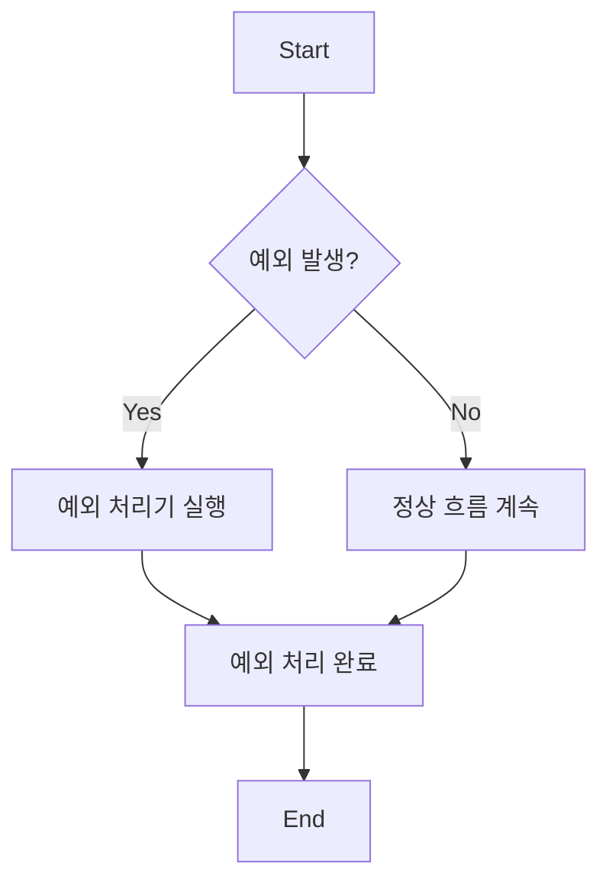

이 다이어그램은 예외 발생 시의 흐름을 간단히 나타내며, 예외 처리기가 실행되는 과정을 보여준다. 예외 처리는 프로그램의 안정성을 높이는 중요한 요소이므로, 관련 자료를 통해 지속적으로 학습하는 것이 필요하다.

<!--
##### Reference #####
-->

## Reference


* [https://learn.microsoft.com/ko-kr/dotnet/csharp/fundamentals/exceptions/](https://learn.microsoft.com/ko-kr/dotnet/csharp/fundamentals/exceptions/)
* [https://learn.microsoft.com/ko-kr/dotnet/csharp/fundamentals/exceptions/using-exceptions](https://learn.microsoft.com/ko-kr/dotnet/csharp/fundamentals/exceptions/using-exceptions)
* [https://learn.microsoft.com/ko-kr/dotnet/csharp/fundamentals/exceptions/exception-handling](https://learn.microsoft.com/ko-kr/dotnet/csharp/fundamentals/exceptions/exception-handling)
* [https://learn.microsoft.com/ko-kr/dotnet/csharp/fundamentals/exceptions/creating-and-throwing-exceptions](https://learn.microsoft.com/ko-kr/dotnet/csharp/fundamentals/exceptions/creating-and-throwing-exceptions)
* [https://learn.microsoft.com/ko-kr/dotnet/csharp/fundamentals/exceptions/compiler-generated-exceptions](https://learn.microsoft.com/ko-kr/dotnet/csharp/fundamentals/exceptions/compiler-generated-exceptions)

