최근 영국 정부가 인도양의 작은 섬인 차고스 제도의 주권을 모리셔스에 이양하겠다고 발표한 이후, 디지털 세계에 미치는 영향에 대한 논의가 필요하다. 이 결정은 단순히 지리적 변화에 그치지 않고, 기술 및 게임 산업에서 선호되는 최상위 도메인인 .io의 종말을 의미한다. .io 도메인은 "input/output"의 약자로 해석되며, GitHub.io, itch.io, Google I/O와 같은 다양한 플랫폼에서 사용되어 왔다. 그러나 이 도메인은 단순한 기술 용어가 아니라, 정치적 맥락이 얽힌 국가 코드 최상위 도메인(ccTLD)이다. 차고스 제도는 영국과 미국의 군사 기지가 위치한 지역으로, 모리셔스는 이 지역에 대한 주권을 오랫동안 주장해왔다. 이제 이 지역의 주권이 모리셔스로 이전되면, IANA(인터넷 할당 번호 관리 기관)는 .io 도메인을 더 이상 허용하지 않을 것이며, 기존의 .io 도메인도 퇴출될 예정이다. 이는 단순한 도메인의 소멸이 아니라, 디지털 세계와 현실 세계의 경계가 모호해지는 상황을 보여준다. 과거 소련의 붕괴나 유고슬라비아의 분열과 같은 역사적 사례를 통해, 디지털 자산의 소유권과 관리가 어떻게 국제 정치와 연결될 수 있는지를 살펴보는 것이 중요하다. 이러한 변화는 기술 창업자들에게 중요한 교훈을 제공하며, 도메인 선택 시 신중함이 필요함을 일깨운다. 디지털 세계의 미래는 물리적 역사와 결코 분리될 수 없음을 명심해야 한다.

<!--
##### Outline #####
-->

<!--
# 목차

## 개요
   - 디지털 세계와 지정학적 변화의 상관관계
   - .io 도메인의 역사적 배경

## 지정학적 변화와 디지털 인프라
   - 2.1. 영국의 Chagos Islands 주권 이전
   - 2.2. .io 도메인의 중요성
   - 2.3. 국제 관계가 인터넷에 미치는 영향

## 역사적 선례
   - 3.1. 소련의 붕괴와 .su 도메인
   - 3.2. 유고슬라비아의 분열과 .yu 도메인
   - 3.3. IANA와 ICANN의 역할

## .io 도메인의 미래
   - 4.1. IANA의 규정과 .io 도메인의 퇴출 과정
   - 4.2. 스타트업과 암호화폐 기업의 .io 도메인 사용
   - 4.3. 디지털 역사와 물리적 역사 간의 연결

## 예제
   - 5.1. .io 도메인을 사용하는 주요 기업 및 웹사이트
   - 5.2. 과거의 도메인 변화 사례 분석

## FAQ
   - 6.1. .io 도메인이 사라지면 어떤 영향이 있을까?
   - 6.2. 대체 도메인으로 무엇을 선택해야 할까?
   - 6.3. IANA와 ICANN의 차이점은 무엇인가?

## 관련 기술
   - 7.1. 도메인 네임 시스템(DNS)
   - 7.2. 국가 코드 최상위 도메인(ccTLD)
   - 7.3. 인터넷 거버넌스와 정책

## 결론
   - 디지털 세계에서의 지정학적 변화의 중요성
   - 미래의 도메인 선택에 대한 교훈

## 참고 문헌
   - 관련 기사 및 연구 자료 링크
   - Gareth Edwards의 다른 저작물 및 기고문

이 목차는 지정학적 변화가 디지털 세계에 미치는 영향을 탐구하며, .io 도메인의 역사와 미래에 대한 깊이 있는 논의를 제공합니다.
-->

<!--
## 개요
   - 디지털 세계와 지정학적 변화의 상관관계
   - .io 도메인의 역사적 배경
-->

## 개요

### 디지털 세계와 지정학적 변화의 상관관계

디지털 세계는 현대 사회의 모든 측면에 깊숙이 침투해 있으며, 이는 지정학적 변화와 밀접한 관계를 맺고 있다. 국가 간의 정치적, 경제적 변화는 디지털 인프라와 인터넷 사용 방식에 직접적인 영향을 미친다. 예를 들어, 특정 국가의 정책 변화는 그 국가 내에서의 인터넷 접근성이나 데이터 주권에 영향을 줄 수 있다. 이러한 변화는 또한 글로벌 기업의 운영 방식에도 영향을 미치며, 이는 결국 사용자 경험에까지 이어진다.

**디지털 세계와 지정학적 변화의 상관관계**를 이해하기 위해서는 다음과 같은 요소들을 고려해야 한다.

- **정치적 요인**: 정부의 정책, 법률 및 규제는 디지털 환경에 큰 영향을 미친다.
- **경제적 요인**: 글로벌 경제의 변화는 디지털 비즈니스 모델과 시장 접근 방식에 영향을 준다.
- **사회적 요인**: 사회적 변화는 인터넷 사용 패턴과 디지털 기술의 수용에 영향을 미친다.

다음은 이러한 요소들이 상호작용하는 과정을 나타내는 다이어그램이다.

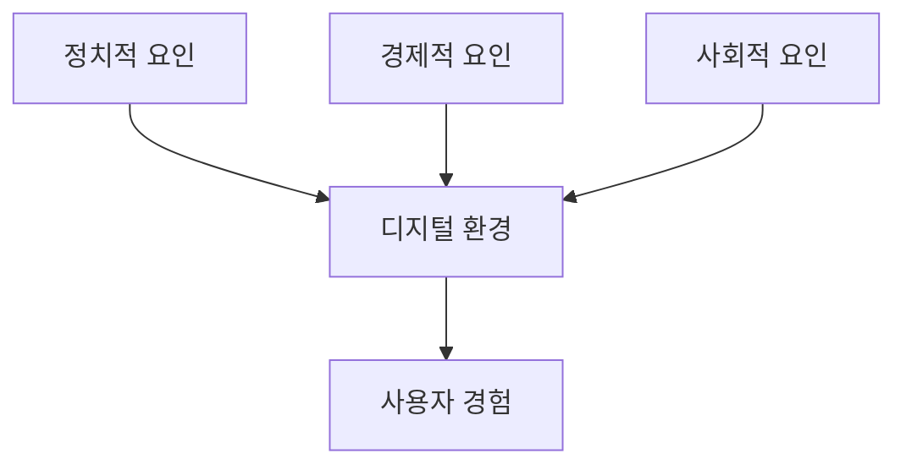

### .io 도메인의 역사적 배경

.io 도메인은 영국의 인도양 영토(Indian Ocean Territory)를 나타내는 국가 코드 최상위 도메인(ccTLD)이다. 그러나 이 도메인은 단순한 지리적 의미를 넘어, 기술 및 스타트업 커뮤니티에서 인기를 끌게 되었다. 특히, "I/O"라는 용어는 컴퓨터 과학에서 입력(Input)과 출력(Output)을 의미하기 때문에, 기술 관련 기업들이 이 도메인을 선호하게 되었다.

.io 도메인의 사용은 2000년대 초반부터 급증하기 시작했으며, 이는 스타트업과 기술 기업들이 이 도메인을 통해 혁신적이고 현대적인 이미지를 구축하고자 했기 때문이다. 이러한 경향은 현재까지도 지속되고 있으며, .io 도메인은 이제 기술 산업의 상징적인 도메인으로 자리 잡았다.

이와 같은 배경을 통해 .io 도메인은 단순한 웹 주소 이상의 의미를 가지게 되었으며, 이는 디지털 세계에서의 지정학적 변화와도 연결된다.

<!--
## 지정학적 변화와 디지털 인프라
   - 2.1. 영국의 Chagos Islands 주권 이전
   - 2.2. .io 도메인의 중요성
   - 2.3. 국제 관계가 인터넷에 미치는 영향
-->

## 지정학적 변화와 디지털 인프라

디지털 인프라는 현대 사회의 필수 요소로 자리 잡고 있으며, 지정학적 변화는 이러한 인프라에 큰 영향을 미치고 있다. 특히, 국가 간의 권력 이동이나 영토 분쟁은 디지털 자원의 관리와 사용에 직접적인 영향을 미친다.

**영국의 Chagos Islands 주권 이전**

Chagos Islands는 영국의 해외 영토로, 이 지역의 주권 문제는 국제 사회에서 큰 논란이 되고 있다. 이 지역은 미국의 군사 기지가 위치해 있으며, 이러한 군사적 중요성은 디지털 인프라의 발전에도 영향을 미친다. 예를 들어, 군사 기지의 존재는 해당 지역의 인터넷 인프라와 데이터 센터의 구축에 기여할 수 있다. 그러나 주권 문제가 해결되지 않으면, 이 지역의 디지털 자원은 불안정한 상황에 놓일 수 있다.

**.io 도메인의 중요성**

.io 도메인은 인도양에 위치한 영국의 인도양 영토(British Indian Ocean Territory)와 관련이 있다. 이 도메인은 기술 스타트업과 암호화폐 기업들 사이에서 인기가 높아지고 있으며, 이는 지정학적 변화와 밀접한 관련이 있다. .io 도메인은 'input/output'의 약자로, 기술적 의미를 내포하고 있어 많은 기업들이 이 도메인을 선택하고 있다. 그러나 이 도메인의 사용이 지속 가능할지는 국제 관계와 영토 문제에 따라 달라질 수 있다.

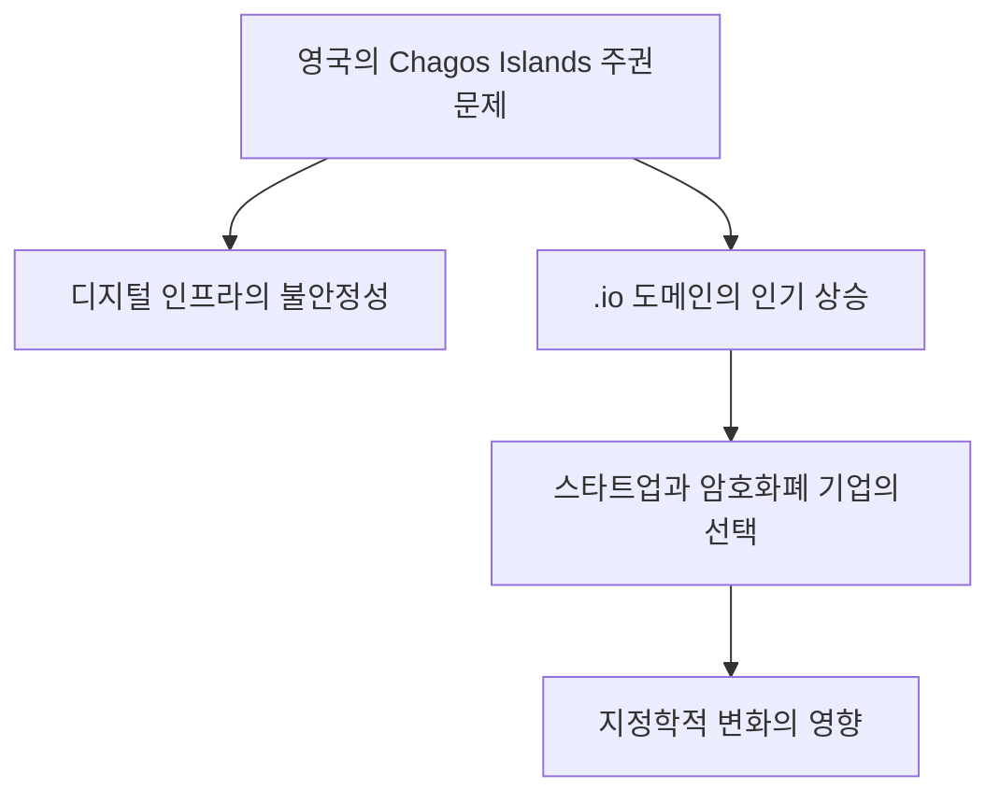

**국제 관계가 인터넷에 미치는 영향**

국제 관계는 인터넷의 구조와 운영 방식에 큰 영향을 미친다. 국가 간의 갈등이나 협력은 데이터 흐름, 인터넷 거버넌스, 그리고 사이버 보안 정책에 직접적인 영향을 미친다. 예를 들어, 특정 국가가 인터넷 검열을 시행하면, 해당 국가의 사용자들은 글로벌 인터넷 생태계에서 고립될 수 있다. 이러한 상황은 디지털 인프라의 발전을 저해하고, 국제적인 협력의 필요성을 더욱 부각시킨다.

결론적으로, 지정학적 변화는 디지털 인프라에 중대한 영향을 미치며, 이는 .io 도메인과 같은 특정 자원의 사용에도 영향을 미친다. 이러한 변화는 앞으로도 계속될 것이며, 디지털 세계에서의 국제 관계의 중요성을 더욱 강조하게 될 것이다.

<!--
## 역사적 선례
   - 3.1. 소련의 붕괴와 .su 도메인
   - 3.2. 유고슬라비아의 분열과 .yu 도메인
   - 3.3. IANA와 ICANN의 역할
-->

## 역사적 선례

디지털 세계에서의 도메인 네임은 단순한 주소 이상의 의미를 지닌다. 특정 도메인이 역사적, 정치적 사건과 연결될 수 있다는 점은 특히 흥미롭다. 이번 섹션에서는 소련의 붕괴와 유고슬라비아의 분열을 통해 도메인이 어떻게 변화했는지를 살펴보겠다.

### 소련의 붕괴와 .su 도메인

소련의 붕괴는 1991년 발생하였으며, 이로 인해 여러 독립 국가가 탄생하였다. 이 시기에 사용되던 .su 도메인은 소련을 나타내는 국가 코드 최상위 도메인(ccTLD)으로, 소련의 해체 이후에도 여전히 사용되었다. 그러나 시간이 지나면서 .su 도메인은 점차 사용이 줄어들었고, 새로운 독립 국가들은 각자의 ccTLD를 채택하게 되었다.

**소련의 붕괴와 .su 도메인의 변화**

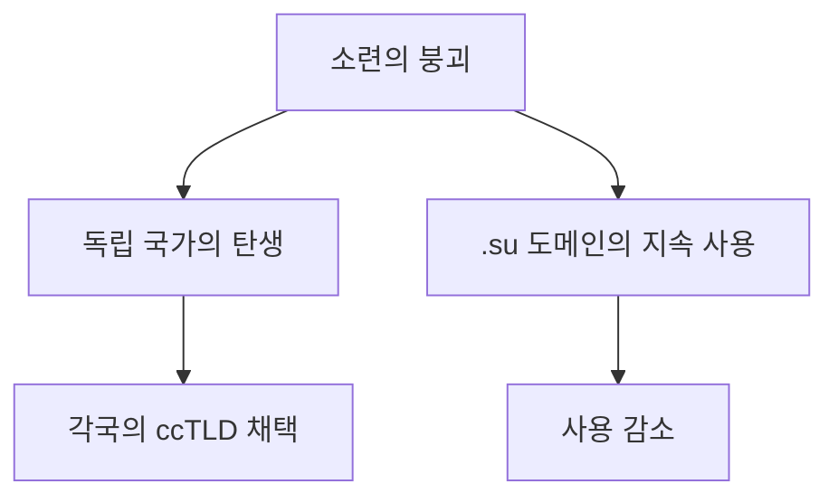

이러한 변화는 단순히 도메인의 사용에 그치지 않고, 각 국가의 디지털 정체성과도 밀접한 관련이 있다. .su 도메인은 이제 역사적인 상징으로 남아 있으며, 현재는 주로 레트로 웹사이트나 역사적 프로젝트에서 사용되고 있다.

### 유고슬라비아의 분열과 .yu 도메인

유고슬라비아의 분열은 1990년대 초반에 발생하였으며, 이로 인해 여러 국가가 독립하게 되었다. 이 시기에 사용되던 .yu 도메인은 유고슬라비아를 나타내는 ccTLD로, 분열 이후에도 일정 기간 동안 사용되었다. 그러나 각 독립 국가들은 자신들의 ccTLD를 채택하면서 .yu 도메인은 점차 사용이 줄어들게 되었다.

**유고슬라비아의 분열과 .yu 도메인의 변화**

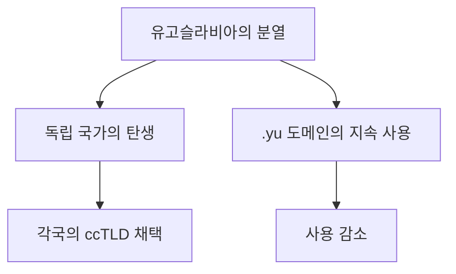

결국, .yu 도메인은 2010년 6월 30일에 공식적으로 사용이 중단되었으며, 이는 디지털 세계에서의 국가 정체성의 변화를 상징적으로 보여준다.

### IANA와 ICANN의 역할

IANA(Internet Assigned Numbers Authority)와 ICANN(Internet Corporation for Assigned Names and Numbers)은 도메인 네임 시스템의 관리와 운영에 중요한 역할을 한다. IANA는 IP 주소, 프로토콜 파라미터, 그리고 도메인 네임의 할당을 담당하며, ICANN은 이러한 시스템을 조정하고 정책을 수립하는 역할을 한다.

**IANA와 ICANN의 역할**

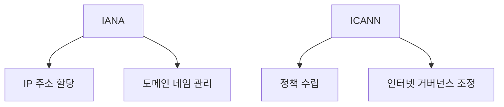

이 두 기관은 도메인 네임의 안정성과 신뢰성을 보장하는 데 필수적이며, 역사적 사건들이 디지털 세계에 미친 영향을 관리하는 데 중요한 역할을 한다. 이러한 기관의 존재는 지정학적 변화가 디지털 인프라에 미치는 영향을 이해하는 데 필수적이다.

<!--
## .io 도메인의 미래
   - 4.1. IANA의 규정과 .io 도메인의 퇴출 과정
   - 4.2. 스타트업과 암호화폐 기업의 .io 도메인 사용
   - 4.3. 디지털 역사와 물리적 역사 간의 연결
-->

## .io 도메인의 미래

### IANA의 규정과 .io 도메인의 퇴출 과정

IANA(Internet Assigned Numbers Authority)는 인터넷 자원의 할당 및 관리에 대한 권한을 가진 기관이다. .io 도메인은 영국의 인도양 영토에 속하는 국가 코드 최상위 도메인(ccTLD)으로, 최근 몇 년간 스타트업과 기술 기업들 사이에서 인기를 끌고 있다. 그러나 IANA의 규정에 따라, 특정 조건을 충족하지 못할 경우 .io 도메인은 퇴출될 수 있는 위험이 존재한다.

IANA는 ccTLD의 관리와 관련하여 특정 기준을 설정하고 있으며, 이러한 기준은 도메인의 사용과 관련된 법적, 정치적 요인에 따라 달라질 수 있다. 예를 들어, Chagos Islands의 주권 문제가 해결되지 않으면, .io 도메인의 관리가 불안정해질 수 있다. 이러한 상황은 .io 도메인을 사용하는 기업들에게 큰 영향을 미칠 수 있다.

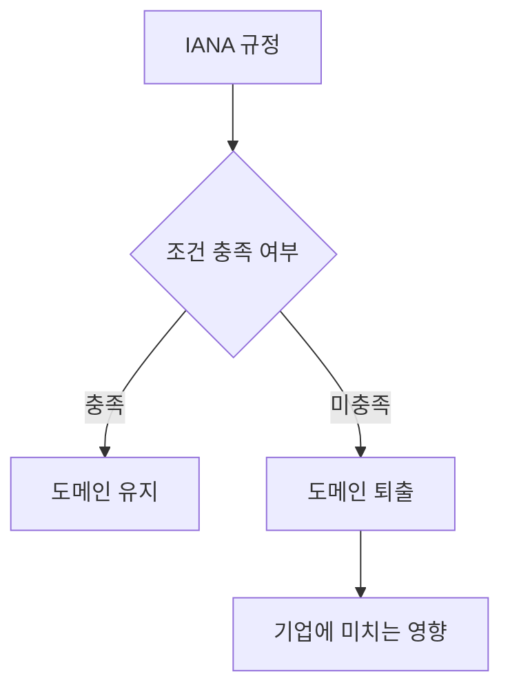

### 스타트업과 암호화폐 기업의 .io 도메인 사용

스타트업과 암호화폐 기업들은 .io 도메인을 선호하는 경향이 있다. 이는 .io가 "Input/Output"의 약자로 해석될 수 있어 기술적 이미지를 부각시키기 때문이다. 또한, .io 도메인은 짧고 기억하기 쉬운 특성 덕분에 브랜드 인지도 향상에 기여할 수 있다.

많은 스타트업들이 .io 도메인을 선택함으로써 혁신적이고 현대적인 이미지를 구축하고 있으며, 이는 투자자와 고객에게 긍정적인 인상을 남길 수 있다. 특히 암호화폐 기업들은 .io 도메인을 통해 기술 중심의 이미지를 강조하고, 글로벌 시장에서의 경쟁력을 높이고자 한다.

### 디지털 역사와 물리적 역사 간의 연결

디지털 세계와 물리적 세계는 서로 밀접하게 연결되어 있다. .io 도메인의 경우, 그 기원은 지정학적 요소와 관련이 깊다. Chagos Islands의 역사적 배경은 .io 도메인의 사용과 관리에 직접적인 영향을 미치고 있으며, 이는 디지털 자원의 할당이 단순한 기술적 문제를 넘어서는 복잡한 지정학적 맥락을 지니고 있음을 보여준다.

디지털 역사와 물리적 역사는 서로의 변화를 반영하며, 이는 기업들이 도메인을 선택할 때 고려해야 할 중요한 요소가 된다. 예를 들어, 특정 도메인이 지정학적 문제로 인해 퇴출될 경우, 해당 도메인을 사용하는 기업들은 새로운 도메인으로의 이전을 고려해야 할 것이다. 이러한 변화는 기업의 브랜드 이미지와 시장에서의 위치에 큰 영향을 미칠 수 있다. 

결론적으로, .io 도메인의 미래는 IANA의 규정, 스타트업과 암호화폐 기업의 사용 경향, 그리고 디지털과 물리적 역사 간의 상호작용에 의해 결정될 것이다. 기업들은 이러한 요소들을 면밀히 분석하여 도메인 선택에 신중을 기해야 한다.

<!--
## 예제
   - 5.1. .io 도메인을 사용하는 주요 기업 및 웹사이트
   - 5.2. 과거의 도메인 변화 사례 분석
-->

## 예제

### .io 도메인을 사용하는 주요 기업 및 웹사이트

.io 도메인은 최근 몇 년 동안 많은 스타트업과 기술 기업들 사이에서 인기를 끌고 있다. 이는 .io가 "Input/Output"의 약어로 해석될 수 있어 기술적인 이미지를 주기 때문이다. 다음은 .io 도메인을 사용하는 몇 가지 주요 기업 및 웹사이트이다.

- **Trello**: 프로젝트 관리 도구로 유명한 Trello는 .io 도메인을 사용하여 사용자에게 직관적인 경험을 제공한다.
- **GitHub**: 오픈 소스 프로젝트와 협업 플랫폼인 GitHub는 .io 도메인을 활용하여 다양한 개발자 도구를 제공한다.
- **Socket.io**: 실시간 웹 애플리케이션을 위한 JavaScript 라이브러리로, .io 도메인을 통해 쉽게 접근할 수 있다.

이 외에도 많은 스타트업들이 .io 도메인을 선택하고 있으며, 이는 기술 혁신과 관련된 이미지를 강화하는 데 기여하고 있다.

### 과거의 도메인 변화 사례 분석

도메인 변화는 종종 정치적, 경제적, 사회적 요인에 의해 영향을 받는다. 과거의 사례를 통해 이러한 변화를 살펴보면, .io 도메인의 미래를 예측하는 데 도움이 될 수 있다.

- **.su 도메인**: 소련의 붕괴 이후, .su 도메인은 사용이 줄어들었고, 결국 대부분의 웹사이트가 .ru 도메인으로 이전하였다. 이는 국가의 정치적 변화가 도메인 사용에 미치는 영향을 잘 보여준다.
  
- **.yu 도메인**: 유고슬라비아의 분열로 인해 .yu 도메인은 여러 국가로 나뉘어 사용되었고, 결국 각국은 자신의 ccTLD를 채택하게 되었다. 이는 국가의 정체성과 관련된 도메인 사용의 변화를 나타낸다.

이러한 사례들은 지정학적 변화가 디지털 인프라에 미치는 영향을 잘 보여준다. 

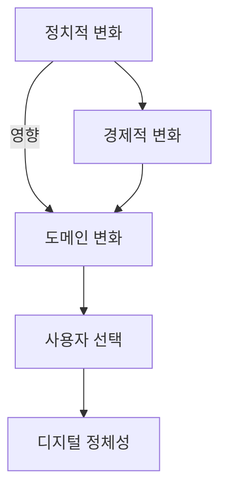

위의 다이어그램은 정치적 및 경제적 변화가 도메인 사용에 미치는 영향을 시각적으로 나타낸 것이다. 이러한 요소들은 디지털 세계에서의 지정학적 변화의 중요성을 강조한다.

<!--
## FAQ
   - 6.1. .io 도메인이 사라지면 어떤 영향이 있을까?
   - 6.2. 대체 도메인으로 무엇을 선택해야 할까?
   - 6.3. IANA와 ICANN의 차이점은 무엇인가?
-->

## FAQ

### .io 도메인이 사라지면 어떤 영향이 있을까?

.io 도메인이 사라질 경우, 여러 가지 영향이 있을 것으로 예상된다. 첫째, 많은 스타트업과 기술 기업들이 .io 도메인을 사용하고 있기 때문에, 이들 기업의 웹사이트 주소가 변경되어야 한다. 이는 브랜드 인지도에 부정적인 영향을 미칠 수 있으며, 사용자들이 새로운 도메인으로의 전환에 어려움을 겪을 수 있다. 둘째, .io 도메인을 사용하는 서비스들이 일시적으로 중단되거나, 사용자들이 해당 서비스에 접근하는 데 어려움을 겪을 수 있다. 마지막으로, .io 도메인이 사라짐에 따라 대체 도메인으로의 전환이 필요하게 되며, 이는 추가적인 비용과 시간을 요구할 것이다.

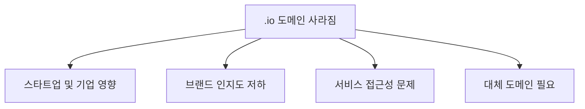

### 대체 도메인으로 무엇을 선택해야 할까?

대체 도메인을 선택할 때는 몇 가지 요소를 고려해야 한다. 첫째, 브랜드와의 연관성을 고려해야 한다. 예를 들어, .tech, .app, .dev와 같은 도메인은 기술 관련 기업에 적합할 수 있다. 둘째, 사용자의 인식과 기억하기 쉬운 도메인을 선택하는 것이 중요하다. 마지막으로, SEO(검색 엔진 최적화) 측면에서도 유리한 도메인을 선택하는 것이 좋다. 예를 들어, .com 도메인은 여전히 가장 널리 알려진 도메인으로, 사용자들에게 신뢰감을 줄 수 있다.

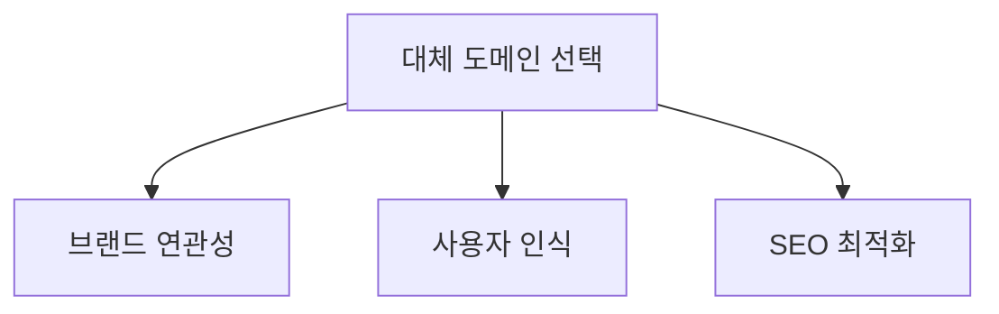

### IANA와 ICANN의 차이점은 무엇인가?

IANA(Internet Assigned Numbers Authority)와 ICANN(Internet Corporation for Assigned Names and Numbers)은 모두 인터넷의 관리와 관련된 기관이지만, 그 역할은 다르다. IANA는 IP 주소, 도메인 이름, 프로토콜 파라미터 등을 관리하는 기술적 역할을 수행한다. 반면, ICANN은 이러한 자원들이 공정하고 효율적으로 사용될 수 있도록 정책을 수립하고 조정하는 역할을 한다. 즉, IANA는 기술적 관리에 중점을 두고 있으며, ICANN은 정책적 관리에 중점을 두고 있다.

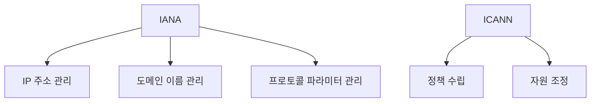

이와 같이, .io 도메인의 사라짐, 대체 도메인 선택, 그리고 IANA와 ICANN의 차이점에 대한 이해는 디지털 세계에서의 지정학적 변화와 그에 따른 영향을 파악하는 데 중요한 요소가 된다.

<!--
## 관련 기술
   - 7.1. 도메인 네임 시스템(DNS)
   - 7.2. 국가 코드 최상위 도메인(ccTLD)
   - 7.3. 인터넷 거버넌스와 정책
-->

## 관련 기술

### 도메인 네임 시스템(DNS)

도메인 네임 시스템(DNS)은 인터넷에서 도메인 이름을 IP 주소로 변환하는 시스템이다. 사용자가 웹사이트에 접속할 때, DNS는 사용자가 입력한 도메인 이름을 해당 웹사이트의 서버 IP 주소로 변환하여 연결을 가능하게 한다. DNS는 계층 구조로 구성되어 있으며, 루트 DNS 서버, TLD DNS 서버, 권한 있는 DNS 서버로 나뉜다.

**DNS의 기본 구조는 다음과 같다:**

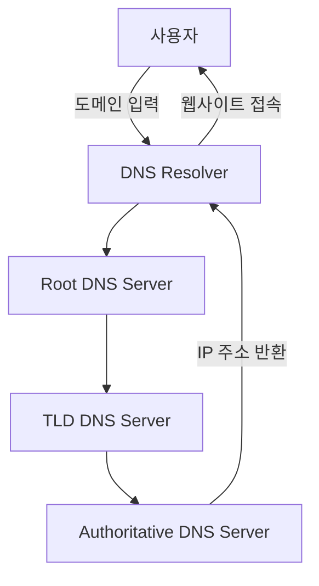

이러한 구조 덕분에 사용자는 복잡한 숫자 대신 기억하기 쉬운 도메인 이름을 사용하여 웹사이트에 접근할 수 있다.

### 국가 코드 최상위 도메인(ccTLD)

국가 코드 최상위 도메인(ccTLD)은 특정 국가나 지역을 나타내는 도메인 이름의 최상위 레벨이다. 예를 들어, 한국의 경우 .kr, 일본은 .jp, 영국은 .uk와 같은 형태로 존재한다. ccTLD는 각국의 인터넷 정책과 규제에 따라 관리되며, 해당 국가의 기업이나 개인이 주로 사용한다.

ccTLD는 특정 국가의 온라인 존재감을 강화하고, 지역 사용자에게 신뢰성을 제공하는 역할을 한다. 또한, ccTLD는 각국의 문화와 언어에 맞춘 도메인 이름을 사용할 수 있는 기회를 제공한다.

### 인터넷 거버넌스와 정책

인터넷 거버넌스는 인터넷의 운영과 관리를 위한 정책 및 규제 체계를 의미한다. 이는 다양한 이해관계자, 즉 정부, 기업, 비영리 단체, 사용자 등이 참여하여 형성된다. 인터넷 거버넌스는 기술적, 법적, 사회적 측면을 포함하며, 인터넷의 안전성과 안정성을 보장하기 위한 노력이 필요하다.

인터넷 거버넌스의 주요 기관으로는 ICANN(Internet Corporation for Assigned Names and Numbers)과 IANA(Internet Assigned Numbers Authority)가 있다. 이들 기관은 도메인 이름과 IP 주소의 할당 및 관리, 그리고 인터넷의 기술적 표준을 설정하는 역할을 한다.

**인터넷 거버넌스의 주요 요소는 다음과 같다:**

- 정책 결정 과정
- 기술적 표준화
- 사용자 권리 보호
- 사이버 보안 및 프라이버시

이러한 요소들은 디지털 세계에서의 지정학적 변화와 밀접한 관련이 있으며, 각국의 정책 변화가 인터넷 환경에 미치는 영향을 이해하는 데 중요한 역할을 한다.

<!--
## 결론
   - 디지털 세계에서의 지정학적 변화의 중요성
   - 미래의 도메인 선택에 대한 교훈
-->

## 결론

디지털 세계에서의 지정학적 변화의 중요성

디지털 세계는 단순한 기술적 발전을 넘어, 국제 정치와 경제의 복잡한 상호작용을 반영하고 있다. 지정학적 변화는 인터넷 인프라와 도메인 네임 시스템에 직접적인 영향을 미치며, 이는 기업과 개인의 온라인 존재에 중대한 결과를 초래한다. 예를 들어, 특정 국가의 정치적 불안정성은 해당 국가의 도메인 사용에 대한 신뢰를 저하시킬 수 있으며, 이는 기업의 브랜드 이미지와 고객 신뢰도에 부정적인 영향을 미칠 수 있다. 따라서, 디지털 환경에서의 지정학적 변화는 단순한 배경 요소가 아니라, 전략적 의사결정의 중요한 요소로 자리 잡고 있다.

**미래의 도메인 선택에 대한 교훈**

미래의 도메인 선택은 단순히 기술적 요인뿐만 아니라, 지정학적 맥락을 고려해야 한다. 기업과 개인은 도메인을 선택할 때, 해당 도메인이 속한 국가의 정치적 안정성, 법적 환경, 그리고 국제 관계를 면밀히 분석해야 한다. 예를 들어, .io 도메인은 현재 스타트업과 암호화폐 기업들 사이에서 인기를 끌고 있지만, 그 배경에는 영국의 Chagos Islands에 대한 주권 문제와 같은 복잡한 지정학적 요소가 존재한다. 이러한 요소들은 도메인의 신뢰성과 지속 가능성에 영향을 미칠 수 있다.

다음은 도메인 선택 시 고려해야 할 요소들을 시각적으로 나타낸 다이어그램이다.

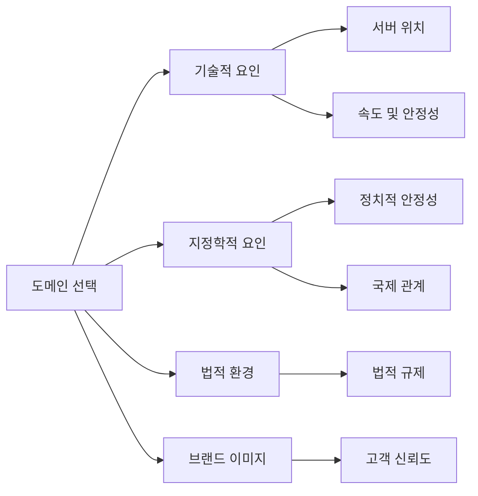

결론적으로, 디지털 세계에서의 지정학적 변화는 단순한 배경이 아니라, 기업과 개인의 전략적 의사결정에 필수적으로 고려해야 할 요소이다. 미래의 도메인 선택은 이러한 복합적인 요소들을 반영하여 이루어져야 하며, 이는 디지털 환경에서의 성공적인 존재감을 유지하는 데 중요한 역할을 할 것이다.

<!--
## 참고 문헌
   - 관련 기사 및 연구 자료 링크
   - Gareth Edwards의 다른 저작물 및 기고문
-->

<!--
##### Reference #####
-->

## Reference

* [https://every.to/p/the-disappearance-of-an-internet-domain](https://every.to/p/the-disappearance-of-an-internet-domain)
* [https://en.wikipedia.org/wiki/ISO_3166-1_alpha-2](https://en.wikipedia.org/wiki/ISO_3166-1_alpha-2)
* [UK will give sovereignty of Chagos Islands to Mauritius - BBC](https://www.bbc.com/news/articles/c98ynejg4l5o)

<!--
_Today we have something a little different from_ **_Gareth Edwards_** _, who
typically chronicles the forgotten history of Silicon Valley in his column,_ [
_The Crazy Ones_ ](https://every.to/the-crazy-ones) _. When the British
government announced last week that it was transferring sovereignty of an
island in the Indian Ocean to the country of Mauritius, Gareth immediately
realized its online implications: the end of the .io domain suffix. In this
piece, he explores how geopolitical changes can unexpectedly disrupt the
digital world. His exploration of historical precedents—such as the fall of
the Soviet Union and the breakup of Yugoslavia—offers valuable context for
tech founders, users, and observers. Read this for a look at the unexpected
intersection of international relations and internet infrastructure.—_ [ _Kate
Lee_ ](https://every.to/news/kate-lee-joins-every-as-editor-in-chief)

_Was this newsletter forwarded to you?_ [ _Sign up_
](https://every.to/account) _to get it in your inbox._

* * *

On October 3, the British government announced that it was [ giving up
sovereignty ](https://www.bbc.co.uk/news/articles/c98ynejg4l5o) over a small
tropical atoll in the Indian Ocean known as the Chagos Islands. The islands
would be handed over to the neighboring island country of Mauritius, about
1,100 miles off the southeastern coast of Africa.

The story did not make the tech press, but perhaps it should have. The
decision to transfer the islands to their new owner will result in the loss of
one of the tech and gaming industry’s preferred top-level domains: .io.

Whether it’s Github.io, gaming site itch.io, or even [ Google I/O
](https://io.google/2024/) (which arguably kicked off the trend in 2008), .io
has been a constant presence in the tech lexicon. Its popularity is sometimes
explained by how it [ represents ](https://blog.hubspot.com/website/io-
domains) the abbreviation for “input/output,” or the data received and
processed by any system. What’s not often acknowledged is that it’s more than
a quippy domain. It’s a _country code_ top-level domain (ccTLD) related to a
nation—meaning it involves politics far beyond the digital world.

Since 1968, the UK and U.S have operated a major military base on the Chagos
Islands (officially known as the British Indian Ocean Territory) , but the
neighboring nation of Mauritius has always disputed British sovereignty over
them. The Mauritian government has long argued that the British illegally
retained control when Mauritius gained independence. It has taken over 50
years, but that dispute has finally been resolved. In return for a 99-year
lease for the military base, the islands will become part of Mauritius.

Once this treaty is signed, the British Indian Ocean Territory will cease to
exist. Various international bodies will update their records. In particular,
the International Standard for Organization (ISO) will remove country code
“IO” from [ its specification
](https://en.wikipedia.org/wiki/ISO_3166-1_alpha-2) . The Internet Assigned
Numbers Authority (IANA), which creates and delegates top-level domains, uses
this specification to determine which top-level country domains should exist.
Once IO is removed, the IANA [ will refuse to allow
](https://www.iana.org/help/cctld-retirement) any new registrations with a .io
domain. It will also automatically begin the process of retiring existing
ones. (There is no official count of the number of extant .io domains.)

Officially, .io—and countless websites—will disappear. At a time when domains
can go for [ millions of dollars ](https://techcrunch.com/2024/08/10/maybe-
friend-wasnt-crazy-for-spending-1-8m-on-a-domain-after-all/) , it’s a shocking
reminder that there are forces outside of the internet that still affect our
digital lives.

##  When domains outlive countries

The removal of an entire country or territory from the world map is incredibly
rare, so one might ask why the process for deleting a domain is so clearly
documented. So automatic. So… _final_ .

The answer is simple: history.

There are two organizations responsible for domains and internet addresses.
The IANA decides what should and shouldn’t be a top-level domain, such as
.com, .org, .uk, or .nz. The organization originated at the University of
Southern California, although it was only formalized in 1994, when it won a
contract put out by the U.S. It operated for several years as a small research
and management committee. As the internet grew, it became clear that a more
formal setup was required. By 1998, the IANA became part of a new
organization: the Internet Corporation for Assigned Names and Numbers (ICANN).
ICANN, based in the U.S., was given the broader responsibility of overseeing
the operational stability of the internet and ensuring international interests
were represented.

These two organizations might seem like they have mundane roles. But they have
found themselves making some of the hardest decisions on the global internet.

On September 19, 1990, the IANA created and delegated the top-level domain .su
to the USSR. Less than a year later, the USSR collapsed. At the time, nobody
thought about what should happen with the .su domain—the internet as we know
it was still years away. So the .su domain was handed to Russia to operate
alongside its own (.ru). The Russian government agreed that it would
eventually be shut down, but no clear rules around its governance or when that
should happen were defined.

But ambiguity is the worst thing for a top-level domain. Unknowingly, this
decision created an environment in which .su became a digital wild west.
Today, it is a barely policed top-level domain, a plausibly deniable home for
Russian dark ops and a place where supremacist content and cyber-crime have
found cover.

A few years later, in 1992, the IANA learned a similarly harsh lesson at the
end of the Balkans War, which saw the breakup of Yugoslavia into several
smaller states. In its aftermath, the joint nation of Serbia and Montenegro
attempted to adopt the name “Federal Republic of Yugoslavia.” Slovenia and
Croatia objected, claiming that it implied Serbia and Montenegro were
Yugoslavia’s legitimate successors. The two countries protested to the UN.

As the international issue over Serbia and Montenegro’s name rumbled on
throughout the early nineties, the IANA remained unsure about who should
control .yu, Yugoslavia’s top-level domain. Email access and the internet were
now integral to research and international discussions, and the IANA’s
ambiguity led to an extraordinary act of academic espionage.

[ According to the journalist Kaloyan Kolev
](https://www.thedial.world/articles/news/issue-9/yugolsav-wars-yu-domain-
history-icann) , Slovenian academics traveled to Serbia at the end of 1992.
Their destination was the University of Belgrade in the country’s capital. On
arrival, they broke into the university and stole all the hosting software and
domain records for the .yu top-level domain—everything they needed to seize
control. For the next two years, the .yu domain was unofficially operated by
ARNES (Academic and Research Network of Slovenia), which repeatedly denied its
involvement in the original heist. ARNES rejected all requests by Serbian
institutions for new domains, severely limiting the country’s ability to
participate in the growing internet community. The situation became so messy
that, in 1994, IANA founding manager Jon Postel personally stepped in and
overrode IANA regulations, forcibly transferring ownership of the .yu domain
back to the University of Belgrade.

In 2006, Montenegro declared independence from Serbia. With the digital
revolution now firmly underway, the IANA was determined not to let chaos reign
once again. It created two new top-level domains: .rs for Serbia and .me for
Montenegro. Both were issued on the requirement that .yu would officially be
terminated. It would take until 2010 for this to happen, but the IANA
eventually got its way. Burned by the experience, the organization laid down
the new, stricter set of rules and timescales for top-level domain expiration
that exist today.

It’s these rules that will soon apply to the .io domain. They are firm, and
they are clear. Once the country code no longer exists, the domain must cease
to exist, too, ideally within three to five years. Like a tenant being told
that their landlord is selling up and they must move, every individual and
company who uses a .io domain will be told the same.

##  The endurance of physical history

.io has become popular with startups, particularly [ those involved in crypto
](https://kinsta.com/knowledgebase/what-is-io/) . These are businesses that
often identify with one of the original principles of the internet—that
cyberspace grants [ a form of independence ](https://www.eff.org/cyberspace-
independence) to those who use it. Yet it is the long tail of real-world
history that might force on them a major change.

The IANA may fudge its own rules and allow .io to continue to exist. Money
talks, and there is a lot of it tied up in .io domains. However, the history
of the USSR and Yugoslavia still looms large, and the IANA may feel that
playing fast and loose with top-level domains will only come back to haunt it.

Whatever happens, the warning for future tech founders is clear: Be careful
when picking your top-level domain. Physical history is never as separate from
our digital future as we like to think.

* * *

_Gareth Edwards is a digital strategist, writer, and historian who has worked
for startups and corporations in both the UK and U.S. He is an avid collector
of old computers, rare books and interviews, and abandoned cats. Follow him
on_ [ _X_ ](https://twitter.com/garius) _,_ [ _Mastodon_
](https://mastodon.me.uk/@garius) _, and_ [ _BlueSky_
](https://bsky.app/profile/garius.bsky.social) _._

_To read more essays like this, subscribe to_ [ _Every_
](https://every.to/subscribe) _, and follow us on X at_ [ _@every_
](http://twitter.com/every) _and on_ [ _LinkedIn_
](https://www.linkedin.com/company/everyinc/) _._

_An earlier version of this article incorrectly stated that the Berlin Wall
fell in 1990, not 1989. We regret the error._

-->

<!--

-->

