## 개요

### 디지털 세계와 지정학적 변화의 상관관계

디지털 세계는 현대 사회의 모든 측면에 깊숙이 침투해 있으며, **지정학적 변화**와 밀접한 관계를 맺고 있다. 국가 간의 정치적·경제적 변화는 디지털 인프라와 인터넷 사용 방식에 직접 영향을 미친다. 특정 국가의 정책 변화는 인터넷 접근성, 데이터 주권, 글로벌 기업의 운영 방식, 그리고 궁극적으로 사용자 경험까지 바꾼다.

다음 요소들을 고려해야 한다.

- **정치적 요인**: 정부의 정책, 법률, 규제가 디지털 환경에 미치는 영향
- **경제적 요인**: 글로벌 경제 변화가 디지털 비즈니스 모델과 시장 접근에 미치는 영향
- **사회적 요인**: 사회 변화가 인터넷 사용 패턴과 디지털 기술 수용에 미치는 영향

이러한 요소들의 상호작용을 다이어그램으로 나타내면 다음과 같다.

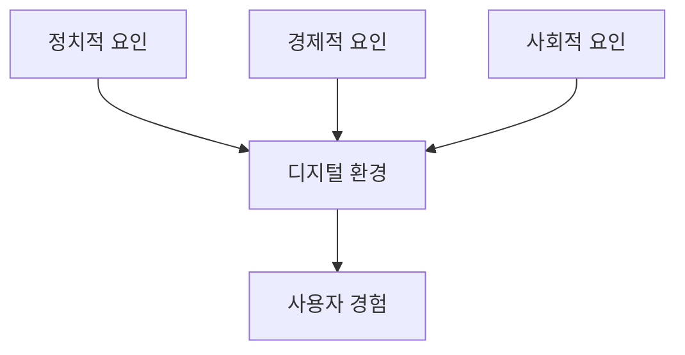
```mermaid
graph TD
  PolFactor["정치적 요인"]
  EconFactor["경제적 요인"]
  SocFactor["사회적 요인"]
  DigiEnv["디지털 환경"]
  UserExp["사용자 경험"]
  PolFactor --> DigiEnv
  EconFactor --> DigiEnv
  SocFactor --> DigiEnv
  DigiEnv --> UserExp
```

### .io 도메인의 역사적 배경

**.io**는 영국 인도양 영토(British Indian Ocean Territory)를 나타내는 **국가 코드 최상위 도메인(ccTLD)**이다. 단순한 지리적 의미를 넘어, 기술·스타트업 커뮤니티에서 널리 쓰이게 되었다. 컴퓨터 과학에서 **I/O(Input/Output)**는 입력과 출력을 의미하므로, 기술 관련 기업들이 이 도메인을 선호하게 된 것이다.

.io 도메인 사용은 2000년대 초반부터 급증했고, GitHub Pages(github.io), itch.io, Google I/O 등에서 사용되며 기술 산업의 상징적 도메인으로 자리 잡았다. 이처럼 .io는 웹 주소를 넘어 지정학과 디지털 세계가 만나는 대표 사례가 되었다.

---

## 지정학적 변화와 디지털 인프라

### 영국의 차고스 제도 주권 이전

**차고스 제도(Chagos Islands)**는 영국 해외 영토로, 인도양에 위치한다. 2024년 10월 영국 정부는 이 지역의 주권을 **모리셔스**에 이양하기로 발표했다. 해당 지역에는 미국 군사 기지(디에고 가르시아)가 있어 지정학적·군사적 중요성이 크다. 주권 이양이 완료되면 **British Indian Ocean Territory**는 공식적으로 소멸하고, ISO에서 국가 코드 **IO**가 제거될 예정이다.

### .io 도메인의 중요성

.io는 인도양 영토와 연관된 ccTLD이지만, 기술·게임·암호화폐 업계에서 널리 쓰인다. 'input/output' 연상으로 기술적 이미지를 강화하고, 짧고 기억하기 쉬운 특성으로 브랜드에 유리하다. 다만 이 도메인의 지속 가능성은 **국제 관계와 영토 문제**에 직접 좌우된다.

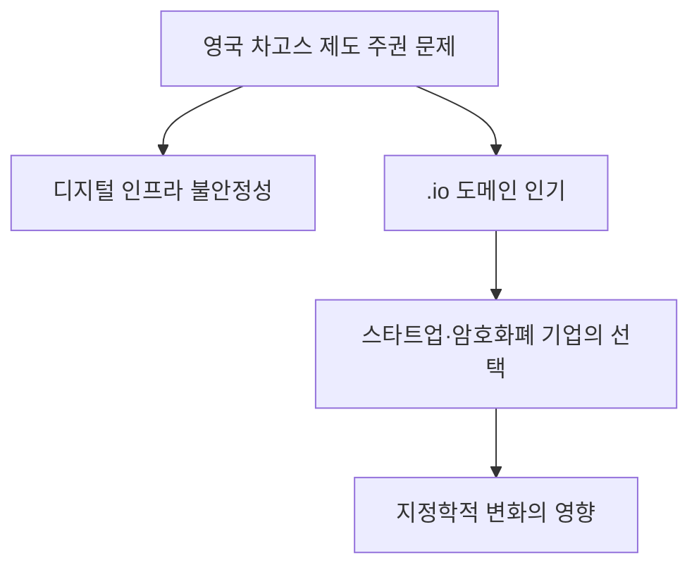
```mermaid
graph TD
  ChagosSovereignty["영국 차고스 제도 주권 문제"]
  InfraUnstable["디지털 인프라 불안정성"]
  IoPopular[".io 도메인 인기"]
  StartupChoice["스타트업·암호화폐 기업의 선택"]
  GeoImpact["지정학적 변화의 영향"]
  ChagosSovereignty --> InfraUnstable
  ChagosSovereignty --> IoPopular
  IoPopular --> StartupChoice
  StartupChoice --> GeoImpact
```

### 국제 관계가 인터넷에 미치는 영향

국제 관계는 인터넷 구조와 운영 방식에 큰 영향을 미친다. 국가 간 갈등·협력은 데이터 흐름, 인터넷 거버넌스, 사이버 보안 정책에 직결된다. 특정 국가의 인터넷 검열은 해당국 사용자를 글로벌 생태계에서 고립시키고, 디지털 인프라 발전을 저해한다. 지정학적 변화는 .io와 같은 특정 자원의 사용 가능성에도 그대로 반영된다.

---

## 역사적 선례

### 소련의 붕괴와 .su 도메인

1990년 9월 IANA는 소련(USSR)에 **.su** 도메인을 위임했다. 불과 1년여 만에 소련이 붕괴했지만, 당시에는 .su의 운명을 어떻게 할지에 대한 규칙이 없었다. .su는 러시아에 넘겨져 .ru와 함께 운영되기로 했고, 러시아는 "언젠가 폐쇄하겠다"고 했으나 구체적 시한과 거버넌스 규칙은 정의되지 않았다.

그 결과 **.su는 사실상 규제가 약한 도메인**이 되었고, 악성 활동·사이버 범죄·극단주의 콘텐츠에 악용되는 사례가 보고되었다. 도메인 관리의 모호함이 디지털 세계에 어떤 결과를 낳는지 보여주는 교훈이 되었다.

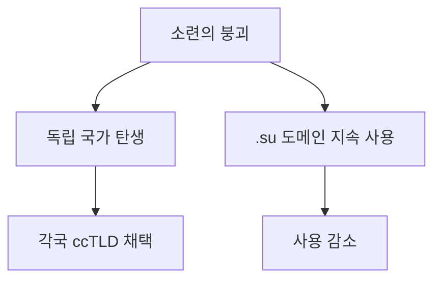
```mermaid
graph TD
  USSRCollapse["소련의 붕괴"]
  NewNations["독립 국가 탄생"]
  CcTLDAdopt["각국 ccTLD 채택"]
  SuContinued[".su 도메인 지속 사용"]
  SuDecline["사용 감소"]
  USSRCollapse --> NewNations
  NewNations --> CcTLDAdopt
  USSRCollapse --> SuContinued
  SuContinued --> SuDecline
```

### 유고슬라비아의 분열과 .yu 도메인

1990년대 초 발칸 전쟁으로 유고슬라비아가 해체되었다. **.yu**는 유고슬라비아의 ccTLD였는데, IANA는 .yu의 관리 주체를 누구로 할지 불명확하게 두었다. 그 결과 1992년 말 슬로베니아 학자들이 베오그라드 대학을 방문해 .yu 운영에 필요한 호스팅 소프트웨어와 도메인 기록을 가져가는 **학술 스파이 사건**이 발생했다. 이후 약 2년간 .yu는 슬로베니아 학술망(ARNES)이 비공식 운영했고, 세르비아 측의 신규 도메인 요청이 거절되는 등 혼란이 계속되었다. 1994년 IANA의 존 포스텔이 직접 개입해 .yu를 베오그라드 대학으로 강제 이전했다.

2006년 몬테네그로가 세르비아에서 독립한 뒤, IANA는 **.rs(세르비아)**와 **.me(몬테네그로)**를 새로 만들고, .yu의 공식 종료를 조건으로 했다. 2010년 .yu는 공식적으로 사용이 중단되었다. 이 경험을 바탕으로 IANA는 **ccTLD 폐쇄에 대한 명확한 규칙과 기한**(대략 3~5년)을 정립했으며, 이 규칙이 앞으로 .io에도 적용될 수 있다.

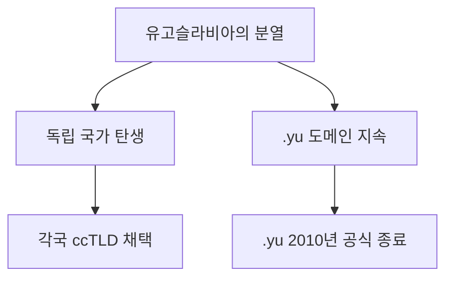
```mermaid
graph TD
  YugoBreakup["유고슬라비아의 분열"]
  NewStates["독립 국가 탄생"]
  EachCcTLD["각국 ccTLD 채택"]
  YuContinued[".yu 도메인 지속"]
  YuRetired[".yu 2010년 공식 종료"]
  YugoBreakup --> NewStates
  NewStates --> EachCcTLD
  YugoBreakup --> YuContinued
  YuContinued --> YuRetired
```

### IANA와 ICANN의 역할

**IANA(Internet Assigned Numbers Authority)**는 IP 주소, 프로토콜 파라미터, 도메인 네임의 할당을 담당한다. **ICANN(Internet Corporation for Assigned Names and Numbers)**은 인터넷 운영 안정성과 국제 이해관계 대표를 위한 정책 수립·조정을 담당한다. IANA는 1998년 이후 ICANN의 일부로 기능하며, 두 기관은 도메인 네임의 안정성과 신뢰성을 유지하는 데 필수적이다.

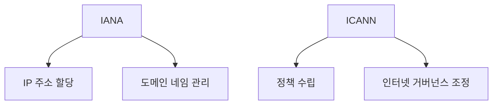
```mermaid
graph TD
  IANA["IANA"]
  IPAssign["IP 주소 할당"]
  DomainMgmt["도메인 네임 관리"]
  ICANN["ICANN"]
  Policy["정책 수립"]
  Governance["인터넷 거버넌스 조정"]
  IANA --> IPAssign
  IANA --> DomainMgmt
  ICANN --> Policy
  ICANN --> Governance
```

---

## .io 도메인의 미래

### IANA 규정과 .io 퇴출 가능성

IANA는 ccTLD를 **ISO 3166-1 alpha-2** 국가 코드에 연동해 관리한다. 차고스 제도가 모리셔스로 이양되면 ISO에서 **IO** 코드가 제거되고, IANA는 [ccTLD 폐쇄 절차](https://www.iana.org/help/cctld-retirement)에 따라 .io에 대한 **신규 등록을 거부**하고, 기존 .io 도메인의 **퇴출 절차**(보통 3~5년)를 진행할 수 있다. 다만 모리셔스가 .io를 인수·운영하는 등 다른 합의가 이루어질 가능성도 있어, 최종 결과는 조약 체결과 정책 결정에 달려 있다.

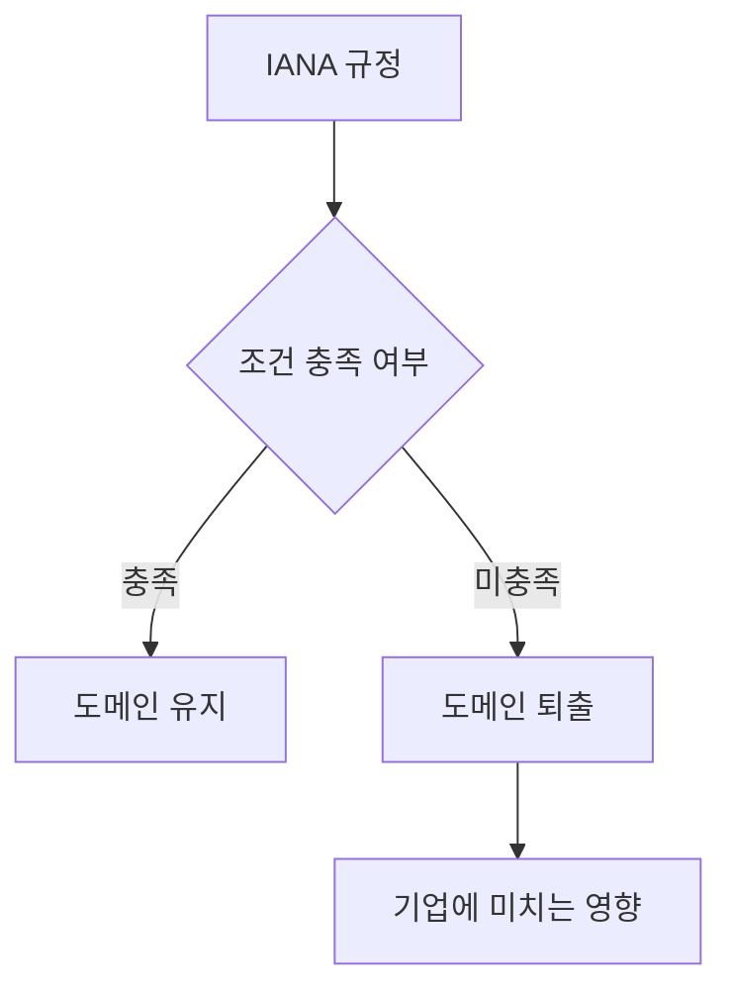
```mermaid
graph TD
  IANARules["IANA 규정"]
  CondCheck{"조건 충족 여부"}
  DomainKeep["도메인 유지"]
  DomainRetire["도메인 퇴출"]
  BizImpact["기업에 미치는 영향"]
  IANARules --> CondCheck
  CondCheck -->|"충족"| DomainKeep
  CondCheck -->|"미충족"| DomainRetire
  DomainRetire --> BizImpact
```

### 스타트업·암호화폐 기업의 .io 사용

스타트업과 암호화폐 관련 서비스는 .io를 많이 사용한다. 기술·I/O 이미지와 짧은 도메인으로 브랜드 인지도를 높이려는 전략이다. .io가 퇴출되거나 운영 주체가 바뀌면, 이들 기업은 도메인 이전·리다이렉트·SEO 재정비 등 실질적 비용을 감수해야 한다.

### 디지털 역사와 물리적 역사의 연결

.io의 기원은 지정학에 뿌리를 두고 있다. 차고스 제도의 역사와 주권 논란은 .io의 사용·관리와 분리될 수 없으며, **디지털 자원의 할당이 기술을 넘어 지정학적 맥락**을 가짐을 보여준다. 도메인 선택 시 해당 ccTLD의 지정학적·법적 안정성을 고려하는 것이 중요하다.

---

## .io 도메인 사용 사례

### 주요 서비스·기업

- **GitHub Pages**: `*.github.io` 서브도메인으로 정적 사이트·프로젝트 페이지 제공
- **itch.io**: 인디 게임·크리에이터 마켓플레이스
- **Google I/O**: 연례 개발자 컨퍼런스 및 관련 서비스
- **Trello**: 프로젝트 관리 도구(과거 .io 사용 등)
- **Socket.io**: 실시간 웹 소켓 라이브러리

이 외에도 수많은 스타트업과 개발자 도구가 .io를 사용하고 있어, 퇴출 시 이전 비용과 사용자 혼란이 클 수 있다.

### 과거 도메인 변화 사례

- **.su**: 소련 붕괴 후 사용이 줄었고, 대부분 .ru 등으로 이전. 국가 해체가 도메인 사용에 미친 대표 사례.
- **.yu**: 유고슬라비아 해체 후 분쟁을 거쳐 2010년 공식 종료. IANA가 ccTLD 폐쇄 규칙을 강화하는 계기가 됨.

정치·경제 변화가 도메인 생명주기에 미치는 영향을 다음처럼 요약할 수 있다.

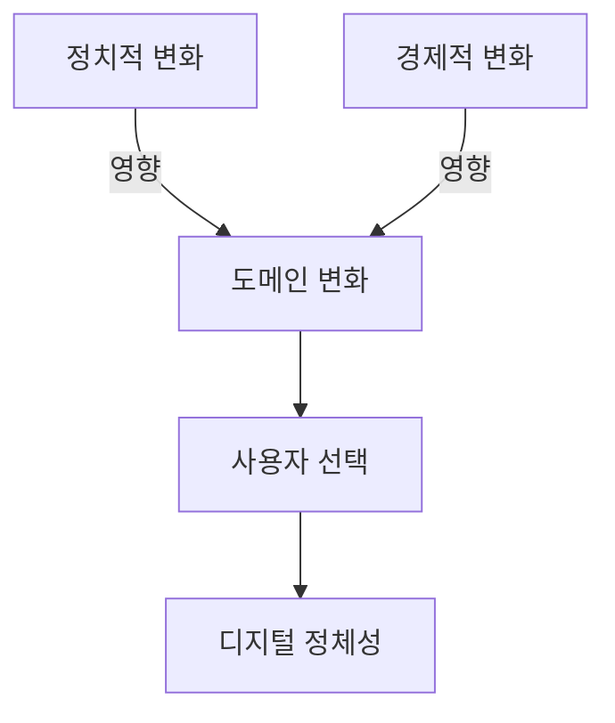
```mermaid
graph TD
  PolChange["정치적 변화"]
  EconChange["경제적 변화"]
  DomainChange["도메인 변화"]
  UserChoice["사용자 선택"]
  DigitalId["디지털 정체성"]
  PolChange -->|"영향"| DomainChange
  EconChange -->|"영향"| DomainChange
  DomainChange --> UserChoice
  UserChoice --> DigitalId
```

---

## FAQ

### .io 도메인이 사라지면 어떤 영향이 있을까?

- **스타트업·기업**: 웹 주소 변경, 브랜드 인지도 저하, 사용자 접근 혼란
- **서비스**: 일시 중단 가능성, 새 도메인으로의 이전·리다이렉트 비용
- **개발자·개인**: GitHub Pages 등 .io 서브도메인 사용자도 대체 URL·호스팅 검토 필요

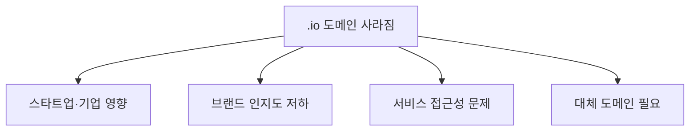
```mermaid
graph TD
  IoDisappear[".io 도메인 사라짐"]
  StartupImpact["스타트업·기업 영향"]
  BrandDown["브랜드 인지도 저하"]
  AccessIssue["서비스 접근성 문제"]
  AltDomain["대체 도메인 필요"]
  IoDisappear --> StartupImpact
  IoDisappear --> BrandDown
  IoDisappear --> AccessIssue
  IoDisappear --> AltDomain
```

### 대체 도메인으로 무엇을 선택해야 할까?

- **.com**: 가장 널리 인지되며 신뢰도가 높음
- **.dev, .app, .tech**: 기술·개발자 대상 서비스에 적합
- **.co**: 스타트업에서 자주 사용
- 브랜드 연관성, 기억 용이성, SEO, 법적·지정학적 안정성을 함께 고려하는 것이 좋다.

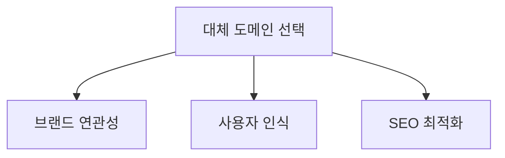
```mermaid
graph TD
  AltSelect["대체 도메인 선택"]
  BrandFit["브랜드 연관성"]
  UserAware["사용자 인식"]
  SEO["SEO 최적화"]
  AltSelect --> BrandFit
  AltSelect --> UserAware
  AltSelect --> SEO
```

### IANA와 ICANN의 차이점은 무엇인가?

- **IANA**: IP 주소, 도메인 이름, 프로토콜 파라미터 등 **기술적 할당·관리**
- **ICANN**: 인터넷 운영 안정성, 국제 이해관계 반영, **정책 수립·조정**

즉, IANA는 기술 운영, ICANN은 정책·거버넌스에 무게를 둔다. 현재 IANA 기능은 ICANN 내부에서 수행된다.

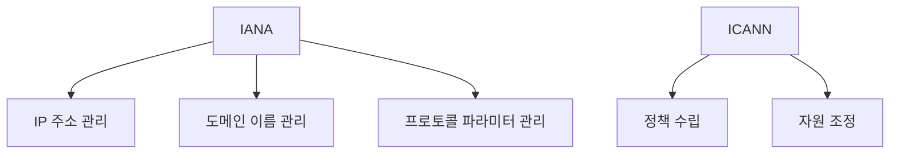
```mermaid
graph TD
  IANA2["IANA"]
  IPMgmt["IP 주소 관리"]
  NameMgmt["도메인 이름 관리"]
  ParamMgmt["프로토콜 파라미터 관리"]
  ICANN2["ICANN"]
  Policy2["정책 수립"]
  ResourceCoord["자원 조정"]
  IANA2 --> IPMgmt
  IANA2 --> NameMgmt
  IANA2 --> ParamMgmt
  ICANN2 --> Policy2
  ICANN2 --> ResourceCoord
```

---

## 관련 기술

### 도메인 네임 시스템(DNS)

DNS는 도메인 이름을 IP 주소로 변환하는 계층형 시스템이다. 사용자가 도메인을 입력하면 DNS 리졸버 → 루트 서버 → TLD 서버 → 권한 서버 순으로 조회되어 IP를 반환하고, 이를 통해 웹사이트에 접속한다.

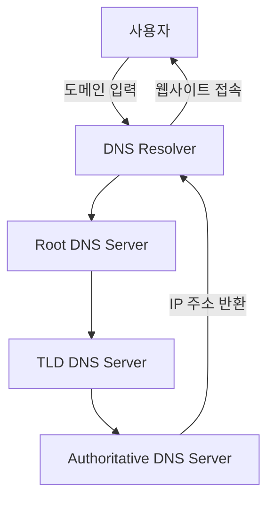
```mermaid
graph TD
  User["사용자"]
  Resolver["DNS Resolver"]
  Root["Root DNS Server"]
  TLD["TLD DNS Server"]
  Auth["Authoritative DNS Server"]
  User -->|"도메인 입력"| Resolver
  Resolver --> Root
  Root --> TLD
  TLD --> Auth
  Auth -->|"IP 주소 반환"| Resolver
  Resolver -->|"웹사이트 접속"| User
```

### 국가 코드 최상위 도메인(ccTLD)

ccTLD는 특정 국가·지역을 나타내는 최상위 도메인이다(예: .kr, .jp, .uk). ISO 3166-1 alpha-2 코드와 연동되며, IANA가 할당·관리한다. .io는 영국 인도양 영토의 ccTLD였으며, 주권 변경 시 코드 삭제·도메인 퇴출 절차가 적용될 수 있다.

### 인터넷 거버넌스와 정책

인터넷 거버넌스는 정부, 기업, 시민사회 등이 참여하는 정책·규제 체계이다. ICANN·IANA는 도메인과 주소 자원의 기술·정책 측면을 담당하며, 지정학적 변화가 디지털 인프라에 미치는 영향을 이해하려면 이들의 역할과 ccTLD 정책을 알아두는 것이 중요하다.

---

## 결론

### 디지털 세계에서의 지정학적 변화의 중요성

지정학적 변화는 인터넷 인프라와 도메인 시스템에 직접 영향을 미치며, 기업과 개인의 온라인 존재에 중대한 결과를 낳는다. 특정 국가·영토의 정치적 불안정이나 주권 변경은 해당 ccTLD의 신뢰성과 지속 가능성을 바꿀 수 있으므로, 디지털 전략 수립 시 **지정학적 맥락**을 무시할 수 없다.

### 미래의 도메인 선택에 대한 교훈

도메인 선택 시 **기술적 요인**(가용성, 속도)뿐 아니라 **지정학적 요인**(해당 영토·국가의 안정성, 국제 관계), **법적 환경**, **브랜드 이미지**를 함께 고려해야 한다. .io는 현재로서는 인기 있으나, 차고스 제도 주권 이양과 IANA 규정에 따라 퇴출·이전 가능성이 있다. 물리적 역사와 디지털 미래는 결코 분리되지 않으며, 도메인은 그 교차점에 서 있다.

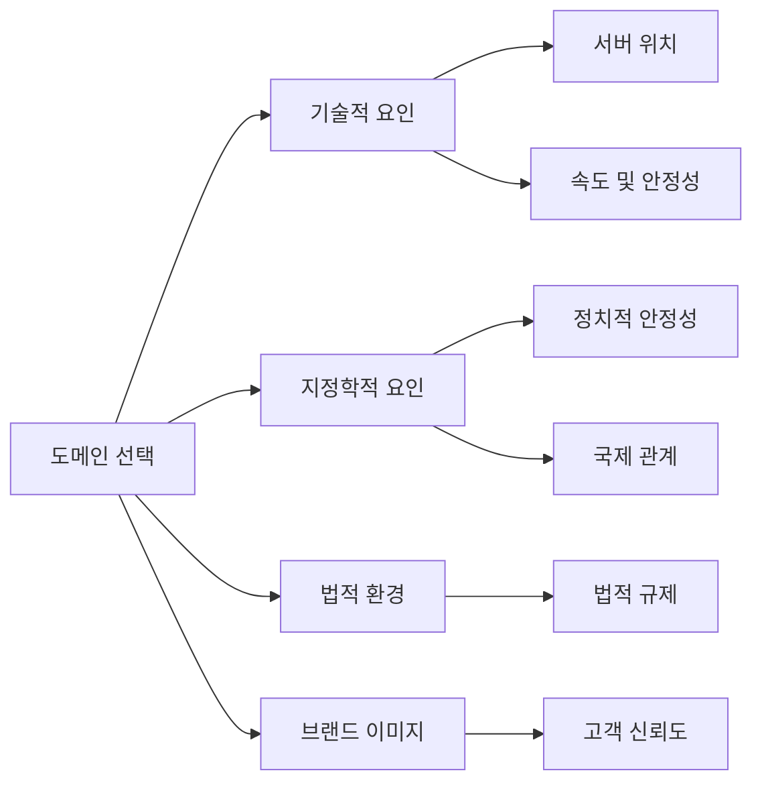
```mermaid
graph LR
  DomainChoice["도메인 선택"]
  TechFactor["기술적 요인"]
  GeoFactor["지정학적 요인"]
  LegalFactor["법적 환경"]
  BrandFactor["브랜드 이미지"]
  DomainChoice --> TechFactor
  DomainChoice --> GeoFactor
  DomainChoice --> LegalFactor
  DomainChoice --> BrandFactor
  TechFactor --> ServerLoc["서버 위치"]
  TechFactor --> SpeedStable["속도 및 안정성"]
  GeoFactor --> PolStable["정치적 안정성"]
  GeoFactor --> IntlRel["국제 관계"]
  LegalFactor --> LegalReg["법적 규제"]
  BrandFactor --> Trust["고객 신뢰도"]
```

---

## 참고 문헌

1. [The Disappearance of an Internet Domain](https://every.to/p/the-disappearance-of-an-internet-domain) — Gareth Edwards, Every (지정학과 .io 도메인 퇴출 가능성 논의)
2. [ISO 3166-1 alpha-2](https://en.wikipedia.org/wiki/ISO_3166-1_alpha-2) — Wikipedia (국가 코드와 ccTLD 연동)
3. [UK will give sovereignty of Chagos Islands to Mauritius](https://www.bbc.com/news/articles/c98ynejg4l5o) — BBC News (차고스 제도 주권 이양 발표)
