현대 사회에서 원격 근무가 보편화됨에 따라, 많은 기업들이 직원들의 인터넷 성능 문제에 직면하고 있다. 특히, 비디오 회의 중에 발생하는 끊김 현상이나 음성 지연은 직원들의 업무 효율성을 저하시킬 수 있다. 이러한 문제의 근본 원인은 종종 대역폭이 아닌 지연(latency)에서 비롯된다. 대역폭은 데이터 전송의 용량을 의미하지만, 지연은 데이터가 목적지에 도달하는 데 걸리는 시간을 나타낸다. 많은 경우, 사용자는 대역폭이 충분하다고 느끼지만, 실제로는 라우터 소프트웨어의 문제로 인해 데이터 전송이 지연된다. 이 문제를 해결하기 위해서는 최신의 라우터 소프트웨어를 도입하고, 네트워크 트래픽을 효율적으로 관리할 수 있는 솔루션이 필요하다. 예를 들어, LibreQoS와 같은 소프트웨어는 대역폭 관리와 지연 최소화를 통해 인터넷 성능을 개선할 수 있는 방법을 제공한다. 이러한 기술적 접근은 ISP와 기업 모두에게 유용하며, 고객의 불만을 줄이고, 원활한 비디오 회의와 데이터 전송을 가능하게 한다. 결국, 인터넷 성능 문제는 단순히 대역폭을 늘리는 것이 아니라, 소프트웨어와 네트워크 관리의 개선을 통해 해결할 수 있는 문제임을 인식해야 한다.

<!--
##### Outline #####
-->

<!--
# 목차

## 개요
   - 원격 근무 환경에서의 인터넷 문제
   - ISP와 고객 간의 불만 사항
   - 대역폭(Bandwidth)과 지연 시간(Latency)의 중요성

## 대역폭과 지연 시간
   - 2.1 대역폭의 정의
   - 2.2 지연 시간의 정의
   - 2.3 대역폭과 지연 시간의 관계
   - 2.4 대역폭과 지연 시간의 시각적 비교

## 지연 시간의 원인
   - 3.1 콘텐츠 경합(Contention)
   - 3.2 라우터 소프트웨어의 문제
   - 3.3 버퍼블로트(Bufferbloat) 현상
   - 3.4 가정용 라우터의 한계

## 좋은 라우터 소프트웨어
   - 4.1 최신 소프트웨어의 필요성
   - 4.2 fq_codel 및 CAKE 알고리즘
   - 4.3 LibreQoS의 소개
   - 4.4 QoS(Quality of Service)의 중요성

## ISP의 문제 해결
   - 5.1 ISP의 기존 라우터 문제
   - 5.2 LibreQoS의 적용
   - 5.3 성능 개선을 위한 기술적 접근
   - 5.4 고객 불만 해결을 위한 전략

## 성능 개선 사례
   - 6.1 실시간 성능 모니터링
   - 6.2 성능 개선 전후 비교
   - 6.3 고객의 피드백 및 사례 연구

## FAQ
   - 7.1 대역폭과 지연 시간의 차이는 무엇인가요?
   - 7.2 버퍼블로트는 어떻게 해결하나요?
   - 7.3 LibreQoS는 어떻게 작동하나요?
   - 7.4 ISP가 성능 문제를 해결하기 위해 무엇을 해야 하나요?

## 관련 기술
   - 8.1 Active Queue Management (AQM)
   - 8.2 Diffserv
   - 8.3 eBPF 및 XDP
   - 8.4 네트워크 토폴로지 인식

## 결론
   - 대역폭이 아닌 지연 시간 문제의 해결
   - ISP와 고객 간의 관계 개선
   - 미래의 인터넷 성능 향상을 위한 방향

## 참고 자료
   - 관련 연구 논문 및 기사
   - 추가 읽을거리 및 리소스 링크
-->

<!--
## 개요
   - 원격 근무 환경에서의 인터넷 문제
   - ISP와 고객 간의 불만 사항
   - 대역폭(Bandwidth)과 지연 시간(Latency)의 중요성
-->

## 개요

원격 근무 환경에서의 인터넷 문제는 최근 몇 년간 더욱 두드러지게 나타나고 있다. 많은 사람들이 집에서 근무하게 되면서 안정적이고 빠른 인터넷 연결의 필요성이 증가하였고, 이로 인해 다양한 인터넷 문제들이 발생하고 있다. 특히, 대역폭(Bandwidth)과 지연 시간(Latency)은 원격 근무의 효율성에 큰 영향을 미치는 요소로 작용하고 있다.

**원격 근무 환경에서의 인터넷 문제**

원격 근무를 하는 동안 발생하는 인터넷 문제는 주로 연결의 불안정성, 속도 저하, 그리고 지연 시간 증가로 요약될 수 있다. 이러한 문제들은 화상 회의, 파일 전송, 클라우드 기반 애플리케이션 사용 시 큰 불편을 초래한다. 특히, 지연 시간이 길어지면 실시간 소통이 어려워져 업무의 효율성이 떨어지게 된다.

**ISP와 고객 간의 불만 사항**

인터넷 서비스 제공업체(ISP)와 고객 간의 불만 사항은 주로 서비스 품질과 관련이 있다. 고객들은 종종 약속된 속도와 실제 속도 간의 차이에 불만을 제기하며, 이는 대역폭의 부족이나 지연 시간의 증가로 이어질 수 있다. 이러한 불만은 고객의 신뢰를 저하시킬 뿐만 아니라, ISP의 평판에도 부정적인 영향을 미친다.

**대역폭(Bandwidth)과 지연 시간(Latency)의 중요성**

대역폭과 지연 시간은 인터넷 성능을 평가하는 데 있어 핵심적인 요소이다. 대역폭은 데이터 전송 속도를 나타내며, 지연 시간은 데이터가 출발지에서 목적지까지 도달하는 데 걸리는 시간을 의미한다. 이 두 가지 요소는 서로 밀접하게 연관되어 있으며, 원활한 인터넷 사용을 위해서는 이들 간의 균형이 필요하다.

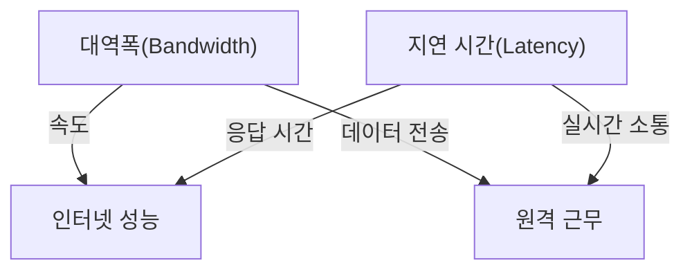

위의 다이어그램은 대역폭과 지연 시간이 인터넷 성능 및 원격 근무에 미치는 영향을 시각적으로 나타낸 것이다. 대역폭이 충분하지 않거나 지연 시간이 길어지면 원격 근무의 효율성이 저하될 수 있음을 알 수 있다. 이러한 문제를 해결하기 위해서는 ISP와 고객 간의 원활한 소통과 기술적 접근이 필요하다.

<!--
## 대역폭과 지연 시간
   - 2.1 대역폭의 정의
   - 2.2 지연 시간의 정의
   - 2.3 대역폭과 지연 시간의 관계
   - 2.4 대역폭과 지연 시간의 시각적 비교
-->

## 대역폭과 지연 시간

**대역폭의 정의**

대역폭(Bandwidth)은 네트워크에서 데이터가 전송될 수 있는 최대 속도를 의미한다. 일반적으로 초당 전송할 수 있는 데이터의 양으로 측정되며, 보통 비트 단위로 표현된다. 예를 들어, 100Mbps의 대역폭은 초당 100메가비트의 데이터를 전송할 수 있음을 나타낸다. 대역폭이 높을수록 더 많은 데이터가 동시에 전송될 수 있어, 대규모 파일 다운로드나 스트리밍 서비스에서 중요한 요소로 작용한다.

**지연 시간의 정의**

지연 시간(Latency)은 데이터가 출발지에서 목적지까지 도달하는 데 걸리는 시간을 의미한다. 이는 밀리초(ms) 단위로 측정되며, 지연 시간이 짧을수록 데이터 전송이 더 빠르게 이루어진다. 지연 시간은 여러 요인에 의해 영향을 받을 수 있으며, 특히 네트워크의 물리적 거리, 라우터의 처리 시간, 그리고 네트워크 혼잡도 등이 주요 원인으로 작용한다.

**대역폭과 지연 시간의 관계**

대역폭과 지연 시간은 서로 다른 개념이지만, 네트워크 성능에 있어 밀접한 관계가 있다. 대역폭이 높더라도 지연 시간이 길면 데이터 전송 속도가 느려질 수 있다. 예를 들어, 대역폭이 충분하더라도 지연 시간이 길면 실시간 통신이나 온라인 게임에서 문제가 발생할 수 있다. 따라서, 네트워크 성능을 최적화하기 위해서는 대역폭과 지연 시간을 모두 고려해야 한다.

**대역폭과 지연 시간의 시각적 비교**

다음은 대역폭과 지연 시간을 시각적으로 비교한 다이어그램이다.

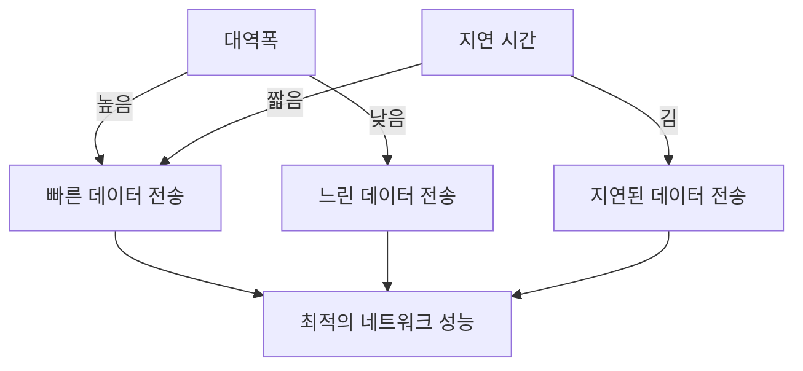

위의 다이어그램은 대역폭과 지연 시간이 네트워크 성능에 미치는 영향을 보여준다. 대역폭이 높고 지연 시간이 짧을 때 최적의 네트워크 성능을 경험할 수 있다. 반면, 대역폭이 낮거나 지연 시간이 길면 성능 저하가 발생할 수 있다. 이러한 요소들을 종합적으로 고려하여 네트워크 환경을 개선하는 것이 중요하다.

<!--
## 지연 시간의 원인
   - 3.1 콘텐츠 경합(Contention)
   - 3.2 라우터 소프트웨어의 문제
   - 3.3 버퍼블로트(Bufferbloat) 현상
   - 3.4 가정용 라우터의 한계
-->

## 지연 시간의 원인

지연 시간(Latency)은 네트워크에서 데이터가 전송되는 데 걸리는 시간으로, 원격 근무 환경에서의 원활한 통신을 위해 매우 중요한 요소이다. 지연 시간의 원인은 여러 가지가 있으며, 이 글에서는 그 중 몇 가지를 살펴보겠다.

### **콘텐츠 경합(Contention)**

콘텐츠 경합은 여러 사용자가 동일한 네트워크 자원에 접근하려고 할 때 발생하는 현상이다. 예를 들어, 가정에서 여러 기기가 동시에 인터넷을 사용하면, 대역폭이 제한된 경우 각 기기가 사용할 수 있는 대역폭이 줄어들게 된다. 이로 인해 데이터 전송 속도가 느려지고, 결과적으로 지연 시간이 증가하게 된다.

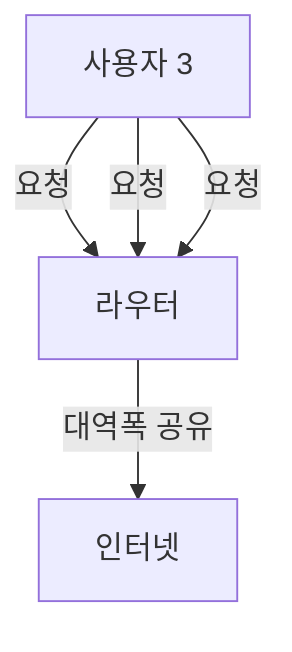

### **라우터 소프트웨어의 문제**

라우터의 소프트웨어가 구식이거나 비효율적일 경우, 데이터 패킷의 처리 속도가 느려질 수 있다. 이는 지연 시간을 증가시키는 주요 원인 중 하나이다. 최신 라우터 소프트웨어는 패킷을 더 효율적으로 처리하고, 지연 시간을 최소화하는 다양한 알고리즘을 적용하고 있다. 따라서, 라우터의 소프트웨어를 정기적으로 업데이트하는 것이 중요하다.

### **버퍼블로트(Bufferbloat) 현상**

버퍼블로트는 네트워크 장비의 버퍼가 과도하게 커져서 발생하는 지연 현상이다. 데이터 패킷이 버퍼에 쌓이게 되면, 패킷이 전송되기까지 대기 시간이 길어져 지연 시간이 증가하게 된다. 이 문제는 특히 대역폭이 넓은 네트워크에서 더욱 두드러지며, 이를 해결하기 위해 Active Queue Management (AQM) 기술이 사용될 수 있다.

### **가정용 라우터의 한계**

가정용 라우터는 일반적으로 성능이 제한적이며, 많은 기기가 동시에 연결될 경우 성능 저하가 발생할 수 있다. 이러한 라우터는 대역폭 관리 및 QoS(Quality of Service) 기능이 부족하여, 지연 시간을 효과적으로 관리하지 못하는 경우가 많다. 따라서, 성능이 뛰어난 라우터로 업그레이드하거나, QoS 기능이 포함된 라우터를 사용하는 것이 지연 시간을 줄이는 데 도움이 된다.

이와 같은 다양한 원인들은 지연 시간을 증가시키며, 원격 근무 환경에서의 인터넷 성능에 부정적인 영향을 미친다. 이를 해결하기 위해서는 각 원인에 대한 이해와 적절한 대응이 필요하다.

<!--
## 좋은 라우터 소프트웨어
   - 4.1 최신 소프트웨어의 필요성
   - 4.2 fq_codel 및 CAKE 알고리즘
   - 4.3 LibreQoS의 소개
   - 4.4 QoS(Quality of Service)의 중요성
-->

## 좋은 라우터 소프트웨어

### 최신 소프트웨어의 필요성

현대의 인터넷 환경에서는 다양한 디바이스가 동시에 연결되어 있으며, 이로 인해 네트워크의 효율성이 더욱 중요해졌다. 구형 라우터 소프트웨어는 이러한 환경에서 성능 저하를 초래할 수 있다. 최신 소프트웨어는 새로운 프로토콜과 알고리즘을 지원하여 대역폭을 최적화하고 지연 시간을 줄이는 데 기여한다. 따라서, 라우터의 소프트웨어를 정기적으로 업데이트하는 것은 필수적이다.

### fq_codel 및 CAKE 알고리즘

**fq_codel**과 **CAKE**는 네트워크 트래픽을 관리하기 위한 두 가지 주요 알고리즘이다. 

- **fq_codel**은 패킷의 대기 시간을 줄이기 위해 설계된 Active Queue Management (AQM) 알고리즘으로, 패킷의 우선순위를 조정하여 지연 시간을 최소화한다.
- **CAKE**는 fq_codel의 발전된 형태로, 다양한 트래픽 유형을 효과적으로 관리할 수 있는 기능을 제공한다. CAKE는 대역폭을 공정하게 분배하고, 지연 시간을 줄이며, 버퍼블로트 문제를 해결하는 데 도움을 준다.

다음은 fq_codel과 CAKE의 작동 방식을 비교한 다이어그램이다.

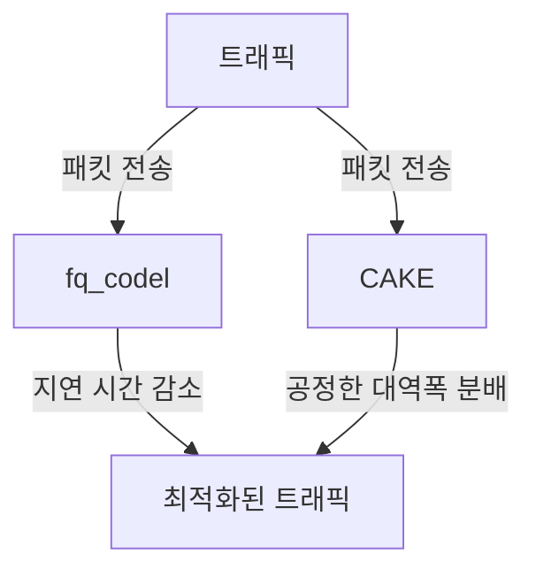

### LibreQoS의 소개

**LibreQoS**는 오픈 소스 QoS 솔루션으로, 사용자가 자신의 네트워크 환경에 맞게 최적화할 수 있도록 설계되었다. 이 소프트웨어는 다양한 QoS 기능을 제공하여, 사용자가 네트워크 트래픽을 효과적으로 관리하고 성능을 개선할 수 있도록 돕는다. LibreQoS는 특히 가정용 라우터에서의 성능 향상에 큰 기여를 할 수 있다.

### QoS(Quality of Service)의 중요성

**QoS**는 네트워크에서 특정 트래픽에 대한 우선순위를 설정하여, 중요한 데이터가 지연 없이 전송될 수 있도록 보장하는 기술이다. 이는 특히 실시간 애플리케이션, 예를 들어 VoIP(Voice over IP)나 온라인 게임에서 필수적이다. QoS를 통해 사용자는 보다 안정적이고 빠른 인터넷 환경을 경험할 수 있으며, ISP는 고객의 불만을 줄일 수 있다. 

QoS의 구현은 다음과 같은 이점을 제공한다:

- **지연 시간 감소**: 중요한 트래픽이 우선적으로 처리되어 지연 시간이 줄어든다.
- **대역폭 관리**: 네트워크 자원을 효율적으로 분배하여 모든 사용자가 원활한 서비스를 받을 수 있다.
- **사용자 경험 향상**: 안정적인 연결을 통해 사용자 만족도를 높일 수 있다.

이와 같은 이유로, 좋은 라우터 소프트웨어는 현대의 인터넷 환경에서 필수적이며, 지속적인 업데이트와 최적화가 필요하다.

<!--
## ISP의 문제 해결
   - 5.1 ISP의 기존 라우터 문제
   - 5.2 LibreQoS의 적용
   - 5.3 성능 개선을 위한 기술적 접근
   - 5.4 고객 불만 해결을 위한 전략
-->

## ISP의 문제 해결

원격 근무 환경에서의 인터넷 성능 문제는 ISP(Internet Service Provider)와 고객 간의 관계에 큰 영향을 미친다. 이 문제를 해결하기 위해 ISP는 기존 라우터의 문제를 파악하고, 새로운 기술을 적용하여 성능을 개선해야 한다.

### ISP의 기존 라우터 문제

ISP의 기존 라우터는 종종 최신 기술을 반영하지 못하고, 성능 저하를 초래하는 여러 가지 문제를 안고 있다. 예를 들어, 구형 라우터는 대역폭 관리 및 지연 시간 최적화에 필요한 기능이 부족하여, 고객의 인터넷 사용 경험을 저하시킬 수 있다. 이러한 문제는 특히 고용량 데이터 전송이나 실시간 통신에서 더욱 두드러진다.

### LibreQoS의 적용

LibreQoS는 QoS(Quality of Service) 기능을 제공하는 오픈 소스 솔루션으로, ISP가 고객의 인터넷 성능을 개선하는 데 도움을 줄 수 있다. 이 솔루션은 대역폭을 효율적으로 관리하고, 지연 시간을 최소화하는 데 중점을 두고 있다. LibreQoS를 적용하면, ISP는 고객의 다양한 요구에 맞춰 네트워크 자원을 최적화할 수 있다.

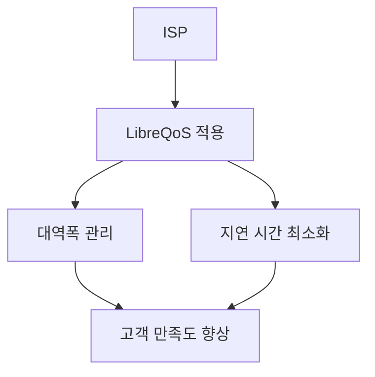

### 성능 개선을 위한 기술적 접근

성능 개선을 위해 ISP는 여러 기술적 접근을 고려해야 한다. 예를 들어, Active Queue Management (AQM) 기술을 도입하여 패킷 손실을 줄이고, 지연 시간을 최소화할 수 있다. 또한, Diffserv와 같은 서비스 품질 보장 기술을 활용하여, 다양한 트래픽 유형에 맞는 우선순위를 설정할 수 있다. 이러한 기술들은 고객의 인터넷 사용 경험을 향상시키는 데 기여할 수 있다.

### 고객 불만 해결을 위한 전략

고객의 불만을 해결하기 위해 ISP는 적극적인 커뮤니케이션 전략을 수립해야 한다. 고객의 피드백을 수집하고, 이를 바탕으로 서비스 개선 방안을 마련하는 것이 중요하다. 또한, 고객에게 성능 개선 사항을 투명하게 전달하고, 문제 해결 과정을 공유함으로써 신뢰를 구축할 수 있다. 이러한 접근은 고객의 불만을 줄이고, ISP와 고객 간의 관계를 개선하는 데 기여할 것이다.

<!--
## 성능 개선 사례
   - 6.1 실시간 성능 모니터링
   - 6.2 성능 개선 전후 비교
   - 6.3 고객의 피드백 및 사례 연구
-->

## 성능 개선 사례

### 실시간 성능 모니터링

실시간 성능 모니터링은 네트워크의 상태를 지속적으로 관찰하고 분석하는 과정이다. 이를 통해 대역폭 사용량, 지연 시간, 패킷 손실률 등의 지표를 실시간으로 확인할 수 있다. 이러한 모니터링은 문제 발생 시 즉각적인 대응을 가능하게 하며, 네트워크 성능을 최적화하는 데 중요한 역할을 한다.

다음은 실시간 성능 모니터링을 위한 간단한 샘플 코드이다. 이 코드는 Python을 사용하여 네트워크의 지연 시간을 측정하는 예시이다.

```python
import time
import os

def ping_test(host):
    response = os.system("ping -c 1 " + host)
    return response == 0

def monitor_network(host, interval):
    while True:
        if ping_test(host):
            print(f"{host} is reachable")
        else:
            print(f"{host} is not reachable")
        time.sleep(interval)

monitor_network("8.8.8.8", 5)  # 5초 간격으로 Google DNS 서버 모니터링
```

### 성능 개선 전후 비교

성능 개선 전후 비교는 네트워크 성능을 개선하기 위한 조치를 취한 후, 그 효과를 분석하는 과정이다. 이를 통해 어떤 변화가 있었는지를 명확히 파악할 수 있으며, 향후 개선 방향을 설정하는 데 도움이 된다.

아래의 다이어그램은 성능 개선 전후의 대역폭과 지연 시간을 비교한 예시이다.

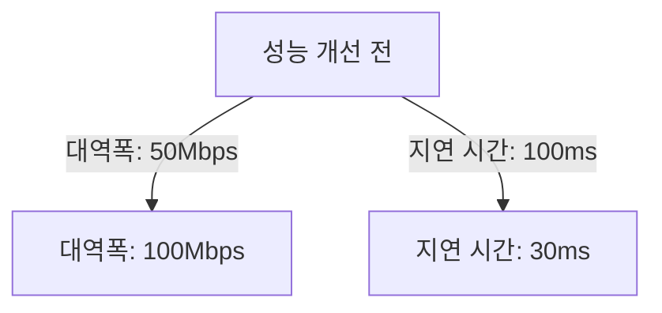

### 고객의 피드백 및 사례 연구

고객의 피드백은 성능 개선의 효과를 평가하는 중요한 요소이다. 고객이 경험한 변화와 그에 대한 만족도를 조사함으로써, 개선된 성능이 실제로 고객에게 긍정적인 영향을 미쳤는지를 확인할 수 있다. 

사례 연구를 통해 특정 고객의 네트워크 성능 개선 사례를 분석할 수 있다. 예를 들어, 한 기업이 ISP의 QoS(Quality of Service) 설정을 조정한 후, 원격 근무 환경에서의 비디오 회의 품질이 크게 향상되었다는 피드백을 받았다. 이와 같은 사례는 다른 고객에게도 유용한 참고 자료가 될 수 있다. 

이러한 성과는 고객의 만족도를 높이고, ISP와 고객 간의 신뢰를 구축하는 데 기여한다.

<!--
## FAQ
   - 7.1 대역폭과 지연 시간의 차이는 무엇인가요?
   - 7.2 버퍼블로트는 어떻게 해결하나요?
   - 7.3 LibreQoS는 어떻게 작동하나요?
   - 7.4 ISP가 성능 문제를 해결하기 위해 무엇을 해야 하나요?
-->

## FAQ

### 대역폭과 지연 시간의 차이는 무엇인가요?

대역폭(Bandwidth)과 지연 시간(Latency)은 네트워크 성능을 평가하는 두 가지 중요한 요소이다. 대역폭은 네트워크가 동시에 전송할 수 있는 데이터의 양을 나타내며, 일반적으로 초당 비트 수(bps)로 측정된다. 반면, 지연 시간은 데이터가 출발지에서 목적지까지 도달하는 데 걸리는 시간을 의미하며, 밀리초(ms)로 측정된다. 

대역폭이 높다고 해서 반드시 지연 시간이 짧은 것은 아니며, 두 요소는 서로 다른 성격을 가지고 있다. 예를 들어, 대역폭이 충분하더라도 네트워크 경로에 여러 라우터가 존재하거나, 패킷 손실이 발생하면 지연 시간이 증가할 수 있다.

### 버퍼블로트는 어떻게 해결하나요?

버퍼블로트(Bufferbloat)는 네트워크의 버퍼가 과도하게 커져서 발생하는 지연 현상이다. 이 문제를 해결하기 위해서는 다음과 같은 방법을 사용할 수 있다:

1. **Active Queue Management (AQM)**: 패킷이 버퍼에 쌓이는 것을 방지하기 위해, 패킷을 드롭하거나 지연시키는 알고리즘을 적용한다. 예를 들어, fq_codel이나 CAKE 알고리즘을 사용할 수 있다.
   
2. **라우터 소프트웨어 업데이트**: 최신 라우터 소프트웨어를 사용하여 버퍼 관리 기능을 개선한다.

3. **QoS(Quality of Service) 설정**: 특정 트래픽에 우선순위를 부여하여 지연 시간을 최소화한다.

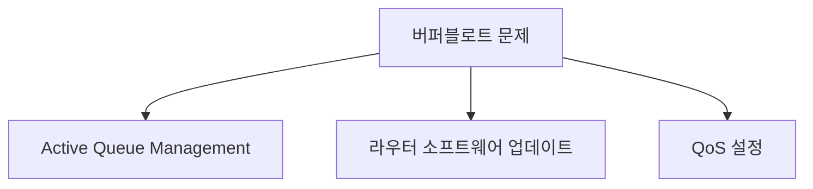

### LibreQoS는 어떻게 작동하나요?

LibreQoS는 네트워크 트래픽을 관리하고 최적화하기 위한 오픈 소스 솔루션이다. 이 시스템은 다음과 같은 방식으로 작동한다:

1. **트래픽 분류**: 다양한 유형의 트래픽을 식별하고 분류하여, 각 트래픽에 적절한 대역폭을 할당한다.

2. **지연 시간 관리**: fq_codel 및 CAKE와 같은 알고리즘을 사용하여 지연 시간을 최소화하고, 패킷 손실을 줄인다.

3. **사용자 정의 설정**: 사용자가 필요에 따라 QoS 규칙을 설정할 수 있어, 특정 애플리케이션이나 서비스에 대한 우선순위를 조정할 수 있다.

이러한 기능을 통해 LibreQoS는 네트워크 성능을 향상시키고, 사용자 경험을 개선하는 데 기여한다.

### ISP가 성능 문제를 해결하기 위해 무엇을 해야 하나요?

ISP(Internet Service Provider)는 성능 문제를 해결하기 위해 다음과 같은 조치를 취해야 한다:

1. **네트워크 인프라 개선**: 최신 기술을 도입하여 네트워크의 대역폭과 지연 시간을 최적화한다.

2. **라우터 소프트웨어 업데이트**: 고객이 사용하는 라우터의 소프트웨어를 최신 버전으로 업데이트하여, 버퍼블로트와 같은 문제를 해결한다.

3. **고객 지원 강화**: 고객의 불만 사항을 신속하게 처리하고, 성능 문제에 대한 해결책을 제공한다.

4. **성능 모니터링**: 실시간으로 네트워크 성능을 모니터링하여, 문제가 발생할 경우 즉시 대응할 수 있는 체계를 구축한다.

이러한 조치를 통해 ISP는 고객의 만족도를 높이고, 신뢰를 구축할 수 있다.

<!--
## 관련 기술
   - 8.1 Active Queue Management (AQM)
   - 8.2 Diffserv
   - 8.3 eBPF 및 XDP
   - 8.4 네트워크 토폴로지 인식
-->

## 관련 기술

### Active Queue Management (AQM)

Active Queue Management는 네트워크에서 패킷 지연을 줄이고 대역폭을 효율적으로 사용하기 위한 기술이다. AQM은 패킷 큐의 길이를 모니터링하고, 큐가 특정 임계값을 초과할 경우 패킷을 드롭하거나 지연시켜 네트워크 혼잡을 완화한다. 이를 통해 지연 시간을 줄이고, 전반적인 네트워크 성능을 향상시킬 수 있다.

**AQM의 작동 원리**

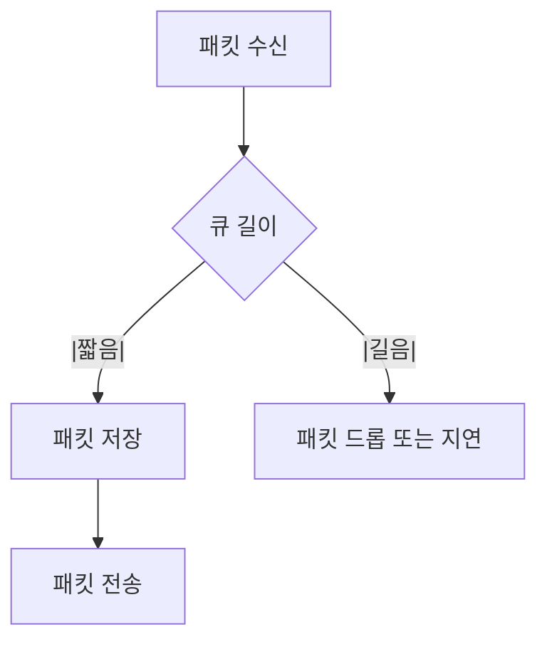

### Diffserv

Differentiated Services, 줄여서 Diffserv는 네트워크 트래픽을 분류하고 우선순위를 부여하는 방법이다. 이 기술은 다양한 서비스 품질(QoS) 요구 사항을 충족하기 위해 패킷에 특정 태그를 추가하여, 네트워크 장비가 패킷을 처리하는 방식을 조정할 수 있도록 한다. Diffserv는 대규모 네트워크에서 효율적으로 QoS를 관리할 수 있는 방법으로 널리 사용된다.

**Diffserv의 작동 방식**

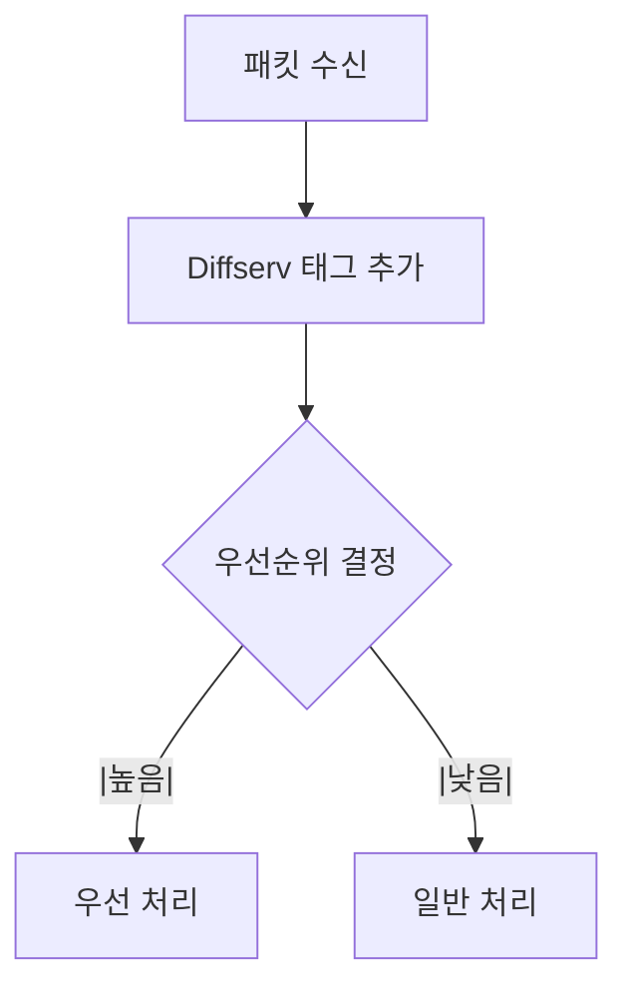

### eBPF 및 XDP

Extended Berkeley Packet Filter(eBPF)는 커널 내에서 실행되는 프로그램으로, 패킷 필터링 및 네트워크 성능 모니터링을 가능하게 한다. eBPF는 다양한 네트워크 이벤트에 대해 사용자 정의 동작을 수행할 수 있도록 하여, 성능 최적화 및 보안 기능을 제공한다. XDP(eXpress Data Path)는 eBPF의 확장으로, 패킷을 커널 공간에서 직접 처리하여 지연 시간을 최소화하고 성능을 극대화할 수 있다.

**eBPF와 XDP의 관계**

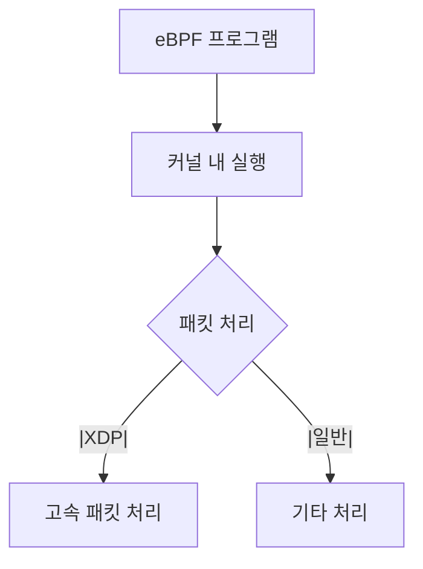

### 네트워크 토폴로지 인식

네트워크 토폴로지 인식은 네트워크의 구조와 연결 상태를 이해하고, 이를 기반으로 최적의 경로를 선택하는 기술이다. 이 기술은 네트워크 성능을 향상시키고, 장애 발생 시 신속하게 대처할 수 있도록 돕는다. 네트워크 토폴로지를 인식함으로써, 트래픽 흐름을 최적화하고, 지연 시간을 줄일 수 있다.

**네트워크 토폴로지 인식의 이점**

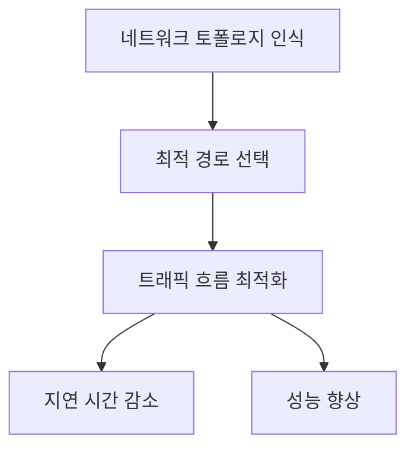

이와 같은 기술들은 네트워크 성능을 개선하고, 지연 시간을 줄이는 데 중요한 역할을 한다. 각 기술의 특성과 작동 방식을 이해함으로써, 보다 효율적인 네트워크 환경을 구축할 수 있다.

<!--
## 결론
   - 대역폭이 아닌 지연 시간 문제의 해결
   - ISP와 고객 간의 관계 개선
   - 미래의 인터넷 성능 향상을 위한 방향
-->

## 결론

**대역폭이 아닌 지연 시간 문제의 해결**

최근 원격 근무 환경에서의 인터넷 사용이 증가함에 따라, 대역폭(Bandwidth)보다 지연 시간(Latency) 문제가 더욱 두드러지게 나타나고 있다. 많은 사용자들이 대역폭이 충분하다고 느끼더라도, 지연 시간이 길어지면 실시간 통신이나 온라인 게임과 같은 서비스에서 불편을 겪게 된다. 따라서, ISP(Internet Service Provider)는 대역폭을 늘리는 것뿐만 아니라, 지연 시간을 줄이기 위한 기술적 접근이 필요하다. 이를 위해 QoS(Quality of Service) 기술을 활용하여 패킷의 우선순위를 조정하고, 지연 시간을 최소화하는 방법을 모색해야 한다.

**ISP와 고객 간의 관계 개선**

ISP와 고객 간의 신뢰를 구축하기 위해서는 고객의 불만 사항을 적극적으로 수렴하고, 이를 해결하기 위한 노력이 필요하다. 고객이 겪는 지연 시간 문제를 해결하기 위해 ISP는 최신 라우터 소프트웨어를 도입하고, 성능 모니터링 시스템을 구축하여 실시간으로 문제를 파악하고 대응할 수 있어야 한다. 고객에게는 이러한 노력을 투명하게 공유하여 신뢰를 쌓는 것이 중요하다.

**미래의 인터넷 성능 향상을 위한 방향**

미래의 인터넷 성능 향상을 위해서는 기술의 발전과 함께 ISP의 지속적인 투자와 연구가 필요하다. 예를 들어, Active Queue Management (AQM) 기술을 통해 패킷 손실을 줄이고, 지연 시간을 최소화할 수 있는 방법을 모색해야 한다. 또한, eBPF 및 XDP와 같은 최신 기술을 활용하여 네트워크 성능을 최적화하는 방안도 고려해야 한다. 이러한 기술들은 네트워크의 효율성을 높이고, 사용자 경험을 개선하는 데 기여할 것이다.

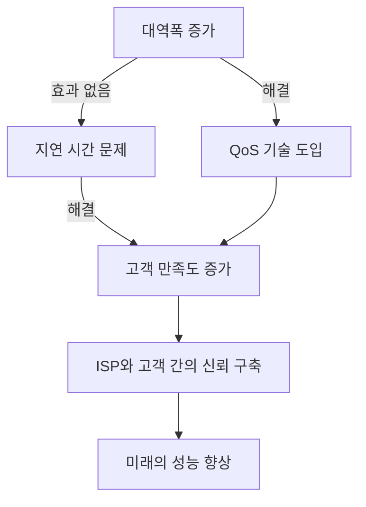

위의 다이어그램은 대역폭 증가가 지연 시간 문제를 해결하지 못하는 경우를 보여준다. 대신 QoS 기술을 도입함으로써 고객 만족도를 높이고, ISP와 고객 간의 신뢰를 구축할 수 있는 경로를 제시하고 있다. 이러한 방향으로 나아간다면, 미래의 인터넷 성능은 더욱 향상될 것으로 기대된다.

<!--
## 참고 자료
   - 관련 연구 논문 및 기사
   - 추가 읽을거리 및 리소스 링크
-->

## 참고 자료

**관련 연구 논문 및 기사**

인터넷 성능과 관련된 다양한 연구 논문과 기사를 통해 대역폭과 지연 시간의 문제를 심층적으로 이해할 수 있다. 다음은 참고할 만한 자료들이다.

1. **"The Impact of Latency on Internet Performance"**

   이 논문은 지연 시간이 인터넷 성능에 미치는 영향을 분석하고, 다양한 환경에서의 지연 시간 측정 결과를 제시한다.

2. **"Bandwidth vs. Latency: Understanding the Trade-offs"**

   대역폭과 지연 시간 간의 관계를 설명하며, 두 요소가 서로 어떻게 영향을 미치는지를 다룬 기사이다.

3. **"Bufferbloat: What It Is and How to Fix It"**

   버퍼블로트 현상에 대한 설명과 이를 해결하기 위한 방법을 제시하는 자료로, 네트워크 성능 개선에 유용하다.

4. **"Quality of Service in Networking: A Comprehensive Overview"**

   QoS의 중요성과 다양한 QoS 기술에 대한 설명을 포함한 연구 논문이다.

**추가 읽을거리 및 리소스 링크**

다음은 대역폭과 지연 시간, 그리고 네트워크 성능 개선에 관한 추가 자료들이다.

- [Bufferbloat.net](http://www.bufferbloat.net/)  
  버퍼블로트 문제를 해결하기 위한 다양한 자료와 도구를 제공하는 웹사이트이다.

- [Active Queue Management (AQM) Overview](https://en.wikipedia.org/wiki/Active_queue_management)  
  AQM의 개념과 다양한 알고리즘에 대한 설명을 제공하는 위키피디아 페이지이다.

다음은 대역폭과 지연 시간의 관계를 시각적으로 나타낸 다이어그램이다.

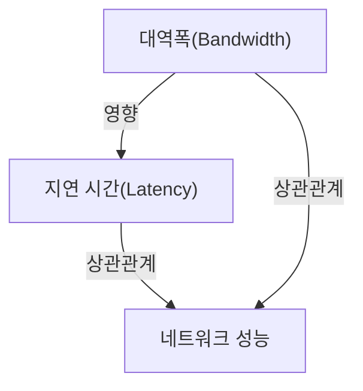

이 자료들은 대역폭과 지연 시간의 문제를 이해하고 해결하는 데 큰 도움이 될 것이다.

<!--
##### Reference #####
-->

## Reference


* [https://cacm.acm.org/practice/you-dont-know-jack-about-bandwidth/](https://cacm.acm.org/practice/you-dont-know-jack-about-bandwidth/)

