현대 사회에서 원격 근무가 보편화됨에 따라 많은 기업과 개인이 인터넷 성능 문제에 직면한다. 비디오 회의 끊김, 음성 지연, 게임·스트리밍 지연은 흔히 **대역폭 부족**으로 오인되지만, 실제로는 **지연(latency)** 이 원인인 경우가 많다. 대역폭은 “한 번에 보낼 수 있는 데이터 양”이고, 지연은 “데이터가 도달하기까지 걸리는 시간”이다. 대역폭이 넉넉해도 라우터 소프트웨어·큐 관리 방식 때문에 지연이 커질 수 있으며, QoS·AQM·LibreQoS 같은 최신 솔루션으로 이를 개선할 수 있다. 이 글은 지연의 원인과 해결 방안을 체계적으로 다룬다.

## 개요

원격 근무 환경에서의 인터넷 문제는 연결 불안정, 속도 저하, **지연 시간 증가**로 요약된다. 화상 회의·파일 전송·클라우드 앱 사용 시 지연이 길어지면 실시간 소통과 업무 효율이 떨어진다.

**원격 근무 환경에서의 인터넷 문제**

여러 기기가 동시에 같은 회선을 쓰는 가정·소규모 오피스에서는 대역폭 경합뿐 아니라 **콘텐츠 경합(Contention)** 과 **버퍼블로트(Bufferbloat)** 로 인해 지연이 불규칙하게 튀는 경우가 많다. 사용자는 “속도는 나오는데 왜 끊기지?”라고 느끼곤 하는데, 이는 지연·지터(지연 변동) 문제에 가깝다.

**ISP와 고객 간의 불만 사항**

ISP는 “최대 속도”를 광고하지만, 실사용 시에는 지연·패킷 손실·버퍼블로트 때문에 고객 불만이 생긴다. 약속된 수치와 체감 품질의 괴리는 대부분 **라우터·게이트웨이의 큐 관리 방식**과 구형 펌웨어에서 기인한다.

**대역폭과 지연 시간의 중요성**

- **대역폭**: 단위 시간당 전송 가능한 데이터량(bps). 스트리밍·다운로드 용량을 좌우한다.
- **지연 시간**: 패킷이 출발지에서 목적지까지 가는 데 걸리는 시간(ms). 실시간 통신·게임·원격 제어에 직접 영향을 준다.

둘 다 중요하지만, “느리다”는 체감은 대역폭보다 **지연·지터**에 더 민감한 경우가 많다.

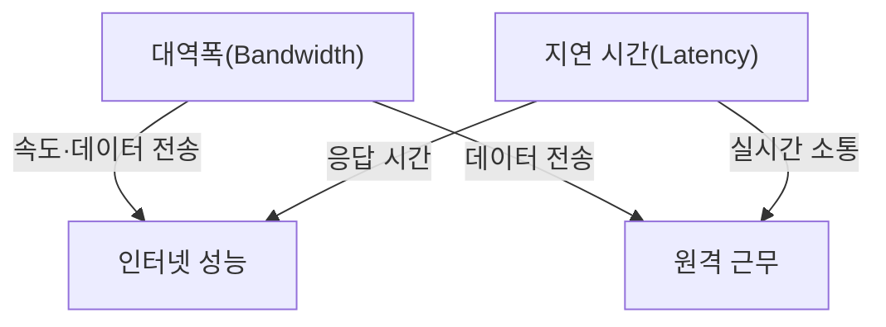
```mermaid
graph TD
  Bandwidth["대역폭(Bandwidth)"]
  Latency["지연 시간(Latency)"]
  Perf["인터넷 성능"]
  Remote["원격 근무"]
  Bandwidth -->|"속도·데이터 전송"| Perf
  Bandwidth -->|"데이터 전송"| Remote
  Latency -->|"응답 시간"| Perf
  Latency -->|"실시간 소통"| Remote
```

위 다이어그램은 대역폭과 지연 시간이 인터넷 성능 및 원격 근무에 미치는 관계를 보여준다. 둘 중 하나만 개선해서는 체감 품질이 나아지지 않을 수 있으므로, **지연 최소화**를 별도로 다루는 것이 중요하다.

## 대역폭과 지연 시간

### 대역폭의 정의

**대역폭(Bandwidth)** 은 네트워크가 단위 시간에 전송할 수 있는 **최대 데이터량**이다. 보통 bps(비트/초)로 측정하며, 100Mbps면 이론상 초당 100메가비트를 보낼 수 있다. 대역폭이 높을수록 대용량 전송·멀티스트림에 유리하다.

### 지연 시간의 정의

**지연 시간(Latency)** 은 패킷이 출발지에서 목적지까지 도달하는 데 걸리는 **시간**이다. ms(밀리초)로 측정하며, RTT(Round-Trip Time)는 요청부터 응답까지 왕복 시간을 의미한다. 지연이 짧을수록 실시간 통신·인터랙션에 유리하다.

### 대역폭과 지연 시간의 관계

대역폭이 넉넉해도 지연이 크면 “한 번에 많이 보내지만, 반응은 느리다”는 상황이 된다. 반대로 지연이 작고 대역폭이 좁으면 “반응은 빠르지만 큰 파일은 오래 걸린다.” 애플리케이션별로 대역폭·지연 중 어떤 것이 더 중요한지가 다르므로, 네트워크 설계·트러블슈팅 시 둘 다 고려해야 한다.

### 대역폭과 지연 시간의 시각적 비교

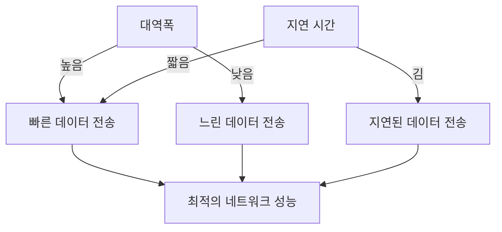
```mermaid
graph TD
  BW["대역폭"]
  LT["지연 시간"]
  Fast["빠른 데이터 전송"]
  Slow["느린 데이터 전송"]
  Delayed["지연된 데이터 전송"]
  Optimal["최적의 네트워크 성능"]
  BW -->|"높음"| Fast
  BW -->|"낮음"| Slow
  LT -->|"짧음"| Fast
  LT -->|"김"| Delayed
  Fast --> Optimal
  Slow --> Optimal
  Delayed --> Optimal
```

대역폭이 높고 지연이 짧을 때 최적에 가깝고, 대역폭이 낮거나 지연이 길면 체감 품질이 떨어진다.

## 지연 시간의 원인

지연은 단일 원인보다 **콘텐츠 경합, 라우터 소프트웨어, 버퍼블로트, 가정용 장비 한계**가 겹쳐서 발생하는 경우가 많다.

### 콘텐츠 경합(Contention)

여러 사용자·기기가 **같은 링크·같은 큐**를 쓰면 자원을 나누어 쓰게 되고, 한 흐름이 링크를 꽉 채우면 다른 흐름의 지연이 늘어난다. 가정에서 동시에 화상회의·스트리밍·다운로드를 하면 대역폭과 큐가 공유되며 지연·지터가 발생한다.

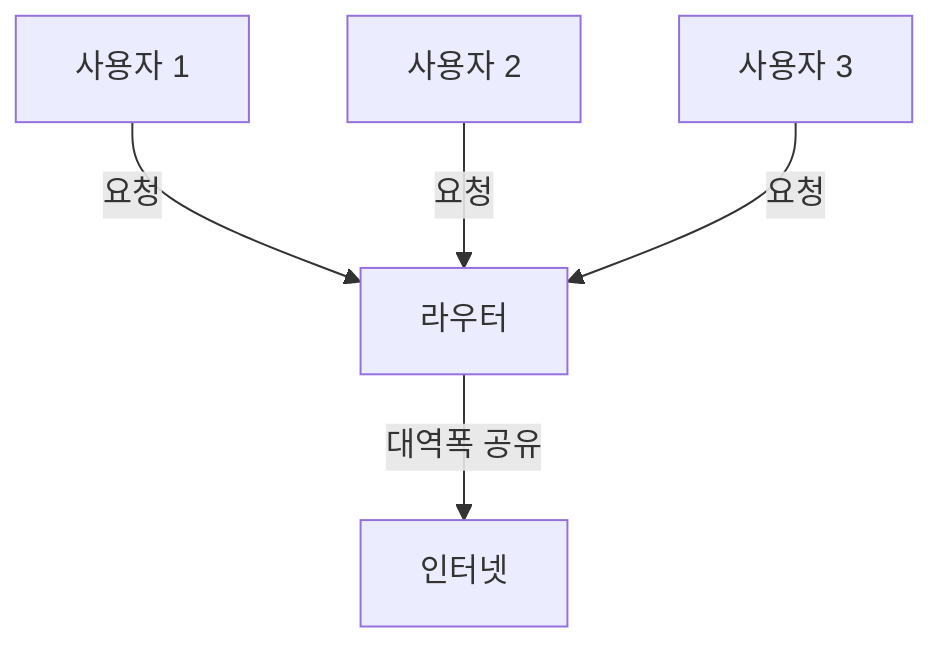
```mermaid
graph TD
  User1["사용자 1"]
  User2["사용자 2"]
  User3["사용자 3"]
  Router["라우터"]
  Internet["인터넷"]
  User1 -->|"요청"| Router
  User2 -->|"요청"| Router
  User3 -->|"요청"| Router
  Router -->|"대역폭 공유"| Internet
```

### 라우터 소프트웨어의 문제

라우터·게이트웨이의 펌웨어가 구식이거나 **FIFO·drop-tail** 같은 단순 큐만 쓰면, 트래픽이 몰릴 때 버퍼가 길어져 지연이 수백 ms까지 늘어날 수 있다. 최신 스택은 AQM(Active Queue Management)·FQ(Fair Queuing)를 사용해 큐 길이와 체감 지연을 줄인다.

### 버퍼블로트(Bufferbloat) 현상

**버퍼블로트**는 버퍼를 지나치게 크게 잡아서, 패킷이 큐에 오래 머물며 **대기 지연**이 커지는 현상이다. 특히 대역폭이 넓은 링크에서 “큐가 비기 전까지 계속 쌓이다가 한꺼번에 나가면서” 지연이 요동친다. 해결에는 **AQM**(CoDel·fq_codel·CAKE 등)을 사용해 큐 길이·체류 시간을 제한하는 방식이 쓰인다.

### 가정용 라우터의 한계

가정용·소규모 오피스 라우터는 CPU·메모리·소프트웨어 기능이 제한적이라, AQM·QoS·트래픽 분류가 없거나 약한 경우가 많다. 이 경우 대역폭을 올려도 지연·지터는 그대로일 수 있으므로, **AQM·SQM(Smart Queue Management) 지원** 여부를 확인하는 것이 중요하다.

## 좋은 라우터 소프트웨어

### 최신 소프트웨어의 필요성

다수의 디바이스가 동시에 연결되는 환경에서는 **큐 관리·스케줄링**이 성능과 지연을 좌우한다. 구형 소프트웨어는 버퍼블로트와 공정성 부족을 유발하므로, AQM·FQ를 지원하는 최신 스택으로 업데이트하는 것이 필수에 가깝다.

### fq_codel 및 CAKE 알고리즘

- **fq_codel**: AQM과 Fair Queuing을 결합한 방식. 흐름별로 큐를 두고, 각 큐에 CoDel을 적용해 “오래 머문 패킷”을 조기에 드롭·표시하여 지연을 낮춘다.
- **CAKE(Common Applications Kept Enhanced)**: fq_codel을 확장한 형태. 트래픽 유형·호스트·흐름 단위로 분류하고, 대역폭 공정 분배·지연 감소·버퍼블로트 완화를 한꺼번에 다룬다.

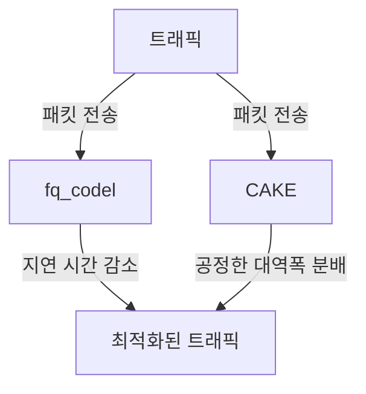
```mermaid
graph TD
  Traffic["트래픽"]
  FqCodel["fq_codel"]
  Cake["CAKE"]
  Optimized["최적화된 트래픽"]
  Traffic -->|"패킷 전송"| FqCodel
  FqCodel -->|"지연 시간 감소"| Optimized
  Traffic -->|"패킷 전송"| Cake
  Cake -->|"공정한 대역폭 분배"| Optimized
```

### LibreQoS 소개

**LibreQoS**는 오픈 소스 QoS 솔루션으로, 대역폭 제한·공정성·지연 최소화를 함께 다룬다. ISP·중소 네트워크에서 트래픽을 분류하고 AQM·셰이핑을 적용해, 실시간 트래픽과 벌크 트래픽이 한 링크를 공유할 때도 지연을 낮추는 데 쓰인다.

### QoS(Quality of Service)의 중요성

**QoS**는 트래픽 유형별로 **우선순위·대역폭·지연 보장**을 두어, 중요한 트래픽(VoIP·화상회의·게임)이 지연·손실 없이 전달되도록 하는 기능이다. 좋은 라우터 소프트웨어는 QoS와 AQM을 함께 제공해, 대역폭만 늘리는 것보다 체감 품질을 크게 개선한다.

- **지연 감소**: 우선 트래픽을 먼저 처리해 RTT·지터를 줄인다.
- **대역폭 관리**: 공정 분배로 한 흐름이 링크를 독점하는 것을 완화한다.
- **사용자 경험**: 실시간 앱의 끊김·끌림이 줄어든다.

## ISP의 문제 해결

### ISP의 기존 라우터 문제

ISP 구간의 라우터·게이트웨이가 구형이거나 AQM·QoS가 비활성화되어 있으면, 고객 구간에서 아무리 좋은 장비를 써도 **상위 구간**에서 버퍼블로트와 지연이 발생할 수 있다. 따라서 ISP 측에서도 큐 관리·트래픽 정책을 개선해야 end-to-end 지연이 줄어든다.

### LibreQoS의 적용

LibreQoS를 ISP 엣지·집약 구간에 적용하면, 고객별·서비스별로 트래픽을 분류하고 셰이핑·AQM을 걸어 대역폭과 지연을 동시에 관리할 수 있다. “대역폭은 넉넉한데 느리다”는 불만을 줄이는 데 도움이 된다.

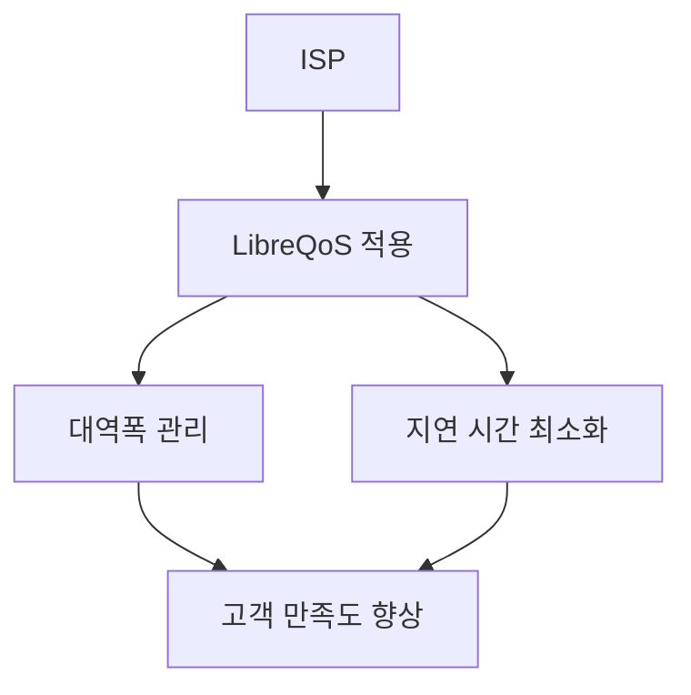
```mermaid
graph TD
  ISP["ISP"]
  LibreQoS["LibreQoS 적용"]
  BWMgmt["대역폭 관리"]
  LatMin["지연 시간 최소화"]
  Satisfaction["고객 만족도 향상"]
  ISP --> LibreQoS
  LibreQoS --> BWMgmt
  LibreQoS --> LatMin
  BWMgmt --> Satisfaction
  LatMin --> Satisfaction
```

### 성능 개선을 위한 기술적 접근

- **AQM 도입**: CoDel·fq_codel·CAKE 등으로 큐 길이·체류 시간을 제한한다.
- **Diffserv 활용**: 패킷에 우선순위·서비스 클래스를 표시해 경로상에서 차등 처리한다.
- **모니터링**: 지연·손실·재전송률을 측정해 병목과 정책 효과를 검증한다.

### 고객 불만 해결을 위한 전략

고객에게 “속도만 보지 말고 지연·품질”을 설명하고, 측정 도구(예: [Bufferbloat.net의 테스트 안내](https://www.bufferbloat.net/projects/bloat/wiki/What_can_I_do_about_Bufferbloat/), Flent, iperf3)로 개선 전후를 보여 주는 것이 효과적이다. AQM·QoS 도입과 함께 투명한 소통을 하면 신뢰와 만족도를 높일 수 있다.

## 성능 개선 사례

### 실시간 성능 모니터링

대역폭 사용량·지연(RTT)·패킷 손실·재전송을 지속적으로 측정하면, 문제 구간과 개선 효과를 객관적으로 확인할 수 있다. 아래는 간단한 핑 기반 가용성 모니터링 예시이다.

```python
# 42jerrykim.github.io에서 더 많은 정보를 확인할 수 있다
import time
import os

def ping_test(host):
    response = os.system("ping -c 1 " + host)
    return response == 0

def monitor_network(host, interval):
    while True:
        if ping_test(host):
            print(f"{host} is reachable")
        else:
            print(f"{host} is not reachable")
        time.sleep(interval)

monitor_network("8.8.8.8", 5)  # 5초 간격으로 Google DNS 서버 모니터링
```

실제 지연·버퍼블로트 측정에는 **Flent**, **iperf3**, **Waveform Bufferbloat Test** 같은 도구를 사용하는 것이 좋다.

### 성능 개선 전후 비교

AQM·SQM 적용 전에는 “다운로드 시 핑이 수백 ms로 튀는” 버퍼블로트가 흔하다. fq_codel·CAKE 적용 후에는 부하가 걸려도 RTT가 수십 ms 이하로 유지되는 사례가 많다. 정량 비교를 위해 동일 조건(동일 시간대·동일 트래픽)에서 개선 전후 지연·손실률을 측정하는 것을 권장한다.

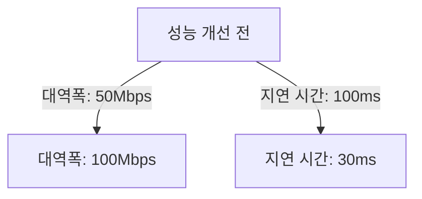
```mermaid
graph TD
  Before["성능 개선 전"]
  AfterBW["대역폭: 100Mbps"]
  AfterLT["지연 시간: 30ms"]
  Before -->|"대역폭: 50Mbps"| AfterBW
  Before -->|"지연 시간: 100ms"| AfterLT
```

### 고객의 피드백 및 사례 연구

ISP나 기업이 QoS·AQM을 도입한 뒤, “화상회의가 부드러워졌다”, “게임 끌림이 줄었다”는 피드백을 수집해 정성·정량 사례를 쌓을 수 있다. 이를 통해 추가 튜닝과 서비스 안내에 활용할 수 있다.

## FAQ

### 대역폭과 지연 시간의 차이는 무엇인가요?

**대역폭**은 단위 시간당 전송량(용량), **지연**은 한 패킷이 도달하는 데 걸리는 시간이다. 대역폭이 높아도 경로상 버퍼·큐가 크면 지연이 커질 수 있어, 둘은 별도로 측정·최적화해야 한다.

### 버퍼블로트는 어떻게 해결하나요?

1. **AQM 사용**: fq_codel·CAKE·CoDel 등으로 큐 길이·체류 시간을 제한한다.  
2. **라우터·펌웨어 업데이트**: AQM·SQM을 지원하는 최신 소프트웨어로 교체한다.  
3. **QoS 설정**: 실시간 트래픽에 우선순위를 두어 지연을 완화한다.

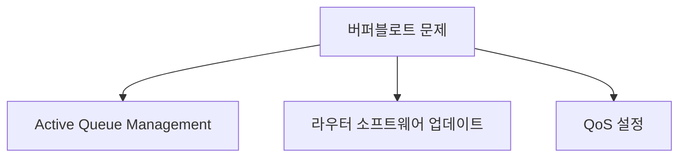
```mermaid
graph TD
  Bufferbloat["버퍼블로트 문제"]
  AQM["Active Queue Management"]
  Update["라우터 소프트웨어 업데이트"]
  QoS["QoS 설정"]
  Bufferbloat --> AQM
  Bufferbloat --> Update
  Bufferbloat --> QoS
```

### LibreQoS는 어떻게 작동하나요?

트래픽을 분류(애플리케이션·호스트·DSCP 등)하고, 흐름별·정책별로 대역폭·우선순위를 부여한 뒤, AQM·셰이핑을 적용한다. 이를 통해 병목 구간에서도 지연을 낮추고 공정성을 높인다.

### ISP가 성능 문제를 해결하기 위해 무엇을 해야 하나요?

1. **엣지·집약 구간에 AQM·QoS 도입**: CoDel·fq_codel·CAKE 등 적용.  
2. **라우터·게이트웨이 소프트웨어 최신화**: 버퍼블로트를 유발하는 구형 큐 정책 제거.  
3. **모니터링·고객 지원**: 지연·손실 측정과 고객 피드백 수집으로 개선 효과 검증 및 안내.

## 관련 기술

### Active Queue Management (AQM)

**AQM**은 큐가 가득 차기 전에 패킷을 **드롭하거나 ECN으로 표시**해, 송신자가 전송 속도를 조절하도록 유도하는 방식이다. 큐 길이·체류 시간을 제한해 버퍼블로트와 지연을 줄인다.

**AQM의 작동 원리**

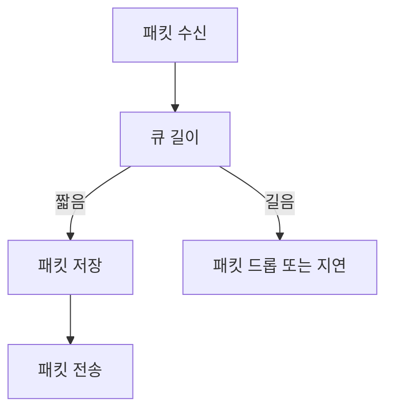
```mermaid
graph TD
  Recv["패킷 수신"]
  CheckQueue["큐 길이"]
  Store["패킷 저장"]
  Drop["패킷 드롭 또는 지연"]
  Send["패킷 전송"]
  Recv --> CheckQueue
  CheckQueue -->|"짧음"| Store
  CheckQueue -->|"길음"| Drop
  Store --> Send
```

### Diffserv

**Differentiated Services(Diffserv)** 는 IP 헤더의 DSCP 필드로 트래픽 클래스를 표시하고, 라우터가 클래스별로 우선순위·대역폭·드롭 확률을 다르게 적용하는 방식이다. 대규모 네트워크에서 QoS를 구현할 때 널리 쓰인다.

**Diffserv의 작동 방식**

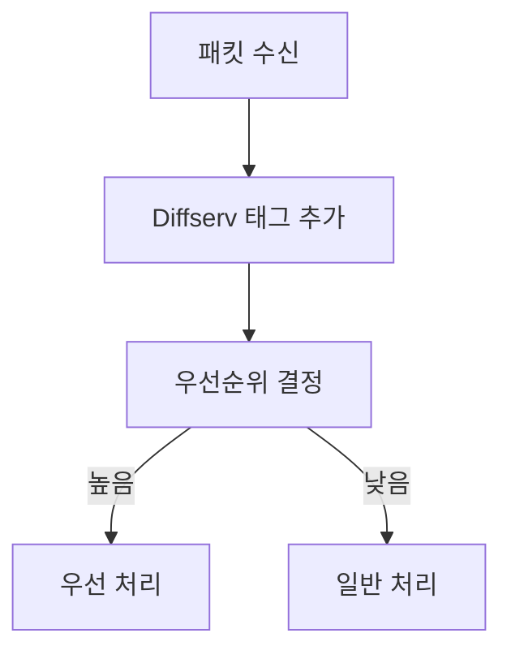
```mermaid
graph TD
  Recv["패킷 수신"]
  Tag["Diffserv 태그 추가"]
  Decide["우선순위 결정"]
  High["우선 처리"]
  Normal["일반 처리"]
  Recv --> Tag
  Tag --> Decide
  Decide -->|"높음"| High
  Decide -->|"낮음"| Normal
```

### eBPF 및 XDP

**eBPF**는 커널 공간에서 안전하게 실행되는 프로그램으로, 패킷 필터링·모니터링·트래픽 제어에 쓰인다. **XDP(eXpress Data Path)** 는 NIC 드라이버 단에서 패킷을 처리해 지연을 최소화하고, DDoS 완화·로드 밸런싱·AQM과 결합해 사용할 수 있다.

**eBPF와 XDP의 관계**

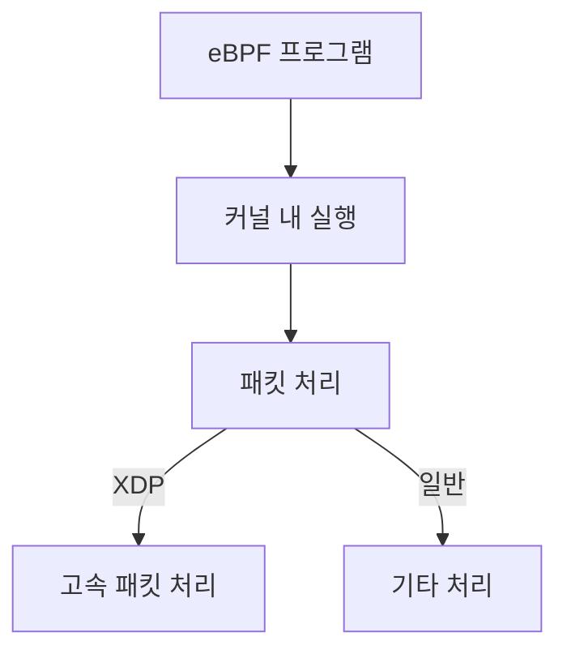
```mermaid
graph TD
  eBPF["eBPF 프로그램"]
  Kernel["커널 내 실행"]
  PktProc["패킷 처리"]
  XDPFast["고속 패킷 처리"]
  Other["기타 처리"]
  eBPF --> Kernel
  Kernel --> PktProc
  PktProc -->|"XDP"| XDPFast
  PktProc -->|"일반"| Other
```

### 네트워크 토폴로지 인식

토폴로지 인식은 링크·장비·경로를 파악해 트래픽을 적절한 경로로 보내고, 혼잡·장애 구간을 우회·완화하는 데 쓰인다. 지연·손실을 줄이기 위해 경로 선택·트래픽 엔지니어링과 함께 고려할 수 있다.

**네트워크 토폴로지 인식의 이점**

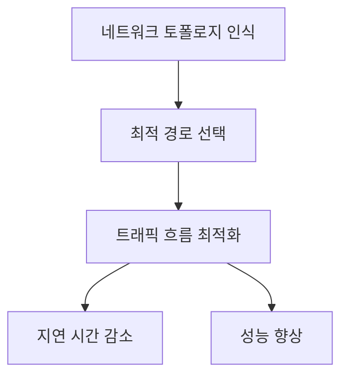
```mermaid
graph TD
  Topo["네트워크 토폴로지 인식"]
  Path["최적 경로 선택"]
  Flow["트래픽 흐름 최적화"]
  LowLat["지연 시간 감소"]
  Perf["성능 향상"]
  Topo --> Path
  Path --> Flow
  Flow --> LowLat
  Flow --> Perf
```

## 결론

**지연 시간 문제의 해결**

원격 근무·실시간 서비스가 늘면서 “대역폭은 충분한데 느리다”는 경험이 자주 보고된다. 이는 **지연·버퍼블로트** 문제일 가능성이 크다. 대역폭만 늘리는 것보다 **AQM·QoS·최신 라우터 소프트웨어**로 큐와 스케줄링을 개선하는 것이 체감 품질 향상에 직접 기여한다.

**ISP와 고객 간의 관계 개선**

ISP가 엣지·집약 구간에 AQM·QoS를 도입하고, 고객에게 “지연·품질” 개선 내용을 측정 결과와 함께 전달하면, “속도만 보는” 불만을 줄이고 신뢰를 쌓을 수 있다.

**미래의 인터넷 성능 향상을 위한 방향**

AQM(CoDel·fq_codel·CAKE)·Diffserv·eBPF/XDP·토폴로지 인식 등을 조합해, 대역폭뿐 아니라 **지연·지터·공정성**을 함께 관리하는 방향이 지속적으로 중요해질 것이다.

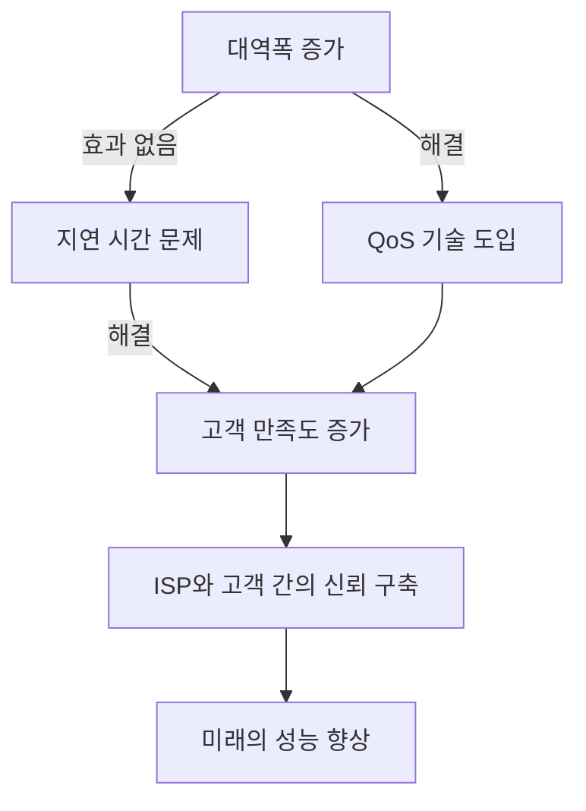
```mermaid
graph TD
  MoreBW["대역폭 증가"]
  LatProb["지연 시간 문제"]
  QoSIntro["QoS 기술 도입"]
  Satisfy["고객 만족도 증가"]
  Trust["ISP와 고객 간의 신뢰 구축"]
  Future["미래의 성능 향상"]
  MoreBW -->|"효과 없음"| LatProb
  MoreBW -->|"해결"| QoSIntro
  LatProb -->|"해결"| Satisfy
  QoSIntro --> Satisfy
  Satisfy --> Trust
  Trust --> Future
```

## 참고 자료

- [Bufferbloat.net](https://www.bufferbloat.net/) — 버퍼블로트 설명, AQM·CAKE·CoDel·fq_codel 자료, “What Can I Do About Bufferbloat?” 등 실무 가이드.
- [Active queue management (Wikipedia)](https://en.wikipedia.org/wiki/Active_queue_management) — AQM 개념, RED·CoDel·FQ-CoDel·CAKE 등 알고리즘 개요.
- [You Don’t Know Jack About Bandwidth (CACM)](https://cacm.acm.org/practice/you-dont-know-jack-about-bandwidth/) — 대역폭과 지연에 대한 오해와 올바른 이해 (접속 환경에 따라 로딩이 느릴 수 있음).

위 자료를 통해 대역폭·지연·버퍼블로트·AQM·QoS를 더 깊이 학습하고, 실제 네트워크에 적용할 수 있다.
