시간은 인간 경험의 중심적인 특징이다. 그러나 시간은 실제로 무엇인가? 전통적인 과학적 설명에서는 시간은 공간과 유사한 어떤 종류의 좌표로 표현되는 경우가 많다. 그러나 이러한 수학적 설명은 시간의 본질에 대해 아무것도 말해주지 않는다. 계산적 관점에서 생각하기 시작하면, 세계의 연속적인 상태를 이전 상태에서 계산된 결과로 생각하는 것이 자연스럽다. 이는 우주가 진행하는 계산의 "진행"과 시간의 진행을 동일시할 수 있음을 시사한다. 그러나 이는 단순히 "시간 좌표"를 "계산 단계 수"로 대체하는 것에 그치지 않는다. 계산적 비가역성의 현상으로 인해, 전통적인 수학적 시간 좌표 개념에서는 이 좌표를 "어떤 값으로 설정할 수 있다"고 가정하지만, 계산적 비가역성은 시스템의 상태를 예측하기 위해 각 단계를 명시적으로 추적해야 함을 의미한다. 이러한 관점에서 시간은 계산적 관점에서 볼 때 특정한 강건성을 지닌다. 시간의 진행을 이해하기 위해서는 관찰자의 역할과 계산적 비가역성의 상호작용을 고려해야 한다. 우리는 계산적으로 제한된 존재로서, 시스템의 미래 행동을 예측하기 위해 필요한 계산 작업을 수행할 수 없다. 따라서 우리는 시스템과 함께 계산을 수행하며, 미래가 "점진적으로 펼쳐지는" 것을 경험하게 된다. 이러한 상호작용은 우리가 시간의 흐름을 경험하는 본질적인 이유가 된다.

<!--
##### Outline #####
-->

<!--
# 목차

## 개요
   - 시간의 개념과 중요성
   - 전통적인 과학적 접근과 그 한계
   - 계산적 관점에서의 시간 이해

## 계산적 시간의 관점
   - 2.1. 계산적 규칙과 상태의 변화
   - 2.2. 계산적 불가역성과 시간의 진행
   - 2.3. 시간의 강건성: 미래 예측의 한계

## 관찰자의 역할
   - 3.1. 관찰자의 계산적 한계
   - 3.2. 시간의 경험과 관찰자의 상호작용
   - 3.3. 열역학 제2법칙과 시간의 방향성

## 다중 시간의 흐름
   - 4.1. 단일 스레드로서의 시간 경험
   - 4.2. 분기적 공간과 양자역학의 관계
   - 4.3. 다중 경로의 역사와 관찰자의 인식

## 루리어드(Ruliad) 내의 시간
   - 5.1. 루리어드의 개념과 구조
   - 5.2. 계산적 규칙의 다양성과 시간의 정의
   - 5.3. 루리어드와 물리 법칙의 유도

## 시간의 본질
   - 6.1. 시간의 정의: 계산적 규칙의 적용
   - 6.2. 계산적 불가역성과 시간의 선형적 진행
   - 6.3. 시간의 방향성과 열의 개념의 유사성

## 고전적 시간 문제
   - 7.1. 시간의 가역성 문제
   - 7.2. 시간 여행의 개념과 가능성
   - 7.3. 상대성 이론과 시간 지연 현상

## 결론
   - 8.1. 시간의 계산적 관점 요약
   - 8.2. 시간의 본질에 대한 새로운 통찰
   - 8.3. 미래 연구 방향과 가능성

## FAQ
   - 9.1. 시간은 왜 한 방향으로만 흐르나요?
   - 9.2. 계산적 불가역성이란 무엇인가요?
   - 9.3. 루리어드와 우리의 현실은 어떻게 연결되나요?

## 관련 기술
   - 10.1. 계산 이론과 물리학
   - 10.2. 양자역학과 관찰자의 역할
   - 10.3. 열역학과 시간의 관계

이 목차는 주어진 내용을 바탕으로 시간의 개념을 다양한 관점에서 탐구하고, 관련된 기술과 이론을 포함하여 풍부한 정보를 제공하는 구조로 구성되었습니다.
-->

<!--
## 개요
   - 시간의 개념과 중요성
   - 전통적인 과학적 접근과 그 한계
   - 계산적 관점에서의 시간 이해
-->

## 개요

시간은 인간의 삶과 우주에서 중요한 역할을 하는 개념이다. 우리는 시간의 흐름 속에서 사건을 경험하고, 과거를 회상하며, 미래를 계획한다. 이러한 시간의 개념은 물리학, 철학, 심리학 등 다양한 분야에서 다루어지며, 각 분야마다 시간에 대한 이해가 다를 수 있다. 

**시간의 개념과 중요성**

시간은 단순히 사건이 발생하는 순서를 나타내는 것이 아니라, 사건 간의 관계를 이해하는 데 필수적인 요소이다. 예를 들어, 물리학에서는 시간의 흐름이 물체의 운동과 밀접하게 연결되어 있으며, 이는 뉴턴의 운동 법칙이나 아인슈타인의 상대성 이론에서도 중요한 역할을 한다. 시간은 또한 생물학적 리듬, 사회적 상호작용, 그리고 개인의 경험에까지 영향을 미친다.

**전통적인 과학적 접근과 그 한계**

전통적인 과학적 접근에서는 시간은 절대적이고 선형적인 개념으로 여겨졌다. 뉴턴의 고전역학에서는 시간은 균일하게 흐르며, 모든 사건은 이 시간의 흐름에 따라 발생한다고 가정하였다. 그러나 이러한 접근은 시간의 상대성이나 양자역학적 현상과 같은 복잡한 현상을 설명하는 데 한계를 보인다. 예를 들어, 상대성 이론에서는 시간의 흐름이 관찰자의 속도에 따라 달라질 수 있음을 보여준다. 이러한 한계는 시간에 대한 새로운 이해가 필요함을 시사한다.

**계산적 관점에서의 시간 이해**

계산적 관점에서 시간은 단순한 흐름이 아니라, 상태의 변화와 규칙에 따라 정의될 수 있다. 이 관점에서는 시간은 사건의 발생과 그에 따른 상태의 변화를 추적하는 수단으로 이해된다. 예를 들어, 컴퓨터 과학에서는 알고리즘의 실행 시간이나 데이터 처리의 순서를 고려할 때 시간의 개념이 중요하게 작용한다. 

다음은 계산적 관점에서 시간의 흐름을 나타내는 간단한 다이어그램이다.

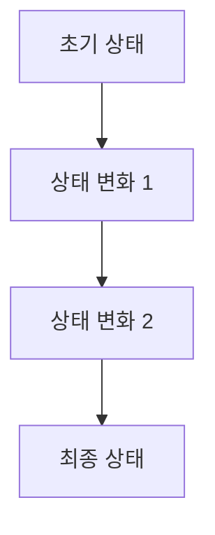

이 다이어그램은 초기 상태에서 시작하여 여러 상태 변화를 거쳐 최종 상태에 도달하는 과정을 보여준다. 이러한 계산적 관점은 시간의 본질을 이해하는 데 중요한 기초가 된다. 

결론적으로, 시간은 단순한 개념이 아니라 다양한 관점에서 탐구할 수 있는 복잡한 주제이다. 전통적인 과학적 접근의 한계를 인식하고, 계산적 관점에서의 이해를 통해 시간의 본질을 더욱 깊이 있게 탐구할 필요가 있다.

<!--
## 계산적 시간의 관점
   - 2.1. 계산적 규칙과 상태의 변화
   - 2.2. 계산적 불가역성과 시간의 진행
   - 2.3. 시간의 강건성: 미래 예측의 한계
-->

## 계산적 시간의 관점

시간은 우리가 경험하는 세계에서 중요한 요소이며, 이를 계산적 관점에서 이해하는 것은 여러 가지 흥미로운 통찰을 제공한다. 이 섹션에서는 계산적 규칙과 상태의 변화, 계산적 불가역성, 그리고 시간의 강건성에 대해 논의할 것이다.

### 계산적 규칙과 상태의 변화

계산적 규칙은 시스템의 상태가 어떻게 변화하는지를 정의하는 규칙이다. 이러한 규칙은 주어진 입력에 대해 특정한 출력을 생성하며, 이는 시간의 흐름에 따라 상태가 어떻게 변화하는지를 설명하는 데 중요한 역할을 한다. 예를 들어, 간단한 상태 변화의 예로는 다음과 같은 코드가 있다.

```python
class System:
    def __init__(self, state):
        self.state = state

    def update(self, input):
        # 계산적 규칙에 따라 상태를 업데이트
        self.state += input

# 시스템 초기화
system = System(0)
system.update(1)  # 상태 변화
print(system.state)  # 출력: 1
```

위의 코드에서 `System` 클래스는 상태를 가지고 있으며, `update` 메소드를 통해 입력에 따라 상태를 변화시킨다. 이러한 계산적 규칙은 시간의 흐름에 따라 시스템이 어떻게 진화하는지를 보여준다.

### 계산적 불가역성과 시간의 진행

계산적 불가역성은 시스템의 상태 변화가 한 방향으로만 진행된다는 개념이다. 이는 열역학 제2법칙과 유사하게, 고립계에서 엔트로피가 증가하는 경향을 나타낸다. 예를 들어, 다음과 같은 다이어그램을 통해 이를 시각적으로 표현할 수 있다.

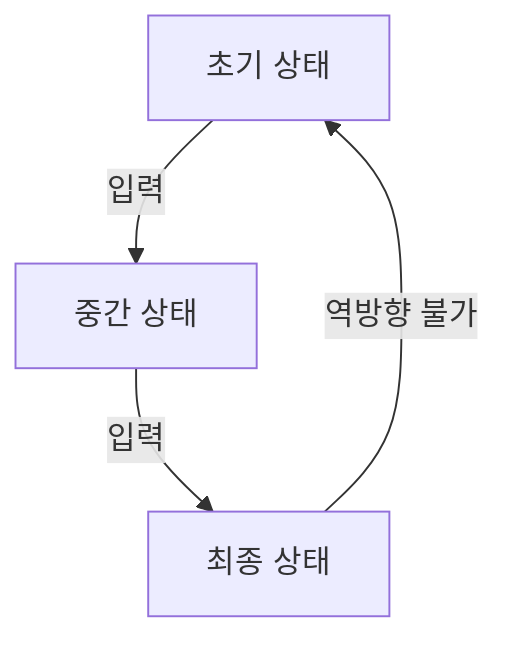

위의 다이어그램에서 볼 수 있듯이, 초기 상태에서 최종 상태로의 진행은 가능하지만, 최종 상태에서 초기 상태로의 역행은 불가능하다. 이는 계산적 불가역성이 시간의 진행과 어떻게 연결되는지를 보여준다.

### 시간의 강건성: 미래 예측의 한계

시간의 강건성은 미래를 예측하는 데 있어 존재하는 한계를 의미한다. 계산적 시스템은 초기 조건에 따라 다양한 결과를 생성할 수 있으며, 이는 예측의 어려움을 초래한다. 예를 들어, 다음과 같은 코드로 이를 설명할 수 있다.

```python
import random

class PredictiveSystem:
    def __init__(self, initial_state):
        self.state = initial_state

    def predict_future(self):
        # 무작위로 상태 변화 예측
        return self.state + random.choice([-1, 0, 1])

# 예측 시스템 초기화
predictive_system = PredictiveSystem(5)
future_state = predictive_system.predict_future()
print(f"예측된 미래 상태: {future_state}")
```

위의 코드에서 `PredictiveSystem` 클래스는 초기 상태를 기반으로 무작위로 미래 상태를 예측한다. 이처럼 계산적 시스템의 복잡성과 초기 조건의 민감성은 미래 예측의 한계를 나타내며, 이는 시간의 강건성과 밀접한 관련이 있다.

이와 같이 계산적 시간의 관점은 시간의 본질을 이해하는 데 중요한 역할을 하며, 다양한 시스템의 동작을 설명하는 데 유용하다.

<!--
## 관찰자의 역할
   - 3.1. 관찰자의 계산적 한계
   - 3.2. 시간의 경험과 관찰자의 상호작용
   - 3.3. 열역학 제2법칙과 시간의 방향성
-->

## 관찰자의 역할

관찰자는 시간의 개념을 이해하는 데 있어 중요한 역할을 한다. 관찰자의 인식과 경험은 시간의 흐름을 어떻게 이해하고 해석하는지에 큰 영향을 미친다. 이 섹션에서는 관찰자의 계산적 한계, 시간의 경험과 관찰자의 상호작용, 그리고 열역학 제2법칙과 시간의 방향성에 대해 살펴보겠다.

### 관찰자의 계산적 한계

관찰자는 자신의 인식과 경험을 바탕으로 세상을 이해하지만, 이러한 이해는 계산적 한계에 의해 제약을 받는다. 예를 들어, 관찰자는 특정 사건을 관찰할 때 그 사건의 모든 변수를 동시에 고려할 수 없다. 이는 관찰자가 시간의 흐름을 이해하는 데 있어 제한적인 정보를 제공하게 된다. 

이러한 계산적 한계는 관찰자가 시간의 흐름을 어떻게 인식하는지에 영향을 미친다. 관찰자는 과거의 사건을 바탕으로 미래를 예측하지만, 이 예측은 항상 불확실성을 동반한다. 

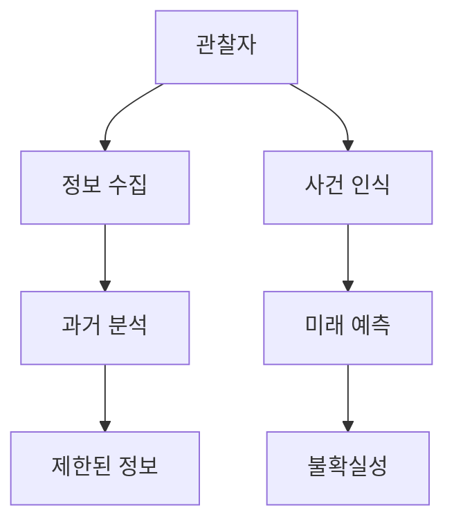

### 시간의 경험과 관찰자의 상호작용

시간은 단순히 물리적 현상이 아니라, 관찰자의 경험과 밀접하게 연결되어 있다. 관찰자는 자신의 경험을 통해 시간의 흐름을 느끼고, 이를 바탕으로 사건의 순서를 이해한다. 이러한 상호작용은 관찰자가 시간의 개념을 어떻게 형성하는지에 중요한 역할을 한다.

예를 들어, 관찰자가 특정 사건을 경험할 때, 그 사건의 지속 시간이나 빈도는 관찰자의 주관적인 경험에 따라 다르게 인식될 수 있다. 이는 시간의 상대성 개념과도 연결되며, 관찰자의 인식이 시간의 흐름에 어떻게 영향을 미치는지를 보여준다.

### 열역학 제2법칙과 시간의 방향성

열역학 제2법칙은 고립계에서 엔트로피가 증가하는 방향으로 진행된다는 원리를 제시한다. 이 법칙은 시간의 방향성을 이해하는 데 중요한 역할을 한다. 즉, 시간은 과거에서 미래로 흐르며, 이 과정에서 엔트로피는 증가하게 된다.

관찰자는 이러한 열역학적 원리를 통해 시간의 방향성을 인식하게 된다. 예를 들어, 얼음이 녹아 물이 되는 과정은 엔트로피가 증가하는 예시로, 관찰자는 이 과정을 통해 시간의 흐름을 느낀다. 이러한 관찰은 시간의 비가역성을 이해하는 데 기여하며, 관찰자가 시간의 개념을 형성하는 데 중요한 요소가 된다. 

이와 같이 관찰자의 역할은 시간의 개념을 이해하는 데 있어 필수적이며, 관찰자의 경험과 계산적 한계는 시간의 흐름을 어떻게 인식하는지에 큰 영향을 미친다.

<!--
## 다중 시간의 흐름
   - 4.1. 단일 스레드로서의 시간 경험
   - 4.2. 분기적 공간과 양자역학의 관계
   - 4.3. 다중 경로의 역사와 관찰자의 인식
-->

## 다중 시간의 흐름

### 단일 스레드로서의 시간 경험

시간은 일반적으로 단일 스레드로 경험되며, 이는 우리가 과거에서 현재로, 그리고 미래로 나아가는 방식이다. 이러한 경험은 우리의 인지적 한계와 관련이 있으며, 시간의 흐름을 선형적으로 인식하게 만든다. 그러나 이 단일 스레드의 시간 경험은 복잡한 사건이나 상황에서 다양한 가능성을 고려할 때 한계가 있다. 예를 들어, 우리가 선택을 할 때, 그 선택이 가져올 결과는 여러 가지가 될 수 있으며, 이는 단일 스레드의 시간 경험으로는 완전히 이해하기 어렵다.

**샘플 코드: 단일 스레드 시간 경험 시뮬레이션**

```python
import time

def single_thread_time_experience():
    for i in range(5):
        print(f"현재 시간: {time.strftime('%H:%M:%S')}")
        time.sleep(1)  # 1초 대기

single_thread_time_experience()
```

### 분기적 공간과 양자역학의 관계

양자역학에서는 입자의 상태가 여러 가능성을 동시에 가질 수 있는 '중첩' 상태를 설명한다. 이러한 중첩 상태는 분기적 공간의 개념과 연결된다. 즉, 특정 사건이 발생할 때, 그 사건은 여러 경로로 나뉘어질 수 있으며, 각 경로는 서로 다른 결과를 초래할 수 있다. 이러한 관점은 시간의 흐름을 단일한 선형 경로가 아닌, 여러 경로가 동시에 존재하는 복잡한 구조로 이해하는 데 도움을 준다.

**다이어그램: 분기적 공간의 개념**

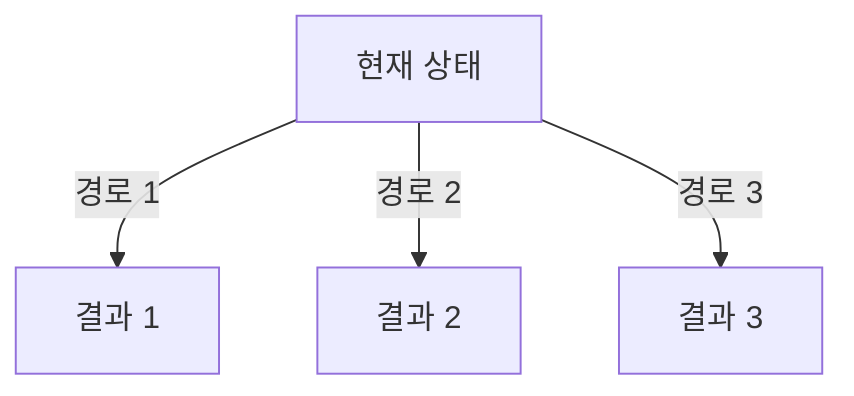

### 다중 경로의 역사와 관찰자의 인식

다중 경로 이론은 관찰자가 사건을 인식하는 방식에 큰 영향을 미친다. 관찰자는 특정 사건을 관찰할 때, 그 사건이 발생할 수 있는 여러 경로를 고려하게 된다. 이러한 경로는 관찰자의 선택과 인식에 따라 달라질 수 있으며, 이는 시간의 본질에 대한 새로운 통찰을 제공한다. 예를 들어, 양자역학에서의 '관찰자 효과'는 관찰자가 어떤 경로를 선택하느냐에 따라 결과가 달라질 수 있음을 보여준다.

**샘플 코드: 다중 경로 시뮬레이션**

```python
import random

def multiple_paths_simulation():
    paths = ["경로 1", "경로 2", "경로 3"]
    chosen_path = random.choice(paths)
    print(f"선택된 경로: {chosen_path}")

multiple_paths_simulation()
```

이와 같이 다중 시간의 흐름은 단일 스레드의 시간 경험을 넘어, 분기적 공간과 양자역학의 관계를 통해 시간의 복잡성을 이해하는 데 중요한 역할을 한다. 관찰자의 인식 또한 이러한 다중 경로를 통해 시간의 본질을 탐구하는 데 기여한다.

<!--
## 루리어드(Ruliad) 내의 시간
   - 5.1. 루리어드의 개념과 구조
   - 5.2. 계산적 규칙의 다양성과 시간의 정의
   - 5.3. 루리어드와 물리 법칙의 유도
-->

## 루리어드(Ruliad) 내의 시간

루리어드는 계산적 관점에서 시간과 공간을 이해하는 새로운 틀을 제공하는 개념이다. 이 개념은 복잡한 시스템의 동작을 설명하기 위해 다양한 계산적 규칙이 어떻게 상호작용하는지를 탐구한다. 루리어드 내에서 시간은 단순한 선형적 흐름이 아니라, 다양한 계산적 규칙의 상호작용을 통해 형성되는 복잡한 구조로 이해된다.

**루리어드의 개념과 구조**

루리어드는 모든 가능한 계산적 규칙과 그 결과로 생성되는 상태의 집합으로 구성된다. 이 구조는 무한한 가능성을 내포하고 있으며, 각 규칙은 특정한 시간적 흐름을 생성할 수 있다. 루리어드 내에서 시간은 이러한 규칙들이 어떻게 상호작용하는지에 따라 다르게 경험될 수 있다. 예를 들어, 특정한 규칙이 적용될 때는 시간의 흐름이 느리게 느껴질 수 있으며, 다른 규칙이 적용될 때는 빠르게 진행될 수 있다.

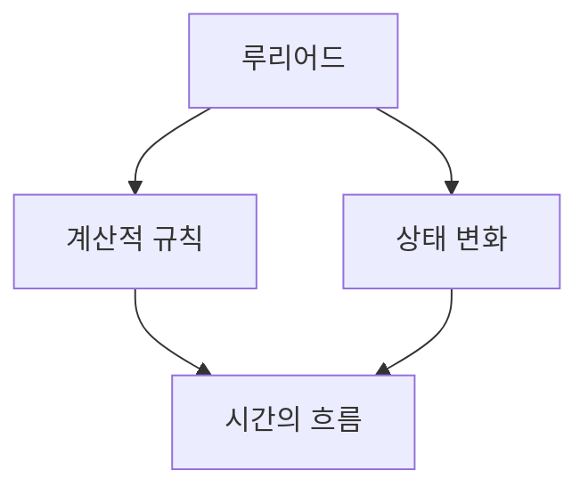

**계산적 규칙의 다양성과 시간의 정의**

루리어드 내에서 시간의 정의는 계산적 규칙의 다양성에 의해 결정된다. 각 규칙은 시간의 진행 방식에 영향을 미치며, 이는 물리적 현상과도 연결된다. 예를 들어, 열역학적 규칙은 에너지의 흐름과 관련된 시간의 방향성을 정의하는 반면, 양자역학적 규칙은 불확정성과 관련된 시간의 개념을 제시한다. 이러한 다양한 규칙들은 루리어드 내에서 서로 상호작용하며, 시간의 본질을 더욱 복잡하게 만든다.

**루리어드와 물리 법칙의 유도**

루리어드는 물리 법칙을 유도하는 데 중요한 역할을 한다. 계산적 규칙들이 상호작용하면서 생성되는 다양한 상태들은 물리적 현상으로 나타날 수 있다. 예를 들어, 상대성 이론의 시간 지연 현상은 루리어드 내에서 특정한 계산적 규칙이 적용될 때 발생할 수 있는 결과로 이해될 수 있다. 이러한 관점은 물리학의 여러 이론을 통합하는 데 기여할 수 있으며, 시간의 본질에 대한 새로운 통찰을 제공한다.

루리어드 내의 시간 개념은 단순한 선형적 흐름을 넘어, 복잡한 계산적 상호작용을 통해 형성되는 다차원적 구조로 이해되어야 한다. 이는 시간에 대한 기존의 관념을 재고하게 만들며, 새로운 연구 방향을 제시하는 기초가 된다.

<!--
## 시간의 본질
   - 6.1. 시간의 정의: 계산적 규칙의 적용
   - 6.2. 계산적 불가역성과 시간의 선형적 진행
   - 6.3. 시간의 방향성과 열의 개념의 유사성
-->

## 시간의 본질

### 시간의 정의: 계산적 규칙의 적용

시간은 우리가 경험하는 세계에서 중요한 개념이다. 계산적 관점에서 시간은 특정한 계산적 규칙에 의해 정의될 수 있다. 이러한 규칙은 상태의 변화와 관련이 있으며, 시스템의 동작을 설명하는 데 필수적이다. 예를 들어, 물리적 시스템에서의 시간은 상태의 변화를 추적하는 데 사용되는 변수로 작용한다. 

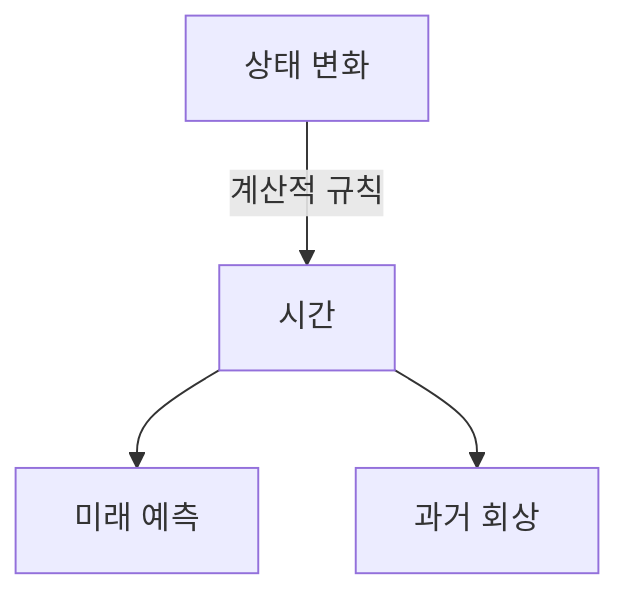

위의 다이어그램은 상태 변화가 시간과 어떻게 연결되는지를 보여준다. 시간은 상태 변화의 연속성을 나타내며, 이를 통해 우리는 과거를 회상하고 미래를 예측할 수 있다.

### 계산적 불가역성과 시간의 선형적 진행

계산적 불가역성은 시간의 본질을 이해하는 데 중요한 요소이다. 많은 물리적 과정은 불가역적이며, 이는 시간의 선형적 진행을 나타낸다. 예를 들어, 열역학 제2법칙에 따르면 고립계의 엔트로피는 항상 증가하는 경향이 있다. 이는 시간의 한 방향성을 나타내며, 과거에서 미래로의 진행을 의미한다.

이러한 불가역성은 계산적 규칙에 의해 설명될 수 있으며, 시스템의 초기 상태와 최종 상태 간의 관계를 정의한다. 따라서 시간은 단순한 연속적인 흐름이 아니라, 특정한 규칙에 따라 변화하는 복잡한 구조로 이해될 수 있다.

### 시간의 방향성과 열의 개념의 유사성

시간의 방향성과 열의 개념은 서로 밀접한 관계가 있다. 열역학에서 열은 고온에서 저온으로 흐르는 경향이 있으며, 이는 시간의 방향성과 유사한 성질을 가진다. 즉, 열의 흐름은 시간의 진행 방향을 나타내는 하나의 지표가 될 수 있다.

이러한 유사성은 시간의 본질을 이해하는 데 도움을 주며, 열역학적 과정이 시간의 흐름과 어떻게 연결되는지를 보여준다. 시간의 방향성은 열의 흐름과 함께 자연계에서의 변화의 방향을 결정짓는 중요한 요소로 작용한다. 

결론적으로, 시간의 본질은 계산적 규칙, 불가역성, 그리고 열의 개념과 깊은 연관이 있으며, 이러한 요소들은 시간에 대한 우리의 이해를 더욱 풍부하게 만든다.

<!--
## 고전적 시간 문제
   - 7.1. 시간의 가역성 문제
   - 7.2. 시간 여행의 개념과 가능성
   - 7.3. 상대성 이론과 시간 지연 현상
-->

## 고전적 시간 문제

시간은 물리학과 철학에서 오랫동안 논의되어 온 주제이다. 특히 고전적 시간 문제는 시간의 본질과 그 흐름에 대한 여러 가지 질문을 제기한다. 이 섹션에서는 시간의 가역성 문제, 시간 여행의 개념과 가능성, 그리고 상대성 이론과 시간 지연 현상에 대해 살펴보겠다.

### 시간의 가역성 문제

시간의 가역성 문제는 물리학에서 중요한 주제 중 하나이다. 고전역학에서는 물체의 운동이 시간에 대해 대칭적이라는 가정이 있다. 즉, 물체의 운동을 시간의 반대 방향으로 되돌려도 물리 법칙은 동일하게 적용된다. 그러나 열역학 제2법칙에 따르면, 엔트로피는 항상 증가하는 경향이 있어 시간의 비가역성을 나타낸다. 이는 자연계에서 발생하는 많은 현상이 시간의 한 방향으로만 진행됨을 의미한다.

**예시 코드: 시간의 가역성 시뮬레이션**

```python
import numpy as np
import matplotlib.pyplot as plt

# 시간의 흐름을 시뮬레이션하는 함수
def simulate_time_reversal():
    time = np.linspace(0, 10, 100)
    position_forward = np.sin(time)  # 시간의 진행 방향
    position_backward = np.sin(time[::-1])  # 시간의 반대 방향

    plt.plot(time, position_forward, label='Forward Time')
    plt.plot(time[::-1], position_backward, label='Backward Time', linestyle='--')
    plt.title('Time Reversal Simulation')
    plt.xlabel('Time')
    plt.ylabel('Position')
    plt.legend()
    plt.show()

simulate_time_reversal()
```

### 시간 여행의 개념과 가능성

시간 여행은 과학 소설에서 자주 다루어지는 주제이지만, 물리학적으로도 흥미로운 문제이다. 아인슈타인의 일반 상대성 이론에 따르면, 중력장이 강한 곳에서는 시간이 느리게 흐르는 현상이 발생한다. 이론적으로, 웜홀(Wormhole)과 같은 구조를 통해 시간 여행이 가능할 수 있다는 주장이 있다. 그러나 현재의 과학적 이해로는 시간 여행이 실제로 가능하다는 증거는 없다.

**다이어그램: 웜홀의 개념**

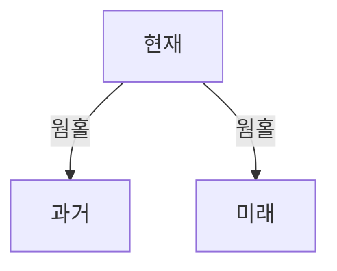

### 상대성 이론과 시간 지연 현상

상대성 이론에 따르면, 빠르게 움직이는 물체는 느리게 흐르는 시간을 경험한다. 이는 '시간 지연(Time Dilation)' 현상으로 알려져 있으며, GPS 위성 시스템과 같은 현대 기술에서도 중요한 역할을 한다. 예를 들어, 지구의 중력장과 위성의 속도 차이로 인해 위성의 시계는 지구의 시계보다 더 빠르게 흐른다. 이러한 현상은 실험적으로도 확인되었으며, 상대성 이론의 중요한 예시로 자리 잡고 있다.

**예시 코드: 시간 지연 계산**

```python
def time_dilation(v, c=3e8):
    return 1 / np.sqrt(1 - (v**2 / c**2))

# 속도 v에 따른 시간 지연 비율 계산
velocities = np.linspace(0, 2.5e8, 100)  # 0에서 2.5e8 m/s까지
dilations = time_dilation(velocities)

plt.plot(velocities, dilations)
plt.title('Time Dilation vs Velocity')
plt.xlabel('Velocity (m/s)')
plt.ylabel('Time Dilation Factor')
plt.grid()
plt.show()
```

이와 같이 고전적 시간 문제는 시간의 본질과 그 흐름에 대한 깊은 통찰을 제공하며, 현대 물리학의 여러 이론과 연결되어 있다. 시간의 가역성, 시간 여행의 가능성, 그리고 상대성 이론의 시간 지연 현상은 모두 시간에 대한 우리의 이해를 확장하는 데 기여하고 있다.

<!--
## 결론
   - 8.1. 시간의 계산적 관점 요약
   - 8.2. 시간의 본질에 대한 새로운 통찰
   - 8.3. 미래 연구 방향과 가능성
-->

## 결론

### 시간의 계산적 관점 요약

시간은 단순히 흐르는 것이 아니라, 계산적 규칙과 상태 변화의 연속적인 과정으로 이해될 수 있다. 전통적인 과학적 접근이 시간의 본질을 설명하는 데 한계를 보였던 반면, 계산적 관점은 시간의 흐름을 보다 명확하게 설명할 수 있는 틀을 제공한다. 이 관점에서는 시간의 진행이 계산적 불가역성과 밀접하게 연결되어 있으며, 이는 미래 예측의 한계를 드러낸다. 

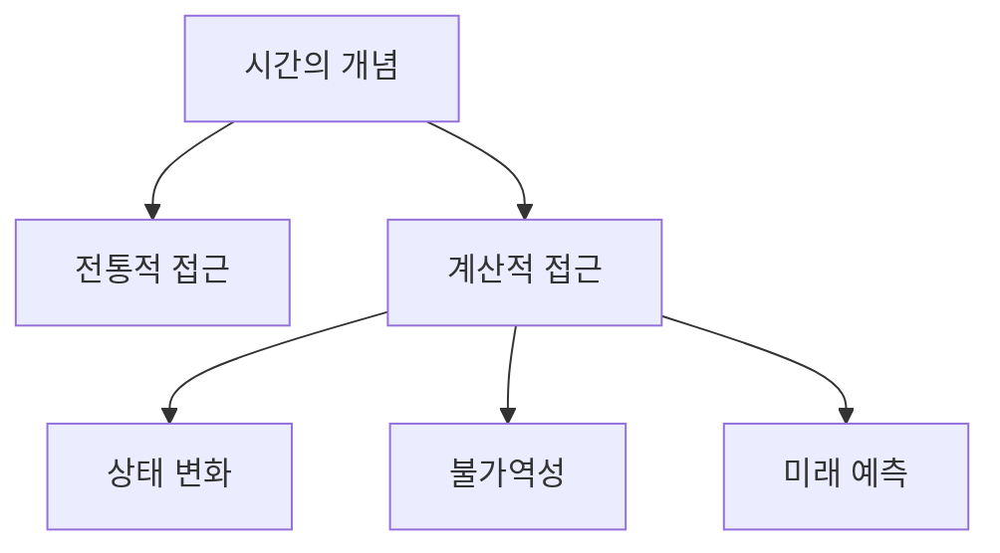

### 시간의 본질에 대한 새로운 통찰

시간의 본질은 단순히 물리적 현상에 국한되지 않고, 관찰자의 경험과 상호작용에 의해 형성된다. 관찰자는 시간의 흐름을 인식하고 해석하는 주체로서, 이 과정에서 열역학 제2법칙과 같은 물리적 법칙이 시간의 방향성을 결정짓는 중요한 요소로 작용한다. 이러한 새로운 통찰은 시간의 개념을 보다 복합적이고 다차원적으로 이해할 수 있는 기회를 제공한다.

### 미래 연구 방향과 가능성

미래의 연구는 시간의 계산적 관점과 관련된 다양한 분야에서 진행될 수 있다. 예를 들어, 양자역학과 열역학의 교차점에서 시간의 본질을 탐구하거나, 루리어드와 같은 새로운 개념을 통해 시간의 흐름을 재정의하는 연구가 필요하다. 또한, 시간 여행과 같은 고전적 시간 문제에 대한 새로운 접근법을 모색하는 것도 흥미로운 연구 방향이 될 것이다. 이러한 연구들은 시간에 대한 우리의 이해를 더욱 깊이 있게 만들어 줄 가능성이 크다.

<!--
## FAQ
   - 9.1. 시간은 왜 한 방향으로만 흐르나요?
   - 9.2. 계산적 불가역성이란 무엇인가요?
   - 9.3. 루리어드와 우리의 현실은 어떻게 연결되나요?
-->

## FAQ

### 시간은 왜 한 방향으로만 흐르나요?

시간이 한 방향으로만 흐르는 이유는 열역학 제2법칙과 관련이 깊다. 이 법칙은 고립계에서 엔트로피가 항상 증가하는 경향이 있음을 나타낸다. 엔트로피는 시스템의 무질서도를 나타내며, 시간이 흐를수록 시스템은 더 무질서해진다. 따라서, 우리는 과거의 상태에서 현재의 상태로 나아갈 때 엔트로피가 증가하는 방향으로만 시간의 흐름을 경험하게 된다.

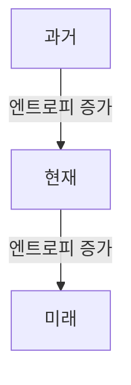

이러한 관점에서 시간의 방향성은 물리적 법칙에 의해 결정되며, 이는 우리가 시간의 흐름을 인식하는 방식에 큰 영향을 미친다.

### 계산적 불가역성이란 무엇인가요?

계산적 불가역성은 특정 계산 과정이 한 방향으로만 진행될 수 있음을 의미한다. 이는 주로 복잡한 시스템에서 발생하며, 시스템의 상태가 변화할 때 이전 상태로 되돌아가는 것이 불가능한 경우를 설명한다. 예를 들어, 물리적 시스템에서의 상태 변화는 종종 비가역적이며, 이는 시스템의 정보가 소실되거나 복잡성이 증가하는 경우에 해당한다.

**계산적 불가역성의 예시:**

1. **물체의 파괴:** 물체가 부서지면 원래 상태로 복원할 수 없다.
2. **열의 흐름:** 열은 고온에서 저온으로 흐르며, 저온에서 고온으로 자연스럽게 흐르지 않는다.

이러한 개념은 계산 이론에서도 중요한 역할을 하며, 알고리즘의 효율성과 복잡성을 이해하는 데 도움을 준다.

### 루리어드와 우리의 현실은 어떻게 연결되나요?

루리어드는 모든 가능한 계산과 그 결과를 포함하는 개념으로, 우리의 현실을 설명하는 데 중요한 역할을 한다. 루리어드 내에서 시간은 다양한 계산적 규칙에 의해 정의되며, 이는 우리가 경험하는 현실의 복잡성을 반영한다. 

루리어드의 개념은 다음과 같은 방식으로 우리의 현실과 연결된다:

- **계산적 규칙:** 우리의 현실은 특정 계산적 규칙에 의해 형성되며, 이는 물리 법칙과 일치한다.
- **상태의 변화:** 루리어드 내에서의 상태 변화는 우리의 경험과 유사하며, 이는 시간의 흐름을 이해하는 데 도움을 준다.

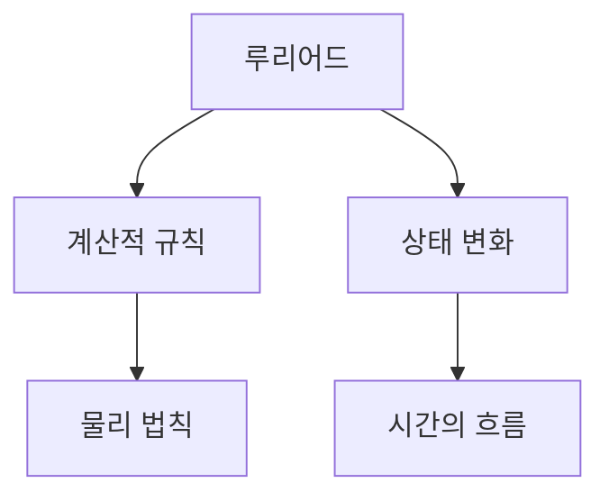

이러한 연결은 우리가 시간과 현실을 이해하는 데 있어 새로운 통찰을 제공하며, 미래의 연구 방향에 대한 가능성을 열어준다.

<!--
## 관련 기술
   - 10.1. 계산 이론과 물리학
   - 10.2. 양자역학과 관찰자의 역할
   - 10.3. 열역학과 시간의 관계
-->

## 관련 기술

### 계산 이론과 물리학

계산 이론은 컴퓨터 과학의 기초를 이루는 분야로, 알고리즘과 계산 가능성에 대한 연구를 포함한다. 물리학과의 관계에서, 계산 이론은 물리적 시스템의 동작을 모델링하고 예측하는 데 중요한 역할을 한다. 예를 들어, Turing machine과 같은 계산 모델은 물리적 시스템의 복잡성을 이해하는 데 도움을 줄 수 있다. 

**샘플 코드: Turing Machine의 간단한 구현**

```python
class TuringMachine:
    def __init__(self, tape, state):
        self.tape = tape
        self.state = state
        self.head = 0

    def step(self):
        # 현재 상태에 따라 동작 수행
        if self.state == 'q0':
            if self.tape[self.head] == 0:
                self.tape[self.head] = 1
                self.head += 1
                self.state = 'q1'
            else:
                self.head += 1

    def run(self):
        while self.head < len(self.tape):
            self.step()

# 사용 예
tape = [0, 0, 0, 0]
tm = TuringMachine(tape, 'q0')
tm.run()
print(tm.tape)  # [1, 0, 0, 0]
```

### 양자역학과 관찰자의 역할

양자역학은 미시 세계의 물리적 현상을 설명하는 이론으로, 관찰자의 역할이 매우 중요하다. 관찰자가 시스템에 미치는 영향을 통해 상태가 결정되며, 이는 '관찰자 효과'로 알려져 있다. 이러한 개념은 시간의 흐름과도 밀접한 관련이 있으며, 관찰자가 시간의 진행을 어떻게 인식하는지에 대한 연구가 필요하다.

**다이어그램: 양자역학에서의 관찰자 효과**

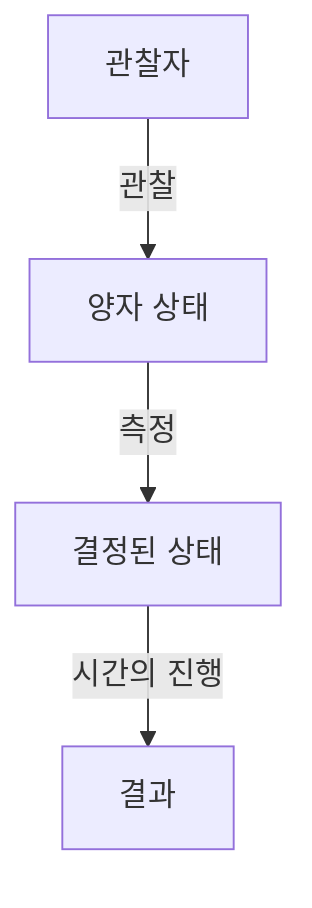

### 열역학과 시간의 관계

열역학은 에너지와 물질의 상호작용을 다루는 물리학의 한 분야로, 시간의 방향성과 밀접한 관계가 있다. 열역학 제2법칙은 엔트로피의 증가를 통해 시간의 비가역성을 설명하며, 이는 시간의 흐름을 이해하는 데 중요한 요소이다. 이러한 원리는 계산적 관점에서도 적용될 수 있으며, 시스템의 상태 변화와 시간의 관계를 탐구하는 데 기여한다.

**샘플 코드: 엔트로피 계산**

```python
import numpy as np

def calculate_entropy(probabilities):
    return -np.sum(probabilities * np.log(probabilities))

# 사용 예
probabilities = np.array([0.5, 0.5])  # 두 가지 상태의 확률
entropy = calculate_entropy(probabilities)
print(f"엔트로피: {entropy}")  # 엔트로피: 0.6931471805599453
```

이와 같이, 계산 이론, 양자역학, 열역학은 시간의 개념을 이해하는 데 중요한 역할을 하며, 각 분야의 원리를 통해 시간의 본질을 탐구할 수 있다.

<!--
##### Reference #####
-->

## Reference


* [https://writings.stephenwolfram.com/2024/10/on-the-nature-of-time/](https://writings.stephenwolfram.com/2024/10/on-the-nature-of-time/)

