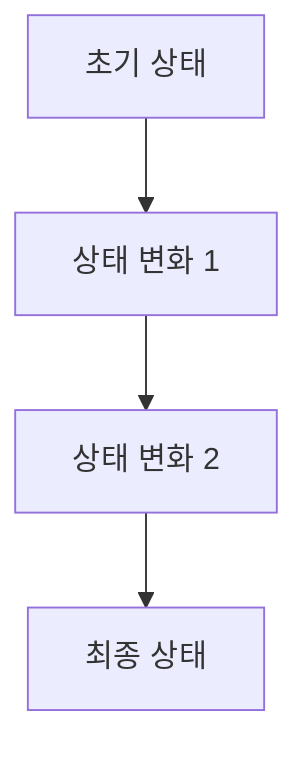
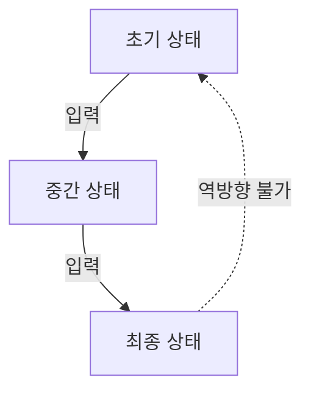
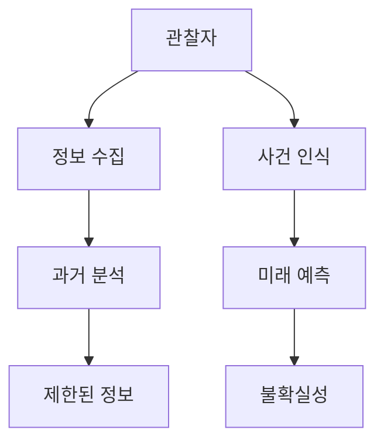
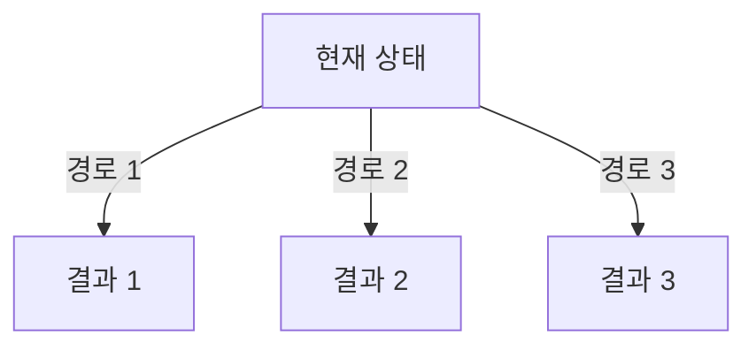
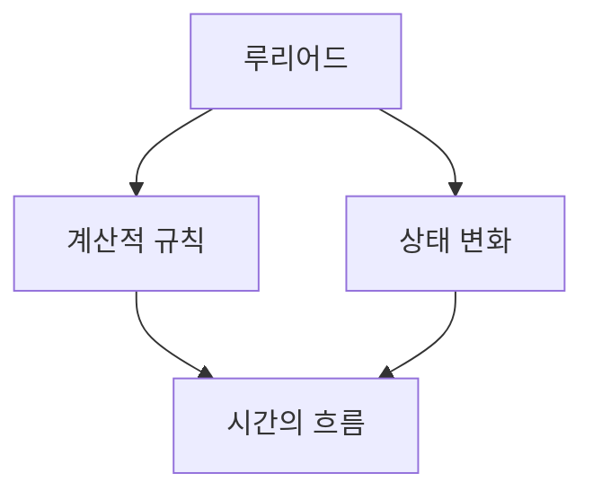
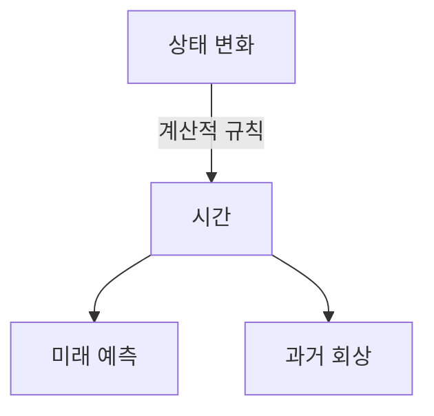
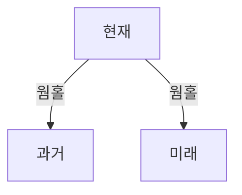
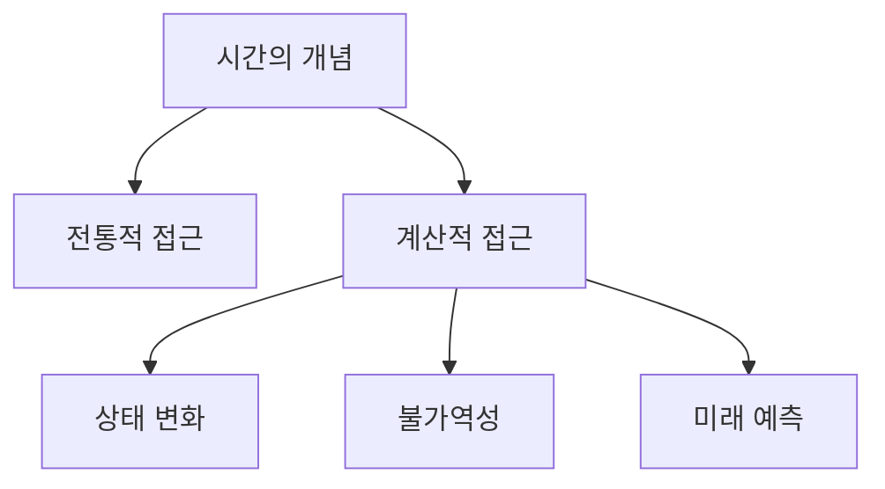
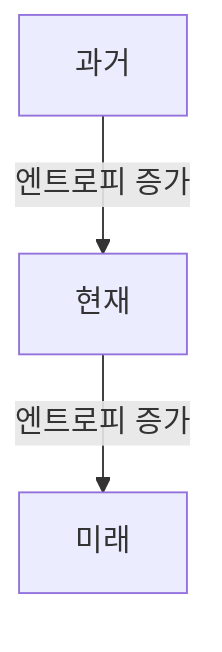
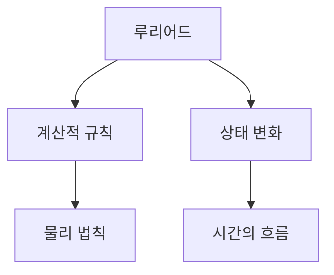

시간은 인간 경험의 중심적인 특징이다. 그러나 시간은 실제로 무엇인가? 전통적인 과학적 설명에서는 시간을 공간과 유사한 좌표로 표현하는 경우가 많다. 그러나 이러한 수학적 설명은 시간의 본질에 대해 아무것도 말해주지 않는다. **계산적 관점**에서 생각하기 시작하면, 세계의 연속적인 상태를 이전 상태에서 계산된 결과로 생각하는 것이 자연스럽다. 이는 우주가 진행하는 계산의 "진행"과 시간의 진행을 동일시할 수 있음을 시사한다. 이 글은 스티븐 울프램(Stephen Wolfram)의 에세이 「On the Nature of Time」를 바탕으로, 시간의 계산적 관점, 관찰자의 역할, 다중 시간의 흐름, 루리어드(Ruliad) 내의 시간, 고전적 시간 문제를 정리하고 참고문헌을 제시한다.

## 개요

시간은 인간의 삶과 우주에서 중요한 역할을 하는 개념이다. 우리는 시간의 흐름 속에서 사건을 경험하고, 과거를 회상하며, 미래를 계획한다. 이러한 시간의 개념은 물리학, 철학, 심리학 등 다양한 분야에서 다루어지며, 각 분야마다 시간에 대한 이해가 다를 수 있다.

### 시간의 개념과 중요성

시간은 단순히 사건이 발생하는 순서를 나타내는 것이 아니라, 사건 간의 관계를 이해하는 데 필수적인 요소이다. 물리학에서는 시간의 흐름이 물체의 운동과 밀접하게 연결되어 있으며, 뉴턴의 운동 법칙이나 아인슈타인의 상대성 이론에서도 중요한 역할을 한다. 시간은 또한 생물학적 리듬, 사회적 상호작용, 개인의 경험에까지 영향을 미친다.

### 전통적인 과학적 접근과 그 한계

전통적인 과학적 접근에서는 시간을 절대적이고 선형적인 개념으로 여겼다. 뉴턴의 고전역학에서는 시간이 균일하게 흐르며, 모든 사건은 이 시간의 흐름에 따라 발생한다고 가정하였다. 그러나 이러한 접근은 시간의 상대성이나 양자역학적 현상과 같은 복잡한 현상을 설명하는 데 한계를 보인다. 상대성 이론에서는 시간의 흐름이 관찰자의 속도에 따라 달라질 수 있음을 보여준다. 이러한 한계는 시간에 대한 새로운 이해가 필요함을 시사한다.

### 계산적 관점에서의 시간 이해

계산적 관점에서 시간은 단순한 흐름이 아니라, **상태의 변화**와 **규칙**에 따라 정의될 수 있다. 이 관점에서는 시간이 사건의 발생과 그에 따른 상태의 변화를 추적하는 수단으로 이해된다. 컴퓨터 과학에서는 알고리즘의 실행 시간이나 데이터 처리의 순서를 고려할 때 시간의 개념이 중요하게 작용한다.

다음은 계산적 관점에서 시간의 흐름을 나타내는 간단한 다이어그램이다.


```mermaid
graph TD
    InitialState["초기 상태"]
    StateChange1["상태 변화 1"]
    StateChange2["상태 변화 2"]
    FinalState["최종 상태"]
    InitialState --> StateChange1
    StateChange1 --> StateChange2
    StateChange2 --> FinalState
```

이 다이어그램은 초기 상태에서 시작하여 여러 상태 변화를 거쳐 최종 상태에 도달하는 과정을 보여준다. 이러한 계산적 관점은 시간의 본질을 이해하는 데 중요한 기초가 된다.

결론적으로, 시간은 단순한 개념이 아니라 다양한 관점에서 탐구할 수 있는 복잡한 주제이다. 전통적인 과학적 접근의 한계를 인식하고, 계산적 관점에서의 이해를 통해 시간의 본질을 더욱 깊이 있게 탐구할 필요가 있다.

## 계산적 시간의 관점

시간은 우리가 경험하는 세계에서 중요한 요소이며, 이를 계산적 관점에서 이해하는 것은 여러 가지 흥미로운 통찰을 제공한다. 이 섹션에서는 계산적 규칙과 상태의 변화, 계산적 불가역성, 그리고 시간의 강건성에 대해 논의한다.

### 계산적 규칙과 상태의 변화

계산적 규칙은 시스템의 상태가 어떻게 변화하는지를 정의하는 규칙이다. 이러한 규칙은 주어진 입력에 대해 특정한 출력을 생성하며, 시간의 흐름에 따라 상태가 어떻게 변화하는지를 설명하는 데 중요한 역할을 한다. 예를 들어, 간단한 상태 변화는 다음과 같이 모델링할 수 있다.

```python
# 42jerrykim.github.io에서 더 많은 정보를 확인할 수 있다
class System:
    def __init__(self, state):
        self.state = state

    def update(self, input_val):
        self.state += input_val

system = System(0)
system.update(1)
print(system.state)  # 1
```

위 코드에서 `System` 클래스는 상태를 가지고 있으며, `update` 메소드를 통해 입력에 따라 상태를 변화시킨다. 이러한 계산적 규칙은 시간의 흐름에 따라 시스템이 어떻게 진화하는지를 보여준다.

### 계산적 불가역성과 시간의 진행

계산적 불가역성은 시스템의 상태 변화가 한 방향으로만 진행된다는 개념이다. 이는 열역학 제2법칙과 유사하게, 고립계에서 엔트로피가 증가하는 경향을 나타낸다. 다음 다이어그램은 이를 시각적으로 표현한다.


```mermaid
graph TD
    InitialState["초기 상태"]
    MidState["중간 상태"]
    FinalState["최종 상태"]
    InitialState -->|"입력"| MidState
    MidState -->|"입력"| FinalState
    FinalState -.->|"역방향 불가"| InitialState
```

초기 상태에서 최종 상태로의 진행은 가능하지만, 최종 상태에서 초기 상태로의 역행은 불가능하다. 이는 계산적 불가역성이 시간의 진행과 어떻게 연결되는지를 보여준다.

### 시간의 강건성: 미래 예측의 한계

시간의 강건성은 미래를 예측하는 데 존재하는 한계를 의미한다. 계산적 시스템은 초기 조건에 따라 다양한 결과를 생성할 수 있으며, 이는 예측의 어려움을 초래한다. 계산적 불가역성(computational irreducibility)이 있으면, t 단계 후의 상태를 알기 위해 본질적으로 t 단계를 모두 추적해야 한다. 즉, "시간을 뛰어넘어" 미래를 아는 방법이 없고, 미래를 알기 위해서는 축소할 수 없는 계산 단계를 거쳐야 한다.

```python
# 42jerrykim.github.io에서 더 많은 정보를 확인할 수 있다
import random

class PredictiveSystem:
    def __init__(self, initial_state):
        self.state = initial_state

    def predict_future(self):
        return self.state + random.choice([-1, 0, 1])

predictive_system = PredictiveSystem(5)
future_state = predictive_system.predict_future()
print(f"예측된 미래 상태: {future_state}")
```

계산적 시스템의 복잡성과 초기 조건의 민감성은 미래 예측의 한계를 나타내며, 이는 시간의 강건성과 밀접한 관련이 있다.

## 관찰자의 역할

관찰자는 시간의 개념을 이해하는 데 있어 중요한 역할을 한다. 관찰자의 인식과 경험은 시간의 흐름을 어떻게 이해하고 해석하는지에 큰 영향을 미친다.

### 관찰자의 계산적 한계

관찰자는 자신의 인식과 경험을 바탕으로 세상을 이해하지만, 이러한 이해는 **계산적 한계**에 의해 제약을 받는다. 관찰자는 특정 사건을 관찰할 때 그 사건의 모든 변수를 동시에 고려할 수 없다. 따라서 시간의 흐름을 이해하는 데 제한적인 정보만 활용하게 된다. 울프램에 따르면, 우리가 "미래가 점진적으로 펼쳐진다"고 경험하는 근본 이유는, 우리가 계산적으로 제한된 존재이기 때문이다. 계산적으로 불가역적인 시스템의 미래를 알려면 축소할 수 없는 계산 작업이 필요하지만, 우리는 그 작업을 수행할 수 없고, 시스템과 함께 계산을 수행하며 미래가 펼쳐지는 것을 경험한다.


```mermaid
graph TD
    Observer["관찰자"]
    InfoGather["정보 수집"]
    EventRecognize["사건 인식"]
    PastAnalyze["과거 분석"]
    FuturePredict["미래 예측"]
    LimitedInfo["제한된 정보"]
    Uncertainty["불확실성"]
    Observer --> InfoGather
    Observer --> EventRecognize
    InfoGather --> PastAnalyze
    EventRecognize --> FuturePredict
    PastAnalyze --> LimitedInfo
    FuturePredict --> Uncertainty
```

### 시간의 경험과 관찰자의 상호작용

시간은 단순히 물리적 현상이 아니라, 관찰자의 경험과 밀접하게 연결되어 있다. 관찰자는 자신의 경험을 통해 시간의 흐름을 느끼고, 이를 바탕으로 사건의 순서를 이해한다. 특정 사건의 지속 시간이나 빈도는 관찰자의 주관적인 경험에 따라 다르게 인식될 수 있으며, 이는 시간의 상대성 개념과도 연결된다.

### 열역학 제2법칙과 시간의 방향성

열역학 제2법칙은 고립계에서 엔트로피가 증가하는 방향으로 진행된다는 원리를 제시한다. 이 법칙은 시간의 방향성을 이해하는 데 중요한 역할을 한다. 울프램은 이 법칙이 역시 **계산적 불가역성**과 **관찰자의 계산적 한계**의 상호작용으로 설명될 수 있다고 본다. 미시적으로는 물리 법칙이 가역적일 수 있지만, 계산적 불가역성이 더 강한 힘으로 작용하여, 계산적으로 제한된 관찰자는 질서에서 무질서로의 흐름만 인식하게 된다. 관찰자는 이러한 열역학적 원리를 통해 시간의 방향성을 인식하며, 얼음이 녹아 물이 되는 과정 같은 예를 통해 시간의 비가역성을 이해한다.

## 다중 시간의 흐름

### 단일 스레드로서의 시간 경험

시간은 일반적으로 **단일 스레드**로 경험되며, 우리는 과거에서 현재로, 그리고 미래로 나아가는 방식으로 인식한다. 이러한 경험은 우리의 인지적 한계와 관련이 있으며, 시간의 흐름을 선형적으로 인식하게 만든다. 그러나 울프램의 Physics Project에 따르면, 근본 수준에서는 시간이 사실상 **다중 스레드**이며, 우주가 따르는 "역사의 경로"가 여러 개 존재한다. 우리가 시간을 단일 스레드로 경험하는 것은 **관찰자로서의 우리가 사건을 샘플링하는 방식** 때문이다.

### 분기적 공간과 양자역학의 관계

양자역학에서는 입자의 상태가 여러 가능성을 동시에 가질 수 있는 '중첩' 상태를 설명한다. 이러한 중첩 상태는 **분기적 공간(branchial space)**의 개념과 연결된다. 특정 사건이 발생할 때, 그 사건은 여러 경로로 나뉘어질 수 있으며, 각 경로는 서로 다른 결과를 초래할 수 있다. 역사의 여러 경로가 존재하는 것이 양자역학을 이끌며, 관찰자가 궁극적으로 **한 개의 경로만** 인식하는 것은 양자역학에서의 "측정" 현상과 연결된다.


```mermaid
graph TD
    CurrentState["현재 상태"]
    Result1["결과 1"]
    Result2["결과 2"]
    Result3["결과 3"]
    CurrentState -->|"경로 1"| Result1
    CurrentState -->|"경로 2"| Result2
    CurrentState -->|"경로 3"| Result3
```

### 다중 경로의 역사와 관찰자의 인식

다중 경로 이론은 관찰자가 사건을 인식하는 방식에 큰 영향을 미친다. 관찰자는 특정 사건을 관찰할 때, 그 사건이 발생할 수 있는 여러 경로를 고려하게 된다. 우리와 같은 관찰자는 **branchial space**에서 하나의 작은 영역에 모여 있고, 그 영역이 전체 branchial space에 비해 작기 때문에 우리 모두가 일관된 하나의 역사와 공통의 객관적 현실을 인식한다고 볼 수 있다.

## 루리어드(Ruliad) 내의 시간

**루리어드**는 모든 가능한 계산 규칙을 따를 때 얻어지는, 계산적 관점에서의 구조이다. "왜 그 규칙이지 다른 규칙이 아닌가?"라는 질문은 루리어드를 도입하면 완화된다. 루리어드에는 그런 임의의 선택이 없으며, **모든 가능한 계산 규칙**을 따르면 얻어지는 단일한 대상이다.

### 루리어드의 개념과 구조

루리어드는 모든 가능한 계산적 규칙과 그 결과로 생성되는 상태의 집합으로 구성된다. 이 구조는 무한한 가능성을 내포하고 있으며, 각 규칙은 특정한 시간적 흐름을 생성할 수 있다. 루리어드 내에서 시간은 이러한 규칙들이 어떻게 상호작용하는지에 따라 다르게 경험될 수 있다.


```mermaid
graph TD
    Ruliad["루리어드"]
    CompRule["계산적 규칙"]
    StateChange["상태 변화"]
    TimeFlow["시간의 흐름"]
    Ruliad --> CompRule
    Ruliad --> StateChange
    CompRule --> TimeFlow
    StateChange --> TimeFlow
```

### 계산적 규칙의 다양성과 시간의 정의

루리어드 내에서 시간의 정의는 계산적 규칙의 다양성에 의해 결정된다. 각 규칙은 시간의 진행 방식에 영향을 미치며, 이는 물리적 현상과도 연결된다. 열역학적 규칙은 에너지의 흐름과 관련된 시간의 방향성을 정의하는 반면, 양자역학적 규칙은 불확정성과 관련된 시간의 개념을 제시한다.

### 루리어드와 관찰자: 왜 우리에게 "시간"이 있는가

루리어드는 어떤 추상적 의미에서는 "이미 완전히 거기 있다"고 볼 수 있어, 밖에서 본다면 **시간 없는** 단일 대상으로 보일 수 있다. 그러나 우리는 루리어드 **밖**에서 보는 것이 아니라 그 **안**에 내재해 있으며, **계산적으로 제한된** 렌즈를 통해 보기 때문에, 우리에게는 필연적으로 **시간** 개념이 생긴다. 우리는 루리어드를 "한 번에 한 계산적으로 제한된 단계씩"만 발견할 수 있기 때문에, 그 진행이 곧 우리의 시간 개념이 된다.

## 시간의 본질

### 시간의 정의: 계산적 규칙의 적용

시간은 우리가 경험하는 세계에서 중요한 개념이다. 계산적 관점에서 시간은 특정한 계산적 규칙에 의해 정의될 수 있다. 이러한 규칙은 상태의 변화와 관련이 있으며, 시스템의 동작을 설명하는 데 필수적이다. 물리적 시스템에서의 시간은 상태의 변화를 추적하는 데 사용되는 변수로 작용한다.


```mermaid
graph TD
    StateChange["상태 변화"]
    Time["시간"]
    FuturePredict["미래 예측"]
    PastRecall["과거 회상"]
    StateChange -->|"계산적 규칙"| Time
    Time --> FuturePredict
    Time --> PastRecall
```

시간은 상태 변화의 연속성을 나타내며, 이를 통해 우리는 과거를 회상하고 미래를 예측할 수 있다.

### 계산적 불가역성과 시간의 선형적 진행

계산적 불가역성은 시간의 본질을 이해하는 데 중요한 요소이다. 많은 물리적 과정은 불가역적이며, 이는 시간의 선형적 진행을 나타낸다. 열역학 제2법칙에 따르면 고립계의 엔트로피는 항상 증가하는 경향이 있다. 이는 시간의 한 방향성을 나타내며, 과거에서 미래로의 진행을 의미한다.

### 시간의 방향성과 열의 개념의 유사성

시간의 방향성과 열의 개념은 서로 밀접한 관계가 있다. 열역학에서 열은 고온에서 저온으로 흐르는 경향이 있으며, 이는 시간의 방향성과 유사한 성질을 가진다. 열의 흐름은 시간의 진행 방향을 나타내는 하나의 지표가 될 수 있다.

## 고전적 시간 문제

시간은 물리학과 철학에서 오랫동안 논의되어 온 주제이다. 이 섹션에서는 시간의 가역성 문제, 시간 여행의 개념과 가능성, 상대성 이론과 시간 지연 현상을 다룬다.

### 시간의 가역성 문제

고전역학에서는 물체의 운동이 시간에 대해 대칭적이라는 가정이 있다. 즉, 물체의 운동을 시간의 반대 방향으로 되돌려도 물리 법칙은 동일하게 적용된다. 그러나 열역학 제2법칙에 따르면, 엔트로피는 항상 증가하는 경향이 있어 시간의 **비가역성**을 나타낸다. 이는 자연계에서 많은 현상이 시간의 한 방향으로만 진행됨을 의미한다.

### 시간 여행의 개념과 가능성

시간 여행은 과학 소설에서 자주 다루어지는 주제이지만, 물리학적으로도 흥미로운 문제이다. 아인슈타인의 일반 상대성 이론에 따르면, 중력장이 강한 곳에서는 시간이 느리게 흐르는 현상이 발생한다. 이론적으로 웜홀과 같은 구조를 통해 시간 여행이 가능할 수 있다는 주장이 있으나, 현재의 과학적 이해로는 시간 여행이 실제로 가능하다는 증거는 없다.


```mermaid
graph TD
    Present["현재"]
    Past["과거"]
    Future["미래"]
    Present -->|"웜홀"| Past
    Present -->|"웜홀"| Future
```

### 상대성 이론과 시간 지연 현상

상대성 이론에 따르면, 빠르게 움직이는 물체는 느리게 흐르는 시간을 경험한다. 이는 **시간 지연(Time Dilation)** 현상으로 알려져 있으며, GPS 위성 시스템과 같은 현대 기술에서도 중요한 역할을 한다. 지구의 중력장과 위성의 속도 차이로 인해 위성의 시계는 지구의 시계보다 더 빠르게 흐른다. 이러한 현상은 실험적으로도 확인되었다.

## 결론

### 시간의 계산적 관점 요약

시간은 단순히 흐르는 것이 아니라, **계산적 규칙과 상태 변화의 연속적인 과정**으로 이해될 수 있다. 전통적인 과학적 접근이 시간의 본질을 설명하는 데 한계를 보였던 반면, 계산적 관점은 시간의 흐름을 보다 명확하게 설명할 수 있는 틀을 제공한다. 시간의 진행은 계산적 불가역성과 밀접하게 연결되어 있으며, 이는 미래 예측의 한계를 드러낸다.


```mermaid
flowchart TD
    TimeConcept["시간의 개념"]
    TraditionalApproach["전통적 접근"]
    ComputationalApproach["계산적 접근"]
    StateChange["상태 변화"]
    Irreversibility["불가역성"]
    FuturePredict["미래 예측"]
    TimeConcept --> TraditionalApproach
    TimeConcept --> ComputationalApproach
    ComputationalApproach --> StateChange
    ComputationalApproach --> Irreversibility
    ComputationalApproach --> FuturePredict
```

### 시간의 본질에 대한 새로운 통찰

시간의 본질은 단순히 물리적 현상에 국한되지 않고, **관찰자의 경험과 상호작용**에 의해 형성된다. 관찰자는 시간의 흐름을 인식하고 해석하는 주체로서, 이 과정에서 열역학 제2법칙과 같은 물리적 법칙이 시간의 방향성을 결정짓는 중요한 요소로 작용한다. 우리가 시간을 경험하는 것은 **관찰자의 계산적 한계**와 **우주 과정의 계산적 불가역성**의 상호작용 때문이다.

### 미래 연구 방향과 가능성

미래의 연구는 시간의 계산적 관점과 관련된 다양한 분야에서 진행될 수 있다. 양자역학과 열역학의 교차점에서 시간의 본질을 탐구하거나, 루리어드와 같은 새로운 개념을 통해 시간의 흐름을 재정의하는 연구가 필요하다. 시간 여행과 같은 고전적 시간 문제에 대한 새로운 접근법을 모색하는 것도 흥미로운 연구 방향이 될 것이다.

## FAQ

### 시간은 왜 한 방향으로만 흐르나요?

시간이 한 방향으로만 흐르는 이유는 **열역학 제2법칙**과 관련이 깊다. 이 법칙은 고립계에서 엔트로피가 항상 증가하는 경향이 있음을 나타낸다. 엔트로피는 시스템의 무질서도를 나타내며, 시간이 흐를수록 시스템은 더 무질서해진다. 계산적 관점에서는 계산적 불가역성과 관찰자의 계산적 한계가 이 방향성을 만든다.


```mermaid
graph TD
    Past["과거"]
    Current["현재"]
    Future["미래"]
    Past -->|"엔트로피 증가"| Current
    Current -->|"엔트로피 증가"| Future
```

### 계산적 불가역성이란 무엇인가요?

계산적 불가역성은 특정 계산 과정이 한 방향으로만 진행될 수 있음을 의미한다. 복잡한 시스템에서 시스템의 상태가 변화할 때 이전 상태로 되돌아가는 것이 불가능한 경우를 설명한다. 울프램의 표현을 빌리면, "시스템이 할 일을 알아내는 데 그 단계들을 명시적으로 추적하는 것보다 더 나은 방법이 없는" 경우가 많다는 것이 계산적 불가역성이다. 물체의 파괴, 열의 흐름(고온→저온) 등이 일상적 예시이다.

### 루리어드와 우리의 현실은 어떻게 연결되나요?

루리어드는 모든 가능한 계산과 그 결과를 포함하는 개념으로, 우리의 현실은 특정 계산적 규칙에 의해 형성되며 이는 물리 법칙과 일치한다. 루리어드 내에서의 상태 변화는 우리의 경험과 유사하며, 시간의 흐름을 이해하는 데 도움을 준다. 우리는 루리어드 안에 내재해 있고 계산적으로 제한되어 있기 때문에, "한 단계씩" 탐색하는 것이 우리의 시간 경험으로 나타난다.


```mermaid
graph TD
    Ruliad["루리어드"]
    CompRule["계산적 규칙"]
    StateChange["상태 변화"]
    PhysLaw["물리 법칙"]
    TimeFlow["시간의 흐름"]
    Ruliad --> CompRule
    Ruliad --> StateChange
    CompRule --> PhysLaw
    StateChange --> TimeFlow
```

## 관련 기술

### 계산 이론과 물리학

계산 이론은 알고리즘과 계산 가능성에 대한 연구를 포함하며, 물리적 시스템의 동작을 모델링하고 예측하는 데 중요한 역할을 한다. 튜링 기계와 같은 계산 모델은 물리적 시스템의 복잡성을 이해하는 데 도움을 줄 수 있다.

### 양자역학과 관찰자의 역할

양자역학에서는 관찰자의 역할이 매우 중요하다. 관찰자가 시스템에 미치는 영향을 통해 상태가 결정되며, 이는 '관찰자 효과'로 알려져 있다. 울프램의 Observer Theory는 우리와 같은 관찰자가 계산적으로 제한되어 있고, 여러 역사 경로 중 하나만 인식한다는 점을 설명하는 데 기여한다.

### 열역학과 시간의 관계

열역학 제2법칙은 엔트로피의 증가를 통해 시간의 비가역성을 설명하며, 계산적 관점에서도 관찰자의 한계와 계산적 불가역성의 상호작용으로 유도될 수 있다고 논의된다.

## Reference

1. [On the Nature of Time — Stephen Wolfram Writings](https://writings.stephenwolfram.com/2024/10/on-the-nature-of-time/) (원문)
2. [Computational Irreducibility — Wolfram Science](https://www.wolframscience.com/nks/chap-12--the-principle-of-computational-equivalence#sect-12-6--computational-irreducibility)
3. [Observer Theory — Stephen Wolfram Writings](https://writings.stephenwolfram.com/2023/12/observer-theory/)
4. [The Concept of the Ruliad — Stephen Wolfram Writings](https://writings.stephenwolfram.com/2021/11/the-concept-of-the-ruliad/)
5. [Finally We May Have a Path to the Fundamental Theory of Physics — Stephen Wolfram Writings](https://writings.stephenwolfram.com/2020/04/finally-we-may-have-a-path-to-the-fundamental-theory-of-physics-and-its-beautiful/)
