Python의 데코레이터(Decorator)는 기존 함수를 수정하지 않고 그 기능을 확장하는 방법을 제공하는 강력한 기능이다. 데코레이터는 '@' 기호를 사용하여 정의되며, 함수나 메소드 앞에 위치하여 해당 함수의 실행 전후에 추가적인 작업을 수행할 수 있도록 해준다. 예를 들어, 특정 로직을 여러 함수에서 반복적으로 사용해야 할 때, 데코레이터를 활용하면 중복 코드를 줄이고 코드의 가독성을 높일 수 있다. 하지만 무분별한 데코레이터 사용은 코드의 복잡도를 높일 수 있으므로, 필요한 경우에만 적절히 사용하는 것이 중요하다. 데코레이터는 Flask 웹 프레임워크의 라우팅, 함수의 실행 시간을 로깅하는 기능, 사용자 인증 등의 다양한 케이스에서 활용된다. 이러한 데코레이터의 사용은 코드의 재사용성을 높이고, 유지보수를 용이하게 하며, 전체적인 코드 품질을 향상시키는 데 기여한다.

<!--
##### Outline #####
-->

<!--
# 목차

## 1. 개요
   - Python Decorator의 정의
   - Decorator의 필요성 및 장점

## 2. Decorator의 기본 개념
   - Decorator의 작동 원리
   - 함수와 Decorator의 관계
   - Decorator의 문법

## 3. Decorator의 종류
   - 함수 Decorator
   - 클래스 Decorator
   - Decorator 클래스

## 4. Decorator 사용 사례
   - Flask 웹 프레임워크에서의 Decorator 사용
   - 로깅(Logging) Decorator
   - 사용자 인증을 위한 Decorator

## 5. Decorator의 장단점
   - 코드 재사용성 증가
   - 코드 복잡도 증가의 위험

## 6. Decorator 구현 예제
   - 기본 Decorator 구현
   - 인자를 받는 Decorator 구현
   - 여러 Decorator의 중첩 사용

## 7. Decorator와 클로저(Closure)
   - 클로저의 개념
   - Decorator와 클로저의 관계

## 8. Decorator의 디버깅
   - Decorator 사용 시 주의사항
   - Decorator의 속성 유지하기 (functools.wraps)

## 9. FAQ
   - Decorator는 언제 사용해야 하나요?
   - Decorator를 여러 개 사용할 수 있나요?
   - Decorator의 성능에 대한 영향은 무엇인가요?

## 10. 관련 기술
   - Python의 함수형 프로그래밍
   - 메타프로그래밍
   - 고차 함수(Higher-order functions)

## 11. 결론
   - Decorator의 중요성 요약
   - Python 프로그래밍에서 Decorator의 활용 방안

## 12. 추가 자료
   - 추천 도서 및 온라인 강의
   - 관련 블로그 및 커뮤니티 링크

이 목차는 Python Decorator에 대한 포괄적인 이해를 돕기 위해 구성되었습니다. 각 섹션은 Decorator의 기본 개념부터 고급 사용법까지 다양한 내용을 포함하고 있습니다.
-->

<!--
## 1. 개요
   - Python Decorator의 정의
   - Decorator의 필요성 및 장점
-->

## 개요

### Python Decorator의 정의

Python Decorator는 함수나 메서드에 추가적인 기능을 부여하는 디자인 패턴이다. Decorator는 기존의 함수나 메서드를 수정하지 않고도 그 기능을 확장할 수 있는 방법을 제공한다. 이는 주로 함수의 전후에 특정 작업을 수행하거나, 함수의 반환값을 조작하는 데 사용된다. Decorator는 함수형 프로그래밍의 개념을 활용하여, 고차 함수(Higher-order function)로 구현된다.

예를 들어, 다음과 같은 간단한 Decorator를 살펴보자.

```python
def my_decorator(func):
    def wrapper():
        print("Something is happening before the function is called.")
        func()
        print("Something is happening after the function is called.")
    return wrapper

@my_decorator
def say_hello():
    print("Hello!")

say_hello()
```

위의 코드에서 `my_decorator`는 `say_hello` 함수에 Decorator로 적용되며, 함수 호출 전후에 추가적인 작업을 수행한다.

### Decorator의 필요성 및 장점

Decorator는 여러 가지 이유로 필요하며, 그 장점은 다음과 같다.

1. **코드 재사용성**: Decorator를 사용하면 공통적인 기능을 여러 함수에 쉽게 적용할 수 있다. 예를 들어, 로깅, 인증, 성능 측정 등의 기능을 여러 함수에 일관되게 적용할 수 있다.

2. **코드 가독성 향상**: Decorator를 사용하면 함수의 본래 기능과 부가적인 기능을 분리할 수 있어, 코드의 가독성이 향상된다. 이는 유지보수에도 긍정적인 영향을 미친다.

3. **모듈화**: Decorator는 기능을 모듈화하여 코드의 구조를 더 명확하게 만든다. 각 Decorator는 특정한 기능을 수행하므로, 코드의 각 부분이 어떤 역할을 하는지 쉽게 이해할 수 있다.

4. **유연성**: Decorator는 동적으로 기능을 추가할 수 있는 유연성을 제공한다. 필요에 따라 Decorator를 추가하거나 제거할 수 있어, 코드의 변경이 용이하다.

다음은 Decorator의 작동 방식을 나타내는 다이어그램이다.

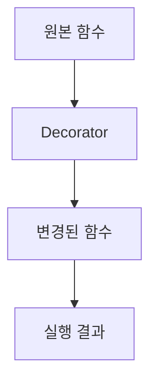

이 다이어그램은 원본 함수가 Decorator에 의해 변경되어 실행 결과를 생성하는 과정을 보여준다. Decorator는 원본 함수의 기능을 확장하는 역할을 하며, 이를 통해 다양한 기능을 손쉽게 추가할 수 있다.

<!--
## 2. Decorator의 기본 개념
   - Decorator의 작동 원리
   - 함수와 Decorator의 관계
   - Decorator의 문법
-->

## Decorator의 기본 개념

### Decorator의 작동 원리

Decorator는 Python에서 함수나 메서드를 수정하거나 확장하는 데 사용되는 디자인 패턴이다. 기본적으로 Decorator는 다른 함수를 인자로 받아 새로운 함수를 반환하는 함수이다. 이 과정에서 원래 함수의 기능을 변경하거나 추가적인 기능을 덧붙일 수 있다. Decorator는 주로 함수의 전후에 특정 작업을 수행할 때 유용하다.

아래는 Decorator의 작동 원리를 설명하는 간단한 예제이다.

```python
def my_decorator(func):
    def wrapper():
        print("Something is happening before the function is called.")
        func()
        print("Something is happening after the function is called.")
    return wrapper

@my_decorator
def say_hello():
    print("Hello!")

say_hello()
```

위의 코드에서 `my_decorator`는 `say_hello` 함수를 감싸는 `wrapper` 함수를 반환한다. `@my_decorator` 구문은 `say_hello` 함수를 `my_decorator`로 감싸는 역할을 한다. 이로 인해 `say_hello`를 호출할 때, Decorator가 추가된 기능이 실행된다.

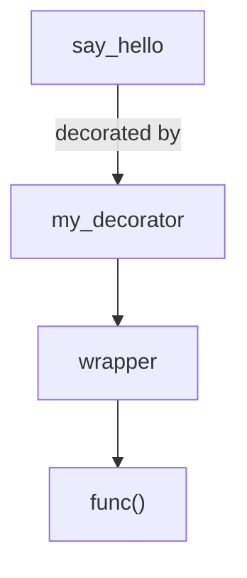

### 함수와 Decorator의 관계

Decorator는 함수와 밀접한 관계를 가지고 있다. Decorator는 함수의 인스턴스를 받아서 새로운 함수를 반환하기 때문에, 함수형 프로그래밍의 특성을 잘 활용할 수 있다. 이로 인해 코드의 재사용성과 가독성을 높일 수 있다. Decorator는 주로 로깅, 인증, 성능 측정 등 다양한 용도로 사용된다.

Decorator는 함수의 입력과 출력을 변경할 수 있으며, 이를 통해 함수의 동작을 유연하게 조정할 수 있다. 예를 들어, 특정 조건에 따라 함수의 실행을 중단하거나, 추가적인 인자를 전달하는 등의 작업이 가능하다.

### Decorator의 문법

Decorator를 정의하는 문법은 간단하다. 기본적으로 함수를 정의하고, 그 함수 안에 또 다른 함수를 정의한 후, 외부 함수에서 내부 함수를 반환하는 구조이다. Decorator를 적용할 때는 `@decorator_name` 형식을 사용하여 간편하게 적용할 수 있다.

아래는 Decorator의 문법을 보여주는 예제이다.

```python
def simple_decorator(func):
    def inner_function():
        print("Before the function call")
        func()
        print("After the function call")
    return inner_function

@simple_decorator
def greet():
    print("Hello, World!")

greet()
```

위의 예제에서 `simple_decorator`는 `greet` 함수를 감싸고, `inner_function`을 반환한다. `greet` 함수를 호출하면 Decorator가 적용된 `inner_function`이 실행된다. 이와 같은 방식으로 Decorator를 정의하고 사용할 수 있다.

<!--
## 3. Decorator의 종류
   - 함수 Decorator
   - 클래스 Decorator
   - Decorator 클래스
-->

## Decorator의 종류

Python에서 Decorator는 주로 세 가지 종류로 나눌 수 있다. 이들은 함수 Decorator, 클래스 Decorator, 그리고 Decorator 클래스이다. 각 종류는 특정한 용도와 기능을 가지고 있으며, 이를 통해 코드의 재사용성과 가독성을 높일 수 있다.

### 함수 Decorator

**함수 Decorator**는 다른 함수를 인자로 받아서 새로운 함수를 반환하는 함수이다. 주로 함수의 동작을 수정하거나 확장하는 데 사용된다. 예를 들어, 로깅이나 성능 측정을 위해 함수의 실행 전후에 특정 작업을 수행할 수 있다.

다음은 함수 Decorator의 간단한 예제이다.

```python
def my_decorator(func):
    def wrapper():
        print("Before the function call")
        func()
        print("After the function call")
    return wrapper

@my_decorator
def say_hello():
    print("Hello!")

say_hello()
```

위 코드를 실행하면 다음과 같은 출력이 나타난다.

```
Before the function call
Hello!
After the function call
```

이 예제에서 `my_decorator`는 `say_hello` 함수에 적용되어, 함수 호출 전후에 메시지를 출력하는 기능을 추가한다.

### 클래스 Decorator

**클래스 Decorator**는 클래스에 적용되는 Decorator로, 클래스의 동작을 수정하거나 확장하는 데 사용된다. 클래스 Decorator는 주로 클래스의 메서드나 속성을 변경하는 데 유용하다.

다음은 클래스 Decorator의 예제이다.

```python
def class_decorator(cls):
    cls.extra_attribute = "This is an extra attribute"
    return cls

@class_decorator
class MyClass:
    def greet(self):
        return "Hello!"

obj = MyClass()
print(obj.greet())
print(obj.extra_attribute)
```

위 코드를 실행하면 다음과 같은 출력이 나타난다.

```
Hello!
This is an extra attribute
```

이 예제에서 `class_decorator`는 `MyClass`에 적용되어, 클래스에 새로운 속성을 추가한다.

### Decorator 클래스

**Decorator 클래스**는 Decorator의 기능을 클래스 형태로 구현한 것이다. 이 방식은 상태를 유지해야 하거나, 여러 메서드를 Decorate해야 할 때 유용하다. Decorator 클래스는 `__call__` 메서드를 구현하여, 인스턴스가 함수처럼 호출될 수 있도록 한다.

다음은 Decorator 클래스를 사용하는 예제이다.

```python
class MyDecorator:
    def __init__(self, func):
        self.func = func

    def __call__(self):
        print("Before the function call")
        self.func()
        print("After the function call")

@MyDecorator
def say_hello():
    print("Hello!")

say_hello()
```

위 코드를 실행하면 다음과 같은 출력이 나타난다.

```
Before the function call
Hello!
After the function call
```

이 예제에서 `MyDecorator` 클래스는 `say_hello` 함수에 적용되어, 함수 호출 전후에 메시지를 출력하는 기능을 추가한다.

### 다이어그램

다음은 Decorator의 종류를 나타내는 다이어그램이다.

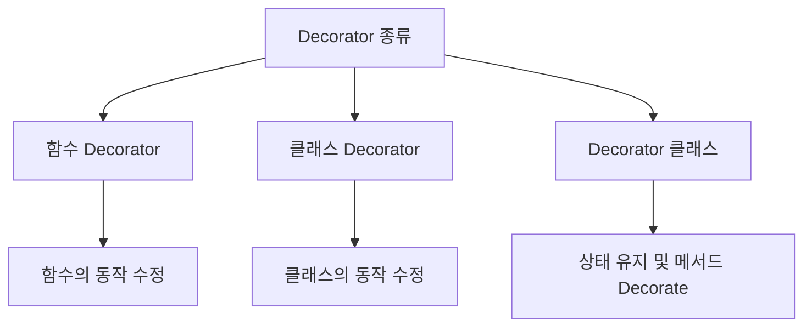

이와 같이 Python의 Decorator는 다양한 형태로 구현될 수 있으며, 각 종류는 특정한 상황에서 유용하게 사용될 수 있다. Decorator를 적절히 활용하면 코드의 재사용성과 가독성을 높일 수 있다.

<!--
## 4. Decorator 사용 사례
   - Flask 웹 프레임워크에서의 Decorator 사용
   - 로깅(Logging) Decorator
   - 사용자 인증을 위한 Decorator
-->

## Decorator 사용 사례

### Flask 웹 프레임워크에서의 Decorator 사용

Flask는 Python으로 작성된 경량 웹 프레임워크로, Decorator를 활용하여 라우팅 및 요청 처리 기능을 간편하게 구현할 수 있다. Flask에서 제공하는 `@app.route()` Decorator는 특정 URL 경로에 대한 요청을 처리하는 함수를 지정하는 데 사용된다. 이를 통해 코드의 가독성을 높이고, 기능을 모듈화할 수 있다.

**샘플 코드:**

```python
from flask import Flask

app = Flask(__name__)

@app.route('/')
def home():
    return "Welcome to the Home Page!"

@app.route('/about')
def about():
    return "This is the About Page!"

if __name__ == '__main__':
    app.run(debug=True)
```

**다이어그램:**

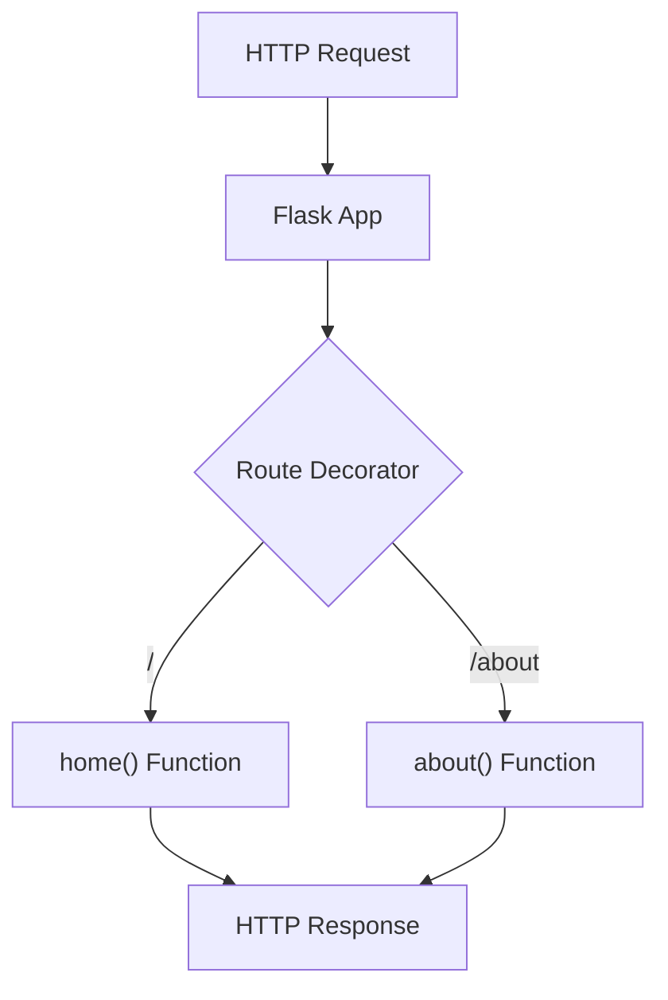

### 로깅(Logging) Decorator

로깅은 애플리케이션의 동작을 추적하고 문제를 해결하는 데 중요한 역할을 한다. Decorator를 사용하여 함수 호출 시 자동으로 로그를 기록할 수 있다. 이를 통해 코드의 중복을 줄이고, 일관된 로깅 방식을 유지할 수 있다.

**샘플 코드:**

```python
import logging

logging.basicConfig(level=logging.INFO)

def log_function_call(func):
    def wrapper(*args, **kwargs):
        logging.info(f"Calling function: {func.__name__}")
        return func(*args, **kwargs)
    return wrapper

@log_function_call
def add(a, b):
    return a + b

result = add(5, 3)
```

**다이어그램:**

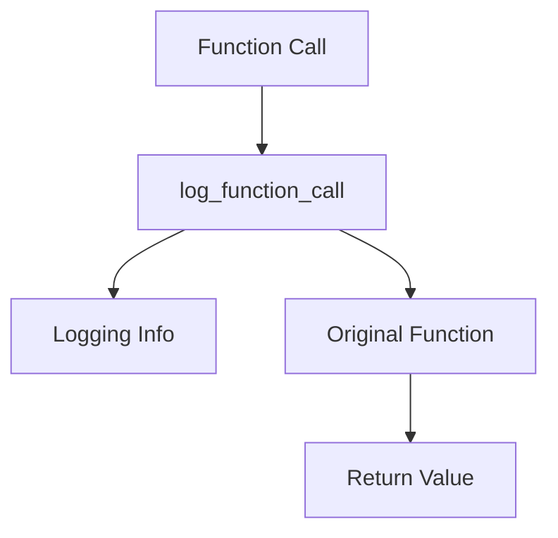

### 사용자 인증을 위한 Decorator

사용자 인증은 웹 애플리케이션에서 중요한 보안 요소이다. Decorator를 사용하여 특정 함수나 클래스에 접근하기 전에 사용자의 인증 상태를 확인할 수 있다. 이를 통해 코드의 재사용성을 높이고, 인증 로직을 중앙 집중화할 수 있다.

**샘플 코드:**

```python
from functools import wraps

def requires_authentication(func):
    @wraps(func)
    def wrapper(*args, **kwargs):
        if not is_authenticated():
            return "Access Denied", 403
        return func(*args, **kwargs)
    return wrapper

def is_authenticated():
    # 인증 로직 구현
    return True  # 예시로 항상 True 반환

@requires_authentication
def view_profile():
    return "User Profile"

result = view_profile()
```

**다이어그램:**

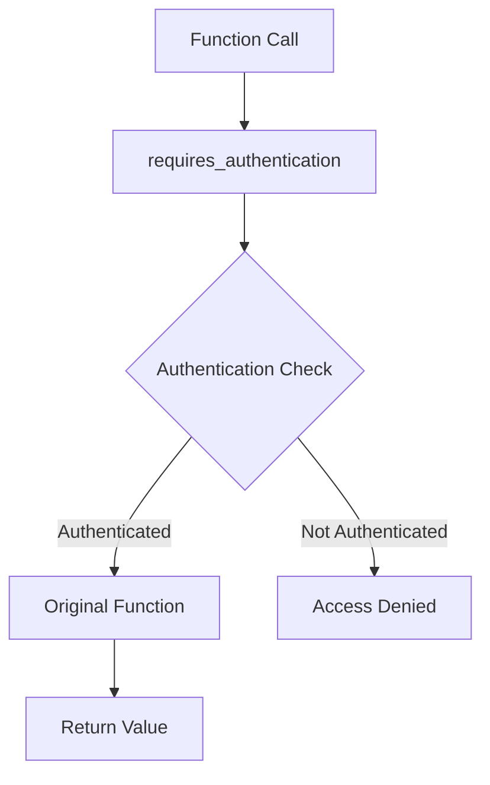

이와 같이 Decorator는 Flask 웹 프레임워크에서의 라우팅, 로깅, 사용자 인증 등 다양한 분야에서 유용하게 사용될 수 있다. 이를 통해 코드의 가독성과 재사용성을 높일 수 있으며, 유지보수 또한 용이해진다.

<!--
## 5. Decorator의 장단점
   - 코드 재사용성 증가
   - 코드 복잡도 증가의 위험
-->

## Decorator의 장단점

### 코드 재사용성 증가

Decorator는 코드의 재사용성을 크게 향상시킨다. 동일한 기능을 여러 함수에 적용할 수 있기 때문에, 중복 코드를 줄이고 유지보수를 용이하게 한다. 예를 들어, 로깅 기능을 여러 함수에 적용하고 싶을 때, 각 함수에 로깅 코드를 직접 작성하는 대신, 로깅 Decorator를 만들어 재사용할 수 있다.

다음은 로깅 Decorator의 간단한 예제이다.

```python
def logging_decorator(func):
    def wrapper(*args, **kwargs):
        print(f"Calling function: {func.__name__}")
        result = func(*args, **kwargs)
        print(f"Function {func.__name__} returned: {result}")
        return result
    return wrapper

@logging_decorator
def add(a, b):
    return a + b

add(2, 3)
```

위의 코드에서 `logging_decorator`는 `add` 함수에 적용되어, 함수 호출 시 로그를 출력한다. 이처럼 Decorator를 사용하면 코드의 재사용성을 높일 수 있다.

### 코드 복잡도 증가의 위험

반면, Decorator를 남용할 경우 코드의 복잡도가 증가할 수 있다. 여러 Decorator를 중첩하여 사용할 경우, 코드의 흐름을 이해하기 어려워질 수 있으며, 디버깅이 복잡해질 수 있다. 특히, Decorator가 서로 다른 기능을 수행할 때, 각 Decorator의 작동 방식을 파악하는 데 시간이 소요될 수 있다.

다음은 여러 Decorator를 중첩하여 사용하는 예제이다.

```python
def double_decorator(func):
    def wrapper(*args, **kwargs):
        return func(*args, **kwargs) * 2
    return wrapper

@double_decorator
@logging_decorator
def multiply(a, b):
    return a * b

multiply(2, 3)
```

위의 코드에서 `multiply` 함수는 두 개의 Decorator가 적용되어 있다. 이 경우, 함수의 동작을 이해하기 위해서는 두 Decorator의 작동 방식을 모두 파악해야 하므로, 코드의 복잡도가 증가할 수 있다.

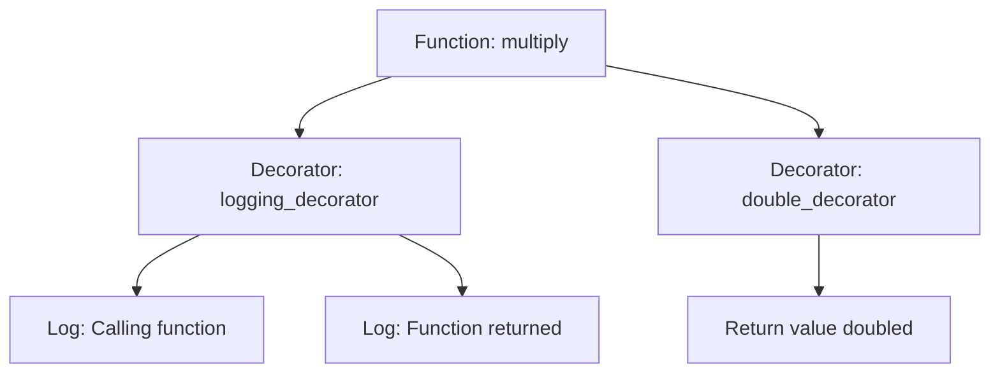

이와 같이 Decorator는 코드의 재사용성을 높이는 장점이 있지만, 남용할 경우 코드의 복잡도를 증가시킬 위험이 있다. 따라서 적절한 사용이 필요하다.

<!--
## 6. Decorator 구현 예제
   - 기본 Decorator 구현
   - 인자를 받는 Decorator 구현
   - 여러 Decorator의 중첩 사용
-->

## Decorator 구현 예제

### 기본 Decorator 구현

Decorator는 함수의 기능을 확장하는 간단한 방법이다. 기본적인 Decorator는 다른 함수를 인자로 받아서 새로운 함수를 반환하는 구조로 이루어져 있다. 아래는 기본 Decorator의 예제 코드이다.

```python
def simple_decorator(func):
    def wrapper():
        print("Before the function call")
        func()
        print("After the function call")
    return wrapper

@simple_decorator
def say_hello():
    print("Hello!")

say_hello()
```

위의 코드에서 `simple_decorator`는 `say_hello` 함수에 Decorator로 적용되었다. 이 Decorator는 원래 함수 호출 전후에 메시지를 출력하는 기능을 추가한다. 

다이어그램으로 표현하면 다음과 같다.

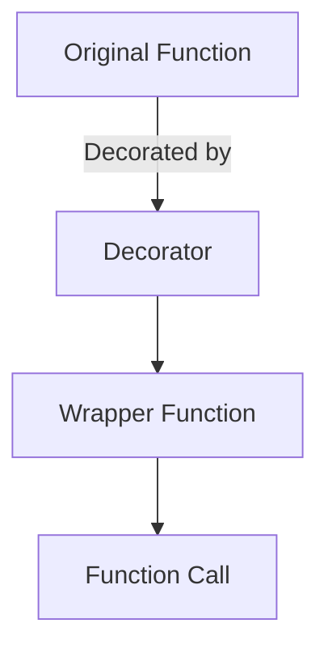

### 인자를 받는 Decorator 구현

Decorator는 인자를 받을 수도 있다. 이를 위해 Decorator 내부에 또 다른 함수를 정의하여 인자를 처리할 수 있다. 아래는 인자를 받는 Decorator의 예제 코드이다.

```python
def repeat(num_times):
    def decorator_repeat(func):
        def wrapper(*args, **kwargs):
            for _ in range(num_times):
                func(*args, **kwargs)
        return wrapper
    return decorator_repeat

@repeat(3)
def greet(name):
    print(f"Hello, {name}!")

greet("Alice")
```

위의 코드에서 `repeat` 함수는 Decorator를 생성하는 함수로, `num_times` 인자를 받아서 해당 횟수만큼 원래 함수를 호출한다. 

다이어그램으로 표현하면 다음과 같다.

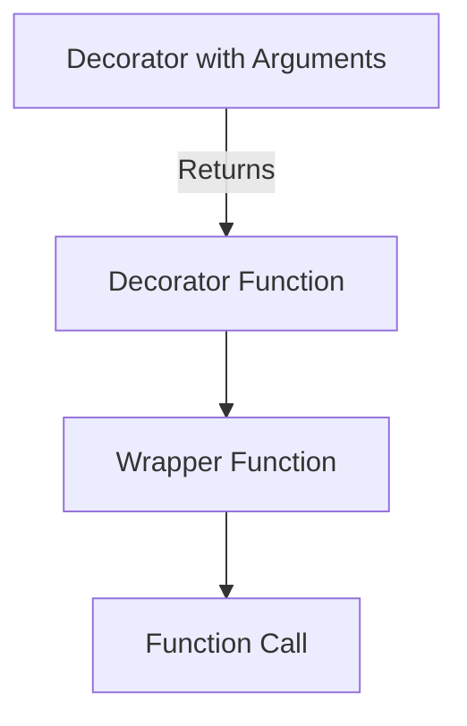

### 여러 Decorator의 중첩 사용

여러 Decorator를 중첩하여 사용할 수도 있다. 이 경우, Decorator는 아래에서 위로 적용된다. 아래는 여러 Decorator를 중첩하여 사용하는 예제 코드이다.

```python
def uppercase_decorator(func):
    def wrapper(*args, **kwargs):
        result = func(*args, **kwargs)
        return result.upper()
    return wrapper

def exclamation_decorator(func):
    def wrapper(*args, **kwargs):
        result = func(*args, **kwargs)
        return result + "!"
    return wrapper

@exclamation_decorator
@uppercase_decorator
def greet(name):
    return f"Hello, {name}"

print(greet("Bob"))
```

위의 코드에서 `greet` 함수는 두 개의 Decorator에 의해 장식된다. 첫 번째로 `uppercase_decorator`가 적용되어 문자열을 대문자로 변환하고, 두 번째로 `exclamation_decorator`가 적용되어 문자열 끝에 느낌표를 추가한다.

다이어그램으로 표현하면 다음과 같다.

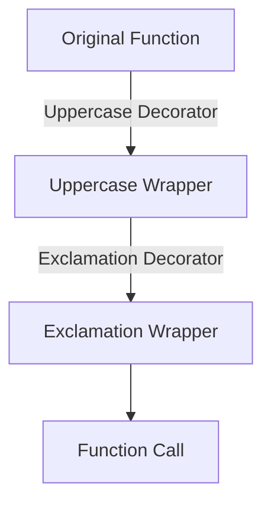

이와 같이 Decorator를 구현하고 활용함으로써 코드의 가독성과 재사용성을 높일 수 있다.

<!--
## 7. Decorator와 클로저(Closure)
   - 클로저의 개념
   - Decorator와 클로저의 관계
-->

## Decorator와 클로저(Closure)

### 클로저의 개념

클로저(Closure)는 함수와 그 함수가 선언된 환경(변수의 범위)을 함께 묶은 개념이다. 즉, 클로저는 내부 함수가 외부 함수의 변수에 접근할 수 있도록 해주는 기능을 제공한다. 이를 통해 외부 함수의 상태를 기억하고, 내부 함수가 호출될 때마다 그 상태를 유지할 수 있다. 클로저는 주로 데이터 은닉(data hiding)이나 상태 유지(state retention)와 같은 용도로 사용된다.

다음은 클로저의 간단한 예제이다.

```python
def outer_function(x):
    def inner_function(y):
        return x + y
    return inner_function

closure = outer_function(10)
print(closure(5))  # 출력: 15
```

위의 코드에서 `outer_function`은 `inner_function`을 반환한다. `inner_function`은 `x`라는 외부 변수에 접근할 수 있으며, 이로 인해 `closure`는 `x`의 값을 기억하게 된다.

### Decorator와 클로저의 관계

Decorator는 클로저의 개념을 활용하여 함수의 동작을 수정하거나 확장하는 기능을 제공한다. Decorator는 주로 다른 함수를 인자로 받아 새로운 함수를 반환하는 형태로 구현된다. 이 과정에서 클로저를 사용하여 Decorator가 원래 함수의 상태를 유지할 수 있도록 한다.

다음은 Decorator가 클로저를 사용하는 예제이다.

```python
def my_decorator(func):
    def wrapper(*args, **kwargs):
        print("함수가 호출되기 전입니다.")
        result = func(*args, **kwargs)
        print("함수가 호출된 후입니다.")
        return result
    return wrapper

@my_decorator
def say_hello(name):
    print(f"안녕하세요, {name}!")

say_hello("홍길동")
```

위의 코드에서 `my_decorator`는 `say_hello` 함수를 감싸는 `wrapper` 함수를 반환한다. `wrapper` 함수는 `say_hello` 함수가 호출되기 전과 후에 추가적인 동작을 수행한다. 이때 `wrapper`는 `func`라는 외부 변수를 기억하고, 이를 통해 원래의 `say_hello` 함수에 접근할 수 있다.

### 다이어그램

다음은 Decorator와 클로저의 관계를 나타내는 다이어그램이다.

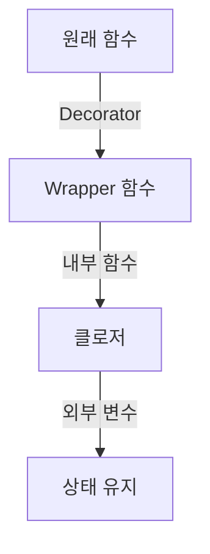

이 다이어그램은 Decorator가 원래 함수를 감싸고, 그 내부에서 클로저를 통해 외부 변수를 유지하는 구조를 보여준다. Decorator는 클로저를 통해 원래 함수의 동작을 수정하고, 추가적인 기능을 제공할 수 있다.

<!--
## 8. Decorator의 디버깅
   - Decorator 사용 시 주의사항
   - Decorator의 속성 유지하기 (functools.wraps)
-->

## Decorator의 디버깅

Decorator를 사용할 때는 몇 가지 주의사항이 있다. Decorator는 함수의 동작을 수정하거나 확장하는 기능을 제공하지만, 잘못 사용하면 코드의 가독성을 떨어뜨리거나 예기치 않은 동작을 초래할 수 있다. 따라서 Decorator를 사용할 때는 다음과 같은 점을 유의해야 한다.

**Decorator 사용 시 주의사항**

1. **가독성 유지**: Decorator는 코드의 가독성을 높일 수 있지만, 지나치게 복잡한 Decorator를 사용하면 오히려 가독성을 해칠 수 있다. Decorator의 기능은 간단하고 명확하게 유지하는 것이 좋다.

2. **예외 처리**: Decorator 내부에서 발생할 수 있는 예외를 적절히 처리해야 한다. Decorator가 호출된 함수에서 발생한 예외가 Decorator 내부에서 처리되지 않으면, 프로그램이 비정상적으로 종료될 수 있다.

3. **인자 전달**: Decorator는 인자를 받을 수 있지만, 이를 적절히 처리하지 않으면 인자 전달이 실패할 수 있다. Decorator를 정의할 때는 인자 전달 방식을 명확히 이해하고 구현해야 한다.

4. **디버깅 도구 활용**: Decorator의 동작을 이해하기 위해 디버깅 도구를 활용하는 것이 좋다. Python의 `pdb` 모듈이나 IDE의 디버깅 기능을 사용하여 Decorator의 흐름을 추적할 수 있다.

다음은 Decorator의 기본적인 구조를 보여주는 샘플 코드이다.

```python
def my_decorator(func):
    def wrapper(*args, **kwargs):
        print("Before the function call")
        result = func(*args, **kwargs)
        print("After the function call")
        return result
    return wrapper

@my_decorator
def say_hello(name):
    print(f"Hello, {name}!")

say_hello("Alice")
```

위의 코드에서 `my_decorator`는 `say_hello` 함수에 Decorator로 적용되며, 함수 호출 전후에 메시지를 출력한다. 이처럼 Decorator의 동작을 이해하고 디버깅하는 것이 중요하다.

**Decorator의 속성 유지하기 (functools.wraps)**

Decorator를 사용할 때, 원래 함수의 메타데이터(예: 이름, 문서 문자열 등)를 유지하는 것이 중요하다. 이를 위해 `functools` 모듈의 `wraps` 데코레이터를 사용할 수 있다. `wraps`를 사용하면 Decorator가 적용된 함수의 속성을 원래 함수와 동일하게 유지할 수 있다.

다음은 `functools.wraps`를 사용하는 예제이다.

```python
from functools import wraps

def my_decorator(func):
    @wraps(func)
    def wrapper(*args, **kwargs):
        print("Before the function call")
        result = func(*args, **kwargs)
        print("After the function call")
        return result
    return wrapper

@my_decorator
def say_hello(name):
    """This function greets a person."""
    print(f"Hello, {name}!")

print(say_hello.__name__)  # say_hello
print(say_hello.__doc__)   # This function greets a person.
```

위의 코드에서 `@wraps(func)`를 사용함으로써, `say_hello` 함수의 이름과 문서 문자열이 Decorator가 적용된 후에도 유지된다. 이는 코드의 가독성을 높이고, 디버깅 시 유용한 정보를 제공한다.

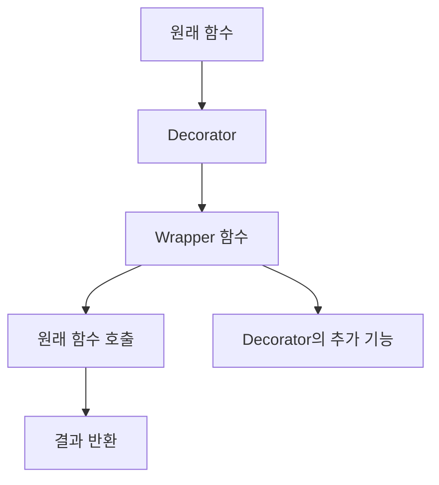

위의 다이어그램은 Decorator의 작동 과정을 시각적으로 나타낸 것이다. 원래 함수가 Decorator에 의해 감싸지고, Wrapper 함수가 호출되며, 최종적으로 원래 함수가 실행되는 구조를 보여준다. Decorator를 사용할 때 이러한 구조를 이해하는 것이 중요하다.

<!--
## 9. FAQ
   - Decorator는 언제 사용해야 하나요?
   - Decorator를 여러 개 사용할 수 있나요?
   - Decorator의 성능에 대한 영향은 무엇인가요?
-->

## FAQ

### Decorator는 언제 사용해야 하나요?

Decorator는 주로 코드의 재사용성을 높이고, 공통적인 기능을 여러 함수에 적용할 필요가 있을 때 사용된다. 예를 들어, 로깅, 사용자 인증, 성능 측정 등의 기능을 여러 함수에 일관되게 적용하고자 할 때 유용하다. Decorator를 사용하면 코드의 중복을 줄이고, 각 함수의 핵심 로직에 집중할 수 있게 된다.

**사용 예시:**

```python
def log_function_call(func):
    def wrapper(*args, **kwargs):
        print(f"Calling function: {func.__name__}")
        return func(*args, **kwargs)
    return wrapper

@log_function_call
def add(a, b):
    return a + b

result = add(2, 3)
```

위의 예시에서 `log_function_call` Decorator는 `add` 함수가 호출될 때마다 호출 정보를 출력한다.

### Decorator를 여러 개 사용할 수 있나요?

네, Decorator는 여러 개를 중첩하여 사용할 수 있다. 이 경우, 가장 안쪽에 있는 Decorator가 먼저 실행되고, 바깥쪽 Decorator가 그 다음에 실행된다. 이를 통해 복잡한 기능을 조합하여 사용할 수 있다.

**사용 예시:**

```python
def decorator_one(func):
    def wrapper(*args, **kwargs):
        print("Decorator One")
        return func(*args, **kwargs)
    return wrapper

def decorator_two(func):
    def wrapper(*args, **kwargs):
        print("Decorator Two")
        return func(*args, **kwargs)
    return wrapper

@decorator_one
@decorator_two
def greet(name):
    print(f"Hello, {name}!")

greet("Alice")
```

위의 예시에서 `greet` 함수는 `decorator_two`가 먼저 실행되고, 그 다음에 `decorator_one`이 실행된다.

### Decorator의 성능에 대한 영향은 무엇인가요?

Decorator는 함수 호출 시 추가적인 작업을 수행하기 때문에 성능에 영향을 미칠 수 있다. 특히, Decorator가 복잡한 로직을 포함하고 있거나, 많은 인자를 처리해야 하는 경우 성능 저하가 발생할 수 있다. 따라서 성능이 중요한 경우, Decorator의 사용을 신중히 고려해야 한다.

**성능 비교 다이어그램:**

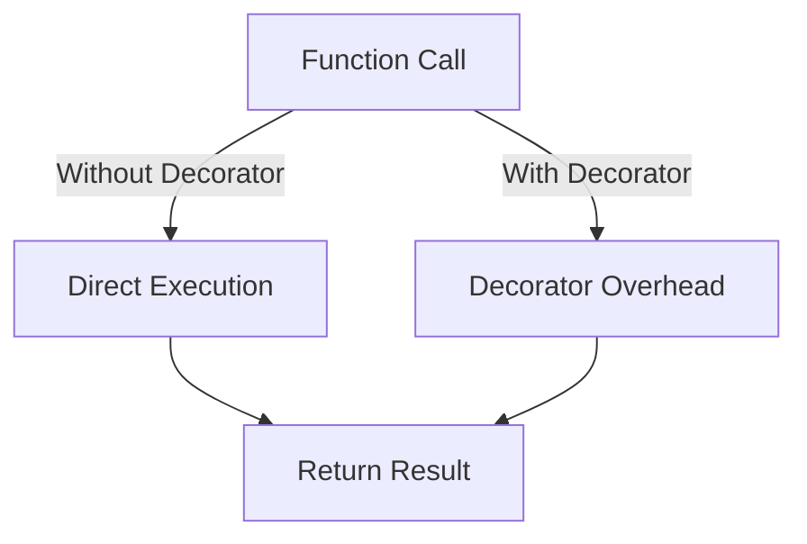

위의 다이어그램은 Decorator가 추가적인 오버헤드를 발생시킨다는 것을 보여준다. Decorator를 사용할 때는 이러한 성능 영향을 고려하여 적절히 사용해야 한다.

<!--
## 10. 관련 기술
   - Python의 함수형 프로그래밍
   - 메타프로그래밍
   - 고차 함수(Higher-order functions)
-->

## 관련 기술

### Python의 함수형 프로그래밍

Python은 객체 지향 프로그래밍(Object-Oriented Programming)뿐만 아니라 함수형 프로그래밍(Functional Programming) 패러다임도 지원한다. 함수형 프로그래밍은 함수를 일급 시민으로 취급하며, 함수를 변수에 할당하거나 다른 함수의 인자로 전달할 수 있는 특징이 있다. 이러한 특성은 Decorator와 밀접한 관련이 있다. Decorator는 함수형 프로그래밍의 개념을 활용하여 기존 함수에 새로운 기능을 추가하는 방식으로 동작한다.

**예제 코드:**

```python
def square(x):
    return x * x

def apply_function(func, value):
    return func(value)

result = apply_function(square, 5)
print(result)  # 출력: 25
```

### 메타프로그래밍

메타프로그래밍(Metaprogramming)은 프로그램을 작성하는 프로그램을 의미한다. Python에서는 메타프로그래밍을 통해 클래스나 함수의 동작을 동적으로 변경할 수 있다. Decorator는 메타프로그래밍의 한 예로, 함수나 클래스를 수정하거나 확장하는 데 사용된다. 이를 통해 코드의 재사용성을 높이고, 유지보수를 용이하게 할 수 있다.

**다이어그램:**

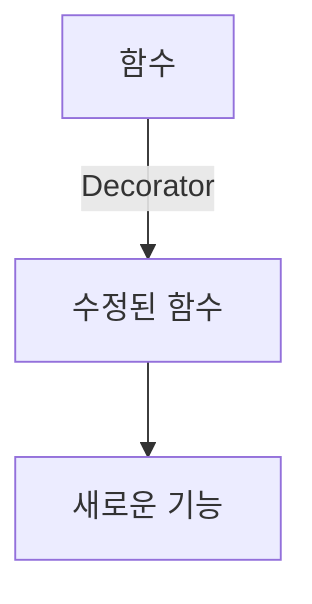

### 고차 함수(Higher-order functions)

고차 함수는 다른 함수를 인자로 받거나, 함수를 반환하는 함수를 의미한다. Python에서는 고차 함수를 쉽게 구현할 수 있으며, Decorator는 고차 함수의 대표적인 예이다. Decorator는 함수를 인자로 받아 새로운 함수를 반환하는 구조로 되어 있다. 이러한 특성 덕분에 Decorator는 코드의 가독성을 높이고, 기능을 모듈화하는 데 기여한다.

**예제 코드:**

```python
def decorator_function(original_function):
    def wrapper_function():
        print("Wrapper executed before {}".format(original_function.__name__))
        return original_function()
    return wrapper_function

@decorator_function
def display():
    return "Display function executed"

print(display())  # 출력: Wrapper executed before display
                  #         Display function executed
```

이와 같이 Python의 함수형 프로그래밍, 메타프로그래밍, 고차 함수는 Decorator와 밀접한 관계를 맺고 있으며, 이를 통해 Python 프로그래밍의 유연성과 확장성을 높일 수 있다.

<!--
## 11. 결론
   - Decorator의 중요성 요약
   - Python 프로그래밍에서 Decorator의 활용 방안
-->

## 결론

### Decorator의 중요성 요약

Python에서 Decorator는 코드의 재사용성과 가독성을 높이는 중요한 역할을 한다. Decorator를 사용하면 함수나 메서드의 기능을 동적으로 확장할 수 있으며, 이를 통해 코드의 중복을 줄이고 유지보수를 용이하게 할 수 있다. 또한, Decorator는 코드의 구조를 명확하게 하여, 개발자가 의도한 바를 쉽게 이해할 수 있도록 돕는다. 이러한 특성 덕분에 Decorator는 Python 프로그래밍에서 널리 사용되고 있으며, 다양한 라이브러리와 프레임워크에서도 그 활용도가 높다.

### Python 프로그래밍에서 Decorator의 활용 방안

Python 프로그래밍에서 Decorator는 여러 가지 방식으로 활용될 수 있다. 예를 들어, 웹 프레임워크인 Flask에서는 라우팅 기능을 Decorator로 구현하여, URL과 함수 간의 매핑을 간편하게 처리할 수 있다. 또한, 로깅이나 성능 측정과 같은 기능을 Decorator로 구현하면, 코드의 각 부분에서 일관된 방식으로 이러한 기능을 적용할 수 있다.

아래는 Decorator의 기본적인 사용 예시를 보여주는 코드이다.

```python
def my_decorator(func):
    def wrapper():
        print("Something is happening before the function is called.")
        func()
        print("Something is happening after the function is called.")
    return wrapper

@my_decorator
def say_hello():
    print("Hello!")

say_hello()
```

위의 코드에서 `my_decorator`는 `say_hello` 함수에 적용되어, 함수 호출 전후에 추가적인 동작을 수행한다. 이처럼 Decorator를 사용하면 코드의 흐름을 쉽게 제어할 수 있다.

다음은 Decorator의 작동 방식을 시각적으로 나타낸 다이어그램이다.

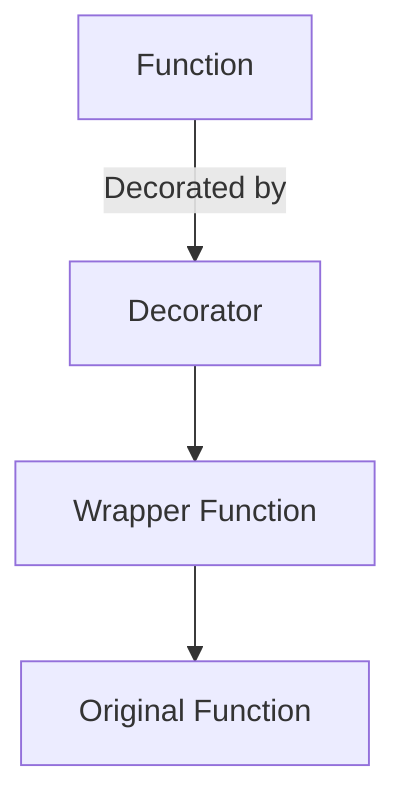

이 다이어그램은 Decorator가 원래의 함수를 감싸는 구조를 보여준다. Decorator는 원래의 함수에 추가적인 기능을 부여하며, 이를 통해 코드의 유연성을 높인다. 

결론적으로, Decorator는 Python 프로그래밍에서 매우 유용한 도구이며, 다양한 상황에서 활용될 수 있다. 이를 통해 개발자는 더 깔끔하고 효율적인 코드를 작성할 수 있다.

<!--
## 12. 추가 자료
   - 추천 도서 및 온라인 강의
   - 관련 블로그 및 커뮤니티 링크
-->

## 추가 자료

### 추천 도서 및 온라인 강의

Python Decorator에 대한 깊이 있는 이해를 위해 다음과 같은 도서와 온라인 강의를 추천한다.

**도서**

- **"Fluent Python"**: Luciano Ramalho 저. 이 책은 Python의 다양한 기능을 다루며, Decorator에 대한 심도 있는 설명이 포함되어 있다.
- **"Python Cookbook"**: David Beazley와 Brian K. Jones 저. 이 책은 실용적인 예제를 통해 Python의 다양한 기법을 소개하며, Decorator에 대한 유용한 팁을 제공한다.

**온라인 강의**

- **Coursera의 "Python for Everybody"**: 이 강의는 Python의 기초부터 고급 개념까지 다루며, Decorator에 대한 섹션도 포함되어 있다.
- **Udemy의 "Complete Python Developer in 2023: Zero to Mastery"**: 이 강의는 Python의 모든 측면을 포괄하며, Decorator에 대한 실습도 제공한다.

### 관련 블로그 및 커뮤니티 링크

Python Decorator에 대한 추가 정보를 얻기 위해 다음의 블로그와 커뮤니티를 방문하는 것을 추천한다.

- **Real Python**: [Real Python](https://realpython.com)에서는 Python의 다양한 주제에 대한 튜토리얼과 기사를 제공하며, Decorator에 대한 유용한 자료도 찾을 수 있다.
- **Stack Overflow**: [Stack Overflow](https://stackoverflow.com)에서는 Python 관련 질문과 답변을 통해 Decorator에 대한 다양한 문제를 해결할 수 있다.

### 샘플 코드

아래는 간단한 Decorator의 예제 코드이다. 이 코드는 함수의 실행 시간을 측정하는 Decorator를 구현한 것이다.

```python
import time

def timer_decorator(func):
    def wrapper(*args, **kwargs):
        start_time = time.time()
        result = func(*args, **kwargs)
        end_time = time.time()
        print(f"Execution time: {end_time - start_time:.4f} seconds")
        return result
    return wrapper

@timer_decorator
def sample_function(n):
    total = 0
    for i in range(n):
        total += i
    return total

sample_function(1000000)
```

### 다이어그램

아래는 Decorator의 작동 원리를 설명하는 다이어그램이다.

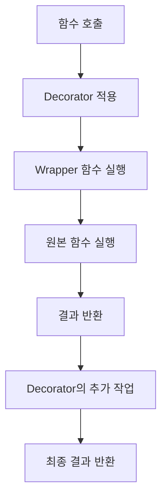

이 자료들은 Python Decorator에 대한 이해를 높이는 데 큰 도움이 될 것이다. 다양한 자료를 통해 실력을 쌓아보길 권장한다.

<!--
##### Reference #####
-->

## Reference


* [https://bluese05.tistory.com/30](https://bluese05.tistory.com/30)
* [https://dojang.io/mod/page/view.php?id=2427)](https://dojang.io/mod/page/view.php?id=2427))
* [https://dev.to/hakeem/decorators-in-python-6ck](https://dev.to/hakeem/decorators-in-python-6ck)
* [https://medium.com/sjk5766/%EB%B2%88%EC%97%AD-python%EC%9D%98-%ED%95%A8%EC%88%98-decorators-%EA%B0%80%EC%9D%B4%EB%93%9C-2cd9d5151a1d](https://medium.com/sjk5766/%EB%B2%88%EC%97%AD-python%EC%9D%98-%ED%95%A8%EC%88%98-decorators-%EA%B0%80%EC%9D%B4%EB%93%9C-2cd9d5151a1d)
* [https://schoolofweb.net/posts/%ED%8C%8C%EC%9D%B4%EC%8D%AC-%EB%8D%B0%EC%BD%94%EB%A0%88%EC%9D%B4%ED%84%B0-decorator](https://schoolofweb.net/posts/%ED%8C%8C%EC%9D%B4%EC%8D%AC-%EB%8D%B0%EC%BD%94%EB%A0%88%EC%9D%B4%ED%84%B0-decorator)
* [https://smart-worker.tistory.com/48](https://smart-worker.tistory.com/48)

