Python의 **데코레이터(Decorator)**는 기존 함수를 수정하지 않고 그 기능을 확장하는 방법을 제공하는 강력한 기능이다. `@` 기호로 함수나 메서드 앞에 붙여, 실행 전후에 로깅·인증·성능 측정 같은 공통 로직을 깔끔하게 재사용할 수 있다. Flask 라우팅, 로깅, 인증 등 실무에서 널리 쓰이므로 개념과 문법, 활용·주의사항까지 한 번에 정리한다.

---

## 이 글의 대상

- Python 기본 문법과 함수를 다룰 줄 아는 분
- Flask, FastAPI 등 웹 프레임워크에서 `@app.route`, `@login_required` 같은 문법이 궁금한 분
- 로깅·인증·캐싱 등 반복 로직을 한 곳에서 관리하고 싶은 분
- 데코레이터를 쓸 때 `functools.wraps`가 왜 필요한지 알고 싶은 분

---

## 개요

### Python 데코레이터의 정의

**데코레이터**는 함수나 메서드에 추가 동작을 부여하는 디자인 패턴이다. 원본 함수를 바꾸지 않고, 실행 전·후나 반환값을 가공하는 방식으로 기능을 확장한다. 고차 함수(다른 함수를 인자로 받거나 반환하는 함수)로 구현된다.

다음은 가장 단순한 데코레이터 예이다.

```python
def my_decorator(func):
    def wrapper():
        print("Something is happening before the function is called.")
        func()
        print("Something is happening after the function is called.")
    return wrapper

@my_decorator
def say_hello():
    print("Hello!")

say_hello()
```

`@my_decorator`가 `say_hello`에 적용되며, 호출 전후에 메시지가 출력된다.

### 데코레이터를 쓰는 이유

1. **코드 재사용**: 로깅, 인증, 실행 시간 측정 등을 여러 함수에 동일한 방식으로 적용할 수 있다.
2. **가독성**: 함수 본연의 로직과 부가 기능(로깅·인증 등)을 분리해 의도가 분명해진다.
3. **모듈화**: 부가 기능을 데코레이터 단위로 나누어 구조가 잡힌다.
4. **유연성**: 데코레이터를 붙였다 뗐다 하며 동작을 바꿀 수 있다.

데코레이터 적용 흐름은 아래와 같다.

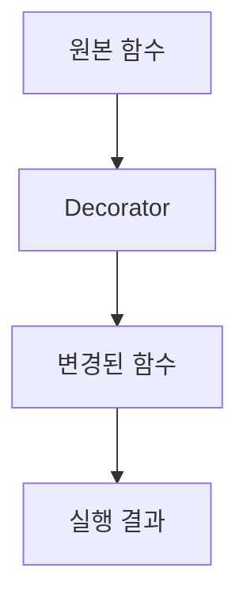
```mermaid
graph TD
    OriginalFunc["원본 함수"]
    DecoratorNode["Decorator"]
    ModifiedFunc["변경된 함수"]
    ExecutionResult["실행 결과"]
    OriginalFunc --> DecoratorNode
    DecoratorNode --> ModifiedFunc
    ModifiedFunc --> ExecutionResult
```

---

## 데코레이터의 기본 개념

### 작동 원리

데코레이터는 **함수를 인자로 받아 새 함수를 반환하는 함수**이다. 그 과정에서 원래 함수를 “감싼” wrapper가 호출 전·후에 추가 작업을 수행한다. `@decorator_name`은 `func = decorator_name(func)`와 같은 의미다.

```python
def my_decorator(func):
    def wrapper():
        print("Something is happening before the function is called.")
        func()
        print("Something is happening after the function is called.")
    return wrapper

@my_decorator
def say_hello():
    print("Hello!")

say_hello()
```

`say_hello`를 호출하면 실제로는 `my_decorator`가 반환한 `wrapper`가 실행되고, 그 안에서 `func()`로 원래 `say_hello`가 호출된다.

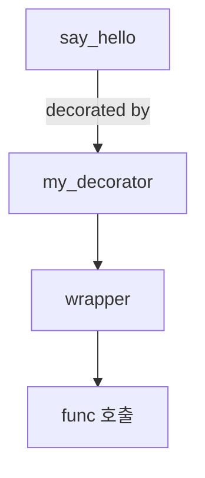
```mermaid
graph TD
    SayHello["say_hello"]
    MyDecorator["my_decorator"]
    Wrapper["wrapper"]
    FuncCall["func 호출"]
    SayHello -->|"decorated by"| MyDecorator
    MyDecorator --> Wrapper
    Wrapper --> FuncCall
```

### 함수와 데코레이터의 관계

데코레이터는 “함수를 인자로 받아 함수를 반환한다”는 함수형 스타일을 그대로 활용한다. 로깅, 인증, 성능 측정처럼 여러 함수에 공통으로 쓸 로직을 데코레이터 하나로 묶을 수 있다. 입력·출력을 가로채서 조건에 따라 조기 반환하거나 인자를 보강하는 식으로 동작을 바꿀 수도 있다.

### @ 문법

데코레이터를 쓰는 문법은 단순하다. 함수를 정의한 뒤, 그 함수를 인자로 받아 새 함수를 반환하는 데코레이터 함수를 만들고, 적용할 함수 **위**에 `@decorator_name`을 적는다.

```python
def simple_decorator(func):
    def inner_function():
        print("Before the function call")
        func()
        print("After the function call")
    return inner_function

@simple_decorator
def greet():
    print("Hello, World!")

greet()
```

`@simple_decorator`는 `greet = simple_decorator(greet)`와 동일하다.

---

## 데코레이터의 종류

Python에서는 크게 **함수 데코레이터**, **클래스 데코레이터**, **데코레이터 클래스** 세 형태로 쓴다.

### 함수 데코레이터

다른 함수를 인자로 받아 wrapper 함수를 반환하는 형태가 가장 흔하다. 함수 동작을 바꾸거나 확장할 때 사용한다.

```python
def my_decorator(func):
    def wrapper():
        print("Before the function call")
        func()
        print("After the function call")
    return wrapper

@my_decorator
def say_hello():
    print("Hello!")

say_hello()
```

출력:

```
Before the function call
Hello!
After the function call
```

### 클래스 데코레이터

클래스 자체를 인자로 받아 속성·메서드를 추가하거나 수정한다.

```python
def class_decorator(cls):
    cls.extra_attribute = "This is an extra attribute"
    return cls

@class_decorator
class MyClass:
    def greet(self):
        return "Hello!"

obj = MyClass()
print(obj.greet())
print(obj.extra_attribute)
```

### 데코레이터 클래스

데코레이터 역할을 클래스로 만들 때는 `__call__`을 구현해 인스턴스가 함수처럼 호출되게 한다. 상태를 갖거나 여러 메서드를 꾸밀 때 유용하다.

```python
class MyDecorator:
    def __init__(self, func):
        self.func = func

    def __call__(self):
        print("Before the function call")
        self.func()
        print("After the function call")

@MyDecorator
def say_hello():
    print("Hello!")

say_hello()
```

세 종류의 관계를 정리하면 다음과 같다.

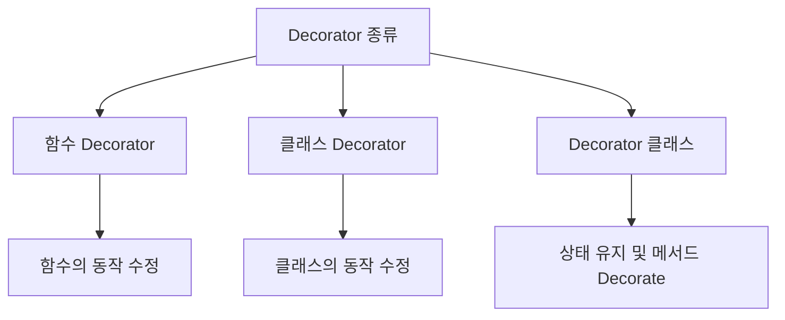
```mermaid
graph TD
    DecoratorTypes["Decorator 종류"]
    FuncDecorator["함수 Decorator"]
    ClassDecorator["클래스 Decorator"]
    DecoratorClass["Decorator 클래스"]
    FuncMod["함수의 동작 수정"]
    ClassMod["클래스의 동작 수정"]
    StateDec["상태 유지 및 메서드 Decorate"]
    DecoratorTypes --> FuncDecorator
    DecoratorTypes --> ClassDecorator
    DecoratorTypes --> DecoratorClass
    FuncDecorator --> FuncMod
    ClassDecorator --> ClassMod
    DecoratorClass --> StateDec
```

---

## 데코레이터 사용 사례

### Flask 웹 프레임워크

Flask는 `@app.route()`로 URL과 뷰 함수를 연결한다. 라우팅 정의가 함수 위에 선언적으로 붙어 가독성이 좋다.

```python
from flask import Flask

app = Flask(__name__)

@app.route('/')
def home():
    return "Welcome to the Home Page!"

@app.route('/about')
def about():
    return "This is the About Page!"

if __name__ == '__main__':
    app.run(debug=True)
```

요청이 들어오면 라우트 데코레이터가 경로에 맞는 함수를 골라 실행한다.

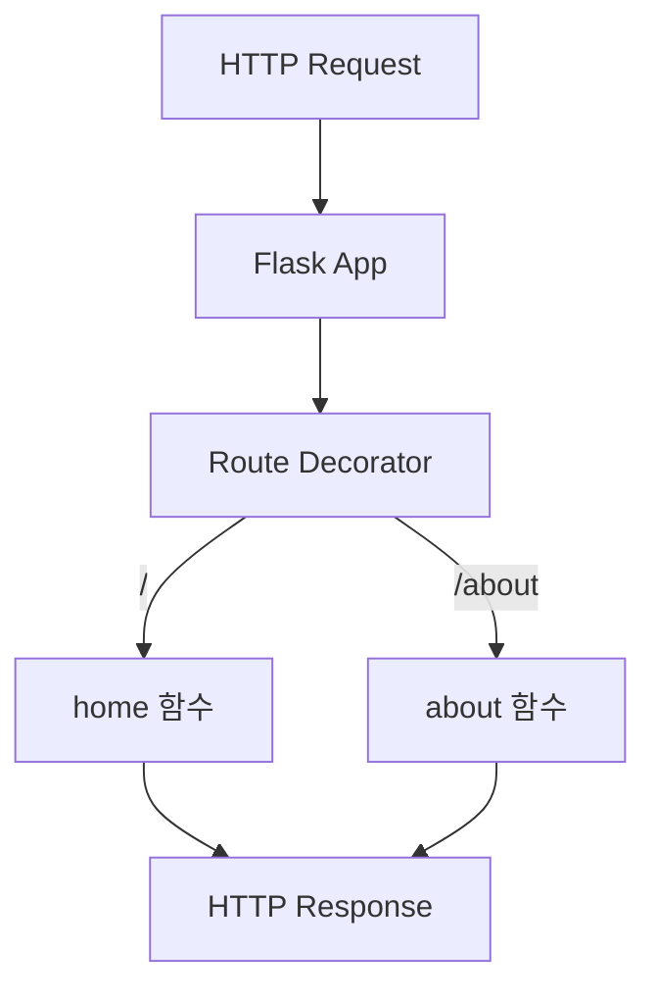
```mermaid
graph TD
    HttpReq["HTTP Request"]
    FlaskApp["Flask App"]
    RouteDec["Route Decorator"]
    HomeFunc["home 함수"]
    AboutFunc["about 함수"]
    HttpResp["HTTP Response"]
    HttpReq --> FlaskApp
    FlaskApp --> RouteDec
    RouteDec -->|"/"| HomeFunc
    RouteDec -->|"/about"| AboutFunc
    HomeFunc --> HttpResp
    AboutFunc --> HttpResp
```

### 로깅 데코레이터

함수 호출 시점·인자·반환값을 자동으로 로깅하면 디버깅과 모니터링에 유리하다.

```python
import logging

logging.basicConfig(level=logging.INFO)

def log_function_call(func):
    def wrapper(*args, **kwargs):
        logging.info("Calling function: %s", func.__name__)
        return func(*args, **kwargs)
    return wrapper

@log_function_call
def add(a, b):
    return a + b

result = add(5, 3)
```

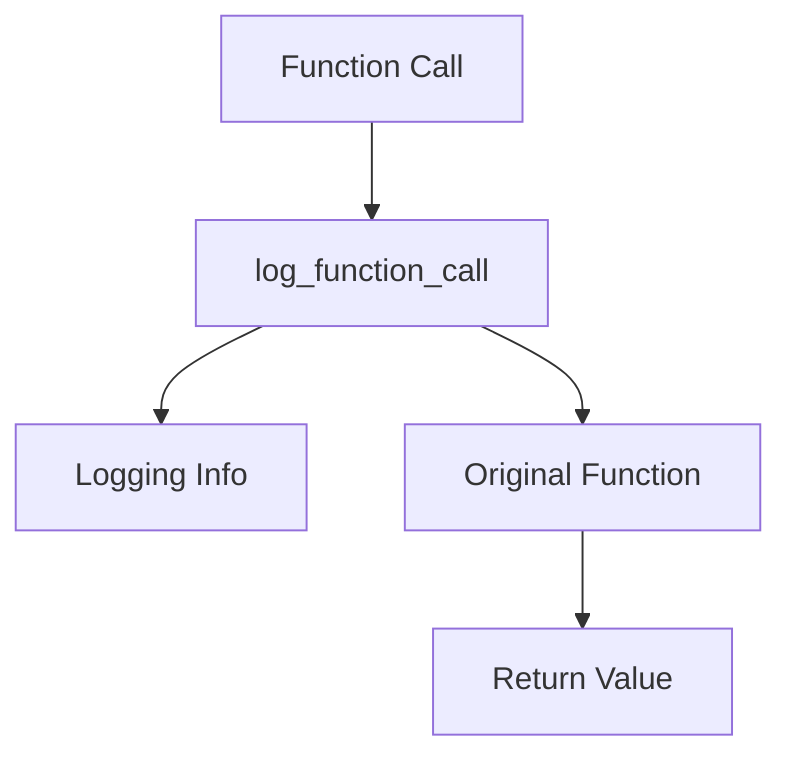
```mermaid
graph TD
    FuncCall["Function Call"]
    LogDecorator["log_function_call"]
    LogInfo["Logging Info"]
    OrigFunc["Original Function"]
    ReturnVal["Return Value"]
    FuncCall --> LogDecorator
    LogDecorator --> LogInfo
    LogDecorator --> OrigFunc
    OrigFunc --> ReturnVal
```

### 인증 데코레이터

특정 뷰나 API는 로그인된 사용자만 호출하게 만들 때, 인증 로직을 데코레이터로 묶어 재사용한다.

```python
from functools import wraps

def requires_authentication(func):
    @wraps(func)
    def wrapper(*args, **kwargs):
        if not is_authenticated():
            return "Access Denied", 403
        return func(*args, **kwargs)
    return wrapper

def is_authenticated():
    return True  # 예시

@requires_authentication
def view_profile():
    return "User Profile"

result = view_profile()
```

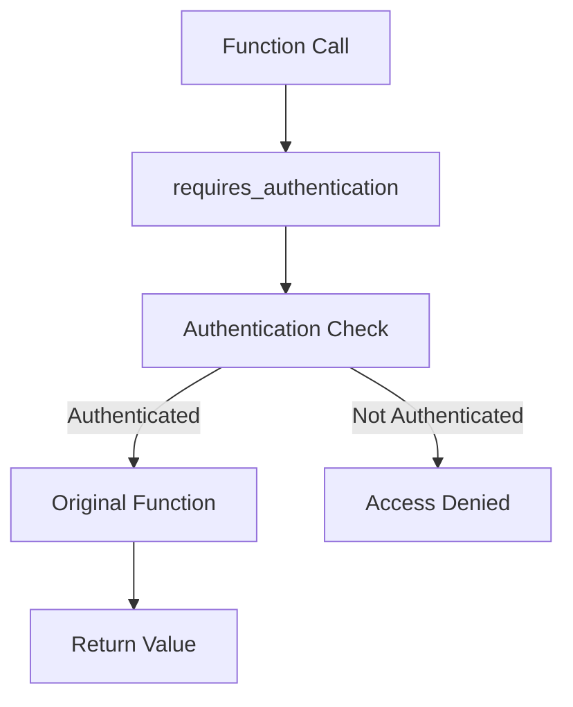
```mermaid
graph TD
    Call["Function Call"]
    AuthDec["requires_authentication"]
    AuthCheck["Authentication Check"]
    OrigFunc["Original Function"]
    AccessDenied["Access Denied"]
    ReturnVal["Return Value"]
    Call --> AuthDec
    AuthDec --> AuthCheck
    AuthCheck -->|"Authenticated"| OrigFunc
    AuthCheck -->|"Not Authenticated"| AccessDenied
    OrigFunc --> ReturnVal
```

---

## 데코레이터의 장단점

### 장점: 재사용성

같은 부가 기능(로깅, 인증, 실행 시간 측정 등)을 여러 함수에 걸 때, 데코레이터 하나로 일관되게 적용할 수 있어 중복이 줄고 유지보수가 쉬워진다.

```python
def logging_decorator(func):
    def wrapper(*args, **kwargs):
        print("Calling function: %s", func.__name__)
        result = func(*args, **kwargs)
        print("Function %s returned: %s", func.__name__, result)
        return result
    return wrapper

@logging_decorator
def add(a, b):
    return a + b

add(2, 3)
```

### 단점: 복잡도

데코레이터를 여러 겹 쌓으면 “실제로 어떤 순서로 무엇이 실행되는지” 파악이 어려워진다. 특히 서로 다른 역할의 데코레이터가 겹칠 때는 각각의 적용 순서와 역할을 명확히 두는 것이 좋다.

```python
def double_decorator(func):
    def wrapper(*args, **kwargs):
        return func(*args, **kwargs) * 2
    return wrapper

@double_decorator
@logging_decorator
def multiply(a, b):
    return a * b

multiply(2, 3)
```

이때 실행 순서는 **아래에서 위**로: 먼저 `logging_decorator`, 그 다음 `double_decorator`가 적용된다.

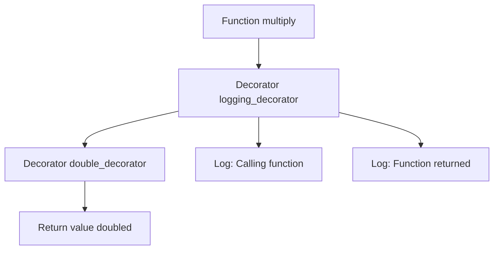
```mermaid
graph TD
    Mult["Function multiply"]
    LogDec["Decorator logging_decorator"]
    DoubleDec["Decorator double_decorator"]
    LogCall["Log: Calling function"]
    LogReturn["Log: Function returned"]
    DoubleReturn["Return value doubled"]
    Mult --> LogDec
    LogDec --> DoubleDec
    LogDec --> LogCall
    LogDec --> LogReturn
    DoubleDec --> DoubleReturn
```

---

## 데코레이터 구현 예제

### 기본 데코레이터

원본 함수 호출 전후에 메시지를 출력하는 가장 단순한 형태다.

```python
def simple_decorator(func):
    def wrapper():
        print("Before the function call")
        func()
        print("After the function call")
    return wrapper

@simple_decorator
def say_hello():
    print("Hello!")

say_hello()
```

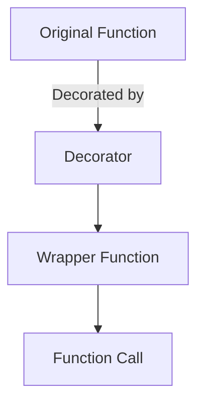
```mermaid
graph TD
    OrigFunc["Original Function"]
    DecoratorNode["Decorator"]
    WrapperFunc["Wrapper Function"]
    FuncCall["Function Call"]
    OrigFunc -->|"Decorated by"| DecoratorNode
    DecoratorNode --> WrapperFunc
    WrapperFunc --> FuncCall
```

### 인자를 받는 데코레이터

데코레이터 자체가 인자(반복 횟수, 로그 레벨 등)를 받으려면, “데코레이터를 반환하는 함수”를 한 단계 더 둔다.

```python
def repeat(num_times):
    def decorator_repeat(func):
        def wrapper(*args, **kwargs):
            for _ in range(num_times):
                func(*args, **kwargs)
        return wrapper
    return decorator_repeat

@repeat(3)
def greet(name):
    print("Hello, %s!" % name)

greet("Alice")
```

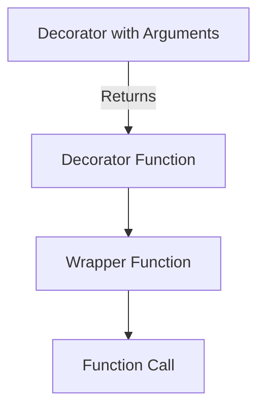
```mermaid
graph TD
    DecWithArgs["Decorator with Arguments"]
    DecFunc["Decorator Function"]
    WrapperFunc["Wrapper Function"]
    FuncCall["Function Call"]
    DecWithArgs -->|"Returns"| DecFunc
    DecFunc --> WrapperFunc
    WrapperFunc --> FuncCall
```

### 여러 데코레이터 중첩

데코레이터를 여러 개 쓸 때는 **가장 가까이 붙은 것부터** 적용된다. 아래 예에서는 먼저 `uppercase_decorator`, 그다음 `exclamation_decorator`가 적용된다.

```python
def uppercase_decorator(func):
    def wrapper(*args, **kwargs):
        result = func(*args, **kwargs)
        return result.upper()
    return wrapper

def exclamation_decorator(func):
    def wrapper(*args, **kwargs):
        result = func(*args, **kwargs)
        return result + "!"
    return wrapper

@exclamation_decorator
@uppercase_decorator
def greet(name):
    return "Hello, %s" % name

print(greet("Bob"))  # HELLO, BOB!
```

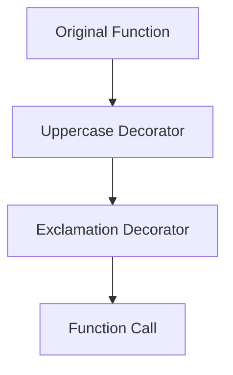
```mermaid
graph TD
    OrigFunc["Original Function"]
    UpperDec["Uppercase Decorator"]
    ExclDec["Exclamation Decorator"]
    FuncCall["Function Call"]
    OrigFunc --> UpperDec
    UpperDec --> ExclDec
    ExclDec --> FuncCall
```

---

## 데코레이터와 클로저(Closure)

### 클로저란

**클로저**는 내부 함수가 자신이 정의된 스코프의 변수를 “기억”하는 구조다. 외부 함수가 반환한 내부 함수가 호출될 때 그 변수에 접근할 수 있다. 데이터 은닉이나 상태 유지에 쓰인다.

```python
def outer_function(x):
    def inner_function(y):
        return x + y
    return inner_function

closure = outer_function(10)
print(closure(5))  # 15
```

`inner_function`은 `x`를 기억한 채 반환되며, 나중에 `closure(5)`로 호출될 때 그 값을 사용한다.

### 데코레이터와 클로저

데코레이터의 wrapper는 “외부에서 받은 `func`”를 기억한 채 반환되는 클로저다. 그래서 실제 호출 시점에 원래 함수를 정확히 참조할 수 있다.

```python
def my_decorator(func):
    def wrapper(*args, **kwargs):
        print("함수가 호출되기 전입니다.")
        result = func(*args, **kwargs)
        print("함수가 호출된 후입니다.")
        return result
    return wrapper

@my_decorator
def say_hello(name):
    print("안녕하세요, %s!" % name)

say_hello("홍길동")
```

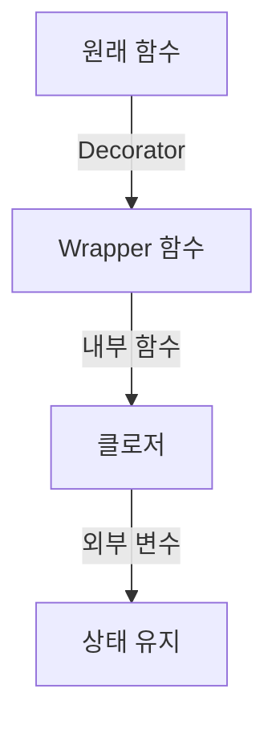
```mermaid
graph TD
    OrigFunc["원래 함수"]
    WrapperFunc["Wrapper 함수"]
    ClosureNode["클로저"]
    StateKeep["상태 유지"]
    OrigFunc -->|"Decorator"| WrapperFunc
    WrapperFunc -->|"내부 함수"| ClosureNode
    ClosureNode -->|"외부 변수"| StateKeep
```

---

## 데코레이터와 디버깅

### 사용 시 주의사항

1. **가독성**: 데코레이터는 한 가지 일만 하도록 두고, 과도하게 중첩하지 않는다.
2. **예외 처리**: 데코레이터 안에서 원본 함수의 예외가 그대로 전파되도록 하거나, 필요하면 명시적으로 처리한다.
3. **인자 전달**: wrapper는 `*args, **kwargs`로 받아 그대로 원본 함수에 넘겨야 다양한 시그니처에 대응할 수 있다.
4. **디버깅**: `pdb`나 IDE 디버거로 “실제로 어떤 함수가 호출되는지” 한 번씩 따라가 보면 순서가 명확해진다.

### functools.wraps로 메타데이터 유지

데코레이터가 반환하는 것은 “wrapper 함수”이기 때문에, `__name__`, `__doc__` 등이 wrapper 기준으로 바뀐다. 도구나 문서 생성 시 혼란이 생기므로 `functools.wraps`로 원본 함수의 메타데이터를 복사해 둔다.

```python
from functools import wraps

def my_decorator(func):
    @wraps(func)
    def wrapper(*args, **kwargs):
        print("Before the function call")
        result = func(*args, **kwargs)
        print("After the function call")
        return result
    return wrapper

@my_decorator
def say_hello(name):
    """This function greets a person."""
    print("Hello, %s!" % name)

print(say_hello.__name__)  # say_hello
print(say_hello.__doc__)   # This function greets a person.
```

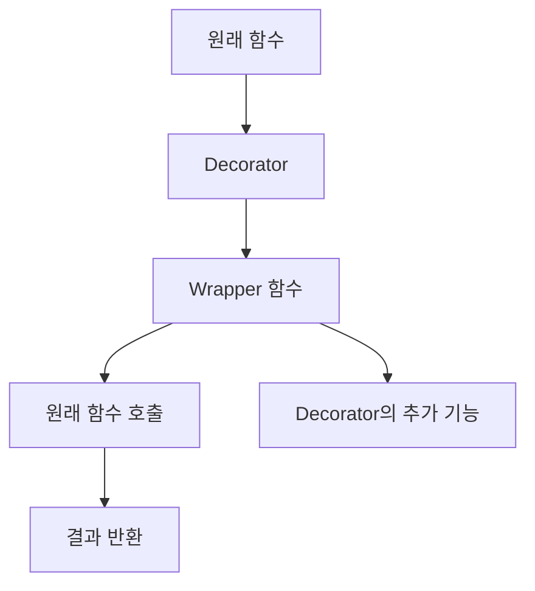
```mermaid
graph TD
    OrigFunc["원래 함수"]
    DecoratorNode["Decorator"]
    WrapperFunc["Wrapper 함수"]
    OrigCall["원래 함수 호출"]
    Result["결과 반환"]
    ExtraFeature["Decorator의 추가 기능"]
    OrigFunc --> DecoratorNode
    DecoratorNode --> WrapperFunc
    WrapperFunc --> OrigCall
    OrigCall --> Result
    WrapperFunc --> ExtraFeature
```

---

## FAQ

### 데코레이터는 언제 쓰면 좋나요?

로깅, 인증, 성능 측정, 캐싱, 재시도 같은 **여러 함수에 공통으로 적용할 부가 기능**이 있을 때 쓰면 좋다. 한 곳에서 정의해 두고 `@decorator`만 붙여 재사용할 수 있다.

### 데코레이터를 여러 개 붙일 수 있나요?

가능하다. 아래에 쓴 데코레이터가 먼저 적용되고, 위에 쓴 데코레이터가 나중에 적용된다. `@a` / `@b` / `def f`라면 `f`가 먼저 `b`로 감싸지고, 그 결과가 다시 `a`로 감싸진다.

### 성능에는 어떤 영향이 있나요?

함수 호출마다 wrapper가 한 번 더 실행되므로 아주 미세한 오버헤드는 있다. 대부분의 서비스에서는 무시할 수준이고, 극한의 성능이 필요한 구간에서는 데코레이터 대신 인라인 로직을 고려할 수 있다.

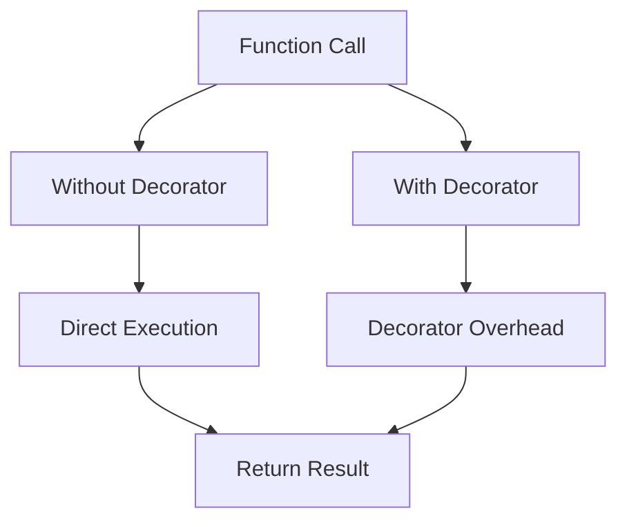
```mermaid
graph TD
    FuncCall["Function Call"]
    WithoutDec["Without Decorator"]
    WithDec["With Decorator"]
    DirectExec["Direct Execution"]
    DecOverhead["Decorator Overhead"]
    ReturnResult["Return Result"]
    FuncCall --> WithoutDec
    FuncCall --> WithDec
    WithoutDec --> DirectExec
    WithDec --> DecOverhead
    DirectExec --> ReturnResult
    DecOverhead --> ReturnResult
```

---

## 관련 개념

### 함수형 프로그래밍

Python에서는 함수가 일급 객체라 변수에 넣거나, 인자·반환값으로 쓸 수 있다. 데코레이터는 “함수를 받아 함수를 반환한다”는 고차 함수 패턴의 대표 예시다.

### 메타프로그래밍

데코레이터는 “코드가 코드를 수정하는” 메타프로그래밍의 한 형태다. 클래스나 함수를 정의 시점에 감싸거나 바꿔서 동작을 확장한다.

### 고차 함수(Higher-order function)

고차 함수는 함수를 인자로 받거나 함수를 반환하는 함수다. 데코레이터는 둘 다 수행하므로 고차 함수이다.

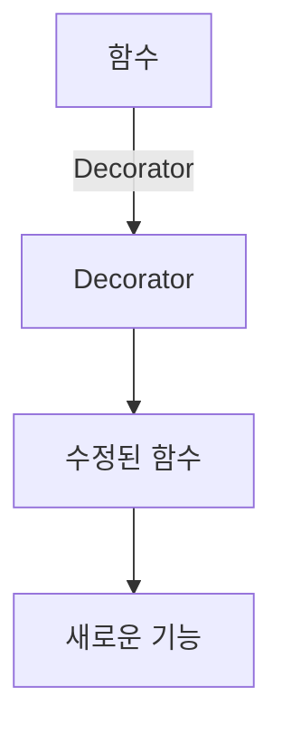
```mermaid
graph TD
    FuncNode["함수"]
    DecoratorNode["Decorator"]
    ModifiedFunc["수정된 함수"]
    NewFeature["새로운 기능"]
    FuncNode -->|"Decorator"| DecoratorNode
    DecoratorNode --> ModifiedFunc
    ModifiedFunc --> NewFeature
```

---

## 결론

- 데코레이터는 **기존 함수를 수정하지 않고** 전후 동작이나 반환값을 확장하는 패턴이다.
- `@decorator` 문법으로 선언적으로 적용할 수 있고, Flask 라우팅·로깅·인증 등 실무에서 널리 쓰인다.
- wrapper를 쓸 때는 **`functools.wraps`**로 `__name__`, `__doc__` 등을 유지하면 디버깅과 문서화에 유리하다.
- 여러 데코레이터를 쓸 때는 **적용 순서**(아래 → 위)와 각 데코레이터의 역할을 명확히 두면 유지보수가 쉬워진다.

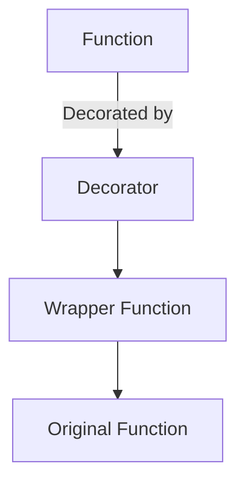
```mermaid
graph TD
    FuncNode["Function"]
    DecoratorNode["Decorator"]
    WrapperNode["Wrapper Function"]
    OrigFunc["Original Function"]
    FuncNode -->|"Decorated by"| DecoratorNode
    DecoratorNode --> WrapperNode
    WrapperNode --> OrigFunc
```

---

## 추가 자료

### 추천 자료

- **Fluent Python** (Luciano Ramalho): Python 객체·함수·데코레이터를 깊게 다룬다.
- **Python Cookbook** (David Beazley, Brian K. Jones): 실용적인 데코레이터 예제와 패턴이 많다.
- [Real Python](https://realpython.com): 데코레이터를 비롯한 Python 튜토리얼이 잘 정리되어 있다.
- [Stack Overflow](https://stackoverflow.com): Python decorator 태그로 실전 질문·답변을 찾기 좋다.

### 실행 시간 측정 예제

```python
import time

def timer_decorator(func):
    def wrapper(*args, **kwargs):
        start_time = time.time()
        result = func(*args, **kwargs)
        end_time = time.time()
        print("Execution time: %.4f seconds" % (end_time - start_time))
        return result
    return wrapper

@timer_decorator
def sample_function(n):
    total = 0
    for i in range(n):
        total += i
    return total

sample_function(1000000)
```

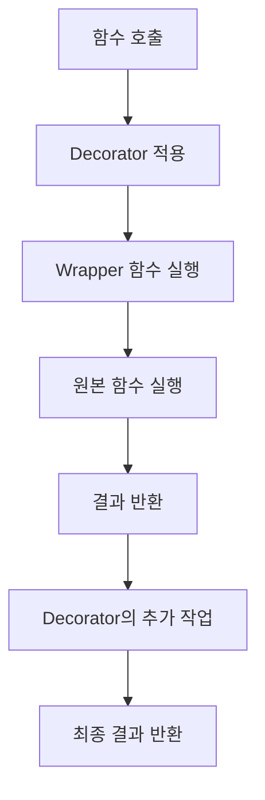
```mermaid
graph TD
    Call["함수 호출"]
    ApplyDec["Decorator 적용"]
    WrapperRun["Wrapper 함수 실행"]
    OrigRun["원본 함수 실행"]
    Result["결과 반환"]
    ExtraWork["Decorator의 추가 작업"]
    FinalResult["최종 결과 반환"]
    Call --> ApplyDec
    ApplyDec --> WrapperRun
    WrapperRun --> OrigRun
    OrigRun --> Result
    Result --> ExtraWork
    ExtraWork --> FinalResult
```

---

## Reference

- [bluese05 – python decorator (데코레이터) 어렵지 않아요](https://bluese05.tistory.com/30)
- [파이썬 코딩 도장 – 42.1 데코레이터 만들기](https://dojang.io/mod/page/view.php?id=2427)
- [DEV – Decorators in Python](https://dev.to/hakeem/decorators-in-python-6ck)
- [Medium – [번역] python의 함수 decorators 가이드](https://medium.com/sjk5766/%EB%B2%88%EC%97%AD-python%EC%9D%98-%ED%95%A8%EC%88%98-decorators-%EA%B0%80%EC%9D%B4%EB%93%9C-2cd9d5151a1d)
- [스쿨오브웹 – 파이썬 데코레이터 (Decorator)](https://schoolofweb.net/posts/%ED%8C%8C%EC%9D%B4%EC%8D%AC-%EB%8D%B0%EC%BD%94%EB%A0%88%EC%9D%B4%ED%84%B0-decorator)
- [smart-worker – [Python] 초보자를 위한 데코레이터(Decorator) 사용법](https://smart-worker.tistory.com/48)
