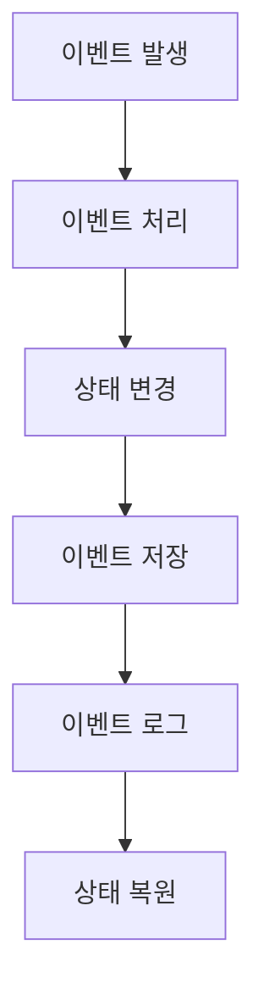
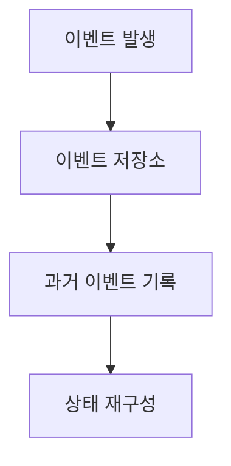
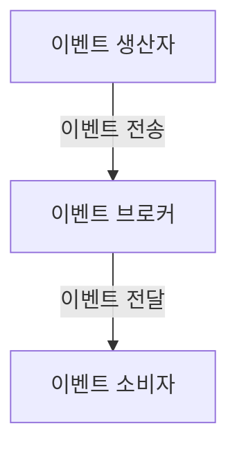
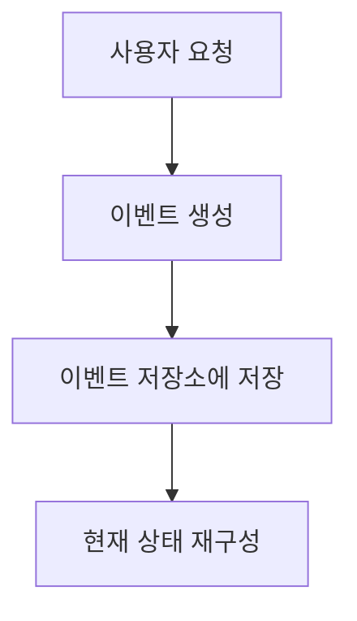
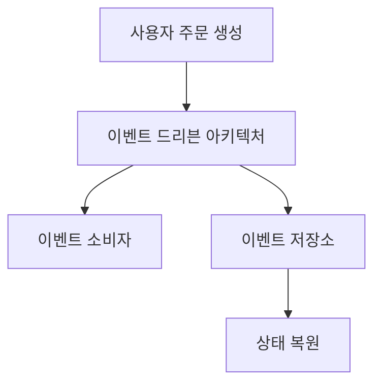
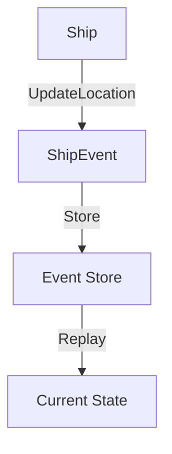
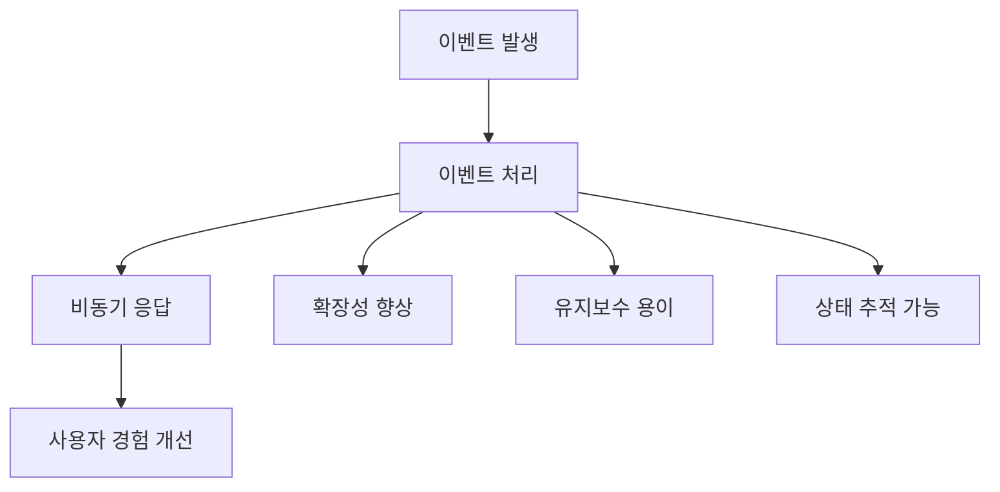
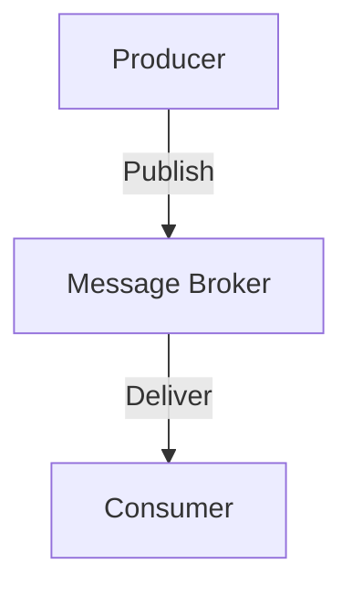
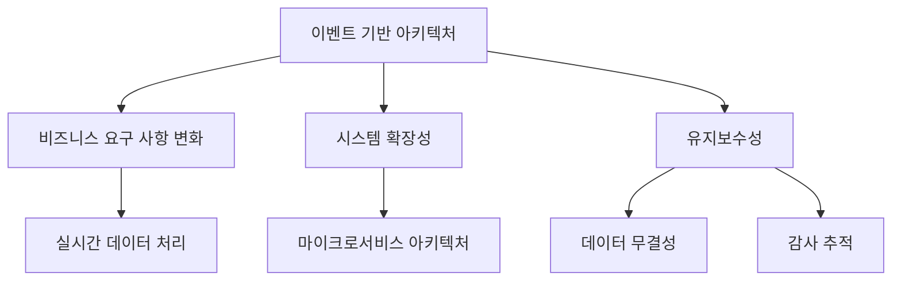
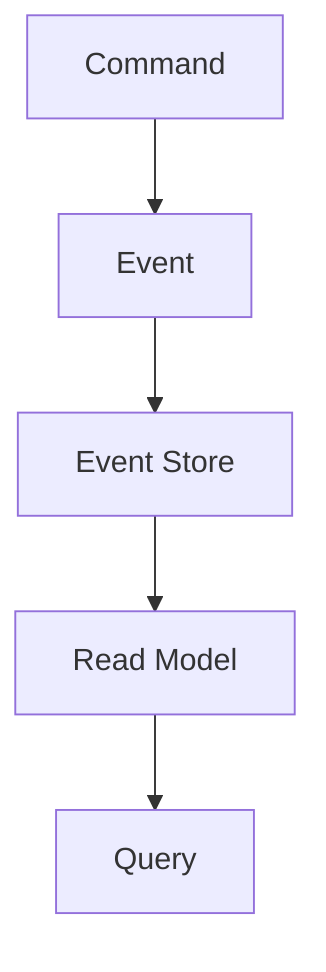

오늘날 소프트웨어 개발의 세계에서 이벤트 기반 아키텍처(Event Driven Architecture, EDA)는 점점 더 많은 주목을 받고 있다. 이는 시스템 간의 비동기적이고 느슨한 결합을 통해 다양한 구성 요소가 서로 상호작용할 수 있도록 지원하는 소프트웨어 아키텍처의 패러다임이다. 이벤트는 시스템 내에서 발생하는 중요한 상태 변화나 행동을 나타내며, 이러한 이벤트는 생산자에 의해 생성되고 소비자에 의해 처리된다. 이벤트 기반 아키텍처는 마이크로서비스 아키텍처와 결합되어, 각 서비스가 독립적으로 동작하면서도 서로의 이벤트를 구독하고 처리할 수 있는 유연성을 제공한다. 이로 인해 시스템의 확장성과 복원력이 향상되며, 각 서비스는 자신의 비즈니스 로직에 집중할 수 있다. 그러나 이벤트 기반 아키텍처를 구현하는 데는 여러 가지 도전 과제가 존재하며, 특히 이벤트의 순서 보장, 오류 처리, 데이터 일관성 유지 등의 문제를 해결해야 한다. 이러한 문제를 해결하기 위해 이벤트 소싱(Event Sourcing)과 같은 패턴이 사용되며, 이는 모든 상태 변경을 이벤트로 기록하고 이를 기반으로 시스템의 현재 상태를 재구성하는 방법이다. 이벤트 기반 아키텍처는 현대의 분산 시스템에서 중요한 역할을 하며, 앞으로도 그 중요성은 더욱 커질 것으로 예상된다.

<!--
##### Outline #####
-->

<!--
# 목차

## 개요
   - 이벤트 기반 아키텍처의 중요성
   - 이벤트 드리븐(Event-Driven)과 이벤트 소싱(Event Sourcing)의 차이

## 이벤트의 정의
   - 이벤트의 특성
   - 이벤트의 불변성 및 과거 기록

## 이벤트 기반 아키텍처 (Event-Driven Architecture)
   - 3.1. 이벤트 드리븐 아키텍처의 개념
   - 3.2. 비동기 통신과 이벤트 처리
   - 3.3. 이벤트 생산자, 소비자, 브로커의 역할
   - 3.4. 이벤트 처리 패턴
       - 단순 이벤트 처리
       - 기본 이벤트 상관 관계
       - 복합 이벤트 처리
       - 이벤트 스트림 처리
   - 3.5. 이벤트 기반 아키텍처의 장점과 단점

## 이벤트 소싱 (Event Sourcing)
   - 4.1. 이벤트 소싱의 개념
   - 4.2. 상태 변경의 기록
   - 4.3. 이벤트 저장소(Event Store)의 역할
   - 4.4. 이벤트 소싱의 장점과 단점

## 이벤트 드리븐 아키텍처와 이벤트 소싱의 상호 보완성
   - 5.1. 두 접근 방식의 통합
   - 5.2. 비즈니스 로직과 이벤트 처리의 관계
   - 5.3. 이벤트 로그를 통한 감사 추적

## 예제: 이벤트 소싱을 통한 선박 추적 (C#)
   - 6.1. 도메인 모델 설명
   - 6.2. 이벤트 처리 로직
   - 6.3. 이벤트 재생 및 상태 복원

## FAQ
   - 7.1. 이벤트 기반 아키텍처의 주요 이점은 무엇인가요?
   - 7.2. 이벤트 소싱을 사용할 때의 단점은 무엇인가요?
   - 7.3. 이벤트 드리븐 아키텍처와 REST API의 차이점은 무엇인가요?
   - 7.4. 이벤트 소싱을 구현할 때 주의해야 할 점은 무엇인가요?

## 관련 기술
   - 8.1. 메시지 브로커 (Kafka, RabbitMQ 등)
   - 8.2. CQRS (Command Query Responsibility Segregation)
   - 8.3. 마이크로서비스 아키텍처 (Microservices Architecture)

## 결론
   - 이벤트 기반 아키텍처와 이벤트 소싱의 미래
   - 소프트웨어 개발에서의 중요성 및 적용 가능성

## 참고 자료
   - 관련 서적 및 논문
   - 온라인 강의 및 자료 링크

이 목차는 이벤트 기반 아키텍처와 이벤트 소싱에 대한 포괄적인 이해를 제공하며, 각 섹션은 독자가 이 두 가지 개념을 명확히 이해하고 활용할 수 있도록 돕기 위해 구성되었습니다.
-->

<!--
## 개요
   - 이벤트 기반 아키텍처의 중요성
   - 이벤트 드리븐(Event-Driven)과 이벤트 소싱(Event Sourcing)의 차이
-->

## 개요

이벤트 기반 아키텍처는 현대 소프트웨어 시스템에서 점점 더 중요해지고 있다. 이는 시스템의 유연성과 확장성을 높여주며, 다양한 서비스 간의 비동기 통신을 가능하게 한다. 이러한 아키텍처는 특히 마이크로서비스 아키텍처와 잘 어울리며, 각 서비스가 독립적으로 이벤트를 생성하고 처리할 수 있도록 한다. 이로 인해 시스템의 복잡성을 줄이고, 장애 발생 시에도 전체 시스템에 미치는 영향을 최소화할 수 있다.

**이벤트 기반 아키텍처의 중요성**

이벤트 기반 아키텍처는 다음과 같은 이유로 중요하다:

1. **비동기 처리**: 이벤트 기반 아키텍처는 비동기 통신을 통해 서비스 간의 결합도를 낮춘다. 이는 시스템의 성능을 향상시키고, 사용자 경험을 개선하는 데 기여한다.
   
2. **확장성**: 이벤트를 통해 서비스가 독립적으로 확장될 수 있다. 새로운 서비스가 기존 시스템에 쉽게 통합될 수 있으며, 필요에 따라 서비스의 수를 조정할 수 있다.

3. **유연성**: 이벤트 기반 아키텍처는 다양한 이벤트 소스와 소비자를 지원하므로, 시스템의 요구 사항이 변화하더라도 유연하게 대응할 수 있다.

4. **장애 복구**: 이벤트 로그를 통해 시스템의 상태를 복원할 수 있어, 장애 발생 시에도 빠르게 복구할 수 있다.

**이벤트 드리븐(Event-Driven)과 이벤트 소싱(Event Sourcing)의 차이**

이벤트 드리븐 아키텍처와 이벤트 소싱은 서로 다른 개념이지만, 함께 사용될 수 있다. 

- **이벤트 드리븐 아키텍처**는 시스템의 구성 요소가 이벤트를 통해 상호작용하는 방식을 의미한다. 이 아키텍처에서는 이벤트가 발생하면 해당 이벤트를 처리하는 소비자가 존재하며, 이로 인해 비동기적으로 작업이 수행된다.

- **이벤트 소싱**은 상태 변경을 이벤트로 기록하는 방식이다. 즉, 시스템의 현재 상태는 과거의 모든 이벤트를 통해 재구성할 수 있다. 이벤트 소싱을 사용하면 데이터의 불변성을 유지할 수 있으며, 시스템의 상태를 쉽게 추적하고 감사할 수 있다.

이 두 개념은 서로 보완적이며, 이벤트 기반 아키텍처에서 이벤트 소싱을 활용하면 더욱 강력한 시스템을 구축할 수 있다.



위의 다이어그램은 이벤트 발생부터 상태 복원까지의 흐름을 나타낸다. 이벤트가 발생하면 이를 처리하고, 상태를 변경한 후 이벤트를 저장하여 이벤트 로그를 생성한다. 이 로그는 나중에 시스템의 상태를 복원하는 데 사용될 수 있다. 

이와 같이 이벤트 기반 아키텍처와 이벤트 소싱은 현대 소프트웨어 개발에서 중요한 역할을 하며, 이를 통해 더욱 효율적이고 유연한 시스템을 구축할 수 있다.

<!--
## 이벤트의 정의
   - 이벤트의 특성
   - 이벤트의 불변성 및 과거 기록
-->

## 이벤트의 정의

이벤트는 시스템 내에서 발생하는 중요한 상태 변화나 행동을 나타내는 개념이다. 이벤트는 소프트웨어 아키텍처에서 중요한 역할을 하며, 특히 이벤트 기반 아키텍처와 이벤트 소싱에서 핵심적인 요소로 작용한다. 이번 섹션에서는 이벤트의 특성과 불변성, 그리고 과거 기록에 대해 살펴보겠다.

### **이벤트의 특성**

이벤트는 다음과 같은 몇 가지 특성을 가진다:

1. **명확한 발생 시점**: 이벤트는 특정 시점에 발생하며, 이 시점은 이벤트의 타임스탬프에 기록된다.
2. **상태 변화의 표현**: 이벤트는 시스템의 상태가 어떻게 변화했는지를 나타낸다. 예를 들어, "주문이 생성됨"이라는 이벤트는 주문 상태가 생성으로 변경되었음을 의미한다.
3. **비즈니스 의미**: 이벤트는 비즈니스 도메인에서 중요한 의미를 가지며, 이를 통해 비즈니스 로직을 구현할 수 있다.
4. **비동기성**: 이벤트는 비동기적으로 처리될 수 있으며, 이는 시스템의 확장성과 성능을 높이는 데 기여한다.

이러한 특성 덕분에 이벤트는 시스템 간의 통신 및 데이터 흐름을 효율적으로 관리할 수 있게 해준다.

### **이벤트의 불변성 및 과거 기록**

이벤트는 불변성을 가진다. 즉, 한 번 발생한 이벤트는 변경될 수 없으며, 이는 이벤트 소싱의 핵심 원칙 중 하나이다. 불변성은 다음과 같은 장점을 제공한다:

- **신뢰성**: 이벤트가 불변이기 때문에, 시스템의 상태를 재구성할 때 과거의 이벤트를 신뢰할 수 있다.
- **감사 추적**: 모든 이벤트가 기록되므로, 시스템의 모든 상태 변화에 대한 감사 추적이 가능하다. 이는 규제 준수 및 문제 해결에 유용하다.

이벤트의 과거 기록은 이벤트 저장소(Event Store)에 저장된다. 이벤트 저장소는 모든 이벤트를 시간 순서대로 저장하며, 이를 통해 시스템의 상태를 언제든지 재구성할 수 있다. 예를 들어, 특정 시점의 상태를 복원하기 위해서는 해당 시점까지의 모든 이벤트를 재생하면 된다.

다음은 이벤트의 불변성과 과거 기록을 설명하는 간단한 다이어그램이다:



이 다이어그램은 이벤트가 발생하고, 이벤트 저장소에 저장되며, 이를 통해 과거의 상태를 재구성하는 과정을 나타낸다. 이벤트 기반 아키텍처와 이벤트 소싱에서 이벤트의 특성과 불변성은 시스템의 신뢰성과 유연성을 높이는 데 중요한 역할을 한다.

<!--
## 이벤트 기반 아키텍처 (Event-Driven Architecture)
   - 3.1. 이벤트 드리븐 아키텍처의 개념
   - 3.2. 비동기 통신과 이벤트 처리
   - 3.3. 이벤트 생산자, 소비자, 브로커의 역할
   - 3.4. 이벤트 처리 패턴
       - 단순 이벤트 처리
       - 기본 이벤트 상관 관계
       - 복합 이벤트 처리
       - 이벤트 스트림 처리
   - 3.5. 이벤트 기반 아키텍처의 장점과 단점
-->

## 이벤트 기반 아키텍처 (Event-Driven Architecture)

이벤트 기반 아키텍처는 소프트웨어 시스템에서 이벤트를 중심으로 구성된 아키텍처 스타일이다. 이 아키텍처는 시스템의 구성 요소 간의 느슨한 결합을 촉진하며, 비동기적이고 반응적인 시스템을 구축하는 데 유용하다. 이벤트는 시스템 내에서 발생하는 중요한 상태 변화나 행동을 나타내며, 이러한 이벤트를 통해 시스템의 다양한 구성 요소가 상호작용하게 된다.

### 이벤트 드리븐 아키텍처의 개념

이벤트 드리븐 아키텍처는 이벤트를 중심으로 시스템을 설계하는 접근 방식이다. 이 아키텍처에서는 이벤트가 발생하면 이를 처리하기 위한 다양한 구성 요소가 반응하게 된다. 이러한 방식은 시스템의 확장성과 유연성을 높이며, 다양한 비즈니스 요구 사항에 적응할 수 있는 능력을 제공한다.

### 비동기 통신과 이벤트 처리

비동기 통신은 이벤트 기반 아키텍처의 핵심 요소 중 하나이다. 비동기 통신을 통해 이벤트 생산자는 이벤트를 생성하고, 이를 이벤트 브로커에 전달한다. 이벤트 소비자는 브로커로부터 이벤트를 수신하여 처리하게 된다. 이 과정에서 이벤트 생산자와 소비자는 서로 독립적으로 동작할 수 있으며, 이는 시스템의 성능과 확장성을 향상시킨다.



### 이벤트 생산자, 소비자, 브로커의 역할

이벤트 기반 아키텍처에서 각 구성 요소는 특정한 역할을 수행한다. 

- **이벤트 생산자**: 이벤트를 생성하고 이를 이벤트 브로커에 전송하는 역할을 한다. 예를 들어, 사용자 행동이나 시스템 상태 변화가 이벤트로 생성될 수 있다.
  
- **이벤트 소비자**: 이벤트 브로커로부터 이벤트를 수신하고 이를 처리하는 역할을 한다. 소비자는 이벤트에 따라 다양한 작업을 수행할 수 있다.
  
- **이벤트 브로커**: 이벤트 생산자와 소비자 간의 중개 역할을 하며, 이벤트를 수집하고 필요한 소비자에게 전달하는 역할을 한다. 메시지 큐나 스트리밍 플랫폼이 이 역할을 수행할 수 있다.

### 이벤트 처리 패턴

이벤트 기반 아키텍처에서는 다양한 이벤트 처리 패턴이 존재한다. 각 패턴은 특정한 요구 사항에 맞춰 설계되며, 다음과 같은 패턴이 있다.

- **단순 이벤트 처리**: 단일 이벤트를 수신하고 처리하는 가장 기본적인 패턴이다. 이벤트 소비자는 이벤트를 수신한 후 즉시 처리한다.

- **기본 이벤트 상관 관계**: 여러 이벤트 간의 관계를 정의하고, 특정 이벤트가 발생했을 때 관련된 다른 이벤트를 처리하는 패턴이다.

- **복합 이벤트 처리**: 여러 개의 이벤트를 조합하여 새로운 이벤트를 생성하는 패턴이다. 이 패턴은 복잡한 비즈니스 로직을 처리하는 데 유용하다.

- **이벤트 스트림 처리**: 지속적으로 발생하는 이벤트 스트림을 처리하는 패턴이다. 이 패턴은 실시간 데이터 분석 및 모니터링에 적합하다.

### 이벤트 기반 아키텍처의 장점과 단점

이벤트 기반 아키텍처는 여러 가지 장점과 단점을 가지고 있다.

**장점**:
- 시스템의 확장성과 유연성을 높인다.
- 비동기 처리를 통해 성능을 향상시킨다.
- 구성 요소 간의 느슨한 결합을 통해 유지보수성을 높인다.

**단점**:
- 시스템의 복잡성이 증가할 수 있다.
- 이벤트의 순서 보장 및 중복 처리 문제를 해결해야 한다.
- 디버깅 및 모니터링이 어려울 수 있다.

이벤트 기반 아키텍처는 현대 소프트웨어 개발에서 중요한 역할을 하며, 다양한 비즈니스 요구 사항을 충족하는 데 유용한 접근 방식이다.

<!--
## 이벤트 소싱 (Event Sourcing)
   - 4.1. 이벤트 소싱의 개념
   - 4.2. 상태 변경의 기록
   - 4.3. 이벤트 저장소(Event Store)의 역할
   - 4.4. 이벤트 소싱의 장점과 단점
-->

## 이벤트 소싱 (Event Sourcing)

### 이벤트 소싱의 개념

이벤트 소싱(Event Sourcing)은 애플리케이션의 상태를 이벤트의 연속으로 저장하는 아키텍처 패턴이다. 전통적인 CRUD(Create, Read, Update, Delete) 방식과는 달리, 상태 변경을 직접 저장하는 것이 아니라, 상태 변경을 유발한 이벤트를 기록하여 시스템의 상태를 재구성하는 방식이다. 이러한 접근은 데이터의 불변성을 보장하며, 시스템의 모든 상태 변경 이력을 추적할 수 있는 장점을 제공한다.

### 상태 변경의 기록

이벤트 소싱에서는 모든 상태 변경이 이벤트로 기록된다. 예를 들어, 사용자가 계좌에 돈을 입금하는 경우, "돈이 입금되었다"는 이벤트가 생성된다. 이 이벤트는 단순히 상태를 변경하는 것이 아니라, 과거의 모든 상태 변경을 기록하여 나중에 재구성할 수 있도록 한다. 이러한 방식은 시스템의 상태를 쉽게 복원할 수 있게 하며, 디버깅 및 감사 추적에도 유용하다.



### 이벤트 저장소(Event Store)의 역할

이벤트 저장소는 이벤트 소싱 아키텍처의 핵심 구성 요소로, 모든 이벤트를 영구적으로 저장하는 역할을 한다. 이벤트 저장소는 단순한 데이터베이스와는 다르게, 이벤트를 시간 순서대로 저장하며, 각 이벤트는 고유한 식별자를 가진다. 이를 통해 개발자는 특정 시점의 상태를 재구성하거나, 특정 이벤트에 대한 처리를 쉽게 수행할 수 있다. 이벤트 저장소는 또한 이벤트의 불변성을 보장하여, 데이터의 무결성을 유지하는 데 기여한다.

### 이벤트 소싱의 장점과 단점

이벤트 소싱은 여러 가지 장점을 제공하지만, 몇 가지 단점도 존재한다. 

**장점:**

- **불변성:** 이벤트는 한 번 생성되면 변경할 수 없으므로, 데이터의 무결성을 보장한다.
- **상태 재구성:** 과거의 모든 이벤트를 통해 시스템의 상태를 언제든지 재구성할 수 있다.
- **감사 추적:** 모든 상태 변경 이력을 기록하므로, 감사 및 디버깅이 용이하다.

**단점:**

- **복잡성:** 이벤트 소싱을 구현하는 데 필요한 추가적인 복잡성이 존재한다.
- **이벤트 스키마 관리:** 이벤트의 스키마가 변경될 경우, 이전 이벤트와의 호환성을 유지하는 것이 어려울 수 있다.
- **성능 문제:** 이벤트의 수가 많아질수록 상태 재구성 시 성능 저하가 발생할 수 있다.

이벤트 소싱은 이러한 장점과 단점을 고려하여 적절한 상황에서 활용해야 한다.

<!--
## 이벤트 드리븐 아키텍처와 이벤트 소싱의 상호 보완성
   - 5.1. 두 접근 방식의 통합
   - 5.2. 비즈니스 로직과 이벤트 처리의 관계
   - 5.3. 이벤트 로그를 통한 감사 추적
-->

## 이벤트 드리븐 아키텍처와 이벤트 소싱의 상호 보완성

이벤트 드리븐 아키텍처(Event-Driven Architecture)와 이벤트 소싱(Event Sourcing)은 서로 다른 개념이지만, 이 두 접근 방식은 함께 사용될 때 강력한 시너지를 발휘할 수 있다. 이 섹션에서는 두 접근 방식의 통합, 비즈니스 로직과 이벤트 처리의 관계, 그리고 이벤트 로그를 통한 감사 추적에 대해 살펴보겠다.

### 두 접근 방식의 통합

이벤트 드리븐 아키텍처는 시스템의 구성 요소 간의 비동기 통신을 통해 이벤트를 기반으로 동작하는 반면, 이벤트 소싱은 상태 변경을 이벤트로 기록하여 시스템의 상태를 재구성하는 방법이다. 이 두 가지 접근 방식을 통합하면, 시스템의 상태를 명확하게 추적할 수 있으며, 비즈니스 로직의 변경 사항을 쉽게 관리할 수 있다.

예를 들어, 사용자가 주문을 생성하는 이벤트가 발생하면, 이 이벤트는 이벤트 드리븐 아키텍처를 통해 다른 서비스에 전달된다. 동시에, 이 주문 생성 이벤트는 이벤트 소싱을 통해 이벤트 저장소(Event Store)에 기록되어, 나중에 상태를 복원하거나 감사 추적을 수행할 수 있다.



### 비즈니스 로직과 이벤트 처리의 관계

비즈니스 로직은 시스템의 핵심 기능을 정의하며, 이벤트 처리는 이러한 비즈니스 로직을 실행하는 방법이다. 이벤트 드리븐 아키텍처에서는 비즈니스 로직이 이벤트에 의해 트리거되며, 이로 인해 시스템의 반응성이 향상된다. 이벤트 소싱을 사용하면, 비즈니스 로직의 변경 사항을 이벤트로 기록하여, 과거의 상태를 재구성하거나 특정 시점으로 되돌릴 수 있는 유연성을 제공한다.

예를 들어, 주문 처리 과정에서 주문 상태가 변경될 때마다 해당 상태 변경을 이벤트로 기록하면, 나중에 이력을 추적하거나 특정 상태로 복원하는 것이 가능하다. 이는 비즈니스 로직의 변경이 시스템에 미치는 영향을 최소화하는 데 도움을 준다.

### 이벤트 로그를 통한 감사 추적

이벤트 소싱의 가장 큰 장점 중 하나는 모든 상태 변경이 이벤트로 기록된다는 점이다. 이로 인해 시스템의 모든 활동을 감사할 수 있는 로그가 생성된다. 이벤트 로그는 시스템의 상태를 재구성하는 데 사용될 뿐만 아니라, 보안 및 규정 준수를 위한 감사 추적에도 유용하다.

이벤트 로그를 통해 특정 사용자의 행동을 추적하거나, 시스템의 특정 시점에서의 상태를 확인할 수 있다. 이는 특히 금융 시스템이나 의료 시스템과 같이 규제가 엄격한 분야에서 매우 중요한 요소이다.

이벤트 드리븐 아키텍처와 이벤트 소싱의 통합은 시스템의 유연성과 확장성을 높이며, 비즈니스 로직의 변경을 용이하게 하고, 감사 추적을 통해 시스템의 신뢰성을 강화하는 데 기여한다. 이러한 상호 보완적인 관계는 현대 소프트웨어 아키텍처에서 점점 더 중요해지고 있다.

<!--
## 예제: 이벤트 소싱을 통한 선박 추적 (C#)
   - 6.1. 도메인 모델 설명
   - 6.2. 이벤트 처리 로직
   - 6.3. 이벤트 재생 및 상태 복원
-->

## 예제: 이벤트 소싱을 통한 선박 추적 (C#)

이 섹션에서는 이벤트 소싱을 활용하여 선박 추적 시스템을 구현하는 예제를 다룬다. 이 시스템은 선박의 상태를 관리하고, 상태 변경 이력을 기록하여 과거의 모든 상태를 재생할 수 있도록 설계된다.

### 도메인 모델 설명

선박 추적 시스템의 도메인 모델은 다음과 같은 주요 엔티티로 구성된다:

- **Ship**: 선박을 나타내는 엔티티로, 선박의 ID, 이름, 현재 위치, 상태 등의 속성을 가진다.
- **Location**: 선박의 위치 정보를 나타내는 값 객체로, 위도와 경도를 포함한다.
- **ShipEvent**: 선박의 상태 변경을 기록하는 이벤트로, 이벤트 타입(예: `LocationUpdated`), 발생 시간, 선박 ID, 위치 정보를 포함한다.

이러한 도메인 모델을 통해 선박의 상태를 관리하고, 상태 변경 이력을 이벤트로 기록할 수 있다.

```csharp
public class Ship
{
    public Guid Id { get; private set; }
    public string Name { get; private set; }
    public Location CurrentLocation { get; private set; }
    public List<ShipEvent> Events { get; private set; }

    public Ship(Guid id, string name)
    {
        Id = id;
        Name = name;
        Events = new List<ShipEvent>();
    }

    public void UpdateLocation(Location newLocation)
    {
        CurrentLocation = newLocation;
        var shipEvent = new ShipEvent("LocationUpdated", DateTime.UtcNow, Id, newLocation);
        Events.Add(shipEvent);
    }
}

public class Location
{
    public double Latitude { get; private set; }
    public double Longitude { get; private set; }

    public Location(double latitude, double longitude)
    {
        Latitude = latitude;
        Longitude = longitude;
    }
}

public class ShipEvent
{
    public string EventType { get; private set; }
    public DateTime OccurredOn { get; private set; }
    public Guid ShipId { get; private set; }
    public Location Location { get; private set; }

    public ShipEvent(string eventType, DateTime occurredOn, Guid shipId, Location location)
    {
        EventType = eventType;
        OccurredOn = occurredOn;
        ShipId = shipId;
        Location = location;
    }
}
```

### 이벤트 처리 로직

이벤트 처리 로직은 선박의 상태 변경 이벤트를 수신하고, 이를 처리하여 시스템의 상태를 업데이트하는 역할을 한다. 이벤트는 메시지 브로커를 통해 전달되며, 이벤트 핸들러가 이를 수신하여 적절한 작업을 수행한다.

```csharp
public class ShipEventHandler
{
    public void Handle(ShipEvent shipEvent)
    {
        // 이벤트 타입에 따라 처리 로직을 분기
        if (shipEvent.EventType == "LocationUpdated")
        {
            // 위치 업데이트 로직
            UpdateShipLocation(shipEvent.ShipId, shipEvent.Location);
        }
    }

    private void UpdateShipLocation(Guid shipId, Location newLocation)
    {
        // 데이터베이스 또는 상태 저장소에서 선박 정보를 조회하고 업데이트
        // 예: shipRepository.UpdateLocation(shipId, newLocation);
    }
}
```

### 이벤트 재생 및 상태 복원

이벤트 소싱의 핵심은 과거의 모든 이벤트를 기반으로 현재 상태를 재생할 수 있다는 점이다. 이를 위해, 시스템은 저장된 이벤트를 순차적으로 재생하여 현재 상태를 복원한다.

```csharp
public class ShipRepository
{
    public Ship GetShipById(Guid shipId)
    {
        // 이벤트 저장소에서 해당 선박의 모든 이벤트를 조회
        var events = GetEventsForShip(shipId);
        var ship = new Ship(shipId, "Sample Ship");

        foreach (var shipEvent in events)
        {
            // 이벤트 타입에 따라 상태를 업데이트
            if (shipEvent.EventType == "LocationUpdated")
            {
                ship.UpdateLocation(shipEvent.Location);
            }
        }

        return ship;
    }

    private List<ShipEvent> GetEventsForShip(Guid shipId)
    {
        // 이벤트 저장소에서 선박의 이벤트를 조회하는 로직
        return new List<ShipEvent>(); // 실제 구현 필요
    }
}
```



위의 다이어그램은 선박의 상태 업데이트 과정과 이벤트 저장소를 통한 상태 재생 과정을 나타낸다. 이벤트 소싱을 통해 시스템은 과거의 모든 상태를 기록하고, 필요할 때마다 이를 재생하여 현재 상태를 복원할 수 있다. 이러한 방식은 데이터의 불변성을 보장하고, 감사 추적 및 디버깅에 유리한 장점을 제공한다.

<!--
## FAQ
   - 7.1. 이벤트 기반 아키텍처의 주요 이점은 무엇인가요?
   - 7.2. 이벤트 소싱을 사용할 때의 단점은 무엇인가요?
   - 7.3. 이벤트 드리븐 아키텍처와 REST API의 차이점은 무엇인가요?
   - 7.4. 이벤트 소싱을 구현할 때 주의해야 할 점은 무엇인가요?
-->

## FAQ

### 이벤트 기반 아키텍처의 주요 이점은 무엇인가요?

이벤트 기반 아키텍처(Event-Driven Architecture, EDA)는 여러 가지 주요 이점을 제공한다. 첫째, 비동기 처리로 인해 시스템의 응답성이 향상된다. 이벤트가 발생하면 즉시 처리할 수 있으며, 이는 사용자 경험을 개선하는 데 기여한다. 둘째, 시스템의 확장성이 뛰어나며, 새로운 이벤트 소비자를 추가하는 것이 용이하다. 셋째, 서비스 간의 결합도가 낮아져 유지보수가 용이해진다. 마지막으로, 이벤트 로그를 통해 시스템의 상태를 쉽게 추적하고 감사할 수 있다.



### 이벤트 소싱을 사용할 때의 단점은 무엇인가요?

이벤트 소싱(Event Sourcing)은 여러 장점이 있지만, 몇 가지 단점도 존재한다. 첫째, 이벤트의 불변성으로 인해 잘못된 이벤트가 발생할 경우 수정이 어렵다. 둘째, 이벤트 저장소의 크기가 커질 수 있으며, 이는 성능 저하를 초래할 수 있다. 셋째, 복잡한 쿼리 요구 사항을 처리하기 어려울 수 있으며, 이를 위해 추가적인 데이터베이스 설계가 필요할 수 있다. 마지막으로, 이벤트의 버전 관리가 필요하여 시스템의 복잡성이 증가할 수 있다.

### 이벤트 드리븐 아키텍처와 REST API의 차이점은 무엇인가요?

이벤트 드리븐 아키텍처와 REST API는 서로 다른 통신 모델을 기반으로 한다. REST API는 요청-응답 모델을 따르며, 클라이언트가 서버에 요청을 보내고 서버가 응답을 반환하는 구조이다. 반면, 이벤트 드리븐 아키텍처는 이벤트가 발생할 때 이를 처리하는 소비자가 존재하며, 비동기적으로 이벤트를 처리한다. 이로 인해 EDA는 더 높은 확장성과 유연성을 제공하며, 시스템 간의 결합도를 낮출 수 있다.

### 이벤트 소싱을 구현할 때 주의해야 할 점은 무엇인가요?

이벤트 소싱을 구현할 때는 몇 가지 주의해야 할 점이 있다. 첫째, 이벤트의 설계가 중요하다. 이벤트는 시스템의 상태를 정확히 반영해야 하며, 불필요한 정보는 포함하지 않아야 한다. 둘째, 이벤트의 버전 관리를 고려해야 하며, 시간이 지남에 따라 이벤트의 구조가 변경될 수 있음을 염두에 두어야 한다. 셋째, 이벤트 저장소의 성능을 고려하여 적절한 인프라를 선택해야 하며, 이벤트의 크기와 수를 관리하는 전략이 필요하다. 마지막으로, 이벤트의 재생 및 복원 로직을 신중하게 설계하여 시스템의 신뢰성을 높여야 한다.

<!--
## 관련 기술
   - 8.1. 메시지 브로커 (Kafka, RabbitMQ 등)
   - 8.2. CQRS (Command Query Responsibility Segregation)
   - 8.3. 마이크로서비스 아키텍처 (Microservices Architecture)
-->

## 관련 기술

### 메시지 브로커 (Kafka, RabbitMQ 등)

메시지 브로커는 이벤트 기반 아키텍처에서 중요한 역할을 수행하는 컴포넌트이다. 이들은 시스템 간의 비동기 통신을 가능하게 하며, 이벤트를 생산자와 소비자 간에 안전하게 전달하는 기능을 제공한다. 대표적인 메시지 브로커로는 Apache Kafka와 RabbitMQ가 있다.

**Apache Kafka**는 높은 처리량과 내구성을 제공하는 분산 스트리밍 플랫폼이다. Kafka는 이벤트를 로그 형태로 저장하며, 이를 통해 이벤트의 순서를 보장하고, 여러 소비자가 동시에 이벤트를 처리할 수 있도록 지원한다.

**RabbitMQ**는 AMQP(Advanced Message Queuing Protocol)를 기반으로 한 메시지 브로커로, 다양한 메시징 패턴을 지원한다. RabbitMQ는 메시지를 큐에 저장하고, 소비자가 이를 비동기적으로 처리할 수 있도록 한다.



### CQRS (Command Query Responsibility Segregation)

CQRS는 명령(Command)과 조회(Query)를 분리하는 아키텍처 패턴이다. 이 패턴은 데이터의 상태를 변경하는 작업과 데이터를 조회하는 작업을 분리하여, 각 작업에 최적화된 모델을 사용할 수 있도록 한다. CQRS는 이벤트 기반 아키텍처와 함께 사용될 때, 시스템의 복잡성을 줄이고 성능을 향상시킬 수 있다.

CQRS의 주요 장점은 다음과 같다:

- **성능 최적화**: 명령과 조회를 분리함으로써 각 작업에 맞는 데이터베이스를 사용할 수 있다.
- **확장성**: 명령과 조회를 독립적으로 확장할 수 있어, 시스템의 부하를 효과적으로 분산할 수 있다.
- **유연성**: 비즈니스 요구사항에 따라 명령과 조회의 모델을 독립적으로 변경할 수 있다.

### 마이크로서비스 아키텍처 (Microservices Architecture)

마이크로서비스 아키텍처는 애플리케이션을 작고 독립적인 서비스로 나누어 개발하는 접근 방식이다. 각 서비스는 특정 비즈니스 기능을 수행하며, 서로 독립적으로 배포 및 확장할 수 있다. 이벤트 기반 아키텍처는 마이크로서비스 간의 통신을 비동기적으로 처리할 수 있는 방법을 제공하여, 서비스 간의 결합도를 낮추고 유연성을 높인다.

마이크로서비스 아키텍처의 주요 특징은 다음과 같다:

- **독립성**: 각 서비스는 독립적으로 개발, 배포 및 확장할 수 있다.
- **기술 다양성**: 각 서비스는 서로 다른 기술 스택을 사용할 수 있어, 최적의 기술을 선택할 수 있다.
- **장애 격리**: 하나의 서비스가 실패하더라도 전체 시스템에 미치는 영향을 최소화할 수 있다.

이러한 관련 기술들은 이벤트 기반 아키텍처와 함께 사용될 때, 시스템의 성능과 유연성을 극대화할 수 있도록 돕는다.

<!--
## 결론
   - 이벤트 기반 아키텍처와 이벤트 소싱의 미래
   - 소프트웨어 개발에서의 중요성 및 적용 가능성
-->

## 결론

### 이벤트 기반 아키텍처와 이벤트 소싱의 미래

이벤트 기반 아키텍처(Event-Driven Architecture)와 이벤트 소싱(Event Sourcing)은 현대 소프트웨어 개발에서 점점 더 중요한 역할을 하고 있다. 이러한 아키텍처는 비즈니스 요구 사항의 변화에 유연하게 대응할 수 있는 능력을 제공하며, 시스템의 확장성과 유지보수성을 높이는 데 기여한다. 특히, 마이크로서비스 아키텍처와 결합하여 사용될 때, 이 두 가지 접근 방식은 서로의 장점을 극대화할 수 있다.

앞으로의 소프트웨어 개발에서는 데이터의 실시간 처리와 분석이 더욱 중요해질 것이며, 이벤트 기반 아키텍처는 이러한 요구를 충족시키는 데 필수적인 요소가 될 것이다. 또한, 이벤트 소싱은 시스템의 상태를 명확하게 기록하고 재생할 수 있는 기능을 제공하여, 데이터 무결성과 감사 추적을 보장하는 데 기여할 것이다.



### 소프트웨어 개발에서의 중요성 및 적용 가능성

이벤트 기반 아키텍처와 이벤트 소싱은 다양한 산업 분야에서 적용 가능성이 높다. 특히, 금융, 물류, 전자상거래와 같은 분야에서는 실시간 데이터 처리와 상태 관리가 필수적이다. 이러한 아키텍처를 통해 기업은 고객의 요구에 신속하게 대응하고, 비즈니스 프로세스를 최적화할 수 있다.

또한, 이벤트 기반 아키텍처는 클라우드 환경에서도 효과적으로 작동하며, 서버리스 아키텍처와 결합하여 비용 효율적인 솔루션을 제공할 수 있다. 이벤트 소싱은 데이터의 변경 이력을 명확히 기록함으로써, 시스템의 복잡성을 줄이고, 디버깅 및 문제 해결을 용이하게 한다.

결론적으로, 이벤트 기반 아키텍처와 이벤트 소싱은 소프트웨어 개발의 미래를 이끌어갈 중요한 기술로 자리 잡을 것이며, 이를 통해 기업은 더욱 민첩하고 효율적인 시스템을 구축할 수 있을 것이다.

<!--
## 참고 자료
   - 관련 서적 및 논문
   - 온라인 강의 및 자료 링크
-->

## 참고 자료

### 관련 서적 및 논문

**이벤트 기반 아키텍처와 이벤트 소싱에 대한 깊이 있는 이해를 원한다면 다음의 서적과 논문을 추천한다.**

1. **"Designing Event-Driven Systems: Concepts and Patterns for Streaming Services"** - 이 책은 이벤트 기반 시스템 설계의 기본 개념과 패턴을 다룬다.
2. **"Event Sourcing: A Practical Guide"** - 이벤트 소싱의 실제 적용 사례와 함께 이론을 설명하는 유용한 자료이다.
3. **"Microservices Patterns: With examples in Java"** - 마이크로서비스 아키텍처와 이벤트 기반 아키텍처의 통합을 다룬다.

### 온라인 강의 및 자료 링크

**다음의 온라인 강의와 자료는 이벤트 기반 아키텍처와 이벤트 소싱에 대한 실습과 이론을 제공한다.**

- **Coursera: "Microservices Specialization"** - 마이크로서비스 아키텍처와 이벤트 기반 설계에 대한 강의를 포함하고 있다.
- **Udemy: "Event-Driven Microservices with Spring Cloud"** - Spring Cloud를 사용한 이벤트 기반 마이크로서비스 개발에 대한 실습 강의이다.
- **YouTube: "Event Sourcing Explained"** - 이벤트 소싱의 개념을 쉽게 설명하는 비디오 자료이다.

### 샘플 코드

**아래는 이벤트 소싱을 구현하기 위한 간단한 C# 샘플 코드이다.**

```csharp
public class Order
{
    public Guid Id { get; private set; }
    public List<OrderEvent> Events { get; private set; } = new List<OrderEvent>();

    public void PlaceOrder()
    {
        var orderPlacedEvent = new OrderPlacedEvent { OrderId = Id };
        Events.Add(orderPlacedEvent);
        // 상태 변경 로직
    }

    public void Apply(OrderEvent orderEvent)
    {
        // 이벤트에 따라 상태를 변경하는 로직
    }
}
```

### 다이어그램

**아래는 이벤트 소싱의 기본 흐름을 나타내는 다이어그램이다.**



**이 다이어그램은 명령이 이벤트로 변환되고, 이벤트가 이벤트 저장소에 저장된 후, 읽기 모델을 통해 쿼리가 이루어지는 과정을 보여준다.**

**이 자료들은 이벤트 기반 아키텍처와 이벤트 소싱을 이해하고 적용하는 데 큰 도움이 될 것이다.**

<!--
##### Reference #####
-->

## Reference


* [https://dzone.com/articles/event-driven-vs-event-sourced](https://dzone.com/articles/event-driven-vs-event-sourced)
* [https://martinfowler.com/eaaDev/EventSourcing.html](https://martinfowler.com/eaaDev/EventSourcing.html)
* [https://microservices.io/patterns/data/event-sourcing.html](https://microservices.io/patterns/data/event-sourcing.html)
* [https://www.eventstore.com/event-sourcing](https://www.eventstore.com/event-sourcing)
* [https://aiven.io/blog/introduction-to-event-based-programming](https://aiven.io/blog/introduction-to-event-based-programming)
* [https://bsssss.tistory.com/1053](https://bsssss.tistory.com/1053)
* [https://medium.com/dtevangelist/event-driven-microservice-%EB%9E%80-54b4eaf7cc4a](https://medium.com/dtevangelist/event-driven-microservice-%EB%9E%80-54b4eaf7cc4a)
* [https://velog.io/@youngeui_hong/Event-Driven-Architecture](https://velog.io/@youngeui_hong/Event-Driven-Architecture)
* [https://learn.microsoft.com/ko-kr/azure/architecture/guide/architecture-styles/event-driven](https://learn.microsoft.com/ko-kr/azure/architecture/guide/architecture-styles/event-driven)

