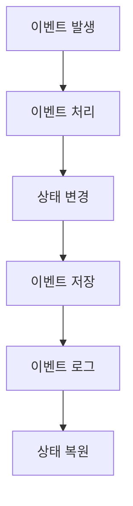
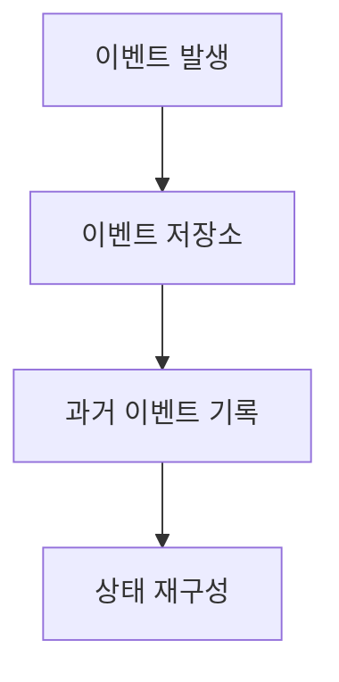
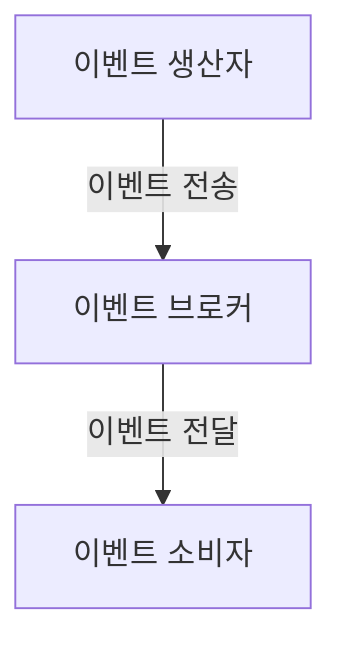
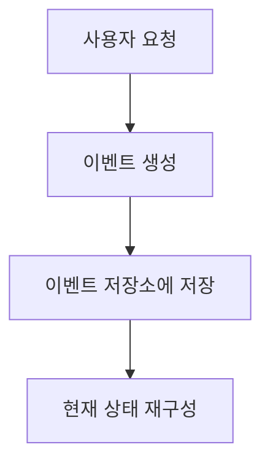
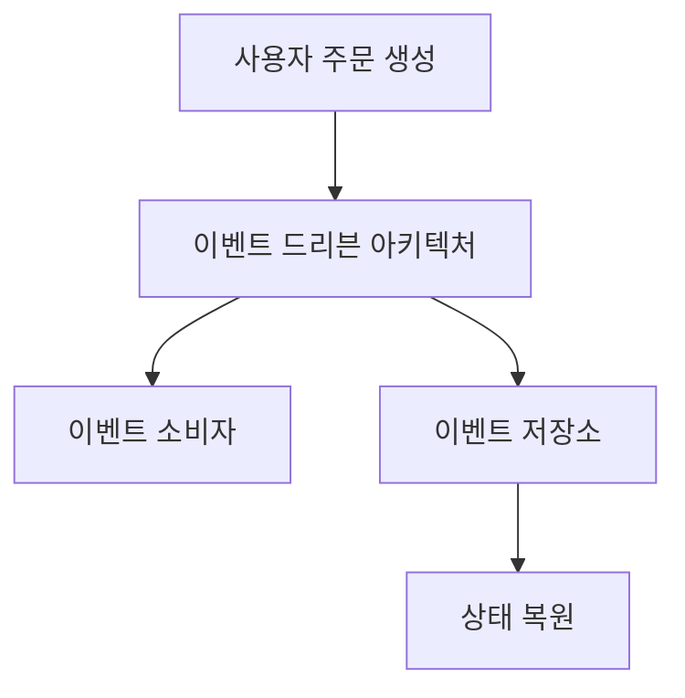
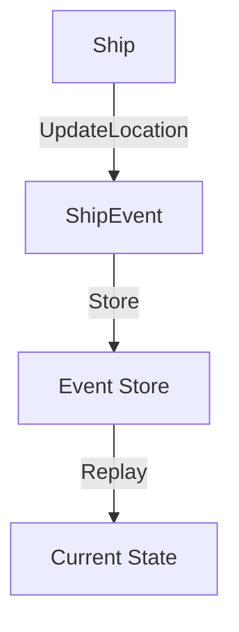
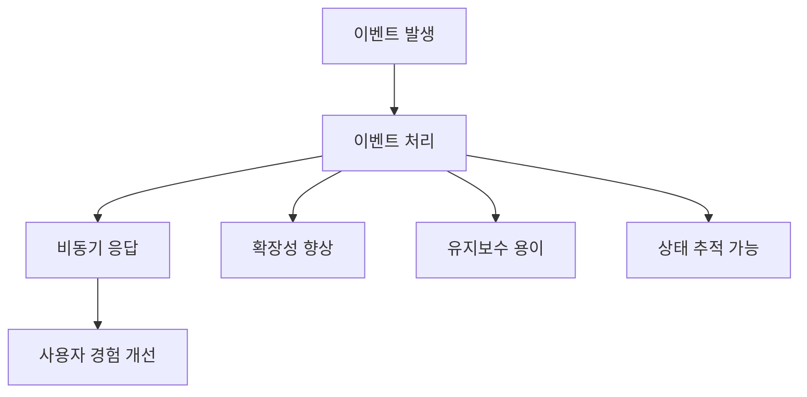
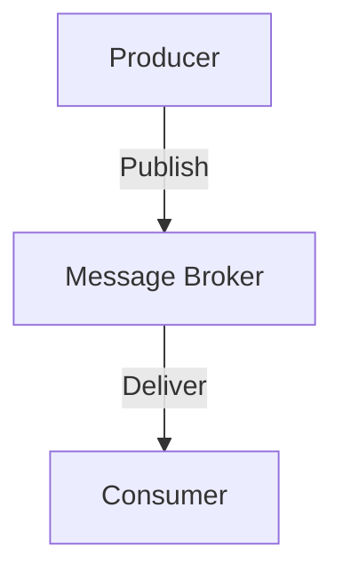
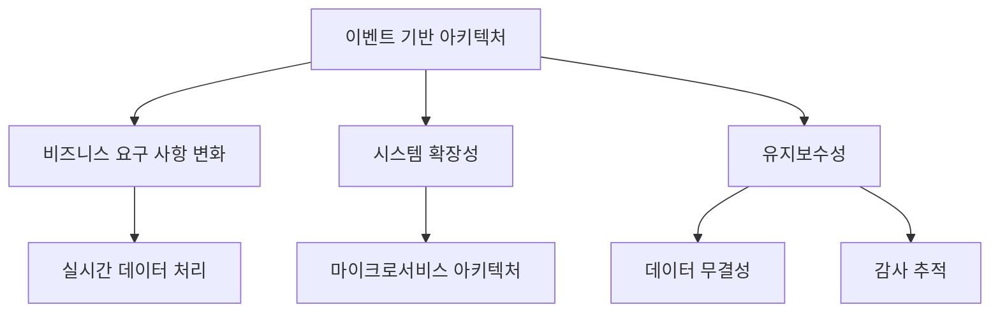
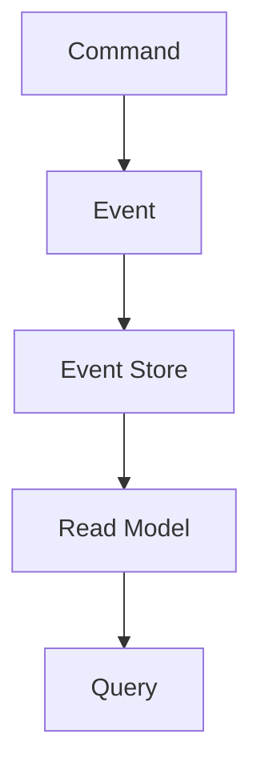

이벤트 기반 아키텍처(Event-Driven Architecture, EDA)는 컴포넌트 간 비동기 메시지 통신으로 느슨한 결합·확장성·장애 복구를 추구하는 설계 패턴이다. 이벤트 소싱(Event Sourcing)은 상태 변경을 이벤트 열로 저장해 재구성·감사·재생을 가능하게 한다. 이 글에서는 EDA와 이벤트 소싱의 개념, 구성 요소, 처리 패턴, C# 예제, FAQ, 관련 기술을 정리한다.

## 개요

이벤트 기반 아키텍처는 현대 소프트웨어 시스템에서 점점 더 중요해지고 있다. 시스템의 유연성과 확장성을 높여 주며, 다양한 서비스 간의 비동기 통신을 가능하게 한다. 특히 마이크로서비스 아키텍처와 잘 어울리며, 각 서비스가 독립적으로 이벤트를 생성하고 처리할 수 있게 한다. 이로 인해 장애 발생 시에도 전체 시스템에 미치는 영향을 최소화할 수 있다.

### 이벤트 기반 아키텍처의 중요성

1. **비동기 처리**: 이벤트 기반 아키텍처는 비동기 통신을 통해 서비스 간 결합도를 낮춘다. 성능 향상과 사용자 경험 개선에 기여한다.
2. **확장성**: 이벤트를 통해 서비스가 독립적으로 확장된다. 새로운 서비스가 기존 시스템에 쉽게 통합되고, 필요에 따라 서비스 수를 조정할 수 있다.
3. **유연성**: 다양한 이벤트 소스와 소비자를 지원하므로, 요구 사항이 바뀌어도 유연하게 대응할 수 있다.
4. **장애 복구**: 이벤트 로그로 시스템 상태를 복원할 수 있어, 장애 시 빠른 복구가 가능하다.

### 이벤트 드리븐(Event-Driven)과 이벤트 소싱(Event Sourcing)의 차이

- **이벤트 드리븐 아키텍처**: 구성 요소가 이벤트를 통해 상호작용하는 방식이다. 이벤트가 발생하면 이를 처리하는 소비자가 반응하며, 비동기적으로 작업이 수행된다.
- **이벤트 소싱**: 상태 변경을 이벤트로 기록하는 방식이다. 현재 상태는 과거 이벤트를 재생해 재구성할 수 있으며, 데이터 불변성·감사·추적이 용이하다.

두 개념은 보완적이며, EDA에서 이벤트 소싱을 함께 쓰면 더 강력한 시스템을 구축할 수 있다.


```mermaid
graph TD
    eventOccurred["이벤트 발생"]
    eventProcessed["이벤트 처리"]
    stateChange["상태 변경"]
    eventStored["이벤트 저장"]
    eventLog["이벤트 로그"]
    stateRestore["상태 복원"]
    eventOccurred --> eventProcessed
    eventProcessed --> stateChange
    stateChange --> eventStored
    eventStored --> eventLog
    eventLog --> stateRestore
```

위 다이어그램은 이벤트 발생부터 상태 복원까지의 흐름을 나타낸다. 이벤트가 발생하면 처리되고, 상태가 변경된 뒤 이벤트가 저장되어 로그가 쌓이며, 이 로그로 나중에 상태를 복원할 수 있다.

## 이벤트의 정의

이벤트는 시스템 내에서 발생하는 중요한 상태 변화나 행동을 나타내는 개념이다. EDA와 이벤트 소싱에서 핵심 요소로 작용한다.

### 이벤트의 특성

1. **명확한 발생 시점**: 이벤트는 특정 시점에 발생하며, 타임스탬프로 기록된다.
2. **상태 변화의 표현**: 시스템 상태가 어떻게 바뀌었는지를 나타낸다. 예: "주문이 생성됨".
3. **비즈니스 의미**: 비즈니스 도메인에서 의미를 가지며, 비즈니스 로직 구현의 단위가 된다.
4. **비동기성**: 비동기적으로 처리될 수 있어 확장성과 성능에 기여한다.

### 이벤트의 불변성 및 과거 기록

이벤트는 불변(immutable)이다. 한 번 발생한 이벤트는 수정되지 않으며, 이벤트 소싱의 핵심 원칙 중 하나이다.

- **신뢰성**: 불변이므로 상태 재구성 시 과거 이벤트를 신뢰할 수 있다.
- **감사 추적**: 모든 이벤트가 기록되므로 규제 준수·문제 해결에 유용하다.

과거 기록은 이벤트 저장소(Event Store)에 시간 순으로 저장되며, 특정 시점까지의 이벤트를 재생해 해당 시점의 상태를 재구성할 수 있다.


```mermaid
graph TD
    eventOccurred["이벤트 발생"]
    eventStore["이벤트 저장소"]
    pastEvents["과거 이벤트 기록"]
    stateReconstruct["상태 재구성"]
    eventOccurred --> eventStore
    eventStore --> pastEvents
    pastEvents --> stateReconstruct
```

## 이벤트 기반 아키텍처 (Event-Driven Architecture)

이벤트 기반 아키텍처는 이벤트를 중심으로 시스템을 구성하는 아키텍처 스타일이다. 구성 요소 간 느슨한 결합을 유도하고, 비동기·반응형 시스템 구축에 적합하다.

### 이벤트 드리븐 아키텍처의 개념

이벤트가 발생하면 이를 처리하는 여러 구성 요소가 반응한다. 이로 인해 확장성과 유연성이 높아지고, 비즈니스 요구에 맞게 조정하기 쉬워진다.

### 비동기 통신과 이벤트 처리

비동기 통신에서 이벤트 생산자는 이벤트를 생성해 이벤트 브로커에 넘기고, 소비자는 브로커로부터 이벤트를 받아 처리한다. 생산자와 소비자는 서로 독립적으로 동작해 성능과 확장성이 좋아진다.


```mermaid
graph TD
    producer["이벤트 생산자"]
    broker["이벤트 브로커"]
    consumer["이벤트 소비자"]
    producer -->|"이벤트 전송"| broker
    broker -->|"이벤트 전달"| consumer
```

### 이벤트 생산자, 소비자, 브로커의 역할

- **이벤트 생산자(Producer)**: 이벤트를 생성해 브로커에 전송한다. 사용자 행동, 시스템 상태 변화 등이 이벤트로 생성될 수 있다.
- **이벤트 소비자(Consumer)**: 브로커로부터 이벤트를 수신해 처리한다. 이벤트 유형에 따라 다양한 작업을 수행한다.
- **이벤트 브로커(Broker)**: 생산자와 소비자 사이에서 이벤트를 수집·전달한다. 메시지 큐나 스트리밍 플랫폼(Kafka, RabbitMQ 등)이 이 역할을 한다.

### 이벤트 처리 패턴

- **단순 이벤트 처리**: 단일 이벤트를 수신해 즉시 처리하는 기본 패턴.
- **기본 이벤트 상관 관계**: 여러 이벤트 간 관계를 정의하고, 식별자로 연결해 후속 이벤트 처리에 활용하는 패턴.
- **복합 이벤트 처리(CEP)**: 여러 이벤트를 조합해 새 이벤트나 패턴을 만드는 패턴. 복잡한 비즈니스 로직에 유용하다.
- **이벤트 스트림 처리**: 연속적인 이벤트 스트림을 처리하는 패턴. 실시간 분석·모니터링에 적합하다.

### 이벤트 기반 아키텍처의 장점과 단점

**장점**

- 확장성·유연성 향상
- 비동기 처리로 성능·응답성 개선
- 느슨한 결합으로 유지보수 용이

**단점**

- 시스템 복잡도 증가
- 이벤트 순서 보장·중복 처리 등 설계 이슈
- 디버깅·모니터링 난이도 상승

## 이벤트 소싱 (Event Sourcing)

### 이벤트 소싱의 개념

이벤트 소싱은 애플리케이션 상태를 "상태 변경 이벤트의 연속"으로 저장하는 패턴이다. CRUD처럼 현재 상태만 갱신하는 대신, 상태를 바꾼 이벤트를 기록하고 그 이벤트 열로 현재 상태를 재구성한다. 데이터 불변성과 완전한 변경 이력 추적을 제공한다.

### 상태 변경의 기록

모든 상태 변경이 이벤트로 기록된다. 예를 들어 계좌 입금 시 "돈이 입금되었다"는 이벤트가 생성된다. 이벤트는 과거 변경 이력을 담고 있어 나중에 재생·복원·감사가 가능하다.


```mermaid
graph TD
    userReq["사용자 요청"]
    eventCreate["이벤트 생성"]
    eventSave["이벤트 저장소에 저장"]
    stateReconstruct["현재 상태 재구성"]
    userReq --> eventCreate
    eventCreate --> eventSave
    eventSave --> stateReconstruct
```

### 이벤트 저장소(Event Store)의 역할

이벤트 저장소는 모든 이벤트를 영구·시간순으로 저장한다. 각 이벤트는 고유 식별자를 가지며, 특정 시점의 상태 재구성·이벤트 재생이 가능하다. 이벤트 불변성을 보장해 데이터 무결성을 유지한다.

### 이벤트 소싱의 장점과 단점

**장점**

- **불변성**: 이벤트는 생성 후 변경되지 않아 무결성이 보장된다.
- **상태 재구성**: 과거 이벤트만으로 언제든 상태를 재구성할 수 있다.
- **감사 추적**: 모든 변경 이력이 남아 감사·디버깅이 용이하다.

**단점**

- 구현·운영 복잡도 증가
- 이벤트 스키마 변경 시 이전 이벤트와의 호환성 관리 필요
- 이벤트 수가 많을 때 재생·쿼리 성능 이슈 (스냅샷 등으로 완화)

## 이벤트 드리븐 아키텍처와 이벤트 소싱의 상호 보완성

EDA는 "이벤트로 소통하는 구조"이고, 이벤트 소싱은 "상태를 이벤트 열로 저장하는 방식"이다. 둘을 함께 쓰면 상태 추적·비즈니스 로직 변경·감사가 쉬워진다.

### 두 접근 방식의 통합

주문 생성 이벤트가 발생하면, EDA를 통해 다른 서비스에 비동기로 전달되고, 동시에 이벤트 소싱으로 이벤트 저장소에 기록된다. 이후 상태 복원·감사·재처리가 가능해진다.


```mermaid
graph TD
    orderCreate["사용자 주문 생성"]
    eda["이벤트 드리븐 아키텍처"]
    consumer["이벤트 소비자"]
    eventStore["이벤트 저장소"]
    stateRestore["상태 복원"]
    orderCreate --> eda
    eda --> consumer
    eda --> eventStore
    eventStore --> stateRestore
```

### 비즈니스 로직과 이벤트 처리의 관계

비즈니스 로직은 EDA에서 이벤트에 의해 트리거되며, 이벤트 소싱을 쓰면 그 변경도 이벤트로 기록된다. 주문 상태 변경을 이벤트로 남기면 이력 추적·특정 시점 복원이 가능해진다.

### 이벤트 로그를 통한 감사 추적

모든 상태 변경이 이벤트로 기록되므로 감사 로그가 자연스럽게 만들어진다. 보안·규정 준수·지원·디버깅에 활용할 수 있으며, 금융·의료 등 규제가 엄한 도메인에서 특히 중요하다.

## 예제: 이벤트 소싱을 통한 선박 추적 (C#)

이벤트 소싱으로 선박 추적 시스템을 구현하는 예제다. 선박 상태와 변경 이력을 이벤트로 관리하고, 재생으로 현재 상태를 복원한다.

### 도메인 모델 설명

- **Ship**: 선박 엔티티. ID, 이름, 현재 위치, 상태, 이벤트 목록을 가진다.
- **Location**: 위도·경도를 담는 값 객체.
- **ShipEvent**: 선박 상태 변경 이벤트. 타입(예: `LocationUpdated`), 발생 시각, 선박 ID, 위치 정보를 포함한다.

```csharp
public class Ship
{
    public Guid Id { get; private set; }
    public string Name { get; private set; }
    public Location CurrentLocation { get; private set; }
    public List<ShipEvent> Events { get; private set; }

    public Ship(Guid id, string name)
    {
        Id = id;
        Name = name;
        Events = new List<ShipEvent>();
    }

    public void UpdateLocation(Location newLocation)
    {
        CurrentLocation = newLocation;
        var shipEvent = new ShipEvent("LocationUpdated", DateTime.UtcNow, Id, newLocation);
        Events.Add(shipEvent);
    }
}

public class Location
{
    public double Latitude { get; private set; }
    public double Longitude { get; private set; }

    public Location(double latitude, double longitude)
    {
        Latitude = latitude;
        Longitude = longitude;
    }
}

public class ShipEvent
{
    public string EventType { get; private set; }
    public DateTime OccurredOn { get; private set; }
    public Guid ShipId { get; private set; }
    public Location Location { get; private set; }

    public ShipEvent(string eventType, DateTime occurredOn, Guid shipId, Location location)
    {
        EventType = eventType;
        OccurredOn = occurredOn;
        ShipId = shipId;
        Location = location;
    }
}
```

### 이벤트 처리 로직

이벤트 핸들러는 메시지 브로커 등으로 전달된 선박 이벤트를 받아, 타입에 따라 처리하고 상태를 갱신한다.

```csharp
public class ShipEventHandler
{
    public void Handle(ShipEvent shipEvent)
    {
        if (shipEvent.EventType == "LocationUpdated")
        {
            UpdateShipLocation(shipEvent.ShipId, shipEvent.Location);
        }
    }

    private void UpdateShipLocation(Guid shipId, Location newLocation)
    {
        // 데이터베이스 또는 상태 저장소에서 선박 조회 후 위치 업데이트
    }
}
```

### 이벤트 재생 및 상태 복원

저장된 이벤트를 순차 재생해 현재 상태를 복원한다.

```csharp
public class ShipRepository
{
    public Ship GetShipById(Guid shipId)
    {
        var events = GetEventsForShip(shipId);
        var ship = new Ship(shipId, "Sample Ship");

        foreach (var shipEvent in events)
        {
            if (shipEvent.EventType == "LocationUpdated")
            {
                ship.UpdateLocation(shipEvent.Location);
            }
        }

        return ship;
    }

    private List<ShipEvent> GetEventsForShip(Guid shipId)
    {
        // 이벤트 저장소에서 해당 선박의 이벤트 조회
        return new List<ShipEvent>();
    }
}
```


```mermaid
graph TD
    ship["Ship"]
    shipEvent["ShipEvent"]
    eventStore["Event Store"]
    currentState["Current State"]
    ship -->|UpdateLocation| shipEvent
    shipEvent -->|Store| eventStore
    eventStore -->|Replay| currentState
```

## FAQ

### 이벤트 기반 아키텍처의 주요 이점은 무엇인가요?

비동기 처리로 응답성·처리량이 좋아지고, 이벤트 단위로 서비스를 확장하기 쉽다. 서비스 간 결합이 느슨해지고, 이벤트 로그로 상태 추적·감사가 가능하다.


```mermaid
graph TD
    eventOccurred["이벤트 발생"]
    eventProcessed["이벤트 처리"]
    asyncResp["비동기 응답"]
    uxImprove["사용자 경험 개선"]
    scaleUp["확장성 향상"]
    maintain["유지보수 용이"]
    trace["상태 추적 가능"]
    eventOccurred --> eventProcessed
    eventProcessed --> asyncResp
    eventProcessed --> scaleUp
    eventProcessed --> maintain
    eventProcessed --> trace
    asyncResp --> uxImprove
```

### 이벤트 소싱을 사용할 때의 단점은 무엇인가요?

잘못된 이벤트 수정이 어렵고, 이벤트 저장소 용량·성능 관리가 필요하다. 복잡한 쿼리는 CQRS 등 보조 모델이 필요하며, 이벤트 스키마 버전 관리로 복잡도가 늘 수 있다.

### 이벤트 드리븐 아키텍처와 REST API의 차이점은 무엇인가요?

REST는 요청-응답 동기 모델이고, EDA는 이벤트 발생 시 소비자가 비동기로 반응하는 모델이다. EDA는 확장성·유연성이 크고 서비스 간 결합도가 낮은 대신, 순서·일관성·디버깅을 별도로 설계해야 한다.

### 이벤트 소싱을 구현할 때 주의해야 할 점은 무엇인가요?

이벤트 설계(상태를 정확히 반영, 불필요한 정보 최소화), 스키마·버전 관리, 저장소 용량·재생 성능 전략, 재생·복원 로직의 신중한 설계가 필요하다.

## 관련 기술

### 메시지 브로커 (Kafka, RabbitMQ 등)

메시지 브로커는 EDA에서 이벤트를 생산자와 소비자 사이에 전달한다.

- **Apache Kafka**: 고처리량·내구성의 분산 스트리밍 플랫폼. 이벤트를 로그 형태로 저장해 순서 보장·다중 소비를 지원한다.
- **RabbitMQ**: AMQP 기반 메시지 브로커. 다양한 메시징 패턴을 지원하고, 큐 기반 비동기 처리에 적합하다.


```mermaid
graph TD
    producer["Producer"]
    msgBroker["Message Broker"]
    consumer["Consumer"]
    producer -->|Publish| msgBroker
    msgBroker -->|Deliver| consumer
```

### CQRS (Command Query Responsibility Segregation)

CQRS는 명령(상태 변경)과 조회를 분리하는 패턴이다. EDA·이벤트 소싱과 결합하면 쓰기 모델(이벤트 스트림)과 읽기 모델(쿼리용 뷰)을 분리해 성능·확장성·유연성을 얻을 수 있다.

### 마이크로서비스 아키텍처

마이크로서비스는 작은 독립 서비스로 애플리케이션을 나누는 방식이다. EDA는 서비스 간 비동기 통신을 제공해 결합도를 낮추고, 서비스별 독립 배포·확장을 가능하게 한다.

## 결론

### 이벤트 기반 아키텍처와 이벤트 소싱의 미래

EDA와 이벤트 소싱은 비즈니스 요구 변화에 유연히 대응하고, 확장성·유지보수성을 높이는 데 기여한다. 마이크로서비스와 결합했을 때 시너지가 크다. 실시간 처리·분석 수요가 늘어날수록 EDA의 비중은 더 커질 것이다. 이벤트 소싱은 상태 이력·감사·재생을 표준화해 데이터 무결성과 운영 가시성을 높인다.


```mermaid
graph TD
    eda["이벤트 기반 아키텍처"]
    bizChange["비즈니스 요구 사항 변화"]
    sysScale["시스템 확장성"]
    maintain["유지보수성"]
    realtime["실시간 데이터 처리"]
    microsvc["마이크로서비스 아키텍처"]
    dataIntegrity["데이터 무결성"]
    audit["감사 추적"]
    eda --> bizChange
    eda --> sysScale
    eda --> maintain
    bizChange --> realtime
    sysScale --> microsvc
    maintain --> dataIntegrity
    maintain --> audit
```

### 소프트웨어 개발에서의 중요성 및 적용 가능성

금융, 물류, 전자상거래 등에서는 실시간 이벤트 처리와 상태 관리가 필수적이다. EDA와 이벤트 소싱을 적용하면 고객 요구에 빠르게 대응하고 프로세스를 최적화할 수 있다. 클라우드·서버리스와 결합해 비용 효율적인 구성을 만들 수 있으며, 이벤트 로그는 디버깅·재현·규정 준수에 활용된다.

## 참고 자료

### 참고 문헌 및 온라인 자료

1. **Martin Fowler – Event Sourcing**  
   [https://martinfowler.com/eaaDev/EventSourcing.html](https://martinfowler.com/eaaDev/EventSourcing.html)  
   이벤트 소싱 개념, 재생·역재생·외부 시스템 연동 등 상세 설명.

2. **Microsoft Learn – 이벤트 기반 아키텍처 스타일**  
   [https://learn.microsoft.com/ko-kr/azure/architecture/guide/architecture-styles/event-driven](https://learn.microsoft.com/ko-kr/azure/architecture/guide/architecture-styles/event-driven)  
   생산자·소비자·채널, 게시-구독 vs 이벤트 스트리밍, 토폴로지·과제 정리.

3. **microservices.io – Event Sourcing 패턴**  
   [https://microservices.io/patterns/data/event-sourcing.html](https://microservices.io/patterns/data/event-sourcing.html)  
   마이크로서비스 맥락에서의 이벤트 소싱, CQRS·Saga와의 관계.

4. **EventStore – Introduction to Event Sourcing**  
   [https://www.eventstore.com/event-sourcing](https://www.eventstore.com/event-sourcing)  
   이벤트 소싱 소개, 이벤트 스토어·프로젝션 개념.

### 참고 다이어그램: 명령-이벤트-읽기 모델 흐름


```mermaid
graph TD
    cmd["Command"]
    evt["Event"]
    eventStore["Event Store"]
    readModel["Read Model"]
    query["Query"]
    cmd --> evt
    evt --> eventStore
    eventStore --> readModel
    readModel --> query
```

명령이 이벤트로 바뀌고, 이벤트가 이벤트 저장소에 쌓이며, 읽기 모델이 이를 반영해 쿼리에 응답하는 구조를 위 다이어그램으로 요약할 수 있다.
