ColorBrewer는 지도 색상 스킴을 선택하기 위한 온라인 도구로, Cynthia Brewer가 만든 팔레트를 기반으로 한다. 2002년에 Brewer, Mark Harrower, 그리고 펜실베이니아 주립대학교에 의해 출시되었다. 이 도구는 데이터 유형에 따라 순차적(sequential), 발산적(diverging), 또는 질적(qualitative) 색상 스킴을 제안한다. 또한 노트북, 복사기, LCD 프로젝터와 같은 다양한 디스플레이 환경에 맞춘 옵션을 제공하며, 색각 이상(colorblind) 사용자에게 안전한 색상 선택도 가능하다. ColorBrewer는 Apache 2.0 소프트웨어 라이센스를 사용하여 배포되며, 이는 CC-BY-SA 3.0과 유사하다. 각 팔레트에 대한 유효한 이름과 전체 색상 표현이 제공되며, 호환되는 브라우저에서 이 박스 위에 마우스를 올리면 해당 색상 번호가 툴팁으로 표시된다. 2018년에는 기후 과학자 Ed Hawkins가 ColorBrewer의 9개 클래스 단일 색상 팔레트에서 가장 포화된 파란색과 빨간색을 선택하여 지구 온난화를 시각적으로 요약한 'warming stripes' 그래픽을 디자인하였다. ColorBrewer는 지도 디자인과 데이터 시각화에 있어 매우 유용한 도구로 자리 잡고 있다.

<!--
##### Outline #####
-->

<!--
# 목차

## 개요
   - ColorBrewer 소개
   - 개발 배경 및 역사
   - 사용 목적 및 중요성

## ColorBrewer의 기능
   - 색상 팔레트 선택
     - Sequential, Divergent, Qualitative
   - 다양한 디스플레이 환경 지원
     - Laptop, Photocopy, LCD Projector
   - Colorblind Safe 옵션

## 색상 팔레트 설명
   - 3.1. Sequential 색상 팔레트
     - YlGn, YlGnBu, GnBu 등
   - 3.2. Divergent 색상 팔레트
     - PuOr, BrBG, PRGn 등
   - 3.3. Qualitative 색상 팔레트
     - Accent, Dark2, Paired 등

## ColorBrewer의 활용 사례
   - 기후 변화 시각화: Warming Stripes
   - 지도 제작에서의 응용

## 예제
   - ColorBrewer 사용법 예제
   - 다양한 색상 팔레트를 활용한 지도 디자인 예시

## FAQ
   - ColorBrewer는 무료인가요?
   - ColorBrewer의 색상 선택 기준은 무엇인가요?
   - 색맹 사용자에게 적합한 색상 조합은 어떻게 선택하나요?

## 관련 기술
   - GIS (Geographic Information Systems)
   - 데이터 시각화 (Data Visualization)
   - 색상 이론 (Color Theory)

## 결론
   - ColorBrewer의 중요성 및 미래 전망
   - 색상 선택의 영향력

## 참고 문헌
   - 관련 연구 및 자료 링크
   - ColorBrewer 관련 논문 및 기사

이 목차는 ColorBrewer에 대한 포괄적인 정보를 제공하며, 관련된 기술과 활용 사례를 통해 독자들이 이 도구의 중요성을 이해할 수 있도록 돕습니다.
-->

<!--
## 개요
   - ColorBrewer 소개
   - 개발 배경 및 역사
   - 사용 목적 및 중요성
-->

## 개요

### ColorBrewer 소개

ColorBrewer는 데이터 시각화에서 색상 팔레트를 선택하는 데 도움을 주는 도구이다. 이 도구는 다양한 데이터 유형에 적합한 색상 조합을 제공하여, 시각적으로 명확하고 효과적인 그래픽을 생성할 수 있도록 돕는다. ColorBrewer는 특히 지리정보 시스템(GIS) 및 데이터 시각화 분야에서 널리 사용된다.

### 개발 배경 및 역사

ColorBrewer는 2002년, 미국의 지리학자인 Cynthia Brewer에 의해 개발되었다. 그녀는 데이터 시각화의 중요성을 인식하고, 색상 선택이 데이터 해석에 미치는 영향을 연구하였다. 그 결과, ColorBrewer는 다양한 색상 팔레트를 제공하여 사용자가 데이터의 의미를 보다 쉽게 전달할 수 있도록 설계되었다. 초기 버전은 주로 지리적 데이터 시각화에 초점을 맞추었으나, 이후 다양한 분야로 확장되었다.

### 사용 목적 및 중요성

ColorBrewer의 주요 목적은 데이터 시각화에서 색상 선택의 일관성을 높이고, 색상으로 인한 혼란을 줄이는 것이다. 색상은 데이터의 패턴과 경향을 강조하는 데 중요한 역할을 하며, 잘못된 색상 선택은 오해를 초래할 수 있다. 따라서 ColorBrewer는 사용자가 데이터의 의미를 명확하게 전달할 수 있도록 돕는 중요한 도구로 자리 잡았다.

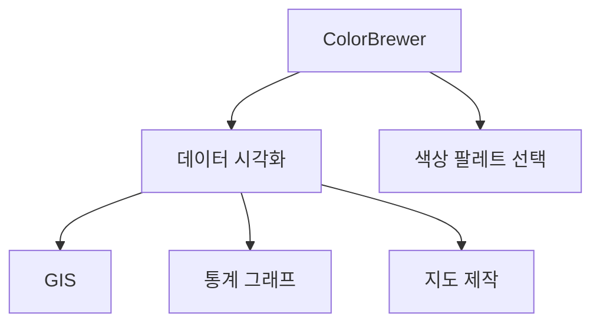

위의 다이어그램은 ColorBrewer가 데이터 시각화에 어떻게 기여하는지를 보여준다. ColorBrewer는 다양한 분야에서 색상 팔레트를 선택하는 데 도움을 주며, 이를 통해 데이터의 해석과 전달이 용이해진다.

<!--
## ColorBrewer의 기능
   - 색상 팔레트 선택
     - Sequential, Divergent, Qualitative
   - 다양한 디스플레이 환경 지원
     - Laptop, Photocopy, LCD Projector
   - Colorblind Safe 옵션
-->

## ColorBrewer의 기능

ColorBrewer는 데이터 시각화에서 색상 선택을 용이하게 해주는 도구로, 다양한 기능을 제공한다. 이 섹션에서는 ColorBrewer의 주요 기능에 대해 살펴보겠다.

### 색상 팔레트 선택

ColorBrewer는 세 가지 주요 색상 팔레트 유형을 제공한다. 이들은 Sequential, Divergent, Qualitative로 구분된다.

**Sequential** 색상 팔레트는 데이터의 크기나 양을 나타내는 데 적합하다. 예를 들어, 낮은 값에서 높은 값으로의 변화를 시각적으로 표현할 수 있다. 

**Divergent** 색상 팔레트는 두 개의 극단적인 값을 강조하는 데 유용하다. 이 팔레트는 중간값을 기준으로 양쪽으로 색상이 변화하여, 데이터의 차이를 명확히 드러낸다.

**Qualitative** 색상 팔레트는 범주형 데이터를 표현하는 데 적합하다. 이 팔레트는 서로 다른 범주를 구분하기 위해 다양한 색상을 사용한다.

다음은 각 색상 팔레트의 예시를 보여주는 코드이다.

```python
import matplotlib.pyplot as plt
import seaborn as sns

# Sequential 색상 팔레트 예시
sns.set_palette("Blues")
plt.figure(figsize=(6, 2))
plt.title("Sequential Color Palette: Blues")
plt.bar(range(10), range(10), color=sns.color_palette())
plt.show()

# Divergent 색상 팔레트 예시
sns.set_palette("coolwarm")
plt.figure(figsize=(6, 2))
plt.title("Divergent Color Palette: Coolwarm")
plt.bar(range(10), range(10), color=sns.color_palette())
plt.show()

# Qualitative 색상 팔레트 예시
sns.set_palette("Set2")
plt.figure(figsize=(6, 2))
plt.title("Qualitative Color Palette: Set2")
plt.bar(range(10), range(10), color=sns.color_palette())
plt.show()
```

### 다양한 디스플레이 환경 지원

ColorBrewer는 다양한 디스플레이 환경을 지원하여, 사용자가 선택한 색상이 각기 다른 환경에서도 잘 보이도록 한다. 지원하는 환경은 다음과 같다.

- **Laptop**: 일반적인 노트북 화면에서 색상이 잘 보이도록 최적화된 팔레트를 제공한다.
- **Photocopy**: 복사본에서도 색상이 잘 나타나도록 대비를 고려한 색상 조합을 제공한다.
- **LCD Projector**: 프로젝터를 통해 발표할 때 색상이 왜곡되지 않도록 설계된 팔레트를 지원한다.

이러한 다양한 지원은 사용자가 어떤 환경에서든지 데이터 시각화를 효과적으로 수행할 수 있도록 돕는다.

### Colorblind Safe 옵션

ColorBrewer는 색맹 사용자도 고려하여 색상 조합을 선택할 수 있는 옵션을 제공한다. 이 옵션은 색맹 사용자가 색상을 구분하는 데 어려움을 겪지 않도록 설계된 색상 팔레트를 포함한다. 

다음은 ColorBrewer의 Colorblind Safe 옵션을 시각적으로 나타내는 다이어그램이다.

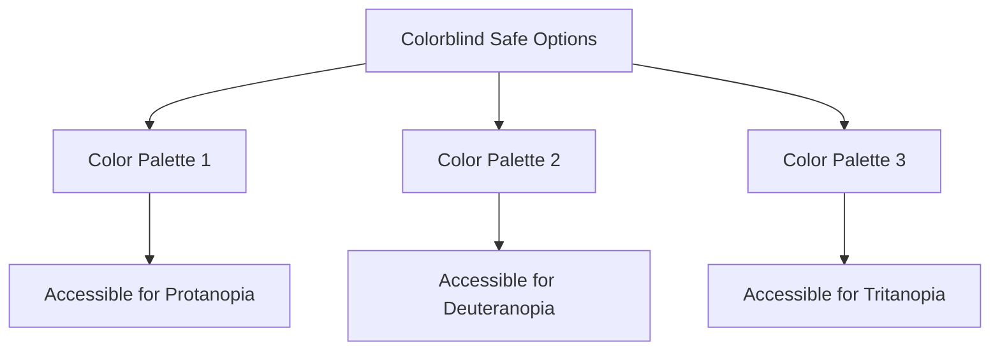

이와 같은 기능들은 ColorBrewer를 데이터 시각화 도구로서 더욱 유용하게 만들어준다. 사용자는 다양한 색상 팔레트를 통해 데이터의 의미를 명확히 전달할 수 있으며, 다양한 환경에서도 일관된 시각적 효과를 유지할 수 있다.

<!--
## 색상 팔레트 설명
   - 3.1. Sequential 색상 팔레트
     - YlGn, YlGnBu, GnBu 등
   - 3.2. Divergent 색상 팔레트
     - PuOr, BrBG, PRGn 등
   - 3.3. Qualitative 색상 팔레트
     - Accent, Dark2, Paired 등
-->

## 색상 팔레트 설명

색상 팔레트는 데이터 시각화에서 중요한 역할을 한다. ColorBrewer는 다양한 색상 팔레트를 제공하여 사용자가 데이터의 특성에 맞는 색상을 선택할 수 있도록 돕는다. 이번 섹션에서는 Sequential, Divergent, Qualitative 색상 팔레트에 대해 설명하겠다.

### Sequential 색상 팔레트

Sequential 색상 팔레트는 데이터의 순서를 나타내는 데 적합하다. 이 팔레트는 일반적으로 낮은 값에서 높은 값으로의 변화를 시각적으로 표현하는 데 사용된다. 예를 들어, YlGn(노란색에서 녹색으로), YlGnBu(노란색에서 파란색으로), GnBu(녹색에서 파란색으로)와 같은 팔레트가 있다. 이러한 색상들은 데이터의 연속적인 변화를 명확하게 전달할 수 있다.

**샘플 코드:**

```python
import matplotlib.pyplot as plt
import numpy as np

# 데이터 생성
data = np.random.rand(10, 10)

# Sequential 색상 팔레트 사용
plt.imshow(data, cmap='YlGn')
plt.colorbar()
plt.title('Sequential Color Palette: YlGn')
plt.show()
```

### Divergent 색상 팔레트

Divergent 색상 팔레트는 데이터의 중심값을 기준으로 두 방향으로의 변화를 나타내는 데 적합하다. 이 팔레트는 주로 긍정적인 값과 부정적인 값을 구분할 때 사용된다. 예를 들어, PuOr(보라색에서 주황색으로), BrBG(갈색에서 파란색으로), PRGn(보라색에서 녹색으로)와 같은 팔레트가 있다. 이러한 색상들은 데이터의 대조를 강조하는 데 유용하다.

**샘플 코드:**

```python
import matplotlib.pyplot as plt
import numpy as np

# 데이터 생성
data = np.random.rand(10, 10) - 0.5  # 중심값 0을 기준으로

# Divergent 색상 팔레트 사용
plt.imshow(data, cmap='RdBu')
plt.colorbar()
plt.title('Divergent Color Palette: RdBu')
plt.show()
```

### Qualitative 색상 팔레트

Qualitative 색상 팔레트는 범주형 데이터를 시각화하는 데 적합하다. 이 팔레트는 서로 다른 범주를 구분하기 위해 사용되며, 색상 간의 순서가 중요하지 않다. 예를 들어, Accent, Dark2, Paired와 같은 팔레트가 있다. 이러한 색상들은 데이터의 범주를 명확하게 구분하는 데 도움을 준다.

**샘플 코드:**

```python
import matplotlib.pyplot as plt

# 범주형 데이터
categories = ['A', 'B', 'C', 'D']
values = [10, 20, 15, 25]

# Qualitative 색상 팔레트 사용
plt.bar(categories, values, color=plt.cm.tab10.colors)
plt.title('Qualitative Color Palette: Tab10')
plt.show()
```

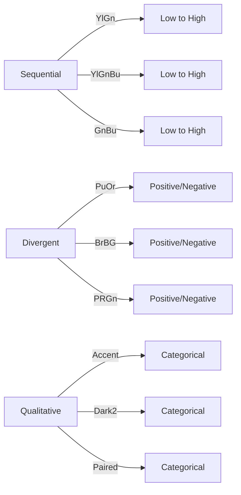

이와 같이 ColorBrewer의 색상 팔레트는 데이터의 특성에 따라 적절한 색상을 선택할 수 있도록 도와준다. 각 팔레트의 특성을 이해하고 활용하는 것은 데이터 시각화의 품질을 높이는 데 중요한 요소이다.

<!--
## ColorBrewer의 활용 사례
   - 기후 변화 시각화: Warming Stripes
   - 지도 제작에서의 응용
-->

## ColorBrewer의 활용 사례

### 기후 변화 시각화: Warming Stripes

ColorBrewer는 기후 변화 데이터를 시각화하는 데 매우 유용한 도구이다. 특히, Warming Stripes는 기후 변화의 온도 상승을 시각적으로 표현하는 방법으로, ColorBrewer의 색상 팔레트를 활용하여 각 연도의 평균 온도 변화를 쉽게 이해할 수 있도록 돕는다. 이 시각화는 각 연도의 온도 변화를 색상으로 나타내어, 시간이 지남에 따라 온도가 어떻게 변화했는지를 직관적으로 보여준다.

아래는 Warming Stripes를 구현하기 위한 샘플 코드이다. 이 코드는 Python의 Matplotlib 라이브러리와 ColorBrewer의 색상 팔레트를 사용하여 기후 데이터를 시각화하는 예시이다.

```python
import matplotlib.pyplot as plt
import numpy as np
import pandas as pd

# 기후 데이터 생성 (예시)
years = np.arange(1880, 2021)
temperatures = np.random.normal(loc=0, scale=1, size=len(years)).cumsum()

# ColorBrewer 색상 팔레트 사용
colors = plt.get_cmap('YlGn')(np.linspace(0, 1, len(years)))

# Warming Stripes 시각화
plt.figure(figsize=(10, 5))
for i in range(len(years)):
    plt.bar(years[i], 1, color=colors[i], edgecolor='none')

plt.title('Warming Stripes: Global Temperature Change')
plt.xlabel('Year')
plt.yticks([])
plt.show()
```

위 코드는 1880년부터 2020년까지의 가상의 온도 데이터를 생성하고, ColorBrewer의 'YlGn' 색상 팔레트를 사용하여 각 연도의 온도를 색상으로 표현한다. 이와 같은 시각화는 기후 변화에 대한 경각심을 불러일으키는 데 큰 역할을 한다.

### 지도 제작에서의 응용

ColorBrewer는 지도 제작에서도 중요한 역할을 한다. 지리적 데이터의 시각화는 정보의 전달력을 높이고, 데이터의 패턴을 쉽게 이해할 수 있도록 돕는다. ColorBrewer의 색상 팔레트는 다양한 데이터 유형에 맞춰 선택할 수 있으며, 특히 Sequential, Divergent, Qualitative 색상 팔레트는 각각의 데이터 특성에 맞는 시각화를 가능하게 한다.

예를 들어, 인구 밀도나 기온 분포와 같은 연속적인 데이터는 Sequential 색상 팔레트를 사용하여 시각화할 수 있다. 반면, 범주형 데이터는 Qualitative 색상 팔레트를 사용하여 각 범주를 명확하게 구분할 수 있다.

아래는 지도 제작에서 ColorBrewer를 활용하는 예시를 보여주는 다이어그램이다.

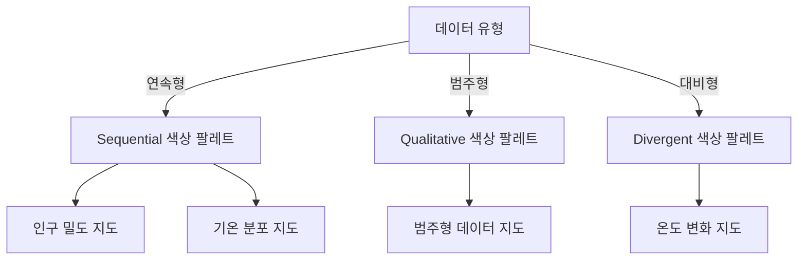

이와 같이 ColorBrewer는 다양한 데이터 유형에 맞춰 색상 팔레트를 제공함으로써, 지도 제작에서의 데이터 시각화를 더욱 효과적으로 만들어준다. 이를 통해 사용자는 복잡한 데이터를 쉽게 이해하고, 중요한 인사이트를 도출할 수 있다.

<!--
## 예제
   - ColorBrewer 사용법 예제
   - 다양한 색상 팔레트를 활용한 지도 디자인 예시
-->

## 예제

### ColorBrewer 사용법 예제

ColorBrewer는 데이터 시각화에서 색상 팔레트를 선택하는 데 유용한 도구이다. 사용자는 다양한 색상 조합을 통해 데이터를 효과적으로 표현할 수 있다. 아래는 ColorBrewer를 사용하여 Sequential 색상 팔레트를 적용하는 간단한 예제이다.

```python
import matplotlib.pyplot as plt
import numpy as np
import brewer2mpl

# 데이터 생성
data = np.random.rand(10)

# ColorBrewer에서 Sequential 색상 팔레트 선택
palette = brewer2mpl.get_map('YlGn', 'Sequential', 9).mpl_colors

# 그래프 그리기
plt.bar(range(len(data)), data, color=palette)
plt.title('ColorBrewer Sequential Palette Example')
plt.xlabel('Index')
plt.ylabel('Value')
plt.show()
```

위의 코드는 `matplotlib` 라이브러리를 사용하여 무작위 데이터를 바 차트로 시각화하는 예제이다. `brewer2mpl` 라이브러리를 통해 ColorBrewer의 Sequential 색상 팔레트를 가져와서 적용하였다.

### 다양한 색상 팔레트를 활용한 지도 디자인 예시

ColorBrewer의 색상 팔레트는 지도 디자인에서도 매우 유용하게 사용된다. 예를 들어, 기후 변화 데이터를 시각화할 때, Divergent 색상 팔레트를 활용하여 온도 변화의 차이를 명확하게 표현할 수 있다. 아래는 이러한 예시를 보여주는 다이어그램이다.

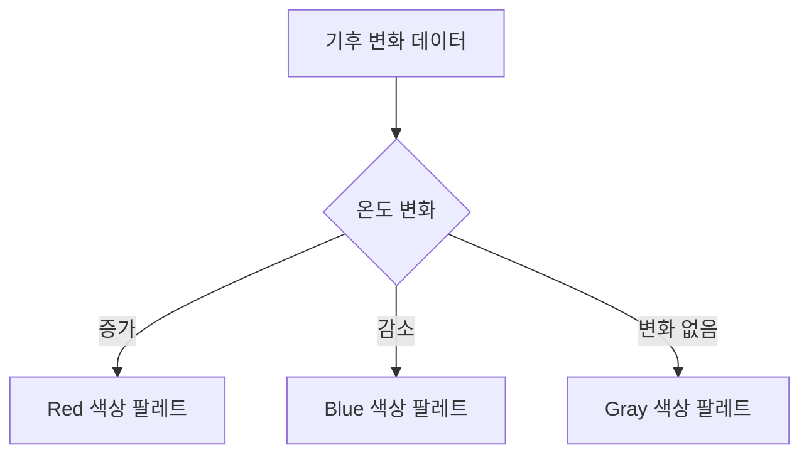

위의 다이어그램은 기후 변화 데이터를 기반으로 한 색상 팔레트의 선택 과정을 나타낸다. 온도 변화에 따라 적절한 색상 팔레트를 선택함으로써 데이터의 의미를 더욱 명확하게 전달할 수 있다. ColorBrewer의 다양한 색상 팔레트를 활용하여 지도 디자인을 개선하고, 데이터의 시각적 효과를 극대화할 수 있다.

<!--
## FAQ
   - ColorBrewer는 무료인가요?
   - ColorBrewer의 색상 선택 기준은 무엇인가요?
   - 색맹 사용자에게 적합한 색상 조합은 어떻게 선택하나요?
-->

## FAQ

**ColorBrewer는 무료인가요?**

ColorBrewer는 무료로 제공되는 도구이다. 사용자는 웹사이트를 통해 다양한 색상 팔레트를 자유롭게 선택하고 다운로드할 수 있다. 이 도구는 비영리 프로젝트와 교육 목적으로 사용하기에 적합하며, 상업적 사용 시에는 라이센스 조건을 확인해야 한다.

**ColorBrewer의 색상 선택 기준은 무엇인가요?**

ColorBrewer의 색상 선택 기준은 데이터의 특성과 시각적 인식을 고려하여 설정된다. 색상 팔레트는 Sequential, Divergent, Qualitative의 세 가지 유형으로 나뉘며, 각 유형은 데이터의 분포와 관계를 효과적으로 전달하기 위해 설계되었다. 예를 들어, Sequential 팔레트는 연속적인 데이터에 적합하고, Divergent 팔레트는 중심값을 기준으로 양극화된 데이터를 표현하는 데 유용하다. Qualitative 팔레트는 범주형 데이터에 적합하여 서로 다른 그룹을 명확하게 구분할 수 있도록 돕는다.

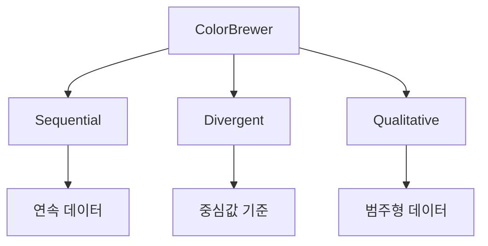

**색맹 사용자에게 적합한 색상 조합은 어떻게 선택하나요?**

색맹 사용자에게 적합한 색상 조합을 선택하기 위해서는 ColorBrewer의 Colorblind Safe 옵션을 활용하는 것이 좋다. 이 옵션은 색맹 사용자가 구별할 수 있는 색상 조합을 제공하여, 데이터 시각화의 접근성을 높인다. 색상 조합을 선택할 때는 색상 간의 대비를 고려하고, 색상 이론에 따라 색상 원에서 서로 멀리 떨어진 색상을 선택하는 것이 효과적이다. 

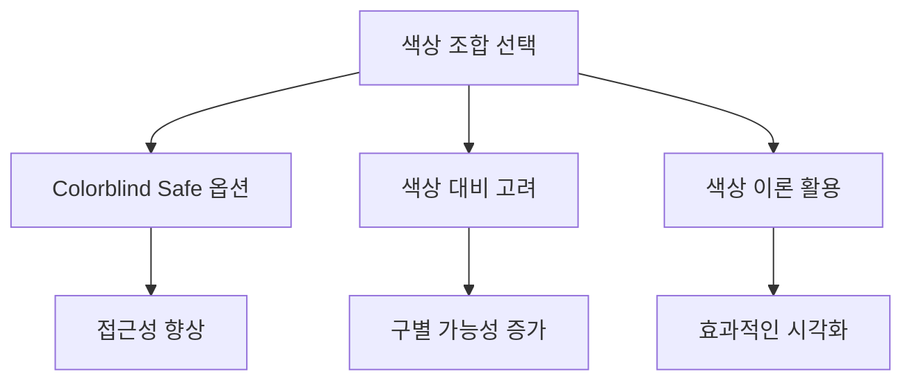

이와 같은 방법으로 색상 조합을 선택하면 색맹 사용자도 데이터 시각화를 보다 쉽게 이해할 수 있다. ColorBrewer는 이러한 접근성을 고려하여 설계된 도구로, 다양한 사용자에게 유용한 정보를 제공하는 데 기여하고 있다.

<!--
## 관련 기술
   - GIS (Geographic Information Systems)
   - 데이터 시각화 (Data Visualization)
   - 색상 이론 (Color Theory)
-->

## 관련 기술

### GIS (Geographic Information Systems)

GIS는 지리적 데이터를 수집, 저장, 분석 및 시각화하는 시스템이다. GIS는 다양한 데이터 소스를 통합하여 공간적 관계를 이해하고, 이를 통해 의사 결정을 지원하는 데 중요한 역할을 한다. ColorBrewer는 GIS에서 색상 팔레트를 선택하는 데 유용하게 사용되며, 데이터의 시각적 표현을 개선하는 데 기여한다.

**GIS의 주요 기능:**

- 공간 데이터 분석
- 지도 제작 및 시각화
- 데이터 통합 및 관리

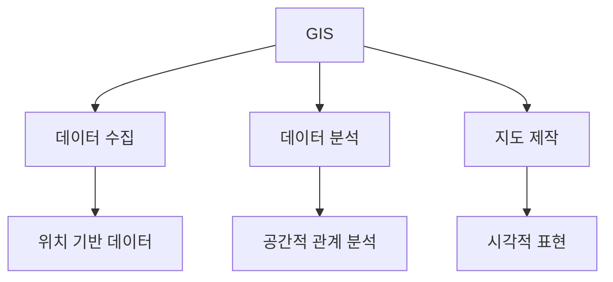

### 데이터 시각화 (Data Visualization)

데이터 시각화는 데이터를 그래픽 형식으로 표현하여 정보를 쉽게 이해할 수 있도록 돕는 기술이다. ColorBrewer는 데이터 시각화에서 색상 팔레트를 선택하는 데 중요한 도구로, 데이터의 패턴과 경향을 명확하게 전달하는 데 기여한다. 적절한 색상 선택은 데이터의 해석을 용이하게 하고, 사용자에게 더 나은 인사이트를 제공한다.

**데이터 시각화의 중요성:**

- 복잡한 데이터의 단순화
- 패턴 및 경향의 식별
- 의사 결정 지원

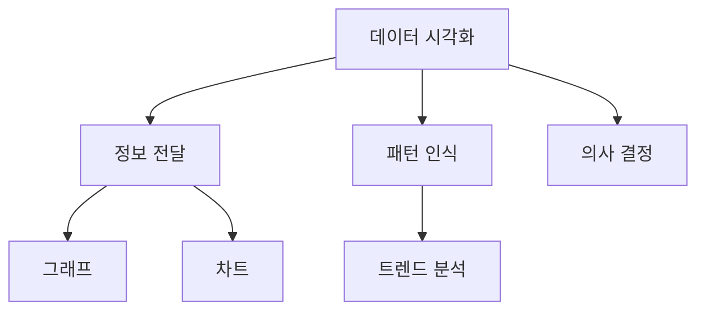

### 색상 이론 (Color Theory)

색상 이론은 색상의 조합과 사용에 대한 원칙을 다루는 학문이다. 색상 이론은 색상이 어떻게 상호작용하고, 감정 및 인식을 어떻게 유도하는지를 설명한다. ColorBrewer는 색상 이론을 기반으로 하여 다양한 색상 팔레트를 제공하며, 사용자가 효과적으로 색상을 선택할 수 있도록 돕는다.

**색상 이론의 기본 요소:**

- 색상 (Hue)
- 채도 (Saturation)
- 명도 (Lightness)

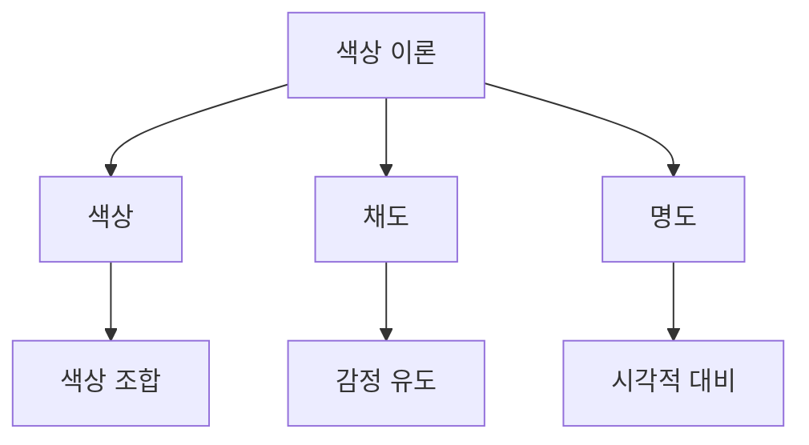

이와 같이 GIS, 데이터 시각화, 색상 이론은 ColorBrewer와 밀접한 관련이 있으며, 이들 기술을 이해하는 것은 효과적인 데이터 시각화를 위한 중요한 기초가 된다.

<!--
## 결론
   - ColorBrewer의 중요성 및 미래 전망
   - 색상 선택의 영향력
-->

## 결론

### ColorBrewer의 중요성 및 미래 전망

ColorBrewer는 데이터 시각화에서 색상 선택의 중요성을 강조하는 도구로, 다양한 색상 팔레트를 제공하여 사용자가 데이터의 의미를 효과적으로 전달할 수 있도록 돕는다. 특히, 기후 변화와 같은 복잡한 데이터 세트를 시각화할 때, 적절한 색상 선택은 정보의 명확성을 높이고, 관객의 이해를 돕는 데 필수적이다. 

미래에는 데이터 시각화의 필요성이 더욱 증가할 것으로 예상되며, ColorBrewer와 같은 도구는 더욱 발전할 것이다. 인공지능(AI)과 머신러닝(Machine Learning) 기술의 발전으로, 사용자 맞춤형 색상 추천 기능이 추가될 가능성이 높다. 이러한 기능은 사용자가 데이터의 특성에 맞는 최적의 색상 조합을 쉽게 선택할 수 있도록 도와줄 것이다.

### 색상 선택의 영향력

색상 선택은 데이터 시각화에서 단순한 미적 요소를 넘어, 정보 전달의 효율성에 큰 영향을 미친다. 잘 선택된 색상은 데이터의 패턴과 경향을 명확하게 드러내며, 관객의 주의를 끌고, 기억에 남는 인상을 남길 수 있다. 반면, 부적절한 색상 조합은 오해를 불러일으키고, 데이터의 의미를 왜곡할 수 있다.

다음은 색상 선택의 중요성을 보여주는 간단한 예제 코드이다. 이 코드는 ColorBrewer의 Sequential 색상 팔레트를 사용하여 데이터를 시각화하는 방법을 보여준다.

```python
import matplotlib.pyplot as plt
import numpy as np
import seaborn as sns

# 데이터 생성
data = np.random.rand(10, 10)

# ColorBrewer Sequential 색상 팔레트 사용
sns.heatmap(data, cmap='YlGn')

plt.title('ColorBrewer Sequential Color Palette Example')
plt.show()
```

또한, 색상 선택의 영향력을 시각적으로 나타내기 위해 다음과 같은 다이어그램을 사용할 수 있다.

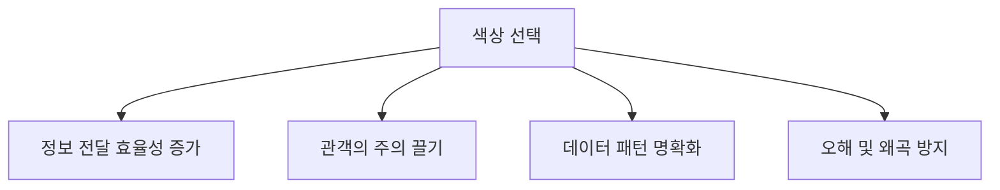

이와 같이 ColorBrewer는 데이터 시각화에서 색상 선택의 중요성을 강조하며, 앞으로도 그 역할이 더욱 중요해질 것이다. 색상 선택은 단순한 디자인 요소가 아니라, 데이터의 의미를 전달하는 핵심 요소임을 잊지 말아야 한다.

<!--
## 참고 문헌
   - 관련 연구 및 자료 링크
   - ColorBrewer 관련 논문 및 기사
-->

## 참고 문헌

ColorBrewer에 대한 연구와 자료는 이 도구의 이해를 돕고, 활용 방안을 제시하는 데 중요한 역할을 한다. 아래는 ColorBrewer와 관련된 연구 및 자료 링크와 논문, 기사를 정리한 것이다.

**관련 연구 및 자료 링크**

- [ColorBrewer 공식 웹사이트](http://colorbrewer2.org): ColorBrewer의 다양한 색상 팔레트를 제공하는 공식 사이트로, 사용자가 쉽게 색상 조합을 선택할 수 있도록 돕는다.
- [Color Accessibility in Data Visualization](https://www.color-blindness.com): 색맹 사용자를 위한 색상 선택에 대한 자료로, ColorBrewer의 Colorblind Safe 옵션에 대한 설명이 포함되어 있다.

**ColorBrewer 관련 논문 및 기사**

- "The Role of Color in Data Visualization" (2020): 데이터 시각화에서 색상의 역할과 ColorBrewer의 기여를 다룬 논문이다. 색상 선택이 데이터 해석에 미치는 영향을 분석한다.
- "Improving Data Visualization for Colorblind Users" (2019): 색맹 사용자를 위한 데이터 시각화 개선 방안에 대한 연구로, ColorBrewer의 색상 조합이 어떻게 활용될 수 있는지를 설명한다.

아래는 ColorBrewer를 활용한 색상 팔레트 선택의 예시를 보여주는 샘플 코드이다.

```python
import matplotlib.pyplot as plt
import seaborn as sns

# ColorBrewer 색상 팔레트 사용 예시
palette = sns.color_palette("YlGnBu", 8)

# 데이터 시각화
plt.figure(figsize=(8, 4))
sns.barplot(x=[1, 2, 3, 4, 5, 6, 7, 8], y=[5, 7, 8, 6, 4, 3, 2, 1], palette=palette)
plt.title("ColorBrewer YlGnBu Palette Example")
plt.show()
```

또한, 아래는 ColorBrewer의 색상 팔레트를 시각적으로 나타내는 다이어그램이다.

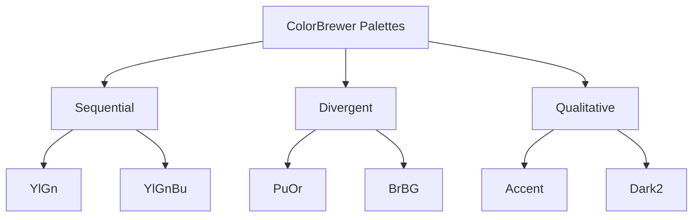

이와 같은 자료들은 ColorBrewer의 활용을 더욱 풍부하게 해주며, 데이터 시각화에서 색상의 중요성을 강조하는 데 기여한다.

<!--
##### Reference #####
-->

## Reference


* [https://en.wikipedia.org/wiki/ColorBrewer](https://en.wikipedia.org/wiki/ColorBrewer)
* [https://www.color-hex.com/color-palette/1872](https://www.color-hex.com/color-palette/1872)
