ColorBrewer는 지도 색상 스킴을 선택하기 위한 온라인 도구로, Cynthia Brewer가 만든 팔레트를 기반으로 한다. 2002년 Brewer, Mark Harrower, 펜실베이니아 주립대학교에 의해 출시되었으며, 데이터 유형에 따라 **Sequential**(순차), **Divergent**(발산), **Qualitative**(질적) 색상 스킴을 제안한다. 노트북·복사기·LCD 프로젝터 등 디스플레이 환경과 **색각 이상(colorblind) 안전** 옵션을 지원하며, Apache 2.0 라이선스로 배포된다. 2018년 기후 과학자 Ed Hawkins가 ColorBrewer 9단 단색 팔레트의 파란색·빨간색을 활용해 지구 온난화를 요약한 **Warming Stripes** 그래픽을 설계한 것으로도 잘 알려져 있다.

## 목차

1. [개요](#개요): ColorBrewer 소개, 개발 배경, 사용 목적
2. [ColorBrewer의 기능](#colorbrewer의-기능): 팔레트 유형, 디스플레이 지원, Colorblind Safe
3. [색상 팔레트 설명](#색상-팔레트-설명): Sequential, Divergent, Qualitative
4. [활용 사례](#colorbrewer의-활용-사례): Warming Stripes, 지도 제작
5. [예제](#예제): 사용법 및 지도 디자인 예시
6. [FAQ](#faq): 무료 여부, 선택 기준, 색맹 대응
7. [관련 기술](#관련-기술): GIS, 데이터 시각화, 색상 이론
8. [결론](#결론) 및 [참고 문헌](#참고-문헌)

---

## 개요

### ColorBrewer 소개

ColorBrewer는 데이터 시각화에서 **색상 팔레트 선택**을 돕는 온라인 도구다. 데이터 유형에 맞는 색 조합을 제안해 시각적으로 명확한 그래픽을 만들 수 있게 하며, 지리정보시스템(GIS)과 데이터 시각화 분야에서 널리 쓰인다.

### 개발 배경 및 역사

2002년 미국 지리학자 **Cynthia Brewer**가 데이터 시각화에서 색상 선택이 해석에 미치는 영향을 연구한 결과물로 공개되었다. 초기에는 지리적 데이터 시각화에 초점을 두었고, 이후 통계 그래프·대시보드 등으로 활용 범위가 넓어졌다.

### 사용 목적 및 중요성

색상 선택의 **일관성**을 높이고, 잘못된 색으로 인한 **오해**를 줄이는 것이 목적이다. 적절한 팔레트는 패턴과 경향을 강조하고, 부적절한 선택은 의미를 왜곡할 수 있으므로 ColorBrewer는 정보 전달 품질을 높이는 도구로 자리 잡았다.

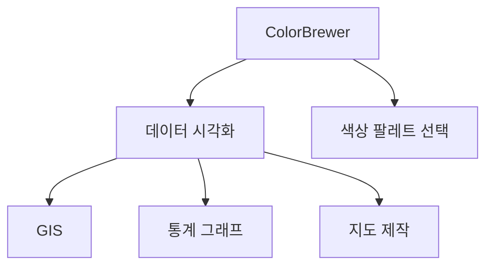
```mermaid
graph TD
    ColorBrewer["ColorBrewer"]
    DataViz["데이터 시각화"]
    PaletteSelect["색상 팔레트 선택"]
    GIS["GIS"]
    StatGraph["통계 그래프"]
    MapMake["지도 제작"]
    ColorBrewer --> DataViz
    ColorBrewer --> PaletteSelect
    DataViz --> GIS
    DataViz --> StatGraph
    DataViz --> MapMake
```

위 다이어그램은 ColorBrewer가 데이터 시각화와 팔레트 선택을 통해 GIS·통계 그래프·지도 제작에 기여하는 구조를 보여준다.

---

## ColorBrewer의 기능

### 색상 팔레트 선택

세 가지 주요 팔레트 유형을 제공한다.

| 유형 | 용도 | 예시 |
|------|------|------|
| **Sequential** | 크기·양의 연속적 변화 (낮음→높음) | YlGn, YlGnBu, GnBu |
| **Divergent** | 중심값 기준 양극 대비 (예: 양/음) | PuOr, BrBG, PRGn, RdBu |
| **Qualitative** | 범주형 데이터, 순서 없음 | Accent, Dark2, Paired, Set1 |

**Sequential**은 인구 밀도·기온 등 연속량, **Divergent**는 편차·증감률, **Qualitative**는 지역 유형·산업 분류 등에 적합하다.

### 다양한 디스플레이 환경 지원

- **Laptop**: 일반 노트북 화면에 맞춘 팔레트
- **Photocopy**: 복사본에서도 대비가 유지되도록 설계
- **LCD Projector**: 프로젝터 발표 시 색 왜곡 최소화

### Colorblind Safe 옵션

색각 이상(Protanopia, Deuteranopia, Tritanopia 등) 사용자도 구분 가능한 조합을 제공한다. ColorBrewer 웹에서 "colorblind safe" 필터를 켜면 해당 팔레트만 골라 쓸 수 있다.

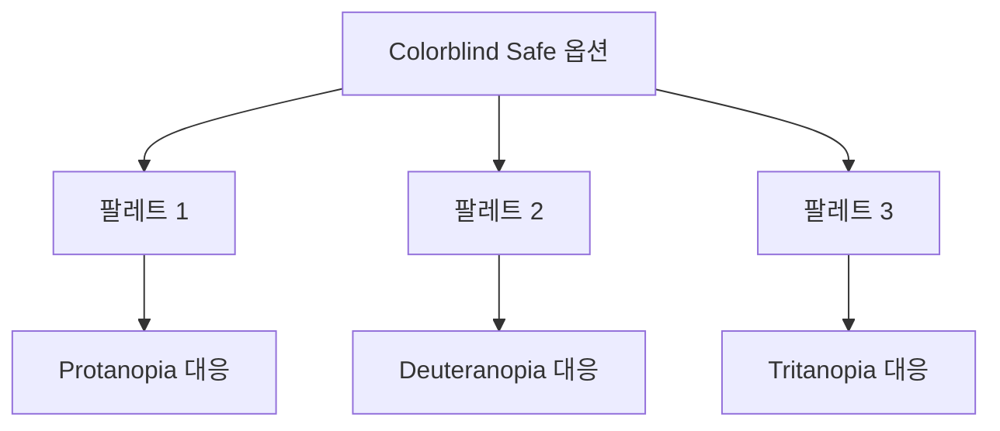
```mermaid
graph TD
    ColorblindSafe["Colorblind Safe 옵션"]
    Palette1["팔레트 1"]
    Palette2["팔레트 2"]
    Palette3["팔레트 3"]
    Protanopia["Protanopia 대응"]
    Deuteranopia["Deuteranopia 대응"]
    Tritanopia["Tritanopia 대응"]
    ColorblindSafe --> Palette1
    ColorblindSafe --> Palette2
    ColorblindSafe --> Palette3
    Palette1 --> Protanopia
    Palette2 --> Deuteranopia
    Palette3 --> Tritanopia
```

---

## 색상 팔레트 설명

### Sequential 색상 팔레트

낮은 값에서 높은 값으로의 **단방향 변화**를 표현할 때 사용한다. YlGn(노랑→녹색), YlGnBu(노랑→녹색→파랑), GnBu(녹색→파랑) 등이 있으며, 히트맵·등치선 지도에 많이 쓰인다.

```python
import matplotlib.pyplot as plt
import numpy as np

data = np.random.rand(10, 10)
plt.imshow(data, cmap='YlGn')
plt.colorbar()
plt.title('Sequential Color Palette: YlGn')
plt.show()
```

### Divergent 색상 팔레트

**중심값**(예: 0 또는 평균)을 기준으로 양쪽으로 색이 갈라진다. PuOr(보라→주황), BrBG(갈색→청록), PRGn(보라→녹색), RdBu(빨강→파랑) 등이 있으며, 온도 편차·선거 지도·증감률 시각화에 적합하다.

```python
import matplotlib.pyplot as plt
import numpy as np

data = np.random.rand(10, 10) - 0.5
plt.imshow(data, cmap='RdBu')
plt.colorbar()
plt.title('Divergent Color Palette: RdBu')
plt.show()
```

### Qualitative 색상 팔레트

**범주**를 구분할 때 사용하며, 색의 순서가 의미를 갖지 않는다. Accent, Dark2, Paired, Set1, Set2, Set3, Pastel1, Pastel2 등이 있으며, 지역 유형·산업 분류·범례가 많은 지도에 쓰인다.

```python
import matplotlib.pyplot as plt

categories = ['A', 'B', 'C', 'D']
values = [10, 20, 15, 25]
plt.bar(categories, values, color=plt.cm.tab10.colors)
plt.title('Qualitative Color Palette: Tab10')
plt.show()
```

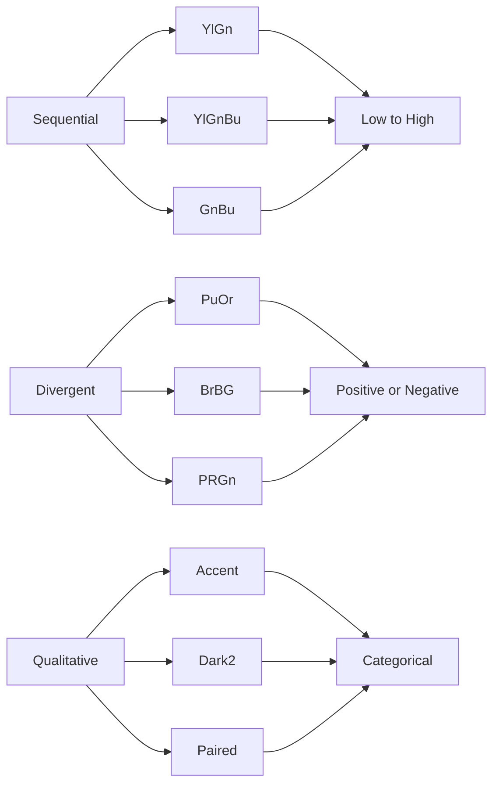
```mermaid
graph LR
    Sequential["Sequential"]
    LowToHigh["Low to High"]
    YlGn["YlGn"]
    YlGnBu["YlGnBu"]
    GnBu["GnBu"]
    Divergent["Divergent"]
    PosNeg["Positive or Negative"]
    PuOr["PuOr"]
    BrBG["BrBG"]
    PRGn["PRGn"]
    Qualitative["Qualitative"]
    Categorical["Categorical"]
    Accent["Accent"]
    Dark2["Dark2"]
    Paired["Paired"]
    Sequential --> YlGn
    Sequential --> YlGnBu
    Sequential --> GnBu
    YlGn --> LowToHigh
    YlGnBu --> LowToHigh
    GnBu --> LowToHigh
    Divergent --> PuOr
    Divergent --> BrBG
    Divergent --> PRGn
    PuOr --> PosNeg
    BrBG --> PosNeg
    PRGn --> PosNeg
    Qualitative --> Accent
    Qualitative --> Dark2
    Qualitative --> Paired
    Accent --> Categorical
    Dark2 --> Categorical
    Paired --> Categorical
```

---

## ColorBrewer의 활용 사례

### 기후 변화 시각화: Warming Stripes

2018년 기후 과학자 **Ed Hawkins**가 ColorBrewer 9단 단색 팔레트에서 가장 포화된 파란색 8개와 빨간색 8개를 골라 **Warming Stripes**(온난화 줄무늬)를 디자인했다. 연도별 평균 온도를 한 줄씩 색으로 나타내 전 지구 온난화를 직관적으로 보여준다.

```python
import matplotlib.pyplot as plt
import numpy as np

years = np.arange(1880, 2021)
np.random.seed(42)
temperatures = np.random.normal(loc=0, scale=0.5, size=len(years)).cumsum()
colors = plt.get_cmap('RdBu_r')(np.linspace(0, 1, len(years)))

plt.figure(figsize=(12, 2))
for i in range(len(years)):
    plt.bar(years[i], 1, color=colors[i], edgecolor='none')
plt.title('Warming Stripes: Global Temperature Change')
plt.xlabel('Year')
plt.yticks([])
plt.tight_layout()
plt.show()
```

### 지도 제작에서의 응용

- **연속형 데이터**(인구 밀도, 기온): Sequential
- **범주형 데이터**(행정 구역 유형, 산업): Qualitative
- **편차·대비형 데이터**(평균 대비 증감): Divergent

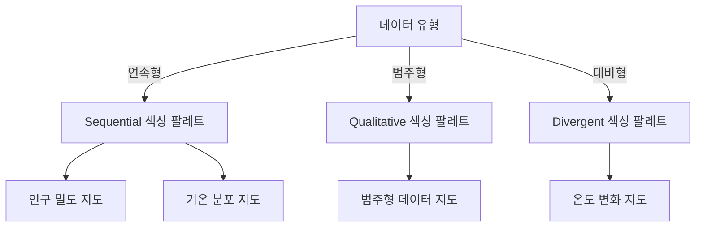
```mermaid
graph TD
    DataType["데이터 유형"]
    SequentialPalette["Sequential 색상 팔레트"]
    QualitativePalette["Qualitative 색상 팔레트"]
    DivergentPalette["Divergent 색상 팔레트"]
    PopDensity["인구 밀도 지도"]
    TempMap["기온 분포 지도"]
    CategoryMap["범주형 데이터 지도"]
    TempChange["온도 변화 지도"]
    DataType -->|"연속형"| SequentialPalette
    DataType -->|"범주형"| QualitativePalette
    DataType -->|"대비형"| DivergentPalette
    SequentialPalette --> PopDensity
    SequentialPalette --> TempMap
    QualitativePalette --> CategoryMap
    DivergentPalette --> TempChange
```

---

## 예제

### ColorBrewer 사용법 예제

[ColorBrewer 2.0](https://colorbrewer2.org)에 접속한 뒤, 데이터 클래스 수(3~12), 데이터 성격(sequential / diverging / qualitative), colorblind safe·print friendly·photocopy safe 옵션을 선택하면 팔레트와 HEX·RGB·CSS·JavaScript 등 내보내기 형식을 얻을 수 있다. Python에서는 `matplotlib`의 `cmap`(예: `YlGn`, `RdBu`) 또는 `brewer2mpl` 라이브러리로 동일 팔레트를 쓸 수 있다.

```python
import matplotlib.pyplot as plt
import numpy as np

data = np.random.rand(10)
# matplotlib 내장 ColorBrewer 계열
plt.bar(range(len(data)), data, color=plt.cm.YlGn(np.linspace(0.2, 0.8, len(data))))
plt.title('ColorBrewer Sequential Palette Example')
plt.xlabel('Index')
plt.ylabel('Value')
plt.show()
```

### 다양한 팔레트를 활용한 지도 디자인

기후·인구·경제 데이터에 따라 Sequential·Divergent·Qualitative 중 하나를 선택하고, 배경(도로·경계·terrain)과의 대비, 인쇄·프로젝터 사용 여부를 고려해 ColorBrewer에서 제안하는 조합을 적용하면 일관된 시각화를 만들 수 있다.

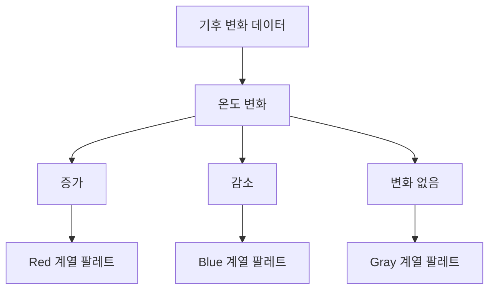
```mermaid
graph TD
    ClimateData["기후 변화 데이터"]
    TempChange["온도 변화"]
    Increase["증가"]
    Decrease["감소"]
    NoChange["변화 없음"]
    RedPalette["Red 계열 팔레트"]
    BluePalette["Blue 계열 팔레트"]
    GrayPalette["Gray 계열 팔레트"]
    ClimateData --> TempChange
    TempChange --> Increase
    TempChange --> Decrease
    TempChange --> NoChange
    Increase --> RedPalette
    Decrease --> BluePalette
    NoChange --> GrayPalette
```

---

## FAQ

**ColorBrewer는 무료인가요?**

네. [ColorBrewer 2.0](https://colorbrewer2.org)은 웹에서 무료로 사용할 수 있으며, Apache 2.0 라이선스로 배포된다. 상업·교육·연구 목적 모두 사용 가능하나, 라이선스 문구 확인을 권장한다.

**ColorBrewer의 색상 선택 기준은 무엇인가요?**

데이터의 **성격**(연속·발산·질적)과 **표시 환경**(화면·인쇄·프로젝터), **접근성**(색맹 안전 여부)을 기준으로 한다. Sequential은 연속 데이터, Divergent는 중심 기준 대비, Qualitative은 범주 구분에 맞춰 설계되었다.

**색맹 사용자에게 적합한 색상 조합은 어떻게 선택하나요?**

ColorBrewer 웹에서 **"colorblind safe"** 옵션을 켜면 해당 조건을 만족하는 팔레트만 표시된다. [color-blindness.com](https://www.color-blindness.com) 등에서 색각 이상 유형(Protanopia, Deuteranopia 등)과 시뮬레이션 도구를 참고해 대비와 구별 가능성을 추가로 검증할 수 있다.

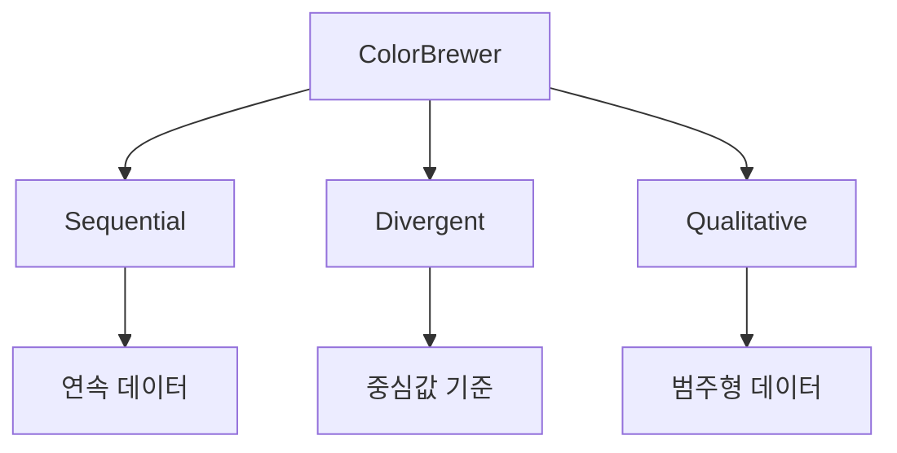
```mermaid
graph TD
    ColorBrewerRoot["ColorBrewer"]
    SequentialNode["Sequential"]
    DivergentNode["Divergent"]
    QualitativeNode["Qualitative"]
    ContinuousData["연속 데이터"]
    CenterBased["중심값 기준"]
    CategoricalData["범주형 데이터"]
    ColorBrewerRoot --> SequentialNode
    ColorBrewerRoot --> DivergentNode
    ColorBrewerRoot --> QualitativeNode
    SequentialNode --> ContinuousData
    DivergentNode --> CenterBased
    QualitativeNode --> CategoricalData
```

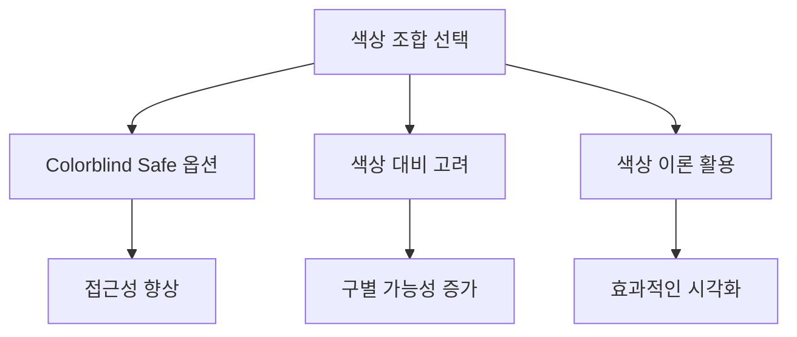
```mermaid
graph TD
    ColorChoice["색상 조합 선택"]
    ColorblindSafeOpt["Colorblind Safe 옵션"]
    ContrastConsider["색상 대비 고려"]
    ColorTheory["색상 이론 활용"]
    AccessibilityUp["접근성 향상"]
    DistinguishUp["구별 가능성 증가"]
    EffectiveViz["효과적인 시각화"]
    ColorChoice --> ColorblindSafeOpt
    ColorChoice --> ContrastConsider
    ColorChoice --> ColorTheory
    ColorblindSafeOpt --> AccessibilityUp
    ContrastConsider --> DistinguishUp
    ColorTheory --> EffectiveViz
```

---

## 관련 기술

### GIS (Geographic Information Systems)

GIS는 지리 데이터의 수집·저장·분석·시각화를 담당한다. ColorBrewer는 GIS 소프트웨어에서 팔레트를 선택할 때 참고 도구로 널리 쓰이며, 공간 데이터의 시각적 표현 품질을 높이는 데 기여한다.

### 데이터 시각화 (Data Visualization)

데이터를 그래프·지도·대시보드로 표현해 패턴과 경향을 전달하는 기술이다. ColorBrewer는 색상 선택 단계에서 표준처럼 사용되며, 잘못된 색으로 인한 오해를 줄이고 의사 결정을 돕는다.

### 색상 이론 (Color Theory)

색상 이론은 색의 조합·대비·인지 효과를 다룬다. ColorBrewer 팔레트는 채도·명도·색조 관계를 고려해 설계되었으며, 시각화 품질과 접근성 향상에 적용된다.

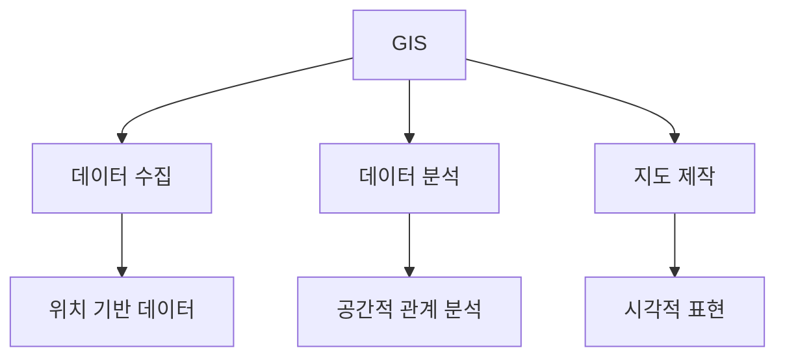
```mermaid
graph TD
    GISNode["GIS"]
    DataCollect["데이터 수집"]
    DataAnalyze["데이터 분석"]
    MapMakeNode["지도 제작"]
    LocationData["위치 기반 데이터"]
    SpatialRel["공간적 관계 분석"]
    VisualExpr["시각적 표현"]
    GISNode --> DataCollect
    GISNode --> DataAnalyze
    GISNode --> MapMakeNode
    DataCollect --> LocationData
    DataAnalyze --> SpatialRel
    MapMakeNode --> VisualExpr
```

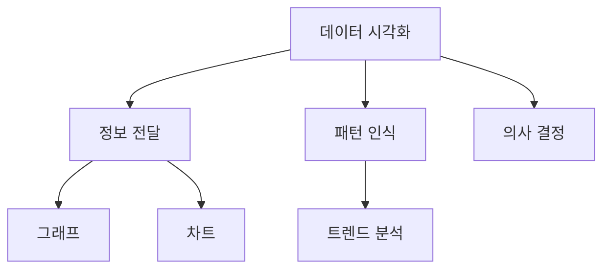
```mermaid
graph TD
    DataVizNode["데이터 시각화"]
    InfoDeliver["정보 전달"]
    PatternRecog["패턴 인식"]
    DecisionSupport["의사 결정"]
    GraphNode["그래프"]
    ChartNode["차트"]
    TrendAnalysis["트렌드 분석"]
    DataVizNode --> InfoDeliver
    DataVizNode --> PatternRecog
    DataVizNode --> DecisionSupport
    InfoDeliver --> GraphNode
    InfoDeliver --> ChartNode
    PatternRecog --> TrendAnalysis
```

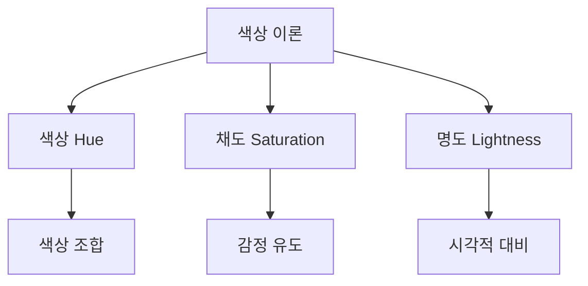
```mermaid
graph TD
    ColorTheory["색상 이론"]
    HueNode["색상 Hue"]
    SaturationNode["채도 Saturation"]
    LightnessNode["명도 Lightness"]
    ColorCombine["색상 조합"]
    EmotionLead["감정 유도"]
    VisualContrast["시각적 대비"]
    ColorTheory --> HueNode
    ColorTheory --> SaturationNode
    ColorTheory --> LightnessNode
    HueNode --> ColorCombine
    SaturationNode --> EmotionLead
    LightnessNode --> VisualContrast
```

---

## 결론

### ColorBrewer의 중요성 및 미래 전망

ColorBrewer는 데이터 시각화에서 **색상 선택의 표준**으로 자리 잡았으며, 기후·인구·경제 등 복잡한 데이터를 명확히 전달하는 데 기여한다. 앞으로도 데이터 시각화 수요가 늘어남에 따라, AI 기반 맞춤 팔레트 추천이나 더 많은 접근성 옵션이 도입될 여지가 있다.

### 색상 선택의 영향력

색상은 단순한 장식이 아니라 **정보 전달의 일부**다. 적절한 팔레트는 패턴을 부각하고 기억에 남는 시각화를 만들며, 부적절한 선택은 오해와 왜곡을 낳는다. ColorBrewer를 활용해 데이터 성격과 사용 환경에 맞는 팔레트를 선택하는 습관을 권한다.

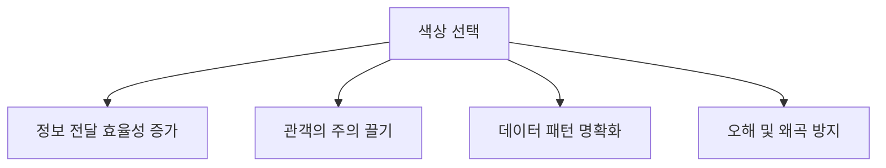
```mermaid
graph TD
    ColorSelect["색상 선택"]
    InfoEfficiency["정보 전달 효율성 증가"]
    AudienceAttention["관객의 주의 끌기"]
    PatternClear["데이터 패턴 명확화"]
    PreventMisread["오해 및 왜곡 방지"]
    ColorSelect --> InfoEfficiency
    ColorSelect --> AudienceAttention
    ColorSelect --> PatternClear
    ColorSelect --> PreventMisread
```

---

## 참고 문헌

1. **[ColorBrewer 2.0](https://colorbrewer2.org)** — Cynthia Brewer, Mark Harrower, Penn State. 공식 온라인 도구로 팔레트 선택·내보내기(HEX, RGB, CSS, JavaScript 등) 제공.
2. **[ColorBrewer - Wikipedia](https://en.wikipedia.org/wiki/ColorBrewer)** — ColorBrewer 소개, 팔레트 목록(Sequential·Divergent·Qualitative), Warming Stripes·라이선스·외부 링크 정리.
3. **Harrower, M.; Brewer, C. A. (2003). "ColorBrewer.org: An Online Tool for Selecting Colour Schemes for Maps". *The Cartographic Journal* 40(1): 27–37.** — ColorBrewer 설계 배경과 지도 색상 선택 원리 (DOI: 10.1179/000870403235002042).
4. **[Colblindor – All about Color Blindness](https://www.color-blindness.com)** — 색각 이상 유형·테스트·시뮬레이션, 접근성 있는 색상 선택 참고 자료.
