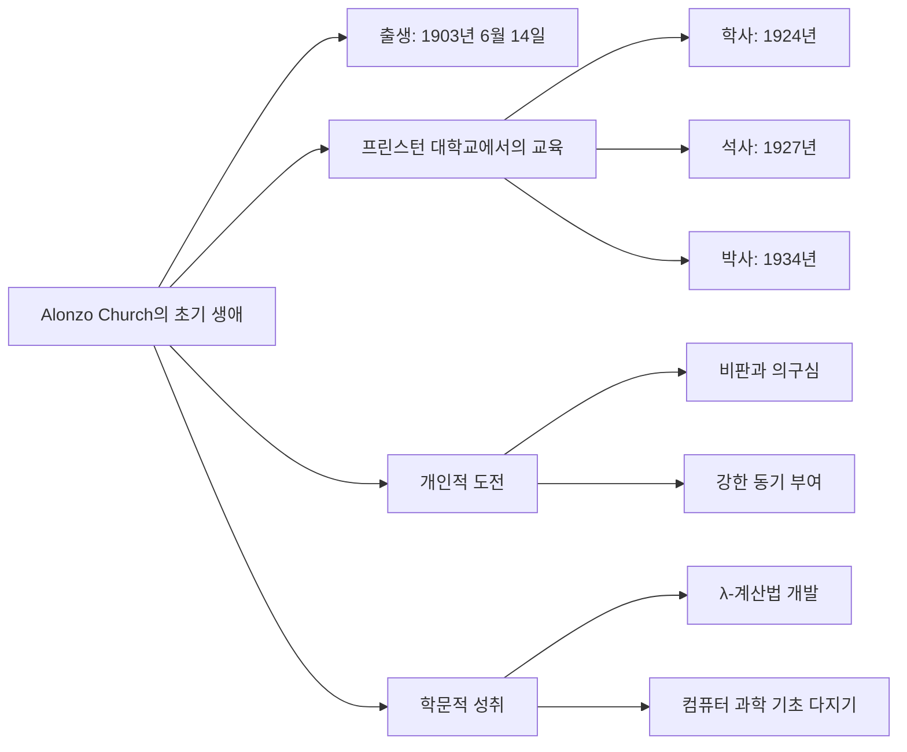
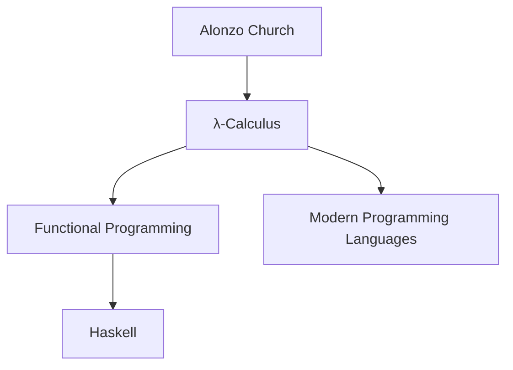
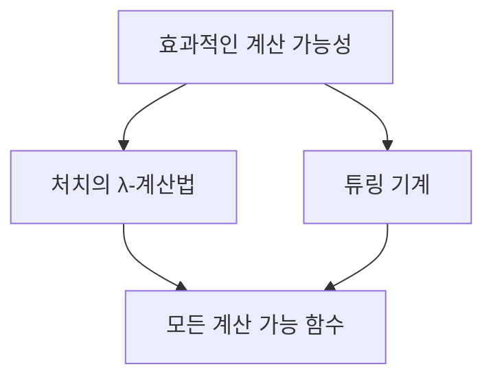

알론조 처치(Alonzo Church)는 컴퓨터 과학과 수학의 역사에서 중요한 역할을 한 인물이다. 그는 1903년 6월 14일 워싱턴 D.C.에서 태어났으며, 조용하고 부드러운 성격의 논리학자로서 그의 업적은 오늘날 우리가 알고 있는 컴퓨터 과학의 기초를 다졌다.

처치는 λ-계산법(λ-calculus)이라는 형식 체계를 개발하였고, 이는 계산 가능성 이론과 프로그래밍 언어의 이론적 기반이 되었다. 1936년, 그는 효과적으로 계산 가능한 함수의 개념을 정립하였으며, 이는 앨런 튜링과 함께 독립적으로 제안한 처치-튜링 논제로 알려져 있다. 이 논제는 모든 효과적으로 계산 가능한 함수는 λ-계산법이나 튜링 기계로 계산될 수 있다는 내용을 담고 있다.

또한 처치는 결정 문제(Entscheidungsproblem)에 대한 연구를 통해, 모든 수학적 진술의 참거짓을 결정할 수 있는 일반적인 알고리즘이 존재하지 않음을 증명하였다. 그의 연구는 컴퓨터 과학의 한계를 이해하는 데 중요한 기여를 하였다.

처치는 프린스턴 대학교에서 교수로 재직하며 많은 제자들을 양성하였고, 그중에는 앨런 튜링도 포함되어 있다. 그의 업적은 현대 프로그래밍 언어의 논리적 기초를 제공하며, 계산 이론의 발전에도 큰 영향을 미쳤다.

알론조 처치의 업적은 종종 간과되지만, 그의 기여는 컴퓨터 과학의 발전에 있어 필수적이다. 그의 조용한 천재성은 세상의 변화를 이끌어내는 데 중요한 역할을 하였으며, 우리는 그를 기억하고 그의 업적을 기념해야 한다.

<!--
##### Outline #####
-->

<!--
# Alonzo Church: 컴퓨터 과학의 숨은 거장

## 개요
   - Alonzo Church의 생애와 업적
   - 컴퓨터 과학과 인공지능에 대한 그의 영향

## Alonzo Church의 초기 생애
   - 출생과 교육 배경
   - 개인적 도전과 학문적 성취

## λ-계산법 (Lambda Calculus)
   - λ-계산법의 정의와 중요성
   - Turing 기계와의 관계
   - 현대 프로그래밍 언어에 미친 영향

## Church-Turing Thesis
   - Church-Turing Thesis의 개념
   - '효과적인 계산 가능성'의 해석
   - 알고리즘적 과정의 한계

## Entscheidungsproblem과 Church의 정리
   - Entscheidungsproblem의 배경
   - Church의 정리가 미친 영향
   - 결정 이론에 대한 기여

## 멘토로서의 Church
   - 그의 제자들: Stephen Kleene, J. Barkley Rosser, Alan Turing
   - Princeton 대학교에서의 교육적 영향

## Church의 유산
   - 현대 컴퓨터 과학에 대한 Church의 기여
   - λ-계산법의 현대적 적용
   - 인공지능 발전에 대한 기초적 기여

## 관련 기술
   - 함수형 프로그래밍 (Functional Programming)
   - Turing 기계 (Turing Machine)
   - 알고리즘과 복잡도 이론 (Algorithms and Complexity Theory)

## FAQ
   - Alonzo Church는 왜 Turing보다 덜 알려져 있나요?
   - λ-계산법은 어떤 프로그래밍 언어에 영향을 미쳤나요?
   - Church의 정리는 오늘날에도 여전히 유효한가요?

## 결론
   - Alonzo Church의 중요성과 그의 업적을 기리는 이유
   - 현대 기술에서 그의 영향력 재조명

## 추천 자료
   - Alonzo Church의 생애와 업적에 대한 추가 읽기
   - 관련 논문 및 저서 목록

## 추가 자료
   - Alonzo Church에 대한 회고 및 인터뷰
   - Church의 연구가 현대 컴퓨터 과학에 미친 영향에 대한 논의

이 목차는 Alonzo Church의 생애와 업적을 다각도로 조명하며, 그의 기여가 현대 컴퓨터 과학과 인공지능에 미친 영향을 깊이 있게 탐구하는 데 도움을 줄 것입니다.
-->

<!--
## 개요
   - Alonzo Church의 생애와 업적
   - 컴퓨터 과학과 인공지능에 대한 그의 영향
-->

## 개요

알론조 처치(Alonzo Church)는 20세기 컴퓨터 과학의 기초를 다진 중요한 인물 중 하나이다. 1903년 6월 14일 워싱턴 D.C.에서 태어나 1995년 8월 11일 세상을 떠났다. 그의 연구는 현대 컴퓨터 이론과 인공지능의 발전에 지대한 영향을 미쳤다. 처치는 주로 λ-계산법(람다 대수)과 처치-튜링 논제로 잘 알려져 있으며, 이는 계산 가능성 이론의 기초를 형성하는 데 기여하였다. 

**Alonzo Church의 생애와 업적**

알론조 처치(Alonzo Church)는 프린스턴 대학교에서 수학을 전공하였고, 이후 수학과 논리학 분야에서 많은 연구를 진행하였다. 그의 가장 유명한 업적 중 하나는 λ-계산법(람다 대수)의 개발로, 이는 함수와 계산의 개념을 수학적으로 정립하는 데 중요한 역할을 하였다. λ-계산법은 함수형 프로그래밍의 기초가 되었으며, 현대 프로그래밍 언어의 발전에도 큰 영향을 미쳤다. 

**컴퓨터 과학과 인공지능에 대한 그의 영향**

알론조 처치의 연구는 컴퓨터 과학의 여러 분야에 깊은 영향을 미쳤다. 특히, 그가 개발한 λ-계산법은 함수형 프로그래밍 언어의 발전에 기여하였으며, 이는 인공지능 시스템의 설계와 구현에도 중요한 역할을 하였다. 또한, 처치-튜링 논제는 계산 가능성에 대한 이해를 심화시켰으며, 이는 알고리즘과 복잡도 이론의 기초가 되었다. 

다음은 λ-계산법의 기본 개념을 설명하는 간단한 다이어그램이다.


이 다이어그램은 λ-계산법에서 입력이 함수에 의해 처리되어 출력을 생성하는 과정을 나타낸다. λ-계산법은 이러한 함수의 정의와 평가를 통해 계산을 수행하는 방법을 제시한다. 

Alonzo Church의 업적은 오늘날에도 여전히 중요한 의미를 지니며, 그의 연구는 컴퓨터 과학과 인공지능의 발전에 지속적으로 기여하고 있다.

<!--
## Alonzo Church의 초기 생애
   - 출생과 교육 배경
   - 개인적 도전과 학문적 성취
-->

## Alonzo Church의 초기 생애

알론조 처치(Alonzo Church)는 1903년 6월 14일 미국 워싱턴 D.C.에서 태어났다.  그는 프린스턴 대학교에서 수학을 전공하여 1924년에 학사 학위를, 1927년에 박사 학위를 취득하였다. 박사 과정에서 그의 지도교수는 저명한 수학자이자 논리학자인 오스왈드 베블런(Oswald Veblen)이었다.  

**출생과 교육 배경**

알론조 처치는 어린 시절부터 수학과 논리에 깊은 흥미를 보였다. 그는 고등학교 시절부터 수학 경시대회에 참가하며 두각을 나타냈고, 이는 그가 수학 분야에서의 경력을 쌓는 데 큰 도움이 되었다. 프린스턴 대학교에서의 학업은 그의 지적 호기심을 더욱 자극하였고, 그는 수학과 논리학의 기초를 다지게 되었다. 그의 연구는 주로 수학적 논리와 기계적 계산 가능성에 초점을 맞추었으며, 이는 그가 나중에 λ-계산법을 개발하는 데 중요한 밑바탕이 되었다. 

**개인적 도전과 학문적 성취**

알론조 처치(Alonzo Church)는 1903년 6월 14일 워싱턴 D.C.에서 태어났다. 어린 시절, 공기총 사고로 한쪽 눈의 시력을 잃는 어려움을 겪었다.  그럼에도 불구하고 학문에 대한 열정을 잃지 않았으며, 1920년 프린스턴 대학교에 입학하여 1924년 학사 학위를, 1927년 박사 학위를 취득하였다. 

처치는 λ-계산법(람다 대수)을 개발하여 함수와 계산의 개념을 수학적으로 정립하였다. 이러한 혁신적인 연구는 당시 수학계의 전통적인 사고방식에 도전하는 것이었으며, 초기에는 비판과 의구심에 직면하기도 하였다. 그러나 그의 연구는 후에 컴퓨터 과학의 기초를 다지는 데 큰 기여를 하였다.

처치의 학문적 여정은 많은 이들에게 영감을 주었으며, 오늘날에도 그의 업적은 연구자들에게 큰 영향을 미치고 있다. 



이와 같은 초기 생애의 경험들은 Alonzo Church가 나중에 컴퓨터 과학의 거장으로 성장하는 데 중요한 역할을 하였다.

<!--
## λ-계산법 (Lambda Calculus)
   - λ-계산법의 정의와 중요성
   - Turing 기계와의 관계
   - 현대 프로그래밍 언어에 미친 영향
-->

## λ-계산법 (Lambda Calculus)

### λ-계산법의 정의와 중요성

λ-계산법(람다 대수)은 함수의 정의와 적용을 통해 수학적 계산을 표현하는 형식적 시스템이다. 알론조 처치(Alonzo Church)는 1930년대에 이 개념을 도입하였으며, 이는 수학적 논리와 컴퓨터 과학의 기초를 형성하는 데 중요한 역할을 하였다. λ-계산법은 함수형 프로그래밍의 기초가 되며, 함수의 추상화와 조합을 통해 복잡한 계산을 단순화할 수 있는 강력한 도구이다. 

### Turing 기계와의 관계

λ-계산법과 튜링 기계는 계산 가능성 이론의 핵심을 이루는 두 가지 형식 체계이다. 알론조 처치(Alonzo Church)는 1930년대에 λ-계산법을 개발하였고, 앨런 튜링(Alan Turing)은 튜링 기계를 제안하였다. 처치-튜링 논제에 따르면, λ-계산법과 튜링 기계는 동일한 계산 능력을 지니며, 이는 모든 계산 가능한 함수가 두 체계 중 하나로 표현되고 구현될 수 있음을 의미한다.  이러한 상호 보완적인 관계는 컴퓨터 과학의 근본 원리를 이해하는 데 필수적이다. 


### 현대 프로그래밍 언어에 미친 영향

λ-계산법은 현대 프로그래밍 언어의 설계와 구현에 지대한 영향을 미쳤다. 특히, 함수형 프로그래밍 언어인 Haskell, Scala, 그리고 JavaScript의 일부 기능은 λ-계산법의 개념을 기반으로 하고 있다. 이러한 언어들은 고차 함수, 클로저, 그리고 불변성(immutability)과 같은 개념을 통해 프로그래밍의 패러다임을 변화시켰다. 

예를 들어, JavaScript에서의 고차 함수 사용 예시는 다음과 같다:

```javascript
const add = (x) => (y) => x + y;

const add5 = add(5);
console.log(add5(3)); // 8
```

위의 코드에서 `add` 함수는 다른 함수를 반환하는 고차 함수의 예시로, λ-계산법의 함수 추상화 개념을 잘 보여준다. 이러한 방식은 코드의 재사용성과 가독성을 높이는 데 기여한다. 

결론적으로, λ-계산법은 컴퓨터 과학의 기초를 형성하며, 현대 프로그래밍 언어의 발전에 큰 영향을 미친다.

<!--
## Church-Turing Thesis
   - Church-Turing Thesis의 개념
   - '효과적인 계산 가능성'의 해석
   - 알고리즘적 과정의 한계
-->

## Church-Turing Thesis

처치-튜링 논제(Church-Turing Thesis)는 컴퓨터 과학의 근본적인 개념 중 하나로, 계산 가능성에 대한 이론적 기초를 제공한다. 이 논제는 알론조 처치(Alonzo Church)와 앨런 튜링(Alan Turing)이 독립적으로 제안한 것으로, 어떤 함수가 효과적으로 계산 가능한지를 정의하고 있다. 처치와 튜링은 각각 λ-계산법과 튜링 기계를 통해 계산 가능성을 형식화하였으며, 이 두 모델이 동일한 계산 능력을 지님을 보였다. 따라서, 처치-튜링 논제는 모든 효과적으로 계산 가능한 함수는 튜링 기계로 계산될 수 있음을 의미하며, 이는 컴퓨터 과학에서 계산 가능성의 한계를 이해하는 데 중요한 역할을 한다. 

**Church-Turing Thesis의 개념**

처치-튜링 논제(Church-Turing Thesis)는 "모든 효과적인 계산은 튜링 기계에 의해 수행될 수 있다"는 주장을 담고 있다. 이는 어떤 알고리즘이든 튜링 기계로 구현할 수 있음을 의미하며, 따라서 튜링 기계가 계산 가능성의 기준이 된다. 이 주장은 컴퓨터 과학의 기초를 형성하며, 계산의 본질에 대한 이해를 돕는다.  

**'효과적인 계산 가능성'의 해석**

'효과적인 계산 가능성'은 특정 문제를 해결하기 위한 절차적 방법을 의미하며, 이는 인간이나 기계가 수행할 수 있는 계산을 포함한다. 예를 들어, 자연수의 덧셈이나 곱셈과 같은 기본적인 연산은 효과적인 계산으로 간주된다. 그러나 모든 문제에 대해 효과적인 계산이 가능한 것은 아니며, 이는 알고리즘적 과정의 한계와 관련이 있다. 이러한 한계를 이해하는 것은 컴퓨터 과학과 수학에서 매우 중요하다. 

**알고리즘적 과정의 한계**

처치-튜링 논제는 알고리즘적 과정의 한계를 명확히 한다. 예를 들어, 멈춤 문제(Halting Problem)는 튜링 기계로 해결할 수 없는 문제로 알려져 있다. 이는 어떤 프로그램이 주어진 입력에서 유한한 시간 내에 멈출지 아니면 무한히 계속 실행될지를 결정하는 알고리즘이 존재하지 않는다는 것을 의미한다.  이러한 한계는 계산 가능성의 경계를 설정하며, 컴퓨터 과학의 여러 분야에서 중요한 역할을 한다. 


위의 다이어그램은 문제 정의에서 시작하여 효과적인 계산 가능성을 판단하는 과정을 보여준다. 효과적인 계산이 가능할 경우 알고리즘을 설계하고 결과를 도출할 수 있지만, 그렇지 않은 경우에는 해결할 수 없는 문제로 남게 된다. 

Church-Turing Thesis는 컴퓨터 과학의 기초를 형성하며, 현대의 프로그래밍 언어와 알고리즘 설계에 깊은 영향을 미치고 있다. 이 개념은 계산 가능성에 대한 이해를 넓히고, 알고리즘의 한계를 인식하는 데 중요한 역할을 한다.

<!--
## Entscheidungsproblem과 Church의 정리
   - Entscheidungsproblem의 배경
   - Church의 정리가 미친 영향
   - 결정 이론에 대한 기여
-->

## Entscheidungsproblem과 Church의 정리

**Entscheidungsproblem의 배경**

Entscheidungsproblem은 1928년 수학자 다비드 힐베르트(David Hilbert)와 빌헬름 아커만(Wilhelm Ackermann)에 의해 제기된 문제로, 주어진 수학적 명제가 참인지 거짓인지 결정할 수 있는 일반적인 알고리즘이 존재하는지를 묻는 질문이다.  이 문제는 수학의 기초를 확립하려는 시도로, 모든 수학적 진술의 진위를 결정할 수 있는 방법을 찾고자 하였다. 그러나 1936년 알론조 처치(Alonzo Church)와 앨런 튜링(Alan Turing)은 각각 독립적으로 이러한 일반적인 알고리즘이 존재하지 않음을 증명하였다.  이러한 결과는 수학적 논리와 계산 가능성의 한계를 드러내며, 컴퓨터 과학과 수학의 발전에 중요한 영향을 미쳤다. 

**Church의 정리가 미친 영향**

알론조 처치(Alonzo Church)는 1936년 논문 "An Unsolvable Problem of Elementary Number Theory"에서 λ-계산법을 활용하여 결정 문제(Entscheidungsproblem)가 해결 불가능함을 증명하였다.  그는 모든 효과적으로 계산 가능한 함수는 λ-계산법으로 표현될 수 있음을 보였으며, 이를 통해 모든 수학적 진술의 진위를 결정할 수 있는 일반적인 알고리즘이 존재하지 않음을 밝혔다. 이러한 결과는 수학적 논리와 계산 가능성 이론에 중요한 영향을 미쳤다.

- **결정 불가능성**: 어떤 수학적 명제에 대해, 그 명제가 참인지 거짓인지 결정할 수 있는 알고리즘이 존재하지 않음을 증명하였다.
- **계산 가능성의 한계**: 처치의 정리는 계산 가능성 이론의 기초를 형성하며, 튜링의 결과와 함께 현대 컴퓨터 과학의 기초를 다지게 되었다. 

**결정 이론에 대한 기여**

Church의 연구는 결정 이론에 큰 영향을 미쳤다. 그의 정리는 다음과 같은 기여를 포함한다:

- **형식적 시스템의 한계**: Church는 모든 형식적 시스템이 결정 가능한 문제를 해결할 수 없음을 보여주었다. 이는 Gödel의 불완전성 정리와도 연결된다.
- **알고리즘적 접근**: Church의 정리는 알고리즘적 접근의 한계를 명확히 하여, 컴퓨터 과학의 발전에 기여하였다.

다음은 λ-계산법을 사용하여 간단한 수학적 명제를 표현하는 예시 코드이다:

```python
# λ-계산법을 사용한 간단한 예시
def λ_calculus_example(x):
    return x + 1

result = λ_calculus_example(5)
print(result)  # 출력: 6
```

또한, 다음은 Entscheidungsproblem과 Church의 정리를 시각적으로 나타낸 다이어그램이다:


이와 같이, Alonzo Church의 연구는 Entscheidungsproblem과 관련된 여러 문제를 해결하는 데 중요한 기여를 하였으며, 현대 컴퓨터 과학의 기초를 다지는 데 큰 역할을 하였다.

<!--
## 멘토로서의 Church
   - 그의 제자들: Stephen Kleene, J. Barkley Rosser, Alan Turing
   - Princeton 대학교에서의 교육적 영향
-->

## 멘토로서의 Church

Alonzo Church는 그의 제자들에게 큰 영향을 미친 멘토로 알려져 있다. 그의 교육적 접근 방식과 연구는 많은 후학들에게 영감을 주었으며, 이들은 각자의 분야에서 중요한 기여를 하였다.

### 그의 제자들: Stephen Kleene, J. Barkley Rosser, Alan Turing

알론조 처치(Alonzo Church)는 수학적 논리와 컴퓨터 과학 분야에서 많은 제자를 양성하였으며, 그들의 연구는 현대 컴퓨터 과학의 발전에 큰 기여를 하였다.

- **스티븐 클레이니(Stephen Kleene)**: 처치의 제자 중 한 명으로, λ-계산법과 관련된 여러 연구를 진행하였다. 그는 재귀 함수 이론과 정리 이론에 중요한 공헌을 하였으며, 그의 작업은 수학적 논리와 컴퓨터 과학의 기초를 다지는 데 기여하였다.

- **J. 바클리 로서(J. Barkley Rosser)**: 처치의 또 다른 제자로서, 수학적 논리와 컴퓨터 과학의 교차점에서 연구를 수행하였다. 로서는 처치-로서 정리(Church-Rosser theorem)를 공동으로 발표하였으며, 이는 λ-계산법의 일관성과 관련된 중요한 결과이다.

- **앨런 튜링(Alan Turing)**: 처치와 동시대의 수학자로, 두 사람은 서로의 연구에 큰 영향을 주었다. 튜링은 처치의 λ-계산법을 바탕으로 튜링 기계를 개발하였으며, 이는 컴퓨터 과학의 기초가 되었다. 처치와 튜링은 계산 가능성에 대한 연구를 통해 처치-튜링 논제를 제안하였으며, 이는 현대 컴퓨터 과학과 인공지능의 발전에 큰 영향을 미쳤다.

이러한 제자들의 연구는 처치의 지도 아래 이루어졌으며, 그들의 업적은 오늘날의 컴퓨터 과학과 수학적 논리의 발전에 큰 기여를 하였다. 

### Princeton 대학교에서의 교육적 영향

알론조 처치(Alonzo Church)는 1929년부터 1967년까지 프린스턴 대학교에서 수학과 교수로 재직하며 많은 학생들에게 깊은 영향을 미쳤다.  그의 강의는 학생들에게 깊은 사고를 요구하였으며, 이는 학생들이 문제를 해결하는 데 필요한 비판적 사고 능력을 기르는 데 도움을 주었다. 처치는 단순한 지식 전달을 넘어, 학생들이 스스로 사고하고 연구할 수 있는 환경을 조성하였다. 그의 지도 아래 앨런 튜링(Alan Turing), 스티븐 클레이니(Stephen Kleene), J. 바클리 로서(J. Barkley Rosser) 등 많은 저명한 학자들이 배출되었다.  


위의 다이어그램은 Alonzo Church와 그의 제자들 간의 관계를 나타낸다. 각 제자는 Church의 영향을 받아 각자의 분야에서 중요한 기여를 하였음을 보여준다. Church의 멘토링은 단순한 지식 전달을 넘어, 제자들이 독립적으로 사고하고 연구할 수 있는 기반을 마련하였다. 이러한 교육적 영향은 현대 컴퓨터 과학의 발전에 지대한 영향을 미쳤다.

<!--
## Church의 유산
   - 현대 컴퓨터 과학에 대한 Church의 기여
   - λ-계산법의 현대적 적용
   - 인공지능 발전에 대한 기초적 기여
-->

## Church의 유산

### 현대 컴퓨터 과학에 대한 Church의 기여

알론조 처치(Alonzo Church)는 현대 컴퓨터 과학의 기초를 다지는 데 중요한 역할을 하였다. 그가 개발한 λ-계산법은 함수형 프로그래밍의 이론적 기초를 제공하였으며, 이는 현대 프로그래밍 언어의 설계와 구현에 큰 영향을 미쳤다. λ-계산법은 함수의 정의와 적용을 수학적으로 표현할 수 있는 강력한 도구로, 프로그래밍 언어의 함수적 특성을 이해하는 데 필수적이다. 예를 들어, Haskell과 같은 현대 프로그래밍 언어는 λ-계산법의 개념을 바탕으로 함수형 프로그래밍을 지원한다.  또한, 처치의 연구는 계산 이론과 알고리즘의 발전에도 기여하였다. 



### λ-계산법의 현대적 적용

λ-계산법은 현대 컴퓨터 과학의 다양한 분야에서 실제로 적용되고 있다. 특히 함수형 프로그래밍 언어에서는 λ-계산법의 개념이 핵심적인 역할을 한다. 이러한 언어들은 불변성(immutability)과 고차 함수(higher-order functions)를 지원하여 코드의 재사용성과 가독성을 높인다.

예를 들어, Haskell에서는 λ-계산법을 기반으로 한 함수 정의가 일반적이다. 다음은 Haskell에서의 간단한 λ-함수 예시이다.

```haskell
-- 두 수를 더하는 함수 정의
add = \x -> \y -> x + y
result = add 3 5  -- result는 8이 된다.
```

이와 같이 λ-계산법은 현대 프로그래밍 언어에서 함수의 정의와 사용을 간결하게 표현할 수 있는 방법을 제공한다. 또한, Haskell에서는 고차 함수와 같은 기능을 통해 복잡한 연산을 단순화할 수 있다.  

### 인공지능 발전에 대한 기초적 기여

알론조 처치(Alonzo Church)의 연구는 인공지능(AI) 분야에도 중요한 기초를 제공하였다. 그가 개발한 λ-계산법은 함수형 프로그래밍의 이론적 기반을 형성하였으며, 이는 AI 시스템의 설계와 구현에 유용한 접근 방식을 제공한다. 함수형 프로그래밍은 순수 함수와 불변성을 강조하여 코드의 모듈화와 재사용성을 높이며, 이는 복잡한 AI 알고리즘의 구현에 특히 유용하다.  예를 들어, 신경망(neural networks)과 같은 복잡한 구조는 함수형 프로그래밍의 개념을 활용하여 구현될 수 있다. 이러한 접근 방식은 코드의 가독성과 유지보수성을 향상시켜 AI 시스템의 개발을 보다 효율적으로 만들어준다. 결론적으로, 알론조 처치의 유산은 현대 컴퓨터 과학과 인공지능의 발전에 지대한 영향을 미쳤으며, 그의 연구는 앞으로도 계속해서 중요한 역할을 할 것이다. 

<!--
## 관련 기술
   - 함수형 프로그래밍 (Functional Programming)
   - Turing 기계 (Turing Machine)
   - 알고리즘과 복잡도 이론 (Algorithms and Complexity Theory)
-->

## 관련 기술

### 함수형 프로그래밍 (Functional Programming)

함수형 프로그래밍은 수학적 함수의 개념을 기반으로 한 프로그래밍 패러다임이다. 이 패러다임에서는 상태와 가변 데이터를 피하고, 대신 순수 함수(pure function)를 사용하여 데이터를 처리한다. 함수형 프로그래밍의 주요 특징은 다음과 같다.

- **순수 함수**: 동일한 입력에 대해 항상 동일한 출력을 반환하며, 외부 상태에 영향을 미치지 않는다.
- **고차 함수**: 함수를 인자로 받거나 함수를 반환하는 함수이다.
- **불변성**: 데이터는 변경되지 않으며, 새로운 데이터를 생성하는 방식으로 작업한다.

함수형 프로그래밍은 λ-계산법의 개념을 바탕으로 하여, 현대 프로그래밍 언어에서 널리 사용되고 있다. 예를 들어, JavaScript, Python, Haskell 등에서 함수형 프로그래밍의 요소를 찾아볼 수 있다.

```javascript
// JavaScript에서의 고차 함수 예시
const numbers = [1, 2, 3, 4, 5];

// map 함수를 사용하여 각 요소에 2를 곱하는 함수
const doubled = numbers.map(num => num * 2);
console.log(doubled); // [2, 4, 6, 8, 10]
```

### Turing 기계 (Turing Machine)

Turing 기계는 Alan Turing이 제안한 이론적 계산 모델로, 알고리즘의 개념을 형식화하는 데 중요한 역할을 한다. Turing 기계는 다음과 같은 구성 요소로 이루어져 있다.

- **테이프**: 무한한 길이를 가진 메모리로, 각 셀에 기호를 저장할 수 있다.
- **헤드**: 테이프 위를 이동하며 기호를 읽고 쓸 수 있는 장치이다.
- **상태**: Turing 기계의 현재 상태를 나타내며, 상태 전이 규칙에 따라 변화한다.

Turing 기계는 계산 가능성(computability) 이론의 기초를 제공하며, Church-Turing Thesis에 의해 모든 계산 가능한 문제는 Turing 기계로 해결할 수 있음을 보여준다.


### 알고리즘과 복잡도 이론 (Algorithms and Complexity Theory)

알고리즘과 복잡도 이론은 문제를 해결하기 위한 절차와 그 절차의 효율성을 연구하는 분야이다. 알고리즘은 특정 문제를 해결하기 위한 단계적 절차를 의미하며, 복잡도 이론은 알고리즘의 성능을 분석하는 데 중점을 둔다.

- **시간 복잡도**: 알고리즘이 문제를 해결하는 데 걸리는 시간의 양을 나타낸다.
- **공간 복잡도**: 알고리즘이 문제를 해결하는 데 필요한 메모리의 양을 나타낸다.

알고리즘의 효율성을 분석하는 것은 소프트웨어 개발에서 매우 중요하며, 최적화된 알고리즘을 선택하는 것은 성능 향상에 기여한다. 예를 들어, 정렬 알고리즘의 경우, Quick Sort와 Merge Sort는 각각 O(n log n)의 시간 복잡도를 가지며, 특정 상황에서 더 나은 성능을 발휘할 수 있다.

이와 같은 관련 기술들은 Alonzo Church의 λ-계산법과 밀접한 관계를 가지며, 현대 컴퓨터 과학의 기초를 형성하고 있다.

<!--
## FAQ
   - Alonzo Church는 왜 Turing보다 덜 알려져 있나요?
   - λ-계산법은 어떤 프로그래밍 언어에 영향을 미쳤나요?
   - Church의 정리는 오늘날에도 여전히 유효한가요?
-->

## FAQ

### Alonzo Church는 왜 Turing보다 덜 알려져 있나요?

알론조 처치(Alonzo Church)는 컴퓨터 과학의 기초를 다진 중요한 인물이지만, 앨런 튜링(Alan Turing)에 비해 대중에게 덜 알려져 있다. 이는 여러 요인에 기인한다.

첫째, 튜링은 '튜링 머신'과 '튜링 테스트' 등 그의 이름을 딴 개념을 통해 대중에게 더 친숙하게 다가갔다. 특히, 제2차 세계대전 중 독일의 에니그마 암호를 해독하여 전쟁의 향방에 큰 영향을 미친 그의 업적은 널리 알려져 있다. 

둘째, 튜링의 생애는 영화와 문학에서 자주 다루어져 대중의 관심을 끌었다. 예를 들어, 영화 '이미테이션 게임'은 그의 삶과 업적을 조명하여 많은 이들의 주목을 받았다. 또한, 그의 개인적 이야기와 비극적인 결말은 사람들의 감정을 자극하였다.

반면, 처치는 주로 학문적 연구와 이론에 집중하였으며, 대중 문화에서 그의 삶이 조명된 사례가 상대적으로 적다. 이러한 이유로 처치의 업적은 전문 학계에서는 높이 평가되지만, 일반 대중에게는 덜 알려져 있다. 

### λ-계산법은 어떤 프로그래밍 언어에 영향을 미쳤나요?

λ-계산법은 현대 프로그래밍 언어의 발전에 큰 영향을 미쳤다. 특히 함수형 프로그래밍 언어인 Haskell, Lisp, Scala 등은 λ-계산법의 개념을 기반으로 하고 있다. 이러한 언어들은 함수의 일급 시민성을 강조하며, 고차 함수와 클로저와 같은 개념을 지원한다.

아래는 Haskell에서 λ-계산법의 기본 개념을 설명하는 간단한 예제 코드이다.

```haskell
-- 두 수를 더하는 함수 정의
add = \x -> \y -> x + y

main = do
    print (add 3 5)  -- 결과: 8
```

이와 같이 λ-계산법은 현대 프로그래밍 언어에서 함수의 정의와 사용을 간결하게 표현할 수 있는 방법을 제공한다. 또한, Haskell에서는 고차 함수와 같은 기능을 통해 복잡한 연산을 단순화할 수 있다.  

### Church의 정리는 오늘날에도 여전히 유효한가요?

처치-튜링 논제는 현대 컴퓨터 과학의 기초를 형성하는 중요한 개념이다. 이 논제는 '효과적인 계산 가능성'에 대한 개념을 제시하며, 알고리즘의 한계를 이해하는 데 중요한 역할을 한다. 현대 컴퓨터 과학에서는 복잡도 이론과 알고리즘의 효율성을 평가하는 데 있어 처치-튜링 논제가 여전히 중요한 기준으로 작용하고 있다.

아래는 처치-튜링 논제를 시각적으로 설명하는 다이어그램이다.



이 다이어그램은 처치의 λ-계산법과 튜링 기계가 동일한 계산 가능성을 가진다는 것을 보여준다. 이러한 개념은 현대 컴퓨터 과학의 기초를 형성하고 있으며, 여전히 연구와 실무에서 중요한 역할을 하고 있다. 

<!--
## 결론
   - Alonzo Church의 중요성과 그의 업적을 기리는 이유
   - 현대 기술에서 그의 영향력 재조명
-->

## 결론

### Alonzo Church의 중요성과 그의 업적을 기리는 이유

알론조 처치(Alonzo Church)는 컴퓨터 과학의 기초를 다진 인물 중 한 명으로, 그의 업적은 오늘날의 기술 발전에 지대한 영향을 미쳤다. 특히, λ-계산법(Lambda Calculus)은 함수형 프로그래밍의 기초가 되었으며, 이는 현대 프로그래밍 언어의 설계와 구현에 큰 영향을 미쳤다. 처치의 연구는 알고리즘과 계산 가능성에 대한 이해를 심화시켰고, 이는 인공지능(AI)과 같은 복잡한 시스템의 발전에도 기여하였다.

처치의 업적을 기리는 이유는 단순히 그의 이론적 기여에 그치지 않는다. 그는 교육자로서도 많은 제자들에게 영향을 미쳤으며, 이들은 각자의 분야에서 중요한 연구를 이어갔다. 이러한 점에서 처치는 단순한 학자가 아닌, 컴퓨터 과학의 발전을 이끌어온 멘토이기도 하다. 

### 현대 기술에서 그의 영향력 재조명

알론조 처치(Alonzo Church)의 연구는 현대 기술에 여전히 강력한 영향을 미치고 있다. 그가 개발한 λ-계산법은 함수형 프로그래밍 언어인 Haskell, Scala, Clojure 등에서 그 원리를 적용하고 있으며, 이는 코드의 가독성과 유지보수성을 높이는 데 기여하고 있다. 또한, 처치-튜링 논제는 컴퓨터 과학의 근본적인 원리를 설명하는 데 여전히 중요한 역할을 하고 있다.

λ-계산법의 기본 개념은 함수의 정의와 적용을 통해 수학적 계산을 표현하는 형식적 시스템이다. 이는 함수형 프로그래밍 언어에서 익명 함수, 고차 함수, 클로저 등의 개념으로 구현되어 코드의 모듈화와 재사용성을 높인다.

결론적으로, 알론조 처치는 컴퓨터 과학의 발전에 있어 빼놓을 수 없는 인물이며, 그의 업적은 앞으로도 계속해서 재조명될 필요가 있다. 그의 연구는 단순한 이론적 기여를 넘어, 현대 기술의 기초를 형성하는 데 중요한 역할을 하고 있다. 

<!--
## 추천 자료
   - Alonzo Church의 생애와 업적에 대한 추가 읽기
   - 관련 논문 및 저서 목록
-->

## 추천 자료

Alonzo Church의 생애와 업적을 더 깊이 이해하기 위해 다음의 자료를 추천한다. 이 자료들은 그의 연구와 이론을 보다 잘 이해하는 데 도움을 줄 것이다.

### Alonzo Church의 생애와 업적에 대한 추가 읽기

- **"Alonzo Church: The Life and Work of a Great Logician"**: 이 책은 Church의 생애와 그의 주요 업적을 다룬다. 그의 연구가 어떻게 현대 컴퓨터 과학에 기여했는지를 설명하고 있다.
- **"Lambda Calculus and Functional Programming"**: λ-계산법의 기초와 그 응용에 대해 설명하는 책으로, Church의 이론을 실제 프로그래밍에 어떻게 적용할 수 있는지를 보여준다.
- **"Computability and Unsolvability"**: 이 책은 Church-Turing Thesis와 관련된 내용을 다루며, 계산 가능성에 대한 깊은 통찰을 제공한다.

### 관련 논문 및 저서 목록

- **"An Unsolvable Problem of Elementary Number Theory"**: Church가 발표한 이 논문은 Entscheidungsproblem과 관련된 내용을 다룬다. 이 논문은 그의 연구가 어떻게 결정 이론에 기여했는지를 보여준다.
- **"A Formulation of the Simple Theory of Types"**: 이 논문은 λ-계산법의 기초를 다루며, Church의 이론이 현대 프로그래밍 언어에 미친 영향을 설명한다.
- **"The Calculi of Lambda Conversion"**: Church의 λ-계산법에 대한 포괄적인 설명을 제공하는 저서로, 이론적 배경과 함께 다양한 응용 사례를 포함하고 있다.

### 샘플 코드

다음은 λ-계산법의 기본 개념을 보여주는 간단한 예제 코드이다. 이 코드는 Python을 사용하여 λ-계산법의 개념을 구현한 것이다.

```python
# λ-계산법의 예: 함수 정의 및 적용
def λ(x):
    return x + 1

# 함수 적용
result = λ(5)
print(result)  # 출력: 6
```

### 다이어그램

다음은 λ-계산법의 기본 구조를 나타내는 다이어그램이다. 이 다이어그램은 함수의 정의와 적용 과정을 시각적으로 설명한다.


이 자료들은 Alonzo Church의 연구와 이론을 이해하는 데 큰 도움이 될 것이다. 그의 업적을 통해 현대 컴퓨터 과학의 기초를 다질 수 있는 기회를 제공받을 수 있다.

<!--
##### Reference #####
-->

## Reference


* [https://onepercentrule.substack.com/p/alonzo-church-the-forgotten-architect](https://onepercentrule.substack.com/p/alonzo-church-the-forgotten-architect)

