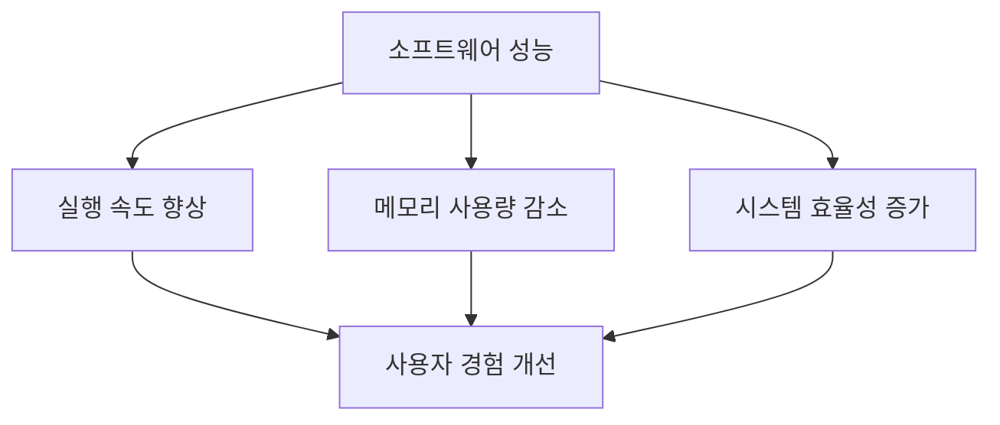
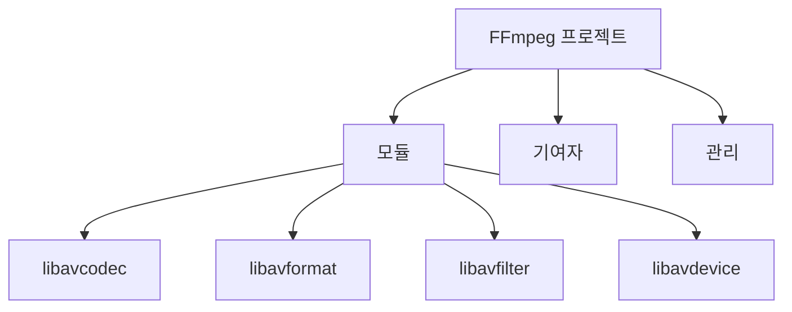
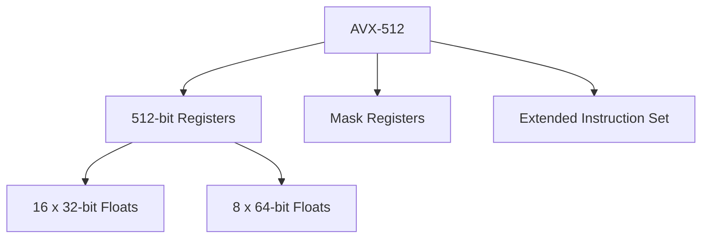
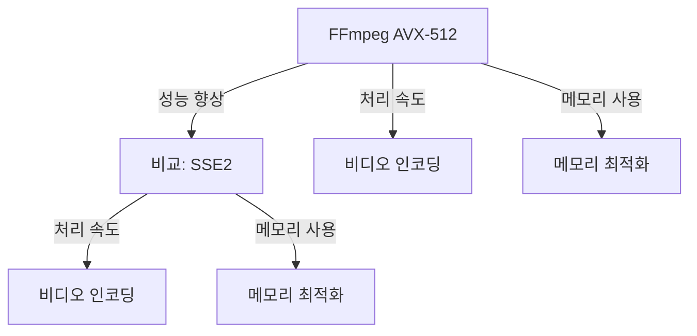
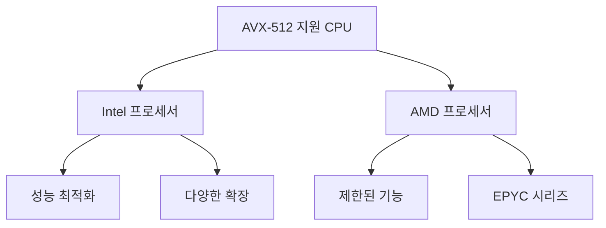
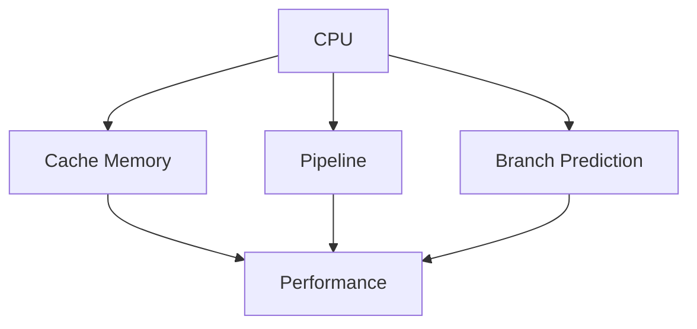
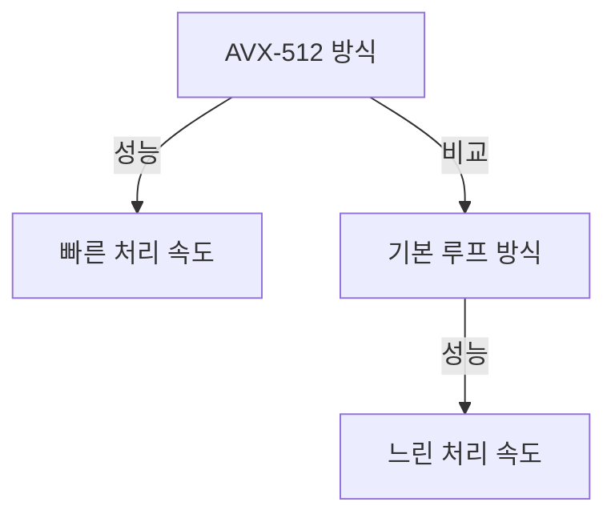
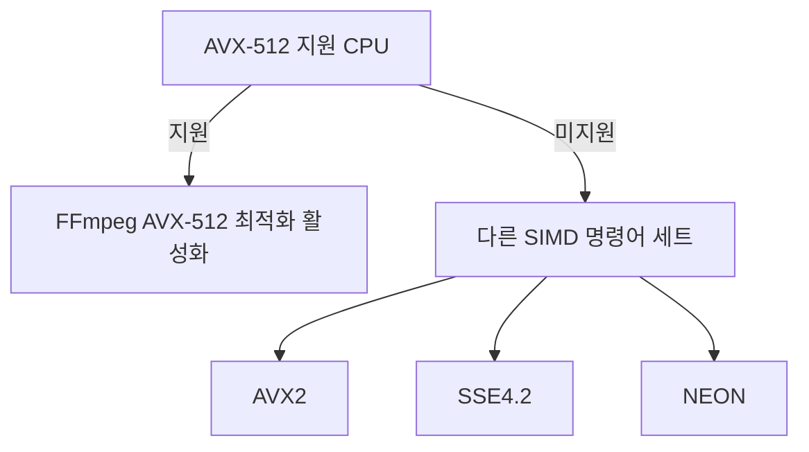
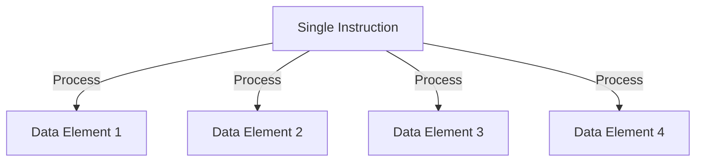
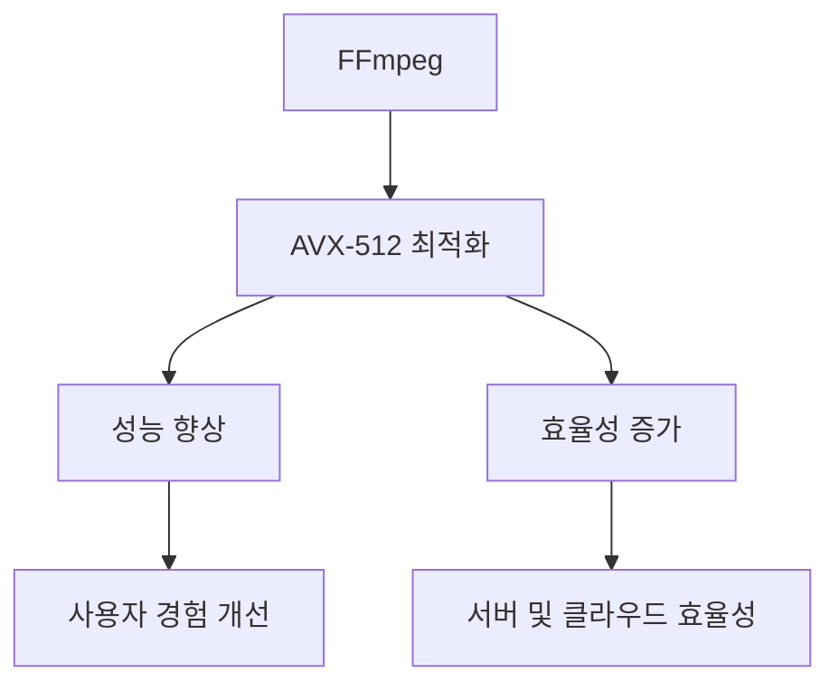

현대의 고급 프로그래밍 언어와 고급 컴파일러는 소프트웨어 개발을 크게 단순화하고 비용을 절감하는 데 기여하고 있다. 그러나 이러한 프로그래밍 방식은 현대 하드웨어의 성능 능력을 숨길 수 있으며, 이는 부분적으로 애플리케이션 프로그래밍 인터페이스(API)의 비효율성 때문이기도 하다. FFmpeg에 따르면, 오래된 어셈블리 코드 경로를 사용하면 작업 부하에 따라 성능이 3배에서 94배까지 향상될 수 있다. 이 성능이 달성된 하드웨어에 대한 정보는 공개되지 않았다. FFmpeg는 자원봉사자들이 기여하는 오픈 소스 비디오 디코딩 프로젝트로, 이들은 코드베이스에 기여하고 버그를 수정하며 새로운 기능을 추가한다. 이 프로젝트는 소수의 핵심 개발자와 유지 관리자가 이끌고 있으며, 이들은 프로젝트의 방향을 감독하고 기여가 특정 기준을 충족하는지 확인한다. 이 개발자들은 비디오 산업에서 드물게 시도된 AVX-512 어셈블리 코드 경로를 수작업으로 구현하려고 했다. 이들은 AVX-512 명령어 집합을 활용하여 FFmpeg 멀티미디어 처리 라이브러리 내 특정 기능을 가속화하는 최적화된 코드 경로를 만들었다. AVX-512를 활용함으로써 이들은 표준 구현에 비해 3배에서 94배까지 성능 향상을 달성할 수 있었다. AVX-512는 512비트 레지스터를 사용하여 대량의 데이터를 병렬로 처리할 수 있게 해주며, 이는 한 번의 연산으로 최대 16개의 단정도 부동소수점 연산(FLOPS) 또는 8개의 배정도 부동소수점 연산을 처리할 수 있다. 이러한 최적화는 일반적으로 계산 집약적인 작업에 이상적이며, 특히 비디오 및 이미지 처리에 적합하다. 벤치마킹 결과는 새로운 수작업 AVX-512 코드 경로가 기본 C 코드 및 AVX2, SSE3와 같은 낮은 SIMD 명령어 집합을 포함한 다른 구현보다 상당히 빠르게 수행된다는 것을 보여준다. 일부 경우, 개편된 AVX-512 코드 경로는 기본 코드에 비해 거의 94배의 속도 향상을 달성하여 AVX-512에 대한 수작업 최적화 어셈블리 코드의 효율성을 강조하고 있다. 이러한 개발은 AVX-512를 지원하는 고성능 하드웨어에서 실행되는 사용자에게 특히 가치가 있으며, 이들은 미디어 콘텐츠를 훨씬 더 효율적으로 처리할 수 있다. 그러나 Intel은 Core 12세대, 13세대 및 14세대 Core 프로세서에서 AVX-512를 비활성화하여 이러한 CPU의 소유자들은 AVX-512를 사용할 수 없게 되었다. 반면, AMD의 Ryzen 9000 시리즈 CPU는 완전히 활성화된 AVX-512 FPU를 제공하므로 이 프로세서의 소유자들은 FFmpeg의 성과를 활용할 수 있다. 불행히도 AVX-512의 복잡성과 전문적인 특성으로 인해 이러한 최적화는 일반적으로 성능이 중요한 애플리케이션에만 적용되며, 저수준 프로그래밍 및 프로세서 마이크로아키텍처에 대한 전문 지식이 필요하다.

<!--
##### Outline #####
-->

<!--
# 목차

## 개요
   - 현대 고급 프로그래밍 언어와 컴파일러의 발전
   - 성능 최적화의 필요성

## FFmpeg 프로젝트 소개
   - FFmpeg의 역사와 발전
   - 기여자와 개발자 커뮤니티
   - 프로젝트의 구조와 관리

## AVX-512와 성능 최적화
   - AVX-512란 무엇인가?
   - AVX-512의 구조와 기능
   - 성능 향상 사례: FFmpeg의 핸드코딩된 AVX-512 경로

## 성능 벤치마킹
   - 벤치마킹 방법론
   - FFmpeg의 AVX-512 코드 경로와 다른 구현 비교
   - 성능 향상 수치 분석

## 하드웨어 호환성
   - AVX-512 지원 CPU 목록
   - Intel과 AMD의 AVX-512 지원 차이
   - 고성능 하드웨어에서의 이점

## 저수준 프로그래밍의 중요성
   - 저수준 프로그래밍의 개념
   - 마이크로아키텍처 이해의 필요성
   - 성능 비판적 애플리케이션에서의 최적화

## 예제
   - AVX-512를 활용한 FFmpeg 코드 예제
   - 성능 비교를 위한 코드 스니펫

## FAQ
   - AVX-512를 사용하기 위한 시스템 요구 사항은?
   - FFmpeg에서 AVX-512 최적화를 어떻게 활성화하나요?
   - AVX-512가 지원되지 않는 경우 대안은 무엇인가요?

## 관련 기술
   - SIMD (Single Instruction, Multiple Data) 개념
   - 다른 SIMD 명령어 세트 (AVX2, SSE3 등)
   - 저수준 최적화 기법

## 결론
   - FFmpeg의 AVX-512 최적화의 의의
   - 향후 발전 방향과 기대 효과
   - 저수준 프로그래밍의 중요성 재조명
-->

<!--
## 개요
   - 현대 고급 프로그래밍 언어와 컴파일러의 발전
   - 성능 최적화의 필요성
-->

## 개요

현대 고급 프로그래밍 언어와 컴파일러의 발전

최근 몇 년간 프로그래밍 언어와 컴파일러는 비약적인 발전을 이루었다. C++, Java, Python과 같은 고급 언어들은 개발자에게 더 나은 생산성과 코드 가독성을 제공하며, 다양한 라이브러리와 프레임워크를 통해 복잡한 문제를 쉽게 해결할 수 있도록 돕는다. 이러한 언어들은 메모리 관리, 오류 처리, 병렬 처리와 같은 기능을 내장하고 있어 개발자들이 더 높은 수준의 추상화에서 작업할 수 있게 한다. 

그러나 이러한 고급 언어의 발전에도 불구하고, 성능 최적화는 여전히 중요한 이슈로 남아 있다. 고급 언어는 종종 성능을 희생하면서 개발의 용이성을 추구하기 때문이다. 따라서, 컴파일러는 이러한 고급 언어로 작성된 코드를 최적화하여 실행 성능을 극대화하는 역할을 한다. 

**성능 최적화의 필요성**

성능 최적화는 소프트웨어 개발에서 필수적인 과정이다. 특히, 대규모 데이터 처리, 실시간 시스템, 게임 개발 등 성능이 중요한 분야에서는 최적화가 더욱 중요하다. 최적화는 코드의 실행 속도를 높이고, 메모리 사용량을 줄이며, 전반적인 시스템 효율성을 향상시킨다. 

다음은 성능 최적화의 필요성을 강조하는 다이어그램이다:



이러한 최적화는 다양한 기법을 통해 이루어지며, 저수준 프로그래밍 기법이나 하드웨어의 특성을 이해하는 것이 중요하다. 따라서, 개발자는 고급 언어의 편리함을 누리면서도 성능을 고려한 코드를 작성해야 한다. 

결론적으로, 현대 고급 프로그래밍 언어와 컴파일러의 발전은 개발자에게 많은 이점을 제공하지만, 성능 최적화는 여전히 중요한 과제로 남아 있다. 이를 통해 소프트웨어의 품질을 높이고, 사용자에게 더 나은 경험을 제공할 수 있다.

<!--
## FFmpeg 프로젝트 소개
   - FFmpeg의 역사와 발전
   - 기여자와 개발자 커뮤니티
   - 프로젝트의 구조와 관리
-->

## FFmpeg 프로젝트 소개

FFmpeg는 멀티미디어 파일을 처리하기 위한 오픈 소스 프로젝트로, 비디오 및 오디오의 인코딩, 디코딩, 변환, 스트리밍 등을 지원하는 강력한 도구이다. 이 프로젝트는 다양한 플랫폼에서 사용할 수 있으며, 많은 개발자와 사용자에게 사랑받고 있다.

### FFmpeg의 역사와 발전

FFmpeg 프로젝트는 2000년 12월에 시작되었으며, 그 이후로 지속적으로 발전해왔다. 초기에는 기본적인 비디오 및 오디오 처리 기능만을 제공했으나, 시간이 지남에 따라 다양한 코덱과 포맷을 지원하게 되었다. 현재 FFmpeg는 H.264, AAC, VP9 등 다양한 최신 코덱을 지원하며, 비디오 편집, 필터링, 스트리밍 등 다양한 기능을 제공한다.

### 기여자와 개발자 커뮤니티

FFmpeg는 오픈 소스 프로젝트로, 전 세계의 많은 개발자들이 기여하고 있다. 이들은 코드 작성, 버그 수정, 문서화 등 다양한 방식으로 프로젝트에 참여하고 있으며, FFmpeg의 발전에 큰 기여를 하고 있다. FFmpeg의 개발자 커뮤니티는 활발하게 소통하며, 사용자들의 피드백을 반영하여 지속적으로 개선하고 있다.

### 프로젝트의 구조와 관리

FFmpeg 프로젝트는 여러 개의 모듈로 구성되어 있으며, 각 모듈은 특정 기능을 담당하고 있다. 주요 모듈로는 libavcodec, libavformat, libavfilter, libavdevice 등이 있다. 이러한 모듈들은 서로 긴밀하게 연동되어 있으며, FFmpeg의 다양한 기능을 구현하는 데 기여하고 있다.

프로젝트 관리는 Git을 통해 이루어지며, 개발자들은 GitHub를 통해 코드 변경 사항을 제출하고 리뷰를 받는다. 또한, 정기적으로 릴리스를 진행하여 사용자들에게 안정적인 버전을 제공하고 있다.



이와 같은 구조는 FFmpeg가 다양한 기능을 효율적으로 관리하고, 개발자들이 협업할 수 있는 환경을 제공하는 데 중요한 역할을 한다. FFmpeg는 앞으로도 지속적인 발전을 통해 멀티미디어 처리 분야에서의 입지를 더욱 강화할 것이다.

<!--
## AVX-512와 성능 최적화
   - AVX-512란 무엇인가?
   - AVX-512의 구조와 기능
   - 성능 향상 사례: FFmpeg의 핸드코딩된 AVX-512 경로
-->

## AVX-512와 성능 최적화

### AVX-512란 무엇인가?

AVX-512(Advanced Vector Extensions 512)는 Intel에서 개발한 SIMD(Single Instruction, Multiple Data) 명령어 세트의 확장으로, 512비트 레지스터를 사용하여 한 번에 여러 데이터 요소를 처리할 수 있는 기능을 제공한다. 이는 고성능 컴퓨팅 및 데이터 집약적인 애플리케이션에서 성능을 극대화하는 데 중요한 역할을 한다. AVX-512는 벡터 연산을 통해 병렬 처리를 가능하게 하여, CPU의 계산 능력을 효율적으로 활용할 수 있도록 돕는다.

### AVX-512의 구조와 기능

AVX-512는 여러 가지 기능을 포함하고 있으며, 그 중 일부는 다음과 같다:

- **512비트 레지스터**: AVX-512는 512비트 레지스터를 사용하여 한 번에 16개의 32비트 부동 소수점 숫자 또는 8개의 64비트 부동 소수점 숫자를 처리할 수 있다.
- **마스크 레지스터**: AVX-512는 마스크 레지스터를 통해 조건부 연산을 지원하여, 특정 데이터 요소에만 연산을 적용할 수 있다.
- **확장된 명령어 세트**: AVX-512는 다양한 수학적 연산, 논리 연산 및 데이터 변환을 위한 명령어를 제공하여, 복잡한 계산을 효율적으로 수행할 수 있다.

다음은 AVX-512의 구조를 나타내는 다이어그램이다:



### 성능 향상 사례: FFmpeg의 핸드코딩된 AVX-512 경로

FFmpeg는 멀티미디어 파일을 처리하는 데 널리 사용되는 오픈 소스 프로젝트로, AVX-512를 활용하여 성능을 극대화할 수 있는 여러 경로를 제공한다. 핸드코딩된 AVX-512 경로는 특정 알고리즘을 AVX-512 명령어를 사용하여 최적화한 코드로, 일반적인 구현보다 훨씬 빠른 성능을 발휘한다.

예를 들어, FFmpeg의 비디오 인코딩 과정에서 AVX-512를 활용하면, 픽셀 데이터의 병렬 처리를 통해 인코딩 속도를 크게 향상시킬 수 있다. 다음은 AVX-512를 활용한 FFmpeg 코드의 간단한 예제이다:

```c
#include <immintrin.h>

void avx512_example(float* src, float* dst, int size) {
    for (int i = 0; i < size; i += 16) {
        __m512 a = _mm512_loadu_ps(&src[i]);
        __m512 b = _mm512_add_ps(a, _mm512_set1_ps(1.0f)); // 예: 각 요소에 1.0을 더함
        _mm512_storeu_ps(&dst[i], b);
    }
}
```

위의 예제는 AVX-512를 사용하여 소스 배열의 각 요소에 1.0을 더하는 간단한 연산을 수행하는 코드이다. 이와 같은 최적화는 FFmpeg의 성능을 크게 향상시킬 수 있다. AVX-512의 활용은 특히 대량의 데이터 처리가 필요한 멀티미디어 처리에서 그 효과를 극대화할 수 있다.

<!--
## 성능 벤치마킹
   - 벤치마킹 방법론
   - FFmpeg의 AVX-512 코드 경로와 다른 구현 비교
   - 성능 향상 수치 분석
-->

## 성능 벤치마킹

성능 벤치마킹은 소프트웨어의 성능을 평가하고 최적화하기 위한 중요한 과정이다. 이 과정에서는 다양한 방법론을 통해 성능을 측정하고, 이를 바탕으로 개선점을 찾아내는 것이 핵심이다. 본 섹션에서는 벤치마킹 방법론, FFmpeg의 AVX-512 코드 경로와 다른 구현 비교, 그리고 성능 향상 수치 분석에 대해 다룰 것이다.

**벤치마킹 방법론**

벤치마킹 방법론은 성능을 측정하기 위한 체계적인 접근 방식을 제공한다. 일반적으로 다음과 같은 단계로 진행된다:

1. **목표 설정**: 어떤 성능 지표를 측정할 것인지 결정한다. 예를 들어, 처리 속도, 메모리 사용량, CPU 사용률 등이 있다.
2. **테스트 환경 구성**: 동일한 조건에서 테스트를 수행하기 위해 하드웨어와 소프트웨어 환경을 일관되게 설정한다.
3. **테스트 케이스 작성**: 다양한 시나리오를 고려하여 테스트 케이스를 작성한다. 이때, 실제 사용 사례를 반영하는 것이 중요하다.
4. **데이터 수집**: 테스트를 실행하고 성능 데이터를 수집한다.
5. **분석 및 보고**: 수집된 데이터를 분석하여 성능 개선의 필요성을 평가하고, 결과를 보고한다.

**FFmpeg의 AVX-512 코드 경로와 다른 구현 비교**

FFmpeg는 다양한 비디오 및 오디오 포맷을 처리하는 강력한 멀티미디어 프레임워크이다. AVX-512 최적화를 통해 FFmpeg는 성능을 크게 향상시킬 수 있다. AVX-512를 활용한 FFmpeg의 코드 경로는 다음과 같은 장점을 제공한다:

- **병렬 처리**: AVX-512는 한 번의 명령어로 여러 데이터를 동시에 처리할 수 있어, 멀티미디어 데이터의 처리 속도를 높인다.
- **고급 연산 지원**: 복잡한 수학적 연산을 하드웨어 수준에서 최적화하여 성능을 개선한다.

다음은 FFmpeg의 AVX-512 코드 경로와 다른 구현(예: SSE2) 간의 성능 비교를 나타내는 다이어그램이다.



**성능 향상 수치 분석**

성능 향상 수치 분석은 벤치마킹 결과를 기반으로 성능 개선의 효과를 정량적으로 평가하는 과정이다. 예를 들어, AVX-512 최적화를 적용한 FFmpeg의 비디오 인코딩 성능이 기존 SSE2 구현에 비해 30% 향상되었다고 가정할 수 있다. 이러한 수치는 다음과 같은 방식으로 분석할 수 있다:

- **처리 시간 비교**: AVX-512 최적화 전후의 처리 시간을 비교하여 성능 향상을 수치적으로 나타낸다.
- **자원 사용량 분석**: CPU 및 메모리 사용량을 비교하여 최적화의 효과를 평가한다.

이러한 분석을 통해 개발자는 성능 최적화의 필요성을 명확히 이해하고, 향후 개선 방향을 설정할 수 있다. 성능 벤치마킹은 소프트웨어 개발에서 필수적인 과정으로, 지속적인 성능 개선을 위한 기초 자료를 제공한다.

<!--
## 하드웨어 호환성
   - AVX-512 지원 CPU 목록
   - Intel과 AMD의 AVX-512 지원 차이
   - 고성능 하드웨어에서의 이점
-->

## 하드웨어 호환성

### AVX-512 지원 CPU 목록

AVX-512는 고급 SIMD(단일 명령어, 다중 데이터) 명령어 세트로, 주로 Intel과 AMD의 최신 프로세서에서 지원된다. AVX-512를 지원하는 CPU 목록은 다음과 같다.

- **Intel Xeon Scalable Processors**

- **Intel Core i9 (Skylake-X, Cascade Lake, Ice Lake)**

- **Intel Core i7 (Skylake-X, Cascade Lake)**

- **AMD EPYC (Rome, Milan)**

이 외에도 Intel의 일부 고급 프로세서와 AMD의 EPYC 시리즈에서 AVX-512를 지원한다. 하지만, 모든 CPU가 AVX-512를 지원하는 것은 아니므로, 사용자는 자신의 하드웨어가 이 명령어 세트를 지원하는지 확인해야 한다.

### Intel과 AMD의 AVX-512 지원 차이

Intel은 AVX-512의 초기 개발자이자 주요 구현자로, 다양한 프로세서에서 AVX-512를 지원하고 있다. Intel의 프로세서는 AVX-512의 여러 확장을 포함하고 있으며, 이를 통해 다양한 데이터 처리 작업에서 성능을 극대화할 수 있다. 

반면, AMD는 AVX-512를 지원하지만, Intel과는 다르게 특정 기능에 제한이 있다. AMD의 EPYC 프로세서는 AVX-512를 지원하지만, Intel의 프로세서에 비해 성능 최적화가 다소 부족할 수 있다. 이러한 차이는 사용자가 선택할 때 고려해야 할 중요한 요소이다.

### 고성능 하드웨어에서의 이점

고성능 하드웨어에서 AVX-512를 활용하면 다음과 같은 이점을 얻을 수 있다.

- **성능 향상**: AVX-512는 한 번의 명령어로 여러 데이터 요소를 처리할 수 있어, 데이터 병렬 처리 성능을 크게 향상시킨다.
- **전력 효율성**: AVX-512를 사용하면 동일한 작업을 수행하는 데 필요한 클럭 사이클 수를 줄일 수 있어, 전력 소비를 줄이는 데 기여한다.
- **고급 데이터 처리**: AVX-512는 머신 러닝, 이미지 처리, 비디오 인코딩 등 다양한 분야에서 고급 데이터 처리 작업을 지원한다.



이와 같은 이점들은 AVX-512를 지원하는 하드웨어에서 성능을 극대화할 수 있는 기회를 제공한다. 따라서, AVX-512를 활용하고자 하는 개발자는 자신의 하드웨어가 이 명령어 세트를 지원하는지 확인하고, 최적의 성능을 이끌어낼 수 있는 환경을 구축해야 한다.

<!--
## 저수준 프로그래밍의 중요성
   - 저수준 프로그래밍의 개념
   - 마이크로아키텍처 이해의 필요성
   - 성능 비판적 애플리케이션에서의 최적화
-->

## 저수준 프로그래밍의 중요성

저수준 프로그래밍은 하드웨어와 밀접하게 연관된 프로그래밍 방식으로, 시스템의 성능을 극대화하는 데 중요한 역할을 한다. 이는 프로그래머가 하드웨어의 세부 사항을 이해하고, 이를 바탕으로 최적화된 코드를 작성할 수 있도록 한다. 저수준 프로그래밍은 일반적으로 C, C++와 같은 언어로 이루어지며, 메모리 관리와 CPU 명령어 세트에 대한 깊은 이해가 필요하다.

**저수준 프로그래밍의 개념**

저수준 프로그래밍은 하드웨어와 가까운 수준에서 작업하는 프로그래밍을 의미한다. 이는 고급 언어에서 제공하는 추상화가 적고, 프로그래머가 직접 메모리 주소를 다루거나 CPU의 명령어를 직접 사용할 수 있는 환경을 제공한다. 이러한 접근 방식은 성능을 극대화할 수 있는 기회를 제공하지만, 그만큼 복잡성과 오류 가능성도 증가한다.

**마이크로아키텍처 이해의 필요성**

마이크로아키텍처는 CPU의 내부 구조와 동작 방식을 설명하는 개념이다. 저수준 프로그래밍을 효과적으로 수행하기 위해서는 마이크로아키텍처에 대한 이해가 필수적이다. 예를 들어, 캐시 메모리의 구조, 파이프라인 처리, 분기 예측 등의 요소는 성능에 큰 영향을 미친다. 이러한 요소들을 이해하고 활용함으로써, 프로그래머는 더 효율적인 코드를 작성할 수 있다.



**성능 비판적 애플리케이션에서의 최적화**

성능 비판적 애플리케이션은 실시간 처리, 대량 데이터 처리 등에서 높은 성능을 요구하는 소프트웨어를 의미한다. 이러한 애플리케이션에서는 저수준 프로그래밍을 통해 성능을 최적화하는 것이 필수적이다. 예를 들어, FFmpeg와 같은 멀티미디어 처리 라이브러리에서는 AVX-512와 같은 SIMD 명령어를 활용하여 데이터 처리 속도를 극대화할 수 있다. 저수준 프로그래밍을 통해 이러한 최적화를 수행하면, 애플리케이션의 전반적인 성능을 크게 향상시킬 수 있다. 

결론적으로, 저수준 프로그래밍은 성능 최적화에 있어 매우 중요한 요소이며, 마이크로아키텍처에 대한 깊은 이해와 함께 활용될 때 그 진가를 발휘한다.

<!--
## 예제
   - AVX-512를 활용한 FFmpeg 코드 예제
   - 성능 비교를 위한 코드 스니펫
-->

## 예제

### AVX-512를 활용한 FFmpeg 코드 예제

AVX-512는 고급 SIMD(Single Instruction, Multiple Data) 명령어 세트로, 데이터 병렬 처리를 통해 성능을 극대화할 수 있다. FFmpeg에서 AVX-512를 활용한 예제를 살펴보자. 아래는 AVX-512를 사용하여 비디오 프레임의 색상 변환을 수행하는 코드 스니펫이다.

```c
#include <immintrin.h>

void convert_color_avx512(uint8_t* src, uint8_t* dst, int width) {
    for (int i = 0; i < width; i += 64) {
        __m512i src_data1 = _mm512_loadu_si512(&src[i]);
        __m512i src_data2 = _mm512_loadu_si512(&src[i + 32]);

        // 색상 변환 로직 (예: RGB -> YUV)
        __m512i dst_data1 = _mm512_sub_epi16(src_data1, _mm512_set1_epi16(128));
        __m512i dst_data2 = _mm512_sub_epi16(src_data2, _mm512_set1_epi16(128));

        _mm512_storeu_si512(&dst[i], dst_data1);
        _mm512_storeu_si512(&dst[i + 32], dst_data2);
    }
}
```

위의 코드는 AVX-512를 사용하여 64픽셀의 색상 변환을 동시에 처리하는 예제이다. `_mm512_loadu_si512`와 `_mm512_storeu_si512`를 통해 메모리에서 데이터를 로드하고 저장하며, SIMD 연산을 통해 색상 변환을 수행한다.

### 성능 비교를 위한 코드 스니펫

AVX-512를 활용한 성능 비교를 위해, 동일한 색상 변환 작업을 일반적인 루프 방식으로 구현한 코드와 비교해보자.

```c
void convert_color_basic(uint8_t* src, uint8_t* dst, int width) {
    for (int i = 0; i < width; i++) {
        dst[i] = src[i] - 128; // 간단한 색상 변환
    }
}
```

위의 기본적인 색상 변환 함수는 각 픽셀을 순차적으로 처리한다. AVX-512를 사용한 방법과 비교했을 때, 성능 차이를 확인할 수 있다. 

다음은 AVX-512와 기본 루프 방식의 성능을 비교하는 다이어그램이다.



이 다이어그램은 AVX-512 방식이 기본 루프 방식에 비해 성능이 우수하다는 것을 시각적으로 나타낸다. AVX-512를 활용한 최적화는 대량의 데이터 처리에서 성능을 크게 향상시킬 수 있다.

<!--
## FAQ
   - AVX-512를 사용하기 위한 시스템 요구 사항은?
   - FFmpeg에서 AVX-512 최적화를 어떻게 활성화하나요?
   - AVX-512가 지원되지 않는 경우 대안은 무엇인가요?
-->

## FAQ

### AVX-512를 사용하기 위한 시스템 요구 사항은?

AVX-512를 사용하기 위해서는 특정 하드웨어와 소프트웨어 요구 사항이 있다. 우선, AVX-512를 지원하는 CPU가 필요하다. Intel의 Skylake-X, Cascade Lake, Ice Lake와 같은 프로세서가 대표적이며, AMD의 Zen 3 아키텍처도 AVX-512를 지원한다. 또한, 운영 체제는 최신 버전의 Windows, Linux 또는 macOS가 필요하며, 컴파일러는 AVX-512 명령어를 지원해야 한다. GCC, Clang, MSVC와 같은 최신 컴파일러 버전을 사용하는 것이 좋다.

**시스템 요구 사항 요약:**

- AVX-512 지원 CPU
- 최신 운영 체제
- AVX-512 지원 컴파일러

### FFmpeg에서 AVX-512 최적화를 어떻게 활성화하나요?

FFmpeg에서 AVX-512 최적화를 활성화하기 위해서는 컴파일 시 특정 플래그를 설정해야 한다. `--enable-avx512` 플래그를 사용하여 FFmpeg를 컴파일하면 AVX-512 최적화가 적용된 코드가 생성된다. 또한, FFmpeg의 빌드 스크립트에서 AVX-512 관련 최적화 플래그를 추가하는 것이 중요하다.

**FFmpeg 컴파일 예시:**

```bash
./configure --enable-avx512
make
make install
```

이렇게 설정하면 FFmpeg에서 AVX-512 최적화가 활성화된 상태로 사용할 수 있다.

### AVX-512가 지원되지 않는 경우 대안은 무엇인가요?

AVX-512가 지원되지 않는 경우, 다른 SIMD 명령어 세트를 활용할 수 있다. AVX2, SSE4.2, NEON(ARM 아키텍처) 등이 그 예이다. 이러한 명령어 세트는 AVX-512보다 성능은 떨어질 수 있지만, 여전히 병렬 처리를 통해 성능 향상을 도모할 수 있다. FFmpeg는 다양한 SIMD 최적화를 지원하므로, 사용자의 하드웨어에 맞는 최적화를 선택하여 사용할 수 있다.

**대안 요약:**

- AVX2
- SSE4.2
- NEON (ARM)



이와 같이 AVX-512가 지원되지 않는 경우에도 다양한 대안을 통해 성능 최적화를 이룰 수 있다.

<!--
## 관련 기술
   - SIMD (Single Instruction, Multiple Data) 개념
   - 다른 SIMD 명령어 세트 (AVX2, SSE3 등)
   - 저수준 최적화 기법
-->

## 관련 기술

### SIMD (Single Instruction, Multiple Data) 개념

SIMD는 Single Instruction, Multiple Data의 약자로, 하나의 명령어로 여러 데이터 요소를 동시에 처리할 수 있는 컴퓨터 아키텍처의 한 형태이다. SIMD는 데이터 병렬성을 활용하여 성능을 극대화하는 데 중요한 역할을 한다. 예를 들어, 이미지 처리나 비디오 인코딩과 같은 작업에서 동일한 연산을 여러 픽셀에 동시에 적용할 수 있다. 이는 CPU의 파이프라인을 효율적으로 활용하고, 메모리 대역폭을 최적화하는 데 기여한다.



### 다른 SIMD 명령어 세트 (AVX2, SSE3 등)

SIMD 기술은 다양한 명령어 세트로 구현되어 있으며, 그 중 AVX2와 SSE3는 널리 사용되는 예시이다. AVX2는 Advanced Vector Extensions 2의 약자로, 256비트 벡터 연산을 지원하며, 더 많은 데이터 요소를 동시에 처리할 수 있다. SSE3는 Streaming SIMD Extensions 3의 약자로, 128비트 벡터 연산을 지원하며, 주로 멀티미디어와 게임 애플리케이션에서 사용된다. 이러한 명령어 세트는 각각의 아키텍처에 최적화된 성능을 제공하며, 개발자는 특정 작업에 적합한 명령어 세트를 선택하여 성능을 극대화할 수 있다.

### 저수준 최적화 기법

저수준 최적화는 하드웨어의 세부 사항을 이해하고 이를 활용하여 소프트웨어의 성능을 향상시키는 기법이다. 이러한 최적화 기법에는 메모리 접근 패턴 최적화, 캐시 최적화, 파이프라인 최적화 등이 포함된다. 예를 들어, 데이터 접근을 연속적으로 수행하여 캐시 히트율을 높이는 것이 저수준 최적화의 한 예이다. 이러한 기법들은 성능 비판적 애플리케이션에서 특히 중요하며, 개발자는 하드웨어의 특성을 고려하여 최적화 전략을 수립해야 한다. 

저수준 프로그래밍을 통해 개발자는 하드웨어의 성능을 최대한 활용할 수 있으며, 이는 고성능 애플리케이션 개발에 필수적이다.

<!--
## 결론
   - FFmpeg의 AVX-512 최적화의 의의
   - 향후 발전 방향과 기대 효과
   - 저수준 프로그래밍의 중요성 재조명
-->

## 결론

### FFmpeg의 AVX-512 최적화의 의의

FFmpeg의 AVX-512 최적화는 멀티미디어 처리에서 성능을 극대화하는 데 중요한 역할을 한다. AVX-512는 SIMD(Single Instruction, Multiple Data) 명령어 세트를 활용하여 데이터 병렬 처리를 가능하게 하며, 이는 대량의 비디오 및 오디오 데이터를 처리하는 FFmpeg와 같은 프로젝트에 매우 유용하다. 이러한 최적화는 인코딩 및 디코딩 속도를 크게 향상시켜 사용자 경험을 개선하고, 서버 및 클라우드 환경에서의 효율성을 높인다.

### 향후 발전 방향과 기대 효과

향후 FFmpeg 프로젝트는 AVX-512 최적화를 더욱 발전시켜 나갈 것으로 기대된다. 새로운 하드웨어의 출현과 함께 AVX-512의 활용 가능성이 더욱 확대될 것이며, 이를 통해 더욱 복잡한 멀티미디어 처리 작업을 실시간으로 수행할 수 있을 것이다. 또한, FFmpeg의 커뮤니티는 지속적으로 성능 개선을 위한 연구와 개발을 진행할 것이며, 이는 다양한 플랫폼에서의 호환성과 성능을 동시에 향상시키는 데 기여할 것이다.



### 저수준 프로그래밍의 중요성 재조명

저수준 프로그래밍은 성능 비판적 애플리케이션에서 필수적인 요소로 자리 잡고 있다. AVX-512와 같은 저수준 최적화 기법을 이해하고 활용하는 것은 개발자에게 큰 이점을 제공한다. 이러한 기법은 하드웨어의 특성을 최대한 활용하여 성능을 극대화할 수 있도록 도와준다. 따라서, 저수준 프로그래밍에 대한 이해는 앞으로의 소프트웨어 개발에서 더욱 중요해질 것이며, 이는 고급 프로그래밍 언어와 컴파일러의 발전과 함께 지속적으로 강조되어야 할 주제이다.

<!--
##### Reference #####
-->

## Reference


* [https://www.tomshardware.com/pc-components/cpus/ffmpeg-devs-boast-of-up-to-94x-performance-boost-after-implementing-handwritten-avx-512-assembly-code](https://www.tomshardware.com/pc-components/cpus/ffmpeg-devs-boast-of-up-to-94x-performance-boost-after-implementing-handwritten-avx-512-assembly-code)
