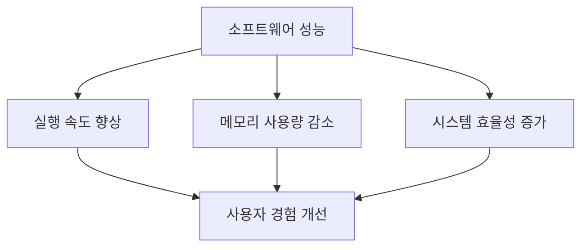
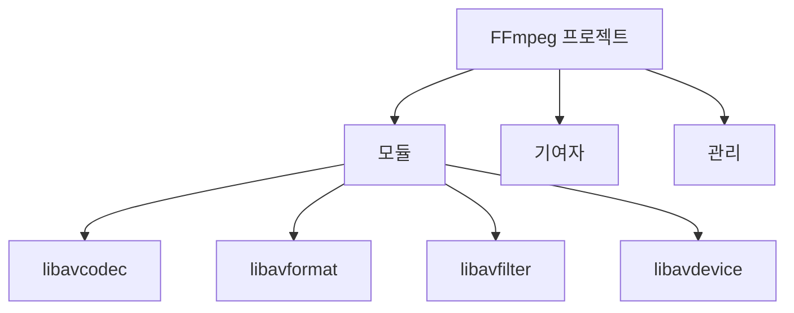
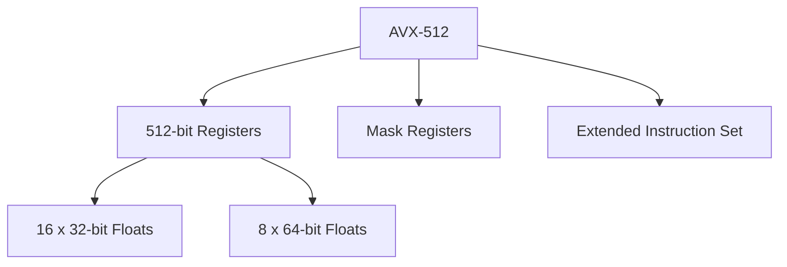
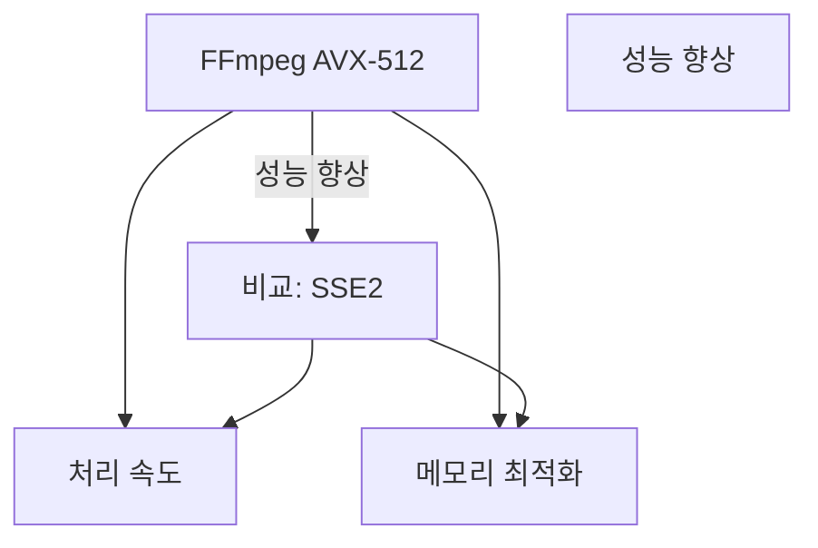
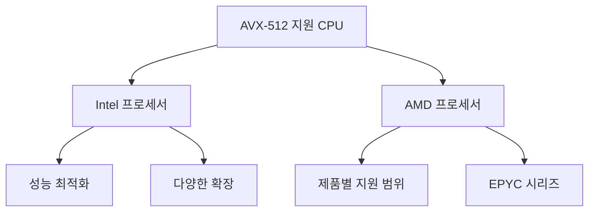
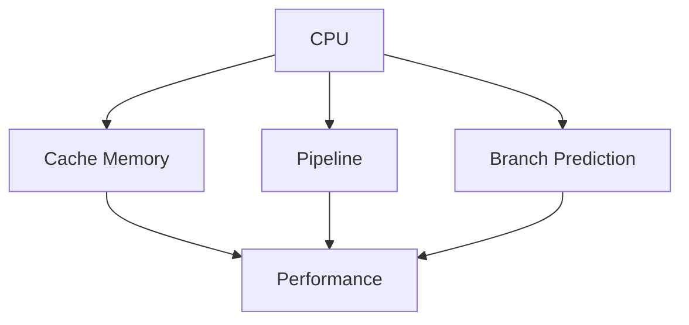
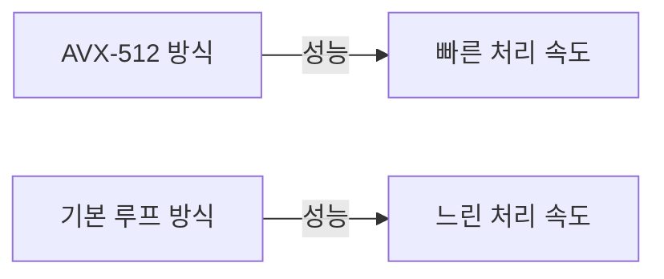
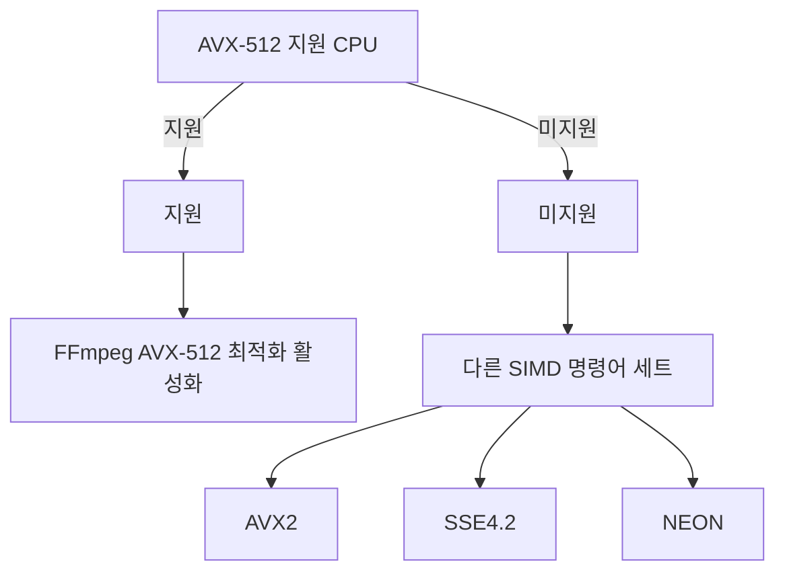
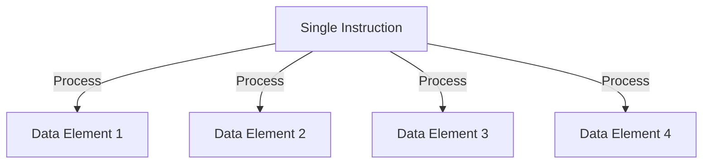
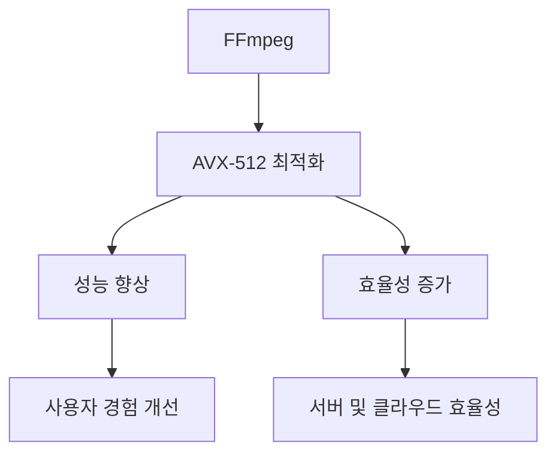

현대의 고급 프로그래밍 언어와 컴파일러는 개발 생산성과 비용 절감에 크게 기여한다. 반면 이런 추상화는 현대 하드웨어의 성능을 일부 가리기도 하며, API 비효율성 때문이기도 하다. FFmpeg 개발자들이 수작업으로 작성한 AVX-512 어셈블리 경로는 작업 부하에 따라 **기본 C 코드 대비 최대 약 94배**까지 성능 향상을 보였다. 이 글에서는 FFmpeg의 AVX-512 최적화 배경, 구조, 벤치마크, 하드웨어 호환성, 그리고 저수준 최적화의 의미를 정리한다.

## 개요

### 고급 언어·컴파일러와 성능 최적화

C++, Java, Python 같은 고급 언어는 생산성과 가독성을 높이고, 메모리 관리·오류 처리·병렬 처리 등을 추상화해 준다. 다만 이런 추상화는 성능을 일부 희생하는 경우가 많아, **성능이 중요한 구간**에서는 컴파일러 최적화와 더불어 저수준 기법이 여전히 필요하다.

성능 최적화는 실행 속도 향상, 메모리 사용 감소, 시스템 효율 증가로 이어지며, 대규모 데이터 처리·실시간 시스템·게임·미디어 처리 등에서 특히 중요하다.


```mermaid
graph TD
    perfRoot["소프트웨어 성능"]
    execSpeed["실행 속도 향상"]
    memUsage["메모리 사용량 감소"]
    sysEff["시스템 효율성 증가"]
    userExp["사용자 경험 개선"]
    perfRoot --> execSpeed
    perfRoot --> memUsage
    perfRoot --> sysEff
    execSpeed --> userExp
    memUsage --> userExp
    sysEff --> userExp
```

## FFmpeg 프로젝트 소개

FFmpeg는 비디오·오디오의 **인코딩, 디코딩, 변환, 스트리밍**을 지원하는 오픈 소스 멀티미디어 프레임워크다. [FFmpeg 공식 소개](https://ffmpeg.org/about.html)에 따르면, 표준 위원회·커뮤니티·기업이 설계한 다양한 포맷을 지원하며, Linux, macOS, Windows, BSD 등 다양한 플랫폼에서 동작한다.

### 역사와 발전

2000년 12월에 시작된 이래, 기본 인코딩/디코딩에서 출발해 H.264, AAC, VP9, AV1 등 최신 코덱과 다양한 컨테이너·필터를 지원하게 되었다. libavcodec, libavformat, libavfilter 등 라이브러리와 ffmpeg·ffplay·ffprobe CLI 도구를 제공한다.

### 기여자와 커뮤니티

전 세계 개발자가 코드·버그 수정·문서화로 기여하며, 소수의 핵심 유지보수자가 방향을 정하고 기여 품질을 관리한다. AVX-512처럼 비디오 산업에서 드물게 시도되는 **핸드코딩 어셈블리 경로**를 수작업으로 구현해, FFmpeg 내 특정 기능을 가속화한 사례가 그 예이다.

### 프로젝트 구조

주요 모듈은 다음과 같이 나뉜다.


```mermaid
graph TD
    ffmpegRoot["FFmpeg 프로젝트"]
    modules["모듈"]
    contributors["기여자"]
    mgmt["관리"]
    libavcodec["libavcodec"]
    libavformat["libavformat"]
    libavfilter["libavfilter"]
    libavdevice["libavdevice"]
    ffmpegRoot --> modules
    ffmpegRoot --> contributors
    ffmpegRoot --> mgmt
    modules --> libavcodec
    modules --> libavformat
    modules --> libavfilter
    modules --> libavdevice
```

- **libavcodec**: 코덱(인코더/디코더)
- **libavformat**: 컨테이너 포맷(뮤서/디뮤서)
- **libavfilter**: 미디어 필터
- **libavdevice**: 입출력 장치

관리는 Git과 [code.ffmpeg.org](https://code.ffmpeg.org/) 등을 통해 이루어지며, 정기적으로 안정 버전이 릴리스된다.

## AVX-512와 성능 최적화

### AVX-512란

AVX-512(Advanced Vector Extensions 512)는 Intel이 제안한 **SIMD(Single Instruction, Multiple Data)** 명령어 세트 확장으로, 512비트 레지스터로 한 번에 여러 데이터 요소를 처리한다. [Wikipedia AVX-512](https://en.wikipedia.org/wiki/AVX-512)에 따르면 2016년 Xeon Phi x200(Knights Landing)에서 처음 구현되었고, 이후 여러 Intel·AMD CPU로 확대되었다.

- **512비트 레지스터**: 32비트 float 16개 또는 64비트 float 8개를 한 번에 연산
- **마스크 레지스터**: 조건부 연산·블렌딩 지원
- **확장 명령어**: 수학·논리·데이터 변환 등 다양한 연산 제공


```mermaid
graph TD
    avx512["AVX-512"]
    reg512["512-bit Registers"]
    maskReg["Mask Registers"]
    extSet["Extended Instruction Set"]
    float16["16 x 32-bit Floats"]
    float8["8 x 64-bit Floats"]
    avx512 --> reg512
    avx512 --> maskReg
    avx512 --> extSet
    reg512 --> float16
    reg512 --> float8
```

### FFmpeg의 핸드코딩 AVX-512 경로

FFmpeg는 특정 알고리즘을 AVX-512 명령어로 직접 최적화한 **핸드코딩 어셈블리 경로**를 제공한다. 컴파일러가 생성하는 코드보다 레지스터 사용·메모리 접근·명령어 선택을 세밀하게 제어할 수 있어, 작업 부하에 따라 C 구현 대비 **수 배에서 수십 배**까지 차이가 난다. (Tom's Hardware 기사에서는 최대 약 94배 향상 사례를 소개한다.)

아래는 AVX-512를 사용한 단순 벡터 연산 예시이다.

```c
#include <immintrin.h>

void avx512_example(float* src, float* dst, int size) {
    for (int i = 0; i < size; i += 16) {
        __m512 a = _mm512_loadu_ps(&src[i]);
        __m512 b = _mm512_add_ps(a, _mm512_set1_ps(1.0f));
        _mm512_storeu_ps(&dst[i], b);
    }
}
```

실제 FFmpeg 내부에서는 색상 변환, 스케일링, DCT/IDCT 등에 이와 같은 SIMD 경로가 많이 쓰인다.

## 성능 벤치마킹

### 방법론

- **목표 설정**: 처리 속도, 메모리 사용량, CPU 사용률 등 지표 결정
- **테스트 환경**: 동일한 하드웨어·OS·빌드 옵션 유지
- **테스트 케이스**: 실제 사용에 가까운 포맷·해상도·비트레이트 구성
- **데이터 수집·분석**: 반복 측정 후 평균·편차 확인

### AVX-512 대비 다른 구현

FFmpeg의 AVX-512 경로는 기본 C 구현 및 AVX2·SSE 등 다른 SIMD 경로보다 동일 작업에서 **빠르게 동작**하는 경우가 많다. 병렬도가 높고, 메모리 접근이 정렬·블록 단위로 최적화되어 있기 때문이다.


```mermaid
graph TD
    avx512Path["FFmpeg AVX-512"]
    sse2Path["비교: SSE2"]
    perfGain["성능 향상"]
    encSpeed["처리 속도"]
    memOpt["메모리 최적화"]
    avx512Path -->|"성능 향상"| sse2Path
    avx512Path --> encSpeed
    avx512Path --> memOpt
    sse2Path --> encSpeed
    sse2Path --> memOpt
```

(참고: Tom's Hardware 논의에서는 “94% faster”와 “94x” 표현이 혼용된 점이 지적된 바 있다. 실제 수치는 작업·환경에 따라 다르며, “C 대비 대폭 향상”으로 이해하는 것이 안전하다.)

### 성능 향상 수치의 의미

- **처리 시간**: 동일 입력에 대한 인코딩/디코딩/필터 시간 단축
- **자원 사용**: CPU 사용률·메모리 대역폭 효율 개선

벤치마크는 항상 **동일 조건**(해상도, 코덱, 프리셋 등)에서 비교하는 것이 중요하다.

## 하드웨어 호환성

### AVX-512를 지원하는 CPU

- **Intel**: Xeon Scalable, Core i9/i7 (Skylake-X, Cascade Lake, Ice Lake 등), 일부 고급 데스크톱·서버
- **AMD**: EPYC(Rome, Milan 등), Ryzen 9000 시리즈 등에서 AVX-512 FPU 지원

Intel은 12·13·14세대 Core 일부에서 AVX-512를 비활성화했고, AMD Ryzen 9000 시리즈는 AVX-512를 지원하므로 FFmpeg의 AVX-512 경로를 그대로 활용할 수 있다.

### Intel과 AMD 차이

Intel은 AVX-512의 다양한 확장을 오래 제공해 왔고, AMD는 최근 제품에서 AVX-512를 도입·강화하고 있다. 제품별로 지원하는 서브셋(예: AVX-512F, BW, DQ 등)이 다르므로, 대상 CPU에 맞는 빌드·실행이 필요하다.


```mermaid
graph TD
    avx512Cpu["AVX-512 지원 CPU"]
    intelProc["Intel 프로세서"]
    amdProc["AMD 프로세서"]
    perfOpt["성능 최적화"]
    extSetIntel["다양한 확장"]
    amdLimit["제품별 지원 범위"]
    epycSeries["EPYC 시리즈"]
    avx512Cpu --> intelProc
    avx512Cpu --> amdProc
    intelProc --> perfOpt
    intelProc --> extSetIntel
    amdProc --> amdLimit
    amdProc --> epycSeries
```

## 저수준 프로그래밍의 중요성

### 저수준 프로그래밍이란

하드웨어에 가까운 수준에서 메모리·레지스터·명령어를 직접 다루는 방식이다. C/C++와 인트린직·인라인 어셈블리를 사용하며, 캐시·파이프라인·분기 예측 등 **마이크로아키텍처** 이해가 중요하다.

### 마이크로아키텍처와 성능

캐시 계층, 파이프라인, 분기 예측, 메모리 대역폭 등이 성능에 직접 영향을 준다. SIMD 최적화는 “한 번에 처리하는 데이터 폭”과 “메모리 정렬·접근 패턴”을 맞출 때 효과가 커진다.


```mermaid
graph TD
    cpuNode["CPU"]
    cacheMem["Cache Memory"]
    pipeline["Pipeline"]
    branchPred["Branch Prediction"]
    perfOut["Performance"]
    cpuNode --> cacheMem
    cpuNode --> pipeline
    cpuNode --> branchPred
    cacheMem --> perfOut
    pipeline --> perfOut
    branchPred --> perfOut
```

### 성능이 중요한 애플리케이션에서

실시간 인코딩·디코딩, 대용량 미디어 처리, 서버 측 트랜스코딩 등에서는 FFmpeg처럼 **SIMD·핸드코딩 경로**를 활용한 저수준 최적화가 필수에 가깝다. 다만 유지보수 비용과 이식성을 고려해, 인트린직(C/인라인)으로 작성하고 어셈블리는 꼭 필요한 부분에만 쓰는 방식도 권장된다.

## 예제: AVX-512와 기본 루프 비교

### AVX-512를 사용한 색상 변환 예

아래는 64바이트 단위로 로드·연산·저장하는 예시이다. 실제 FFmpeg 내부에서는 픽셀 포맷·비트 깊이에 맞는 경로가 별도로 구현된다.

```c
#include <immintrin.h>

void convert_color_avx512(uint8_t* src, uint8_t* dst, int width) {
    for (int i = 0; i < width; i += 64) {
        __m512i src_data1 = _mm512_loadu_si512(&src[i]);
        __m512i src_data2 = _mm512_loadu_si512(&src[i + 32]);

        __m512i dst_data1 = _mm512_sub_epi16(src_data1, _mm512_set1_epi16(128));
        __m512i dst_data2 = _mm512_sub_epi16(src_data2, _mm512_set1_epi16(128));

        _mm512_storeu_si512(&dst[i], dst_data1);
        _mm512_storeu_si512(&dst[i + 32], dst_data2);
    }
}
```

### 기본 루프와의 차이

픽셀 단위 루프는 단순하지만 병렬성이 없어, 동일 작업에서 AVX-512 경로보다 느린 경우가 많다.


```mermaid
graph LR
    avx512Style["AVX-512 방식"]
    basicStyle["기본 루프 방식"]
    fastResult["빠른 처리 속도"]
    slowResult["느린 처리 속도"]
    avx512Style -->|"성능"| fastResult
    basicStyle -->|"성능"| slowResult
```

## FAQ

### AVX-512 사용을 위한 시스템 요구 사항

- **CPU**: AVX-512를 지원하는 Intel 또는 AMD 프로세서
- **OS**: 최신 Windows, Linux, macOS
- **컴파일러**: GCC, Clang, MSVC 등 AVX-512 인트린직·코드생성을 지원하는 버전

### FFmpeg에서 AVX-512 최적화 활성화

FFmpeg는 보통 빌드 시 CPU 기능을 자동 감지한다. 소스 빌드 시 configure 단계에서 해당 타깃이 활성화되는지 확인하면 된다. 예:

```bash
./configure --enable-avx512
make
make install
```

배포용 바이너리는 “AVX-512 지원” 빌드와 “미지원” 빌드를 나누어 제공하는 경우도 있다.

### AVX-512가 없을 때 대안

AVX2, SSE4.2, NEON(ARM) 등 **다른 SIMD 명령어 세트**를 사용할 수 있다. FFmpeg는 여러 SIMD 경로를 갖추고 있어, CPU 능력에 맞는 경로가 자동 선택된다.


```mermaid
graph TD
    avx512CpuCheck["AVX-512 지원 CPU"]
    supported["지원"]
    notSupported["미지원"]
    ffmpegAvx512["FFmpeg AVX-512 최적화 활성화"]
    otherSimd["다른 SIMD 명령어 세트"]
    avx2["AVX2"]
    sse42["SSE4.2"]
    neon["NEON"]
    avx512CpuCheck -->|"지원"| supported
    avx512CpuCheck -->|"미지원"| notSupported
    supported --> ffmpegAvx512
    notSupported --> otherSimd
    otherSimd --> avx2
    otherSimd --> sse42
    otherSimd --> neon
```

## 관련 기술: SIMD와 저수준 최적화

### SIMD 개념

SIMD(Single Instruction, Multiple Data)는 **하나의 명령으로 여러 데이터 요소**를 동시에 처리하는 방식이다. 이미지·비디오 처리, 신호 처리, 과학 계산에서 널리 쓰이며, CPU 파이프라인과 메모리 대역폭을 효율적으로 쓸 수 있게 한다.


```mermaid
graph TD
    singleInstr["Single Instruction"]
    data1["Data Element 1"]
    data2["Data Element 2"]
    data3["Data Element 3"]
    data4["Data Element 4"]
    singleInstr -->|"Process"| data1
    singleInstr -->|"Process"| data2
    singleInstr -->|"Process"| data3
    singleInstr -->|"Process"| data4
```

### 다른 SIMD 명령어 세트

- **AVX2**: 256비트, Intel·AMD 최신 CPU에서 널리 지원
- **SSE4.2 / SSE3**: 128비트, 레거시 호환 및 기본 가속
- **NEON**: ARM 64비트에서 사용하는 128비트 SIMD

FFmpeg는 이들을 계층적으로 사용해, CPU가 지원하는 최상위 세트를 선택한다.

### 저수준 최적화 기법

- 메모리 접근 패턴 정렬·연속화로 캐시 히트율 향상
- 루프 언롤링·블록 단위 처리로 파이프라인 활용
- 분기 제거·마스크 연산으로 분기 예측 부담 감소

이런 기법은 성능이 중요한 구간에 집중 적용하는 것이 유지보수 측면에서 유리하다.

## 결론

### FFmpeg AVX-512 최적화의 의미

FFmpeg의 핸드코딩 AVX-512 경로는 멀티미디어 처리에서 **처리량과 지연 시간**을 개선하는 데 기여한다. SIMD를 활용한 데이터 병렬화는 대량의 비디오·오디오 데이터를 다루는 서버·클라이언트 환경에서 실질적인 이득을 준다.

### 향후 전망

AVX-512를 지원하는 CPU가 AMD 측에서 확대되고, Intel도 AVX10 등으로 진화하고 있다. FFmpeg는 Vulkan·하드웨어 가속과 함께 SIMD 경로를 계속 확장·정리할 것으로 기대된다.

### 저수준 프로그래밍의 위치

고급 언어와 컴파일러만으로는 한계가 있는 구간에서, **저수준 최적화**는 여전히 중요하다. FFmpeg의 AVX-512 사례는 그 필요성을 보여 주며, 성능 비판적 애플리케이션을 다룰 때 하드웨어·명령어 세트에 대한 이해가 도움이 됨을 시사한다.


```mermaid
graph TD
    ffmpegNode["FFmpeg"]
    avx512Opt["AVX-512 최적화"]
    perfGain["성능 향상"]
    effGain["효율성 증가"]
    userExp["사용자 경험 개선"]
    serverEff["서버 및 클라우드 효율성"]
    ffmpegNode --> avx512Opt
    avx512Opt --> perfGain
    avx512Opt --> effGain
    perfGain --> userExp
    effGain --> serverEff
```

## Reference

- [FFmpeg devs boast of up to 94x performance boost after implementing handwritten AVX-512 assembly code \| Tom's Hardware](https://www.tomshardware.com/pc-components/cpus/ffmpeg-devs-boast-of-up-to-94x-performance-boost-after-implementing-handwritten-avx-512-assembly-code)
- [About FFmpeg \| FFmpeg Official](https://ffmpeg.org/about.html)
- [AVX-512 \| Wikipedia](https://en.wikipedia.org/wiki/AVX-512)
