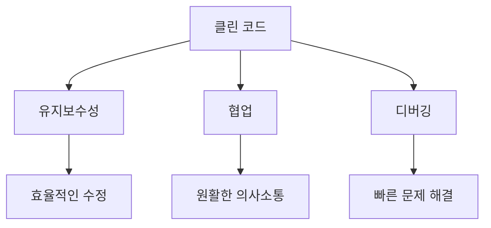
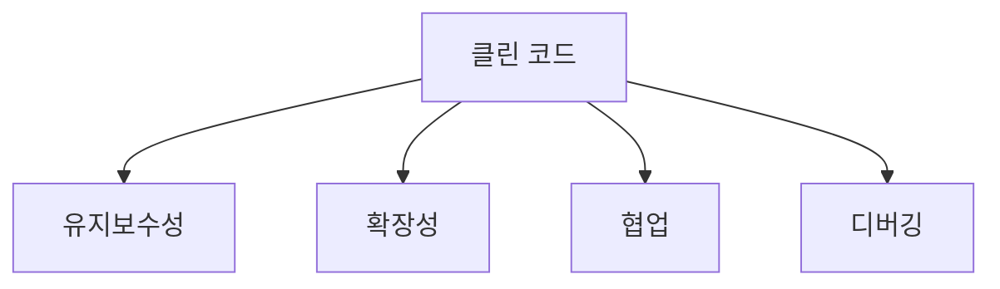
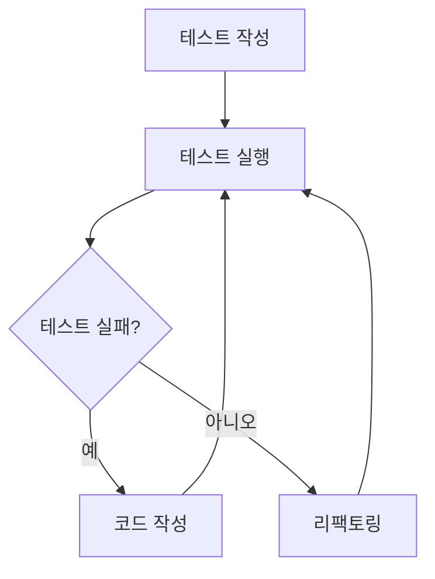
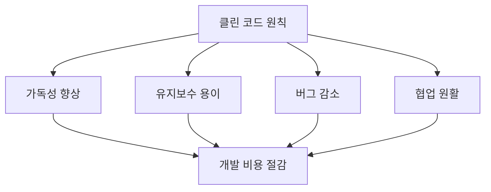
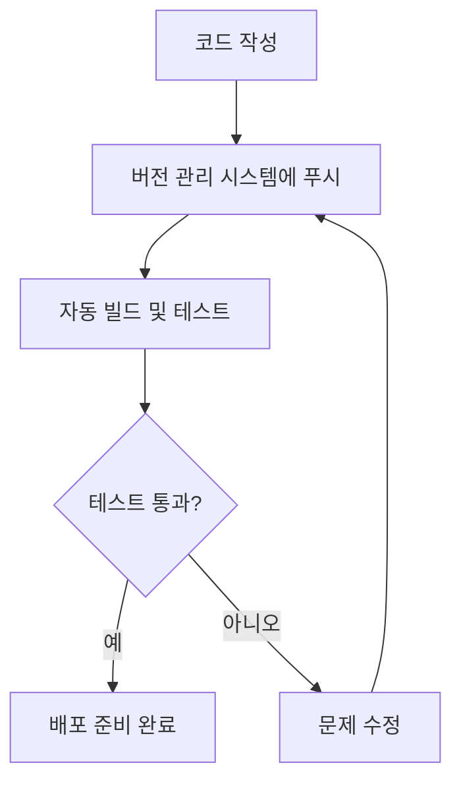
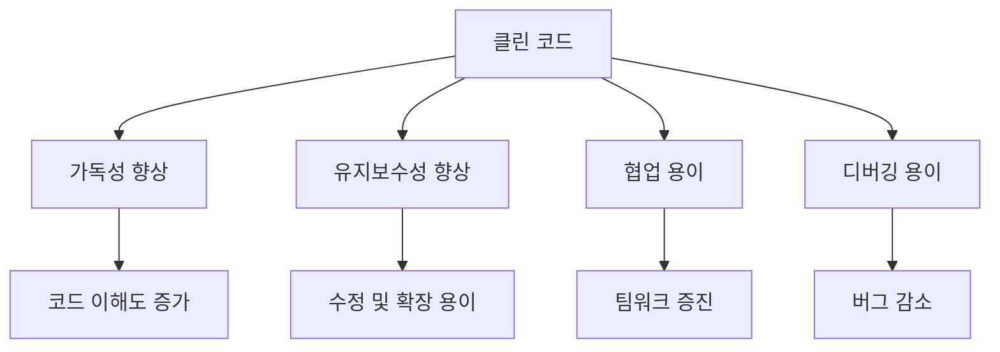

클린 코드는 소프트웨어 개발에서 매우 중요한 요소이다. 클린 코드는 유지보수성이 뛰어나고, 코드의 가독성을 높이며, 팀원 간의 협업을 원활하게 한다. 또한, 잘 구조화된 코드는 확장성과 유연성을 제공하여, 새로운 기능을 추가하거나 기존 기능을 수정할 때 발생할 수 있는 문제를 최소화한다. 클린 코드를 작성하는 것은 단순히 코드의 외형을 정리하는 것이 아니라, 코드의 품질을 높이고, 버그를 줄이며, 개발자 간의 소통을 개선하는 데 기여한다. 예를 들어, 변수와 함수의 이름을 명확하게 지정하면 코드의 의도를 쉽게 이해할 수 있어, 다른 개발자들이 코드를 읽고 수정하는 데 드는 시간을 줄일 수 있다. 또한, 단일 책임 원칙(Single Responsibility Principle)을 적용하여 각 함수가 하나의 작업만 수행하도록 하면, 코드의 재사용성과 가독성이 향상된다. 에러 처리를 적절히 수행하는 것도 클린 코드의 중요한 요소로, 예외 상황을 미리 고려하여 코드의 안정성을 높일 수 있다. 마지막으로, 중복 코드를 제거하고 함수의 재사용성을 높이는 것은 코드의 유지보수성을 크게 향상시킨다. 이러한 이유로 클린 코드는 소프트웨어 개발에서 필수적인 요소로 자리 잡고 있다.

<!--
##### Outline #####
-->

<!--
# 목차

## 개요
   - 클린 코드의 정의
   - 클린 코드의 중요성

## 클린 코드의 이점
   - 유지보수성 (Maintainability)
   - 확장성 (Scalability)
   - 협업 (Collaboration)
   - 디버깅 (Debugging)

## 나쁜 관행과 좋은 관행의 예제
   - ### 예제 1: 변수 및 함수 이름
     - 나쁜 관행
     - 좋은 관행
   - ### 예제 2: 단일 책임 원칙 (Single Responsibility Principle)
     - 나쁜 관행
     - 좋은 관행
   - ### 예제 3: 오류 처리 (Error Handling)
     - 나쁜 관행
     - 좋은 관행
   - ### 예제 4: 중복 코드 (Duplicated Code)
     - 나쁜 관행
     - 좋은 관행

## 클린 코드 작성 시 유의사항
   - 코드 스타일 가이드 (Code Style Guide)
   - 주석 및 문서화 (Commenting and Documentation)
   - 테스트 주도 개발 (Test-Driven Development, TDD)

## FAQ
   - 클린 코드란 무엇인가요?
   - 클린 코드를 작성하는 데 필요한 도구는 무엇인가요?
   - 클린 코드의 원칙을 따르지 않으면 어떤 문제가 발생하나요?

## 관련 기술
   - 리팩토링 (Refactoring)
   - 디자인 패턴 (Design Patterns)
   - 코드 리뷰 (Code Review)
   - 지속적 통합 (Continuous Integration)

## 결론
   - 클린 코드의 중요성 요약
   - 클린 코드를 작성하기 위한 지속적인 노력의 필요성

## 추가 자료
   - 추천 도서 및 리소스
   - 온라인 강의 및 워크숍 정보

이 목차는 클린 코드의 중요성과 작성 방법에 대한 포괄적인 정보를 제공하며, 관련된 기술과 자료를 통해 독자가 더 깊이 있는 이해를 할 수 있도록 돕습니다.
-->

<!--
## 개요
   - 클린 코드의 정의
   - 클린 코드의 중요성
-->

## 개요

### 클린 코드의 정의

클린 코드는 가독성이 높고, 이해하기 쉬우며, 유지보수가 용이한 코드를 의미한다. 이는 코드의 구조와 스타일이 일관되며, 명확한 의도를 가지고 작성된 코드를 포함한다. 클린 코드는 단순히 작동하는 코드를 넘어서, 다른 개발자들이 쉽게 이해하고 수정할 수 있도록 돕는 것을 목표로 한다. 

예를 들어, 다음은 클린 코드와 그렇지 않은 코드의 간단한 비교이다.

```python
# 나쁜 관행
def f(x):
    return x * 2

# 좋은 관행
def double_value(value):
    return value * 2
```

위의 예제에서, 나쁜 관행의 함수 이름 `f`는 함수의 목적을 명확히 전달하지 못한다. 반면, 좋은 관행의 `double_value`는 함수의 의도를 분명히 드러내어 가독성을 높인다.

### 클린 코드의 중요성

클린 코드는 소프트웨어 개발에서 매우 중요한 요소이다. 이는 다음과 같은 이유로 중요하다.

1. **유지보수성**: 클린 코드는 시간이 지나도 쉽게 수정할 수 있도록 돕는다. 코드가 명확하고 일관되면, 새로운 기능을 추가하거나 버그를 수정하는 과정이 수월해진다.

2. **협업**: 여러 개발자가 함께 작업할 때, 클린 코드는 팀원 간의 의사소통을 원활하게 한다. 다른 개발자가 작성한 코드를 이해하기 쉬우므로, 협업의 효율성이 높아진다.

3. **디버깅**: 클린 코드는 버그를 찾고 수정하는 과정을 간소화한다. 코드가 명확할수록 문제의 원인을 파악하기 쉬워지기 때문이다.

다음은 클린 코드의 중요성을 시각적으로 나타낸 다이어그램이다.



이와 같이 클린 코드는 소프트웨어 개발의 여러 측면에서 긍정적인 영향을 미치며, 개발자들이 더 나은 품질의 소프트웨어를 제공할 수 있도록 돕는다.

<!--
## 클린 코드의 이점
   - 유지보수성 (Maintainability)
   - 확장성 (Scalability)
   - 협업 (Collaboration)
   - 디버깅 (Debugging)
-->

## 클린 코드의 이점

클린 코드는 소프트웨어 개발에서 여러 가지 이점을 제공한다. 이 글에서는 유지보수성, 확장성, 협업, 디버깅의 네 가지 주요 이점에 대해 살펴보겠다.

### 유지보수성 (Maintainability)

클린 코드는 유지보수성을 높인다. 코드가 명확하고 일관되게 작성되면, 다른 개발자가 코드를 이해하고 수정하는 데 필요한 시간이 줄어든다. 이는 특히 팀 프로젝트에서 중요한 요소이다. 예를 들어, 다음과 같은 코드가 있다고 가정해보자.

```python
# 나쁜 관행
def f(x):
    return x * 2 + 3

# 좋은 관행
def calculate_double_and_add_three(value):
    return value * 2 + 3
```

위의 예에서, 나쁜 관행의 함수 이름은 그 기능을 명확히 설명하지 않는다. 반면, 좋은 관행의 함수 이름은 그 기능을 명확히 전달하여 유지보수를 용이하게 한다.

### 확장성 (Scalability)

클린 코드는 확장성을 높인다. 코드가 잘 구조화되어 있으면 새로운 기능을 추가할 때 기존 코드를 수정할 필요가 줄어든다. 이는 시스템의 복잡성을 줄이고, 새로운 요구사항에 빠르게 대응할 수 있게 한다. 다음은 확장성을 고려한 코드 구조의 예이다.

```python
class Shape:
    def area(self):
        pass

class Circle(Shape):
    def __init__(self, radius):
        self.radius = radius

    def area(self):
        return 3.14 * self.radius ** 2

class Square(Shape):
    def __init__(self, side):
        self.side = side

    def area(self):
        return self.side ** 2
```

위의 예에서, `Shape` 클래스를 상속받아 `Circle`과 `Square` 클래스를 구현함으로써 새로운 도형을 쉽게 추가할 수 있다.

### 협업 (Collaboration)

클린 코드는 협업을 촉진한다. 여러 개발자가 동시에 작업할 때, 코드가 명확하고 일관되면 서로의 작업을 이해하고 통합하는 데 도움이 된다. 다음은 협업을 위한 코드 스타일 가이드의 예이다.

```python
# 나쁜 관행
def calc(a,b): return a+b

# 좋은 관행
def calculate_sum(first_number, second_number):
    return first_number + second_number
```

좋은 관행의 코드에서는 변수 이름이 명확하여 다른 개발자가 코드를 쉽게 이해할 수 있다.

### 디버깅 (Debugging)

클린 코드는 디버깅을 용이하게 한다. 코드가 명확하고 잘 구조화되어 있으면, 버그를 찾고 수정하는 과정이 간단해진다. 다음은 디버깅을 위한 예제이다.

```python
# 나쁜 관행
def process_data(data):
    # 데이터 처리 로직
    pass

# 좋은 관행
def process_data(data):
    if not data:
        raise ValueError("Data cannot be empty")
    # 데이터 처리 로직
```

좋은 관행의 코드에서는 입력 데이터에 대한 검증을 추가하여, 문제가 발생할 가능성을 줄인다.



위의 다이어그램은 클린 코드가 제공하는 네 가지 이점을 시각적으로 나타낸 것이다. 클린 코드는 소프트웨어 개발의 여러 측면에서 긍정적인 영향을 미치며, 개발자들이 더 나은 코드를 작성할 수 있도록 돕는다.

<!--
## 나쁜 관행과 좋은 관행의 예제
   - ### 예제 1: 변수 및 함수 이름
     - 나쁜 관행
     - 좋은 관행
   - ### 예제 2: 단일 책임 원칙 (Single Responsibility Principle)
     - 나쁜 관행
     - 좋은 관행
   - ### 예제 3: 오류 처리 (Error Handling)
     - 나쁜 관행
     - 좋은 관행
   - ### 예제 4: 중복 코드 (Duplicated Code)
     - 나쁜 관행
     - 좋은 관행
-->

## 나쁜 관행과 좋은 관행의 예제

### 예제 1: 변수 및 함수 이름
**나쁜 관행**

변수와 함수의 이름이 의미를 전달하지 못하는 경우가 많다. 예를 들어, `a`, `b`, `temp`와 같은 이름은 코드의 의도를 파악하기 어렵게 만든다. 

```python
def f(x):
    return x * 2
```

**좋은 관행**

의미 있는 이름을 사용하여 코드의 가독성을 높인다. 예를 들어, `calculateDouble`과 같은 이름은 함수의 목적을 명확히 전달한다.

```python
def calculateDouble(value):
    return value * 2
```

### 예제 2: 단일 책임 원칙 (Single Responsibility Principle)
**나쁜 관행**

하나의 함수가 여러 가지 일을 수행하는 경우, 코드의 유지보수가 어려워진다. 예를 들어, 데이터베이스에서 데이터를 가져오고, 이를 출력하는 기능을 하나의 함수에서 처리하는 경우가 있다.

```python
def processData():
    data = fetchDataFromDatabase()
    print(data)
```

**좋은 관행**

각 함수가 하나의 책임만을 가지도록 분리하여 코드의 명확성을 높인다.

```python
def fetchDataFromDatabase():
    # 데이터베이스에서 데이터 가져오기
    pass

def printData(data):
    print(data)

data = fetchDataFromDatabase()
printData(data)
```

### 예제 3: 오류 처리 (Error Handling)
**나쁜 관행**

오류를 무시하거나, 단순히 `print` 문으로 처리하는 경우가 있다. 이는 문제를 해결하기보다는 더 큰 문제를 초래할 수 있다.

```python
def divide(a, b):
    return a / b  # b가 0일 경우 오류 발생
```

**좋은 관행**

적절한 오류 처리를 통해 코드의 안정성을 높인다. 예를 들어, 예외 처리를 통해 오류를 관리할 수 있다.

```python
def divide(a, b):
    try:
        return a / b
    except ZeroDivisionError:
        return "Error: Division by zero is not allowed."
```

### 예제 4: 중복 코드 (Duplicated Code)
**나쁜 관행**

중복된 코드가 여러 곳에 존재하는 경우, 코드의 유지보수가 어려워진다. 예를 들어, 동일한 로직이 여러 함수에 반복적으로 나타날 수 있다.

```python
def calculateAreaOfCircle(radius):
    return 3.14 * radius * radius

def calculateAreaOfSphere(radius):
    return 4/3 * 3.14 * radius * radius * radius
```

**좋은 관행**

중복된 코드를 함수로 분리하여 재사용성을 높인다.

```python
def calculateAreaOfCircle(radius):
    return 3.14 * radius * radius

def calculateAreaOfSphere(radius):
    circleArea = calculateAreaOfCircle(radius)
    return 4/3 * circleArea * radius
```

이와 같은 나쁜 관행과 좋은 관행의 예제를 통해 클린 코드를 작성하는 데 있어 중요한 원칙들을 이해할 수 있다. 이러한 원칙들을 준수함으로써 코드의 가독성과 유지보수성을 높일 수 있다.

<!--
## 클린 코드 작성 시 유의사항
   - 코드 스타일 가이드 (Code Style Guide)
   - 주석 및 문서화 (Commenting and Documentation)
   - 테스트 주도 개발 (Test-Driven Development, TDD)
-->

## 클린 코드 작성 시 유의사항

### 코드 스타일 가이드 (Code Style Guide)

코드 스타일 가이드는 팀 내에서 일관된 코드 작성을 위해 필요한 규칙과 지침을 제공한다. 일관된 스타일은 코드의 가독성을 높이고, 팀원 간의 협업을 원활하게 한다. 일반적으로 포함되는 요소는 다음과 같다.

- **들여쓰기 (Indentation)**: 공백 또는 탭을 사용하여 코드 블록을 구분한다.
- **네이밍 규칙 (Naming Conventions)**: 변수, 함수, 클래스 등의 이름을 명확하고 일관되게 작성한다.
- **코드 길이 (Line Length)**: 한 줄의 최대 길이를 정하여 가독성을 유지한다.

예를 들어, JavaScript에서의 네이밍 규칙은 다음과 같다.

```javascript
// 나쁜 관행
function f() {
    let a = 10;
    return a * 2;
}

// 좋은 관행
function calculateDouble(value) {
    let result = value * 2;
    return result;
}
```

### 주석 및 문서화 (Commenting and Documentation)

주석은 코드의 의도를 설명하고, 복잡한 로직을 이해하는 데 도움을 준다. 그러나 과도한 주석은 오히려 혼란을 초래할 수 있으므로, 필요한 부분에만 적절히 작성해야 한다. 주석의 종류는 다음과 같다.

- **라인 주석 (Line Comments)**: 특정 코드 라인에 대한 설명을 추가한다.
- **블록 주석 (Block Comments)**: 여러 줄에 걸쳐 설명이 필요한 경우 사용한다.
- **문서화 주석 (Documentation Comments)**: 함수나 클래스의 사용법을 설명하는 주석으로, API 문서 생성에 활용된다.

예를 들어, Python에서의 주석 사용 예시는 다음과 같다.

```python
def calculate_area(radius):
    """주어진 반지름으로 원의 면적을 계산한다."""
    return 3.14 * radius ** 2  # 면적 계산
```

### 테스트 주도 개발 (Test-Driven Development, TDD)

테스트 주도 개발은 코드를 작성하기 전에 테스트 케이스를 먼저 작성하는 개발 방법론이다. 이 접근 방식은 코드의 품질을 높이고, 버그를 사전에 방지하는 데 효과적이다. TDD의 기본 단계는 다음과 같다.

1. **테스트 작성 (Write a Test)**: 기능이 추가될 부분에 대한 테스트 케이스를 작성한다.
2. **테스트 실패 (Run the Test)**: 작성한 테스트가 실패하는 것을 확인한다.
3. **코드 작성 (Write the Code)**: 테스트를 통과하기 위한 최소한의 코드를 작성한다.
4. **리팩토링 (Refactor)**: 코드를 개선하고, 테스트가 여전히 통과하는지 확인한다.

다음은 TDD의 흐름을 나타내는 다이어그램이다.



이와 같은 유의사항을 준수하면 클린 코드를 작성하는 데 큰 도움이 된다. 코드의 가독성과 유지보수성을 높이고, 팀원 간의 협업을 원활하게 할 수 있다.

<!--
## FAQ
   - 클린 코드란 무엇인가요?
   - 클린 코드를 작성하는 데 필요한 도구는 무엇인가요?
   - 클린 코드의 원칙을 따르지 않으면 어떤 문제가 발생하나요?
-->

## FAQ

### 클린 코드란 무엇인가요?
클린 코드는 가독성이 높고, 이해하기 쉬우며, 유지보수와 확장이 용이한 코드를 의미한다. 이는 코드의 품질을 높이고, 개발자 간의 협업을 원활하게 하며, 버그를 줄이는 데 기여한다. 클린 코드는 명확한 변수 및 함수 이름, 일관된 코드 스타일, 적절한 주석 등을 포함한다.

**예시 코드:**

```python
# 나쁜 관행
def f(x):
    return x * 2

# 좋은 관행
def double_value(value):
    return value * 2
```

### 클린 코드를 작성하는 데 필요한 도구는 무엇인가요?
클린 코드를 작성하기 위해서는 여러 도구와 기술이 필요하다. 코드 스타일 가이드를 준수하기 위한 린터(linter)와 포매터(formatter), 테스트를 자동화하기 위한 테스트 프레임워크, 그리고 코드 리뷰를 위한 협업 도구가 포함된다. 이러한 도구들은 코드의 일관성을 유지하고, 오류를 사전에 방지하는 데 도움을 준다.

**도구 예시:**

- 린터: ESLint, Pylint
- 포매터: Prettier, Black
- 테스트 프레임워크: JUnit, pytest
- 코드 리뷰 도구: GitHub, GitLab

### 클린 코드의 원칙을 따르지 않으면 어떤 문제가 발생하나요?
클린 코드의 원칙을 따르지 않으면 여러 가지 문제가 발생할 수 있다. 코드의 가독성이 떨어져 이해하기 어려워지고, 유지보수가 힘들어지며, 버그가 발생할 확률이 높아진다. 또한, 팀원 간의 협업이 원활하지 않아 프로젝트의 진행 속도가 느려질 수 있다. 이러한 문제들은 결국 개발 비용을 증가시키고, 프로젝트의 성공 가능성을 낮출 수 있다.

**문제 예시:**

```python
# 나쁜 관행
def a(b):
    if b > 0:
        return True
    else:
        return False

# 좋은 관행
def is_positive(number):
    return number > 0
```



이와 같이 클린 코드는 소프트웨어 개발의 여러 측면에서 긍정적인 영향을 미치며, 이를 통해 개발자와 팀의 생산성을 높일 수 있다.

<!--
## 관련 기술
   - 리팩토링 (Refactoring)
   - 디자인 패턴 (Design Patterns)
   - 코드 리뷰 (Code Review)
   - 지속적 통합 (Continuous Integration)
-->

## 관련 기술

### 리팩토링 (Refactoring)

리팩토링은 기존 코드를 개선하여 가독성을 높이고 유지보수성을 향상시키는 과정이다. 이 과정은 기능을 변경하지 않으면서 코드 구조를 개선하는 데 중점을 둔다. 리팩토링을 통해 코드의 복잡성을 줄이고, 버그를 예방하며, 새로운 기능 추가 시 발생할 수 있는 문제를 최소화할 수 있다.

**리팩토링의 예시:**

```python
# 나쁜 관행
def calc(a, b):
    return a + b

# 좋은 관행
def add_numbers(num1, num2):
    return num1 + num2
```

위의 예시에서 함수 이름을 명확하게 변경하여 코드의 의도를 분명히 하였다.

### 디자인 패턴 (Design Patterns)

디자인 패턴은 소프트웨어 설계에서 자주 발생하는 문제를 해결하기 위한 일반적인 솔루션이다. 디자인 패턴은 코드의 재사용성을 높이고, 유지보수성을 향상시키며, 팀원 간의 협업을 원활하게 한다. 대표적인 디자인 패턴으로는 싱글턴(Singleton), 팩토리(Factory), 옵저버(Observer) 패턴 등이 있다.

**디자인 패턴의 예시:**

```python
# 싱글턴 패턴 예시
class Singleton:
    _instance = None

    def __new__(cls):
        if cls._instance is None:
            cls._instance = super(Singleton, cls).__new__(cls)
        return cls._instance
```

위의 코드는 싱글턴 패턴을 구현한 예시로, 클래스의 인스턴스가 하나만 생성되도록 보장한다.

### 코드 리뷰 (Code Review)

코드 리뷰는 팀원 간에 작성된 코드를 검토하는 과정으로, 코드 품질을 높이고 버그를 조기에 발견하는 데 도움을 준다. 코드 리뷰는 협업을 촉진하고, 지식 공유를 통해 팀의 기술 수준을 향상시킬 수 있다. 리뷰 과정에서 피드백을 주고받으며, 코드의 가독성, 성능, 보안 등을 점검하는 것이 중요하다.

**코드 리뷰의 체크리스트:**

- 코드의 가독성이 좋은가?
- 불필요한 복잡성이 있는가?
- 성능 최적화가 필요한 부분은 없는가?
- 보안 취약점이 있는가?

### 지속적 통합 (Continuous Integration)

지속적 통합은 개발자가 작성한 코드를 정기적으로 통합하여 자동으로 빌드하고 테스트하는 프로세스이다. 이 과정은 코드 변경 사항을 신속하게 검증하고, 통합 과정에서 발생할 수 있는 문제를 조기에 발견할 수 있도록 돕는다. 지속적 통합을 통해 소프트웨어 개발의 효율성을 높이고, 배포 주기를 단축할 수 있다.

**지속적 통합의 흐름:**



위의 다이어그램은 지속적 통합의 기본 흐름을 나타내며, 코드 작성부터 배포 준비까지의 과정을 시각적으로 표현하였다. 

이와 같은 관련 기술들은 클린 코드를 작성하는 데 있어 필수적인 요소로, 개발자들이 더 나은 소프트웨어를 만들기 위해 지속적으로 학습하고 적용해야 할 부분이다.

<!--
## 결론
   - 클린 코드의 중요성 요약
   - 클린 코드를 작성하기 위한 지속적인 노력의 필요성
-->

## 결론

### 클린 코드의 중요성 요약

클린 코드는 소프트웨어 개발에서 필수적인 요소로, 코드의 가독성과 유지보수성을 높이는 데 기여한다. 클린 코드를 작성하면 개발자는 코드의 의도를 쉽게 이해할 수 있으며, 이는 협업 시에도 큰 장점으로 작용한다. 또한, 클린 코드는 버그를 줄이고, 새로운 기능을 추가할 때 발생할 수 있는 문제를 최소화하는 데 도움을 준다. 

아래의 다이어그램은 클린 코드의 중요성을 시각적으로 나타낸 것이다.



### 클린 코드를 작성하기 위한 지속적인 노력의 필요성

클린 코드를 작성하는 것은 일회성 작업이 아니라 지속적인 노력과 학습이 필요한 과정이다. 개발자는 새로운 기술과 방법론을 지속적으로 학습하고, 코드 리뷰와 피드백을 통해 자신의 코드를 개선해야 한다. 또한, 팀 내에서 클린 코드의 중요성을 공유하고, 코드 스타일 가이드와 같은 규칙을 준수하는 것이 중요하다. 

결국, 클린 코드를 작성하는 것은 소프트웨어의 품질을 높이고, 개발자의 생산성을 향상시키는 데 기여하는 중요한 요소이다. 따라서 모든 개발자는 클린 코드를 작성하기 위한 노력을 게을리하지 않아야 한다.


<!--
##### Reference #####
-->

## Reference


* [https://medium.com/pythons-gurus/clean-code-in-python-good-vs-bad-practices-examples-2df344bddacc](https://medium.com/pythons-gurus/clean-code-in-python-good-vs-bad-practices-examples-2df344bddacc)

