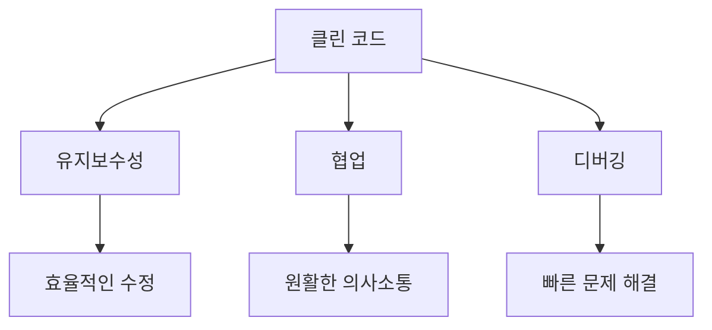
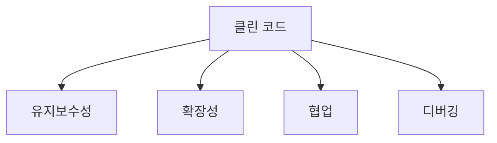
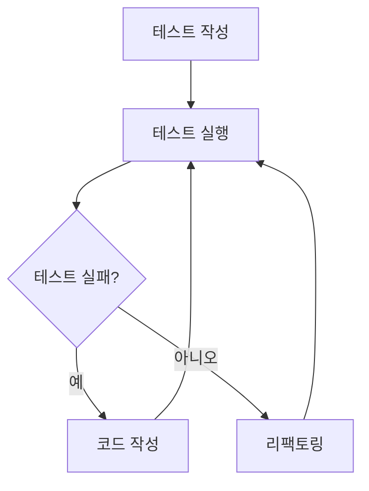
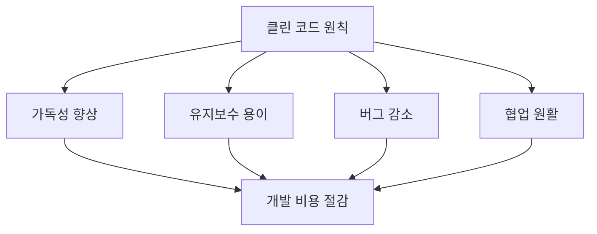
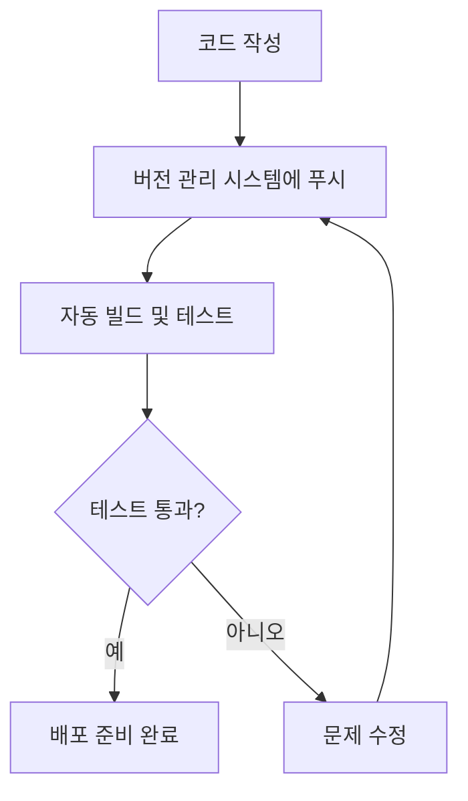
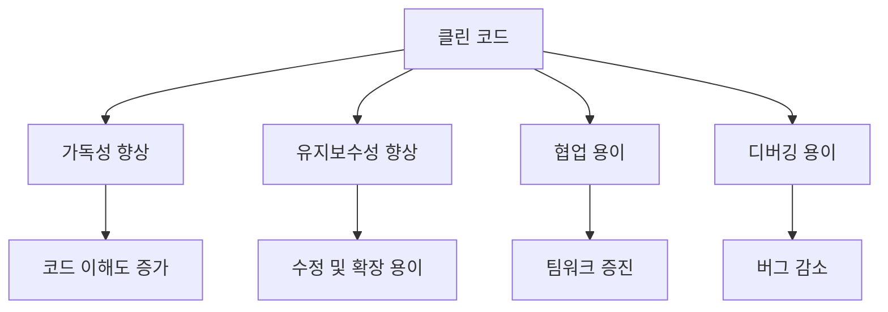

클린 코드는 소프트웨어 개발에서 매우 중요한 요소이다. 유지보수성이 뛰어나고, 가독성을 높이며, 팀원 간 협업을 원활하게 한다. 잘 구조화된 코드는 확장성과 유연성을 제공해 기능 추가·수정 시 문제를 최소화한다. 이 글에서는 클린 코드의 정의와 이점, Python에서의 나쁜 관행·좋은 관행 예제, 작성 시 유의사항을 정리한다.

## 목차

1. [개요](#개요): 클린 코드의 정의와 중요성  
2. [클린 코드의 이점](#클린-코드의-이점): 유지보수성, 확장성, 협업, 디버깅  
3. [나쁜 관행과 좋은 관행의 예제](#나쁜-관행과-좋은-관행의-예제): 네이밍, 단일 책임, 오류 처리, 중복 제거  
4. [클린 코드 작성 시 유의사항](#클린-코드-작성-시-유의사항): 스타일 가이드, 주석·문서화, TDD  
5. [FAQ](#faq)  
6. [관련 기술](#관련-기술): 리팩토링, 디자인 패턴, 코드 리뷰, CI  
7. [결론](#결론)  
8. [Reference](#reference)

---

## 개요

### 클린 코드의 정의

클린 코드는 **가독성이 높고, 이해하기 쉬우며, 유지보수가 용이한 코드**를 의미한다. 코드의 구조와 스타일이 일관되고, 의도가 명확하게 드러나며, 다른 개발자가 쉽게 이해하고 수정할 수 있도록 작성된 코드를 말한다. 단순히 동작하는 코드를 넘어, 팀 전체의 생산성과 품질에 기여하는 것을 목표로 한다.

다음은 클린 코드와 그렇지 않은 코드의 간단한 비교이다.

```python
# 나쁜 관행
def f(x):
    return x * 2

# 좋은 관행 (PEP 8: 함수명은 소문자 + 밑줄)
def double_value(value):
    return value * 2
```

나쁜 관행의 함수 이름 `f`는 목적을 전달하지 못한다. `double_value`는 의도를 분명히 드러내어 가독성을 높인다.

### 클린 코드의 중요성

클린 코드가 중요한 이유는 다음과 같다.

1. **유지보수성**: 시간이 지나도 수정·확장이 쉬워진다. 명확하고 일관된 코드는 기능 추가와 버그 수정을 수월하게 한다.  
2. **협업**: 여러 개발자가 함께 작업할 때 의사소통이 원활해진다. 다른 사람이 쓴 코드를 이해하기 쉬우므로 협업 효율이 올라간다.  
3. **디버깅**: 버그를 찾고 수정하는 과정이 단순해진다. 코드가 명확할수록 원인 파악이 빨라진다.

아래 다이어그램은 클린 코드가 가져오는 핵심 가치를 요약한다.


```mermaid
graph TD
    cleanCode["클린 코드"]
    maintainability["유지보수성"]
    collaboration["협업"]
    debugging["디버깅"]
    efficientFix["효율적인 수정"]
    smoothComm["원활한 의사소통"]
    fastResolve["빠른 문제 해결"]
    cleanCode --> maintainability
    cleanCode --> collaboration
    cleanCode --> debugging
    maintainability --> efficientFix
    collaboration --> smoothComm
    debugging --> fastResolve
```

---

## 클린 코드의 이점

클린 코드는 유지보수성, 확장성, 협업, 디버깅 네 가지 측면에서 뚜렷한 이점을 준다.

### 유지보수성 (Maintainability)

코드가 명확하고 일관되게 작성되면, 다른 개발자가 이해하고 수정하는 데 걸리는 시간이 줄어든다. 팀 프로젝트에서 특히 중요하다.

```python
# 나쁜 관행
def f(x):
    return x * 2 + 3

# 좋은 관행
def calculate_double_and_add_three(value):
    return value * 2 + 3
```

함수 이름만으로도 동작을 유추할 수 있어 유지보수가 수월해진다.

### 확장성 (Scalability)

잘 구조화된 코드는 새 기능을 추가할 때 기존 코드 수정을 최소화한다. 복잡성을 낮추고 요구사항 변화에 빠르게 대응할 수 있다.

```python
class Shape:
    def area(self):
        raise NotImplementedError

class Circle(Shape):
    def __init__(self, radius):
        self.radius = radius

    def area(self):
        return 3.14 * self.radius ** 2

class Square(Shape):
    def __init__(self, side):
        self.side = side

    def area(self):
        return self.side ** 2
```

`Shape`를 상속해 `Circle`, `Square`를 두었으므로 새 도형을 추가하기 쉽다.

### 협업 (Collaboration)

여러 개발자가 동시에 작업할 때, 코드가 명확하고 일관되면 서로의 작업을 이해하고 통합하기 쉬워진다.

```python
# 나쁜 관행
def calc(a, b):
    return a + b

# 좋은 관행
def calculate_sum(first_number, second_number):
    return first_number + second_number
```

변수와 함수 이름이 명확하면 리뷰와 협업이 수월해진다.

### 디버깅 (Debugging)

코드가 명확하고 구조가 잘 잡혀 있으면 버그를 찾고 수정하는 과정이 단순해진다.

```python
# 나쁜 관행
def process_data(data):
    # 데이터 처리 로직
    pass

# 좋은 관행
def process_data(data):
    if not data:
        raise ValueError("Data cannot be empty")
    # 데이터 처리 로직
```

입력 검증과 명시적 예외로 문제 가능성을 줄이고, 원인 추적이 쉬워진다.


```mermaid
graph TD
    cleanCode["클린 코드"]
    maintainability["유지보수성"]
    scalability["확장성"]
    collaboration["협업"]
    debugging["디버깅"]
    cleanCode --> maintainability
    cleanCode --> scalability
    cleanCode --> collaboration
    cleanCode --> debugging
```

---

## 나쁜 관행과 좋은 관행의 예제

### 예제 1: 변수 및 함수 이름

**나쁜 관행**: `a`, `b`, `temp`처럼 의미를 전달하지 못하는 이름은 의도를 파악하기 어렵게 만든다.

```python
def f(x):
    return x * 2
```

**좋은 관행**: PEP 8에 맞춰 함수명은 `snake_case`로, 의도를 드러내는 이름을 사용한다.

```python
def double_value(value):
    return value * 2
```

### 예제 2: 단일 책임 원칙 (Single Responsibility Principle)

**나쁜 관행**: 한 함수가 DB 조회, 가공, 출력까지 모두 처리하면 유지보수와 테스트가 어려워진다.

```python
def process_data():
    data = fetch_data_from_database()
    print(data)
```

**좋은 관행**: 조회·출력 등 책임을 나누어 각 함수가 한 가지 일만 하도록 한다.

```python
def fetch_data_from_database():
    # 데이터베이스에서 데이터 가져오기
    pass

def print_data(data):
    print(data)

data = fetch_data_from_database()
print_data(data)
```

### 예제 3: 오류 처리 (Error Handling)

**나쁜 관행**: 나눗셈에서 제수(divisor)가 0인 경우를 처리하지 않으면 런타임 예외가 발생한다.

```python
def divide(a, b):
    return a / b  # b가 0일 경우 ZeroDivisionError
```

**좋은 관행**: 예외를 명시적으로 처리하고, 호출자가 다루기 쉬운 예외 타입과 메시지를 제공한다.

```python
def divide(a, b):
    if b == 0:
        raise ValueError("Division by zero is not allowed.")
    return a / b
```

`try`/`except`로 호출부에서 처리할 수도 있으나, 위처럼 함수 내부에서 검증 후 `ValueError`를 발생시키는 방식이 재사용과 테스트에 유리하다.

### 예제 4: 중복 코드 (Duplicated Code)

**나쁜 관행**: 같은 로직이 여러 곳에 반복되면 수정 시 누락과 불일치가 생기기 쉽다.

```python
def calculate_area_of_circle(radius):
    return 3.14 * radius * radius

def calculate_volume_of_sphere(radius):
    return (4 / 3) * 3.14 * radius * radius * radius
```

**좋은 관행**: 공통 로직을 함수로 추출해 재사용하고, 상수는 이름을 부여해 의미를 드러낸다.

```python
PI = 3.14

def calculate_area_of_circle(radius):
    return PI * radius * radius

def calculate_volume_of_sphere(radius):
    circle_area = calculate_area_of_circle(radius)
    return (4 / 3) * circle_area * radius
```

---

## 클린 코드 작성 시 유의사항

### 코드 스타일 가이드 (Code Style Guide)

팀 내 일관된 코드 작성을 위해 스타일 가이드를 두는 것이 좋다. [PEP 8](https://peps.python.org/pep-0008/)은 Python 공식 스타일 가이드로, 다음 항목을 다룬다.

- **들여쓰기**: 스페이스 4칸 사용.  
- **네이밍**: 함수·변수는 `snake_case`, 클래스는 `CapWords`, 상수는 `UPPER_SNAKE_CASE`.  
- **줄 길이**: 한 줄 최대 79자(또는 팀 합의에 따라 99자까지).

예시는 다음과 같다.

```python
# 나쁜 관행 (함수명 mixedCase, 불명확한 변수명)
def calculateDouble(value):
    x = value * 2
    return x

# 좋은 관행 (PEP 8)
def calculate_double(value):
    result = value * 2
    return result
```

### 주석 및 문서화 (Commenting and Documentation)

주석은 **무엇을** 하는지보다 **왜** 그렇게 하는지를 설명하는 데 쓰는 것이 좋다. 복잡한 로직에만 최소한으로 두고, 가능한 한 코드 자체가 말하게 만든다. docstring으로 함수·클래스 사용법을 문서화하면 API 문서 생성과 IDE 도움말에 도움이 된다.

```python
def calculate_area(radius):
    """주어진 반지름으로 원의 면적을 계산한다."""
    return 3.14 * radius ** 2
```

### 테스트 주도 개발 (Test-Driven Development, TDD)

TDD는 테스트를 먼저 작성한 뒤, 그 테스트를 통과하는 최소 코드를 작성하고 리팩토링하는 흐름이다. 코드 품질과 버그 예방에 도움이 된다.

1. **테스트 작성**: 추가할 기능에 대한 테스트 케이스를 먼저 작성한다.  
2. **테스트 실패 확인**: 작성한 테스트가 실패하는 것을 확인한다.  
3. **코드 작성**: 테스트를 통과하는 최소한의 코드를 작성한다.  
4. **리팩토링**: 코드를 정리한 뒤에도 테스트가 통과하는지 확인한다.


```mermaid
graph TD
    writeTest["테스트 작성"]
    runTest["테스트 실행"]
    testFailCheck{"테스트 실패?"}
    writeCode["코드 작성"]
    refactor["리팩토링"]
    writeTest --> runTest
    runTest --> testFailCheck
    testFailCheck -->|"예"| writeCode
    testFailCheck -->|"아니오"| refactor
    writeCode --> runTest
    refactor --> runTest
```

---

## FAQ

### 클린 코드란 무엇인가요?

가독성이 높고, 이해·유지보수·확장이 쉬운 코드를 말한다. 명확한 이름, 일관된 스타일, 적절한 주석과 문서화, 단일 책임·오류 처리 등이 포함된다.

### 클린 코드를 작성하는 데 필요한 도구는 무엇인가요?

- **린터**: Pylint, Ruff, Flake8 — 스타일·잠재 오류 검사  
- **포매터**: Black, isort — 자동 포맷팅  
- **테스트**: pytest, unittest — 자동화된 테스트  
- **코드 리뷰**: GitHub, GitLab 등으로 피드백과 지식 공유  

### 클린 코드 원칙을 지키지 않으면 어떤 문제가 발생하나요?

가독성이 떨어져 이해와 수정이 어려워지고, 유지보수 비용이 늘며 버그가 늘어날 수 있다. 팀 협업도 어려워져 일정과 품질에 악영향을 준다.


```mermaid
graph TD
    principles["클린 코드 원칙"]
    readability["가독성 향상"]
    maintainable["유지보수 용이"]
    fewerBugs["버그 감소"]
    smoothCollab["협업 원활"]
    costReduce["개발 비용 절감"]
    principles --> readability
    principles --> maintainable
    principles --> fewerBugs
    principles --> smoothCollab
    readability --> costReduce
    maintainable --> costReduce
    fewerBugs --> costReduce
    smoothCollab --> costReduce
```

---

## 관련 기술

### 리팩토링 (Refactoring)

기능은 유지한 채 코드 구조만 개선하는 작업이다. 가독성과 유지보수성을 높이고, 버그를 줄이며 확장을 쉽게 한다.

### 디자인 패턴 (Design Patterns)

자주 나타나는 설계 문제에 대한 재사용 가능한 해법이다. Singleton, Factory, Observer 등은 코드의 재사용성과 유지보수성, 팀 간 공통어 역할을 한다.

### 코드 리뷰 (Code Review)

팀원이 작성한 코드를 검토하는 과정으로, 품질 향상과 버그 조기 발견, 지식 공유에 기여한다. 가독성, 불필요한 복잡성, 성능, 보안을 함께 점검하면 좋다.

### 지속적 통합 (Continuous Integration)

코드를 정기적으로 통합하고 자동으로 빌드·테스트하는 프로세스이다. 변경 사항을 빠르게 검증하고 통합 오류를 일찍 발견할 수 있게 한다.


```mermaid
graph TD
    writeCode["코드 작성"]
    pushVcs["버전 관리 시스템에 푸시"]
    buildTest["자동 빌드 및 테스트"]
    testPass{"테스트 통과?"}
    deployReady["배포 준비 완료"]
    fixIssue["문제 수정"]
    writeCode --> pushVcs
    pushVcs --> buildTest
    buildTest --> testPass
    testPass -->|"예"| deployReady
    testPass -->|"아니오"| fixIssue
    fixIssue --> pushVcs
```

---

## 결론

### 클린 코드의 중요성 요약

클린 코드는 소프트웨어 개발의 필수 요소로, 가독성과 유지보수성을 높이고 협업과 디버깅을 쉽게 한다. 명확한 이름, 일관된 스타일, 적절한 오류 처리와 단일 책임을 지키면 장기적으로 비용을 줄이고 품질을 높일 수 있다.


```mermaid
graph TD
    cleanCode["클린 코드"]
    readability["가독성 향상"]
    maintainability["유지보수성 향상"]
    collaboration["협업 용이"]
    debugging["디버깅 용이"]
    understand["코드 이해도 증가"]
    modify["수정 및 확장 용이"]
    teamwork["팀워크 증진"]
    fewerBugs["버그 감소"]
    cleanCode --> readability
    cleanCode --> maintainability
    cleanCode --> collaboration
    cleanCode --> debugging
    readability --> understand
    maintainability --> modify
    collaboration --> teamwork
    debugging --> fewerBugs
```

### 지속적인 노력의 필요성

클린 코드는 한 번의 작업이 아니라 습관과 지속적인 학습이 필요하다. 스타일 가이드(PEP 8 등)를 따르고, 코드 리뷰와 TDD를 활용하며, 팀 내에서 원칙을 공유하는 것이 중요하다. 이를 통해 소프트웨어 품질과 개발자 생산성을 함께 높일 수 있다.

---

## Reference

1. [PEP 8 – Style Guide for Python Code](https://peps.python.org/pep-0008/) — Python 공식 스타일 가이드.  
2. [Clean Code in Python: Good vs. Bad Practices Examples (Medium)](https://medium.com/pythons-gurus/clean-code-in-python-good-vs-bad-practices-examples-2df344bddacc) — Python 클린 코드 좋은/나쁜 예시.  
3. Robert C. Martin, *Clean Code: A Handbook of Agile Software Craftsmanship*, Prentice Hall — 클린 코드 원칙과 실천 방법 정리.
