객체지향 프로그래밍(Object-Oriented Programming, OOP)은 소프트웨어 설계 및 개발에서 매우 중요한 개념이다. OOP는 프로그램을 객체라는 단위로 구성하여 데이터와 그 데이터를 처리하는 메서드를 함께 묶어 관리하는 방식을 의미한다. 이러한 접근 방식은 복잡한 소프트웨어 시스템을 보다 쉽게 이해하고 유지보수할 수 있도록 도와준다. OOP의 핵심 개념으로는 클래스(Class), 객체(Object), 상속(Inheritance), 캡슐화(Encapsulation), 다형성(Polymorphism), 추상화(Abstraction) 등이 있다. 클래스는 객체를 생성하기 위한 청사진 역할을 하며, 객체는 클래스의 인스턴스이다. 상속은 기존 클래스의 속성과 메서드를 새로운 클래스가 물려받는 기능으로, 코드 재사용성을 높인다. 캡슐화는 객체의 내부 상태를 보호하고, 외부에서 직접 접근하지 못하도록 제한하는 개념이다. 다형성은 동일한 인터페이스를 통해 서로 다른 데이터 타입을 처리할 수 있는 능력을 의미한다. 이러한 OOP의 원칙들은 소프트웨어 개발의 효율성을 높이고, 코드의 가독성을 향상시키며, 유지보수를 용이하게 한다. 따라서 OOP는 현대 프로그래밍 언어에서 널리 사용되며, 파이썬에서도 그 강력한 기능을 통해 개발자들이 복잡한 문제를 해결하는 데 큰 도움을 준다. OOP의 기본 개념을 이해하고 활용하는 것은 파이썬 프로그래밍을 배우는 데 있어 필수적이다.

<!--
##### Outline #####
-->

<!--
# 목차: 파이썬의 객체지향 프로그래밍 (OOP) 초보자를 위한 가이드

## 개요
   - 객체지향 프로그래밍(OOP)의 정의
   - OOP의 중요성 및 장점
   - 파이썬에서의 OOP 활용

## OOP의 핵심 개념 이해하기
   - 2.1 캡슐화 (Encapsulation)
   - 2.2 추상화 (Abstraction)
   - 2.3 상속 (Inheritance)
   - 2.4 다형성 (Polymorphism)

## 절차지향 프로그래밍 vs 객체지향 프로그래밍
   - 3.1 절차지향 프로그래밍의 개념
   - 3.2 객체지향 프로그래밍의 개념
   - 3.3 두 접근 방식의 비교

## 파이썬에서 클래스와 객체 정의하기
   - 4.1 클래스 정의하기
   - 4.2 객체 생성하기
   - 4.3 클래스와 인스턴스 속성

## 재사용 가능한 클래스 설계 및 객체 생성
   - 5.1 실용적인 예: 은행 계좌 클래스 만들기
   - 5.2 메서드 정의 및 사용하기

## 파이썬에서의 상속과 다형성
   - 6.1 상속의 개념
   - 6.2 다형성의 개념
   - 6.3 상속과 다형성의 예제

## 파이썬에서 예외 처리
   - 7.1 예외 처리의 필요성
   - 7.2 try-except 블록 사용하기

## OOP의 원칙과 모범 사례
   - 8.1 좋은 클래스 설계 원칙
   - 8.2 코드 재사용성 및 유지보수성 향상

## OOP의 실제 적용 사례
   - 9.1 물류 회사의 배달 차량 관리 시스템
   - 9.2 다양한 객체 모델링 예제

## FAQ
   - 10.1 OOP의 4대 원칙은 무엇인가요?
   - 10.2 파이썬에서 OOP는 어떻게 사용되나요?
   - 10.3 파이썬은 100% 객체지향 언어인가요?
   - 10.4 `__init__` 메서드는 무엇인가요?
   - 10.5 `super()`는 무엇인가요?
   - 10.6 `self`는 왜 사용되나요?

## 관련 기술
   - 11.1 다른 프로그래밍 언어에서의 OOP
   - 11.2 OOP와 디자인 패턴
   - 11.3 OOP와 소프트웨어 개발 방법론

## 결론
   - OOP의 중요성 요약
   - 파이썬에서 OOP를 활용한 프로그래밍의 미래

## 참고 자료 및 추가 학습 리소스
   - 관련 서적 및 온라인 강좌
   - OOP 관련 블로그 및 커뮤니티

이 목차는 파이썬의 객체지향 프로그래밍에 대한 포괄적인 이해를 돕기 위해 구성되었습니다. 각 섹션은 OOP의 기본 개념부터 실제 적용 사례까지 다양한 내용을 포함하고 있습니다.
-->

<!--
## 개요
   - 객체지향 프로그래밍(OOP)의 정의
   - OOP의 중요성 및 장점
   - 파이썬에서의 OOP 활용
-->

## 개요

객체지향 프로그래밍(Object-Oriented Programming, OOP)은 소프트웨어 설계 및 개발의 패러다임 중 하나로, 데이터를 객체로 모델링하여 프로그램을 구성하는 방법이다. OOP는 데이터와 그 데이터를 처리하는 메서드를 하나의 단위로 묶어, 코드의 재사용성과 유지보수성을 높이는 데 기여한다.

**객체지향 프로그래밍(OOP)의 정의**

OOP는 객체(object)라는 개념을 중심으로 구성된다. 객체는 속성(attribute)과 메서드(method)를 포함하며, 이를 통해 데이터와 기능을 결합하여 보다 직관적인 프로그래밍을 가능하게 한다. OOP의 주요 구성 요소로는 클래스(class), 객체, 상속(inheritance), 다형성(polymorphism), 캡슐화(encapsulation) 등이 있다.

**OOP의 중요성 및 장점**

OOP는 다음과 같은 여러 가지 장점을 제공한다:

1. **코드 재사용성**: 상속을 통해 기존 클래스를 기반으로 새로운 클래스를 쉽게 만들 수 있어, 코드의 중복을 줄일 수 있다.
2. **유지보수성**: 객체 단위로 코드를 관리할 수 있어, 수정이 필요할 때 특정 객체만 수정하면 되므로 유지보수가 용이하다.
3. **모듈화**: 프로그램을 여러 개의 독립적인 객체로 나누어 개발할 수 있어, 각 객체의 기능을 독립적으로 개발하고 테스트할 수 있다.
4. **추상화**: 복잡한 시스템을 단순화하여, 사용자에게 필요한 기능만을 제공할 수 있다.

**파이썬에서의 OOP 활용**

파이썬은 OOP를 지원하는 프로그래밍 언어로, 클래스와 객체를 쉽게 정의하고 사용할 수 있다. 파이썬의 OOP는 간결한 문법과 유연한 구조 덕분에 초보자도 쉽게 접근할 수 있다. 다음은 파이썬에서 클래스를 정의하고 객체를 생성하는 간단한 예제이다.

```python
class Dog:
    def __init__(self, name, age):
        self.name = name
        self.age = age

    def bark(self):
        return f"{self.name} says Woof!"

# 객체 생성
my_dog = Dog("Buddy", 3)
print(my_dog.bark())  # 출력: Buddy says Woof!
```

위의 코드에서 `Dog` 클래스는 `name`과 `age`라는 속성을 가지고 있으며, `bark`라는 메서드를 통해 개가 짖는 소리를 출력한다. `__init__` 메서드는 객체가 생성될 때 호출되어 초기 속성을 설정하는 역할을 한다.

다음은 OOP의 기본 개념을 시각적으로 표현한 다이어그램이다.

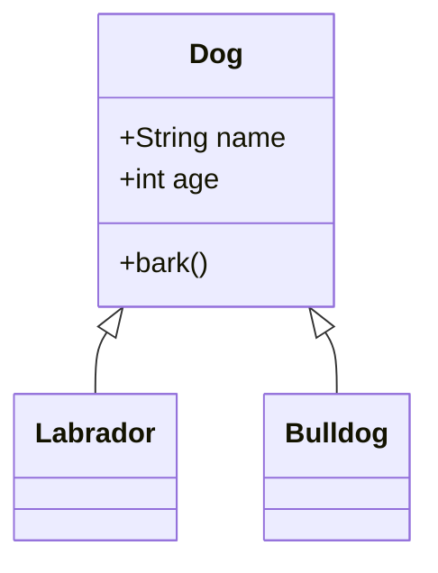

위의 다이어그램은 `Dog` 클래스를 상속받는 `Labrador`와 `Bulldog` 클래스를 보여준다. 이러한 구조는 OOP의 상속 개념을 잘 나타내며, 코드의 재사용성을 높이는 데 기여한다. OOP는 파이썬에서 강력한 도구로 자리 잡고 있으며, 다양한 소프트웨어 개발에 활용되고 있다.

<!--
## OOP의 핵심 개념 이해하기
   - 2.1 캡슐화 (Encapsulation)
   - 2.2 추상화 (Abstraction)
   - 2.3 상속 (Inheritance)
   - 2.4 다형성 (Polymorphism)
-->

## OOP의 핵심 개념 이해하기

객체지향 프로그래밍(OOP)은 소프트웨어 개발에서 매우 중요한 패러다임이다. OOP의 핵심 개념을 이해하는 것은 효과적인 프로그래밍을 위한 기초가 된다. 이번 섹션에서는 캡슐화, 추상화, 상속, 다형성의 네 가지 핵심 개념을 살펴보겠다.

### 캡슐화 (Encapsulation)

캡슐화는 객체의 상태(데이터)와 행동(메서드)을 하나의 단위로 묶는 개념이다. 이를 통해 객체의 내부 구현을 숨기고, 외부에서 직접 접근하지 못하도록 제한할 수 있다. 캡슐화는 데이터 보호와 코드의 유지보수성을 높이는 데 기여한다.

**예제 코드:**

```python
class BankAccount:
    def __init__(self, balance=0):
        self.__balance = balance  # private attribute

    def deposit(self, amount):
        if amount > 0:
            self.__balance += amount

    def withdraw(self, amount):
        if 0 < amount <= self.__balance:
            self.__balance -= amount

    def get_balance(self):
        return self.__balance
```

**다이어그램:**

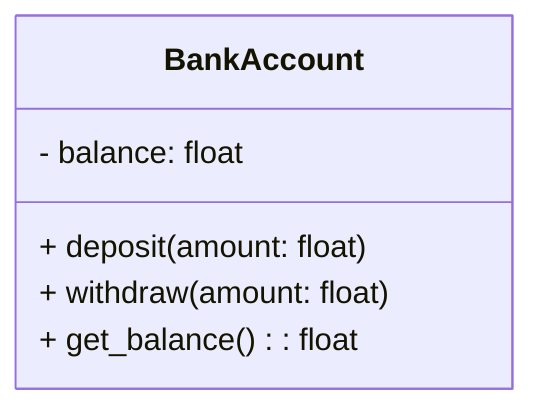

### 추상화 (Abstraction)

추상화는 복잡한 시스템에서 중요한 부분만을 강조하고 불필요한 세부사항을 숨기는 과정이다. 이를 통해 사용자는 객체의 기능을 쉽게 이해하고 사용할 수 있다. 추상화는 인터페이스와 추상 클래스를 통해 구현할 수 있다.

**예제 코드:**

```python
from abc import ABC, abstractmethod

class Shape(ABC):
    @abstractmethod
    def area(self):
        pass

class Circle(Shape):
    def __init__(self, radius):
        self.radius = radius

    def area(self):
        return 3.14 * self.radius ** 2
```

**다이어그램:**

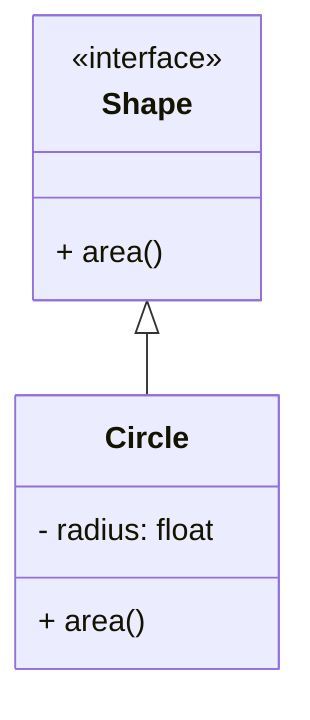

### 상속 (Inheritance)

상속은 기존 클래스의 속성과 메서드를 새로운 클래스가 물려받는 기능이다. 이를 통해 코드의 재사용성을 높이고, 계층 구조를 통해 객체 간의 관계를 명확히 할 수 있다.

**예제 코드:**

```python
class Animal:
    def speak(self):
        return "Animal speaks"

class Dog(Animal):
    def speak(self):
        return "Woof!"
```

**다이어그램:**

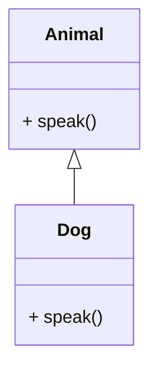

### 다형성 (Polymorphism)

다형성은 동일한 인터페이스를 통해 서로 다른 객체가 다르게 동작할 수 있는 능력이다. 이는 코드의 유연성을 높이고, 다양한 객체를 동일한 방식으로 처리할 수 있게 해준다.

**예제 코드:**

```python
def animal_sound(animal):
    print(animal.speak())

dog = Dog()
animal_sound(dog)  # Output: Woof!
```

**다이어그램:**

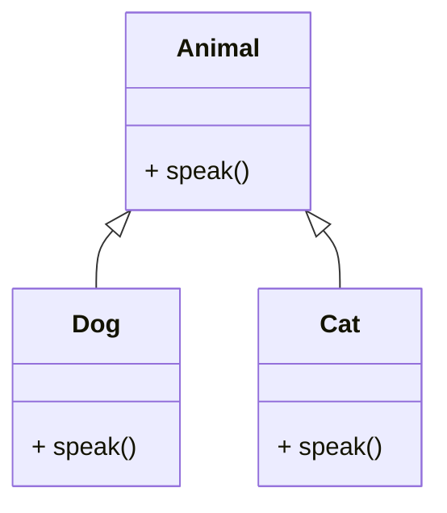

이와 같이 OOP의 핵심 개념인 캡슐화, 추상화, 상속, 다형성을 이해하면, 파이썬에서 객체지향 프로그래밍을 보다 효과적으로 활용할 수 있다. 각 개념은 서로 연결되어 있으며, 함께 사용될 때 강력한 프로그래밍 패러다임을 형성한다.

<!--
## 절차지향 프로그래밍 vs 객체지향 프로그래밍
   - 3.1 절차지향 프로그래밍의 개념
   - 3.2 객체지향 프로그래밍의 개념
   - 3.3 두 접근 방식의 비교
-->

## 절차지향 프로그래밍 vs 객체지향 프로그래밍

### 절차지향 프로그래밍의 개념

절차지향 프로그래밍(Procedural Programming)은 프로그램을 절차나 함수의 집합으로 구성하는 프로그래밍 패러다임이다. 이 접근 방식에서는 데이터와 그 데이터를 처리하는 함수를 분리하여, 프로그램의 흐름을 제어하는 데 중점을 둔다. 절차지향 프로그래밍의 주요 특징은 다음과 같다.

- **함수 중심**: 프로그램은 여러 개의 함수로 나뉘어 있으며, 각 함수는 특정 작업을 수행한다.
- **상태 변화**: 데이터는 전역 변수로 관리되며, 함수 호출을 통해 상태가 변경된다.
- **제어 구조**: 조건문과 반복문을 사용하여 프로그램의 흐름을 제어한다.

아래는 간단한 절차지향 프로그래밍의 예시 코드이다.

```python
def calculate_area(radius):
    return 3.14 * radius * radius

def main():
    radius = 5
    area = calculate_area(radius)
    print(f"Area of the circle: {area}")

if __name__ == "__main__":
    main()
```

### 객체지향 프로그래밍의 개념

객체지향 프로그래밍(Object-Oriented Programming, OOP)은 데이터를 객체로 묶고, 이 객체가 상호작용하는 방식으로 프로그램을 구성하는 프로그래밍 패러다임이다. OOP의 주요 특징은 다음과 같다.

- **객체 중심**: 데이터와 그 데이터를 처리하는 메서드가 하나의 객체로 묶인다.
- **캡슐화**: 객체 내부의 데이터는 외부에서 직접 접근할 수 없으며, 메서드를 통해서만 접근 가능하다.
- **상속과 다형성**: 기존 클래스를 기반으로 새로운 클래스를 생성할 수 있으며, 같은 메서드가 다양한 객체에서 다르게 동작할 수 있다.

아래는 간단한 객체지향 프로그래밍의 예시 코드이다.

```python
class Circle:
    def __init__(self, radius):
        self.radius = radius

    def calculate_area(self):
        return 3.14 * self.radius * self.radius

def main():
    circle = Circle(5)
    area = circle.calculate_area()
    print(f"Area of the circle: {area}")

if __name__ == "__main__":
    main()
```

### 두 접근 방식의 비교

절차지향 프로그래밍과 객체지향 프로그래밍은 각각의 장단점이 있으며, 특정 상황에 따라 적합한 접근 방식이 다를 수 있다. 아래는 두 접근 방식을 비교한 표이다.

| 특징                | 절차지향 프로그래밍 | 객체지향 프로그래밍 |
|-------------------|-------------------|-------------------|
| 데이터 관리        | 전역 변수 사용      | 객체로 캡슐화      |
| 코드 재사용성      | 낮음               | 높음               |
| 유지보수성         | 낮음               | 높음               |
| 프로그램 구조      | 함수 중심          | 객체 중심          |

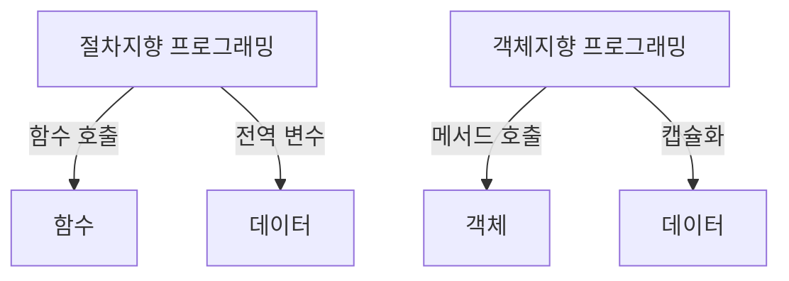

이와 같이 절차지향 프로그래밍과 객체지향 프로그래밍은 서로 다른 접근 방식을 가지고 있으며, 개발자는 상황에 맞는 방법을 선택하여 사용할 수 있다.

<!--
## 파이썬에서 클래스와 객체 정의하기
   - 4.1 클래스 정의하기
   - 4.2 객체 생성하기
   - 4.3 클래스와 인스턴스 속성
-->

## 파이썬에서 클래스와 객체 정의하기

파이썬에서 객체지향 프로그래밍을 활용하기 위해서는 클래스와 객체를 정의하는 것이 필수적이다. 이 섹션에서는 클래스 정의, 객체 생성, 그리고 클래스와 인스턴스 속성에 대해 알아보겠다.

### 클래스 정의하기

클래스는 객체를 생성하기 위한 청사진 또는 템플릿이다. 클래스는 속성과 메서드를 포함할 수 있으며, 이를 통해 객체의 상태와 행동을 정의한다. 파이썬에서 클래스를 정의하는 방법은 다음과 같다.

```python
class Dog:
    def __init__(self, name, age):
        self.name = name
        self.age = age

    def bark(self):
        return f"{self.name} says woof!"
```

위의 코드에서 `Dog`라는 클래스를 정의하였다. `__init__` 메서드는 생성자로, 객체가 생성될 때 호출되며, `name`과 `age`라는 두 개의 속성을 초기화한다. `bark` 메서드는 개가 짖는 행동을 정의한다.

### 객체 생성하기

클래스를 정의한 후에는 해당 클래스를 기반으로 객체를 생성할 수 있다. 객체는 클래스의 인스턴스이며, 클래스에서 정의한 속성과 메서드를 사용할 수 있다. 다음은 `Dog` 클래스의 객체를 생성하는 예시이다.

```python
my_dog = Dog("Buddy", 3)
print(my_dog.bark())  # 출력: Buddy says woof!
```

위의 코드에서 `my_dog`라는 객체를 생성하였고, `bark` 메서드를 호출하여 개가 짖는 소리를 출력하였다.

### 클래스와 인스턴스 속성

클래스 속성은 클래스에 속하는 속성으로, 모든 인스턴스가 공유한다. 반면, 인스턴스 속성은 각 객체에 고유한 속성이다. 다음은 클래스 속성과 인스턴스 속성을 정의하는 예시이다.

```python
class Dog:
    species = "Canis lupus familiaris"  # 클래스 속성

    def __init__(self, name, age):
        self.name = name  # 인스턴스 속성
        self.age = age    # 인스턴스 속성

# 객체 생성
my_dog = Dog("Buddy", 3)
print(my_dog.species)  # 출력: Canis lupus familiaris
print(my_dog.name)     # 출력: Buddy
```

위의 코드에서 `species`는 클래스 속성으로, 모든 `Dog` 객체가 공유한다. 반면, `name`과 `age`는 인스턴스 속성으로, 각 객체마다 다를 수 있다.

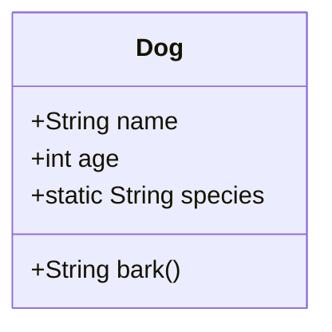

위의 다이어그램은 `Dog` 클래스의 구조를 나타낸다. 클래스 속성과 인스턴스 속성, 그리고 메서드를 시각적으로 표현하였다. 

이와 같이 파이썬에서 클래스와 객체를 정의하고 활용하는 방법을 이해하면, 객체지향 프로그래밍의 기초를 다질 수 있다.

<!--
## 재사용 가능한 클래스 설계 및 객체 생성
   - 5.1 실용적인 예: 은행 계좌 클래스 만들기
   - 5.2 메서드 정의 및 사용하기
-->

## 재사용 가능한 클래스 설계 및 객체 생성

객체지향 프로그래밍(OOP)의 가장 큰 장점 중 하나는 코드의 재사용성이다. 이를 통해 개발자는 이미 작성한 클래스를 기반으로 새로운 클래스를 쉽게 만들 수 있으며, 유지보수와 확장성 또한 용이해진다. 이번 섹션에서는 은행 계좌 클래스를 설계하고, 메서드를 정의하여 객체를 생성하는 방법에 대해 알아보겠다.

### 실용적인 예: 은행 계좌 클래스 만들기

은행 계좌 클래스를 설계하기 위해, 먼저 클래스의 속성과 메서드를 정의해야 한다. 은행 계좌는 계좌 번호, 계좌 소유자, 잔액 등의 속성을 가질 수 있으며, 입금(deposit)과 출금(withdraw) 메서드를 통해 잔액을 관리할 수 있다.

다음은 은행 계좌 클래스를 정의하는 샘플 코드이다.

```python
class BankAccount:
    def __init__(self, account_number, owner):
        self.account_number = account_number
        self.owner = owner
        self.balance = 0.0

    def deposit(self, amount):
        if amount > 0:
            self.balance += amount
            print(f"{amount}원이 입금되었습니다. 현재 잔액: {self.balance}원")
        else:
            print("입금할 금액은 0보다 커야 합니다.")

    def withdraw(self, amount):
        if 0 < amount <= self.balance:
            self.balance -= amount
            print(f"{amount}원이 출금되었습니다. 현재 잔액: {self.balance}원")
        else:
            print("출금할 금액이 유효하지 않거나 잔액이 부족합니다.")
```

위의 코드에서 `__init__` 메서드는 클래스의 생성자로, 계좌 번호와 소유자를 초기화하며 잔액을 0으로 설정한다. `deposit` 메서드는 입금 기능을, `withdraw` 메서드는 출금 기능을 수행한다.

이제 이 클래스를 사용하여 객체를 생성하고 메서드를 호출해보자.

```python
# 은행 계좌 객체 생성
my_account = BankAccount("123-456-789", "홍길동")

# 입금 및 출금 메서드 호출
my_account.deposit(10000)
my_account.withdraw(5000)
```

### 메서드 정의 및 사용하기

위에서 정의한 메서드를 통해 은행 계좌의 잔액을 관리할 수 있다. 메서드를 정의할 때는 각 메서드가 수행해야 할 작업을 명확히 하고, 필요한 매개변수를 설정하는 것이 중요하다. 

다음은 메서드 사용에 대한 다이어그램이다.

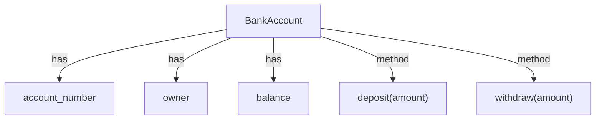

이 다이어그램은 `BankAccount` 클래스가 `account_number`, `owner`, `balance` 속성을 가지며, `deposit`과 `withdraw` 메서드를 통해 잔액을 관리하는 구조를 보여준다.

이와 같이 재사용 가능한 클래스를 설계하고 메서드를 정의함으로써, 코드의 재사용성과 유지보수성을 높일 수 있다. OOP의 원칙을 잘 활용하면, 복잡한 시스템도 효율적으로 관리할 수 있는 기반을 마련할 수 있다.

<!--
## 파이썬에서의 상속과 다형성
   - 6.1 상속의 개념
   - 6.2 다형성의 개념
   - 6.3 상속과 다형성의 예제
-->

## 파이썬에서의 상속과 다형성

상속과 다형성은 객체지향 프로그래밍(OOP)의 핵심 개념으로, 코드의 재사용성과 유연성을 높이는 데 중요한 역할을 한다. 이 섹션에서는 상속과 다형성의 개념을 살펴보고, 이를 파이썬에서 어떻게 활용할 수 있는지에 대해 설명하겠다.

### 상속의 개념

상속(Inheritance)은 기존 클래스(부모 클래스 또는 슈퍼 클래스)의 속성과 메서드를 새로운 클래스(자식 클래스 또는 서브 클래스)가 물려받는 기능이다. 이를 통해 코드의 중복을 줄이고, 기존 코드를 기반으로 새로운 기능을 추가할 수 있다. 파이썬에서는 클래스 정의 시 괄호 안에 부모 클래스를 명시함으로써 상속을 구현할 수 있다.

**예시 코드:**

```python
class Animal:
    def speak(self):
        return "Animal speaks"

class Dog(Animal):
    def speak(self):
        return "Woof!"

class Cat(Animal):
    def speak(self):
        return "Meow!"
```

위의 코드에서 `Dog`와 `Cat` 클래스는 `Animal` 클래스를 상속받아 각각의 `speak` 메서드를 오버라이드하고 있다. 이를 통해 각 동물의 고유한 소리를 정의할 수 있다.

### 다형성의 개념

다형성(Polymorphism)은 동일한 인터페이스를 통해 서로 다른 객체가 다르게 동작할 수 있는 능력을 의미한다. 즉, 같은 메서드 호출이지만 객체의 종류에 따라 다른 결과를 반환할 수 있다. 이는 코드의 유연성을 높이고, 다양한 객체를 동일한 방식으로 처리할 수 있게 해준다.

**예시 코드:**

```python
def animal_sound(animal):
    print(animal.speak())

dog = Dog()
cat = Cat()

animal_sound(dog)  # 출력: Woof!
animal_sound(cat)  # 출력: Meow!
```

위의 코드에서 `animal_sound` 함수는 `Animal` 클래스의 인스턴스를 매개변수로 받아 `speak` 메서드를 호출한다. `dog`와 `cat` 객체는 서로 다른 클래스를 기반으로 하지만, 동일한 메서드 호출을 통해 각기 다른 소리를 출력한다.

### 상속과 다형성의 예제

상속과 다형성을 함께 활용하여 더 복잡한 구조를 만들 수 있다. 예를 들어, 여러 종류의 동물 클래스를 만들고, 이들을 관리하는 `Zoo` 클래스를 정의할 수 있다.

**예시 코드:**

```python
class Zoo:
    def __init__(self):
        self.animals = []

    def add_animal(self, animal):
        self.animals.append(animal)

    def make_sounds(self):
        for animal in self.animals:
            print(animal.speak())

zoo = Zoo()
zoo.add_animal(Dog())
zoo.add_animal(Cat())
zoo.make_sounds()
```

위의 코드에서 `Zoo` 클래스는 여러 동물 객체를 관리하고, `make_sounds` 메서드를 통해 모든 동물의 소리를 출력한다. 이처럼 상속과 다형성을 활용하면 코드의 구조를 더욱 명확하고 유연하게 만들 수 있다.

**다이어그램:**

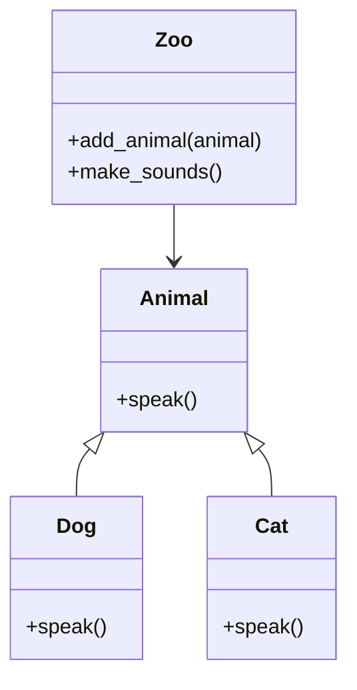

위의 다이어그램은 `Animal`, `Dog`, `Cat`, `Zoo` 클래스 간의 관계를 나타낸다. `Dog`와 `Cat` 클래스는 `Animal` 클래스를 상속받고, `Zoo` 클래스는 여러 동물 객체를 관리하는 구조를 보여준다. 상속과 다형성을 통해 객체지향 프로그래밍의 장점을 극대화할 수 있다.

<!--
## 파이썬에서 예외 처리
   - 7.1 예외 처리의 필요성
   - 7.2 try-except 블록 사용하기
-->

## 파이썬에서 예외 처리

### 예외 처리의 필요성

예외 처리(Exception Handling)는 프로그램 실행 중 발생할 수 있는 오류를 관리하는 중요한 기법이다. 프로그램이 실행되는 동안 예기치 않은 상황이 발생할 수 있으며, 이러한 상황을 적절히 처리하지 않으면 프로그램이 비정상적으로 종료되거나 잘못된 결과를 초래할 수 있다. 예를 들어, 파일을 열거나 네트워크 요청을 수행할 때, 해당 리소스가 존재하지 않거나 접근할 수 없는 경우가 발생할 수 있다. 이러한 오류를 처리하지 않으면 프로그램이 중단되므로, 예외 처리는 안정적인 소프트웨어 개발에 필수적이다.

예외 처리를 통해 다음과 같은 이점을 얻을 수 있다:

- 프로그램의 안정성 향상: 오류 발생 시 프로그램이 중단되지 않고, 사용자에게 적절한 메시지를 제공할 수 있다.
- 디버깅 용이성: 오류 발생 시 어떤 문제가 있었는지 쉽게 추적할 수 있다.
- 코드 가독성 향상: 예외 처리를 통해 코드의 흐름을 명확하게 유지할 수 있다.

### try-except 블록 사용하기

파이썬에서 예외 처리를 구현하는 가장 일반적인 방법은 `try-except` 블록을 사용하는 것이다. `try` 블록 내에 실행할 코드를 작성하고, `except` 블록 내에 예외가 발생했을 때 실행할 코드를 작성한다. 다음은 `try-except` 블록의 기본적인 사용 예시이다.

```python
try:
    # 사용자로부터 숫자 입력 받기
    number = int(input("숫자를 입력하세요: "))
    result = 10 / number
    print(f"결과: {result}")
except ValueError:
    print("유효하지 않은 입력입니다. 숫자를 입력하세요.")
except ZeroDivisionError:
    print("0으로 나눌 수 없습니다.")
except Exception as e:
    print(f"예외 발생: {e}")
```

위의 코드에서 사용자는 숫자를 입력해야 하며, 입력값이 숫자가 아닐 경우 `ValueError`가 발생한다. 또한, 사용자가 0을 입력할 경우 `ZeroDivisionError`가 발생한다. 마지막으로, 모든 예외를 포괄하는 `Exception`을 사용하여 예상치 못한 오류를 처리할 수 있다.

다음은 `try-except` 블록의 흐름을 나타내는 다이어그램이다.

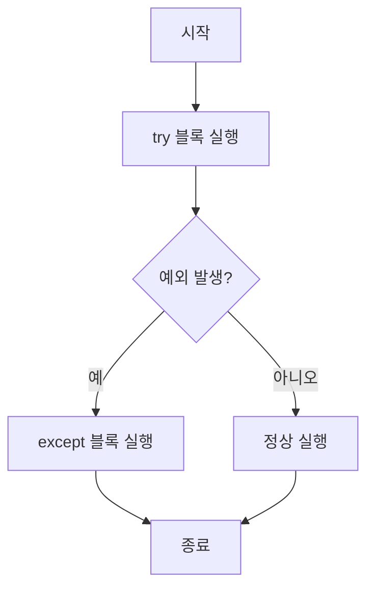

이와 같이 `try-except` 블록을 사용하면 프로그램의 오류를 효과적으로 관리할 수 있으며, 사용자에게 친절한 오류 메시지를 제공할 수 있다. 예외 처리는 파이썬 프로그래밍에서 필수적인 요소로, 안정적이고 신뢰할 수 있는 소프트웨어를 개발하는 데 기여한다.

<!--
## OOP의 원칙과 모범 사례
   - 8.1 좋은 클래스 설계 원칙
   - 8.2 코드 재사용성 및 유지보수성 향상
-->

## OOP의 원칙과 모범 사례

객체지향 프로그래밍(OOP)은 소프트웨어 개발에서 코드의 재사용성과 유지보수성을 높이는 데 중요한 역할을 한다. 이 섹션에서는 좋은 클래스 설계 원칙과 코드 재사용성 및 유지보수성 향상에 대해 다룰 것이다.

### 좋은 클래스 설계 원칙

좋은 클래스 설계는 소프트웨어의 품질을 높이고, 유지보수를 용이하게 하며, 코드의 가독성을 향상시킨다. 다음은 좋은 클래스 설계의 몇 가지 원칙이다.

**단일 책임 원칙 (Single Responsibility Principle)**

각 클래스는 하나의 책임만 가져야 하며, 그 책임을 완벽하게 수행해야 한다. 이를 통해 클래스의 변경이 다른 클래스에 미치는 영향을 최소화할 수 있다.

**개방-폐쇄 원칙 (Open/Closed Principle)**

클래스는 확장에는 열려 있어야 하지만, 수정에는 닫혀 있어야 한다. 즉, 기존 코드를 변경하지 않고도 새로운 기능을 추가할 수 있어야 한다.

**리스코프 치환 원칙 (Liskov Substitution Principle)**

서브타입은 언제나 자신의 기반 타입으로 교체할 수 있어야 한다. 이는 상속을 사용할 때 중요한 원칙으로, 서브클래스가 기반 클래스의 기능을 완전히 대체할 수 있어야 한다.

**인터페이스 분리 원칙 (Interface Segregation Principle)**

클라이언트는 자신이 사용하지 않는 메서드에 의존하지 않아야 한다. 즉, 인터페이스는 클라이언트의 필요에 맞게 작게 나누어져야 한다.

**의존성 역전 원칙 (Dependency Inversion Principle)**

고수준 모듈은 저수준 모듈에 의존해서는 안 되며, 둘 다 추상화에 의존해야 한다. 이는 코드의 유연성을 높이고, 테스트를 용이하게 한다.

### 코드 재사용성 및 유지보수성 향상

OOP의 가장 큰 장점 중 하나는 코드의 재사용성을 높일 수 있다는 점이다. 이를 위해 다음과 같은 방법을 사용할 수 있다.

**상속 (Inheritance)**

상속을 통해 기존 클래스를 기반으로 새로운 클래스를 만들 수 있다. 이를 통해 코드의 중복을 줄이고, 공통 기능을 재사용할 수 있다.

```python
class Animal:
    def speak(self):
        return "Animal speaks"

class Dog(Animal):
    def speak(self):
        return "Bark"

class Cat(Animal):
    def speak(self):
        return "Meow"

# 사용 예
dog = Dog()
cat = Cat()
print(dog.speak())  # Bark
print(cat.speak())  # Meow
```

**컴포지션 (Composition)**

컴포지션은 객체를 다른 객체의 속성으로 포함시켜 새로운 기능을 만드는 방법이다. 이를 통해 클래스 간의 결합도를 낮추고, 유연성을 높일 수 있다.

```python
class Engine:
    def start(self):
        return "Engine starts"

class Car:
    def __init__(self):
        self.engine = Engine()

    def start(self):
        return self.engine.start() + " and Car starts"

# 사용 예
car = Car()
print(car.start())  # Engine starts and Car starts
```

**다형성 (Polymorphism)**

다형성을 활용하면 서로 다른 클래스의 객체를 동일한 방식으로 처리할 수 있다. 이는 코드의 유연성을 높이고, 유지보수를 용이하게 한다.

```python
def animal_sound(animal):
    print(animal.speak())

animal_sound(dog)  # Bark
animal_sound(cat)  # Meow
```

이러한 원칙과 모범 사례를 따르면, OOP를 활용한 소프트웨어 개발에서 코드의 재사용성과 유지보수성을 높일 수 있다. 

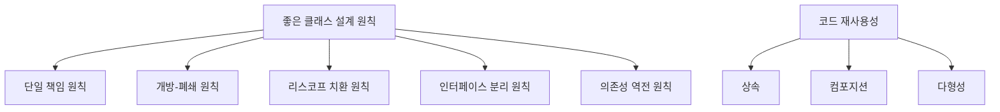

이와 같은 원칙을 준수하면, OOP의 장점을 극대화할 수 있으며, 소프트웨어의 품질을 높일 수 있다.

<!--
## OOP의 실제 적용 사례
   - 9.1 물류 회사의 배달 차량 관리 시스템
   - 9.2 다양한 객체 모델링 예제
-->

## OOP의 실제 적용 사례

OOP(Object-Oriented Programming)는 다양한 분야에서 실제로 활용되고 있으며, 그 중 물류 회사의 배달 차량 관리 시스템과 다양한 객체 모델링 예제를 통해 OOP의 장점을 살펴보겠다.

### 물류 회사의 배달 차량 관리 시스템

물류 회사에서는 여러 대의 배달 차량을 효율적으로 관리해야 한다. 이를 위해 OOP를 활용하여 차량, 운전사, 배달 주문 등을 객체로 모델링할 수 있다. 각 객체는 속성과 메서드를 가지며, 이들 간의 관계를 통해 시스템을 구성할 수 있다.

**클래스 정의 예시:**

```python
class Vehicle:
    def __init__(self, vehicle_id, driver):
        self.vehicle_id = vehicle_id
        self.driver = driver
        self.deliveries = []

    def add_delivery(self, delivery):
        self.deliveries.append(delivery)

class Driver:
    def __init__(self, name):
        self.name = name

class Delivery:
    def __init__(self, delivery_id, destination):
        self.delivery_id = delivery_id
        self.destination = destination
```

위의 코드에서 `Vehicle`, `Driver`, `Delivery` 클래스를 정의하였다. 각 클래스는 해당 객체의 속성을 초기화하고, 필요한 메서드를 통해 기능을 수행할 수 있다.

**다이어그램:**

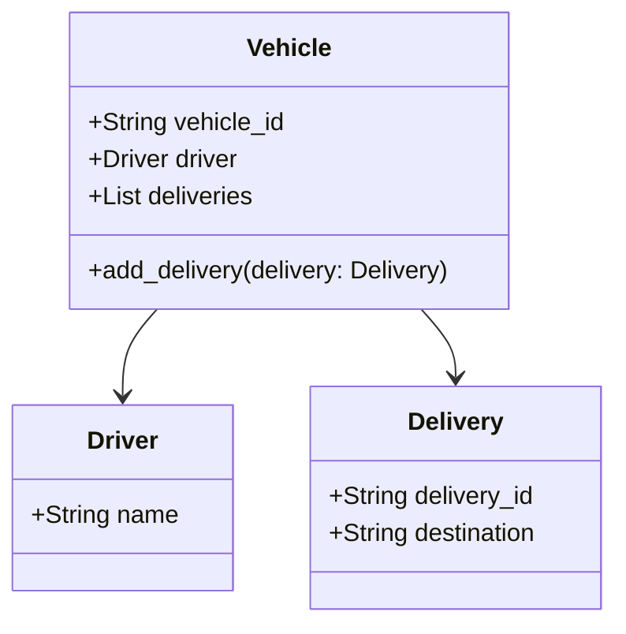

위의 다이어그램은 `Vehicle`, `Driver`, `Delivery` 클래스 간의 관계를 나타낸다. `Vehicle` 클래스는 `Driver`와 `Delivery` 객체를 포함하고 있으며, 이를 통해 배달 차량 관리 시스템의 구조를 시각적으로 이해할 수 있다.

### 다양한 객체 모델링 예제

OOP는 다양한 객체 모델링을 통해 복잡한 시스템을 단순화할 수 있다. 예를 들어, 게임 개발에서 캐릭터, 아이템, 적 등을 객체로 모델링할 수 있다. 각 객체는 고유한 속성과 행동을 가지며, 이를 통해 게임의 다양한 요소를 효과적으로 관리할 수 있다.

**게임 캐릭터 클래스 예시:**

```python
class Character:
    def __init__(self, name, health):
        self.name = name
        self.health = health

    def attack(self, target):
        print(f"{self.name} attacks {target.name}")

class Item:
    def __init__(self, item_name):
        self.item_name = item_name

class Enemy(Character):
    def __init__(self, name, health, damage):
        super().__init__(name, health)
        self.damage = damage

    def attack(self, target):
        target.health -= self.damage
        print(f"{self.name} attacks {target.name} for {self.damage} damage")
```

위의 코드에서 `Character`, `Item`, `Enemy` 클래스를 정의하였다. `Enemy` 클래스는 `Character` 클래스를 상속받아 공격 메서드를 오버라이드하여 적의 특성을 구현하였다.

**다이어그램:**

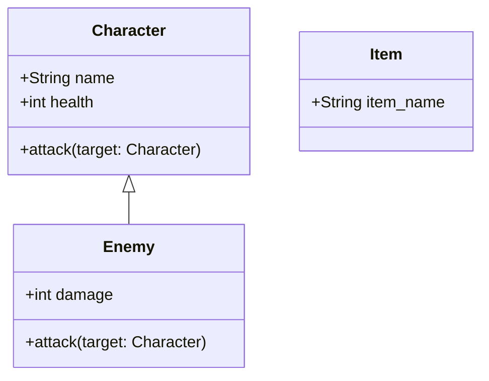

위의 다이어그램은 `Character`와 `Enemy` 클래스 간의 상속 관계를 나타낸다. `Enemy` 클래스는 `Character` 클래스를 상속받아 추가적인 속성과 메서드를 정의하고 있다.

이와 같이 OOP는 다양한 분야에서 객체 모델링을 통해 시스템을 효율적으로 관리하고, 코드의 재사용성을 높이며, 유지보수성을 향상시키는 데 기여한다.

<!--
## FAQ
   - 10.1 OOP의 4대 원칙은 무엇인가요?
   - 10.2 파이썬에서 OOP는 어떻게 사용되나요?
   - 10.3 파이썬은 100% 객체지향 언어인가요?
   - 10.4 `__init__` 메서드는 무엇인가요?
   - 10.5 `super()`는 무엇인가요?
   - 10.6 `self`는 왜 사용되나요?
-->

## FAQ

### OOP의 4대 원칙은 무엇인가요?
객체지향 프로그래밍(OOP)의 4대 원칙은 캡슐화(Encapsulation), 추상화(Abstraction), 상속(Inheritance), 다형성(Polymorphism)이다. 이 원칙들은 OOP의 기본 개념을 형성하며, 소프트웨어 개발에서 코드의 재사용성과 유지보수성을 높이는 데 기여한다.

### 파이썬에서 OOP는 어떻게 사용되나요?
파이썬에서 OOP는 클래스를 정의하고, 그 클래스를 기반으로 객체를 생성하는 방식으로 사용된다. 클래스는 객체의 속성과 메서드를 정의하는 청사진 역할을 하며, 객체는 클래스의 인스턴스이다. 다음은 파이썬에서 클래스를 정의하고 객체를 생성하는 간단한 예제이다.

```python
class Dog:
    def __init__(self, name):
        self.name = name

    def bark(self):
        return f"{self.name} says Woof!"

# 객체 생성
my_dog = Dog("Buddy")
print(my_dog.bark())  # 출력: Buddy says Woof!
```

### 파이썬은 100% 객체지향 언어인가요?
파이썬은 객체지향 언어이지만, 100% 객체지향 언어라고 보기는 어렵다. 파이썬은 절차지향 프로그래밍(Procedural Programming)도 지원하며, 함수와 변수를 객체로 다룰 수 있는 유연성을 제공한다. 따라서 파이썬은 다양한 프로그래밍 패러다임을 혼합하여 사용할 수 있는 언어이다.

### `__init__` 메서드는 무엇인가요?
`__init__` 메서드는 파이썬 클래스의 생성자(Constructor)로, 객체가 생성될 때 자동으로 호출된다. 이 메서드는 객체의 초기 상태를 설정하는 데 사용되며, 인스턴스 속성을 정의하는 데 중요한 역할을 한다. 다음은 `__init__` 메서드의 사용 예이다.

```python
class Car:
    def __init__(self, model, year):
        self.model = model
        self.year = year

my_car = Car("Toyota", 2020)
print(my_car.model)  # 출력: Toyota
```

### `super()`는 무엇인가요?
`super()`는 부모 클래스의 메서드나 속성에 접근할 수 있도록 도와주는 내장 함수이다. 주로 상속 관계에서 자식 클래스가 부모 클래스의 메서드를 호출할 때 사용된다. 다음은 `super()`의 사용 예이다.

```python
class Animal:
    def speak(self):
        return "Animal speaks"

class Dog(Animal):
    def speak(self):
        return super().speak() + " Woof!"

my_dog = Dog()
print(my_dog.speak())  # 출력: Animal speaks Woof!
```

### `self`는 왜 사용되나요?
`self`는 클래스의 인스턴스를 참조하는 매개변수로, 인스턴스 메서드에서 객체의 속성과 메서드에 접근할 수 있도록 해준다. `self`를 사용함으로써 각 객체가 고유한 상태를 유지할 수 있으며, 메서드가 호출될 때 해당 객체의 속성에 접근할 수 있다. 다음은 `self`의 사용 예이다.

```python
class Person:
    def __init__(self, name):
        self.name = name

    def greet(self):
        return f"Hello, my name is {self.name}"

person = Person("Alice")
print(person.greet())  # 출력: Hello, my name is Alice
```

이와 같이 OOP의 다양한 개념과 파이썬에서의 활용 방법을 이해하면, 객체지향 프로그래밍을 보다 효과적으로 사용할 수 있다.

<!--
## 관련 기술
   - 11.1 다른 프로그래밍 언어에서의 OOP
   - 11.2 OOP와 디자인 패턴
   - 11.3 OOP와 소프트웨어 개발 방법론
-->

## 관련 기술

### 다른 프로그래밍 언어에서의 OOP

객체지향 프로그래밍(OOP)은 다양한 프로그래밍 언어에서 널리 사용되고 있다. Java, C++, C#, Ruby 등 여러 언어가 OOP의 개념을 지원하며, 각 언어마다 OOP의 구현 방식이 다소 차이가 있다. 예를 들어, Java는 강력한 타입 시스템을 가지고 있어 클래스와 객체의 정의가 명확하게 이루어지며, C++는 다중 상속을 지원하여 더 복잡한 객체 모델링이 가능하다. 반면, Python은 동적 타이핑을 지원하여 더 유연한 객체지향 프로그래밍이 가능하다.

```python
# Python에서의 클래스 정의 예시
class Animal:
    def __init__(self, name):
        self.name = name

    def speak(self):
        return "I am an animal."

class Dog(Animal):
    def speak(self):
        return "Woof! My name is " + self.name

dog = Dog("Buddy")
print(dog.speak())  # 출력: Woof! My name is Buddy
```

### OOP와 디자인 패턴

디자인 패턴은 소프트웨어 설계에서 자주 발생하는 문제를 해결하기 위한 일반적인 솔루션이다. OOP는 이러한 디자인 패턴을 구현하는 데 매우 유용하다. 예를 들어, Singleton 패턴은 클래스의 인스턴스가 오직 하나만 존재하도록 보장하는 패턴으로, OOP의 캡슐화와 상속 개념을 활용하여 쉽게 구현할 수 있다.

```python
class Singleton:
    _instance = None

    def __new__(cls, *args, **kwargs):
        if not cls._instance:
            cls._instance = super(Singleton, cls).__new__(cls)
        return cls._instance

singleton1 = Singleton()
singleton2 = Singleton()

print(singleton1 is singleton2)  # 출력: True
```

**Mermaid 다이어그램 예시:**

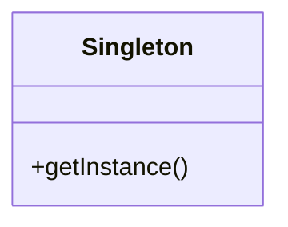

### OOP와 소프트웨어 개발 방법론

OOP는 애자일(Agile)과 같은 현대 소프트웨어 개발 방법론과 잘 어울린다. OOP의 원칙은 코드의 재사용성과 유지보수성을 높여주며, 이는 애자일 개발에서 요구하는 빠른 피드백과 반복적인 개발 주기에 적합하다. 또한, OOP는 팀원 간의 협업을 용이하게 하여, 각 팀원이 독립적으로 클래스를 개발하고 통합할 수 있도록 한다.

OOP의 원칙을 잘 따르는 소프트웨어 개발은 코드의 품질을 높이고, 프로젝트의 성공 가능성을 높이는 데 기여한다. 이러한 이유로 OOP는 현대 소프트웨어 개발에서 중요한 역할을 하고 있다.

<!--
## 결론
   - OOP의 중요성 요약
   - 파이썬에서 OOP를 활용한 프로그래밍의 미래
-->

## 결론

**OOP의 중요성 요약**

객체지향 프로그래밍(Object-Oriented Programming, OOP)은 소프트웨어 개발에서 매우 중요한 개념이다. OOP는 코드의 재사용성을 높이고, 유지보수를 용이하게 하며, 복잡한 시스템을 보다 쉽게 관리할 수 있도록 돕는다. OOP의 핵심 원칙인 캡슐화(Encapsulation), 추상화(Abstraction), 상속(Inheritance), 다형성(Polymorphism)은 개발자가 더 나은 소프트웨어를 설계하고 구현하는 데 필수적인 요소이다. 이러한 원칙들은 코드의 구조를 명확하게 하고, 협업을 통해 개발하는 과정에서 발생할 수 있는 문제를 최소화하는 데 기여한다.

**파이썬에서 OOP를 활용한 프로그래밍의 미래**

파이썬은 OOP를 지원하는 강력한 프로그래밍 언어로, 다양한 분야에서 널리 사용되고 있다. 데이터 과학, 웹 개발, 인공지능 등 여러 분야에서 OOP의 개념을 활용하여 복잡한 문제를 해결하는 데 기여하고 있다. 앞으로도 OOP는 소프트웨어 개발의 중요한 패러다임으로 자리 잡을 것이며, 파이썬의 발전과 함께 더욱 다양한 기능과 라이브러리가 추가될 것으로 기대된다.

다음은 파이썬에서 OOP를 활용한 간단한 예제 코드이다.

```python
class Animal:
    def __init__(self, name):
        self.name = name

    def speak(self):
        raise NotImplementedError("Subclass must implement abstract method")

class Dog(Animal):
    def speak(self):
        return f"{self.name} says Woof!"

class Cat(Animal):
    def speak(self):
        return f"{self.name} says Meow!"

# 객체 생성
dog = Dog("Buddy")
cat = Cat("Whiskers")

print(dog.speak())  # 출력: Buddy says Woof!
print(cat.speak())  # 출력: Whiskers says Meow!
```

위의 코드에서 `Animal` 클래스는 기본 클래스이며, `Dog`와 `Cat` 클래스는 이를 상속받아 각각의 `speak` 메서드를 구현하고 있다. 이러한 구조는 OOP의 상속과 다형성을 잘 보여준다.

다음은 OOP의 개념을 시각적으로 표현한 다이어그램이다.

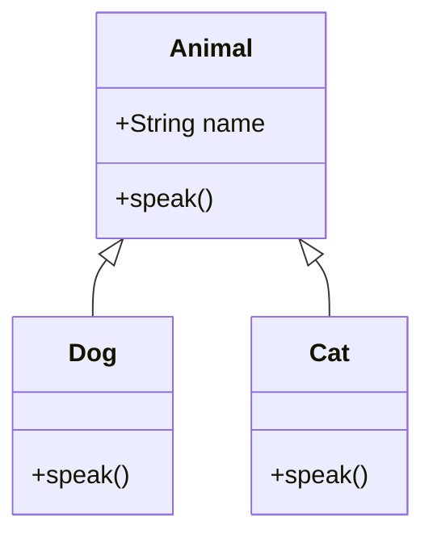

이 다이어그램은 `Animal` 클래스가 `Dog`와 `Cat` 클래스의 부모 클래스임을 나타내며, 각 클래스가 `speak` 메서드를 구현하고 있음을 보여준다. OOP의 이러한 구조는 코드의 재사용성과 확장성을 높이는 데 큰 도움이 된다.

<!--
##### Reference #####
-->

## Reference


* [https://medium.com/@yaduvanshineelam09/object-oriented-programming-oop-in-python-a-guide-for-beginners-a2f410eafa4e](https://medium.com/@yaduvanshineelam09/object-oriented-programming-oop-in-python-a-guide-for-beginners-a2f410eafa4e)
* [https://realpython.com/python3-object-oriented-programming/](https://realpython.com/python3-object-oriented-programming/)
* [https://velog.io/@dlskawns/Python-OOP-%EA%B0%9C%EB%85%90-%EB%B0%8F-Class-%EC%A0%95%EB%A6%AC-%EB%B0%8F-%EC%8B%A4%EC%8A%B5](https://velog.io/@dlskawns/Python-OOP-%EA%B0%9C%EB%85%90-%EB%B0%8F-Class-%EC%A0%95%EB%A6%AC-%EB%B0%8F-%EC%8B%A4%EC%8A%B5)
* [https://www.geeksforgeeks.org/python-oops-concepts/](https://www.geeksforgeeks.org/python-oops-concepts/)
* [https://www.freecodecamp.org/news/how-to-use-oop-in-python/](https://www.freecodecamp.org/news/how-to-use-oop-in-python/)

