RCU(읽기, 복사, 업데이트)는 리눅스 커널에 추가된 동기화 메커니즘으로, 주로 읽기 작업이 많은 상황에서 최적화되어 있다. RCU는 기본적으로 업데이트를 "제거"와 "회수" 단계로 나누는 개념이다. 제거 단계에서는 데이터 구조 내의 데이터 항목에 대한 참조를 제거하거나 새로운 버전으로 교체하며, 이 과정은 독립적으로 실행되는 독자들과 동시에 진행될 수 있다. 현대 CPU의 의미론은 독자들이 부분적으로 업데이트된 참조가 아닌 이전 또는 새로운 버전의 데이터 구조를 보게 보장하기 때문에, 제거 단계가 독자와 동시에 실행되는 것이 안전하다. 회수 단계는 제거 단계에서 제거된 데이터 항목을 회수(예: 메모리 해제)하는 작업을 수행하며, 이 단계는 독자들이 더 이상 해당 데이터 항목에 대한 참조를 보유하지 않을 때까지 시작할 수 없다. 이러한 업데이트의 분리는 업데이트를 즉시 수행할 수 있게 하며, 회수 단계는 모든 독자가 완료될 때까지 지연될 수 있다. RCU는 경량 동기화를 가능하게 하여, 전통적인 잠금 기반 방식보다 더 효율적인 성능을 제공한다. RCU의 핵심 API는 rcu_read_lock(), rcu_read_unlock(), synchronize_rcu(), call_rcu(), rcu_assign_pointer(), rcu_dereference() 등으로 구성되어 있으며, 이들 API를 통해 독자, 업데이트, 회수 간의 상호작용을 관리한다. RCU는 다양한 사용 사례에 적합하며, 특히 읽기 작업이 많은 데이터 구조를 보호하는 데 유용하다.

<!--
##### Outline #####
-->

<!--
# RCU (Read-Copy-Update) 기술 블로그 목차

## 1. 개요
   - RCU의 정의 및 중요성
   - RCU의 역사와 발전
   - RCU의 사용 사례

## 2. RCU의 기본 개념
   - RCU의 작동 원리
   - 데이터 구조에서의 RCU의 역할
   - RCU의 장점과 단점

## 3. RCU의 핵심 API
   - rcu_read_lock()
   - rcu_read_unlock()
   - synchronize_rcu()
   - call_rcu()
   - rcu_assign_pointer()
   - rcu_dereference()
   - RCU API의 사용 예시

## 4. RCU의 활용 예제
   - RCU를 사용한 동적 구조체 업데이트
   - RCU를 사용한 링크드 리스트 보호
   - RCU를 사용한 NMI 핸들러 보호

## 5. 업데이트 스레드가 블록할 수 없는 경우
   - call_rcu()의 사용
   - 비동기 콜백 메커니즘
   - kfree_rcu()의 활용

## 6. RCU의 간단한 구현 예시
   - "장난감" RCU 구현 1: 락 기반
   - "장난감" RCU 구현 2: 고전적인 RCU
   - 실제 RCU 구현과의 비교

## 7. RCU와 Reader-Writer Lock의 유사성
   - Reader-Writer Lock과 RCU의 비교
   - RCU의 동시성 처리 방식
   - RCU의 성능 최적화

## 8. RCU와 Reference Counting의 유사성
   - Reference Counting의 개념
   - RCU가 Reference Counting을 어떻게 보완하는지
   - RCU를 통한 안전한 데이터 접근

## 9. RCU API의 전체 목록
   - RCU 리스트 탐색 API
   - RCU 포인터/리스트 업데이트 API
   - RCU 관련 API 카테고리

## 10. RCU 사용 시 고려사항
   - RCU를 사용할 때의 주의사항
   - RCU의 성능 최적화 방법
   - RCU의 적절한 사용 사례

## 11. FAQ
   - RCU와 다른 동기화 메커니즘의 차이점은 무엇인가요?
   - RCU를 사용할 때의 일반적인 실수는 무엇인가요?
   - RCU의 성능을 어떻게 측정하나요?

## 12. 관련 기술
   - Lock-Free 데이터 구조
   - Concurrent Programming
   - Linux Kernel의 동기화 메커니즘

## 13. 결론
   - RCU의 중요성과 미래
   - RCU의 발전 방향
   - RCU를 통한 성능 향상 가능성

## 14. 참고 자료
   - RCU 관련 논문 및 자료
   - RCU에 대한 추가 학습 자료
   - RCU 관련 커뮤니티 및 포럼

이 목차는 RCU에 대한 포괄적인 이해를 돕기 위해 구성되었으며, 각 섹션은 RCU의 다양한 측면을 다루고 있습니다.
-->

<!--
## 1. 개요
   - RCU의 정의 및 중요성
   - RCU의 역사와 발전
   - RCU의 사용 사례
-->

## 개요

### RCU의 정의 및 중요성

RCU(Read-Copy-Update)는 동시성 제어를 위한 프로그래밍 패러다임으로, 주로 멀티스레드 환경에서 데이터 구조의 안전한 읽기 및 업데이트를 가능하게 한다. RCU는 읽기 작업이 빈번하고 업데이트 작업이 드문 경우에 특히 유용하다. 이 기술은 읽기 작업이 진행되는 동안 데이터 구조를 안전하게 업데이트할 수 있도록 하여, 성능을 극대화하고 잠금(lock)으로 인한 오버헤드를 줄이는 데 기여한다.

### RCU의 역사와 발전

RCU는 2001년 리눅스 커널에서 처음 도입되었으며, 그 이후로 다양한 분야에서 활용되고 있다. 초기에는 리눅스 커널의 동기화 메커니즘으로 사용되었으나, 점차 다른 시스템 및 프로그래밍 언어에서도 채택되기 시작했다. RCU는 동시성 문제를 해결하기 위한 혁신적인 접근 방식으로 자리 잡았으며, 현재는 고성능 시스템에서 필수적인 기술로 인식되고 있다.

### RCU의 사용 사례

RCU는 다양한 분야에서 활용되고 있으며, 그 중 몇 가지 주요 사용 사례는 다음과 같다:

- **리눅스 커널**: RCU는 리눅스 커널의 데이터 구조에서 동시성을 관리하는 데 사용된다. 예를 들어, 프로세스 목록이나 파일 시스템의 inode 캐시와 같은 데이터 구조에서 RCU가 활용된다.
  
- **데이터베이스 시스템**: RCU는 데이터베이스의 읽기 작업을 최적화하는 데 사용될 수 있다. 특히, 읽기 작업이 많은 OLTP(Online Transaction Processing) 시스템에서 RCU를 통해 성능을 향상시킬 수 있다.

- **네트워크 프로토콜**: RCU는 네트워크 스택에서 패킷 처리와 같은 고속 작업을 수행할 때 유용하다. 패킷을 처리하는 동안 데이터 구조를 안전하게 업데이트할 수 있다.

다음은 RCU의 작동 방식을 간단히 설명하는 다이어그램이다:

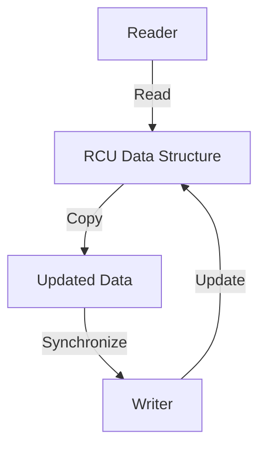

이 다이어그램은 RCU의 기본 작동 원리를 보여준다. Reader가 데이터 구조를 읽는 동안 Writer는 안전하게 업데이트를 수행할 수 있으며, 이 과정에서 데이터의 일관성을 유지할 수 있다. RCU는 이러한 방식으로 동시성을 관리하여 성능을 극대화하는 데 기여한다.

<!--
## 2. RCU의 기본 개념
   - RCU의 작동 원리
   - 데이터 구조에서의 RCU의 역할
   - RCU의 장점과 단점
-->

## RCU의 기본 개념

### RCU의 작동 원리

RCU(Read-Copy-Update)는 동시성 제어를 위한 메커니즘으로, 주로 읽기 작업이 많은 환경에서 성능을 극대화하기 위해 설계되었다. RCU의 기본 원리는 읽기 작업이 진행되는 동안 데이터 구조를 안전하게 업데이트할 수 있도록 하는 것이다. 이를 위해 RCU는 다음과 같은 단계를 따른다.

1. **읽기 작업**: RCU를 사용하는 스레드는 `rcu_read_lock()`을 호출하여 읽기 작업을 시작한다. 이때, 다른 스레드가 데이터를 수정할 수 없도록 보호된다.
2. **데이터 복사**: 업데이트가 필요한 경우, 기존 데이터를 복사하여 새로운 데이터를 생성한다. 이 과정에서 기존 데이터는 여전히 읽기 작업에 사용될 수 있다.
3. **업데이트 완료**: 새로운 데이터가 준비되면, `rcu_assign_pointer()`를 사용하여 포인터를 업데이트한다. 이때, 기존 데이터는 여전히 읽기 작업에 사용될 수 있다.
4. **동기화**: 모든 읽기 작업이 완료된 후, `synchronize_rcu()`를 호출하여 이전 데이터가 안전하게 해제될 수 있도록 한다.

이러한 방식으로 RCU는 읽기 작업과 쓰기 작업을 효과적으로 분리하여 성능을 향상시킨다.

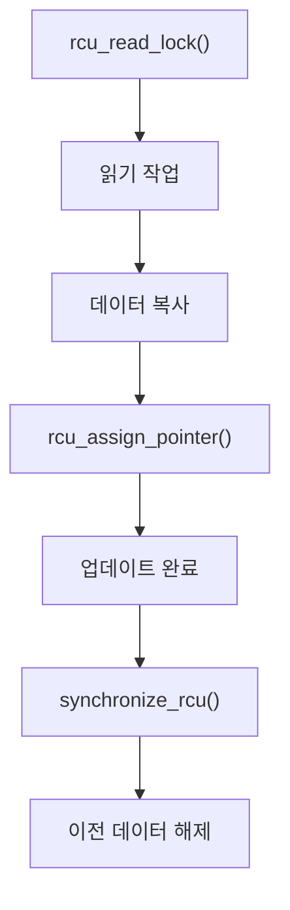

### 데이터 구조에서의 RCU의 역할

RCU는 다양한 데이터 구조에서 사용될 수 있으며, 특히 링크드 리스트, 해시 테이블, 트리 구조 등에서 효과적이다. RCU는 데이터 구조의 읽기 작업이 빈번하게 발생하는 경우에 유용하며, 다음과 같은 역할을 한다.

- **읽기 최적화**: RCU는 읽기 작업이 블록되지 않도록 하여, 다수의 스레드가 동시에 데이터를 읽을 수 있도록 한다.
- **안전한 업데이트**: 데이터 구조를 업데이트할 때, 기존 데이터를 안전하게 유지하면서 새로운 데이터를 추가할 수 있다.
- **메모리 관리**: RCU는 메모리 해제를 지연시켜, 읽기 작업이 완료된 후에만 이전 데이터를 해제할 수 있도록 한다.

이러한 특성 덕분에 RCU는 고성능의 동시성 제어를 제공하며, 특히 읽기 작업이 많은 시스템에서 유리하다.

### RCU의 장점과 단점

RCU는 여러 장점을 가지고 있지만, 몇 가지 단점도 존재한다. 다음은 RCU의 장점과 단점이다.

**장점**:
- **높은 성능**: 읽기 작업이 블록되지 않기 때문에, 다수의 스레드가 동시에 데이터를 읽을 수 있어 성능이 향상된다.
- **간단한 API**: RCU는 간단한 API를 제공하여 사용자가 쉽게 사용할 수 있도록 한다.
- **유연한 메모리 관리**: 메모리 해제를 지연시켜, 안전한 데이터 접근을 보장한다.

**단점**:
- **메모리 사용량 증가**: 데이터 복사 및 지연된 메모리 해제로 인해 메모리 사용량이 증가할 수 있다.
- **복잡한 구현**: RCU를 올바르게 구현하기 위해서는 동시성 및 메모리 모델에 대한 깊은 이해가 필요하다.
- **읽기 작업의 지연**: 업데이트가 진행되는 동안 읽기 작업이 지연될 수 있으며, 이는 성능 저하로 이어질 수 있다.

RCU는 이러한 장점과 단점을 고려하여 적절한 상황에서 사용해야 하며, 성능 최적화를 위해 다양한 기법을 적용할 수 있다.

<!--
## 3. RCU의 핵심 API
   - rcu_read_lock()
   - rcu_read_unlock()
   - synchronize_rcu()
   - call_rcu()
   - rcu_assign_pointer()
   - rcu_dereference()
   - RCU API의 사용 예시
-->

## RCU의 핵심 API

RCU(Read-Copy-Update)는 동시성 프로그래밍에서 중요한 역할을 하는 메커니즘이다. RCU의 핵심 API는 이 메커니즘을 효과적으로 활용하기 위해 필수적이다. 이번 섹션에서는 RCU의 주요 API에 대해 살펴보겠다.

### rcu_read_lock()

**rcu_read_lock()**은 RCU 읽기 세션을 시작하는 함수이다. 이 함수를 호출하면 현재 스레드는 RCU 읽기 세션에 들어가며, 이 세션 동안에는 데이터 구조에 대한 읽기 작업이 안전하게 수행될 수 있다. 이 함수는 RCU의 동시성 모델을 지원하기 위해 사용된다.

```c
rcu_read_lock();
// 데이터 구조에 대한 읽기 작업
rcu_read_unlock();
```

### rcu_read_unlock()

**rcu_read_unlock()**은 RCU 읽기 세션을 종료하는 함수이다. 이 함수를 호출하면 현재 스레드는 RCU 읽기 세션에서 나가게 되며, 이후에는 RCU 보호를 받지 않는 데이터 구조에 대한 작업을 수행할 수 있다.

```c
rcu_read_lock();
// 데이터 구조에 대한 읽기 작업
rcu_read_unlock();
```

### synchronize_rcu()

**synchronize_rcu()**는 모든 이전 RCU 읽기 세션이 완료될 때까지 대기하는 함수이다. 이 함수는 RCU 업데이트가 안전하게 완료되었음을 보장하기 위해 사용된다. 이 함수는 RCU 업데이트가 완료된 후에 안전하게 메모리를 해제할 수 있도록 도와준다.

```c
synchronize_rcu();
// 안전하게 메모리 해제
```

### call_rcu()

**call_rcu()**는 비동기적으로 콜백 함수를 호출하는 API이다. 이 함수는 RCU 업데이트가 완료된 후에 특정 작업을 수행해야 할 때 유용하다. 이 API는 RCU의 비동기 콜백 메커니즘을 활용하여, 업데이트 스레드가 블록되지 않도록 한다.

```c
void my_callback(struct rcu_head *head) {
    // 콜백 작업
}

call_rcu(&my_rcu_head, my_callback);
```

### rcu_assign_pointer()

**rcu_assign_pointer()**는 RCU 포인터를 안전하게 할당하는 함수이다. 이 함수는 RCU의 동시성 모델을 준수하면서 포인터를 할당할 수 있도록 도와준다. 이 API를 사용하면 RCU 보호를 받는 데이터 구조에 대한 안전한 포인터 할당이 가능하다.

```c
struct my_struct *ptr;
rcu_assign_pointer(ptr, new_value);
```

### rcu_dereference()

**rcu_dereference()**는 RCU 포인터를 안전하게 역참조하는 함수이다. 이 함수를 사용하면 RCU 보호를 받는 데이터 구조에 대한 안전한 접근이 가능하다. 이 API는 RCU의 동시성 모델을 준수하면서 데이터에 접근할 수 있도록 도와준다.

```c
struct my_struct *ptr = rcu_dereference(my_rcu_pointer);
```

### RCU API의 사용 예시

RCU API를 활용한 간단한 예시를 통해 RCU의 작동 방식을 이해할 수 있다. 아래는 RCU를 사용하여 링크드 리스트를 안전하게 업데이트하는 예시이다.

```c
struct my_node {
    int data;
    struct my_node *next;
};

struct my_node *head;

void update_list(int new_data) {
    struct my_node *new_node = kmalloc(sizeof(struct my_node), GFP_KERNEL);
    new_node->data = new_data;

    rcu_read_lock();
    struct my_node *old_head = rcu_dereference(head);
    new_node->next = old_head;
    rcu_assign_pointer(head, new_node);
    rcu_read_unlock();
}
```

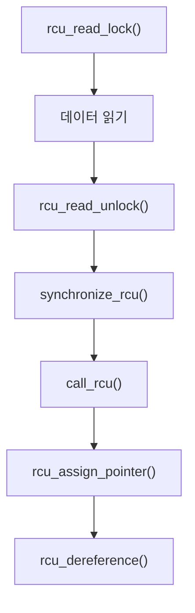

위의 다이어그램은 RCU API의 흐름을 시각적으로 나타낸 것이다. 각 API의 호출 순서를 통해 RCU의 작동 방식을 이해할 수 있다. RCU API는 동시성 프로그래밍에서 안전하고 효율적인 데이터 접근을 가능하게 해준다.

<!--
## 4. RCU의 활용 예제
   - RCU를 사용한 동적 구조체 업데이트
   - RCU를 사용한 링크드 리스트 보호
   - RCU를 사용한 NMI 핸들러 보호
-->

## RCU의 활용 예제

RCU(Read-Copy-Update)는 고성능 동시성 제어를 위한 강력한 메커니즘으로, 다양한 상황에서 유용하게 활용될 수 있다. 이번 섹션에서는 RCU를 사용한 몇 가지 활용 예제를 살펴보겠다.

### RCU를 사용한 동적 구조체 업데이트

RCU는 동적 구조체를 안전하게 업데이트하는 데 매우 유용하다. 예를 들어, 여러 스레드가 동시에 구조체를 읽고 업데이트할 때, RCU를 사용하면 읽기 작업이 블록되지 않으면서도 안전하게 업데이트를 수행할 수 있다. 아래는 RCU를 사용한 동적 구조체 업데이트의 간단한 예시이다.

```c
#include <linux/rcupdate.h>
#include <linux/slab.h>

struct my_struct {
    int data;
    struct rcu_head rcu;
};

void update_struct(struct my_struct **ptr, int new_data) {
    struct my_struct *new_struct;

    new_struct = kmalloc(sizeof(*new_struct), GFP_KERNEL);
    new_struct->data = new_data;

    rcu_assign_pointer(*ptr, new_struct);
    synchronize_rcu(); // 모든 RCU 읽기 작업이 완료될 때까지 대기
}

void free_struct(struct my_struct *ptr) {
    call_rcu(&ptr->rcu, kfree_rcu_callback);
}

void kfree_rcu_callback(struct rcu_head *head) {
    struct my_struct *ptr = container_of(head, struct my_struct, rcu);
    kfree(ptr);
}
```

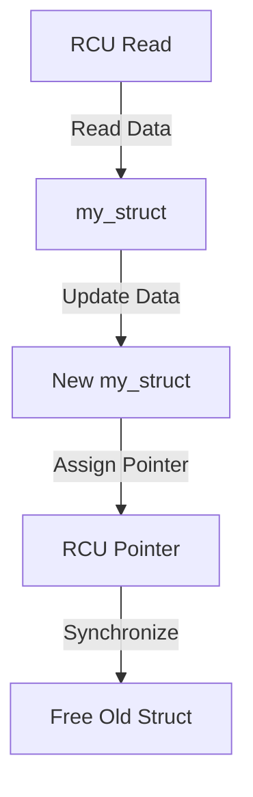

### RCU를 사용한 링크드 리스트 보호

링크드 리스트와 같은 데이터 구조에서 RCU를 사용하면, 여러 스레드가 동시에 리스트를 탐색하고 수정할 수 있다. RCU는 읽기 작업이 블록되지 않도록 하여 성능을 극대화할 수 있다. 아래는 RCU를 사용한 링크드 리스트 보호의 예시이다.

```c
struct list_node {
    int data;
    struct list_node *next;
    struct rcu_head rcu;
};

void add_node(struct list_node **head, int new_data) {
    struct list_node *new_node;

    new_node = kmalloc(sizeof(*new_node), GFP_KERNEL);
    new_node->data = new_data;

    rcu_assign_pointer(new_node->next, *head);
    rcu_assign_pointer(*head, new_node);
}

void remove_node(struct list_node **head, struct list_node *node_to_remove) {
    struct list_node *next_node;

    rcu_read_lock();
    next_node = rcu_dereference(node_to_remove->next);
    rcu_read_unlock();

    call_rcu(&node_to_remove->rcu, kfree_rcu_callback);
}
```

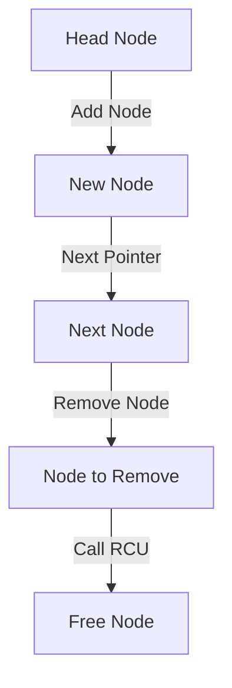

### RCU를 사용한 NMI 핸들러 보호

NMI(Non-Maskable Interrupt) 핸들러는 시스템의 중요한 부분으로, RCU를 사용하여 안전하게 보호할 수 있다. RCU는 NMI 핸들러가 실행되는 동안에도 데이터 구조에 대한 안전한 접근을 보장한다. 아래는 RCU를 사용한 NMI 핸들러 보호의 예시이다.

```c
struct nmi_data {
    int value;
    struct rcu_head rcu;
};

void nmi_handler(struct nmi_data *data) {
    rcu_read_lock();
    // 데이터에 대한 안전한 읽기 작업 수행
    int value = rcu_dereference(data)->value;
    rcu_read_unlock();
}

void update_nmi_data(struct nmi_data **data_ptr, int new_value) {
    struct nmi_data *new_data;

    new_data = kmalloc(sizeof(*new_data), GFP_KERNEL);
    new_data->value = new_value;

    rcu_assign_pointer(*data_ptr, new_data);
    synchronize_rcu();
}
```

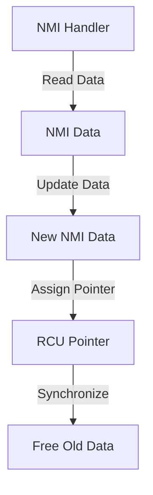

이와 같이 RCU는 다양한 상황에서 유용하게 활용될 수 있으며, 동시성 문제를 해결하는 데 큰 도움이 된다. RCU를 적절히 사용하면 성능을 극대화하면서도 안전한 데이터 접근을 보장할 수 있다.

<!--
## 5. 업데이트 스레드가 블록할 수 없는 경우
   - call_rcu()의 사용
   - 비동기 콜백 메커니즘
   - kfree_rcu()의 활용
-->

## 업데이트 스레드가 블록할 수 없는 경우

RCU(Read-Copy-Update) 메커니즘은 동시성 프로그래밍에서 중요한 역할을 하며, 특히 업데이트 스레드가 블록할 수 없는 경우에 유용하다. 이 섹션에서는 `call_rcu()`의 사용, 비동기 콜백 메커니즘, 그리고 `kfree_rcu()`의 활용에 대해 설명하겠다.

### call_rcu()의 사용

`call_rcu()` 함수는 RCU의 핵심 기능 중 하나로, 특정 데이터 구조를 안전하게 해제할 수 있도록 비동기적으로 콜백을 등록하는 데 사용된다. 이 함수는 업데이트 스레드가 블록되지 않도록 하여, 데이터 구조의 안전한 해제를 보장한다. 

다음은 `call_rcu()`의 사용 예시이다.

```c
#include <linux/rcupdate.h>
#include <linux/slab.h>

struct my_data {
    int value;
    struct rcu_head rcu;
};

void my_callback(struct rcu_head *head) {
    struct my_data *data = container_of(head, struct my_data, rcu);
    kfree(data);
}

void update_data(struct my_data *data) {
    // 데이터 업데이트 로직
    call_rcu(&data->rcu, my_callback);
}
```

위의 코드에서 `update_data()` 함수는 데이터 구조를 업데이트한 후, `call_rcu()`를 호출하여 비동기적으로 `my_callback()`을 등록한다. 이 콜백은 RCU의 동기화가 완료된 후에 호출되어 메모리를 안전하게 해제한다.

### 비동기 콜백 메커니즘

비동기 콜백 메커니즘은 RCU의 중요한 특징으로, 업데이트 스레드가 블록되지 않도록 한다. 이 메커니즘을 통해, 데이터 구조의 해제는 RCU의 동기화가 완료된 후에 이루어지며, 이는 시스템의 성능을 향상시킨다.

비동기 콜백은 다음과 같은 과정을 거친다:

1. 데이터 구조가 업데이트된다.
2. `call_rcu()`를 통해 콜백이 등록된다.
3. RCU의 동기화가 완료되면, 등록된 콜백이 호출된다.

이러한 방식으로, 업데이트 스레드는 블록되지 않으며, 다른 스레드가 데이터 구조에 접근할 수 있는 동안 안전하게 메모리를 해제할 수 있다.

### kfree_rcu()의 활용

`kfree_rcu()` 함수는 RCU를 사용하여 메모리를 해제하는 또 다른 방법이다. 이 함수는 `call_rcu()`와 유사하게 작동하지만, 메모리 해제를 더 간편하게 처리할 수 있도록 돕는다. 

다음은 `kfree_rcu()`의 사용 예시이다.

```c
void update_data_and_free(struct my_data *data) {
    // 데이터 업데이트 로직
    kfree_rcu(data, rcu);
}
```

위의 코드에서 `kfree_rcu()`는 데이터 구조를 업데이트한 후, RCU의 동기화가 완료되면 자동으로 메모리를 해제한다. 이로 인해 개발자는 메모리 해제를 위한 추가적인 콜백을 작성할 필요가 없어진다.

### 다이어그램

다음은 RCU의 비동기 콜백 메커니즘을 설명하는 다이어그램이다.

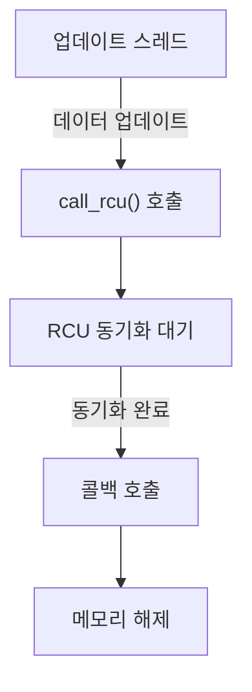

이 다이어그램은 업데이트 스레드가 데이터 구조를 업데이트하고, `call_rcu()`를 호출한 후, RCU의 동기화가 완료되면 콜백이 호출되어 메모리가 해제되는 과정을 보여준다. 

이와 같이 RCU는 업데이트 스레드가 블록되지 않도록 하여, 동시성 프로그래밍에서의 성능을 극대화하는 데 기여한다.

<!--
## 6. RCU의 간단한 구현 예시
   - "장난감" RCU 구현 1: 락 기반
   - "장난감" RCU 구현 2: 고전적인 RCU
   - 실제 RCU 구현과의 비교
-->

## RCU의 간단한 구현 예시

RCU(Read-Copy-Update)는 고성능 동시성 제어 메커니즘으로, 다양한 구현 방식이 존재한다. 이번 섹션에서는 RCU의 간단한 구현 예시를 통해 그 작동 방식을 이해하고, 실제 RCU 구현과의 차이점을 살펴보겠다.

### "장난감" RCU 구현 1: 락 기반

락 기반 RCU 구현은 전통적인 락 메커니즘을 사용하여 데이터 접근을 제어하는 방식이다. 이 구현에서는 읽기 작업이 락을 획득하고, 쓰기 작업이 락을 해제할 때까지 다른 스레드가 해당 데이터에 접근할 수 없도록 한다. 아래는 간단한 락 기반 RCU 구현의 예시이다.

```c
#include <pthread.h>
#include <stdio.h>
#include <stdlib.h>

typedef struct {
    int data;
    pthread_mutex_t lock;
} rcu_t;

void rcu_init(rcu_t *rcu) {
    rcu->data = 0;
    pthread_mutex_init(&rcu->lock, NULL);
}

void rcu_read_lock(rcu_t *rcu) {
    pthread_mutex_lock(&rcu->lock);
}

void rcu_read_unlock(rcu_t *rcu) {
    pthread_mutex_unlock(&rcu->lock);
}

void rcu_update(rcu_t *rcu, int new_data) {
    rcu_read_lock(rcu);
    rcu->data = new_data;
    rcu_read_unlock(rcu);
}

int rcu_get_data(rcu_t *rcu) {
    return rcu->data;
}
```

이 구현은 간단하지만, 락을 사용하기 때문에 성능이 저하될 수 있다. 특히, 많은 읽기 작업이 동시에 발생할 경우 락 경합이 발생할 수 있다.

### "장난감" RCU 구현 2: 고전적인 RCU

고전적인 RCU 구현은 읽기 작업이 락을 사용하지 않고, 쓰기 작업이 데이터의 복사본을 생성하여 업데이트하는 방식이다. 이 방식은 읽기 작업이 매우 빠르며, 쓰기 작업이 완료된 후에만 데이터가 교체된다. 아래는 고전적인 RCU 구현의 예시이다.

```c
#include <stdio.h>
#include <stdlib.h>

typedef struct rcu_node {
    int data;
    struct rcu_node *next;
} rcu_node_t;

rcu_node_t *rcu_head = NULL;

void rcu_update(int new_data) {
    rcu_node_t *new_node = malloc(sizeof(rcu_node_t));
    new_node->data = new_data;
    new_node->next = rcu_head;
    rcu_head = new_node;
}

int rcu_get_data() {
    return rcu_head->data;
}
```

이 구현은 읽기 작업이 락을 사용하지 않기 때문에 성능이 우수하다. 그러나 메모리 관리에 주의해야 하며, 쓰기 작업이 완료된 후에 이전 노드를 안전하게 해제해야 한다.

### 실제 RCU 구현과의 비교

실제 RCU 구현은 위의 두 가지 방식의 장점을 결합하여, 읽기 작업의 성능을 극대화하고 쓰기 작업의 안전성을 보장한다. 실제 RCU는 다음과 같은 특징을 가진다.

- **비동기 콜백**: 쓰기 작업이 완료된 후, 이전 데이터에 대한 참조가 더 이상 필요하지 않을 때 비동기적으로 메모리를 해제한다.
- **동시성**: 읽기 작업이 락 없이 수행되므로, 높은 동시성을 제공한다.
- **안전성**: 데이터의 일관성을 유지하면서도, 메모리 접근을 안전하게 관리한다.

아래는 RCU의 작동 방식을 나타내는 다이어그램이다.

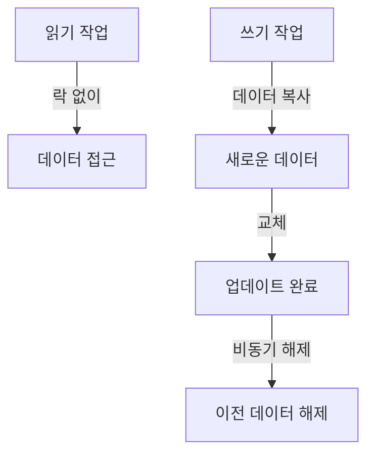

이와 같이 RCU의 간단한 구현 예시는 RCU의 기본 개념을 이해하는 데 도움을 주며, 실제 구현에서의 성능과 안전성을 비교하는 데 유용하다.

<!--
## 7. RCU와 Reader-Writer Lock의 유사성
   - Reader-Writer Lock과 RCU의 비교
   - RCU의 동시성 처리 방식
   - RCU의 성능 최적화
-->

## RCU와 Reader-Writer Lock의 유사성

### Reader-Writer Lock과 RCU의 비교

Reader-Writer Lock과 RCU는 모두 동시성 제어를 위한 메커니즘으로, 다수의 읽기 작업과 적은 수의 쓰기 작업이 동시에 발생하는 상황에서 성능을 최적화하는 데 중점을 둔다. Reader-Writer Lock은 읽기 작업이 진행되는 동안 다른 읽기 작업은 허용하지만, 쓰기 작업이 진행될 때는 모든 읽기 작업과 쓰기 작업이 차단된다. 반면, RCU는 읽기 작업이 진행되는 동안 쓰기 작업이 안전하게 수행될 수 있도록 설계되어 있다. RCU는 읽기 작업이 완료될 때까지 쓰기 작업이 지연되지만, 읽기 작업은 블록되지 않기 때문에 높은 동시성을 제공한다.

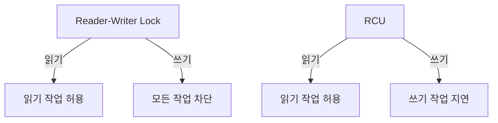

### RCU의 동시성 처리 방식

RCU는 읽기 작업이 진행되는 동안 데이터 구조의 상태를 변경할 수 있는 독특한 방식을 제공한다. RCU의 핵심은 읽기 작업이 완료될 때까지 쓰기 작업이 지연되도록 하여, 읽기 작업이 안전하게 데이터를 참조할 수 있도록 하는 것이다. 이를 통해 RCU는 높은 동시성을 유지하면서도 데이터의 일관성을 보장할 수 있다. RCU는 주로 다음과 같은 방식으로 동시성을 처리한다.

1. **읽기 작업**: rcu_read_lock()과 rcu_read_unlock()을 사용하여 읽기 작업을 시작하고 종료한다. 이 사이에 데이터에 대한 읽기가 이루어진다.
2. **쓰기 작업**: 쓰기 작업은 데이터 구조를 수정하기 전에 synchronize_rcu()를 호출하여 모든 현재 진행 중인 읽기 작업이 완료될 때까지 대기한다.
3. **콜백 처리**: call_rcu()를 사용하여 비동기적으로 메모리 해제를 처리할 수 있다.

### RCU의 성능 최적화

RCU는 성능 최적화를 위해 여러 가지 기법을 사용한다. 그 중 일부는 다음과 같다.

- **비동기 콜백**: RCU는 call_rcu()를 통해 비동기적으로 메모리 해제를 처리하여, 쓰기 작업이 완료된 후에도 읽기 작업이 계속 진행될 수 있도록 한다.
- **지연된 메모리 해제**: synchronize_rcu()를 사용하여 모든 읽기 작업이 완료된 후에만 메모리를 해제함으로써, 메모리 접근의 안전성을 높인다.
- **경량화된 락**: RCU는 락을 사용하지 않거나 최소화하여, 쓰기 작업의 오버헤드를 줄이고 성능을 향상시킨다.

이러한 최적화 기법들은 RCU가 높은 동시성을 유지하면서도 성능을 극대화할 수 있도록 돕는다. RCU는 특히 읽기 작업이 많은 환경에서 뛰어난 성능을 발휘하며, 다양한 데이터 구조에서 효과적으로 활용될 수 있다.

<!--
## 8. RCU와 Reference Counting의 유사성
   - Reference Counting의 개념
   - RCU가 Reference Counting을 어떻게 보완하는지
   - RCU를 통한 안전한 데이터 접근
-->

## RCU와 Reference Counting의 유사성

### Reference Counting의 개념

Reference Counting은 객체의 사용 횟수를 추적하는 메커니즘이다. 각 객체는 참조 카운터를 가지고 있으며, 객체에 대한 참조가 생성될 때 카운터가 증가하고, 참조가 해제될 때 카운터가 감소한다. 카운터가 0이 되면 해당 객체는 더 이상 사용되지 않으므로 메모리에서 해제될 수 있다. 이 방식은 메모리 관리에서 유용하지만, 동시성 문제를 해결하기 위해 추가적인 동기화가 필요하다.

### RCU가 Reference Counting을 어떻게 보완하는지

RCU는 Reference Counting의 단점을 보완하는 데 도움을 준다. Reference Counting은 객체의 참조가 해제될 때 즉시 메모리를 해제하는 반면, RCU는 읽기 작업이 진행되는 동안 객체가 안전하게 유지될 수 있도록 한다. RCU는 읽기 작업이 완료될 때까지 객체를 유지하고, 그 후에 메모리를 해제할 수 있도록 하여 동시성 문제를 최소화한다. 이로 인해 RCU는 높은 성능을 유지하면서도 안전한 데이터 접근을 가능하게 한다.

### RCU를 통한 안전한 데이터 접근

RCU를 사용하면 여러 스레드가 동시에 데이터를 읽을 수 있으며, 데이터의 업데이트는 별도의 스레드에서 안전하게 수행될 수 있다. 이를 통해 데이터의 일관성을 유지하면서도 성능을 극대화할 수 있다. RCU는 읽기 작업이 진행되는 동안 데이터의 상태를 변경하지 않기 때문에, 읽기 작업이 완료된 후에만 데이터의 변경이 이루어질 수 있다.

아래는 RCU를 사용한 안전한 데이터 접근을 보여주는 간단한 코드 예시이다.

```c
#include <linux/rcupdate.h>
#include <linux/slab.h>

struct data {
    int value;
    struct rcu_head rcu;
};

struct data *my_data;

void update_data(int new_value) {
    struct data *new_data;

    new_data = kmalloc(sizeof(struct data), GFP_KERNEL);
    new_data->value = new_value;

    rcu_assign_pointer(my_data, new_data);
    call_rcu(&new_data->rcu, free_data);
}

void free_data(struct rcu_head *rcu) {
    struct data *data = container_of(rcu, struct data, rcu);
    kfree(data);
}

int read_data(void) {
    struct data *data;

    rcu_read_lock();
    data = rcu_dereference(my_data);
    int value = data->value;
    rcu_read_unlock();

    return value;
}
```

위의 코드에서 `update_data` 함수는 새로운 데이터를 생성하고, `rcu_assign_pointer`를 사용하여 포인터를 안전하게 업데이트한다. `read_data` 함수는 `rcu_read_lock`과 `rcu_read_unlock`을 사용하여 안전하게 데이터를 읽는다. 이와 같은 방식으로 RCU는 Reference Counting의 단점을 보완하며, 안전한 데이터 접근을 가능하게 한다.

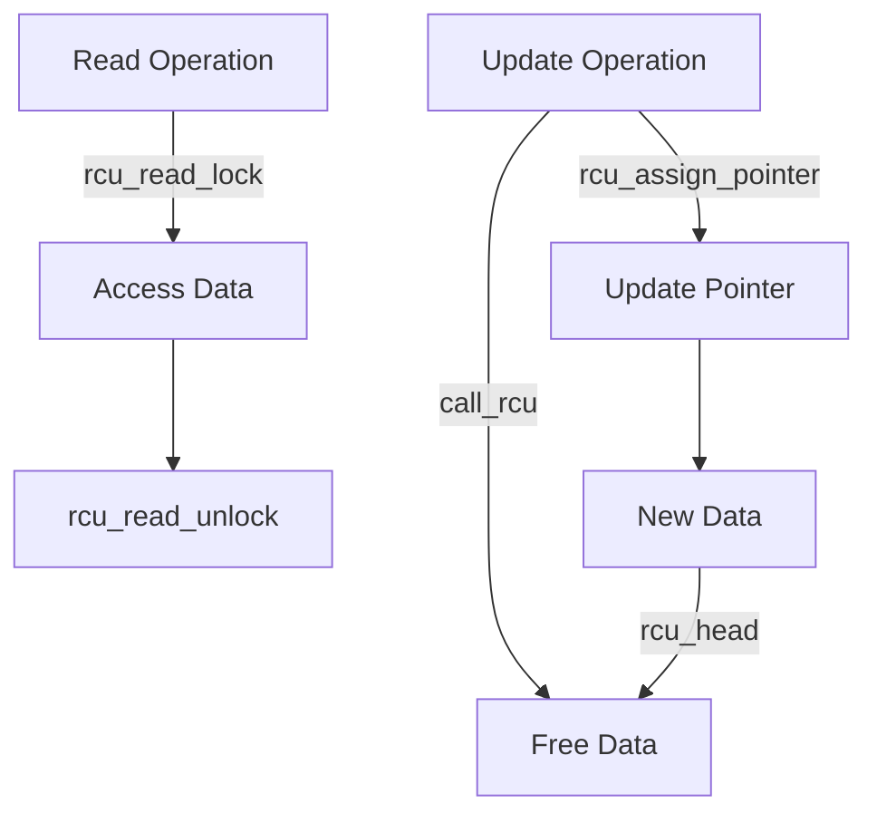

위의 다이어그램은 RCU의 작동 방식을 시각적으로 나타낸 것이다. 읽기 작업과 업데이트 작업이 어떻게 상호작용하는지를 보여준다. RCU는 동시성 문제를 해결하면서도 성능을 유지할 수 있는 강력한 메커니즘이다.

<!--
## 9. RCU API의 전체 목록
   - RCU 리스트 탐색 API
   - RCU 포인터/리스트 업데이트 API
   - RCU 관련 API 카테고리
-->

## RCU API의 전체 목록

RCU (Read-Copy-Update) API는 RCU 메커니즘을 활용하여 데이터 구조를 안전하게 업데이트하고 탐색할 수 있도록 돕는 함수들로 구성되어 있다. 이 섹션에서는 RCU API의 주요 카테고리와 각 API의 기능에 대해 설명하겠다.

### RCU 리스트 탐색 API

RCU 리스트 탐색 API는 RCU를 사용하여 안전하게 리스트를 탐색할 수 있도록 지원한다. 이 API는 주로 읽기 작업을 수행하는 스레드에서 사용되며, 데이터의 일관성을 보장한다. 

**rcu_dereference()**: 이 함수는 RCU 보호 하에 있는 포인터를 안전하게 역참조하는 데 사용된다. 이 함수를 사용하면, 읽기 작업이 진행되는 동안 데이터가 변경되지 않도록 보장할 수 있다.

```c
struct my_struct *ptr;
ptr = rcu_dereference(my_rcu_pointer);
```

**rcu_assign_pointer()**: 이 함수는 RCU 보호 하에 있는 포인터를 안전하게 할당하는 데 사용된다. 이 함수를 사용하면, 포인터의 할당이 다른 스레드에 의해 읽히는 동안 안전하게 이루어질 수 있다.

```c
rcu_assign_pointer(my_rcu_pointer, new_ptr);
```

### RCU 포인터/리스트 업데이트 API

RCU 포인터 및 리스트 업데이트 API는 데이터 구조를 안전하게 업데이트하는 데 필요한 함수들로 구성되어 있다. 이 API는 주로 쓰기 작업을 수행하는 스레드에서 사용된다.

**call_rcu()**: 이 함수는 비동기적으로 콜백 함수를 호출하여 RCU 보호 하에 있는 데이터 구조를 안전하게 해제할 수 있도록 한다. 이 함수는 업데이트가 완료된 후에 메모리를 해제하는 데 유용하다.

```c
call_rcu(&my_rcu_struct->rcu_head, my_callback_function);
```

**synchronize_rcu()**: 이 함수는 모든 RCU 읽기 작업이 완료될 때까지 대기하는 데 사용된다. 이 함수는 데이터 구조의 안전한 업데이트를 보장하기 위해 필요하다.

```c
synchronize_rcu();
```

### RCU 관련 API 카테고리

RCU API는 여러 카테고리로 나눌 수 있으며, 각 카테고리는 특정한 기능을 수행한다. 주요 카테고리는 다음과 같다.

- **읽기 API**: 데이터 구조를 안전하게 읽기 위한 API로, rcu_dereference()와 rcu_read_lock()/rcu_read_unlock()이 포함된다.
- **쓰기 API**: 데이터 구조를 안전하게 업데이트하기 위한 API로, rcu_assign_pointer(), call_rcu(), synchronize_rcu()가 포함된다.
- **유틸리티 API**: RCU의 동작을 보조하는 다양한 유틸리티 함수들이 포함된다.

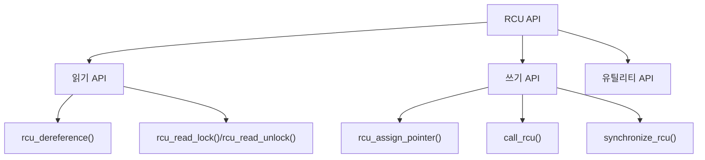

이와 같이 RCU API는 데이터 구조의 안전한 탐색과 업데이트를 위한 다양한 기능을 제공한다. 각 API는 특정한 상황에서 유용하게 사용될 수 있으며, RCU의 장점을 극대화하는 데 기여한다.

<!--
## 10. RCU 사용 시 고려사항
   - RCU를 사용할 때의 주의사항
   - RCU의 성능 최적화 방법
   - RCU의 적절한 사용 사례
-->

## RCU 사용 시 고려사항

### RCU를 사용할 때의 주의사항

RCU (Read-Copy-Update)를 사용할 때는 몇 가지 주의사항이 있다. 첫째, RCU는 주로 읽기 작업이 많은 환경에서 효과적이다. 따라서 쓰기 작업이 빈번한 경우에는 RCU의 이점을 충분히 활용하기 어려울 수 있다. 둘째, RCU의 사용은 메모리 관리와 관련된 복잡성을 증가시킬 수 있다. 예를 들어, RCU를 사용하여 메모리를 해제할 때는 synchronize_rcu()를 호출하여 모든 읽기 작업이 완료된 후에야 메모리를 해제해야 한다. 이를 간과하면 메모리 접근 오류가 발생할 수 있다.

### RCU의 성능 최적화 방법

RCU의 성능을 최적화하기 위해서는 몇 가지 방법을 고려할 수 있다. 첫째, RCU의 읽기 작업을 최적화하기 위해 rcu_read_lock()과 rcu_read_unlock()을 적절히 사용하여 불필요한 잠금을 피해야 한다. 둘째, RCU의 콜백 메커니즘을 활용하여 비동기적으로 메모리를 해제하는 것이 좋다. 이를 통해 쓰기 작업이 블록되지 않도록 할 수 있다. 마지막으로, RCU의 사용 패턴을 분석하여 불필요한 업데이트를 줄이는 것이 성능 향상에 기여할 수 있다.

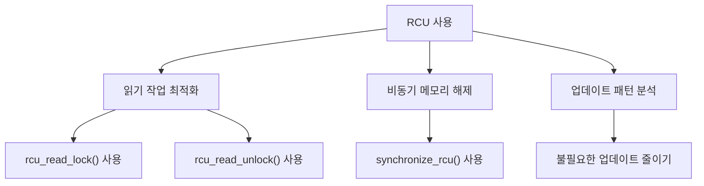

### RCU의 적절한 사용 사례

RCU는 특정 사용 사례에서 특히 유용하다. 예를 들어, 커널 모듈에서의 데이터 구조 보호, 고속 캐시 시스템, 그리고 대규모 멀티스레드 애플리케이션에서의 데이터 접근 관리에 적합하다. 또한, RCU는 읽기 작업이 빈번하고 쓰기 작업이 드문 경우에 최적의 성능을 발휘한다. 이러한 특성 덕분에 RCU는 리눅스 커널과 같은 고성능 시스템에서 널리 사용되고 있다.

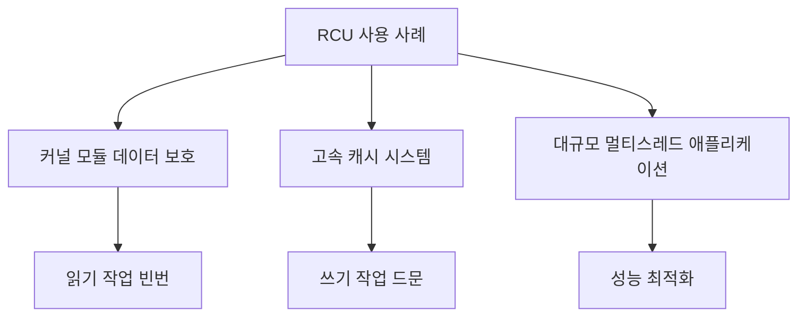

RCU를 사용할 때는 이러한 고려사항을 염두에 두고 적절한 사용 사례를 선택하는 것이 중요하다. 이를 통해 RCU의 장점을 최대한 활용할 수 있다.

<!--
## 11. FAQ
   - RCU와 다른 동기화 메커니즘의 차이점은 무엇인가요?
   - RCU를 사용할 때의 일반적인 실수는 무엇인가요?
   - RCU의 성능을 어떻게 측정하나요?
-->

## FAQ

### RCU와 다른 동기화 메커니즘의 차이점은 무엇인가요?

RCU (Read-Copy-Update)는 다른 동기화 메커니즘과 비교했을 때 몇 가지 독특한 특징을 가지고 있다. 일반적인 동기화 메커니즘은 락(lock)을 사용하여 데이터 접근을 제어하는 반면, RCU는 읽기 작업이 진행되는 동안 데이터의 업데이트를 지연시켜 성능을 최적화한다. 

RCU는 주로 읽기 작업이 많은 환경에서 유리하며, 읽기 작업이 락을 필요로 하지 않기 때문에 높은 동시성을 제공한다. 반면, 락 기반 메커니즘은 읽기와 쓰기 작업 모두에 대해 락을 걸어야 하므로 성능 저하가 발생할 수 있다. 

아래는 RCU와 락 기반 동기화 메커니즘의 비교를 나타낸 다이어그램이다.

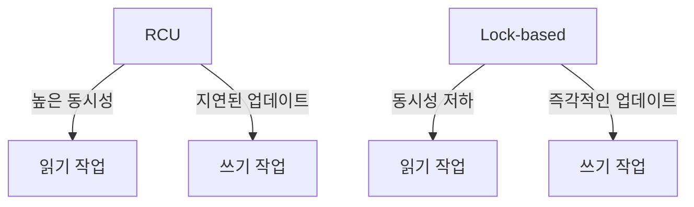

### RCU를 사용할 때의 일반적인 실수는 무엇인가요?

RCU를 사용할 때 흔히 발생하는 실수는 다음과 같다:

1. **rcu_read_lock()과 rcu_read_unlock()의 불일치**: RCU의 읽기 세션을 시작할 때는 반드시 rcu_read_lock()을 호출하고, 세션이 끝난 후에는 rcu_read_unlock()을 호출해야 한다. 이를 누락하면 데이터 일관성이 깨질 수 있다.

2. **synchronize_rcu()의 오용**: synchronize_rcu()는 모든 RCU 읽기 세션이 완료될 때까지 대기하는 함수이다. 이 함수를 잘못 사용하면 성능 저하를 초래할 수 있다.

3. **비동기 콜백의 잘못된 사용**: call_rcu()를 사용하여 비동기 콜백을 등록할 때, 콜백 함수가 올바르게 작성되지 않으면 메모리 누수나 데이터 손상이 발생할 수 있다.

### RCU의 성능을 어떻게 측정하나요?

RCU의 성능을 측정하는 방법은 여러 가지가 있다. 일반적으로 다음과 같은 지표를 사용한다:

1. **읽기 및 쓰기 성능**: RCU의 주요 장점은 읽기 작업의 성능이다. 읽기와 쓰기 작업의 처리 시간을 측정하여 RCU의 성능을 평가할 수 있다.

2. **동시성**: RCU는 높은 동시성을 제공하므로, 여러 스레드가 동시에 읽기 작업을 수행할 때의 성능을 측정하는 것이 중요하다.

3. **메모리 사용량**: RCU는 메모리 사용량에 영향을 미칠 수 있다. 메모리 사용량을 모니터링하여 RCU의 효율성을 평가할 수 있다.

아래는 RCU 성능 측정을 위한 샘플 코드이다.

```c
#include <linux/rcupdate.h>
#include <linux/slab.h>

void rcu_example(void) {
    rcu_read_lock();
    // 데이터 읽기 작업
    rcu_read_unlock();
    
    synchronize_rcu(); // 모든 RCU 읽기 세션이 완료될 때까지 대기
}
```

이와 같은 방법으로 RCU의 성능을 측정하고, 최적화할 수 있는 기회를 찾을 수 있다. RCU는 적절히 사용될 경우 높은 성능을 발휘할 수 있는 강력한 동기화 메커니즘이다.

<!--
## 12. 관련 기술
   - Lock-Free 데이터 구조
   - Concurrent Programming
   - Linux Kernel의 동기화 메커니즘
-->

## 관련 기술

### Lock-Free 데이터 구조

Lock-Free 데이터 구조는 멀티스레드 환경에서 동기화 문제를 해결하기 위해 설계된 데이터 구조이다. 이러한 구조는 스레드가 서로의 작업을 방해하지 않고도 안전하게 데이터를 읽고 쓸 수 있도록 한다. Lock-Free 구조는 일반적으로 Atomic Operations를 사용하여 구현되며, 이는 스레드 간의 경합을 최소화하고 성능을 향상시킨다.

Lock-Free 데이터 구조의 주요 장점은 다음과 같다.

- **높은 성능**: Lock-Free 구조는 스레드가 블록되지 않기 때문에, 높은 동시성을 제공한다.
- **데드락 방지**: Lock-Free 구조는 스레드가 서로를 기다리지 않기 때문에 데드락이 발생하지 않는다.

아래는 Lock-Free 스택의 간단한 구현 예시이다.

```c
#include <stdatomic.h>
#include <stdlib.h>

typedef struct Node {
    int value;
    struct Node* next;
} Node;

typedef struct LockFreeStack {
    Node* head;
} LockFreeStack;

void push(LockFreeStack* stack, int value) {
    Node* new_node = (Node*)malloc(sizeof(Node));
    new_node->value = value;
    do {
        new_node->next = stack->head;
    } while (!atomic_compare_exchange_weak(&stack->head, &new_node->next, new_node));
}

int pop(LockFreeStack* stack) {
    Node* old_head;
    do {
        old_head = stack->head;
        if (old_head == NULL) {
            return -1; // 스택이 비어있음
        }
    } while (!atomic_compare_exchange_weak(&stack->head, &old_head, old_head->next));
    int value = old_head->value;
    free(old_head);
    return value;
}
```

### Concurrent Programming

Concurrent Programming은 여러 프로세스나 스레드가 동시에 실행되는 프로그램을 작성하는 기법이다. 이 기법은 멀티코어 프로세서의 성능을 극대화하고, 사용자 경험을 향상시키기 위해 필수적이다. Concurrent Programming에서는 스레드 간의 데이터 공유와 동기화가 중요한 이슈로 다루어진다.

RCU는 Concurrent Programming의 한 형태로, 읽기 작업이 많은 환경에서 성능을 극대화하는 데 유용하다. RCU는 읽기 작업이 블록되지 않도록 하여, 동시성 문제를 해결하는 데 도움을 준다.

아래는 Concurrent Programming의 기본 개념을 설명하는 다이어그램이다.

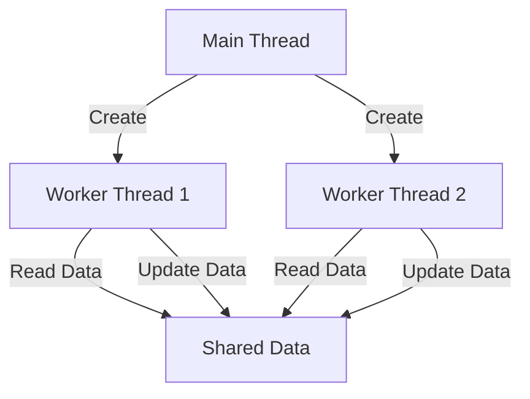

### Linux Kernel의 동기화 메커니즘

Linux Kernel은 멀티스레드 환경에서 데이터 일관성을 유지하기 위해 다양한 동기화 메커니즘을 제공한다. 이들 메커니즘은 주로 Lock, Semaphore, RCU와 같은 기법으로 구성된다. 각 기법은 특정 상황에서의 성능과 효율성을 고려하여 선택된다.

RCU는 특히 읽기 작업이 많은 상황에서 유용하며, 데이터 구조의 업데이트가 필요할 때도 효율적으로 작동한다. RCU는 읽기 작업이 블록되지 않도록 하여, 시스템의 전반적인 성능을 향상시킨다.

아래는 Linux Kernel의 동기화 메커니즘을 설명하는 다이어그램이다.

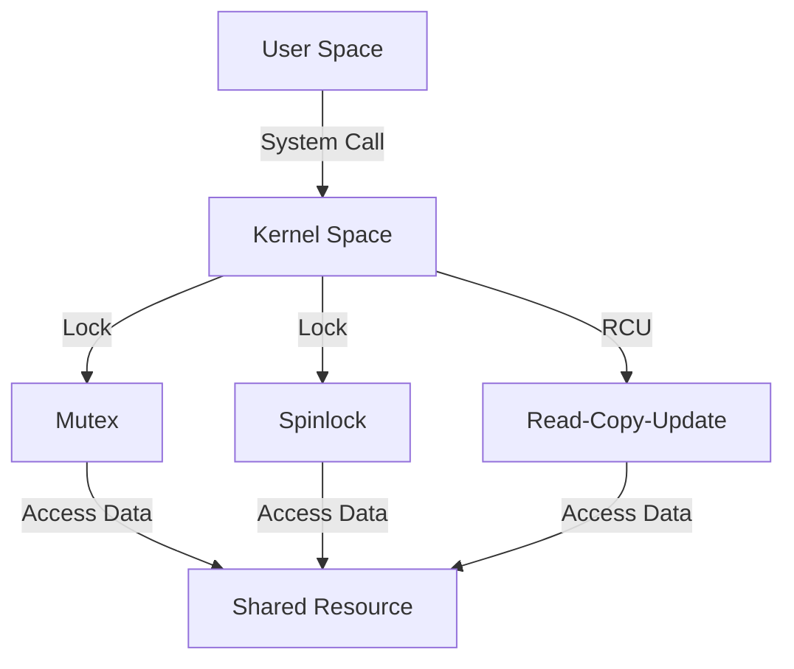

이와 같이 Lock-Free 데이터 구조, Concurrent Programming, 그리고 Linux Kernel의 동기화 메커니즘은 RCU와 밀접한 관련이 있으며, 멀티스레드 환경에서의 성능 최적화에 기여한다.

<!--
## 13. 결론
   - RCU의 중요성과 미래
   - RCU의 발전 방향
   - RCU를 통한 성능 향상 가능성
-->

## 결론

### RCU의 중요성과 미래

Read-Copy-Update (RCU) 기술은 현대의 고성능 시스템에서 필수적인 동기화 메커니즘으로 자리잡고 있다. RCU는 읽기 작업이 빈번하고 쓰기 작업이 드문 환경에서 특히 유용하다. 이는 데이터 구조에 대한 읽기 작업이 동시에 이루어질 수 있도록 하여, 성능을 극대화하는 데 기여한다. 앞으로도 RCU는 멀티코어 프로세서와 분산 시스템의 발전에 따라 더욱 중요해질 것으로 예상된다. 특히, 실시간 시스템이나 고성능 컴퓨팅 환경에서 RCU의 활용은 더욱 증가할 것이다.

### RCU의 발전 방향

RCU 기술은 지속적으로 발전하고 있으며, 새로운 사용 사례와 최적화 기법이 연구되고 있다. 예를 들어, RCU의 비동기 콜백 메커니즘은 더욱 효율적인 메모리 관리와 성능 향상을 가능하게 하고 있다. 또한, RCU와 다른 동기화 메커니즘 간의 통합 연구도 활발히 진행되고 있어, 다양한 환경에서의 적용 가능성이 높아지고 있다. 이러한 발전은 RCU의 유연성과 확장성을 더욱 강화할 것이다.

### RCU를 통한 성능 향상 가능성

RCU는 성능 향상에 기여하는 여러 가지 방법을 제공한다. 예를 들어, RCU를 사용하면 데이터 구조의 업데이트가 비차단 방식으로 이루어지므로, 읽기 작업이 지연되지 않고 빠르게 처리될 수 있다. 아래는 RCU를 활용한 성능 향상 예시를 보여주는 간단한 다이어그램이다.

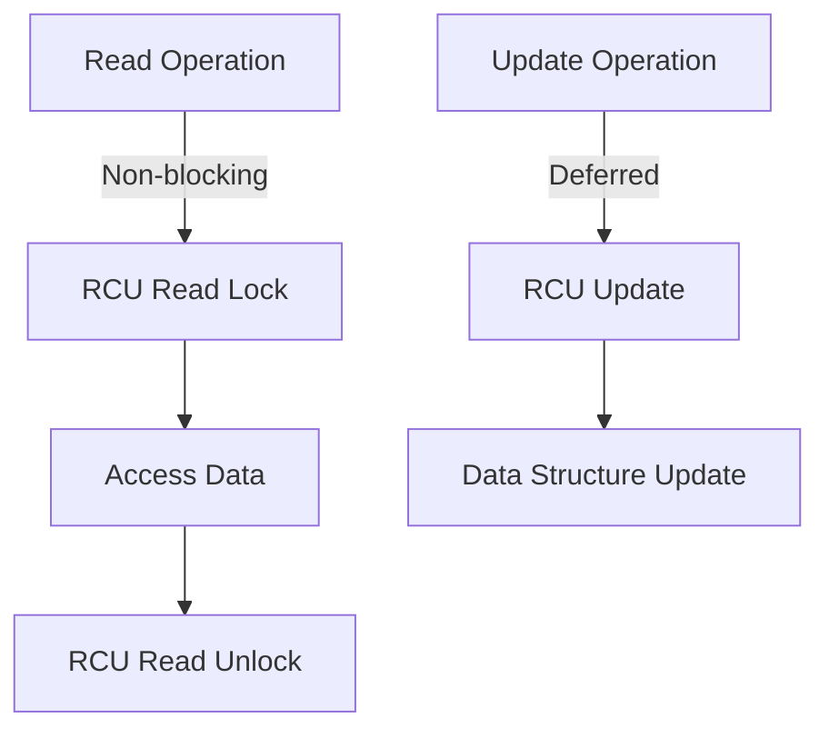

위의 다이어그램은 RCU의 읽기 작업이 비차단 방식으로 이루어지는 과정을 보여준다. 이와 같은 방식으로 RCU는 성능을 극대화할 수 있는 기회를 제공한다. 따라서 RCU는 앞으로도 다양한 시스템에서 성능 향상을 위한 중요한 도구로 자리잡을 것이다.

<!--
## 14. 참고 자료
   - RCU 관련 논문 및 자료
   - RCU에 대한 추가 학습 자료
   - RCU 관련 커뮤니티 및 포럼
-->


<!--
##### Reference #####
-->

## Reference


* [https://www.kernel.org/doc/html/next/RCU/whatisRCU.html](https://www.kernel.org/doc/html/next/RCU/whatisRCU.html)

