RCU(읽기, 복사, 업데이트)는 리눅스 커널에 추가된 동기화 메커니즘으로, 주로 읽기 작업이 많은 상황에서 최적화되어 있다. RCU는 기본적으로 업데이트를 "제거"와 "회수" 단계로 나누는 개념이다. 제거 단계에서는 데이터 구조 내의 데이터 항목에 대한 참조를 제거하거나 새로운 버전으로 교체하며, 이 과정은 독립적으로 실행되는 독자들과 동시에 진행될 수 있다. 현대 CPU의 의미론은 독자들이 부분적으로 업데이트된 참조가 아닌 이전 또는 새로운 버전의 데이터 구조를 보게 보장하기 때문에, 제거 단계가 독자와 동시에 실행되는 것이 안전하다. 회수 단계는 제거 단계에서 제거된 데이터 항목을 회수(예: 메모리 해제)하는 작업을 수행하며, 이 단계는 독자들이 더 이상 해당 데이터 항목에 대한 참조를 보유하지 않을 때까지 시작할 수 없다. 이러한 업데이트의 분리는 업데이트를 즉시 수행할 수 있게 하며, 회수 단계는 모든 독자가 완료될 때까지 지연될 수 있다. RCU는 경량 동기화를 가능하게 하여, 전통적인 잠금 기반 방식보다 더 효율적인 성능을 제공한다. RCU의 핵심 API는 rcu_read_lock(), rcu_read_unlock(), synchronize_rcu(), call_rcu(), rcu_assign_pointer(), rcu_dereference() 등으로 구성되어 있으며, 이들 API를 통해 독자, 업데이트, 회수 간의 상호작용을 관리한다. RCU는 다양한 사용 사례에 적합하며, 특히 읽기 작업이 많은 데이터 구조를 보호하는 데 유용하다.

<!--
##### Outline #####
-->

<!--
# RCU (Read-Copy-Update) 기술 블로그 목차

## 1. 개요
   - RCU의 정의 및 중요성
   - RCU의 역사와 발전
   - RCU의 사용 사례

## 2. RCU의 기본 개념
   - RCU의 작동 원리
   - 데이터 구조에서의 RCU의 역할
   - RCU의 장점과 단점

## 3. RCU의 핵심 API
   - rcu_read_lock()
   - rcu_read_unlock()
   - synchronize_rcu()
   - call_rcu()
   - rcu_assign_pointer()
   - rcu_dereference()
   - RCU API의 사용 예시

## 4. RCU의 활용 예제
   - RCU를 사용한 동적 구조체 업데이트
   - RCU를 사용한 링크드 리스트 보호
   - RCU를 사용한 NMI 핸들러 보호

## 5. 업데이트 스레드가 블록할 수 없는 경우
   - call_rcu()의 사용
   - 비동기 콜백 메커니즘
   - kfree_rcu()의 활용

## 6. RCU의 간단한 구현 예시
   - "장난감" RCU 구현 1: 락 기반
   - "장난감" RCU 구현 2: 고전적인 RCU
   - 실제 RCU 구현과의 비교

## 7. RCU와 Reader-Writer Lock의 유사성
   - Reader-Writer Lock과 RCU의 비교
   - RCU의 동시성 처리 방식
   - RCU의 성능 최적화

## 8. RCU와 Reference Counting의 유사성
   - Reference Counting의 개념
   - RCU가 Reference Counting을 어떻게 보완하는지
   - RCU를 통한 안전한 데이터 접근

## 9. RCU API의 전체 목록
   - RCU 리스트 탐색 API
   - RCU 포인터/리스트 업데이트 API
   - RCU 관련 API 카테고리

## 10. RCU 사용 시 고려사항
   - RCU를 사용할 때의 주의사항
   - RCU의 성능 최적화 방법
   - RCU의 적절한 사용 사례

## 11. FAQ
   - RCU와 다른 동기화 메커니즘의 차이점은 무엇인가요?
   - RCU를 사용할 때의 일반적인 실수는 무엇인가요?
   - RCU의 성능을 어떻게 측정하나요?

## 12. 관련 기술
   - Lock-Free 데이터 구조
   - Concurrent Programming
   - Linux Kernel의 동기화 메커니즘

## 13. 결론
   - RCU의 중요성과 미래
   - RCU의 발전 방향
   - RCU를 통한 성능 향상 가능성

## 14. 참고 자료
   - RCU 관련 논문 및 자료
   - RCU에 대한 추가 학습 자료
   - RCU 관련 커뮤니티 및 포럼

이 목차는 RCU에 대한 포괄적인 이해를 돕기 위해 구성되었으며, 각 섹션은 RCU의 다양한 측면을 다루고 있습니다.
-->

<!--
## 1. 개요
   - RCU의 정의 및 중요성
   - RCU의 역사와 발전
   - RCU의 사용 사례
-->

## 개요

### RCU의 정의 및 중요성

RCU(Read-Copy-Update)는 동시성 제어를 위한 프로그래밍 패러다임으로, 주로 멀티스레드 환경에서 데이터 구조의 안전한 읽기 및 업데이트를 가능하게 한다. RCU는 읽기 작업이 빈번하고 업데이트 작업이 드문 경우에 특히 유용하다. 이 기술은 읽기 작업이 진행되는 동안 데이터 구조를 안전하게 업데이트할 수 있도록 하여, 성능을 극대화하고 잠금(lock)으로 인한 오버헤드를 줄이는 데 기여한다.

### RCU의 역사와 발전

RCU는 2001년 리눅스 커널에서 처음 도입되었으며, 그 이후로 다양한 분야에서 활용되고 있다. 초기에는 리눅스 커널의 동기화 메커니즘으로 사용되었으나, 점차 다른 시스템 및 프로그래밍 언어에서도 채택되기 시작했다. RCU는 동시성 문제를 해결하기 위한 혁신적인 접근 방식으로 자리 잡았으며, 현재는 고성능 시스템에서 필수적인 기술로 인식되고 있다.

### RCU의 사용 사례

RCU는 다양한 분야에서 활용되고 있으며, 그 중 몇 가지 주요 사용 사례는 다음과 같다:

- **리눅스 커널**: RCU는 리눅스 커널의 데이터 구조에서 동시성을 관리하는 데 사용된다. 예를 들어, 프로세스 목록이나 파일 시스템의 inode 캐시와 같은 데이터 구조에서 RCU가 활용된다.
  
- **데이터베이스 시스템**: RCU는 데이터베이스의 읽기 작업을 최적화하는 데 사용될 수 있다. 특히, 읽기 작업이 많은 OLTP(Online Transaction Processing) 시스템에서 RCU를 통해 성능을 향상시킬 수 있다.

- **네트워크 프로토콜**: RCU는 네트워크 스택에서 패킷 처리와 같은 고속 작업을 수행할 때 유용하다. 패킷을 처리하는 동안 데이터 구조를 안전하게 업데이트할 수 있다.

다음은 RCU의 작동 방식을 간단히 설명하는 다이어그램이다:

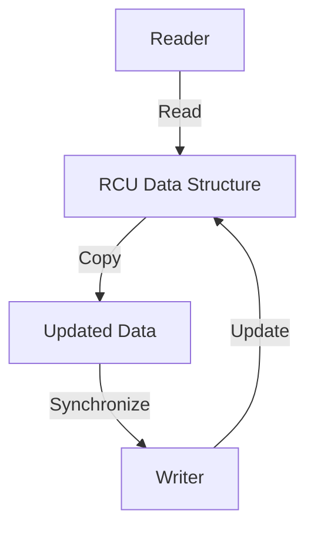

이 다이어그램은 RCU의 기본 작동 원리를 보여준다. Reader가 데이터 구조를 읽는 동안 Writer는 안전하게 업데이트를 수행할 수 있으며, 이 과정에서 데이터의 일관성을 유지할 수 있다. RCU는 이러한 방식으로 동시성을 관리하여 성능을 극대화하는 데 기여한다.

<!--
## 2. RCU의 기본 개념
   - RCU의 작동 원리
   - 데이터 구조에서의 RCU의 역할
   - RCU의 장점과 단점
-->

## RCU의 기본 개념

### RCU의 작동 원리

RCU(Read-Copy-Update)는 동시성 제어를 위한 메커니즘으로, 주로 읽기 작업이 많은 환경에서 성능을 극대화하기 위해 설계되었다. RCU의 기본 원리는 읽기 작업이 진행되는 동안 데이터 구조를 안전하게 업데이트할 수 있도록 하는 것이다. 이를 위해 RCU는 다음과 같은 단계를 따른다.

1. **읽기 작업**: RCU를 사용하는 스레드는 `rcu_read_lock()`을 호출하여 읽기 작업을 시작한다. 이때, 다른 스레드가 데이터를 수정할 수 없도록 보호된다.
2. **데이터 복사**: 업데이트가 필요한 경우, 기존 데이터를 복사하여 새로운 데이터를 생성한다. 이 과정에서 기존 데이터는 여전히 읽기 작업에 사용될 수 있다.
3. **업데이트 완료**: 새로운 데이터가 준비되면, `rcu_assign_pointer()`를 사용하여 포인터를 업데이트한다. 이때, 기존 데이터는 여전히 읽기 작업에 사용될 수 있다.
4. **동기화**: 모든 읽기 작업이 완료된 후, `synchronize_rcu()`를 호출하여 이전 데이터가 안전하게 해제될 수 있도록 한다.

이러한 방식으로 RCU는 읽기 작업과 쓰기 작업을 효과적으로 분리하여 성능을 향상시킨다.

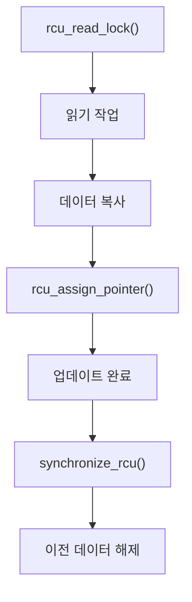

### 데이터 구조에서의 RCU의 역할

RCU는 다양한 데이터 구조에서 사용될 수 있으며, 특히 링크드 리스트, 해시 테이블, 트리 구조 등에서 효과적이다. RCU는 데이터 구조의 읽기 작업이 빈번하게 발생하는 경우에 유용하며, 다음과 같은 역할을 한다.

- **읽기 최적화**: RCU는 읽기 작업이 블록되지 않도록 하여, 다수의 스레드가 동시에 데이터를 읽을 수 있도록 한다.
- **안전한 업데이트**: 데이터 구조를 업데이트할 때, 기존 데이터를 안전하게 유지하면서 새로운 데이터를 추가할 수 있다.
- **메모리 관리**: RCU는 메모리 해제를 지연시켜, 읽기 작업이 완료된 후에만 이전 데이터를 해제할 수 있도록 한다.

이러한 특성 덕분에 RCU는 고성능의 동시성 제어를 제공하며, 특히 읽기 작업이 많은 시스템에서 유리하다.

### RCU의 장점과 단점

RCU는 여러 장점을 가지고 있지만, 몇 가지 단점도 존재한다. 다음은 RCU의 장점과 단점이다.

**장점**:
- **높은 성능**: 읽기 작업이 블록되지 않기 때문에, 다수의 스레드가 동시에 데이터를 읽을 수 있어 성능이 향상된다.
- **간단한 API**: RCU는 간단한 API를 제공하여 사용자가 쉽게 사용할 수 있도록 한다.
- **유연한 메모리 관리**: 메모리 해제를 지연시켜, 안전한 데이터 접근을 보장한다.

**단점**:
- **메모리 사용량 증가**: 데이터 복사 및 지연된 메모리 해제로 인해 메모리 사용량이 증가할 수 있다.
- **복잡한 구현**: RCU를 올바르게 구현하기 위해서는 동시성 및 메모리 모델에 대한 깊은 이해가 필요하다.
- **읽기 작업의 지연**: 업데이트가 진행되는 동안 읽기 작업이 지연될 수 있으며, 이는 성능 저하로 이어질 수 있다.

RCU는 이러한 장점과 단점을 고려하여 적절한 상황에서 사용해야 하며, 성능 최적화를 위해 다양한 기법을 적용할 수 있다.

<!--
## 3. RCU의 핵심 API
   - rcu_read_lock()
   - rcu_read_unlock()
   - synchronize_rcu()
   - call_rcu()
   - rcu_assign_pointer()
   - rcu_dereference()
   - RCU API의 사용 예시
-->

## RCU의 핵심 API

RCU(Read-Copy-Update)는 동시성 프로그래밍에서 중요한 역할을 하는 메커니즘이다. RCU의 핵심 API는 이 메커니즘을 효과적으로 활용하기 위해 필수적이다. 이번 섹션에서는 RCU의 주요 API에 대해 살펴보겠다.

### rcu_read_lock()

**rcu_read_lock()**은 RCU 읽기 세션을 시작하는 함수이다. 이 함수를 호출하면 현재 스레드는 RCU 읽기 세션에 들어가며, 이 세션 동안에는 데이터 구조에 대한 읽기 작업이 안전하게 수행될 수 있다. 이 함수는 RCU의 동시성 모델을 지원하기 위해 사용된다.

```c
rcu_read_lock();
// 데이터 구조에 대한 읽기 작업
rcu_read_unlock();
```

### rcu_read_unlock()

**rcu_read_unlock()**은 RCU 읽기 세션을 종료하는 함수이다. 이 함수를 호출하면 현재 스레드는 RCU 읽기 세션에서 나가게 되며, 이후에는 RCU 보호를 받지 않는 데이터 구조에 대한 작업을 수행할 수 있다.

```c
rcu_read_lock();
// 데이터 구조에 대한 읽기 작업
rcu_read_unlock();
```

### synchronize_rcu()

**synchronize_rcu()**는 모든 이전 RCU 읽기 세션이 완료될 때까지 대기하는 함수이다. 이 함수는 RCU 업데이트가 안전하게 완료되었음을 보장하기 위해 사용된다. 이 함수는 RCU 업데이트가 완료된 후에 안전하게 메모리를 해제할 수 있도록 도와준다.

```c
synchronize_rcu();
// 안전하게 메모리 해제
```

### call_rcu()

**call_rcu()**는 비동기적으로 콜백 함수를 호출하는 API이다. 이 함수는 RCU 업데이트가 완료된 후에 특정 작업을 수행해야 할 때 유용하다. 이 API는 RCU의 비동기 콜백 메커니즘을 활용하여, 업데이트 스레드가 블록되지 않도록 한다.

```c
void my_callback(struct rcu_head *head) {
    // 콜백 작업
}

call_rcu(&my_rcu_head, my_callback);
```

### rcu_assign_pointer()

**rcu_assign_pointer()**는 RCU 포인터를 안전하게 할당하는 함수이다. 이 함수는 RCU의 동시성 모델을 준수하면서 포인터를 할당할 수 있도록 도와준다. 이 API를 사용하면 RCU 보호를 받는 데이터 구조에 대한 안전한 포인터 할당이 가능하다.

```c
struct my_struct *ptr;
rcu_assign_pointer(ptr, new_value);
```

### rcu_dereference()

**rcu_dereference()**는 RCU 포인터를 안전하게 역참조하는 함수이다. 이 함수를 사용하면 RCU 보호를 받는 데이터 구조에 대한 안전한 접근이 가능하다. 이 API는 RCU의 동시성 모델을 준수하면서 데이터에 접근할 수 있도록 도와준다.

```c
struct my_struct *ptr = rcu_dereference(my_rcu_pointer);
```

### RCU API의 사용 예시

RCU API를 활용한 간단한 예시를 통해 RCU의 작동 방식을 이해할 수 있다. 아래는 RCU를 사용하여 링크드 리스트를 안전하게 업데이트하는 예시이다.

```c
struct my_node {
    int data;
    struct my_node *next;
};

struct my_node *head;

void update_list(int new_data) {
    struct my_node *new_node = kmalloc(sizeof(struct my_node), GFP_KERNEL);
    new_node->data = new_data;

    rcu_read_lock();
    struct my_node *old_head = rcu_dereference(head);
    new_node->next = old_head;
    rcu_assign_pointer(head, new_node);
    rcu_read_unlock();
}
```

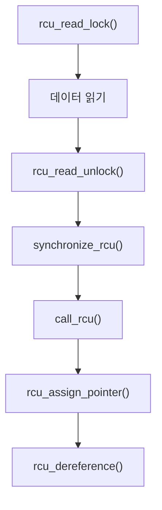

위의 다이어그램은 RCU API의 흐름을 시각적으로 나타낸 것이다. 각 API의 호출 순서를 통해 RCU의 작동 방식을 이해할 수 있다. RCU API는 동시성 프로그래밍에서 안전하고 효율적인 데이터 접근을 가능하게 해준다.

<!--
## 4. RCU의 활용 예제
   - RCU를 사용한 동적 구조체 업데이트
   - RCU를 사용한 링크드 리스트 보호
   - RCU를 사용한 NMI 핸들러 보호
-->

## RCU의 활용 예제

RCU(Read-Copy-Update)는 고성능 동시성 제어를 위한 강력한 메커니즘으로, 다양한 상황에서 유용하게 활용될 수 있다. 이번 섹션에서는 RCU를 사용한 몇 가지 활용 예제를 살펴보겠다.

### RCU를 사용한 동적 구조체 업데이트

RCU는 동적 구조체를 안전하게 업데이트하는 데 매우 유용하다. 예를 들어, 여러 스레드가 동시에 구조체를 읽고 업데이트할 때, RCU를 사용하면 읽기 작업이 블록되지 않으면서도 안전하게 업데이트를 수행할 수 있다. 아래는 RCU를 사용한 동적 구조체 업데이트의 간단한 예시이다.

```c
#include <linux/rcupdate.h>
#include <linux/slab.h>

struct my_struct {
    int data;
    struct rcu_head rcu;
};

void update_struct(struct my_struct **ptr, int new_data) {
    struct my_struct *new_struct;

    new_struct = kmalloc(sizeof(*new_struct), GFP_KERNEL);
    new_struct->data = new_data;

    rcu_assign_pointer(*ptr, new_struct);
    synchronize_rcu(); // 모든 RCU 읽기 작업이 완료될 때까지 대기
}

void free_struct(struct my_struct *ptr) {
    call_rcu(&ptr->rcu, kfree_rcu_callback);
}

void kfree_rcu_callback(struct rcu_head *head) {
    struct my_struct *ptr = container_of(head, struct my_struct, rcu);
    kfree(ptr);
}
```

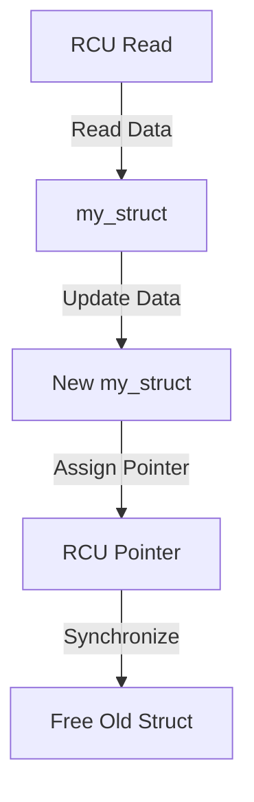

### RCU를 사용한 링크드 리스트 보호

링크드 리스트와 같은 데이터 구조에서 RCU를 사용하면, 여러 스레드가 동시에 리스트를 탐색하고 수정할 수 있다. RCU는 읽기 작업이 블록되지 않도록 하여 성능을 극대화할 수 있다. 아래는 RCU를 사용한 링크드 리스트 보호의 예시이다.

```c
struct list_node {
    int data;
    struct list_node *next;
    struct rcu_head rcu;
};

void add_node(struct list_node **head, int new_data) {
    struct list_node *new_node;

    new_node = kmalloc(sizeof(*new_node), GFP_KERNEL);
    new_node->data = new_data;

    rcu_assign_pointer(new_node->next, *head);
    rcu_assign_pointer(*head, new_node);
}

void remove_node(struct list_node **head, struct list_node *node_to_remove) {
    struct list_node *next_node;

    rcu_read_lock();
    next_node = rcu_dereference(node_to_remove->next);
    rcu_read_unlock();

    call_rcu(&node_to_remove->rcu, kfree_rcu_callback);
}
```

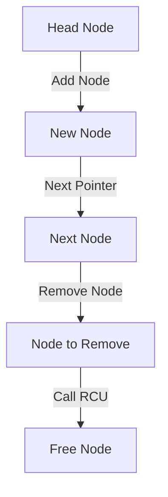

### RCU를 사용한 NMI 핸들러 보호

NMI(Non-Maskable Interrupt) 핸들러는 시스템의 중요한 부분으로, RCU를 사용하여 안전하게 보호할 수 있다. RCU는 NMI 핸들러가 실행되는 동안에도 데이터 구조에 대한 안전한 접근을 보장한다. 아래는 RCU를 사용한 NMI 핸들러 보호의 예시이다.

```c
struct nmi_data {
    int value;
    struct rcu_head rcu;
};

void nmi_handler(struct nmi_data *data) {
    rcu_read_lock();
    // 데이터에 대한 안전한 읽기 작업 수행
    int value = rcu_dereference(data)->value;
    rcu_read_unlock();
}

void update_nmi_data(struct nmi_data **data_ptr, int new_value) {
    struct nmi_data *new_data;

    new_data = kmalloc(sizeof(*new_data), GFP_KERNEL);
    new_data->value = new_value;

    rcu_assign_pointer(*data_ptr, new_data);
    synchronize_rcu();
}
```

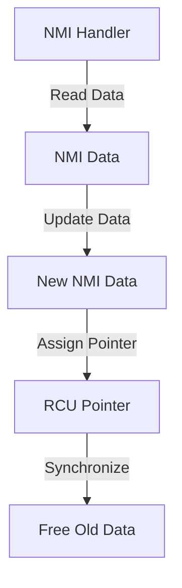

이와 같이 RCU는 다양한 상황에서 유용하게 활용될 수 있으며, 동시성 문제를 해결하는 데 큰 도움이 된다. RCU를 적절히 사용하면 성능을 극대화하면서도 안전한 데이터 접근을 보장할 수 있다.

<!--
## 5. 업데이트 스레드가 블록할 수 없는 경우
   - call_rcu()의 사용
   - 비동기 콜백 메커니즘
   - kfree_rcu()의 활용
-->

## 업데이트 스레드가 블록할 수 없는 경우

RCU(Read-Copy-Update) 메커니즘은 동시성 프로그래밍에서 중요한 역할을 하며, 특히 업데이트 스레드가 블록할 수 없는 경우에 유용하다. 이 섹션에서는 `call_rcu()`의 사용, 비동기 콜백 메커니즘, 그리고 `kfree_rcu()`의 활용에 대해 설명하겠다.

### call_rcu()의 사용

`call_rcu()` 함수는 RCU의 핵심 기능 중 하나로, 특정 데이터 구조를 안전하게 해제할 수 있도록 비동기적으로 콜백을 등록하는 데 사용된다. 이 함수는 업데이트 스레드가 블록되지 않도록 하여, 데이터 구조의 안전한 해제를 보장한다. 

다음은 `call_rcu()`의 사용 예시이다.

```c
#include <linux/rcupdate.h>
#include <linux/slab.h>

struct my_data {
    int value;
    struct rcu_head rcu;
};

void my_callback(struct rcu_head *head) {
    struct my_data *data = container_of(head, struct my_data, rcu);
    kfree(data);
}

void update_data(struct my_data *data) {
    // 데이터 업데이트 로직
    call_rcu(&data->rcu, my_callback);
}
```

위의 코드에서 `update_data()` 함수는 데이터 구조를 업데이트한 후, `call_rcu()`를 호출하여 비동기적으로 `my_callback()`을 등록한다. 이 콜백은 RCU의 동기화가 완료된 후에 호출되어 메모리를 안전하게 해제한다.

### 비동기 콜백 메커니즘

비동기 콜백 메커니즘은 RCU의 중요한 특징으로, 업데이트 스레드가 블록되지 않도록 한다. 이 메커니즘을 통해, 데이터 구조의 해제는 RCU의 동기화가 완료된 후에 이루어지며, 이는 시스템의 성능을 향상시킨다.

비동기 콜백은 다음과 같은 과정을 거친다:

1. 데이터 구조가 업데이트된다.
2. `call_rcu()`를 통해 콜백이 등록된다.
3. RCU의 동기화가 완료되면, 등록된 콜백이 호출된다.

이러한 방식으로, 업데이트 스레드는 블록되지 않으며, 다른 스레드가 데이터 구조에 접근할 수 있는 동안 안전하게 메모리를 해제할 수 있다.

### kfree_rcu()의 활용

`kfree_rcu()` 함수는 RCU를 사용하여 메모리를 해제하는 또 다른 방법이다. 이 함수는 `call_rcu()`와 유사하게 작동하지만, 메모리 해제를 더 간편하게 처리할 수 있도록 돕는다. 

다음은 `kfree_rcu()`의 사용 예시이다.

```c
void update_data_and_free(struct my_data *data) {
    // 데이터 업데이트 로직
    kfree_rcu(data, rcu);
}
```

위의 코드에서 `kfree_rcu()`는 데이터 구조를 업데이트한 후, RCU의 동기화가 완료되면 자동으로 메모리를 해제한다. 이로 인해 개발자는 메모리 해제를 위한 추가적인 콜백을 작성할 필요가 없어진다.

### 다이어그램

다음은 RCU의 비동기 콜백 메커니즘을 설명하는 다이어그램이다.

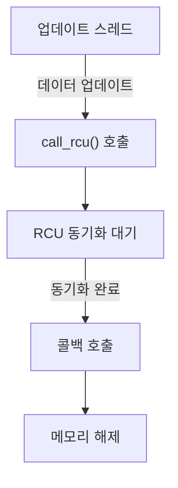

이 다이어그램은 업데이트 스레드가 데이터 구조를 업데이트하고, `call_rcu()`를 호출한 후, RCU의 동기화가 완료되면 콜백이 호출되어 메모리가 해제되는 과정을 보여준다. 

이와 같이 RCU는 업데이트 스레드가 블록되지 않도록 하여, 동시성 프로그래밍에서의 성능을 극대화하는 데 기여한다.

<!--
## 6. RCU의 간단한 구현 예시
   - "장난감" RCU 구현 1: 락 기반
   - "장난감" RCU 구현 2: 고전적인 RCU
   - 실제 RCU 구현과의 비교
-->

## RCU의 간단한 구현 예시

RCU(Read-Copy-Update)는 고성능 동시성 제어 메커니즘으로, 다양한 구현 방식이 존재한다. 이번 섹션에서는 RCU의 간단한 구현 예시를 통해 그 작동 방식을 이해하고, 실제 RCU 구현과의 차이점을 살펴보겠다.

### "장난감" RCU 구현 1: 락 기반

락 기반 RCU 구현은 전통적인 락 메커니즘을 사용하여 데이터 접근을 제어하는 방식이다. 이 구현에서는 읽기 작업이 락을 획득하고, 쓰기 작업이 락을 해제할 때까지 다른 스레드가 해당 데이터에 접근할 수 없도록 한다. 아래는 간단한 락 기반 RCU 구현의 예시이다.

```c
#include <pthread.h>
#include <stdio.h>
#include <stdlib.h>

typedef struct {
    int data;
    pthread_mutex_t lock;
} rcu_t;

void rcu_init(rcu_t *rcu) {
    rcu->data = 0;
    pthread_mutex_init(&rcu->lock, NULL);
}

void rcu_read_lock(rcu_t *rcu) {
    pthread_mutex_lock(&rcu->lock);
}

void rcu_read_unlock(rcu_t *rcu) {
    pthread_mutex_unlock(&rcu->lock);
}

void rcu_update(rcu_t *rcu, int new_data) {
    rcu_read_lock(rcu);
    rcu->data = new_data;
    rcu_read_unlock(rcu);
}

int rcu_get_data(rcu_t *rcu) {
    return rcu->data;
}
```

이 구현은 간단하지만, 락을 사용하기 때문에 성능이 저하될 수 있다. 특히, 많은 읽기 작업이 동시에 발생할 경우 락 경합이 발생할 수 있다.

### "장난감" RCU 구현 2: 고전적인 RCU

고전적인 RCU 구현은 읽기 작업이 락을 사용하지 않고, 쓰기 작업이 데이터의 복사본을 생성하여 업데이트하는 방식이다. 이 방식은 읽기 작업이 매우 빠르며, 쓰기 작업이 완료된 후에만 데이터가 교체된다. 아래는 고전적인 RCU 구현의 예시이다.

```c
#include <stdio.h>
#include <stdlib.h>

typedef struct rcu_node {
    int data;
    struct rcu_node *next;
} rcu_node_t;

rcu_node_t *rcu_head = NULL;

void rcu_update(int new_data) {
    rcu_node_t *new_node = malloc(sizeof(rcu_node_t));
    new_node->data = new_data;
    new_node->next = rcu_head;
    rcu_head = new_node;
}

int rcu_get_data() {
    return rcu_head->data;
}
```

이 구현은 읽기 작업이 락을 사용하지 않기 때문에 성능이 우수하다. 그러나 메모리 관리에 주의해야 하며, 쓰기 작업이 완료된 후에 이전 노드를 안전하게 해제해야 한다.

### 실제 RCU 구현과의 비교

실제 RCU 구현은 위의 두 가지 방식의 장점을 결합하여, 읽기 작업의 성능을 극대화하고 쓰기 작업의 안전성을 보장한다. 실제 RCU는 다음과 같은 특징을 가진다.

- **비동기 콜백**: 쓰기 작업이 완료된 후, 이전 데이터에 대한 참조가 더 이상 필요하지 않을 때 비동기적으로 메모리를 해제한다.
- **동시성**: 읽기 작업이 락 없이 수행되므로, 높은 동시성을 제공한다.
- **안전성**: 데이터의 일관성을 유지하면서도, 메모리 접근을 안전하게 관리한다.

아래는 RCU의 작동 방식을 나타내는 다이어그램이다.

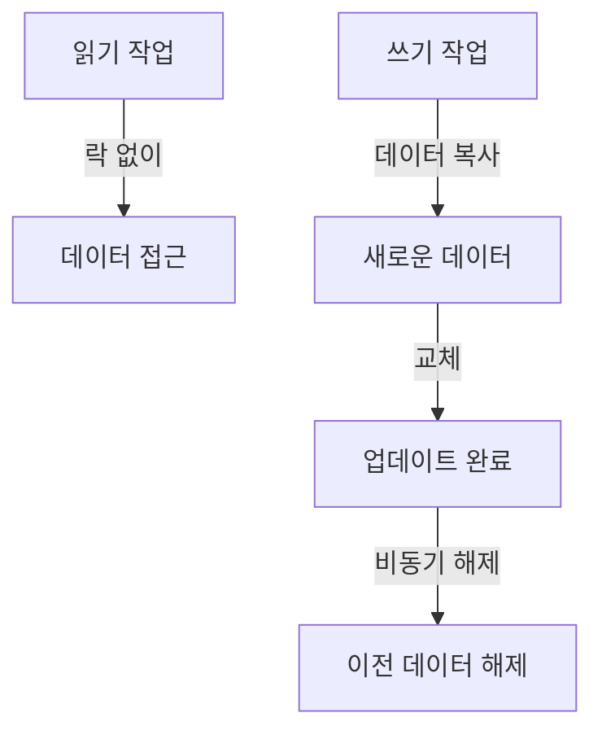

이와 같이 RCU의 간단한 구현 예시는 RCU의 기본 개념을 이해하는 데 도움을 주며, 실제 구현에서의 성능과 안전성을 비교하는 데 유용하다.

<!--
## 7. RCU와 Reader-Writer Lock의 유사성
   - Reader-Writer Lock과 RCU의 비교
   - RCU의 동시성 처리 방식
   - RCU의 성능 최적화
-->

## RCU와 Reader-Writer Lock의 유사성

### Reader-Writer Lock과 RCU의 비교

Reader-Writer Lock과 RCU는 모두 동시성 제어를 위한 메커니즘으로, 다수의 읽기 작업과 적은 수의 쓰기 작업이 동시에 발생하는 상황에서 성능을 최적화하는 데 중점을 둔다. Reader-Writer Lock은 읽기 작업이 진행되는 동안 다른 읽기 작업은 허용하지만, 쓰기 작업이 진행될 때는 모든 읽기 작업과 쓰기 작업이 차단된다. 반면, RCU는 읽기 작업이 진행되는 동안 쓰기 작업이 안전하게 수행될 수 있도록 설계되어 있다. RCU는 읽기 작업이 완료될 때까지 쓰기 작업이 지연되지만, 읽기 작업은 블록되지 않기 때문에 높은 동시성을 제공한다.

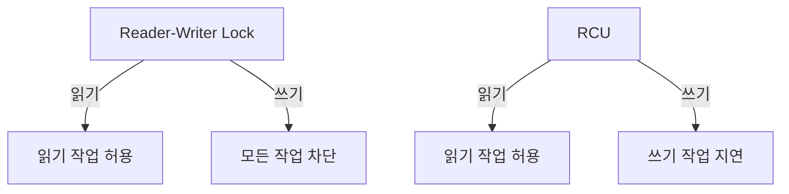

### RCU의 동시성 처리 방식

RCU는 읽기 작업이 진행되는 동안 데이터 구조의 상태를 변경할 수 있는 독특한 방식을 제공한다. RCU의 핵심은 읽기 작업이 완료될 때까지 쓰기 작업이 지연되도록 하여, 읽기 작업이 안전하게 데이터를 참조할 수 있도록 하는 것이다. 이를 통해 RCU는 높은 동시성을 유지하면서도 데이터의 일관성을 보장할 수 있다. RCU는 주로 다음과 같은 방식으로 동시성을 처리한다.

1. **읽기 작업**: rcu_read_lock()과 rcu_read_unlock()을 사용하여 읽기 작업을 시작하고 종료한다. 이 사이에 데이터에 대한 읽기가 이루어진다.
2. **쓰기 작업**: 쓰기 작업은 데이터 구조를 수정하기 전에 synchronize_rcu()를 호출하여 모든 현재 진행 중인 읽기 작업이 완료될 때까지 대기한다.
3. **콜백 처리**: call_rcu()를 사용하여 비동기적으로 메모리 해제를 처리할 수 있다.

### RCU의 성능 최적화

RCU는 성능 최적화를 위해 여러 가지 기법을 사용한다. 그 중 일부는 다음과 같다.

- **비동기 콜백**: RCU는 call_rcu()를 통해 비동기적으로 메모리 해제를 처리하여, 쓰기 작업이 완료된 후에도 읽기 작업이 계속 진행될 수 있도록 한다.
- **지연된 메모리 해제**: synchronize_rcu()를 사용하여 모든 읽기 작업이 완료된 후에만 메모리를 해제함으로써, 메모리 접근의 안전성을 높인다.
- **경량화된 락**: RCU는 락을 사용하지 않거나 최소화하여, 쓰기 작업의 오버헤드를 줄이고 성능을 향상시킨다.

이러한 최적화 기법들은 RCU가 높은 동시성을 유지하면서도 성능을 극대화할 수 있도록 돕는다. RCU는 특히 읽기 작업이 많은 환경에서 뛰어난 성능을 발휘하며, 다양한 데이터 구조에서 효과적으로 활용될 수 있다.

<!--
## 8. RCU와 Reference Counting의 유사성
   - Reference Counting의 개념
   - RCU가 Reference Counting을 어떻게 보완하는지
   - RCU를 통한 안전한 데이터 접근
-->

## RCU와 Reference Counting의 유사성

### Reference Counting의 개념

Reference Counting은 객체의 사용 횟수를 추적하는 메커니즘이다. 각 객체는 참조 카운터를 가지고 있으며, 객체에 대한 참조가 생성될 때 카운터가 증가하고, 참조가 해제될 때 카운터가 감소한다. 카운터가 0이 되면 해당 객체는 더 이상 사용되지 않으므로 메모리에서 해제될 수 있다. 이 방식은 메모리 관리에서 유용하지만, 동시성 문제를 해결하기 위해 추가적인 동기화가 필요하다.

### RCU가 Reference Counting을 어떻게 보완하는지

RCU는 Reference Counting의 단점을 보완하는 데 도움을 준다. Reference Counting은 객체의 참조가 해제될 때 즉시 메모리를 해제하는 반면, RCU는 읽기 작업이 진행되는 동안 객체가 안전하게 유지될 수 있도록 한다. RCU는 읽기 작업이 완료될 때까지 객체를 유지하고, 그 후에 메모리를 해제할 수 있도록 하여 동시성 문제를 최소화한다. 이로 인해 RCU는 높은 성능을 유지하면서도 안전한 데이터 접근을 가능하게 한다.

### RCU를 통한 안전한 데이터 접근

RCU를 사용하면 여러 스레드가 동시에 데이터를 읽을 수 있으며, 데이터의 업데이트는 별도의 스레드에서 안전하게 수행될 수 있다. 이를 통해 데이터의 일관성을 유지하면서도 성능을 극대화할 수 있다. RCU는 읽기 작업이 진행되는 동안 데이터의 상태를 변경하지 않기 때문에, 읽기 작업이 완료된 후에만 데이터의 변경이 이루어질 수 있다.

아래는 RCU를 사용한 안전한 데이터 접근을 보여주는 간단한 코드 예시이다.

```c
#include <linux/rcupdate.h>
#include <linux/slab.h>

struct data {
    int value;
    struct rcu_head rcu;
};

struct data *my_data;

void update_data(int new_value) {
    struct data *new_data;

    new_data = kmalloc(sizeof(struct data), GFP_KERNEL);
    new_data->value = new_value;

    rcu_assign_pointer(my_data, new_data);
    call_rcu(&new_data->rcu, free_data);
}

void free_data(struct rcu_head *rcu) {
    struct data *data = container_of(rcu, struct data, rcu);
    kfree(data);
}

int read_data(void) {
    struct data *data;

    rcu_read_lock();
    data = rcu_dereference(my_data);
    int value = data->value;
    rcu_read_unlock();

    return value;
}
```

위의 코드에서 `update_data` 함수는 새로운 데이터를 생성하고, `rcu_assign_pointer`를 사용하여 포인터를 안전하게 업데이트한다. `read_data` 함수는 `rcu_read_lock`과 `rcu_read_unlock`을 사용하여 안전하게 데이터를 읽는다. 이와 같은 방식으로 RCU는 Reference Counting의 단점을 보완하며, 안전한 데이터 접근을 가능하게 한다.

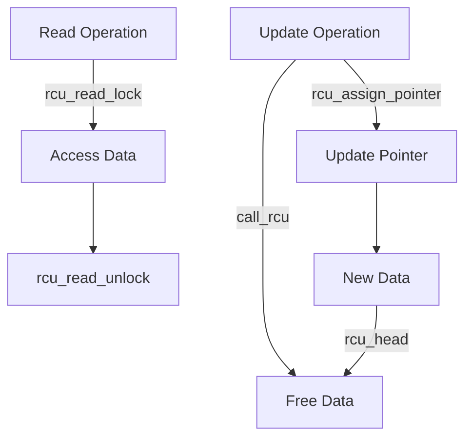

위의 다이어그램은 RCU의 작동 방식을 시각적으로 나타낸 것이다. 읽기 작업과 업데이트 작업이 어떻게 상호작용하는지를 보여준다. RCU는 동시성 문제를 해결하면서도 성능을 유지할 수 있는 강력한 메커니즘이다.

<!--
## 9. RCU API의 전체 목록
   - RCU 리스트 탐색 API
   - RCU 포인터/리스트 업데이트 API
   - RCU 관련 API 카테고리
-->

## RCU API의 전체 목록

RCU (Read-Copy-Update) API는 RCU 메커니즘을 활용하여 데이터 구조를 안전하게 업데이트하고 탐색할 수 있도록 돕는 함수들로 구성되어 있다. 이 섹션에서는 RCU API의 주요 카테고리와 각 API의 기능에 대해 설명하겠다.

### RCU 리스트 탐색 API

RCU 리스트 탐색 API는 RCU를 사용하여 안전하게 리스트를 탐색할 수 있도록 지원한다. 이 API는 주로 읽기 작업을 수행하는 스레드에서 사용되며, 데이터의 일관성을 보장한다. 

**rcu_dereference()**: 이 함수는 RCU 보호 하에 있는 포인터를 안전하게 역참조하는 데 사용된다. 이 함수를 사용하면, 읽기 작업이 진행되는 동안 데이터가 변경되지 않도록 보장할 수 있다.

```c
struct my_struct *ptr;
ptr = rcu_dereference(my_rcu_pointer);
```

**rcu_assign_pointer()**: 이 함수는 RCU 보호 하에 있는 포인터를 안전하게 할당하는 데 사용된다. 이 함수를 사용하면, 포인터의 할당이 다른 스레드에 의해 읽히는 동안 안전하게 이루어질 수 있다.

```c
rcu_assign_pointer(my_rcu_pointer, new_ptr);
```

### RCU 포인터/리스트 업데이트 API

RCU 포인터 및 리스트 업데이트 API는 데이터 구조를 안전하게 업데이트하는 데 필요한 함수들로 구성되어 있다. 이 API는 주로 쓰기 작업을 수행하는 스레드에서 사용된다.

**call_rcu()**: 이 함수는 비동기적으로 콜백 함수를 호출하여 RCU 보호 하에 있는 데이터 구조를 안전하게 해제할 수 있도록 한다. 이 함수는 업데이트가 완료된 후에 메모리를 해제하는 데 유용하다.

```c
call_rcu(&my_rcu_struct->rcu_head, my_callback_function);
```

**synchronize_rcu()**: 이 함수는 모든 RCU 읽기 작업이 완료될 때까지 대기하는 데 사용된다. 이 함수는 데이터 구조의 안전한 업데이트를 보장하기 위해 필요하다.

```c
synchronize_rcu();
```

### RCU 관련 API 카테고리

RCU API는 여러 카테고리로 나눌 수 있으며, 각 카테고리는 특정한 기능을 수행한다. 주요 카테고리는 다음과 같다.

- **읽기 API**: 데이터 구조를 안전하게 읽기 위한 API로, rcu_dereference()와 rcu_read_lock()/rcu_read_unlock()이 포함된다.
- **쓰기 API**: 데이터 구조를 안전하게 업데이트하기 위한 API로, rcu_assign_pointer(), call_rcu(), synchronize_rcu()가 포함된다.
- **유틸리티 API**: RCU의 동작을 보조하는 다양한 유틸리티 함수들이 포함된다.

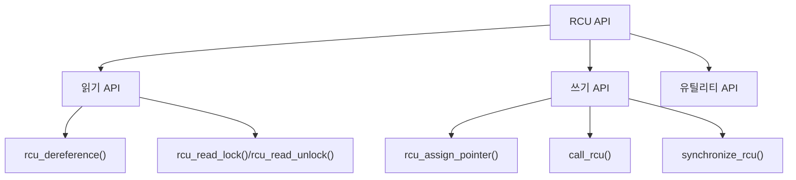

이와 같이 RCU API는 데이터 구조의 안전한 탐색과 업데이트를 위한 다양한 기능을 제공한다. 각 API는 특정한 상황에서 유용하게 사용될 수 있으며, RCU의 장점을 극대화하는 데 기여한다.

<!--
## 10. RCU 사용 시 고려사항
   - RCU를 사용할 때의 주의사항
   - RCU의 성능 최적화 방법
   - RCU의 적절한 사용 사례
-->

## RCU 사용 시 고려사항

### RCU를 사용할 때의 주의사항

RCU (Read-Copy-Update)를 사용할 때는 몇 가지 주의사항이 있다. 첫째, RCU는 주로 읽기 작업이 많은 환경에서 효과적이다. 따라서 쓰기 작업이 빈번한 경우에는 RCU의 이점을 충분히 활용하기 어려울 수 있다. 둘째, RCU의 사용은 메모리 관리와 관련된 복잡성을 증가시킬 수 있다. 예를 들어, RCU를 사용하여 메모리를 해제할 때는 synchronize_rcu()를 호출하여 모든 읽기 작업이 완료된 후에야 메모리를 해제해야 한다. 이를 간과하면 메모리 접근 오류가 발생할 수 있다.

### RCU의 성능 최적화 방법

RCU의 성능을 최적화하기 위해서는 몇 가지 방법을 고려할 수 있다. 첫째, RCU의 읽기 작업을 최적화하기 위해 rcu_read_lock()과 rcu_read_unlock()을 적절히 사용하여 불필요한 잠금을 피해야 한다. 둘째, RCU의 콜백 메커니즘을 활용하여 비동기적으로 메모리를 해제하는 것이 좋다. 이를 통해 쓰기 작업이 블록되지 않도록 할 수 있다. 마지막으로, RCU의 사용 패턴을 분석하여 불필요한 업데이트를 줄이는 것이 성능 향상에 기여할 수 있다.

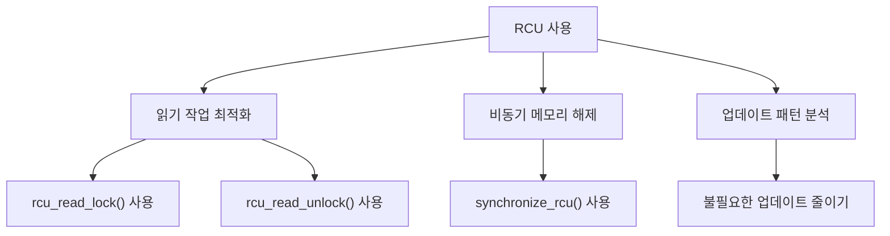

### RCU의 적절한 사용 사례

RCU는 특정 사용 사례에서 특히 유용하다. 예를 들어, 커널 모듈에서의 데이터 구조 보호, 고속 캐시 시스템, 그리고 대규모 멀티스레드 애플리케이션에서의 데이터 접근 관리에 적합하다. 또한, RCU는 읽기 작업이 빈번하고 쓰기 작업이 드문 경우에 최적의 성능을 발휘한다. 이러한 특성 덕분에 RCU는 리눅스 커널과 같은 고성능 시스템에서 널리 사용되고 있다.

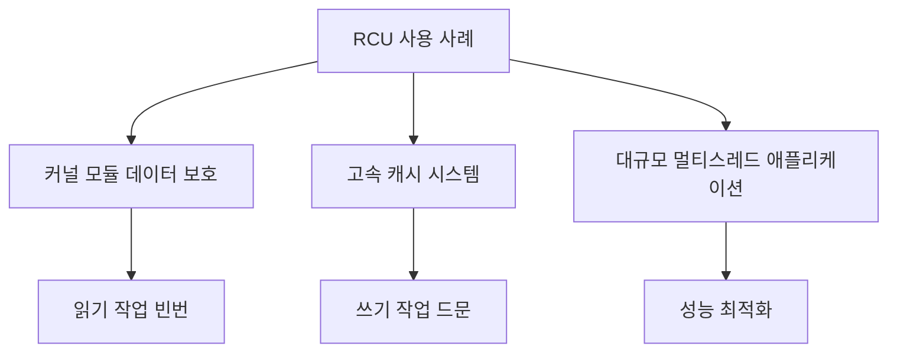

RCU를 사용할 때는 이러한 고려사항을 염두에 두고 적절한 사용 사례를 선택하는 것이 중요하다. 이를 통해 RCU의 장점을 최대한 활용할 수 있다.

<!--
## 11. FAQ
   - RCU와 다른 동기화 메커니즘의 차이점은 무엇인가요?
   - RCU를 사용할 때의 일반적인 실수는 무엇인가요?
   - RCU의 성능을 어떻게 측정하나요?
-->

## FAQ

### RCU와 다른 동기화 메커니즘의 차이점은 무엇인가요?

RCU (Read-Copy-Update)는 다른 동기화 메커니즘과 비교했을 때 몇 가지 독특한 특징을 가지고 있다. 일반적인 동기화 메커니즘은 락(lock)을 사용하여 데이터 접근을 제어하는 반면, RCU는 읽기 작업이 진행되는 동안 데이터의 업데이트를 지연시켜 성능을 최적화한다. 

RCU는 주로 읽기 작업이 많은 환경에서 유리하며, 읽기 작업이 락을 필요로 하지 않기 때문에 높은 동시성을 제공한다. 반면, 락 기반 메커니즘은 읽기와 쓰기 작업 모두에 대해 락을 걸어야 하므로 성능 저하가 발생할 수 있다. 

아래는 RCU와 락 기반 동기화 메커니즘의 비교를 나타낸 다이어그램이다.

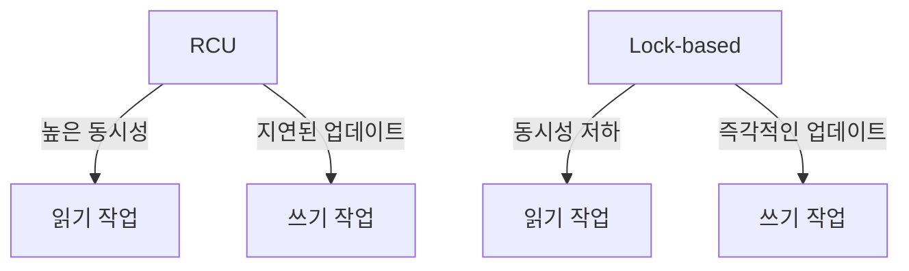

### RCU를 사용할 때의 일반적인 실수는 무엇인가요?

RCU를 사용할 때 흔히 발생하는 실수는 다음과 같다:

1. **rcu_read_lock()과 rcu_read_unlock()의 불일치**: RCU의 읽기 세션을 시작할 때는 반드시 rcu_read_lock()을 호출하고, 세션이 끝난 후에는 rcu_read_unlock()을 호출해야 한다. 이를 누락하면 데이터 일관성이 깨질 수 있다.

2. **synchronize_rcu()의 오용**: synchronize_rcu()는 모든 RCU 읽기 세션이 완료될 때까지 대기하는 함수이다. 이 함수를 잘못 사용하면 성능 저하를 초래할 수 있다.

3. **비동기 콜백의 잘못된 사용**: call_rcu()를 사용하여 비동기 콜백을 등록할 때, 콜백 함수가 올바르게 작성되지 않으면 메모리 누수나 데이터 손상이 발생할 수 있다.

### RCU의 성능을 어떻게 측정하나요?

RCU의 성능을 측정하는 방법은 여러 가지가 있다. 일반적으로 다음과 같은 지표를 사용한다:

1. **읽기 및 쓰기 성능**: RCU의 주요 장점은 읽기 작업의 성능이다. 읽기와 쓰기 작업의 처리 시간을 측정하여 RCU의 성능을 평가할 수 있다.

2. **동시성**: RCU는 높은 동시성을 제공하므로, 여러 스레드가 동시에 읽기 작업을 수행할 때의 성능을 측정하는 것이 중요하다.

3. **메모리 사용량**: RCU는 메모리 사용량에 영향을 미칠 수 있다. 메모리 사용량을 모니터링하여 RCU의 효율성을 평가할 수 있다.

아래는 RCU 성능 측정을 위한 샘플 코드이다.

```c
#include <linux/rcupdate.h>
#include <linux/slab.h>

void rcu_example(void) {
    rcu_read_lock();
    // 데이터 읽기 작업
    rcu_read_unlock();
    
    synchronize_rcu(); // 모든 RCU 읽기 세션이 완료될 때까지 대기
}
```

이와 같은 방법으로 RCU의 성능을 측정하고, 최적화할 수 있는 기회를 찾을 수 있다. RCU는 적절히 사용될 경우 높은 성능을 발휘할 수 있는 강력한 동기화 메커니즘이다.

<!--
## 12. 관련 기술
   - Lock-Free 데이터 구조
   - Concurrent Programming
   - Linux Kernel의 동기화 메커니즘
-->

## 관련 기술

### Lock-Free 데이터 구조

Lock-Free 데이터 구조는 멀티스레드 환경에서 동기화 문제를 해결하기 위해 설계된 데이터 구조이다. 이러한 구조는 스레드가 서로의 작업을 방해하지 않고도 안전하게 데이터를 읽고 쓸 수 있도록 한다. Lock-Free 구조는 일반적으로 Atomic Operations를 사용하여 구현되며, 이는 스레드 간의 경합을 최소화하고 성능을 향상시킨다.

Lock-Free 데이터 구조의 주요 장점은 다음과 같다.

- **높은 성능**: Lock-Free 구조는 스레드가 블록되지 않기 때문에, 높은 동시성을 제공한다.
- **데드락 방지**: Lock-Free 구조는 스레드가 서로를 기다리지 않기 때문에 데드락이 발생하지 않는다.

아래는 Lock-Free 스택의 간단한 구현 예시이다.

```c
#include <stdatomic.h>
#include <stdlib.h>

typedef struct Node {
    int value;
    struct Node* next;
} Node;

typedef struct LockFreeStack {
    Node* head;
} LockFreeStack;

void push(LockFreeStack* stack, int value) {
    Node* new_node = (Node*)malloc(sizeof(Node));
    new_node->value = value;
    do {
        new_node->next = stack->head;
    } while (!atomic_compare_exchange_weak(&stack->head, &new_node->next, new_node));
}

int pop(LockFreeStack* stack) {
    Node* old_head;
    do {
        old_head = stack->head;
        if (old_head == NULL) {
            return -1; // 스택이 비어있음
        }
    } while (!atomic_compare_exchange_weak(&stack->head, &old_head, old_head->next));
    int value = old_head->value;
    free(old_head);
    return value;
}
```

### Concurrent Programming

Concurrent Programming은 여러 프로세스나 스레드가 동시에 실행되는 프로그램을 작성하는 기법이다. 이 기법은 멀티코어 프로세서의 성능을 극대화하고, 사용자 경험을 향상시키기 위해 필수적이다. Concurrent Programming에서는 스레드 간의 데이터 공유와 동기화가 중요한 이슈로 다루어진다.

RCU는 Concurrent Programming의 한 형태로, 읽기 작업이 많은 환경에서 성능을 극대화하는 데 유용하다. RCU는 읽기 작업이 블록되지 않도록 하여, 동시성 문제를 해결하는 데 도움을 준다.

아래는 Concurrent Programming의 기본 개념을 설명하는 다이어그램이다.

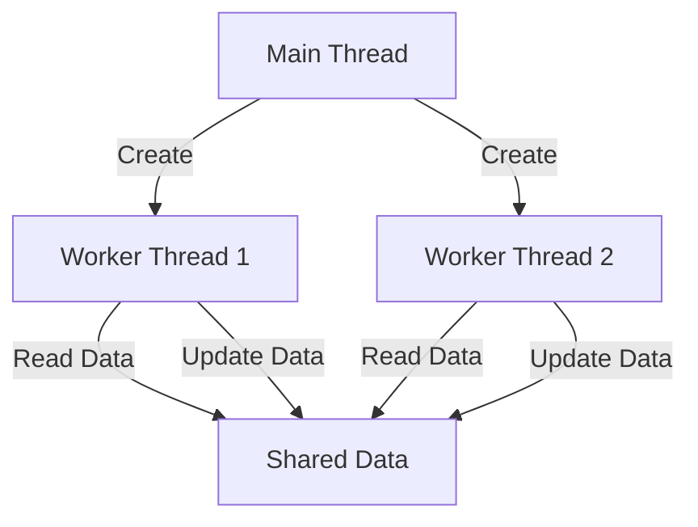

### Linux Kernel의 동기화 메커니즘

Linux Kernel은 멀티스레드 환경에서 데이터 일관성을 유지하기 위해 다양한 동기화 메커니즘을 제공한다. 이들 메커니즘은 주로 Lock, Semaphore, RCU와 같은 기법으로 구성된다. 각 기법은 특정 상황에서의 성능과 효율성을 고려하여 선택된다.

RCU는 특히 읽기 작업이 많은 상황에서 유용하며, 데이터 구조의 업데이트가 필요할 때도 효율적으로 작동한다. RCU는 읽기 작업이 블록되지 않도록 하여, 시스템의 전반적인 성능을 향상시킨다.

아래는 Linux Kernel의 동기화 메커니즘을 설명하는 다이어그램이다.

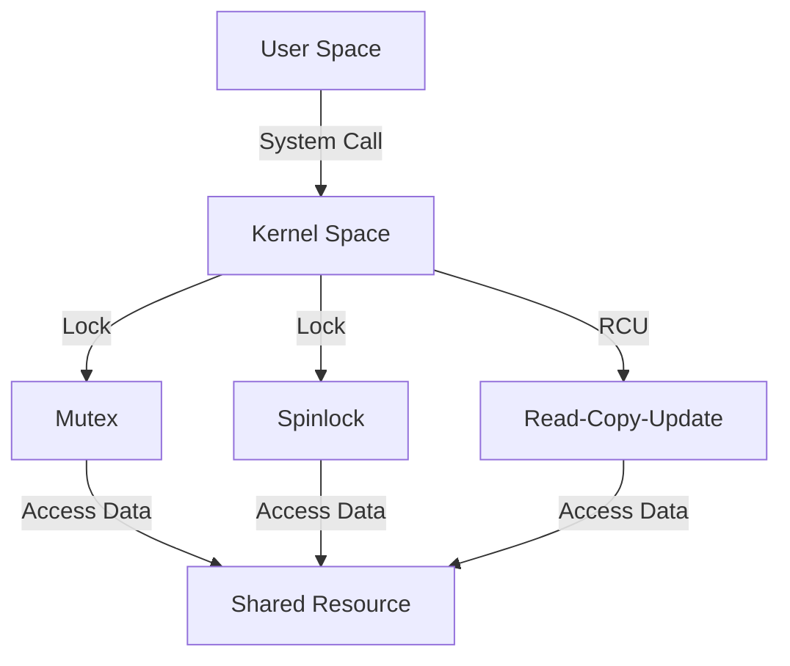

이와 같이 Lock-Free 데이터 구조, Concurrent Programming, 그리고 Linux Kernel의 동기화 메커니즘은 RCU와 밀접한 관련이 있으며, 멀티스레드 환경에서의 성능 최적화에 기여한다.

<!--
## 13. 결론
   - RCU의 중요성과 미래
   - RCU의 발전 방향
   - RCU를 통한 성능 향상 가능성
-->

## 결론

### RCU의 중요성과 미래

Read-Copy-Update (RCU) 기술은 현대의 고성능 시스템에서 필수적인 동기화 메커니즘으로 자리잡고 있다. RCU는 읽기 작업이 빈번하고 쓰기 작업이 드문 환경에서 특히 유용하다. 이는 데이터 구조에 대한 읽기 작업이 동시에 이루어질 수 있도록 하여, 성능을 극대화하는 데 기여한다. 앞으로도 RCU는 멀티코어 프로세서와 분산 시스템의 발전에 따라 더욱 중요해질 것으로 예상된다. 특히, 실시간 시스템이나 고성능 컴퓨팅 환경에서 RCU의 활용은 더욱 증가할 것이다.

### RCU의 발전 방향

RCU 기술은 지속적으로 발전하고 있으며, 새로운 사용 사례와 최적화 기법이 연구되고 있다. 예를 들어, RCU의 비동기 콜백 메커니즘은 더욱 효율적인 메모리 관리와 성능 향상을 가능하게 하고 있다. 또한, RCU와 다른 동기화 메커니즘 간의 통합 연구도 활발히 진행되고 있어, 다양한 환경에서의 적용 가능성이 높아지고 있다. 이러한 발전은 RCU의 유연성과 확장성을 더욱 강화할 것이다.

### RCU를 통한 성능 향상 가능성

RCU는 성능 향상에 기여하는 여러 가지 방법을 제공한다. 예를 들어, RCU를 사용하면 데이터 구조의 업데이트가 비차단 방식으로 이루어지므로, 읽기 작업이 지연되지 않고 빠르게 처리될 수 있다. 아래는 RCU를 활용한 성능 향상 예시를 보여주는 간단한 다이어그램이다.

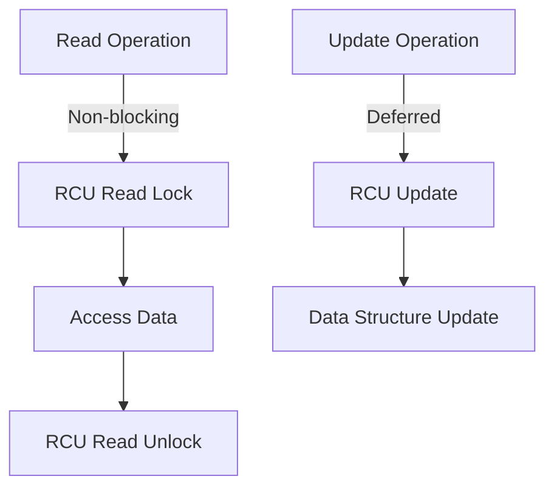

위의 다이어그램은 RCU의 읽기 작업이 비차단 방식으로 이루어지는 과정을 보여준다. 이와 같은 방식으로 RCU는 성능을 극대화할 수 있는 기회를 제공한다. 따라서 RCU는 앞으로도 다양한 시스템에서 성능 향상을 위한 중요한 도구로 자리잡을 것이다.

<!--
## 14. 참고 자료
   - RCU 관련 논문 및 자료
   - RCU에 대한 추가 학습 자료
   - RCU 관련 커뮤니티 및 포럼
-->


<!--
##### Reference #####
-->

## Reference


* [https://www.kernel.org/doc/html/next/RCU/whatisRCU.html](https://www.kernel.org/doc/html/next/RCU/whatisRCU.html)


<!--
#  What is RCU? -- “Read, Copy, Update”

Please note that the “What is RCU?” LWN series is an excellent place to start
learning about RCU:

For those preferring video:

What is RCU?

RCU is a synchronization mechanism that was added to the Linux kernel during
the 2.5 development effort that is optimized for read-mostly situations.
Although RCU is actually quite simple, making effective use of it requires you
to think differently about your code. Another part of the problem is the
mistaken assumption that there is “one true way” to describe and to use RCU.
Instead, the experience has been that different people must take different
paths to arrive at an understanding of RCU, depending on their experiences and
use cases. This document provides several different paths, as follows:

1\. RCU OVERVIEW

2\. WHAT IS RCU’S CORE API?

3\. WHAT ARE SOME EXAMPLE USES OF CORE RCU API?

4\. WHAT IF MY UPDATING THREAD CANNOT BLOCK?

5\. WHAT ARE SOME SIMPLE IMPLEMENTATIONS OF RCU?

6\. ANALOGY WITH READER-WRITER LOCKING

7\. ANALOGY WITH REFERENCE COUNTING

8\. FULL LIST OF RCU APIs

9\. ANSWERS TO QUICK QUIZZES

People who prefer starting with a conceptual overview should focus on Section
1, though most readers will profit by reading this section at some point.
People who prefer to start with an API that they can then experiment with
should focus on Section 2. People who prefer to start with example uses should
focus on Sections 3 and 4. People who need to understand the RCU
implementation should focus on Section 5, then dive into the kernel source
code. People who reason best by analogy should focus on Section 6 and 7.
Section 8 serves as an index to the docbook API documentation, and Section 9
is the traditional answer key.

So, start with the section that makes the most sense to you and your preferred
method of learning. If you need to know everything about everything, feel free
to read the whole thing -- but if you are really that type of person, you have
perused the source code and will therefore never need this document anyway.
;-)

##  1\. RCU OVERVIEW

The basic idea behind RCU is to split updates into “removal” and “reclamation”
phases. The removal phase removes references to data items within a data
structure (possibly by replacing them with references to new versions of these
data items), and can run concurrently with readers. The reason that it is safe
to run the removal phase concurrently with readers is the semantics of modern
CPUs guarantee that readers will see either the old or the new version of the
data structure rather than a partially updated reference. The reclamation
phase does the work of reclaiming (e.g., freeing) the data items removed from
the data structure during the removal phase. Because reclaiming data items can
disrupt any readers concurrently referencing those data items, the reclamation
phase must not start until readers no longer hold references to those data
items.

Splitting the update into removal and reclamation phases permits the updater
to perform the removal phase immediately, and to defer the reclamation phase
until all readers active during the removal phase have completed, either by
blocking until they finish or by registering a callback that is invoked after
they finish. Only readers that are active during the removal phase need be
considered, because any reader starting after the removal phase will be unable
to gain a reference to the removed data items, and therefore cannot be
disrupted by the reclamation phase.

So the typical RCU update sequence goes something like the following:

  1. Remove pointers to a data structure, so that subsequent readers cannot gain a reference to it. 

  2. Wait for all previous readers to complete their RCU read-side critical sections. 

  3. At this point, there cannot be any readers who hold references to the data structure, so it now may safely be reclaimed (e.g., [ ` kfree()  ` ](../core-api/mm-api.html#c.kfree "kfree") d). 

Step (b) above is the key idea underlying RCU’s deferred destruction. The
ability to wait until all readers are done allows RCU readers to use much
lighter-weight synchronization, in some cases, absolutely no synchronization
at all. In contrast, in more conventional lock-based schemes, readers must use
heavy-weight synchronization in order to prevent an updater from deleting the
data structure out from under them. This is because lock-based updaters
typically update data items in place, and must therefore exclude readers. In
contrast, RCU-based updaters typically take advantage of the fact that writes
to single aligned pointers are atomic on modern CPUs, allowing atomic
insertion, removal, and replacement of data items in a linked structure
without disrupting readers. Concurrent RCU readers can then continue accessing
the old versions, and can dispense with the atomic operations, memory
barriers, and communications cache misses that are so expensive on present-day
SMP computer systems, even in absence of lock contention.

In the three-step procedure shown above, the updater is performing both the
removal and the reclamation step, but it is often helpful for an entirely
different thread to do the reclamation, as is in fact the case in the Linux
kernel’s directory-entry cache (dcache). Even if the same thread performs both
the update step (step (a) above) and the reclamation step (step (c) above), it
is often helpful to think of them separately. For example, RCU readers and
updaters need not communicate at all, but RCU provides implicit low-overhead
communication between readers and reclaimers, namely, in step (b) above.

So how the heck can a reclaimer tell when a reader is done, given that readers
are not doing any sort of synchronization operations??? Read on to learn about
how RCU’s API makes this easy.

##  2\. WHAT IS RCU’S CORE API?

The core RCU API is quite small:

  1. [ ` rcu_read_lock()  ` ](../core-api/kernel-api.html#c.rcu_read_lock "rcu_read_lock")

  2. [ ` rcu_read_unlock()  ` ](../core-api/kernel-api.html#c.rcu_read_unlock "rcu_read_unlock")

  3. [ ` synchronize_rcu()  ` ](../core-api/kernel-api.html#c.synchronize_rcu "synchronize_rcu") / [ ` call_rcu()  ` ](../core-api/kernel-api.html#c.call_rcu "call_rcu")

  4. [ ` rcu_assign_pointer()  ` ](../core-api/kernel-api.html#c.rcu_assign_pointer "rcu_assign_pointer")

  5. [ ` rcu_dereference()  ` ](../core-api/kernel-api.html#c.rcu_dereference "rcu_dereference")

There are many other members of the RCU API, but the rest can be expressed in
terms of these five, though most implementations instead express [ `
synchronize_rcu()  ` ](../core-api/kernel-api.html#c.synchronize_rcu
"synchronize_rcu") in terms of the [ ` call_rcu()  ` ](../core-api/kernel-
api.html#c.call_rcu "call_rcu") callback API.

The five core RCU APIs are described below, the other 18 will be enumerated
later. See the kernel docbook documentation for more info, or look directly at
the function header comments.

###  rcu_read_lock()

> void rcu_read_lock(void);
>
> This temporal primitive is used by a reader to inform the reclaimer that the
> reader is entering an RCU read-side critical section. It is illegal to block
> while in an RCU read-side critical section, though kernels built with
> CONFIG_PREEMPT_RCU can preempt RCU read-side critical sections. Any RCU-
> protected data structure accessed during an RCU read-side critical section
> is guaranteed to remain unreclaimed for the full duration of that critical
> section. Reference counts may be used in conjunction with RCU to maintain
> longer-term references to data structures.
>
> Note that anything that disables bottom halves, preemption, or interrupts
> also enters an RCU read-side critical section. Acquiring a spinlock also
> enters an RCU read-side critical sections, even for spinlocks that do not
> disable preemption, as is the case in kernels built with
> CONFIG_PREEMPT_RT=y. Sleeplocks do _not_ enter RCU read-side critical
> sections.

###  rcu_read_unlock()

> void rcu_read_unlock(void);
>
> This temporal primitives is used by a reader to inform the reclaimer that
> the reader is exiting an RCU read-side critical section. Anything that
> enables bottom halves, preemption, or interrupts also exits an RCU read-side
> critical section. Releasing a spinlock also exits an RCU read-side critical
> section.
>
> Note that RCU read-side critical sections may be nested and/or overlapping.

###  synchronize_rcu()

> void synchronize_rcu(void);
>
> This temporal primitive marks the end of updater code and the beginning of
> reclaimer code. It does this by blocking until all pre-existing RCU read-
> side critical sections on all CPUs have completed. Note that [ `
> synchronize_rcu()  ` ](../core-api/kernel-api.html#c.synchronize_rcu
> "synchronize_rcu") will **not** necessarily wait for any subsequent RCU
> read-side critical sections to complete. For example, consider the following
> sequence of events:
>  
>  
>             CPU 0                  CPU 1                 CPU 2
>         ----------------- ------------------------- ---------------
>     1.  rcu_read_lock()
>     2.                    enters synchronize_rcu()
>     3.                                               rcu_read_lock()
>     4.  rcu_read_unlock()
>     5.                     exits synchronize_rcu()
>     6.                                              rcu_read_unlock()
>  
>
> To reiterate, [ ` synchronize_rcu()  ` ](../core-api/kernel-
> api.html#c.synchronize_rcu "synchronize_rcu") waits only for ongoing RCU
> read-side critical sections to complete, not necessarily for any that begin
> after [ ` synchronize_rcu()  ` ](../core-api/kernel-
> api.html#c.synchronize_rcu "synchronize_rcu") is invoked.
>
> Of course, [ ` synchronize_rcu()  ` ](../core-api/kernel-
> api.html#c.synchronize_rcu "synchronize_rcu") does not necessarily return
> **immediately** after the last pre-existing RCU read-side critical section
> completes. For one thing, there might well be scheduling delays. For another
> thing, many RCU implementations process requests in batches in order to
> improve efficiencies, which can further delay [ ` synchronize_rcu()  `
> ](../core-api/kernel-api.html#c.synchronize_rcu "synchronize_rcu") .
>
> Since [ ` synchronize_rcu()  ` ](../core-api/kernel-
> api.html#c.synchronize_rcu "synchronize_rcu") is the API that must figure
> out when readers are done, its implementation is key to RCU. For RCU to be
> useful in all but the most read-intensive situations, [ ` synchronize_rcu()
> ` ](../core-api/kernel-api.html#c.synchronize_rcu "synchronize_rcu") ’s
> overhead must also be quite small.
>
> The [ ` call_rcu()  ` ](../core-api/kernel-api.html#c.call_rcu "call_rcu")
> API is an asynchronous callback form of [ ` synchronize_rcu()  ` ](../core-
> api/kernel-api.html#c.synchronize_rcu "synchronize_rcu") , and is described
> in more detail in a later section. Instead of blocking, it registers a
> function and argument which are invoked after all ongoing RCU read-side
> critical sections have completed. This callback variant is particularly
> useful in situations where it is illegal to block or where update-side
> performance is critically important.
>
> However, the [ ` call_rcu()  ` ](../core-api/kernel-api.html#c.call_rcu
> "call_rcu") API should not be used lightly, as use of the [ `
> synchronize_rcu()  ` ](../core-api/kernel-api.html#c.synchronize_rcu
> "synchronize_rcu") API generally results in simpler code. In addition, the [
> ` synchronize_rcu()  ` ](../core-api/kernel-api.html#c.synchronize_rcu
> "synchronize_rcu") API has the nice property of automatically limiting
> update rate should grace periods be delayed. This property results in system
> resilience in face of denial-of-service attacks. Code using [ ` call_rcu()
> ` ](../core-api/kernel-api.html#c.call_rcu "call_rcu") should limit update
> rate in order to gain this same sort of resilience. See [ Review Checklist
> for RCU Patches  ](checklist.html) for some approaches to limiting the
> update rate.

###  rcu_assign_pointer()

> void rcu_assign_pointer(p, typeof(p) v);
>
> Yes, [ ` rcu_assign_pointer()  ` ](../core-api/kernel-
> api.html#c.rcu_assign_pointer "rcu_assign_pointer") **is** implemented as a
> macro, though it would be cool to be able to declare a function in this
> manner. (And there has been some discussion of adding overloaded functions
> to the C language, so who knows?)
>
> The updater uses this spatial macro to assign a new value to an RCU-
> protected pointer, in order to safely communicate the change in value from
> the updater to the reader. This is a spatial (as opposed to temporal) macro.
> It does not evaluate to an rvalue, but it does provide any compiler
> directives and memory-barrier instructions required for a given compile or
> CPU architecture. Its ordering properties are that of a store-release
> operation, that is, any prior loads and stores required to initialize the
> structure are ordered before the store that publishes the pointer to that
> structure.
>
> Perhaps just as important, [ ` rcu_assign_pointer()  ` ](../core-api/kernel-
> api.html#c.rcu_assign_pointer "rcu_assign_pointer") serves to document (1)
> which pointers are protected by RCU and (2) the point at which a given
> structure becomes accessible to other CPUs. That said, [ `
> rcu_assign_pointer()  ` ](../core-api/kernel-api.html#c.rcu_assign_pointer
> "rcu_assign_pointer") is most frequently used indirectly, via the _rcu list-
> manipulation primitives such as [ ` list_add_rcu()  ` ](../core-api/kernel-
> api.html#c.list_add_rcu "list_add_rcu") .

###  rcu_dereference()

> typeof(p) rcu_dereference(p);
>
> Like [ ` rcu_assign_pointer()  ` ](../core-api/kernel-
> api.html#c.rcu_assign_pointer "rcu_assign_pointer") , [ ` rcu_dereference()
> ` ](../core-api/kernel-api.html#c.rcu_dereference "rcu_dereference") must be
> implemented as a macro.
>
> The reader uses the spatial [ ` rcu_dereference()  ` ](../core-api/kernel-
> api.html#c.rcu_dereference "rcu_dereference") macro to fetch an RCU-
> protected pointer, which returns a value that may then be safely
> dereferenced. Note that [ ` rcu_dereference()  ` ](../core-api/kernel-
> api.html#c.rcu_dereference "rcu_dereference") does not actually dereference
> the pointer, instead, it protects the pointer for later dereferencing. It
> also executes any needed memory-barrier instructions for a given CPU
> architecture. Currently, only Alpha needs memory barriers within [ `
> rcu_dereference()  ` ](../core-api/kernel-api.html#c.rcu_dereference
> "rcu_dereference") \-- on other CPUs, it compiles to a volatile load.
> However, no mainstream C compilers respect address dependencies, so [ `
> rcu_dereference()  ` ](../core-api/kernel-api.html#c.rcu_dereference
> "rcu_dereference") uses volatile casts, which, in combination with the
> coding guidelines listed in [ PROPER CARE AND FEEDING OF RETURN VALUES FROM
> rcu_dereference()  ](rcu_dereference.html) , prevent current compilers from
> breaking these dependencies.
>
> Common coding practice uses [ ` rcu_dereference()  ` ](../core-api/kernel-
> api.html#c.rcu_dereference "rcu_dereference") to copy an RCU-protected
> pointer to a local variable, then dereferences this local variable, for
> example as follows:
>  
>  
>     p = rcu_dereference(head.next);
>     return p->data;
>  
>
> However, in this case, one could just as easily combine these into one
> statement:
>  
>  
>     return rcu_dereference(head.next)->data;
>  
>
> If you are going to be fetching multiple fields from the RCU-protected
> structure, using the local variable is of course preferred. Repeated [ `
> rcu_dereference()  ` ](../core-api/kernel-api.html#c.rcu_dereference
> "rcu_dereference") calls look ugly, do not guarantee that the same pointer
> will be returned if an update happened while in the critical section, and
> incur unnecessary overhead on Alpha CPUs.
>
> Note that the value returned by [ ` rcu_dereference()  ` ](../core-
> api/kernel-api.html#c.rcu_dereference "rcu_dereference") is valid only
> within the enclosing RCU read-side critical section . For example, the
> following is **not** legal:
>  
>  
>     rcu_read_lock();
>     p = rcu_dereference(head.next);
>     rcu_read_unlock();
>     x = p->address; /* BUG!!! */
>     rcu_read_lock();
>     y = p->data;    /* BUG!!! */
>     rcu_read_unlock();
>  
>
> Holding a reference from one RCU read-side critical section to another is
> just as illegal as holding a reference from one lock-based critical section
> to another! Similarly, using a reference outside of the critical section in
> which it was acquired is just as illegal as doing so with normal locking.
>
> As with [ ` rcu_assign_pointer()  ` ](../core-api/kernel-
> api.html#c.rcu_assign_pointer "rcu_assign_pointer") , an important function
> of [ ` rcu_dereference()  ` ](../core-api/kernel-api.html#c.rcu_dereference
> "rcu_dereference") is to document which pointers are protected by RCU, in
> particular, flagging a pointer that is subject to changing at any time,
> including immediately after the [ ` rcu_dereference()  ` ](../core-
> api/kernel-api.html#c.rcu_dereference "rcu_dereference") . And, again like [
> ` rcu_assign_pointer()  ` ](../core-api/kernel-api.html#c.rcu_assign_pointer
> "rcu_assign_pointer") , [ ` rcu_dereference()  ` ](../core-api/kernel-
> api.html#c.rcu_dereference "rcu_dereference") is typically used indirectly,
> via the _rcu list-manipulation primitives, such as [ `
> list_for_each_entry_rcu()  ` ](../core-api/kernel-
> api.html#c.list_for_each_entry_rcu "list_for_each_entry_rcu") .

The following diagram shows how each API communicates among the reader,
updater, and reclaimer.

    
    
    rcu_assign_pointer()
                            +--------+
    +---------------------->| reader |---------+
    |                       +--------+         |
    |                           |              |
    |                           |              | Protect:
    |                           |              | rcu_read_lock()
    |                           |              | rcu_read_unlock()
    |        rcu_dereference()  |              |
    +---------+                 |              |
    | updater |<----------------+              |
    +---------+                                V
    |                                    +-----------+
    +----------------------------------->| reclaimer |
                                         +-----------+
      Defer:
      synchronize_rcu() & call_rcu()
    

The RCU infrastructure observes the temporal sequence of [ ` rcu_read_lock()
` ](../core-api/kernel-api.html#c.rcu_read_lock "rcu_read_lock") , [ `
rcu_read_unlock()  ` ](../core-api/kernel-api.html#c.rcu_read_unlock
"rcu_read_unlock") , [ ` synchronize_rcu()  ` ](../core-api/kernel-
api.html#c.synchronize_rcu "synchronize_rcu") , and [ ` call_rcu()  `
](../core-api/kernel-api.html#c.call_rcu "call_rcu") invocations in order to
determine when (1) [ ` synchronize_rcu()  ` ](../core-api/kernel-
api.html#c.synchronize_rcu "synchronize_rcu") invocations may return to their
callers and (2) [ ` call_rcu()  ` ](../core-api/kernel-api.html#c.call_rcu
"call_rcu") callbacks may be invoked. Efficient implementations of the RCU
infrastructure make heavy use of batching in order to amortize their overhead
over many uses of the corresponding APIs. The [ ` rcu_assign_pointer()  `
](../core-api/kernel-api.html#c.rcu_assign_pointer "rcu_assign_pointer") and [
` rcu_dereference()  ` ](../core-api/kernel-api.html#c.rcu_dereference
"rcu_dereference") invocations communicate spatial changes via stores to and
loads from the RCU-protected pointer in question.

There are at least three flavors of RCU usage in the Linux kernel. The diagram
above shows the most common one. On the updater side, the [ `
rcu_assign_pointer()  ` ](../core-api/kernel-api.html#c.rcu_assign_pointer
"rcu_assign_pointer") , [ ` synchronize_rcu()  ` ](../core-api/kernel-
api.html#c.synchronize_rcu "synchronize_rcu") and [ ` call_rcu()  ` ](../core-
api/kernel-api.html#c.call_rcu "call_rcu") primitives used are the same for
all three flavors. However for protection (on the reader side), the primitives
used vary depending on the flavor:

  1. [ ` rcu_read_lock()  ` ](../core-api/kernel-api.html#c.rcu_read_lock "rcu_read_lock") / [ ` rcu_read_unlock()  ` ](../core-api/kernel-api.html#c.rcu_read_unlock "rcu_read_unlock") [ ` rcu_dereference()  ` ](../core-api/kernel-api.html#c.rcu_dereference "rcu_dereference")

  2. [ ` rcu_read_lock_bh()  ` ](../core-api/kernel-api.html#c.rcu_read_lock_bh "rcu_read_lock_bh") / [ ` rcu_read_unlock_bh()  ` ](../core-api/kernel-api.html#c.rcu_read_unlock_bh "rcu_read_unlock_bh") local_bh_disable() / local_bh_enable() [ ` rcu_dereference_bh()  ` ](../core-api/kernel-api.html#c.rcu_dereference_bh "rcu_dereference_bh")

  3. [ ` rcu_read_lock_sched()  ` ](../core-api/kernel-api.html#c.rcu_read_lock_sched "rcu_read_lock_sched") / [ ` rcu_read_unlock_sched()  ` ](../core-api/kernel-api.html#c.rcu_read_unlock_sched "rcu_read_unlock_sched") preempt_disable() / preempt_enable() local_irq_save() / local_irq_restore() hardirq enter / hardirq exit NMI enter / NMI exit [ ` rcu_dereference_sched()  ` ](../core-api/kernel-api.html#c.rcu_dereference_sched "rcu_dereference_sched")

These three flavors are used as follows:

  1. RCU applied to normal data structures. 

  2. RCU applied to networking data structures that may be subjected to remote denial-of-service attacks. 

  3. RCU applied to scheduler and interrupt/NMI-handler tasks. 

Again, most uses will be of (a). The (b) and (c) cases are important for
specialized uses, but are relatively uncommon. The SRCU, RCU-Tasks, RCU-Tasks-
Rude, and RCU-Tasks-Trace have similar relationships among their assorted
primitives.

##  3\. WHAT ARE SOME EXAMPLE USES OF CORE RCU API?

This section shows a simple use of the core RCU API to protect a global
pointer to a dynamically allocated structure. More-typical uses of RCU may be
found in [ Using RCU to Protect Read-Mostly Linked Lists  ](listRCU.html) and
[ Using RCU to Protect Dynamic NMI Handlers  ](NMI-RCU.html) .

    
    
    struct foo {
            int a;
            char b;
            long c;
    };
    DEFINE_SPINLOCK(foo_mutex);
    
    struct foo __rcu *gbl_foo;
    
    /*
     * Create a new struct foo that is the same as the one currently
     * pointed to by gbl_foo, except that field "a" is replaced
     * with "new_a".  Points gbl_foo to the new structure, and
     * frees up the old structure after a grace period.
     *
     * Uses rcu_assign_pointer() to ensure that concurrent readers
     * see the initialized version of the new structure.
     *
     * Uses synchronize_rcu() to ensure that any readers that might
     * have references to the old structure complete before freeing
     * the old structure.
     */
    void foo_update_a(int new_a)
    {
            struct foo *new_fp;
            struct foo *old_fp;
    
            new_fp = kmalloc(sizeof(*new_fp), GFP_KERNEL);
            spin_lock(&foo_mutex);
            old_fp = rcu_dereference_protected(gbl_foo, lockdep_is_held(&foo_mutex));
            *new_fp = *old_fp;
            new_fp->a = new_a;
            rcu_assign_pointer(gbl_foo, new_fp);
            spin_unlock(&foo_mutex);
            synchronize_rcu();
            kfree(old_fp);
    }
    
    /*
     * Return the value of field "a" of the current gbl_foo
     * structure.  Use rcu_read_lock() and rcu_read_unlock()
     * to ensure that the structure does not get deleted out
     * from under us, and use rcu_dereference() to ensure that
     * we see the initialized version of the structure (important
     * for DEC Alpha and for people reading the code).
     */
    int foo_get_a(void)
    {
            int retval;
    
            rcu_read_lock();
            retval = rcu_dereference(gbl_foo)->a;
            rcu_read_unlock();
            return retval;
    }
    

So, to sum up:

  * Use [ ` rcu_read_lock()  ` ](../core-api/kernel-api.html#c.rcu_read_lock "rcu_read_lock") and [ ` rcu_read_unlock()  ` ](../core-api/kernel-api.html#c.rcu_read_unlock "rcu_read_unlock") to guard RCU read-side critical sections. 

  * Within an RCU read-side critical section, use [ ` rcu_dereference()  ` ](../core-api/kernel-api.html#c.rcu_dereference "rcu_dereference") to dereference RCU-protected pointers. 

  * Use some solid design (such as locks or semaphores) to keep concurrent updates from interfering with each other. 

  * Use [ ` rcu_assign_pointer()  ` ](../core-api/kernel-api.html#c.rcu_assign_pointer "rcu_assign_pointer") to update an RCU-protected pointer. This primitive protects concurrent readers from the updater, **not** concurrent updates from each other! You therefore still need to use locking (or something similar) to keep concurrent [ ` rcu_assign_pointer()  ` ](../core-api/kernel-api.html#c.rcu_assign_pointer "rcu_assign_pointer") primitives from interfering with each other. 

  * Use [ ` synchronize_rcu()  ` ](../core-api/kernel-api.html#c.synchronize_rcu "synchronize_rcu") **after** removing a data element from an RCU-protected data structure, but **before** reclaiming/freeing the data element, in order to wait for the completion of all RCU read-side critical sections that might be referencing that data item. 

See [ Review Checklist for RCU Patches  ](checklist.html) for additional rules
to follow when using RCU. And again, more-typical uses of RCU may be found in
[ Using RCU to Protect Read-Mostly Linked Lists  ](listRCU.html) and [ Using
RCU to Protect Dynamic NMI Handlers  ](NMI-RCU.html) .

##  4\. WHAT IF MY UPDATING THREAD CANNOT BLOCK?

In the example above, foo_update_a() blocks until a grace period elapses. This
is quite simple, but in some cases one cannot afford to wait so long -- there
might be other high-priority work to be done.

In such cases, one uses [ ` call_rcu()  ` ](../core-api/kernel-
api.html#c.call_rcu "call_rcu") rather than [ ` synchronize_rcu()  `
](../core-api/kernel-api.html#c.synchronize_rcu "synchronize_rcu") . The [ `
call_rcu()  ` ](../core-api/kernel-api.html#c.call_rcu "call_rcu") API is as
follows:

    
    
    void call_rcu(struct rcu_head *head, rcu_callback_t func);
    

This function invokes func(head) after a grace period has elapsed. This
invocation might happen from either softirq or process context, so the
function is not permitted to block. The foo struct needs to have an rcu_head
structure added, perhaps as follows:

    
    
    struct foo {
            int a;
            char b;
            long c;
            struct rcu_head rcu;
    };
    

The foo_update_a() function might then be written as follows:

    
    
    /*
     * Create a new struct foo that is the same as the one currently
     * pointed to by gbl_foo, except that field "a" is replaced
     * with "new_a".  Points gbl_foo to the new structure, and
     * frees up the old structure after a grace period.
     *
     * Uses rcu_assign_pointer() to ensure that concurrent readers
     * see the initialized version of the new structure.
     *
     * Uses call_rcu() to ensure that any readers that might have
     * references to the old structure complete before freeing the
     * old structure.
     */
    void foo_update_a(int new_a)
    {
            struct foo *new_fp;
            struct foo *old_fp;
    
            new_fp = kmalloc(sizeof(*new_fp), GFP_KERNEL);
            spin_lock(&foo_mutex);
            old_fp = rcu_dereference_protected(gbl_foo, lockdep_is_held(&foo_mutex));
            *new_fp = *old_fp;
            new_fp->a = new_a;
            rcu_assign_pointer(gbl_foo, new_fp);
            spin_unlock(&foo_mutex);
            call_rcu(&old_fp->rcu, foo_reclaim);
    }
    

The foo_reclaim() function might appear as follows:

    
    
    void foo_reclaim(struct rcu_head *rp)
    {
            struct foo *fp = container_of(rp, struct foo, rcu);
    
            foo_cleanup(fp->a);
    
            kfree(fp);
    }
    

The container_of() primitive is a macro that, given a pointer into a struct,
the type of the struct, and the pointed-to field within the struct, returns a
pointer to the beginning of the struct.

The use of [ ` call_rcu()  ` ](../core-api/kernel-api.html#c.call_rcu
"call_rcu") permits the caller of foo_update_a() to immediately regain
control, without needing to worry further about the old version of the newly
updated element. It also clearly shows the RCU distinction between updater,
namely foo_update_a(), and reclaimer, namely foo_reclaim().

The summary of advice is the same as for the previous section, except that we
are now using [ ` call_rcu()  ` ](../core-api/kernel-api.html#c.call_rcu
"call_rcu") rather than [ ` synchronize_rcu()  ` ](../core-api/kernel-
api.html#c.synchronize_rcu "synchronize_rcu") :

If the callback for [ ` call_rcu()  ` ](../core-api/kernel-api.html#c.call_rcu
"call_rcu") is not doing anything more than calling [ ` kfree()  ` ](../core-
api/mm-api.html#c.kfree "kfree") on the structure, you can use [ ` kfree_rcu()
` ](../core-api/kernel-api.html#c.kfree_rcu "kfree_rcu") instead of [ `
call_rcu()  ` ](../core-api/kernel-api.html#c.call_rcu "call_rcu") to avoid
having to write your own callback:

If the occasional sleep is permitted, the single-argument form may be used,
omitting the rcu_head structure from struct foo.

> kfree_rcu_mightsleep(old_fp);

This variant almost never blocks, but might do so by invoking [ `
synchronize_rcu()  ` ](../core-api/kernel-api.html#c.synchronize_rcu
"synchronize_rcu") in response to memory-allocation failure.

Again, see [ Review Checklist for RCU Patches  ](checklist.html) for
additional rules governing the use of RCU.

##  5\. WHAT ARE SOME SIMPLE IMPLEMENTATIONS OF RCU?

One of the nice things about RCU is that it has extremely simple “toy”
implementations that are a good first step towards understanding the
production-quality implementations in the Linux kernel. This section presents
two such “toy” implementations of RCU, one that is implemented in terms of
familiar locking primitives, and another that more closely resembles “classic”
RCU. Both are way too simple for real-world use, lacking both functionality
and performance. However, they are useful in getting a feel for how RCU works.
See kernel/rcu/update.c for a production-quality implementation, and see:

> for papers describing the Linux kernel RCU implementation. The OLS’01 and
> OLS’02 papers are a good introduction, and the dissertation provides more
> details on the current implementation as of early 2004.

###  5A. “TOY” IMPLEMENTATION #1: LOCKING

This section presents a “toy” RCU implementation that is based on familiar
locking primitives. Its overhead makes it a non-starter for real-life use, as
does its lack of scalability. It is also unsuitable for realtime use, since it
allows scheduling latency to “bleed” from one read-side critical section to
another. It also assumes recursive reader-writer locks: If you try this with
non-recursive locks, and you allow nested [ ` rcu_read_lock()  ` ](../core-
api/kernel-api.html#c.rcu_read_lock "rcu_read_lock") calls, you can deadlock.

However, it is probably the easiest implementation to relate to, so is a good
starting point.

It is extremely simple:

    
    
    static DEFINE_RWLOCK(rcu_gp_mutex);
    
    void rcu_read_lock(void)
    {
            read_lock(&rcu_gp_mutex);
    }
    
    void rcu_read_unlock(void)
    {
            read_unlock(&rcu_gp_mutex);
    }
    
    void synchronize_rcu(void)
    {
            write_lock(&rcu_gp_mutex);
            smp_mb__after_spinlock();
            write_unlock(&rcu_gp_mutex);
    }
    

[You can ignore [ ` rcu_assign_pointer()  ` ](../core-api/kernel-
api.html#c.rcu_assign_pointer "rcu_assign_pointer") and [ ` rcu_dereference()
` ](../core-api/kernel-api.html#c.rcu_dereference "rcu_dereference") without
missing much. But here are simplified versions anyway. And whatever you do,
don’t forget about them when submitting patches making use of RCU!]:

    
    
    #define rcu_assign_pointer(p, v) \
    ({ \
            smp_store_release(&(p), (v)); \
    })
    
    #define rcu_dereference(p) \
    ({ \
            typeof(p) _________p1 = READ_ONCE(p); \
            (_________p1); \
    })
    

The [ ` rcu_read_lock()  ` ](../core-api/kernel-api.html#c.rcu_read_lock
"rcu_read_lock") and [ ` rcu_read_unlock()  ` ](../core-api/kernel-
api.html#c.rcu_read_unlock "rcu_read_unlock") primitive read-acquire and
release a global reader-writer lock. The [ ` synchronize_rcu()  ` ](../core-
api/kernel-api.html#c.synchronize_rcu "synchronize_rcu") primitive write-
acquires this same lock, then releases it. This means that once [ `
synchronize_rcu()  ` ](../core-api/kernel-api.html#c.synchronize_rcu
"synchronize_rcu") exits, all RCU read-side critical sections that were in
progress before [ ` synchronize_rcu()  ` ](../core-api/kernel-
api.html#c.synchronize_rcu "synchronize_rcu") was called are guaranteed to
have completed -- there is no way that [ ` synchronize_rcu()  ` ](../core-
api/kernel-api.html#c.synchronize_rcu "synchronize_rcu") would have been able
to write-acquire the lock otherwise. The smp_mb__after_spinlock() promotes [ `
synchronize_rcu()  ` ](../core-api/kernel-api.html#c.synchronize_rcu
"synchronize_rcu") to a full memory barrier in compliance with the “Memory-
Barrier Guarantees” listed in:

> It is possible to nest [ ` rcu_read_lock()  ` ](../core-api/kernel-
> api.html#c.rcu_read_lock "rcu_read_lock") , since reader-writer locks may be
> recursively acquired. Note also that [ ` rcu_read_lock()  ` ](../core-
> api/kernel-api.html#c.rcu_read_lock "rcu_read_lock") is immune from deadlock
> (an important property of RCU). The reason for this is that the only thing
> that can block [ ` rcu_read_lock()  ` ](../core-api/kernel-
> api.html#c.rcu_read_lock "rcu_read_lock") is a [ ` synchronize_rcu()  `
> ](../core-api/kernel-api.html#c.synchronize_rcu "synchronize_rcu") . But [ `
> synchronize_rcu()  ` ](../core-api/kernel-api.html#c.synchronize_rcu
> "synchronize_rcu") does not acquire any locks while holding rcu_gp_mutex, so
> there can be no deadlock cycle.

Quick Quiz #1:

    

Why is this argument naive? How could a deadlock occur when using this
algorithm in a real-world Linux kernel? How could this deadlock be avoided?

Answers to Quick Quiz

###  5B. “TOY” EXAMPLE #2: CLASSIC RCU

This section presents a “toy” RCU implementation that is based on “classic
RCU”. It is also short on performance (but only for updates) and on features
such as hotplug CPU and the ability to run in CONFIG_PREEMPTION kernels. The
definitions of [ ` rcu_dereference()  ` ](../core-api/kernel-
api.html#c.rcu_dereference "rcu_dereference") and [ ` rcu_assign_pointer()  `
](../core-api/kernel-api.html#c.rcu_assign_pointer "rcu_assign_pointer") are
the same as those shown in the preceding section, so they are omitted.

    
    
    void rcu_read_lock(void) { }
    
    void rcu_read_unlock(void) { }
    
    void synchronize_rcu(void)
    {
            int cpu;
    
            for_each_possible_cpu(cpu)
                    run_on(cpu);
    }
    

Note that [ ` rcu_read_lock()  ` ](../core-api/kernel-api.html#c.rcu_read_lock
"rcu_read_lock") and [ ` rcu_read_unlock()  ` ](../core-api/kernel-
api.html#c.rcu_read_unlock "rcu_read_unlock") do absolutely nothing. This is
the great strength of classic RCU in a non-preemptive kernel: read-side
overhead is precisely zero, at least on non-Alpha CPUs. And there is
absolutely no way that [ ` rcu_read_lock()  ` ](../core-api/kernel-
api.html#c.rcu_read_lock "rcu_read_lock") can possibly participate in a
deadlock cycle!

The implementation of [ ` synchronize_rcu()  ` ](../core-api/kernel-
api.html#c.synchronize_rcu "synchronize_rcu") simply schedules itself on each
CPU in turn. The run_on() primitive can be implemented straightforwardly in
terms of the sched_setaffinity() primitive. Of course, a somewhat less “toy”
implementation would restore the affinity upon completion rather than just
leaving all tasks running on the last CPU, but when I said “toy”, I meant
**toy** !

So how the heck is this supposed to work???

Remember that it is illegal to block while in an RCU read-side critical
section. Therefore, if a given CPU executes a context switch, we know that it
must have completed all preceding RCU read-side critical sections. Once
**all** CPUs have executed a context switch, then **all** preceding RCU read-
side critical sections will have completed.

So, suppose that we remove a data item from its structure and then invoke [ `
synchronize_rcu()  ` ](../core-api/kernel-api.html#c.synchronize_rcu
"synchronize_rcu") . Once [ ` synchronize_rcu()  ` ](../core-api/kernel-
api.html#c.synchronize_rcu "synchronize_rcu") returns, we are guaranteed that
there are no RCU read-side critical sections holding a reference to that data
item, so we can safely reclaim it.

Quick Quiz #2:

    

Give an example where Classic RCU’s read-side overhead is **negative** .

Answers to Quick Quiz

Quick Quiz #3:

    

If it is illegal to block in an RCU read-side critical section, what the heck
do you do in CONFIG_PREEMPT_RT, where normal spinlocks can block???

Answers to Quick Quiz

##  6\. ANALOGY WITH READER-WRITER LOCKING

Although RCU can be used in many different ways, a very common use of RCU is
analogous to reader-writer locking. The following unified diff shows how
closely related RCU and reader-writer locking can be.

    
    
    @@ -5,5 +5,5 @@ struct el {
            int data;
            /* Other data fields */
     };
    -rwlock_t listmutex;
    +spinlock_t listmutex;
     struct el head;
    
    @@ -13,15 +14,15 @@
            struct list_head *lp;
            struct el *p;
    
    -       read_lock(&listmutex);
    -       list_for_each_entry(p, head, lp) {
    +       rcu_read_lock();
    +       list_for_each_entry_rcu(p, head, lp) {
                    if (p->key == key) {
                            *result = p->data;
    -                       read_unlock(&listmutex);
    +                       rcu_read_unlock();
                            return 1;
                    }
            }
    -       read_unlock(&listmutex);
    +       rcu_read_unlock();
            return 0;
     }
    
    @@ -29,15 +30,16 @@
     {
            struct el *p;
    
    -       write_lock(&listmutex);
    +       spin_lock(&listmutex);
            list_for_each_entry(p, head, lp) {
                    if (p->key == key) {
    -                       list_del(&p->list);
    -                       write_unlock(&listmutex);
    +                       list_del_rcu(&p->list);
    +                       spin_unlock(&listmutex);
    +                       synchronize_rcu();
                            kfree(p);
                            return 1;
                    }
            }
    -       write_unlock(&listmutex);
    +       spin_unlock(&listmutex);
            return 0;
     }
    

Or, for those who prefer a side-by-side listing:

    
    
    1 struct el {                          1 struct el {
    2   struct list_head list;             2   struct list_head list;
    3   long key;                          3   long key;
    4   spinlock_t mutex;                  4   spinlock_t mutex;
    5   int data;                          5   int data;
    6   /* Other data fields */            6   /* Other data fields */
    7 };                                   7 };
    8 rwlock_t listmutex;                  8 spinlock_t listmutex;
    9 struct el head;                      9 struct el head;
    
    
    
     1 int search(long key, int *result)    1 int search(long key, int *result)
     2 {                                    2 {
     3   struct list_head *lp;              3   struct list_head *lp;
     4   struct el *p;                      4   struct el *p;
     5                                      5
     6   read_lock(&listmutex);             6   rcu_read_lock();
     7   list_for_each_entry(p, head, lp) { 7   list_for_each_entry_rcu(p, head, lp) {
     8     if (p->key == key) {             8     if (p->key == key) {
     9       *result = p->data;             9       *result = p->data;
    10       read_unlock(&listmutex);      10       rcu_read_unlock();
    11       return 1;                     11       return 1;
    12     }                               12     }
    13   }                                 13   }
    14   read_unlock(&listmutex);          14   rcu_read_unlock();
    15   return 0;                         15   return 0;
    16 }                                   16 }
    
    
    
     1 int delete(long key)                 1 int delete(long key)
     2 {                                    2 {
     3   struct el *p;                      3   struct el *p;
     4                                      4
     5   write_lock(&listmutex);            5   spin_lock(&listmutex);
     6   list_for_each_entry(p, head, lp) { 6   list_for_each_entry(p, head, lp) {
     7     if (p->key == key) {             7     if (p->key == key) {
     8       list_del(&p->list);            8       list_del_rcu(&p->list);
     9       write_unlock(&listmutex);      9       spin_unlock(&listmutex);
                                           10       synchronize_rcu();
    10       kfree(p);                     11       kfree(p);
    11       return 1;                     12       return 1;
    12     }                               13     }
    13   }                                 14   }
    14   write_unlock(&listmutex);         15   spin_unlock(&listmutex);
    15   return 0;                         16   return 0;
    16 }                                   17 }
    

Either way, the differences are quite small. Read-side locking moves to [ `
rcu_read_lock()  ` ](../core-api/kernel-api.html#c.rcu_read_lock
"rcu_read_lock") and rcu_read_unlock, update-side locking moves from a reader-
writer lock to a simple spinlock, and a [ ` synchronize_rcu()  ` ](../core-
api/kernel-api.html#c.synchronize_rcu "synchronize_rcu") precedes the [ `
kfree()  ` ](../core-api/mm-api.html#c.kfree "kfree") .

However, there is one potential catch: the read-side and update-side critical
sections can now run concurrently. In many cases, this will not be a problem,
but it is necessary to check carefully regardless. For example, if multiple
independent list updates must be seen as a single atomic update, converting to
RCU will require special care.

Also, the presence of [ ` synchronize_rcu()  ` ](../core-api/kernel-
api.html#c.synchronize_rcu "synchronize_rcu") means that the RCU version of
delete() can now block. If this is a problem, there is a callback-based
mechanism that never blocks, namely [ ` call_rcu()  ` ](../core-api/kernel-
api.html#c.call_rcu "call_rcu") or [ ` kfree_rcu()  ` ](../core-api/kernel-
api.html#c.kfree_rcu "kfree_rcu") , that can be used in place of [ `
synchronize_rcu()  ` ](../core-api/kernel-api.html#c.synchronize_rcu
"synchronize_rcu") .

##  7\. ANALOGY WITH REFERENCE COUNTING

The reader-writer analogy (illustrated by the previous section) is not always
the best way to think about using RCU. Another helpful analogy considers RCU
an effective reference count on everything which is protected by RCU.

A reference count typically does not prevent the referenced object’s values
from changing, but does prevent changes to type -- particularly the gross
change of type that happens when that object’s memory is freed and re-
allocated for some other purpose. Once a type-safe reference to the object is
obtained, some other mechanism is needed to ensure consistent access to the
data in the object. This could involve taking a spinlock, but with RCU the
typical approach is to perform reads with SMP-aware operations such as
smp_load_acquire(), to perform updates with atomic read-modify-write
operations, and to provide the necessary ordering. RCU provides a number of
support functions that embed the required operations and ordering, such as the
[ ` list_for_each_entry_rcu()  ` ](../core-api/kernel-
api.html#c.list_for_each_entry_rcu "list_for_each_entry_rcu") macro used in
the previous section.

A more focused view of the reference counting behavior is that, between [ `
rcu_read_lock()  ` ](../core-api/kernel-api.html#c.rcu_read_lock
"rcu_read_lock") and [ ` rcu_read_unlock()  ` ](../core-api/kernel-
api.html#c.rcu_read_unlock "rcu_read_unlock") , any reference taken with [ `
rcu_dereference()  ` ](../core-api/kernel-api.html#c.rcu_dereference
"rcu_dereference") on a pointer marked as ` __rcu  ` can be treated as though
a reference-count on that object has been temporarily increased. This prevents
the object from changing type. Exactly what this means will depend on normal
expectations of objects of that type, but it typically includes that spinlocks
can still be safely locked, normal reference counters can be safely
manipulated, and ` __rcu  ` pointers can be safely dereferenced.

Some operations that one might expect to see on an object for which an RCU
reference is held include:

>   * Copying out data that is guaranteed to be stable by the object’s type.
>
>   * Using kref_get_unless_zero() or similar to get a longer-term reference.
> This may fail of course.
>
>   * Acquiring a spinlock in the object, and checking if the object still is
> the expected object and if so, manipulating it freely.
>
>

The understanding that RCU provides a reference that only prevents a change of
type is particularly visible with objects allocated from a slab cache marked `
SLAB_TYPESAFE_BY_RCU  ` . RCU operations may yield a reference to an object
from such a cache that has been concurrently freed and the memory reallocated
to a completely different object, though of the same type. In this case RCU
doesn’t even protect the identity of the object from changing, only its type.
So the object found may not be the one expected, but it will be one where it
is safe to take a reference (and then potentially acquiring a spinlock),
allowing subsequent code to check whether the identity matches expectations.
It is tempting to simply acquire the spinlock without first taking the
reference, but unfortunately any spinlock in a ` SLAB_TYPESAFE_BY_RCU  `
object must be initialized after each and every call to [ ` kmem_cache_alloc()
` ](../core-api/mm-api.html#c.kmem_cache_alloc "kmem_cache_alloc") , which
renders reference-free spinlock acquisition completely unsafe. Therefore, when
using ` SLAB_TYPESAFE_BY_RCU  ` , make proper use of a reference counter.
(Those willing to initialize their locks in a kmem_cache constructor may also
use locking, including cache-friendly sequence locking.)

With traditional reference counting -- such as that implemented by the kref
library in Linux -- there is typically code that runs when the last reference
to an object is dropped. With kref, this is the function passed to kref_put().
When RCU is being used, such finalization code must not be run until all `
__rcu  ` pointers referencing the object have been updated, and then a grace
period has passed. Every remaining globally visible pointer to the object must
be considered to be a potential counted reference, and the finalization code
is typically run using [ ` call_rcu()  ` ](../core-api/kernel-
api.html#c.call_rcu "call_rcu") only after all those pointers have been
changed.

To see how to choose between these two analogies -- of RCU as a reader-writer
lock and RCU as a reference counting system -- it is useful to reflect on the
scale of the thing being protected. The reader-writer lock analogy looks at
larger multi-part objects such as a linked list and shows how RCU can
facilitate concurrency while elements are added to, and removed from, the
list. The reference-count analogy looks at the individual objects and looks at
how they can be accessed safely within whatever whole they are a part of.

##  8\. FULL LIST OF RCU APIs

The RCU APIs are documented in docbook-format header comments in the Linux-
kernel source code, but it helps to have a full list of the APIs, since there
does not appear to be a way to categorize them in docbook. Here is the list,
by category.

RCU list traversal:

    
    
    list_entry_rcu
    list_entry_lockless
    list_first_entry_rcu
    list_next_rcu
    list_for_each_entry_rcu
    list_for_each_entry_continue_rcu
    list_for_each_entry_from_rcu
    list_first_or_null_rcu
    list_next_or_null_rcu
    hlist_first_rcu
    hlist_next_rcu
    hlist_pprev_rcu
    hlist_for_each_entry_rcu
    hlist_for_each_entry_rcu_bh
    hlist_for_each_entry_from_rcu
    hlist_for_each_entry_continue_rcu
    hlist_for_each_entry_continue_rcu_bh
    hlist_nulls_first_rcu
    hlist_nulls_for_each_entry_rcu
    hlist_bl_first_rcu
    hlist_bl_for_each_entry_rcu
    

RCU pointer/list update:

    
    
    rcu_assign_pointer
    list_add_rcu
    list_add_tail_rcu
    list_del_rcu
    list_replace_rcu
    hlist_add_behind_rcu
    hlist_add_before_rcu
    hlist_add_head_rcu
    hlist_add_tail_rcu
    hlist_del_rcu
    hlist_del_init_rcu
    hlist_replace_rcu
    list_splice_init_rcu
    list_splice_tail_init_rcu
    hlist_nulls_del_init_rcu
    hlist_nulls_del_rcu
    hlist_nulls_add_head_rcu
    hlist_bl_add_head_rcu
    hlist_bl_del_init_rcu
    hlist_bl_del_rcu
    hlist_bl_set_first_rcu
    

RCU:

    
    
    Critical sections       Grace period            Barrier
    
    rcu_read_lock           synchronize_net         rcu_barrier
    rcu_read_unlock         synchronize_rcu
    rcu_dereference         synchronize_rcu_expedited
    rcu_read_lock_held      call_rcu
    rcu_dereference_check   kfree_rcu
    rcu_dereference_protected
    

bh:

    
    
    Critical sections       Grace period            Barrier
    
    rcu_read_lock_bh        call_rcu                rcu_barrier
    rcu_read_unlock_bh      synchronize_rcu
    [local_bh_disable]      synchronize_rcu_expedited
    [and friends]
    rcu_dereference_bh
    rcu_dereference_bh_check
    rcu_dereference_bh_protected
    rcu_read_lock_bh_held
    

sched:

    
    
    Critical sections       Grace period            Barrier
    
    rcu_read_lock_sched     call_rcu                rcu_barrier
    rcu_read_unlock_sched   synchronize_rcu
    [preempt_disable]       synchronize_rcu_expedited
    [and friends]
    rcu_read_lock_sched_notrace
    rcu_read_unlock_sched_notrace
    rcu_dereference_sched
    rcu_dereference_sched_check
    rcu_dereference_sched_protected
    rcu_read_lock_sched_held
    

RCU-Tasks:

    
    
    Critical sections       Grace period            Barrier
    
    N/A                     call_rcu_tasks          rcu_barrier_tasks
                            synchronize_rcu_tasks
    

RCU-Tasks-Rude:

    
    
    Critical sections       Grace period            Barrier
    
    N/A                                             N/A
                            synchronize_rcu_tasks_rude
    

RCU-Tasks-Trace:

    
    
    Critical sections       Grace period            Barrier
    
    rcu_read_lock_trace     call_rcu_tasks_trace    rcu_barrier_tasks_trace
    rcu_read_unlock_trace   synchronize_rcu_tasks_trace
    

SRCU:

    
    
    Critical sections       Grace period            Barrier
    
    srcu_read_lock          call_srcu               srcu_barrier
    srcu_read_unlock        synchronize_srcu
    srcu_dereference        synchronize_srcu_expedited
    srcu_dereference_check
    srcu_read_lock_held
    

SRCU: Initialization/cleanup:

    
    
    DEFINE_SRCU
    DEFINE_STATIC_SRCU
    init_srcu_struct
    cleanup_srcu_struct
    

All: lockdep-checked RCU utility APIs:

    
    
    RCU_LOCKDEP_WARN
    rcu_sleep_check
    

All: Unchecked RCU-protected pointer access:

All: Unchecked RCU-protected pointer access with dereferencing prohibited:

See the comment headers in the source code (or the docbook generated from
them) for more information.

However, given that there are no fewer than four families of RCU APIs in the
Linux kernel, how do you choose which one to use? The following list can be
helpful:

  1. Will readers need to block? If so, you need SRCU. 

  2. Will readers need to block and are you doing tracing, for example, ftrace or BPF? If so, you need RCU-tasks, RCU-tasks-rude, and/or RCU-tasks-trace. 

  3. What about the -rt patchset? If readers would need to block in an non-rt kernel, you need SRCU. If readers would block when acquiring spinlocks in a -rt kernel, but not in a non-rt kernel, SRCU is not necessary. (The -rt patchset turns spinlocks into sleeplocks, hence this distinction.) 

  4. Do you need to treat NMI handlers, hardirq handlers, and code segments with preemption disabled (whether via preempt_disable(), local_irq_save(), local_bh_disable(), or some other mechanism) as if they were explicit RCU readers? If so, RCU-sched readers are the only choice that will work for you, but since about v4.20 you use can use the vanilla RCU update primitives. 

  5. Do you need RCU grace periods to complete even in the face of softirq monopolization of one or more of the CPUs? For example, is your code subject to network-based denial-of-service attacks? If so, you should disable softirq across your readers, for example, by using [ ` rcu_read_lock_bh()  ` ](../core-api/kernel-api.html#c.rcu_read_lock_bh "rcu_read_lock_bh") . Since about v4.20 you use can use the vanilla RCU update primitives. 

  6. Is your workload too update-intensive for normal use of RCU, but inappropriate for other synchronization mechanisms? If so, consider SLAB_TYPESAFE_BY_RCU (which was originally named SLAB_DESTROY_BY_RCU). But please be careful! 

  7. Do you need read-side critical sections that are respected even on CPUs that are deep in the idle loop, during entry to or exit from user-mode execution, or on an offlined CPU? If so, SRCU and RCU Tasks Trace are the only choices that will work for you, with SRCU being strongly preferred in almost all cases. 

  8. Otherwise, use RCU. 

Of course, this all assumes that you have determined that RCU is in fact the
right tool for your job.

##  9\. ANSWERS TO QUICK QUIZZES

Quick Quiz #1:

    

Why is this argument naive? How could a deadlock occur when using this
algorithm in a real-world Linux kernel? [Referring to the lock-based “toy” RCU
algorithm.]

Answer:

    

Consider the following sequence of events:

  1. CPU 0 acquires some unrelated lock, call it “problematic_lock”, disabling irq via spin_lock_irqsave(). 

  2. CPU 1 enters [ ` synchronize_rcu()  ` ](../core-api/kernel-api.html#c.synchronize_rcu "synchronize_rcu") , write-acquiring rcu_gp_mutex. 

  3. CPU 0 enters [ ` rcu_read_lock()  ` ](../core-api/kernel-api.html#c.rcu_read_lock "rcu_read_lock") , but must wait because CPU 1 holds rcu_gp_mutex. 

  4. CPU 1 is interrupted, and the irq handler attempts to acquire problematic_lock. 

The system is now deadlocked.

One way to avoid this deadlock is to use an approach like that of
CONFIG_PREEMPT_RT, where all normal spinlocks become blocking locks, and all
irq handlers execute in the context of special tasks. In this case, in step 4
above, the irq handler would block, allowing CPU 1 to release rcu_gp_mutex,
avoiding the deadlock.

Even in the absence of deadlock, this RCU implementation allows latency to
“bleed” from readers to other readers through [ ` synchronize_rcu()  `
](../core-api/kernel-api.html#c.synchronize_rcu "synchronize_rcu") . To see
this, consider task A in an RCU read-side critical section (thus read-holding
rcu_gp_mutex), task B blocked attempting to write-acquire rcu_gp_mutex, and
task C blocked in [ ` rcu_read_lock()  ` ](../core-api/kernel-
api.html#c.rcu_read_lock "rcu_read_lock") attempting to read_acquire
rcu_gp_mutex. Task A’s RCU read-side latency is holding up task C, albeit
indirectly via task B.

Realtime RCU implementations therefore use a counter-based approach where
tasks in RCU read-side critical sections cannot be blocked by tasks executing
[ ` synchronize_rcu()  ` ](../core-api/kernel-api.html#c.synchronize_rcu
"synchronize_rcu") .

Back to Quick Quiz #1

Quick Quiz #2:

    

Give an example where Classic RCU’s read-side overhead is **negative** .

Answer:

    

Imagine a single-CPU system with a non-CONFIG_PREEMPTION kernel where a
routing table is used by process-context code, but can be updated by irq-
context code (for example, by an “ICMP REDIRECT” packet). The usual way of
handling this would be to have the process-context code disable interrupts
while searching the routing table. Use of RCU allows such interrupt-disabling
to be dispensed with. Thus, without RCU, you pay the cost of disabling
interrupts, and with RCU you don’t.

One can argue that the overhead of RCU in this case is negative with respect
to the single-CPU interrupt-disabling approach. Others might argue that the
overhead of RCU is merely zero, and that replacing the positive overhead of
the interrupt-disabling scheme with the zero-overhead RCU scheme does not
constitute negative overhead.

In real life, of course, things are more complex. But even the theoretical
possibility of negative overhead for a synchronization primitive is a bit
unexpected. ;-)

Back to Quick Quiz #2

Quick Quiz #3:

    

If it is illegal to block in an RCU read-side critical section, what the heck
do you do in CONFIG_PREEMPT_RT, where normal spinlocks can block???

Answer:

    

Just as CONFIG_PREEMPT_RT permits preemption of spinlock critical sections, it
permits preemption of RCU read-side critical sections. It also permits
spinlocks blocking while in RCU read-side critical sections.

Why the apparent inconsistency? Because it is possible to use priority
boosting to keep the RCU grace periods short if need be (for example, if
running short of memory). In contrast, if blocking waiting for (say) network
reception, there is no way to know what should be boosted. Especially given
that the process we need to boost might well be a human being who just went
out for a pizza or something. And although a computer-operated cattle prod
might arouse serious interest, it might also provoke serious objections.
Besides, how does the computer know what pizza parlor the human being went
to???

Back to Quick Quiz #3

ACKNOWLEDGEMENTS

My thanks to the people who helped make this human-readable, including Jon
Walpole, Josh Triplett, Serge Hallyn, Suzanne Wood, and Alan Stern.

For more information, see [ http://www.rdrop.com/users/paulmck/RCU
](http://www.rdrop.com/users/paulmck/RCU) .


-->

<!--


-->

