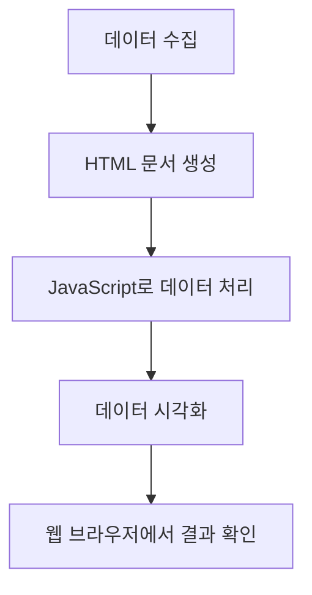
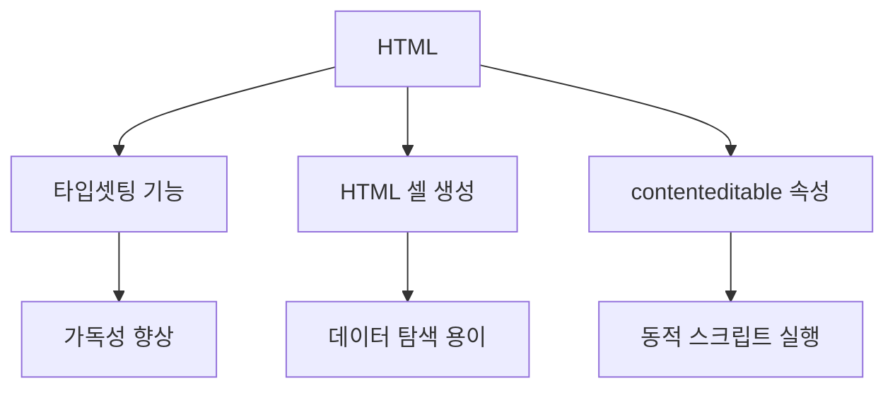
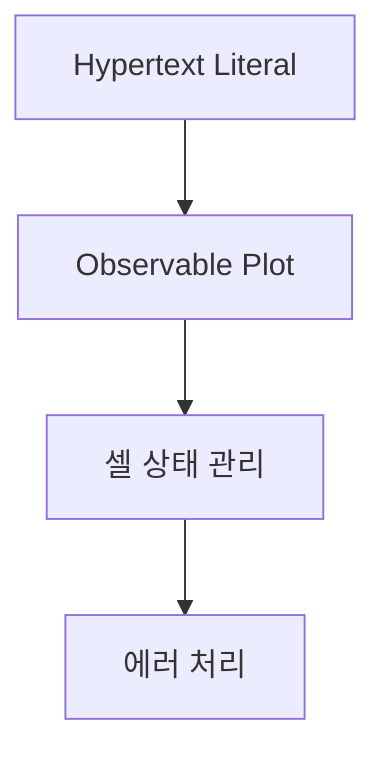
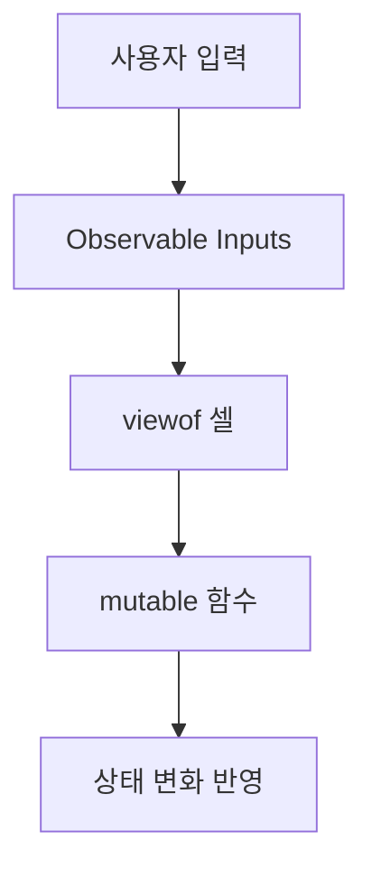
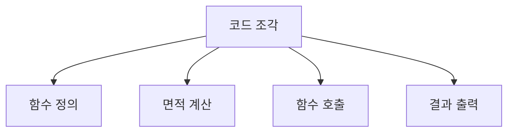
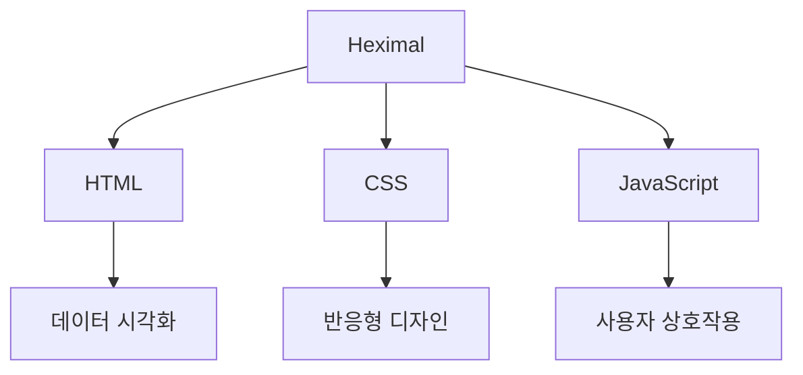
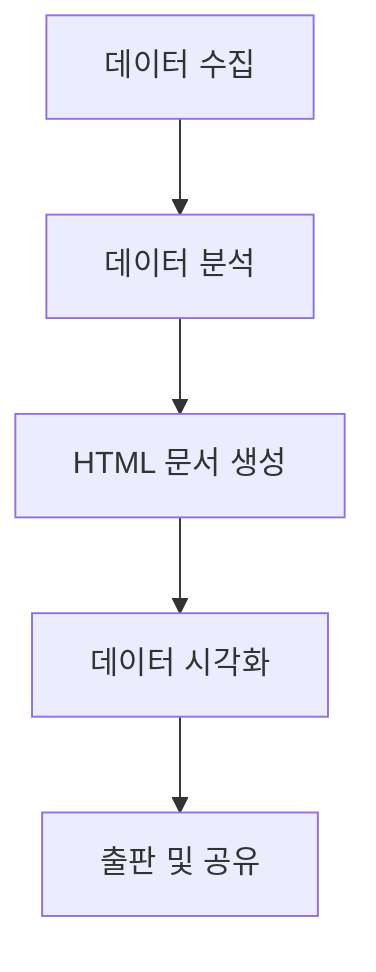

HTML은 데이터 탐색, 분석 및 시각화를 위한 강력한 플랫폼으로 활용될 수 있다. 많은 연구자와 데이터 과학자들은 Jupyter, RStudio, Observable와 같은 대화형 노트북을 사용하여 데이터를 탐색하고 분석하며, Typst, Overleaf, LaTeX와 같은 출판 플랫폼으로 이동하여 작업을 조판하는 경향이 있다. 그러나 HTML 파일 하나로 이 모든 단계를 수행할 수 있으며, 이는 수동 프로세스, CLI 도구, CI 단계 및 제3자 플랫폼과의 번거로운 작업을 줄일 수 있다. HTML의 조판 기능은 잘 문서화되어 있지만, 데이터 탐색, 분석 및 시각화 플랫폼으로서의 기능은 상대적으로 덜 알려져 있다. 본 글에서는 이러한 기능을 문서화된 프로그래밍 스타일로 시연하고자 한다. 또한, `contenteditable` 속성을 가진 `script` 요소를 사용하여 블러 이벤트 발생 시 재평가하는 방법을 설명할 것이다. 이를 통해 데이터의 동적 변화를 실시간으로 관찰할 수 있으며, 다양한 셀을 생성하여 서로 의존하는 구조를 만들 수 있다. HTML을 활용한 데이터 분석의 가능성을 탐구하며, 이 과정에서 발생하는 다양한 문제와 해결책을 제시할 것이다.

<!--
##### Outline #####
-->

<!--
# 목차

## 1. 개요
   - HTML을 활용한 과학 출판의 필요성
   - 기존 데이터 분석 및 출판 도구의 한계
   - HTML의 데이터 탐색, 분석 및 시각화 가능성

## 2. HTML을 활용한 데이터 탐색 및 분석
   - 2.1. HTML의 타입셋팅 기능
   - 2.2. 데이터 탐색을 위한 HTML 셀 생성
   - 2.3. `contenteditable` 속성을 활용한 동적 스크립트 실행

## 3. Observable의 활용
   - 3.1. Hypertext Literal (HTL) 소개
   - 3.2. Observable Plot을 통한 데이터 시각화
   - 3.3. 셀 상태 관리 및 에러 처리

## 4. 다양한 프로그래밍 언어와의 통합
   - 4.1. Python과 Pyodide를 활용한 데이터 분석
       - NumPy, Pandas, Matplotlib, Scikit-learn, Scipy
   - 4.2. R과 WebR을 활용한 데이터 시각화
       - ggplot2의 활용 가능성
   - 4.3. JavaScript와 HTML의 상호작용

## 5. 사용자 입력 및 상호작용
   - 5.1. Observable Inputs를 통한 사용자 입력 처리
   - 5.2. `viewof` 셀의 활용
   - 5.3. 상태 변화를 위한 `mutable` 함수

## 6. 문서화된 프로그래밍과 HTML
   - 6.1. 문서화된 프로그래밍의 개념
   - 6.2. HTML을 통한 블로그 게시물 작성
   - 6.3. 코드 조각의 단계별 이해

## 7. 관련 기술
   - 7.1. Jupyter Notebook과의 비교
   - 7.2. LaTeX 및 Typst와의 차별점
   - 7.3. Heximal: 반응형 HTML 시스템

## 8. FAQ
   - 8.1. HTML을 데이터 분석 플랫폼으로 사용하는 이유는?
   - 8.2. Observable의 장점은 무엇인가요?
   - 8.3. Python과 R을 HTML에서 어떻게 사용할 수 있나요?
   - 8.4. HTML 셀의 상태를 어떻게 관리하나요?

## 9. 결론
   - HTML의 가능성과 미래
   - 데이터 분석 및 출판의 통합 플랫폼으로서의 HTML
   - 향후 발전 방향 및 커뮤니티의 역할

## 10. 참고 자료
   - 관련 링크 및 문서
   - 추가 학습 자료 및 튜토리얼
-->

<!--
## 1. 개요
   - HTML을 활용한 과학 출판의 필요성
   - 기존 데이터 분석 및 출판 도구의 한계
   - HTML의 데이터 탐색, 분석 및 시각화 가능성
-->

## 개요

### HTML을 활용한 과학 출판의 필요성

현대 과학 연구는 데이터의 양과 복잡성이 증가함에 따라, 이를 효과적으로 출판하고 공유하는 방법이 중요해졌다. 전통적인 출판 방식은 종종 데이터의 시각화와 탐색을 제한하며, 연구자들이 데이터를 이해하고 활용하는 데 어려움을 겪게 만든다. HTML은 웹 기반의 문서 형식으로, 다양한 멀티미디어 요소를 통합할 수 있어 과학 출판에 적합한 도구로 자리잡고 있다. HTML을 활용하면 연구 결과를 보다 직관적으로 표현하고, 독자들이 데이터를 쉽게 탐색할 수 있도록 도와준다.

### 기존 데이터 분석 및 출판 도구의 한계

기존의 데이터 분석 및 출판 도구들은 종종 특정한 환경에 종속되어 있거나, 사용자가 데이터를 시각화하고 분석하는 데 필요한 유연성을 제공하지 않는다. 예를 들어, Jupyter Notebook은 강력한 데이터 분석 도구이지만, 최종 결과물을 웹에서 쉽게 공유하기 어려운 경우가 많다. 또한, LaTeX와 같은 문서 작성 도구는 수학적 표현에 강점을 가지지만, 데이터 시각화와 상호작용성에서는 한계를 보인다. 이러한 한계는 연구자들이 데이터를 효과적으로 전달하는 데 방해가 된다.

### HTML의 데이터 탐색, 분석 및 시각화 가능성

HTML은 데이터 탐색, 분석 및 시각화에 있어 강력한 가능성을 제공한다. HTML 문서는 웹 브라우저에서 쉽게 열 수 있으며, JavaScript와 같은 프로그래밍 언어와 결합하여 동적인 데이터 시각화를 구현할 수 있다. 예를 들어, D3.js와 같은 라이브러리를 사용하면 복잡한 데이터 시각화를 손쉽게 만들 수 있다. 또한, HTML의 `contenteditable` 속성을 활용하면 사용자가 직접 데이터를 수정하고 실시간으로 결과를 확인할 수 있는 인터랙티브한 환경을 제공할 수 있다.

다음은 HTML을 활용한 데이터 시각화의 간단한 예시 코드이다.

```html
<!DOCTYPE html>
<html lang="ko">
<head>
    <meta charset="UTF-8">
    <title>데이터 시각화 예시</title>
    <script src="https://d3js.org/d3.v6.min.js"></script>
    <style>
        .bar {
            fill: steelblue;
        }
    </style>
</head>
<body>
    <svg width="500" height="300"></svg>
    <script>
        const data = [30, 86, 168, 234, 32, 8];
        const svg = d3.select("svg");
        const barHeight = 20;

        svg.selectAll("rect")
            .data(data)
            .enter().append("rect")
            .attr("class", "bar")
            .attr("y", (d, i) => i * barHeight)
            .attr("height", barHeight - 1)
            .attr("width", d => d);
    </script>
</body>
</html>
```

위의 코드는 D3.js를 사용하여 간단한 바 차트를 생성하는 예시이다. 이와 같이 HTML을 활용하면 데이터 시각화를 통해 연구 결과를 보다 효과적으로 전달할 수 있다.

다음은 HTML을 활용한 데이터 시각화의 흐름을 나타내는 다이어그램이다.



이러한 방식으로 HTML을 활용하면 과학 출판의 새로운 가능성을 열 수 있으며, 연구자들이 데이터를 보다 효과적으로 탐색하고 분석할 수 있는 환경을 제공할 수 있다.

<!--
## 2. HTML을 활용한 데이터 탐색 및 분석
   - 2.1. HTML의 타입셋팅 기능
   - 2.2. 데이터 탐색을 위한 HTML 셀 생성
   - 2.3. `contenteditable` 속성을 활용한 동적 스크립트 실행
-->

## HTML을 활용한 데이터 탐색 및 분석

HTML은 데이터 탐색 및 분석을 위한 강력한 도구로 자리 잡고 있다. 이 섹션에서는 HTML의 타입셋팅 기능, 데이터 탐색을 위한 HTML 셀 생성, 그리고 `contenteditable` 속성을 활용한 동적 스크립트 실행에 대해 살펴보겠다.

### HTML의 타입셋팅 기능

HTML은 웹 페이지의 구조를 정의하는 마크업 언어로, 다양한 타입셋팅 기능을 제공한다. 이를 통해 데이터의 가독성을 높이고, 사용자에게 정보를 효과적으로 전달할 수 있다. 예를 들어, `<table>`, `<ul>`, `<ol>` 등의 태그를 사용하여 데이터를 정리하고 시각적으로 표현할 수 있다.

**샘플 코드:**

```html
<table>
  <thead>
    <tr>
      <th>이름</th>
      <th>나이</th>
      <th>직업</th>
    </tr>
  </thead>
  <tbody>
    <tr>
      <td>홍길동</td>
      <td>30</td>
      <td>개발자</td>
    </tr>
    <tr>
      <td>김영희</td>
      <td>25</td>
      <td>디자이너</td>
    </tr>
  </tbody>
</table>
```

이와 같은 타입셋팅 기능을 활용하면 데이터의 구조를 명확하게 표현할 수 있으며, 사용자는 필요한 정보를 쉽게 찾을 수 있다.

### 데이터 탐색을 위한 HTML 셀 생성

HTML을 활용하여 데이터 탐색을 위한 셀을 생성할 수 있다. 이러한 셀은 사용자가 데이터를 입력하거나 수정할 수 있는 인터페이스를 제공하며, 이를 통해 데이터 분석의 효율성을 높일 수 있다. 

**샘플 코드:**

```html
<div>
  <label for="dataInput">데이터 입력:</label>
  <input type="text" id="dataInput" placeholder="데이터를 입력하세요">
  <button onclick="submitData()">제출</button>
</div>

<script>
  function submitData() {
    const inputData = document.getElementById('dataInput').value;
    console.log('입력된 데이터:', inputData);
  }
</script>
```

위의 예제에서는 사용자가 데이터를 입력하고 제출 버튼을 클릭하면, 입력된 데이터가 콘솔에 출력된다. 이러한 방식으로 HTML 셀을 활용하여 데이터 탐색을 용이하게 할 수 있다.

### `contenteditable` 속성을 활용한 동적 스크립트 실행

HTML의 `contenteditable` 속성을 사용하면 사용자가 직접 콘텐츠를 수정할 수 있는 영역을 만들 수 있다. 이를 통해 데이터 분석 과정에서 실시간으로 데이터를 수정하고 결과를 확인할 수 있는 동적 환경을 제공할 수 있다.

**샘플 코드:**

```html
<div contenteditable="true" id="editableDiv" style="border: 1px solid #ccc; padding: 10px;">
  이곳에 데이터를 입력하거나 수정하세요.
</div>
<button onclick="runScript()">실행</button>

<script>
  function runScript() {
    const editableContent = document.getElementById('editableDiv').innerText;
    console.log('수정된 데이터:', editableContent);
  }
</script>
```

위의 코드에서는 사용자가 `contenteditable` 영역에서 데이터를 수정한 후, "실행" 버튼을 클릭하면 수정된 데이터가 콘솔에 출력된다. 이러한 기능은 데이터 분석 및 탐색 과정에서 매우 유용하게 활용될 수 있다.



위의 다이어그램은 HTML을 활용한 데이터 탐색 및 분석의 주요 기능들을 시각적으로 나타낸 것이다. 이러한 기능들을 통해 HTML은 데이터 분석의 강력한 도구로 자리매김하고 있다.

<!--
## 3. Observable의 활용
   - 3.1. Hypertext Literal (HTL) 소개
   - 3.2. Observable Plot을 통한 데이터 시각화
   - 3.3. 셀 상태 관리 및 에러 처리
-->

## Observable의 활용

Observable은 데이터 시각화 및 분석을 위한 강력한 플랫폼으로, 다양한 기능을 제공한다. 이 섹션에서는 Hypertext Literal (HTL), Observable Plot을 통한 데이터 시각화, 그리고 셀 상태 관리 및 에러 처리에 대해 다룬다.

### Hypertext Literal (HTL) 소개

**Hypertext Literal (HTL)**은 Observable에서 HTML과 JavaScript를 결합하여 동적인 콘텐츠를 생성할 수 있는 기능이다. HTL을 사용하면 데이터와 시각화를 쉽게 통합할 수 있으며, 코드의 가독성을 높일 수 있다. HTL은 다음과 같은 형식으로 사용된다.

```javascript
html`<h1>${title}</h1><p>${description}</p>`
```

위의 코드에서 `${title}`과 `${description}`은 JavaScript 변수를 HTML 콘텐츠에 삽입하는 방법을 보여준다. 이를 통해 데이터에 기반한 동적인 웹 페이지를 쉽게 생성할 수 있다.

### Observable Plot을 통한 데이터 시각화

**Observable Plot**은 데이터 시각화를 위한 간단하고 직관적인 API를 제공한다. 이 API를 사용하면 다양한 차트와 그래프를 쉽게 생성할 수 있으며, 데이터의 변화를 실시간으로 반영할 수 있다. 다음은 Observable Plot을 사용하여 간단한 선 그래프를 생성하는 예시이다.

```javascript
import { plot } from "@observablehq/plot";

const data = [
  { x: 1, y: 2 },
  { x: 2, y: 3 },
  { x: 3, y: 5 },
  { x: 4, y: 4 },
];

plot({
  marks: [
    Plot.line(data, { x: "x", y: "y" }),
    Plot.dot(data, { x: "x", y: "y" }),
  ],
});
```

위의 코드는 x와 y 값으로 구성된 데이터를 기반으로 선 그래프와 점 그래프를 생성하는 방법을 보여준다. Observable Plot은 다양한 시각화 옵션을 제공하여 사용자가 원하는 형태로 데이터를 표현할 수 있도록 돕는다.

### 셀 상태 관리 및 에러 처리

**셀 상태 관리**는 Observable에서 데이터의 변화를 추적하고 관리하는 중요한 기능이다. Observable에서는 각 셀이 독립적으로 상태를 유지하며, 이를 통해 데이터의 변화를 쉽게 반영할 수 있다. 다음은 셀 상태를 관리하는 간단한 예시이다.

```javascript
mutable count = 0;

function increment() {
  count += 1;
  return count;
}
```

위의 코드는 `count`라는 변수를 정의하고, 이를 증가시키는 `increment` 함수를 생성하는 방법을 보여준다. `mutable` 키워드를 사용하여 상태를 관리할 수 있으며, 이 상태는 다른 셀에서 참조할 수 있다.

**에러 처리**는 데이터 분석 및 시각화에서 중요한 부분이다. Observable에서는 try-catch 문을 사용하여 에러를 처리할 수 있다. 다음은 에러 처리를 위한 예시이다.

```javascript
try {
  // 데이터 처리 코드
} catch (error) {
  console.error("Error occurred:", error);
}
```

위의 코드는 데이터 처리 중 발생할 수 있는 에러를 잡아내고, 이를 콘솔에 출력하는 방법을 보여준다. 이를 통해 사용자는 에러 발생 시 적절한 조치를 취할 수 있다.



위의 다이어그램은 Observable의 주요 기능 간의 관계를 나타낸다. Hypertext Literal을 통해 동적인 콘텐츠를 생성하고, Observable Plot을 사용하여 데이터를 시각화하며, 셀 상태 관리와 에러 처리를 통해 안정적인 데이터 분석 환경을 구축할 수 있다.

<!--
## 4. 다양한 프로그래밍 언어와의 통합
   - 4.1. Python과 Pyodide를 활용한 데이터 분석
       - NumPy, Pandas, Matplotlib, Scikit-learn, Scipy
   - 4.2. R과 WebR을 활용한 데이터 시각화
       - ggplot2의 활용 가능성
   - 4.3. JavaScript와 HTML의 상호작용
-->

## 다양한 프로그래밍 언어와의 통합

HTML은 다양한 프로그래밍 언어와의 통합을 통해 데이터 분석 및 시각화의 가능성을 확장할 수 있다. 이 섹션에서는 Python, R, JavaScript와의 통합 방법에 대해 살펴보겠다.

### Python과 Pyodide를 활용한 데이터 분석

Python은 데이터 분석에 널리 사용되는 언어로, Pyodide를 통해 웹 브라우저에서 직접 실행할 수 있다. Pyodide는 Python을 WebAssembly로 컴파일하여 브라우저에서 Python 코드를 실행할 수 있게 해준다. 이를 통해 NumPy, Pandas, Matplotlib, Scikit-learn, Scipy와 같은 라이브러리를 사용할 수 있다.

**샘플 코드:**

```html
<!DOCTYPE html>
<html>
<head>
    <script src="https://cdn.pyodide.org/pyodide.js"></script>
    <script>
        async function main() {
            let pyodide = await loadPyodide();
            await pyodide.loadPackage(["numpy", "pandas", "matplotlib"]);
            let code = `
import numpy as np
import pandas as pd
import matplotlib.pyplot as plt

data = pd.DataFrame({
    'x': np.linspace(0, 10, 100),
    'y': np.sin(np.linspace(0, 10, 100))
})

plt.plot(data['x'], data['y'])
plt.title('Sine Wave')
plt.show()
`;
            await pyodide.runPythonAsync(code);
        }
        main();
    </script>
</head>
<body>
</body>
</html>
```

위의 코드는 Pyodide를 사용하여 웹 브라우저에서 Python으로 데이터를 생성하고 시각화하는 예시이다. 이처럼 HTML과 Python의 통합은 데이터 분석의 접근성을 높인다.

### R과 WebR을 활용한 데이터 시각화

R은 통계 분석과 데이터 시각화에 강력한 도구로, WebR을 통해 웹 환경에서 R 코드를 실행할 수 있다. WebR은 R을 WebAssembly로 변환하여 브라우저에서 R 코드를 실행할 수 있게 해준다. 특히, ggplot2와 같은 시각화 라이브러리를 활용하여 데이터 시각화를 손쉽게 구현할 수 있다.

**샘플 코드:**

```html
<!DOCTYPE html>
<html>
<head>
    <script src="https://cdn.jsdelivr.net/gh/wasmerio/web-r@latest/dist/webR.js"></script>
    <script>
        async function main() {
            const webR = await WebR.load();
            const code = `
library(ggplot2)

data <- data.frame(x = seq(0, 10, length.out = 100), y = sin(seq(0, 10, length.out = 100)))
ggplot(data, aes(x = x, y = y)) + geom_line() + ggtitle("Sine Wave")
`;
            await webR.run(code);
        }
        main();
    </script>
</head>
<body>
</body>
</html>
```

위의 코드는 WebR을 사용하여 R로 데이터를 생성하고 ggplot2를 통해 시각화하는 예시이다. R과 HTML의 통합은 데이터 시각화의 가능성을 더욱 확장시킨다.

### JavaScript와 HTML의 상호작용

JavaScript는 웹 개발의 핵심 언어로, HTML과의 상호작용을 통해 동적인 웹 페이지를 만들 수 있다. JavaScript를 사용하여 HTML 요소를 조작하고, 사용자 입력을 처리하며, 데이터를 시각화할 수 있다. D3.js와 같은 라이브러리를 활용하면 복잡한 데이터 시각화도 가능하다.

**샘플 코드:**

```html
<!DOCTYPE html>
<html>
<head>
    <script src="https://d3js.org/d3.v6.min.js"></script>
    <script>
        document.addEventListener("DOMContentLoaded", function() {
            const data = [10, 15, 20, 25, 30];
            const width = 500;
            const height = 300;

            const svg = d3.select("body").append("svg")
                .attr("width", width)
                .attr("height", height);

            svg.selectAll("rect")
                .data(data)
                .enter()
                .append("rect")
                .attr("x", (d, i) => i * 50)
                .attr("y", d => height - d * 5)
                .attr("width", 40)
                .attr("height", d => d * 5)
                .attr("fill", "blue");
        });
    </script>
</head>
<body>
</body>
</html>
```

위의 코드는 D3.js를 사용하여 JavaScript로 데이터를 시각화하는 예시이다. JavaScript와 HTML의 상호작용은 웹 기반 데이터 분석 및 시각화의 핵심 요소이다.

### 결론

HTML은 다양한 프로그래밍 언어와의 통합을 통해 데이터 분석 및 시각화의 가능성을 크게 확장할 수 있다. Python, R, JavaScript와의 통합은 데이터 과학자와 개발자에게 강력한 도구를 제공하며, 이를 통해 더욱 풍부한 데이터 분석 환경을 구축할 수 있다.

<!--
## 5. 사용자 입력 및 상호작용
   - 5.1. Observable Inputs를 통한 사용자 입력 처리
   - 5.2. `viewof` 셀의 활용
   - 5.3. 상태 변화를 위한 `mutable` 함수
-->

## 사용자 입력 및 상호작용

사용자 입력 및 상호작용은 데이터 분석 및 시각화 과정에서 매우 중요한 요소이다. HTML을 활용하면 사용자의 입력을 쉽게 처리하고, 이를 기반으로 동적인 결과를 생성할 수 있다. 이 섹션에서는 Observable Inputs, `viewof` 셀, 그리고 상태 변화를 위한 `mutable` 함수에 대해 살펴보겠다.

### Observable Inputs를 통한 사용자 입력 처리

Observable Inputs는 사용자가 데이터를 입력할 수 있는 다양한 UI 요소를 제공한다. 이를 통해 사용자는 실시간으로 데이터를 수정하고, 그에 따른 결과를 즉시 확인할 수 있다. 예를 들어, 사용자가 숫자를 입력하면 그 숫자를 기반으로 그래프를 업데이트하는 방식이다.

다음은 Observable Inputs를 활용한 간단한 예제 코드이다.

```javascript
viewof inputNumber = Inputs.number({
  value: 10,
  min: 0,
  max: 100,
  step: 1,
  title: "숫자를 입력하세요"
})

inputNumber
```

위 코드는 사용자가 숫자를 입력할 수 있는 입력 필드를 생성한다. 사용자가 입력한 값은 `inputNumber` 변수에 저장되며, 이를 다른 셀에서 활용할 수 있다.

### `viewof` 셀의 활용

`viewof` 셀은 Observable에서 사용자 입력을 처리하는 데 매우 유용하다. 이 셀은 사용자가 입력한 값을 직접적으로 다루지 않고, 입력의 "보기(view)"를 제공한다. 이를 통해 사용자는 입력을 수정할 수 있으며, 수정된 값은 다른 셀에서 쉽게 참조할 수 있다.

예를 들어, 다음과 같이 `viewof` 셀을 사용하여 사용자 입력을 처리할 수 있다.

```javascript
viewof inputText = Inputs.text({
  value: "Hello, World!",
  placeholder: "텍스트를 입력하세요"
})

inputText
```

이 코드는 사용자가 텍스트를 입력할 수 있는 필드를 생성하며, 입력된 텍스트는 `inputText` 변수에 저장된다. 이를 통해 사용자는 실시간으로 텍스트를 수정하고, 다른 셀에서 그 값을 활용할 수 있다.

### 상태 변화를 위한 `mutable` 함수

`mutable` 함수는 Observable에서 상태를 관리하는 데 사용된다. 이 함수는 상태 변화를 추적하고, 이를 기반으로 UI를 업데이트하는 데 유용하다. 예를 들어, 사용자가 버튼을 클릭할 때마다 카운터를 증가시키는 기능을 구현할 수 있다.

다음은 `mutable` 함수를 활용한 간단한 예제이다.

```javascript
mutable count = 0

button = Inputs.button("카운트 증가")

button.onclick = () => {
  count += 1
}
```

위 코드는 버튼을 클릭할 때마다 `count` 변수를 증가시키는 기능을 구현한다. 이와 같은 방식으로 상태 변화를 관리하면, 사용자와의 상호작용을 통해 동적인 결과를 생성할 수 있다.



위 다이어그램은 사용자 입력이 Observable Inputs를 통해 처리되고, `viewof` 셀과 `mutable` 함수를 통해 상태 변화가 반영되는 과정을 나타낸다. 이러한 구조를 통해 HTML 기반의 데이터 분석 및 시각화가 더욱 직관적이고 효율적으로 이루어질 수 있다.

<!--
## 6. 문서화된 프로그래밍과 HTML
   - 6.1. 문서화된 프로그래밍의 개념
   - 6.2. HTML을 통한 블로그 게시물 작성
   - 6.3. 코드 조각의 단계별 이해
-->

## 문서화된 프로그래밍과 HTML

### 문서화된 프로그래밍의 개념

문서화된 프로그래밍(Documented Programming)은 코드와 문서가 통합되어 작성되는 프로그래밍 방식이다. 이 방식은 코드의 가독성을 높이고, 코드의 동작을 이해하기 쉽게 만들어준다. 특히, HTML을 활용하면 코드와 설명을 함께 시각적으로 표현할 수 있어, 독자가 내용을 쉽게 이해할 수 있도록 돕는다. 문서화된 프로그래밍은 데이터 분석, 과학 출판 등 다양한 분야에서 유용하게 사용될 수 있다.

### HTML을 통한 블로그 게시물 작성

HTML은 블로그 게시물을 작성하는 데 매우 유용한 도구이다. HTML의 구조적 특성을 활용하면, 텍스트, 이미지, 코드 조각 등을 효과적으로 배치할 수 있다. 다음은 HTML을 사용하여 간단한 블로그 게시물을 작성하는 예시 코드이다.

```html
<!DOCTYPE html>
<html lang="ko">
<head>
    <meta charset="UTF-8">
    <meta name="viewport" content="width=device-width, initial-scale=1.0">
    <title>블로그 게시물</title>
</head>
<body>
    <h1>나의 첫 블로그 게시물</h1>
    <p>이 게시물은 HTML을 사용하여 작성된 예시입니다.</p>
    <h2>코드 예시</h2>
    <pre>
        <code>
            def hello_world():
                print("Hello, World!")
        </code>
    </pre>
    <p>위의 코드는 파이썬으로 작성된 간단한 함수입니다.</p>
</body>
</html>
```

위의 코드는 HTML을 사용하여 블로그 게시물을 작성하는 기본적인 구조를 보여준다. `<h1>` 태그는 제목을, `<p>` 태그는 단락을 나타내며, `<pre>`와 `<code>` 태그는 코드 조각을 표시하는 데 사용된다.

### 코드 조각의 단계별 이해

코드 조각을 단계별로 이해하는 것은 문서화된 프로그래밍의 중요한 부분이다. 각 코드 조각은 특정 기능을 수행하며, 이를 설명하는 주석을 추가함으로써 독자가 코드를 쉽게 이해할 수 있도록 돕는다. 다음은 파이썬 코드 조각을 단계별로 설명하는 예시이다.

```python
# 함수 정의
def calculate_area(radius):
    # 원의 면적을 계산하는 공식
    area = 3.14 * radius ** 2
    return area

# 함수 호출
result = calculate_area(5)
print("원의 면적:", result)
```

위의 코드에서 각 단계는 주석을 통해 설명되고 있다. 함수 정의, 면적 계산, 함수 호출 및 결과 출력의 각 단계가 명확하게 구분되어 있어, 독자가 코드를 쉽게 따라갈 수 있다.



위의 다이어그램은 코드 조각의 각 단계를 시각적으로 표현한 것이다. 이러한 방식으로 문서화된 프로그래밍을 활용하면, 코드와 설명이 통합되어 독자가 내용을 쉽게 이해할 수 있도록 돕는다.

<!--
## 7. 관련 기술
   - 7.1. Jupyter Notebook과의 비교
   - 7.2. LaTeX 및 Typst와의 차별점
   - 7.3. Heximal: 반응형 HTML 시스템
-->

## 관련 기술

### Jupyter Notebook과의 비교

Jupyter Notebook은 데이터 과학 및 분석에 널리 사용되는 도구로, Python, R, Julia 등 다양한 프로그래밍 언어를 지원한다. 사용자는 코드와 결과를 셀 단위로 작성하고 실행할 수 있으며, Markdown을 통해 문서화할 수 있다. 반면, HTML을 활용한 데이터 탐색 및 분석은 웹 기반의 인터페이스를 제공하여, 데이터 시각화와 상호작용을 보다 직관적으로 수행할 수 있다. 

Jupyter Notebook은 주로 서버에서 실행되며, 클라우드 환경에서도 사용 가능하지만, HTML 기반의 접근 방식은 브라우저에서 직접 실행할 수 있어 더 많은 사용자에게 접근성을 제공한다. 또한, HTML은 CSS와 JavaScript를 활용하여 더욱 풍부한 사용자 경험을 제공할 수 있다.

```python
# Jupyter Notebook에서의 간단한 데이터 시각화 예시
import matplotlib.pyplot as plt
import numpy as np

x = np.linspace(0, 10, 100)
y = np.sin(x)

plt.plot(x, y)
plt.title("Sine Wave")
plt.xlabel("X-axis")
plt.ylabel("Y-axis")
plt.show()
```

### LaTeX 및 Typst와의 차별점

LaTeX는 주로 수학 및 과학 문서 작성에 사용되는 고급 문서 준비 시스템이다. LaTeX는 복잡한 수식과 문서 구조를 쉽게 처리할 수 있는 장점이 있지만, HTML은 웹 기반의 문서 작성 및 데이터 시각화에 더 적합하다. Typst는 LaTeX의 대안으로 떠오르고 있으며, 사용자 친화적인 문서 작성을 지원한다. 그러나 HTML은 동적 콘텐츠와 상호작용을 통해 데이터 분석 및 시각화에 강점을 가진다.

HTML을 사용하면 웹 페이지에서 직접 데이터를 시각화하고, 사용자와의 상호작용을 통해 실시간으로 결과를 업데이트할 수 있다. 이는 LaTeX나 Typst에서는 구현하기 어려운 부분이다.

```html
<!-- HTML을 활용한 간단한 데이터 시각화 예시 -->
<!DOCTYPE html>
<html lang="en">
<head>
    <meta charset="UTF-8">
    <title>Simple Chart</title>
    <script src="https://cdn.jsdelivr.net/npm/chart.js"></script>
</head>
<body>
    <canvas id="myChart" width="400" height="200"></canvas>
    <script>
        const ctx = document.getElementById('myChart').getContext('2d');
        const myChart = new Chart(ctx, {
            type: 'line',
            data: {
                labels: ['January', 'February', 'March', 'April', 'May'],
                datasets: [{
                    label: 'Sample Data',
                    data: [12, 19, 3, 5, 2],
                    borderColor: 'rgba(75, 192, 192, 1)',
                    borderWidth: 1
                }]
            },
            options: {
                scales: {
                    y: {
                        beginAtZero: true
                    }
                }
            }
        });
    </script>
</body>
</html>
```

### Heximal: 반응형 HTML 시스템

Heximal은 반응형 HTML 시스템으로, 데이터 시각화와 사용자 상호작용을 지원하는 플랫폼이다. Heximal은 HTML, CSS, JavaScript를 기반으로 하여, 사용자가 데이터를 쉽게 탐색하고 분석할 수 있도록 돕는다. 이 시스템은 다양한 데이터 소스를 통합하고, 실시간으로 데이터를 시각화할 수 있는 기능을 제공한다.

Heximal의 주요 장점은 반응형 디자인을 통해 다양한 디바이스에서 최적화된 사용자 경험을 제공한다는 점이다. 또한, 사용자는 코드 작성 없이도 시각적 요소를 쉽게 조작할 수 있어, 데이터 분석에 대한 접근성을 높인다.



이와 같이, HTML을 활용한 데이터 탐색 및 분석은 Jupyter Notebook, LaTeX, Typst와 비교할 때 각기 다른 장점과 특성을 지니고 있으며, Heximal과 같은 반응형 시스템을 통해 더욱 발전할 가능성이 크다.

<!--
## 8. FAQ
   - 8.1. HTML을 데이터 분석 플랫폼으로 사용하는 이유는?
   - 8.2. Observable의 장점은 무엇인가요?
   - 8.3. Python과 R을 HTML에서 어떻게 사용할 수 있나요?
   - 8.4. HTML 셀의 상태를 어떻게 관리하나요?
-->

## FAQ

### HTML을 데이터 분석 플랫폼으로 사용하는 이유는?

HTML은 웹 기반의 문서 형식으로, 데이터 분석을 위한 다양한 기능을 제공한다. HTML을 데이터 분석 플랫폼으로 사용하는 이유는 다음과 같다.

1. **접근성**: HTML은 웹 브라우저에서 쉽게 접근할 수 있어, 사용자가 별도의 소프트웨어 설치 없이도 데이터 분석 결과를 확인할 수 있다.
2. **상호작용성**: HTML은 JavaScript와 함께 사용하여 동적인 데이터 시각화 및 사용자 상호작용을 가능하게 한다.
3. **유연성**: 다양한 데이터 형식을 지원하며, 다른 프로그래밍 언어와의 통합이 용이하다.

예를 들어, HTML을 사용하여 간단한 데이터 테이블을 생성할 수 있다.

```html
<table>
  <tr>
    <th>이름</th>
    <th>나이</th>
  </tr>
  <tr>
    <td>홍길동</td>
    <td>30</td>
  </tr>
  <tr>
    <td>김철수</td>
    <td>25</td>
  </tr>
</table>
```

### Observable의 장점은 무엇인가요?

Observable은 데이터 시각화 및 분석을 위한 강력한 플랫폼으로, 다음과 같은 장점을 제공한다.

1. **실시간 데이터 시각화**: Observable은 데이터 변경 시 자동으로 시각화를 업데이트하여, 실시간으로 결과를 확인할 수 있다.
2. **모듈화**: 코드 셀을 모듈화하여 재사용할 수 있으며, 복잡한 분석을 간단하게 구성할 수 있다.
3. **커뮤니티**: 다양한 사용자와의 협업이 가능하며, 많은 예제와 자료를 통해 학습할 수 있다.

다음은 Observable에서 데이터를 시각화하는 간단한 예제이다.

```javascript
// Observable Plot 예제
Plot.plot({
  marks: [
    Plot.dot(data, { x: "xValue", y: "yValue" })
  ]
});
```

### Python과 R을 HTML에서 어떻게 사용할 수 있나요?

HTML에서 Python과 R을 사용하기 위해서는 각각의 라이브러리와 도구를 활용해야 한다. 

- **Python**: Pyodide를 사용하여 Python 코드를 HTML에서 실행할 수 있다. Pyodide는 Python을 WebAssembly로 컴파일하여 브라우저에서 실행할 수 있게 해준다.

```html
<script type="text/javascript" src="https://cdn.pyodide.org/pyodide.js"></script>
<script>
  async function runPython() {
    let pyodide = await loadPyodide();
    let result = await pyodide.runPython(`
      import numpy as np
      np.mean([1, 2, 3, 4, 5])
    `);
    console.log(result);
  }
  runPython();
</script>
```

- **R**: WebR을 사용하여 R 코드를 HTML에서 실행할 수 있다. WebR은 R을 브라우저에서 실행할 수 있도록 해준다.

```html
<script src="https://cdn.jsdelivr.net/npm/webr@latest/dist/webr.js"></script>
<script>
  WebR.runR(`
    mean(c(1, 2, 3, 4, 5))
  `).then(result => console.log(result));
</script>
```

### HTML 셀의 상태를 어떻게 관리하나요?

HTML 셀의 상태 관리는 `mutable` 함수를 사용하여 이루어진다. `mutable`은 Observable에서 상태를 관리하는 데 유용한 기능으로, 상태가 변경될 때마다 자동으로 업데이트된다.

다음은 `mutable`을 사용하여 상태를 관리하는 예제이다.

```javascript
mutable count = 0;

viewof increment = html`<button>Increment</button>`;
increment.onclick = () => {
  count += 1;
};

count;
```

위의 예제에서 버튼을 클릭할 때마다 `count`의 값이 증가하고, 그 결과가 자동으로 업데이트된다. 이를 통해 사용자 상호작용에 따라 동적으로 상태를 관리할 수 있다.

<!--
## 9. 결론
   - HTML의 가능성과 미래
   - 데이터 분석 및 출판의 통합 플랫폼으로서의 HTML
   - 향후 발전 방향 및 커뮤니티의 역할
-->

## 결론

### HTML의 가능성과 미래

HTML은 단순한 마크업 언어를 넘어 데이터 분석 및 시각화의 강력한 도구로 자리 잡고 있다. 웹 기반의 환경에서 HTML을 활용하면 데이터의 탐색, 분석, 시각화를 손쉽게 수행할 수 있으며, 이는 연구자와 데이터 과학자들에게 큰 장점을 제공한다. 앞으로 HTML은 더욱 발전하여 다양한 데이터 처리 및 시각화 도구와 통합될 가능성이 높다. 

**샘플 코드: HTML 데이터 테이블 생성**

```html
<!DOCTYPE html>
<html lang="ko">
<head>
    <meta charset="UTF-8">
    <title>데이터 테이블</title>
</head>
<body>
    <table border="1">
        <tr>
            <th>이름</th>
            <th>나이</th>
            <th>직업</th>
        </tr>
        <tr>
            <td>홍길동</td>
            <td>30</td>
            <td>개발자</td>
        </tr>
        <tr>
            <td>김영희</td>
            <td>25</td>
            <td>디자이너</td>
        </tr>
    </table>
</body>
</html>
```

### 데이터 분석 및 출판의 통합 플랫폼으로서의 HTML

HTML은 데이터 분석과 출판을 통합하는 플랫폼으로서의 역할을 수행할 수 있다. 데이터 분석 결과를 HTML 문서로 쉽게 변환하여 공유할 수 있으며, 이는 연구 결과의 투명성을 높이고, 다른 연구자들과의 협업을 촉진한다. 또한, HTML은 다양한 시각화 라이브러리와의 호환성 덕분에 데이터의 시각적 표현을 극대화할 수 있다.

**다이어그램: HTML의 데이터 분석 및 출판 통합 구조**



### 향후 발전 방향 및 커뮤니티의 역할

HTML의 발전 방향은 데이터 분석 및 시각화 도구의 지속적인 개선과 함께 커뮤니티의 참여에 달려 있다. 오픈 소스 프로젝트와 커뮤니티의 협업을 통해 HTML 기반의 데이터 분석 도구는 더욱 다양해지고, 사용자 친화적인 기능이 추가될 것이다. 또한, 커뮤니티는 새로운 기술과 트렌드를 반영하여 HTML의 활용 범위를 넓히는 데 중요한 역할을 할 것이다. 

결론적으로, HTML은 데이터 분석 및 출판의 통합 플랫폼으로서의 가능성을 지니고 있으며, 앞으로의 발전이 기대된다.

<!--
## 10. 참고 자료
   - 관련 링크 및 문서
   - 추가 학습 자료 및 튜토리얼
-->

<!--
##### Reference #####
-->

## Reference


* [https://maxbo.me/a-html-file-is-all-you-need.html](https://maxbo.me/a-html-file-is-all-you-need.html)
* [https://news.hada.io/topic?id=17837](https://news.hada.io/topic?id=17837)
* [https://hn.nuxt.dev/item/42170740](https://hn.nuxt.dev/item/42170740)
* [https://news.ycombinator.com/item?id=42170740](https://news.ycombinator.com/item?id=42170740)

