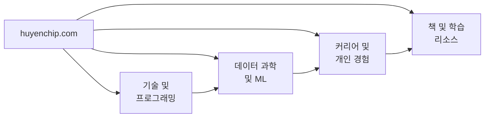
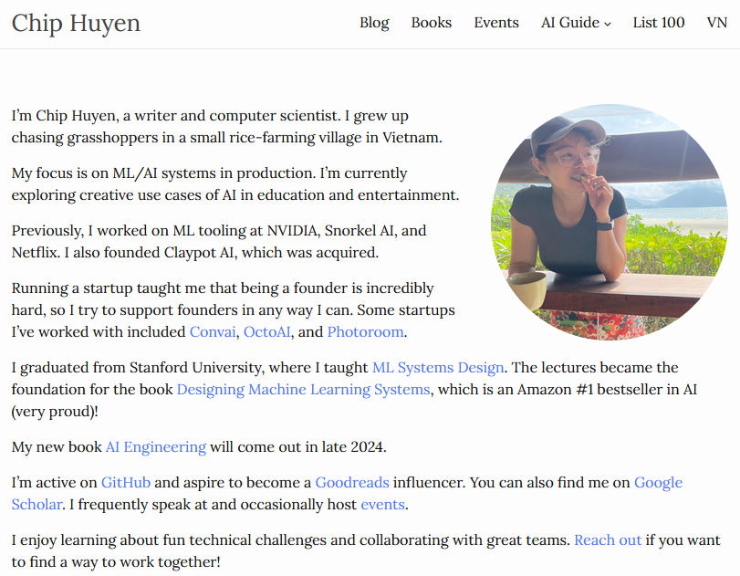

## 개요: Chip Huyen과 블로그 정보

**Chip Huyen**(칩 휴엔, [huyenchip.com](https://huyenchip.com))은 베트남 농촌 출신의 작가이자 컴퓨터 과학자로, **머신러닝·AI 시스템을 프로덕션에 적용하는 일**에 집중하고 있다. 스탠포드에서 ML Systems 강의를 맡았고, 그 강의는 **《Designing Machine Learning Systems》**(O'Reilly, 아마존 AI 분야 베스트셀러 1위, 10개국어 이상 번역)로 출간되었다. NVIDIA, Snorkel AI, Netflix에서 ML 도구 개발에 참여했고, AI 인프라 스타트업 Claypot AI를 설립해 성공적으로 매각한 경험이 있다. 2025년에는 **《AI Engineering》**이 O'Reilly 플랫폼에서 가장 많이 읽힌 책 중 하나로 자리 잡았다.

**추천 대상**: ML·AI 엔지니어, 데이터 사이언티스트, 프로덕션 ML 시스템을 설계·구현하는 개발자, 스타트업 창업·커리어 성장에 관심 있는 독자, 기술 서적·블로그로 학습하는 이들에게 유용하다.

---

## 블로그 구조 개요

Chip Huyen 블로그는 기술 글, 데이터·ML, 커리어·경험, 책·학습 리소스 등으로 나뉘어 있으며, 각 영역이 서로 연결되어 있다. 아래 다이어그램은 블로그의 주요 콘텐츠 흐름을 요약한다.

```mermaid
flowchart LR
  blogRoot["huyenchip.com"]
  techSection["기술 및</br>프로그래밍"]
  dataSection["데이터 과학</br>및 ML"]
  careerSection["커리어 및</br>개인 경험"]
  booksSection["책 및 학습</br>리소스"]
  blogRoot --> techSection
  blogRoot --> dataSection
  blogRoot --> careerSection
  blogRoot --> booksSection
  techSection --> dataSection
  dataSection --> careerSection
  careerSection --> booksSection
```

---

## 블로그의 주요 섹션

### 1. 기술 및 프로그래밍

프로그래밍 언어, 도구, 소프트웨어 개발 모범 사례를 다룬다. 실무에 바로 쓸 수 있는 코드 예제와 적용 팁을 포함하며, 복잡한 개념을 비유와 시각 자료로 풀어 쓴다. ML·AI 관련 포스트는 실무자에게 특히 도움이 된다.

### 2. 데이터 과학 및 머신러닝

데이터 분석과 머신러닝을 심도 있게 다루며, 최신 동향과 실제 적용 사례를 소개한다. 연구와 실무의 연결을 보여 주어, 데이터 사이언스·ML 엔지니어링 커리어를 고민하는 독자에게 영감을 준다.

### 3. 커리어 개발 및 개인 경험

기술 분야 성장과 커리어 개발에 대한 글이 모여 있다. Chip Huyen 본인의 커리어 여정과 스타트업 경험을 바탕으로, 독자가 마주할 수 있는 어려움과 극복 방법에 대한 현실적인 조언을 제공한다.

### 4. 책과 학습 리소스 추천

학습과 성장의 중요성을 강조하며, 읽은 책과 유용한 리소스를 추천한다. 자기 계발과 폭넓은 독서에 관심 있는 독자에게 참고할 만한 목록을 제공한다.

---

## Chip Huyen 블로그의 특징

### 심층적인 기술적 통찰

이론 나열에 그치지 않고, 실제 사례와 코드 스니펫을 함께 제시해 독자가 내용을 그대로 적용할 수 있게 한다. 학문적 지식과 실무 기술 사이의 간극을 줄이는 데 초점을 둔다.

### 명확하고 간결한 글쓰기

복잡한 기술 주제를 명확하고 간결하게 전달한다. 어려운 개념을 이해하기 쉽게 비유와 시각 자료를 활용한다.

### 글로벌 관점

국제적인 배경을 가진 저자로서 다양한 문화와 관점을 블로그에 반영한다. 기술 업계의 글로벌 트렌드를 이해하는 데 도움이 된다.

---

## 추천 이유

Chip Huyen의 블로그는 기술 정보만 나열하는 공간이 아니라, **지속적으로 배우고 성장하려는 동기**를 주는 플랫폼이다. ML·AI 시스템 설계·구현, 커리어·창업 경험, 책과 리소스 추천이 한곳에 모여 있어, 기술 업계에 종사하는 사람은 물론 기술에 관심 있는 모든 이에게 유용한 자료가 된다. [huyenchip.com](https://huyenchip.com)에서 최신 글과 이벤트 정보를 확인할 수 있다.

---

## 참고 문헌

1. **Chip Huyen 공식 블로그** — [https://huyenchip.com](https://huyenchip.com)  
   ML·AI 시스템, 커리어, 책·이벤트 등 공식 콘텐츠.

2. **Chip Huyen GitHub** — [https://github.com/chiphuyen](https://github.com/chiphuyen)  
   AI Engineering·DMLS 책 보조 자료, ML 시스템 설계·TensorFlow 튜토리얼 등 저장소.

3. **Chip Huyen Goodreads** — [https://www.goodreads.com/chiphuyen](https://www.goodreads.com/chiphuyen)  
   저자 소개, 서평, 독서 목록 및 《Designing Machine Learning Systems》《AI Engineering》 등 저서 정보.

---

|  |
| :-------------------------------------------------------------------: |
| 블로그 메인 페이지 (huyenchip.com) |
