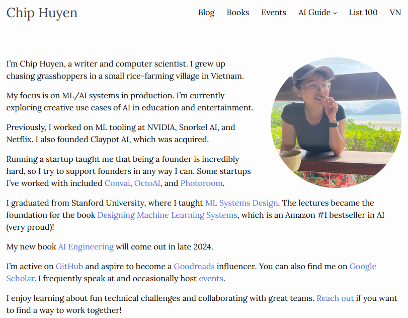

## Huyen Chip: 혁신과 지식의 교차로

Chip Huyen의 개인 웹사이트인 huyenchip.com은 머신러닝 및 인공지능 분야에 관심 있는 이들에게 풍부한 정보를 제공하는 블로그이다. 베트남의 작은 농촌 마을에서 자란 그녀는 현재 작가이자 컴퓨터 과학자로 활동하고 있다.

그녀의 블로그는 주로 머신러닝 시스템의 설계와 구현, 그리고 인공지능의 창의적 활용에 대한 글들로 구성되어 있다. 특히, 머신러닝 시스템 디자인에 대한 강의를 스탠포드 대학교에서 진행한 경험을 바탕으로 한 내용들이 많다. 이러한 강의는 이후 'Designing Machine Learning Systems'라는 책으로 출판되어 아마존 인공지능 분야 베스트셀러 1위에 오르기도 했다.

또한, 그녀는 NVIDIA, Snorkel AI, Netflix 등에서 머신러닝 도구 개발에 참여한 경력을 가지고 있으며, Claypot AI라는 스타트업을 설립하여 성공적으로 인수되었다. 이러한 경험을 통해 스타트업 창업의 어려움을 깊이 이해하고 있으며, Convai, OctoAI, Photoroom 등 여러 스타트업을 지원하고 있다.

블로그에는 머신러닝과 인공지능 시스템의 실제 적용 사례, 최신 연구 동향, 그리고 교육과 엔터테인먼트 분야에서의 창의적인 AI 활용 방안 등에 대한 글들이 다수 포함되어 있다. 또한, 그녀의 새로운 저서 'AI Engineering'이 2024년 말에 출간될 예정이므로, 관련 분야에 관심 있는 독자들에게 유용한 정보를 제공할 것이다.

추가로, 그녀는 GitHub, Goodreads, Google Scholar 등 다양한 플랫폼에서 활동하며, 기술적 도전 과제에 대한 학습과 우수한 팀과의 협업을 즐기고 있다. 관심 있는 이들은 그녀의 블로그를 통해 최신 글과 이벤트 정보를 확인할 수 있다.

||
|:---:|
|블로그 메인 페이지|

## 블로그의 주요 섹션

Huyen Chip의 블로그는 다양한 섹션으로 구성되어 있으며, 각각은 독자가 특정 주제에 집중할 수 있도록 잘 정리되어 있다.

1. **기술 및 프로그래밍**
이 섹션에서는 프로그래밍 언어와 도구, 소프트웨어 개발 모범 사례에 대해 다룬다. 그녀의 글은 실질적인 코딩 예제와 응용 가능한 기술을 포함하며, 복잡한 개념을 쉽게 이해할 수 있도록 설명한다. 특히 머신러닝과 관련된 글은 많은 독자들에게 실질적인 도움을 제공한다.

2. **데이터 과학 및 머신러닝**
Huyen Chip은 데이터 분석과 머신러닝을 심도 있게 다루며, 최신 기술 동향과 혁신적인 응용 사례를 소개한다. 그녀의 글은 연구와 실무 간의 연결을 보여주며, 데이터 과학자나 머신러닝 엔지니어로서의 커리어를 추구하는 사람들에게 영감을 준다.

3. **커리어 개발 및 개인 경험**
기술 분야에서의 성장과 커리어 개발에 관심이 있다면, 이 섹션이 특히 유익하다. Huyen은 그녀 자신의 커리어 여정을 공유하며, 독자들이 직면할 수 있는 도전과 이를 극복하는 방법에 대해 현실적이고 진솔한 조언을 제공한다.

4. **책과 학습 리소스 추천**
Huyen Chip은 학습과 성장의 중요성을 강조하며, 그녀가 읽은 책과 유용하다고 느낀 리소스를 추천한다. 이 섹션은 자기 계발에 관심 있는 사람들에게 귀중한 정보를 제공한다.

## Huyen Chip 블로그의 특징

1. **심층적인 기술적 통찰**

그녀의 글은 단순히 이론적인 내용을 나열하는 데 그치지 않는다. 실제 사례와 코드 스니펫을 포함하여 독자들이 내용을 실질적으로 적용할 수 있도록 돕는다. 이러한 접근 방식은 학문적 지식과 실무 기술 간의 격차를 좁히는 데 큰 도움이 된다.

2. **명확하고 간결한 글쓰기**

Huyen의 글은 복잡한 기술적 내용을 명확하고 간결하게 전달한다. 그녀는 독자들이 어려운 개념을 이해하기 쉽도록 다양한 비유와 시각적 자료를 활용한다.

3. **글로벌 관점**

Huyen은 국제적인 배경을 가진 데이터 과학자로, 다양한 문화와 관점을 블로그에 반영한다. 이는 독자들이 기술 세계에서의 글로벌 트렌드를 이해하는 데 도움을 준다.

## 추천 이유

Huyen Chip의 블로그는 단순히 기술적 정보만 제공하는 것이 아니라, 독자들이 지속적으로 배우고 성장할 수 있도록 동기를 부여한다. 그녀의 통찰력과 경험은 독자들이 자신감을 가지고 새로운 도전에 나설 수 있게 돕는다. 기술 업계에 종사하는 사람들뿐만 아니라 기술에 관심이 있는 모든 사람에게 유용한 리소스가 될 것이다.

## 결론

Huyen Chip의 블로그는 기술적 깊이와 개인적 통찰이 결합된 독특한 플랫폼이다. 그녀의 글은 최신 기술 동향을 따라가고자 하는 독자들에게 필수적인 가이드 역할을 한다. 데이터를 활용한 문제 해결부터 커리어 개발에 이르기까지, 그녀의 블로그는 누구나 배울 수 있는 곳이다. 시간을 내어 방문해 본다면, 많은 영감을 얻을 수 있을 것이다.

