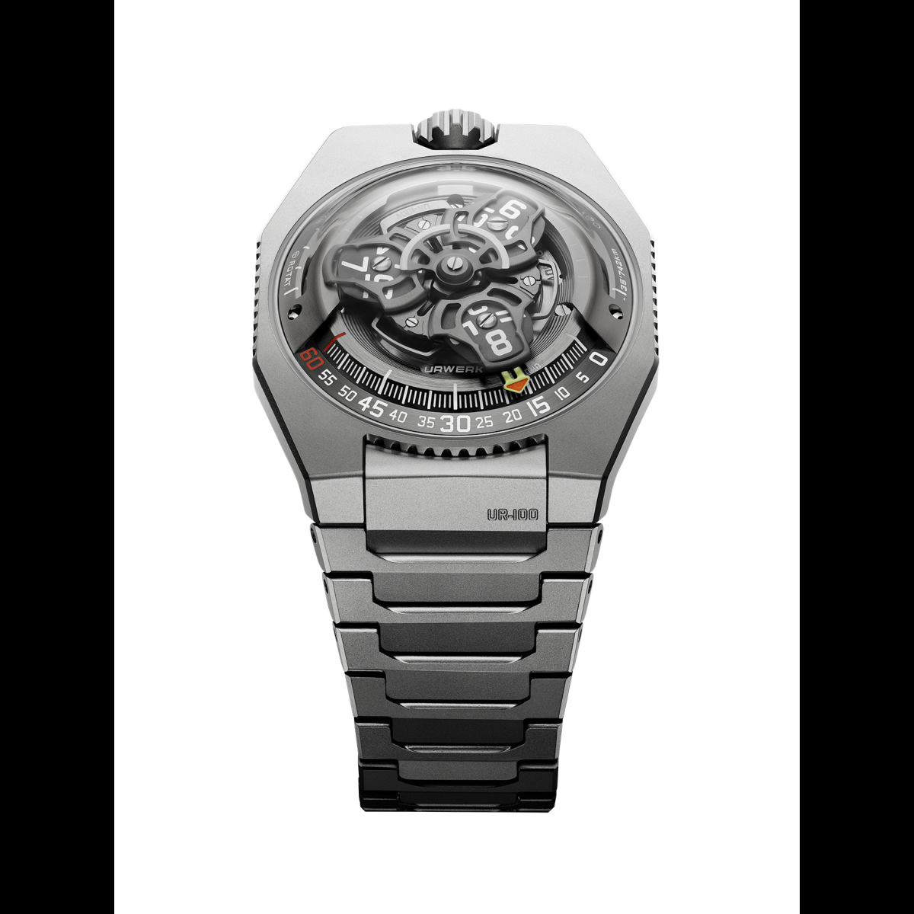
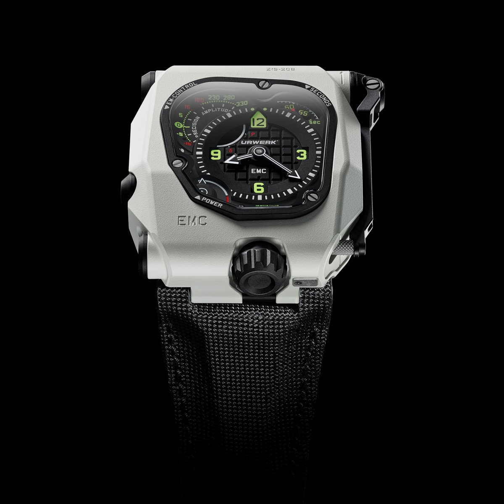

Urwerk는 1997년 스위스 제네바에서 시계 제작자 펠릭스 바움가르트너와 디자이너 마틴 프라이에 의해 설립된 독립 시계 브랜드이다. 'Urwerk'라는 이름은 메소포타미아의 고대 도시 '우르(Ur)'와 독일어로 '작업'을 의미하는 '베르크(Werk)'를 결합한 것으로, 전통과 혁신의 융합을 상징한다. 

Urwerk는 전통적인 시계 디자인에서 벗어나 미래지향적이고 혁신적인 디자인으로 유명하다. 특히 '위성 디스플레이'라 불리는 독특한 시간 표시 방식을 통해 시간을 나타내며, 이는 회전하는 디스크를 활용하여 시간을 표시하는 방식이다. 

이 브랜드는 연간 약 150개의 시계를 한정 생산하며, 각 시계는 독특한 디자인과 복잡한 기계적 합병증을 특징으로 한다. 주요 모델로는 UR-210, UR-105, UR-T8 등이 있으며, 각각 독특한 기능과 디자인을 갖추고 있다. 

Urwerk는 시계 제작에 있어 현대적인 소재와 기술을 적극 활용하며, 티타늄, 알루미늄, 카본 등의 소재를 사용하고 정밀한 마이크로 가공 기술을 적용한다. 또한, 자체적으로 개발한 무브먼트를 사용하여 독창적인 기계적 구조를 구현하고 있다. 

이러한 혁신과 독창성 덕분에 Urwerk는 시계 애호가들과 수집가들 사이에서 높은 평가를 받고 있으며, 현대 시계 제작의 경계를 넓히는 브랜드로 자리매김하고 있다. 

## 라인업

그들의 시계 라인업은 주로 UR-Satellite, UR-Chronometry, UR-Special Projects, Historical Pieces의 네 가지 주요 컬렉션으로 구성되어 있다.

**UR-Satellite 컬렉션**

이 컬렉션은 Urwerk의 대표적인 '위성 디스플레이' 방식을 특징으로 한다. 시간은 회전하는 위성 모듈을 통해 표시되며, 독특한 시각적 경험을 제공한다. 주요 모델로는 다음이 있다:

||
|:---:|
|UR-100V MAGIC T|

- **UR-100V**: 시간 표시와 함께 지구 자전 속도와 태양 주위를 도는 속도를 시각적으로 표현한 모델이다.

- **UR-120**: UR-110 컬렉션의 코드를 발전시켜 더 얇고 우아한 디자인을 구현한 모델이다. 

**UR-Chronometry 컬렉션**

이 컬렉션은 기계식 시계의 정확성을 극대화하기 위한 혁신적인 기술을 도입한 모델들로 구성되어 있다. 주요 모델로는 다음이 있다:

||
|:---:|
|EMC TimeHunter|

- **EMC TimeHunter**: 내장된 정밀 측정 장치를 통해 사용자가 시계의 정확성을 직접 확인하고 조정할 수 있는 기능을 갖춘 모델이다.

**UR-Special Projects 컬렉션**

Urwerk의 창의성과 기술력을 집약한 한정판 모델들이 포함되어 있다. 주요 모델로는 다음이 있다:

- **UR-111C**: 전통적인 시계 디자인을 탈피하여 독특한 시간 표시 방식을 채택한 모델로, 회전하는 원통형 디스플레이를 통해 시간을 표시한다.

- **UR-112**: 복잡한 기계 구조와 미래지향적인 디자인이 결합된 모델로, 디지털 형식의 시간 표시를 특징으로 한다.

**Historical Pieces 컬렉션**

Urwerk의 초기 작품들과 역사적인 모델들이 포함되어 있으며, 브랜드의 발전 과정을 엿볼 수 있는 컬렉션이다. 주요 모델로는 다음이 있다:

- **UR-103**: Urwerk의 초기 대표 모델로, 브랜드의 독특한 디자인 철학을 보여주는 시계이다.

- **UR-110**: '토르피도'라는 별명을 가진 모델로, 독특한 시간 표시 방식과 미래지향적인 디자인으로 주목받았다.

각 컬렉션은 Urwerk의 혁신적인 기술과 디자인 철학을 반영하며, 시계 애호가들에게 독특한 경험을 제공한다.  