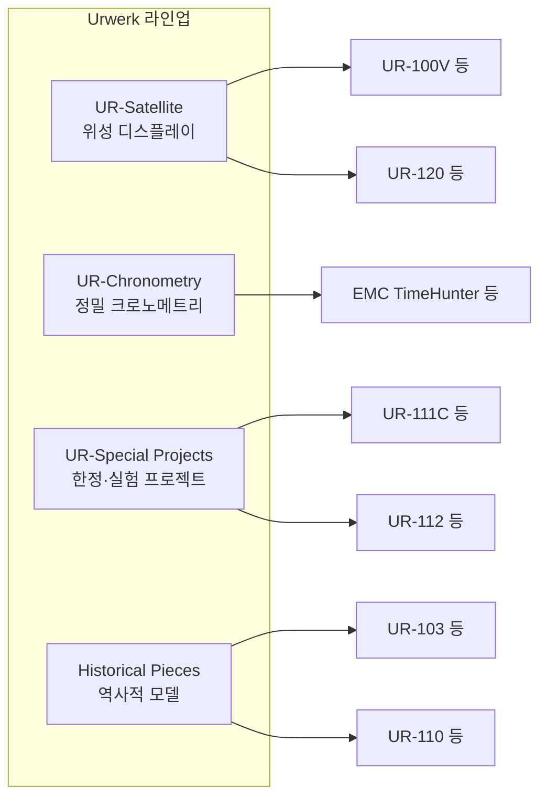
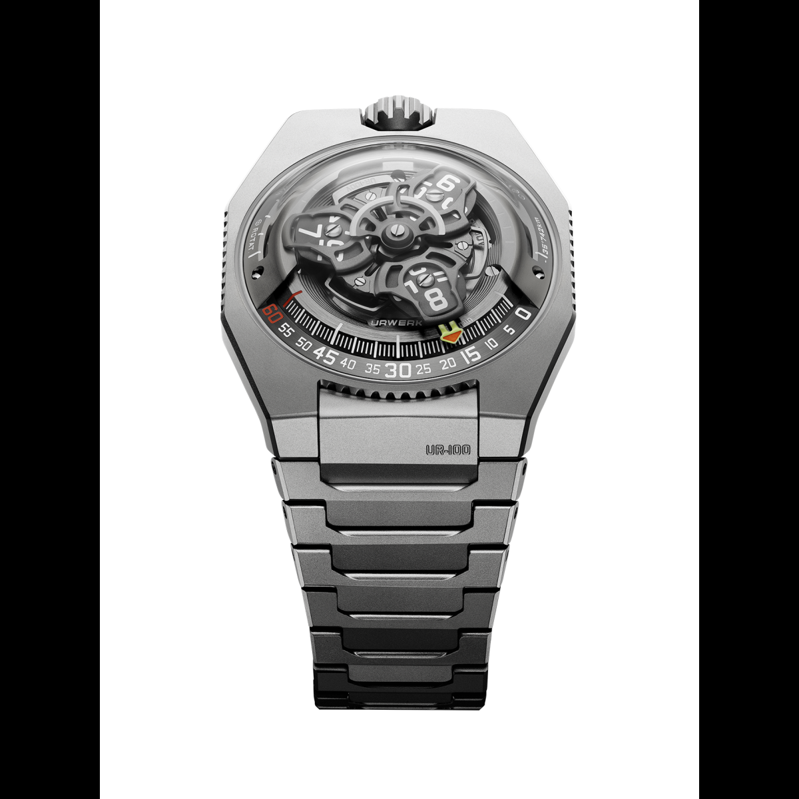
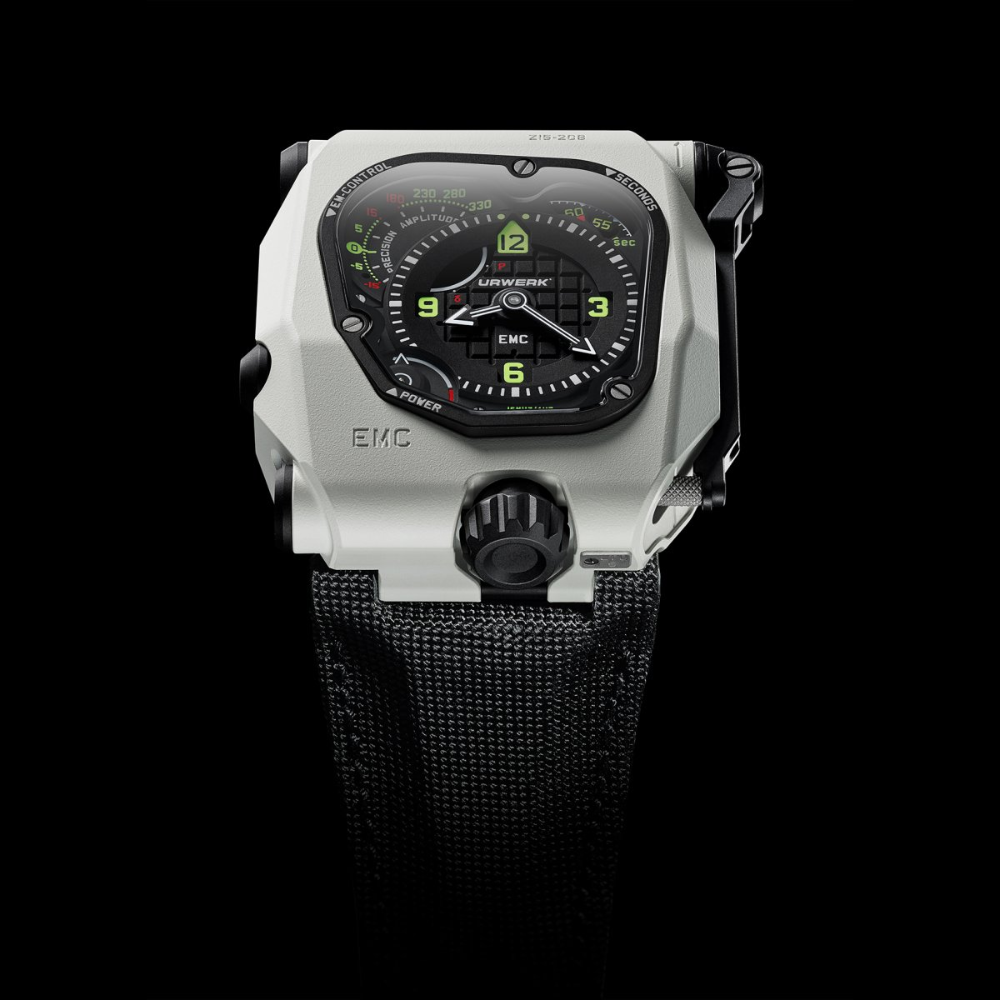

## 개요

**Urwerk**는 1997년 스위스 제네바에서 시계 제작자 **펠릭스 바움가르트너(Felix Baumgartner)**와 디자이너 **마틴 프라이(Martin Frei)**에 의해 설립된 독립 시계 브랜드다. 연간 약 150~200여 개의 시계만 한정 생산하며, 위성 디스플레이(satellite / wandering hours)라는 독특한 시간 표시 방식과 미래지향적 케이스 디자인으로 현대 고급 시계 제작의 경계를 넓히는 브랜드로 평가받는다.

- **대상 독자**: 시계 애호가, 럭셔리 워치·독립 브랜드에 관심 있는 독자, Urwerk 라인업을 한눈에 파악하고 싶은 이
- **이 포스트에서 다루는 내용**: 브랜드 역사·이름의 유래, 라인업 구조(UR-Satellite·UR-Chronometry·UR-Special Projects·Historical Pieces), 컬렉션별 대표 모델, 기술·소재 특징, 참고 문헌

---

## 브랜드 역사와 철학

'**Urwerk**'라는 이름은 메소포타미아의 고대 도시 **우르(Ur)**와 독일어로 '작업·메커니즘'을 의미하는 **베르크(Werk)**를 결합한 것이다. 우르에서는 약 6,000년 전 기념비의 그림자를 이용해 시간 단위를 세웠다고 전해지며, 브랜드는 "시간의 기원을 존중하면서 시계 제작의 규칙을 다시 쓰겠다"는 의미를 담았다. 독일어에서 'Ur'은 원시·원초를, 'Werk'은 창조·메커니즘을 뜻해 **원초적 움직임(original movement)**을 상징한다.

1995년 12월, 펠릭스와 그의 형 토마스, 마틴 프라이는 스위스의 한 학생 파티에서 만나 밤새 시간에 대한 철학을 나누었고, 1996년 1월 1일 Urwerk 아이디어가 공식적으로 탄생했다. 1997년 회사가 설립된 뒤 같은 해 **독립 시계 제작자 아카데미(AHCI)**에서 **UR-101**, **UR-102**를 선보이며 '위성처럼 하늘을 가로지르는' 방랑하는 시간 표시(wandering hours)로 첫 신호를 남겼다. 2003년에는 6년간의 어려움 끝에 **UR-103**을 출시하며, 전면을 향한 3차원 원뿔형 위성 인디케이션을 브랜드의 아이콘으로 자리 잡게 했다.

---

## 라인업 구조

Urwerk의 시계 라인업은 크게 네 가지 컬렉션으로 나뉜다. 아래 다이어그램은 이 구조를 요약한다.

```mermaid
graph LR
  subgraph UrwerkLineup["Urwerk 라인업"]
    UrSatellite["UR-Satellite</br>위성 디스플레이"]
    UrChronometry["UR-Chronometry</br>정밀 크로노메트리"]
    UrSpecialProjects["UR-Special Projects</br>한정·실험 프로젝트"]
    HistoricalPieces["Historical Pieces</br>역사적 모델"]
  end
  UrSatellite --> Ur100V["UR-100V 등"]
  UrSatellite --> Ur120["UR-120 등"]
  UrChronometry --> EmcTimeHunter["EMC TimeHunter 등"]
  UrSpecialProjects --> Ur111C["UR-111C 등"]
  UrSpecialProjects --> Ur112["UR-112 등"]
  HistoricalPieces --> Ur103["UR-103 등"]
  HistoricalPieces --> Ur110["UR-110 등"]
```

| 컬렉션 | 특징 |
|--------|------|
| **UR-Satellite** | 위성 디스플레이 방식의 핵심 라인. 회전하는 위성 모듈로 시·분을 표시한다. |
| **UR-Chronometry** | 정확도 측정·조정 기능을 넣은 크로노메트리 계열. |
| **UR-Special Projects** | 한정판·실험적 디자인·특수 시간 표시(원통형, 디지털 형식 등) 모델. |
| **Historical Pieces** | UR-103, UR-110 등 브랜드 초기·역사적 모델. |

---

## UR-Satellite 컬렉션

이 컬렉션은 Urwerk의 대표적인 **위성 디스플레이(satellite / wandering hours)** 방식을 구현한다. 시간은 회전하는 위성 모듈을 통해 표시되며, 전통적인 바늘 대신 궤도 위의 인디케이터로 읽는 독특한 시각적 경험을 제공한다.

|  |
| :---: |
| UR-100V MAGIC T |

- **UR-100V**: 시간 표시에 더해 **지구 자전 속도**(적도 기준 20분당 이동 거리)와 **지구 공전 속도**(태양 주위 20분 이동 거리)를 다이얼에 시각적으로 표현한 모델. SpaceTime, LightSpeed 등 변형이 있다.
- **UR-120**: UR-110 계열의 디자인 언어를 이어받아 더 얇고 우아한 케이스와 위성 인디케이션을 결합한 모델. Spock 등 닉네임으로도 알려진다.
- **UR-230 "Eagle"**: 쇼크 흡수 터빈과 와인딩 시스템용 공기 흐름 제어 터빈을 적용한, 내구성과 풍부한 시각 요소를 강조한 모델.

---

## UR-Chronometry 컬렉션

기계식 시계의 **정확도**를 사용자가 확인하고 조정할 수 있도록 한 계열이다. 고급 기계식과 전자 측정을 결합한 형태로, 크로노메트리 성능을 직접 모니터링하는 기능이 특징이다.

|  |
| :---: |
| EMC TimeHunter |

- **EMC TimeHunter**: 내장된 정밀 측정 장치로 시계의 **편차(rate)**를 측정할 수 있다. 사용자가 직접 정확도를 확인하고, 필요 시 미세 조정할 수 있는 '메카니컬 + 전자 보조 인디케이션' 구조로 알려져 있다.

---

## UR-Special Projects 컬렉션

Urwerk의 창의성과 기술력을 집약한 **한정·실험 프로젝트** 라인이다. 위성 디스플레이를 벗어난 원통형·디지털 형식의 시간 표시, 특수 케이스·메커니즘을 적용한 모델들이 포함된다.

- **UR-111C**: 전통적인 다이얼을 탈피해 **회전하는 원통형 디스플레이**로 시·분을 표시하는 모델. 미세 기계 공학과 독창적 레이아웃이 강조된다.
- **UR-112 Aggregat**: 복잡한 기어 구조와 디지털 형식의 시간 표시(시·분·초)를 특징으로 하며, 약 25.5g의 고밀도 메커니즘으로 정밀 조립을 요구하는 한정 모델이다.

---

## Historical Pieces 컬렉션

Urwerk의 **초기·역사적 모델**을 아우르는 컬렉션이다. 브랜드의 디자인·기계 철학이 정립된 시기의 작품들을 통해 발전 과정을 엿볼 수 있다.

- **UR-103**: 2003년 출시된 브랜드의 아이콘. 전면을 향한 3차원 원뿔형 위성 인디케이션이 처음 적용되었고, 'Tarantula' 등 닉네임으로도 불렸다.
- **UR-110**: '토르피도'라는 별명으로 알려진 모델. 시간이 항상 케이스 오른쪽 영역에 표시되며, 0~60분 눈금을 따라 위성들이 아래로 이동하는 구성을 가진다.

---

## 기술과 소재

Urwerk는 **자체 개발 무브먼트**와 **인하우스 위성 컴포넌트** 제작, 수작업 마무리로 차별화한다. 티타늄, 세라믹, 알루미늄, 카본 등 현대 소재를 적극 사용하며, 마이크로 가공과 정밀 조립을 통해 독특한 기계 구조를 구현한다. 위성 인디케이션의 구동, 레트로그레이드 분침, 터빈 와인딩, 오일 체인지 인디케이터 등 다양한 컴플리케이션을 단일 브랜드 아이덴티티 안에 녹여 낸다.

---

## 종합 정리

- **장점**: 위성 디스플레이와 미래지향적 케이스로 시계 디자인의 스펙트럼을 넓혀 왔으며, 소량 한정 생산과 인하우스 제작으로 수집 가치와 브랜드 일관성을 유지한다.
- **단점**: 가격대가 높고 구하기 어려우며, 전통적인 다이얼을 선호하는 이에게는 읽기 방식이 낯설 수 있다.
- **한 줄 요약**: Urwerk는 '시간의 기원(Ur)'과 '메커니즘(Werk)'을 결합한 이름처럼, 전통 크로노메트리와 실험적 디자인을 함께 추구하는 스위스 독립 시계 브랜드다.

---

## 참고 문헌

1. **URWERK 공식 사이트** — 브랜드 소개 및 라인업: [https://www.urwerk.com](https://www.urwerk.com)
2. **URWERK Our Story** — 설립 배경, 펠릭스·마틴 소개, 연대기: [https://www.urwerk.com/node/26](https://www.urwerk.com/node/26)
3. **Ethos Watches — Felix Baumgartner & Martin Frei 인터뷰** — 제작 철학, 모델 닉네임, 라인업 일부 소개: [https://www.ethoswatches.com/the-watch-guide/felix-baumgartner-martin-frei-urwerk/](https://www.ethoswatches.com/the-watch-guide/felix-baumgartner-martin-frei-urwerk/)
