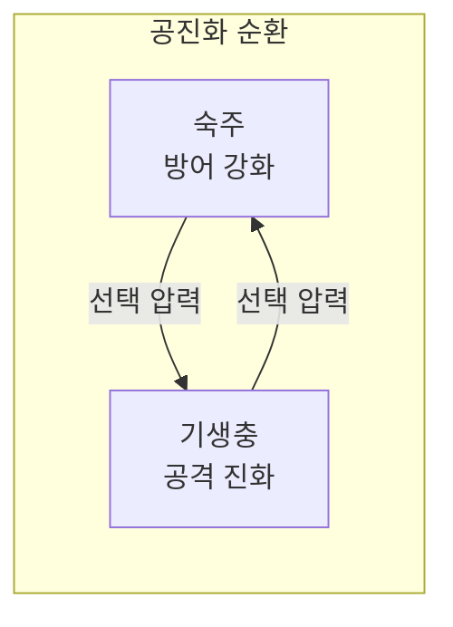
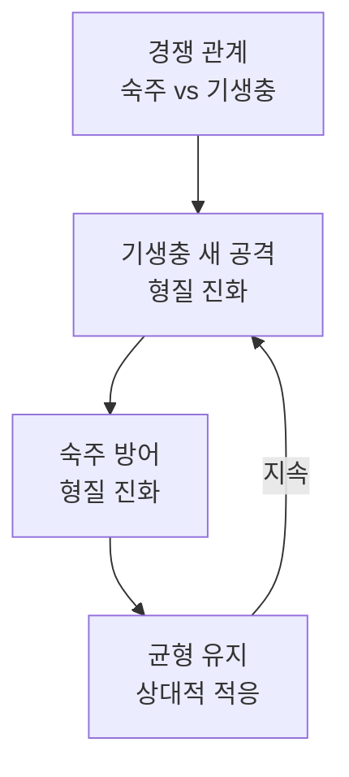

## 개요

**붉은 여왕 효과(Red Queen Effect)**는 진화생물학과 생태학에서, 유기체가 **환경 변화와 경쟁적 상호작용** 속에서 생존·균형을 유지하려면 끊임없이 진화해야 한다는 이론이다. 1973년 리 밴 밸런(Leigh Van Valen)이 화석 기록의 소멸률을 설명하기 위해 제안했으며, 루이스 캐럴의 소설 *거울 나라의 앨리스*에 나오는 붉은 여왕의 대사에서 이름을 빌렸다.

> "여기서는 제자리에 있으려면 있는 힘껏 달려야 해!"  
> — 붉은 여왕, *Through the Looking-Glass*

이 한 문장은 **상대적 적응**의 본질을 잘 담고 있다. 절대적으로 “더 나아지는” 것이 아니라, 경쟁자와 환경이 함께 변하기 때문에 “제자리를 지키는” 것만으로도 끊임없이 달려야 한다는 뜻이다.

| 항목 | 내용 |
|------|------|
| **유래** | 루이스 캐럴, *Through the Looking-Glass* |
| **학술 제안** | Leigh Van Valen (1973), 소멸률의 연령-독립성 설명 |
| **핵심 메시지** | 정체는 곧 퇴보; 지속적 적응이 생존 조건 |
| **추천 독자** | 진화·생태·경쟁 전략·기술 경쟁에 관심 있는 독자 |

---

## 이론적 배경

### 기본 개념

붉은 여왕 효과가 성립하는 조건은 대략 다음과 같다.

1. **진화하지 않으면 도태 위험**: 한 종만 진화하고 상대가 정체해 있으면, 진화하는 쪽이 일시적 우위를 갖는다. 그러나 상대도 진화하면 그 우위는 쉽게 사라진다.
2. **상호 압박의 지속**: 숙주와 기생충, 포식자와 피식자처럼 서로를 선택 압력으로 삼는 관계에서는 양쪽 모두가 “달리지 않으면” 한쪽이 밀리며, 결국 둘 다 제자리를 유지하려면 계속 진화해야 한다.

### 밴 밸런의 소멸 법칙

Van Valen은 화석 자료를 분석해 **어떤 분류군이든 소멸 확률이 그 분류군의 “나이”와 거의 무관하게 일정하다**는 경험 법칙을 제시했다. 이를 설명하기 위해, “유효 환경”이 경쟁하는 종들의 진화 때문에 **확률적으로 일정한 속도로 악화된다**고 보았다. 즉, 한 종의 적응적 진보는 공존하는 다른 종에게는 환경 악화이고, 상대도 진화하므로 장기적으로는 아무도 지속적 우위를 누리지 못한다는 **제로섬 게임**으로서의 공진화를 가정한 것이 붉은 여왕 가설이다.

### 생물학적 함의

- **자연선택의 상대성**: “절대적으로 더 좋은 형질”이 아니라 “현재 환경·경쟁자 대비 더 나은 형질”이 선택된다.
- **생태계의 역동성**: 생물 다양성과 생태계가 안정된 균형이 아니라, 끊임없는 군비 경쟁(arms race)으로 유지되는 체계로 이해된다.

---

## 메커니즘과 구조: 공진화 순환

숙주–기생충 또는 포식자–피식자 관계에서 붉은 여왕 효과는 **상호 압박 → 적응 → 상대의 재적응**이 반복되는 순환 구조로 나타난다. 다음 다이어그램은 이 순환을 단순화해 보여 준다.

- **노드 ID**: `Host`, `Parasite`, `Coevolution`, `Start`, `StepA` 등 공백 없이 camelCase·PascalCase 사용.
- **라벨**: 등호·대괄호·콜론 등 특수문자가 있으면 전체 라벨을 큰따옴표로 감싼다.
- **줄바꿈**: `\n` 대신 ` ` 사용.

위와 같은 순환이 끊기지 않는 한, “제자리 유지”를 위해서도 계속 “달려야” 하므로 붉은 여왕 효과가 유지된다.

---

## 주요 사례

### 1. 기생충과 숙주

말라리아 원충(*Plasmodium*)은 인간의 면역 회피를 위해 지속적으로 변이하고, 인간은 이에 맞서 항체·면역 반응을 진화시킨다. 백신·약제 개발과 내성 발달도 같은 구조다. 한쪽만 진화하면 일시적 우위가 생기지만, 상대가 따라오면 다시 균형으로 돌아가는 패턴이 반복된다.

### 2. 포식자–피식자 관계

치타는 속도와 사냥 기술을 진화시키고, 가젤은 도주 능력과 민첩성을 진화시킨다. 이솝 우화의 “토끼는 목숨을 걸고, 여우는 저녁을 위해 달린다”는 말처럼, 피식자에게는 선택 압력이 더 크게 작용할 수 있지만, 양쪽 모두 멈추면 한쪽이 도태되는 구조는 동일하다.

### 3. 성의 진화와 붉은 여왕

붉은 여왕 가설은 **유성 생식의 유지**를 설명하는 데도 쓰인다. 무성 생식은 효율적이지만 유전적 다양성이 낮아, 기생충 등이 한 번 적응하면 같은 유전형을 가진 개체들을 연속적으로 공격할 수 있다. 유성 생식은 매 세대 유전적 조합을 바꿔, 기생충이 “따라잡기” 어렵게 만든다. Morran 등(2011)의 *C. elegans*–세라티아 실험처럼, 공진화하는 기생충이 있으면 유성 생식 집단이 무성 생식 집단보다 생존에 유리하다는 결과가 이를 지지한다.

### 4. 사회·기술 경쟁

인간 사회의 기술 경쟁, 기업 간 혁신 경쟁, 사이버 보안에서의 공격–방어 경쟁도 붉은 여왕 효과의 비유로 자주 쓰인다. 해킹 기법이 진화하면 방어 체계도 진화해야 하고, 한쪽만 정체하면 상대에게 밀리게 된다.

---

## 현대적 해석과 응용

### 진화론적 관점

붉은 여왕 효과는 “왜 진화가 멈추지 않는가”에 대한 한 답이다. 생물 다양성과 생태계의 역동성, 그리고 화석 기록에서 보이는 소멸률의 연령-독립성 등을 이해하는 데 중요한 틀을 제공한다.

### 기술 혁신과 보안

기업·국가·개인 수준에서 기술과 보안은 “한 번 완성”이 아니라 지속적 업그레이드의 대상이다. 경쟁자와 위협이 진화하기 때문에, 정체는 곧 상대적 퇴보로 이어진다.

### 인공지능과 적응

AI 모델의 성능 향상, 악성 사용에 대한 방어, 콘텐츠·사기 탐지 등도 공진화 구조로 볼 수 있다. 새로운 공격·오용이 등장할 때마다 방어와 정책이 따라가야 하는 점에서 붉은 여왕 효과와 유사하다.

---

## 결론

붉은 여왕 효과는 **생존과 발전이 “한 번의 적응”이 아니라 “끊임없는 적응”**임을 보여 준다. 생물학의 숙주–기생충·포식자–피식자 관계, 성의 진화, 그리고 기술·보안·경쟁 전략에 이르기까지, “제자리를 지키기 위해 달리는” 구조는 넓게 적용된다. 정체는 곧 퇴보라는 메시지는 개인과 조직의 학습·혁신·보안 전략을 설계할 때도 유용한 직관을 준다.

---

## 참고 문헌

1. **Wikipedia. "Red Queen hypothesis."**  
   [https://en.wikipedia.org/wiki/Red_Queen_hypothesis](https://en.wikipedia.org/wiki/Red_Queen_hypothesis)  
   붉은 여왕 가설의 유래, 밴 밸런의 제안, 성의 진화·노화·경쟁 이론과의 연계, 대안 가설(예: Court Jester, Black Queen) 등 종합 정리.

2. **ScienceDaily. "Sex — as we know it — works thanks to ever-evolving host-parasite relationships, biologists find."** (2011-07-09)  
   [https://www.sciencedaily.com/releases/2011/07/110707141158.htm](https://www.sciencedaily.com/releases/2011/07/110707141158.htm)  
   Morran et al., *C. elegans*–*Serratia* 공진화 실험 요약: 공진화하는 기생충 앞에서 유성 생식이 무성 생식보다 유리함을 보여 붉은 여왕 가설을 지지.

3. **Britannica. "Red Queen hypothesis."**  
   [https://www.britannica.com/science/Red-Queen-hypothesis](https://www.britannica.com/science/Red-Queen-hypothesis)  
   붉은 여왕 가설의 정의와 Hamilton-Zuk 가설 등 관련 개념 간단 소개.
