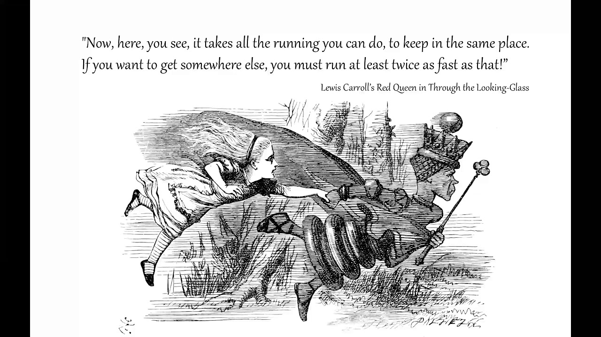

## 붉은 여왕 효과 (Red Queen Effect)란?

||
|:---:|
|The Red Queen Effect|

붉은 여왕 효과는 **진화생물학과 생태학**에서 유기체들이 환경 변화에 적응하거나 경쟁적 우위를 유지하기 위해 끊임없이 진화해야 한다는 이론이다. 이는 루이스 캐럴의 소설 *거울 나라의 앨리스*에서 붉은 여왕이 앨리스에게 한 말에서 유래하였다:

> "여기서는 제자리에 있으려면 있는 힘껏 달려야 해!"

이 문장은 환경이 끊임없이 변화하고 생존 경쟁이 지속됨을 상징적으로 표현하고 있다.

---

#p## 이론적 배경

1. **기본 개념**  
   붉은 여왕 효과는 다음과 같은 상황에서 나타난다:
   - 유기체가 진화하지 않으면 도태될 위험에 처함.
   - 상호작용하는 종들(예: 숙주와 기생충)이 서로를 압박하며 끊임없이 진화.

2. **진화적 군비 경쟁**  
   붉은 여왕 효과는 종 간의 경쟁적 관계에서 특히 두드러진다. 예를 들어:
   - **숙주와 기생충**: 기생충이 숙주의 방어 체계를 무력화하는 방법을 진화시키면, 숙주는 이에 대응하기 위해 더 강한 면역 체계를 진화시켜야 한다.
   - **포식자와 먹이**: 포식자가 더 빠르고 교묘한 사냥 기술을 발전시키면, 먹이는 이를 피하기 위해 더 빠르거나 더 은밀한 행동을 진화시켜야 한다.

3. **생물학적 암시**  
   붉은 여왕 효과는 자연 선택이 상대적인 과정임을 보여준다. 절대적인 기준에서 생물의 진화가 성공적일지라도, 환경과 경쟁자가 함께 진화한다면 그 성공은 유지되지 않을 수 있다.

---

## 주요 사례

1. **기생충과 숙주**  
   말라리아 원충은 인간의 면역 체계를 회피하기 위해 끊임없이 변이하며, 인간은 이에 대응해 항체를 진화시킨다.

2. **포식자-피식자 관계**  
   치타는 빠른 속도로 사냥에 성공하지만, 가젤 역시 빠르게 달리는 능력을 계속 발전시켜야 한다.

3. **사회적 경쟁**  
   인간 사회에서도 붉은 여왕 효과가 적용된다. 기술 발전이나 경제적 경쟁은 끊임없이 새로운 해결책과 적응을 요구한다.

---

## 현대적 해석과 응용

1. **진화론적 관점**  
   붉은 여왕 효과는 왜 유기체가 멈추지 않고 진화해야 하는지에 대한 설명을 제공한다. 이는 생물 다양성과 생태계의 역동성을 이해하는 데 중요한 역할을 한다.

2. **기술 혁신**  
   기술 경쟁에서도 붉은 여왕 효과를 볼 수 있다. 기업들은 경쟁에서 도태되지 않기 위해 지속적으로 새로운 제품과 서비스를 개발한다.

3. **인공지능과 사이버 보안**  
   해커와 보안 시스템 간의 경쟁은 현대판 붉은 여왕 효과의 사례이다. 공격 방법이 발전할수록 방어 시스템도 더욱 정교해져야 한다.

---

## 결론

붉은 여왕 효과는 생물학, 경제학, 기술 발전 등 다양한 분야에서 나타나는 **지속적 적응과 진화의 필요성**을 보여주는 중요한 개념이다. 이는 단순히 경쟁의 압박을 넘어, 생존과 발전을 위한 끊임없는 움직임의 본질을 설명한다. 이와 같은 지속적인 변화 속에서, 정체는 곧 퇴보임을 암시한다.