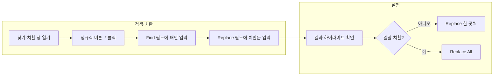

## 개요

Visual Studio Code(VSCode)는 다양한 언어와 도구를 지원하는 코드 에디터이다. 그중 **정규식(Regular Expression)**을 활용한 검색·치환은 반복적인 텍스트 수정, 코드 스타일 통일, 문서 일괄 변환 등에서 개발자 생산성을 크게 높여 준다. 이 글에서는 VSCode에서 정규식 찾기·치환을 **활성화하는 방법**, **Find/Replace 패턴의 의미**, **캡처 그룹과 대소문자 변환**까지 단계별로 다루고, 실무에 바로 쓸 수 있는 예시와 워크플로우를 정리한다.

**추천 대상**
- VSCode로 코드·문서를 편집하는 개발자
- 동일 패턴의 텍스트를 일괄 치환해야 하는 경우
- 변수명·함수명 대소문자 규칙을 한 번에 맞추고 싶은 경우

**다루는 내용**
- 정규식 검색·치환 기능 활성화 및 단축키
- 예시 패턴 `^- ([a-zA-Z]+)\s([a-zA-Z]+)\s([a-zA-Z]+)$`와 치환 `- \u$1\u$2\u$3` 상세 해설
- 단계별 적용 방법과 워크플로우 다이어그램
- 추가 팁 및 참고 문헌

---

## 정규식 검색·치환이란

VSCode의 기본 찾기(`Ctrl+F` / `Cmd+F`)는 입력한 문자열을 **그대로** 찾는다. **정규식 모드**를 켜면 검색창에 입력한 내용이 **정규식 패턴**으로 해석되어 다음이 가능해진다.

- **특정 패턴의 단어·기호만 검색**: 예) `\d+`로 숫자만, `[a-zA-Z]+`로 영문 단어만
- **문자열의 앞뒤 조건 확인**: `^`(줄 시작), `$`(줄 끝), `\b`(단어 경계) 등
- **캡처 그룹으로 원하는 부분만 치환**: `(…)`로 잡은 부분을 `$1`, `$2`로 재사용
- **대소문자 변환**: `\u`, `\l` 등으로 캡처한 텍스트의 첫 글자만 대문자/소문자로 바꾸기

이를 잘 활용하면 수십·수백 곳을 손으로 바꿀 필요 없이 한 번에 패턴 기반 치환이 가능하다.

---

## 사용 환경 및 단축키

| 동작 | Windows / Linux | macOS |
|------|------------------|--------|
| 현재 파일에서 찾기 | `Ctrl + F` | `Cmd + F` |
| 현재 파일에서 찾기·치환 | `Ctrl + H` | `Cmd + Option + F` |
| 전체 프로젝트에서 찾기 | `Ctrl + Shift + F` | `Cmd + Shift + F` |

찾기·치환 창이 열린 상태에서 **검색창 왼쪽의 `.*` 아이콘**을 클릭하면 정규식 모드가 켜진다. 아이콘이 눌린 상태일 때 입력한 내용이 정규식으로 해석된다.

---

## 예시: Find 패턴 상세 해설

다음은 "대시 + 공백 + 세 개의 영문 단어" 한 줄을 찾아, 세 단어를 이어 붙이고 각 단어 첫 글자를 대문자로 만드는 예시이다.

**Find(찾기)**  
`^- ([a-zA-Z]+)\s([a-zA-Z]+)\s([a-zA-Z]+)$`

**Replace(바꾸기)**  
`- \u$1\u$2\u$3`

### Find 패턴 구성 요소

| 부분 | 의미 |
|------|------|
| `^` | 줄의 시작 |
| `- ` | 리터럴 대시 한 개 + 공백 한 개 |
| `([a-zA-Z]+)` | 영문 대소문자 하나 이상 → **캡처 그룹 1** (`$1`) |
| `\s` | 공백 문자 하나 |
| `([a-zA-Z]+)` | 두 번째 단어 → **캡처 그룹 2** (`$2`) |
| `\s` | 공백 하나 |
| `([a-zA-Z]+)` | 세 번째 단어 → **캡처 그룹 3** (`$3`) |
| `$` | 줄의 끝 |

예: `- foo bar baz` 한 줄은 이 패턴에 매칭되고, `$1=foo`, `$2=bar`, `$3=baz`로 캡처된다.

---

## Replace 구문: `- \u$1\u$2\u$3`

치환 문자열의 의미는 다음과 같다.

- `- `: 대시와 공백은 그대로 유지
- `\u$1`: `$1`(첫 번째 단어)의 **첫 글자만 대문자**로 → `foo` → `Foo`
- `\u$2`: 두 번째 단어 첫 글자 대문자 → `Bar`
- `\u$3`: 세 번째 단어 첫 글자 대문자 → `Baz`

결과적으로 `- foo bar baz` → `- FooBarBaz`로 바뀐다.

### VSCode 치환에서 쓸 수 있는 대소문자 변환

| 구문 | 효과 |
|------|------|
| `\u` | 다음 캡처 그룹의 **첫 글자만 대문자** |
| `\l` | 다음 캡처 그룹의 **첫 글자만 소문자** |
| `\U` | 다음 캡처 그룹 **전체를 대문자** (해당 그룹 끝까지) |
| `\L` | 다음 캡처 그룹 **전체를 소문자** |

변수명·함수명을 PascalCase나 camelCase로 일괄 변환할 때 유용하다.

---

## 단계별 적용 방법

1. **찾기·치환 창 열기**  
   - 현재 파일만: `Ctrl + H`(Windows/Linux) 또는 `Cmd + Option + F`(Mac)  
   - 전체 프로젝트: `Ctrl + Shift + F`(Windows/Linux) 또는 `Cmd + Shift + F`(Mac) 후 상단에서 "Replace" 영역 사용

2. **정규식 모드 켜기**  
   검색창 왼쪽 `.*` 아이콘을 눌러 활성화한다.

3. **Find 필드에 정규식 입력**  
   예: `^- ([a-zA-Z]+)\s([a-zA-Z]+)\s([a-zA-Z]+)$`

4. **Replace 필드에 치환 문자열 입력**  
   예: `- \u$1\u$2\u$3`

5. **결과 확인 후 치환**  
   검색 결과 하이라이트를 보면서 "Replace"로 한 곳씩, 또는 "Replace All"로 일괄 치환한다.

---

## 정규식 찾기·치환 워크플로우

아래 플로우는 "정규식 모드 활성화 → Find 입력 → Replace 입력 → 확인 후 치환" 순서를 요약한 것이다.

- 노드 ID: 공백 없이 camelCase 사용 (`open`, `run`, `A`~`H` 등).
- 라벨에 특수문자·등호가 있는 경우: `"정규식 버튼 .* 클릭"`, `"일괄 치환?"` 등 큰따옴표로 감쌌다.

---

## 추가 팁 및 주의사항

- **전체 프로젝트 치환 전**: "Replace All" 전에 반드시 검색 결과를 훑어보고, 의도한 파일·라인만 포함되는지 확인하는 것이 안전하다.
- **정규식 테스트**: 복잡한 패턴은 [regex101.com](https://regex101.com)이나 [RegExr](https://regexr.com/)에서 먼저 테스트해 보면 실수가 줄어든다.
- **이스케이프**: Find 필드에서 `\`는 이스케이프 문자이므로, 리터럴 `\`를 찾으려면 `\\\\`처럼 입력해야 할 수 있다(엔진에 따라 다름).
- **줄 단위 vs 전체**: 기본적으로 VSCode 정규식은 여러 줄에 걸친 매칭도 가능하다. 줄 단위로만 매칭하려면 `^`·`$`를 사용하면 된다.

---

## 참고 문헌

1. **Visual Studio Code 공식 문서**  
   [Code Navigation - Visual Studio Code](https://code.visualstudio.com/docs/editor/editingevolved) — 에디터 기본 기능 및 코드 탐색. 찾기·치환 관련 단축키와 동작을 이해하는 데 도움이 된다.

2. **VS Code 문서 루트**  
   [Visual Studio Code Documentation](https://code.visualstudio.com/docs) — 설치, 설정, 확장, 디버깅 등 전반적인 공식 문서.

3. **정규식 문법 참고 (MDN)**  
   [Regular expressions - JavaScript \| MDN](https://developer.mozilla.org/en-US/docs/Web/JavaScript/Guide/Regular_expressions) — 정규식 패턴, 그룹, 플래그 등 문법 설명. VSCode의 JavaScript/TypeScript 정규식 동작과 대부분 호환된다.

4. **정규식 테스트 도구**  
   [regex101: build, test, and debug regex](https://regex101.com) — 패턴을 입력하고 테스트 문자열로 결과를 확인할 수 있는 온라인 도구.

---

## 마무리

VSCode의 정규식 찾기·치환을 쓰면 반복적인 텍스트·코드 수정을 빠르게 처리할 수 있다. 캡처 그룹(`$1`, `$2`, …)과 대소문자 변환(`\u`, `\l`)만 익혀도 변수명·목록 포맷 등을 일괄로 맞추는 데 큰 도움이 된다. 위 참고 문헌과 테스트 사이트를 활용해 패턴을 연습해 보면 실무 적용이 수월해진다.
