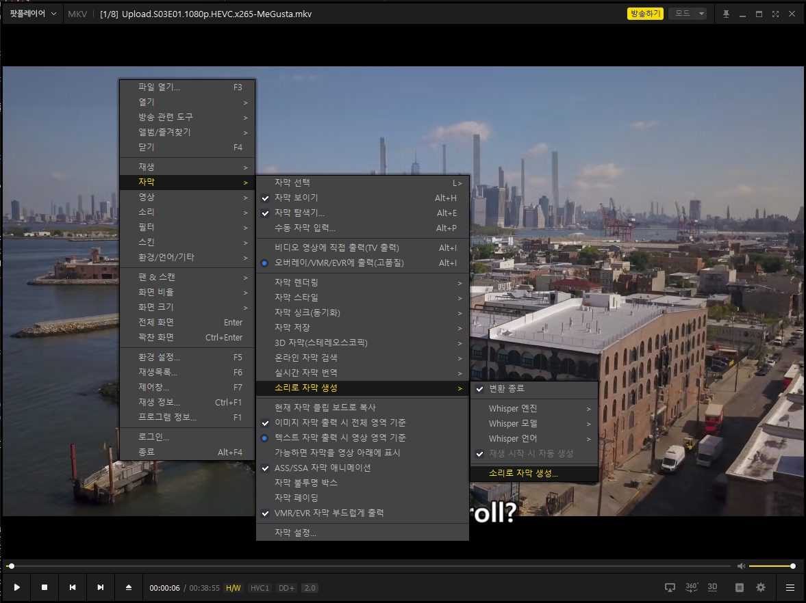
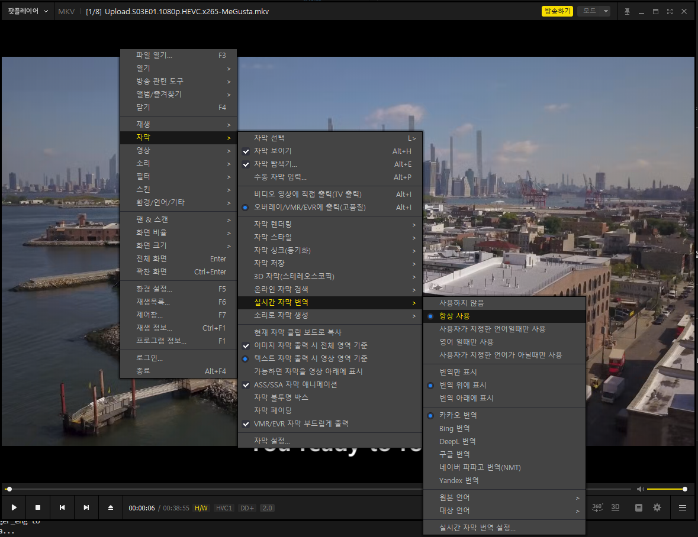

## 팟플레이어와 AI를 활용한 자동 자막 생성 가이드

||
|:---:|
||

## 팟플레이어란?

팟플레이어(PotPlayer)는 강력한 기능과 다양한 포맷 지원으로 전 세계적으로 사랑받는 동영상 재생 프로그램입니다. 최근 업데이트를 통해 인공지능(AI) 기술을 활용한 **자동 자막 생성 기능**이 추가되어 사용자 경험을 혁신적으로 향상시켰습니다.

---

## 팟플레이어에 통합된 위스퍼(Whisper) AI

2024년 12월 11일, 팟플레이어는 새로운 업데이트를 통해 **위스퍼 AI를 기반으로 한 음성을 자막으로 변환하는 기능**을 선보였습니다. 이로 인해 복잡한 설치 과정 없이 누구나 간편하게 AI 기반 자막 생성을 활용할 수 있게 되었습니다.

### 위스퍼 AI란?

위스퍼 AI는 오픈AI에서 개발한 음성 인식 모델로, 동영상의 오디오를 분석해 정확한 텍스트 자막을 생성합니다. 원래는 다음과 같은 복잡한 설치 과정을 거쳐야 했습니다:
- GitHub에서 소스 다운로드
- CUDA 및 PyTorch 설치
- 다양한 환경 설정

이제는 팟플레이어가 이 모든 과정을 단순화하여 사용자 친화적인 인터페이스로 제공합니다.

---

## 팟플레이어에서 AI를 활용한 자동 자막 생성 방법

### 1. 메뉴 선택

||
|:---:|
|메뉴 선택|

1. **동영상 파일 실행**: 팟플레이어로 동영상을 실행합니다.
2. **마우스 우클릭**: 메뉴를 열고, **"자막" > "소리로 자막 생성"**을 선택합니다.

이 과정을 통해 AI 기반 자막 생성 설정 화면으로 이동합니다.

---

### 2. 변환 엔진 및 모델 설정

자막 생성의 핵심은 **모델 선택**입니다. 팟플레이어는 다양한 모델 옵션을 제공하며, 모델에 따라 속도와 정확도가 달라집니다.

| 모델 | 속도 | 정확도 | 추천 사용 사례 |
|------|------|--------|----------------|
| tiny | 빠름 | 낮음 | 간단한 테스트 |
| base | 보통 | 보통 | 표준 사용 |
| small | 느림 | 높음 | 콘텐츠 감상 |
| medium | 느림 | 더 높음 | 전문 콘텐츠 |
| large-v1~v3 | 매우 느림 | 최고 | 정밀 분석 |

**팁**: 컴퓨터 사양에 따라 모델을 선택하세요. 고사양 PC에서는 large-v3를, 저사양 PC에서는 tiny나 base를 추천합니다.

---

### 3. 소리 추출 및 자막 생성

1. **시작 버튼 클릭**: 선택한 설정을 저장하고 자막 생성을 시작합니다.
2. **진행 상황 확인**: 소리 추출 및 자막 변환 과정이 진행됩니다.
3. **완료 확인**: 변환이 완료되면 팝업 화면에서 결과를 확인할 수 있습니다.

---

### 4. 생성된 자막 확인

생성된 자막은 동영상 화면에 바로 표시됩니다. 다만, 현재 자막 파일은 별도의 폴더에 저장되지 않는 점이 아쉽습니다. 차기 업데이트에서 이 기능이 추가되기를 기대해봅니다.

---

## 자동 번역 기능 활용

### 실시간 번역

||
|:---:|
|메뉴 선택|

팟플레이어는 생성된 자막을 다른 언어로 실시간 번역할 수 있는 기능도 제공합니다.  

**활용 방법**:
1. **"자막" 메뉴로 이동**
2. **실시간 번역 옵션 활성화**
3. 원하는 언어를 선택하여 번역된 자막 감상

---

## 주의 사항 및 팁

1. **언어 설정 확인**:  
   자막에 "???"와 같은 오류가 표시된다면 언어를 **자동** 대신 **명시적 선택**으로 설정하세요.
   
2. **번역 오류 해결**:  
   변환된 자막이 영어 등 원하지 않는 언어로 출력되면 팟플레이어의 **실시간 번역** 기능을 활성화하세요.

---

## 결론

팟플레이어의 자동 자막 생성 기능은 AI 기술의 대중화를 한 단계 더 앞당기는 혁신적 도구입니다. 간단한 설정만으로 자막을 생성하고, 실시간 번역으로 언어 장벽도 극복할 수 있습니다. 이 가이드를 통해 팟플레이어의 새로운 기능을 최대한 활용하시길 바랍니다.