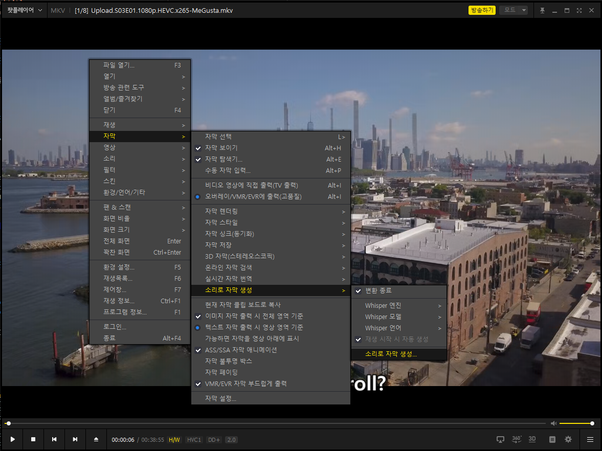
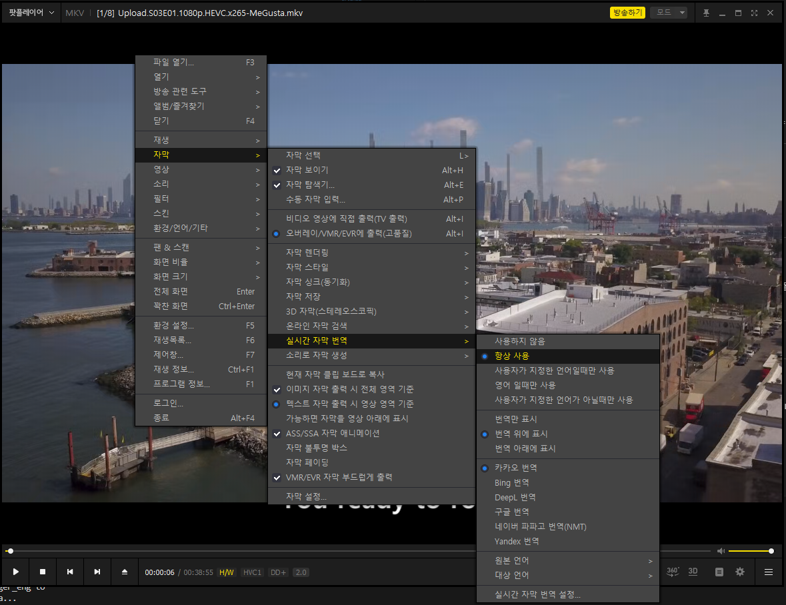

## 개요

### 이 포스트에서 다루는 내용

팟플레이어(PotPlayer)는 다양한 포맷을 지원하는 인기 동영상 재생기입니다. 2024년 12월 업데이트부터 **Whisper AI 기반 자동 자막 생성**이 내장되어, 별도 설치는 없이 영화·드라마·강의 등 동영상의 음성을 텍스트 자막으로 변환할 수 있습니다. 이 포스트는 해당 기능의 사용 방법, 모델 선택, 실시간 번역, 주의 사항까지 한 번에 다룹니다.

### 추천 대상

- **영화·드라마 시청자**: 자막이 없는 영상에 한글·다국어 자막을 붙이고 싶은 분
- **강의·세미나 시청자**: 녹화본에서 자동 자막을 만들어 복습·정리하고 싶은 분
- **Windows 사용자**: 가벼운 설정으로 로컬에서 AI 자막을 쓰고 싶은 분

---

## 전체 워크플로우

팟플레이어에서 AI 자막을 생성하는 과정은 아래 순서와 같습니다.

```mermaid
flowchart LR
    subgraph openStep["재생 준비"]
        nodeA[동영상 열기]
    end
    subgraph menuStep["메뉴 선택"]
        nodeB["자막 메뉴"]
        nodeC["소리로 자막 생성"]
    end
    subgraph settingStep["설정"]
        nodeD["변환 엔진 선택"]
        nodeE["모델 선택"]
        nodeF["언어 설정"]
    end
    subgraph processStep["처리"]
        nodeG["오디오 추출"]
        nodeH["Whisper 인식"]
        nodeI["자막 표시"]
    end
    nodeA --> nodeB
    nodeB --> nodeC
    nodeC --> nodeD
    nodeD --> nodeE
    nodeE --> nodeF
    nodeF --> nodeG
    nodeG --> nodeH
    nodeH --> nodeI
```

---

## 팟플레이어와 Whisper AI 소개

### 팟플레이어란?

팟플레이어는 코덱 지원이 넓고 단축키·스킵 등 조작이 편한 **Windows용 동영상 재생 프로그램**입니다. 최근 업데이트로 재생 중인 영상의 소리를 그대로 활용해 **AI가 자막을 만들어 주는 기능**이 들어와, 자막 파일이 없어도 감상이 가능해졌습니다.

### Whisper AI란?

Whisper는 OpenAI가 공개한 **음성 인식 모델**입니다. 오디오만 넣어도 다국어·방언·잡음이 있는 환경에서도 텍스트로 잘 변환됩니다. 예전에는 GitHub에서 받아 CUDA·PyTorch 등을 직접 설치해야 했지만, 팟플레이어에 통합되면서 **메뉴만 선택하면 바로 사용**할 수 있게 되었습니다.

---

## 단계별 사용 방법

### 1단계: 메뉴에서 자막 생성 시작

|  |
| :---: |
| 자막 > 소리로 자막 생성 메뉴 |

1. **동영상 실행**: 팟플레이어로 자막을 만들고 싶은 동영상을 엽니다.
2. **메뉴 열기**: 화면에서 **마우스 우클릭** 후 **"자막" > "소리로 자막 생성"**을 선택합니다.
3. 설정 창이 뜨면 **변환 엔진·모델·언어**를 선택한 뒤 **시작**하면 됩니다.

---

### 2단계: 변환 엔진 및 모델 설정

자막 품질과 속도는 **모델 선택**에 따라 달라집니다. PC 사양과 용도에 맞게 고르면 됩니다.

| 모델 | 속도 | 정확도 | 추천 사용 |
|------|------|--------|-----------|
| tiny | 매우 빠름 | 낮음 | 빠른 테스트 |
| base | 빠름 | 보통 | 일상적인 시청 |
| small | 보통 | 높음 | 영화·드라마 감상 |
| medium | 느림 | 더 높음 | 강의·정확한 문장 필요 시 |
| large-v1 ~ large-v3 | 매우 느림 | 최고 | 전문·정밀 분석 |

**팁**: 고사양 PC는 `large-v3`, 일반 PC는 `small` 또는 `base`, 저사양은 `tiny`를 권장합니다.

---

### 3단계: 소리 추출 및 자막 생성

1. **시작 버튼 클릭**: 설정을 확정하고 자막 생성을 시작합니다.
2. **진행 상황 확인**: 오디오 추출 → Whisper 인식 순으로 진행되며, 화면에 진행률이 표시됩니다.
3. **완료 후 확인**: 완료되면 팝업으로 결과를 보여 주며, 재생 화면에 자막이 바로 올라갑니다.

현재 버전에서는 생성된 자막이 **별도 파일로 저장되지 않는** 점이 있으며, 차기 업데이트에서 저장 옵션이 지원되길 기대할 수 있습니다.

---

### 4단계: 생성된 자막 확인 및 실시간 번역

생성된 자막은 동영상 위에 곧바로 표시됩니다. 추가로 **실시간 번역**을 쓰면 다른 언어로 바꿔 볼 수 있습니다.

|  |
| :---: |
| 자막 실시간 번역 메뉴 |

**실시간 번역 사용 절차**:
1. **"자막" 메뉴**로 이동합니다.
2. **실시간 번역** 옵션을 켭니다.
3. 원하는 **대상 언어**를 선택하면, 재생 중인 자막이 해당 언어로 번역되어 표시됩니다.

---

## 주의 사항 및 트러블슈팅

### 언어 설정

- 자막에 **"???"** 같은 오류가 나오면, 언어를 **"자동"**이 아니라 **직접 지정**(한국어, 영어 등)으로 바꿔 보세요.
- 영어 영상인데 한글로 나오길 원하면, 원본 언어를 영어로 두고 **실시간 번역**에서 한국어를 선택하면 됩니다.

### 번역 결과가 의도와 다를 때

- 변환된 자막이 생각한 언어가 아니면, **실시간 번역**을 켜서 원하는 언어로 한 번 더 변환하는 방식으로 보완할 수 있습니다.

---

## 정리

팟플레이어의 AI 자동 자막 생성은 **Whisper를 재생기 안에서 바로 쓰는** 형태라, 별도 프로그램 설치 없이 영화·드라마·강의 영상에 자막을 붙이기 좋습니다. 모델을 용도에 맞게 선택하고, 언어 설정과 실시간 번역을 함께 활용하면 활용도가 더 높아집니다. 이 가이드를 참고해 팟플레이어의 자막 기능을 편하게 사용해 보시기 바랍니다.

---

## 참고 문헌 및 출처

- [PotPlayer 공식 사이트 — potplayer.tv](https://potplayer.tv/)
- [OpenAI Whisper — GitHub](https://github.com/openai/whisper)
- [PotPlayer — VideoHelp](https://www.videohelp.com/software/PotPlayer)
