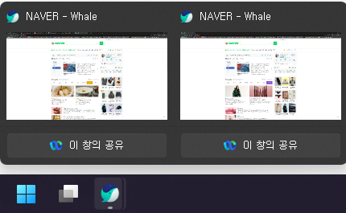

## 개요

Windows 11에서는 작업 표시줄에 **"작업 표시줄에서 모든 창 공유"** 기능이 기본적으로 켜져 있다. 이 기능은 Microsoft Teams, Cisco Webex, Zoom 등 화상회의 앱과 연동되어, 작업 표시줄의 앱 아이콘을 우클릭했을 때 **"이 창의 공유"** 버튼을 바로 띄워 준다. 화면 공유를 자주 하는 사용자에게는 편리하지만, **실수로 창을 공유하거나 불필요한 정보가 노출되는 것을 막고 싶을 때**는 해당 기능을 끄는 것이 좋다.

이 글에서는 Webex·Teams 등에서 작업표시줄 공유 버튼이 나오지 않도록 **Windows 설정에서 한 번에 비활성화하는 방법**을 단계별로 정리한다.

||
|:---:|
|우클릭 메뉴에서 이 창의 공유 버튼|

---

## 비활성화가 필요한 상황

다음과 같은 경우 작업표시줄 공유 버튼을 끄는 것을 고려할 수 있다.

- **실수 공유 방지**: 회의 중 작업표시줄 아이콘을 우클릭하다가 "이 창의 공유"를 눌러 민감한 창이 공유되는 것을 막고 싶을 때
- **프라이버시·보안**: 개인 메신저, 메일, 내부 문서 등이 있는 창이 목록에 노출되는 것 자체를 줄이고 싶을 때
- **정책·규정**: 회사 또는 조직에서 "작업표시줄 공유 기능 사용 금지" 정책을 따를 때
- **UI 단순화**: 사용하지 않는 메뉴 항목을 줄여 클릭 실수를 방지하고 싶을 때

이 옵션은 **시스템 전체**에 적용되므로, Webex만이 아니라 Teams 등 다른 화상회의 앱의 작업표시줄 공유 버튼도 함께 사라진다.

---

## 비활성화 방법 (단계별)

Windows 설정 앱에서 **개인 설정 → 작업 표시줄**로 이동한 뒤, **"작업 표시줄의 모든 창 공유"** 체크를 해제하면 된다.

||
|:---:|
|작업 표시줄 동작 설정|

1. **Windows 설정** 앱을 연다. (Win + I 또는 시작 메뉴에서 "설정" 검색)
2. 왼쪽에서 **"개인 설정"**을 선택한다.
3. **"작업 표시줄"** 항목을 클릭한다.
4. 오른쪽 **"작업 표시줄 동작"** 섹션에서 **"작업 표시줄의 모든 창 공유"** 옵션을 찾는다.
5. 해당 옵션의 **체크를 해제**한다.

설정이 적용되면, 작업 표시줄의 앱 아이콘을 우클릭해도 **"이 창의 공유"** 버튼이 더 이상 표시되지 않는다. 화면 공유가 필요할 때는 Webex·Teams 앱 내 공유 메뉴를 사용하면 된다.

### 설정 흐름 요약

아래 플로우는 위 단계를 한눈에 보기 위한 것이다.

```mermaid
flowchart LR
  startNode["시작"]
  openSettings["설정 앱 열기"]
  personalization["개인 설정 선택"]
  taskbar["작업 표시줄 선택"]
  uncheckOption["작업 표시줄의 모든 창 공유 해제"]
  doneNode["완료"]

  startNode --> openSettings
  openSettings --> personalization
  personalization --> taskbar
  taskbar --> uncheckOption
  uncheckOption --> doneNode
```

---

## 적용 후 확인 사항

- **즉시 반영**: 설정 변경 후 별도 재부팅 없이 바로 적용된다.
- **앱별 동작**: Webex, Teams 등 각 앱을 다시 켤 필요는 없지만, 이미 열려 있던 회의 창에서는 한 번 나갔다 들어오면 변경 사항이 반영된 것을 확인할 수 있다.
- **다시 활성화**: 같은 경로(개인 설정 → 작업 표시줄 → 작업 표시줄 동작)에서 **"작업 표시줄의 모든 창 공유"**를 다시 체크하면 공유 버튼이 복원된다.

---

## 요약

| 항목 | 내용 |
|------|------|
| **설정 위치** | 설정 → 개인 설정 → 작업 표시줄 → 작업 표시줄 동작 |
| **옵션 이름** | "작업 표시줄의 모든 창 공유" |
| **효과** | 작업 표시줄 앱 아이콘 우클릭 시 "이 창의 공유" 버튼 미표시 |
| **적용 범위** | Webex, Teams 등 작업표시줄 연동 공유 기능 전체 |

작업표시줄 공유 기능을 끄면 실수로 창을 공유하는 일을 줄이고, 공유할 때는 반드시 앱 내 공유 메뉴를 사용하게 되어 화면 공유를 더 의도적으로 제어할 수 있다.

---

## 참고 문헌

- Microsoft 공식 문서: Windows 11 작업 표시줄 사용자 지정 (support.microsoft.com에서 "Windows 11 taskbar" 검색)
- Cisco Webex 도움말: 화면 공유 및 창 공유 옵션
- 42jerrykim.github.io에서 더 많은 정보를 확인할 수 있다
