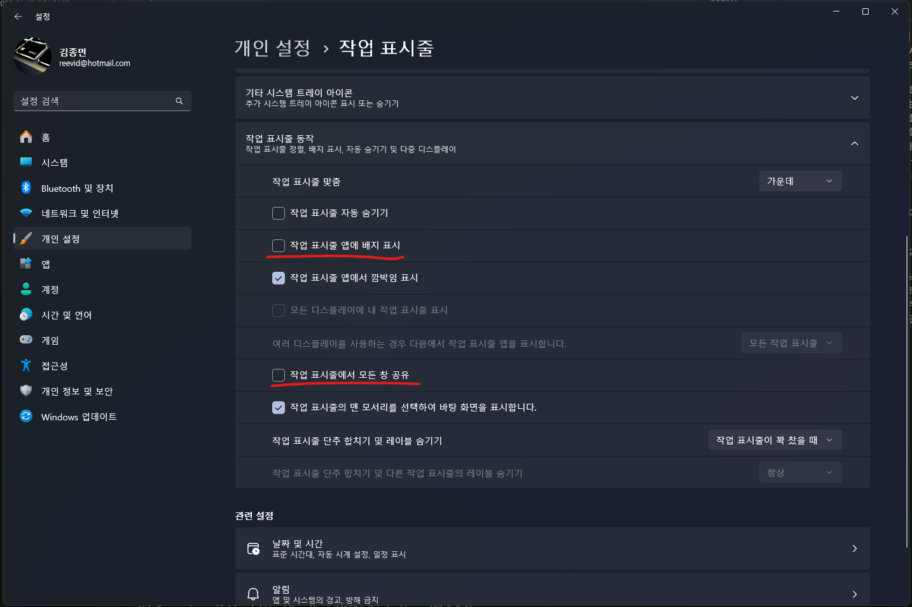

Windows 11의 작업 표시줄 설정에는 "작업 표시줄에서 모든 창 공유" 버튼이 기본적으로 활성화되어 있다. 이 기능은 Microsoft Teams나 Webex 같은 화상회의 프로그램을 사용할 때 화면을 빠르게 공유할 수 있도록 도와주는 편리한 기능이다. 작업 표시줄에서 프로그램 아이콘을 우클릭하면 나타나는 메뉴에서 이 기능을 사용할 수 있다.

||
|:---:|
|우클릭 메뉴에서 이 창의 공유 버튼|

## 비활성화 방법

하지만 이 기능이 불필요하거나 실수로 화면이 공유되는 것을 방지하고 싶다면, Windows 설정에서 해당 기능을 비활성화할 수 있다. 설정 방법은 다음과 같다:

||
|:---:|
|작업 표시줄 동작 설정|

1. Windows 설정 앱을 연다.
2. "개인 설정" > "작업 표시줄"로 이동한다.
3. "작업 표시줄 동작" 섹션에서 "작업 표시줄의 모든 창 공유" 옵션을 찾는다.
4. 해당 옵션의 체크를 해제한다.

이렇게 설정하면 작업 표시줄에서 프로그램 아이콘 우클릭 시 "이 창의 공유" 버튼이 더 이상 표시되지 않는다.

## 결론

이 기능을 비활성화하면 작업 표시줄에서 프로그램 아이콘 우클릭 시 "이 창의 공유" 버튼이 더 이상 표시되지 않는다.