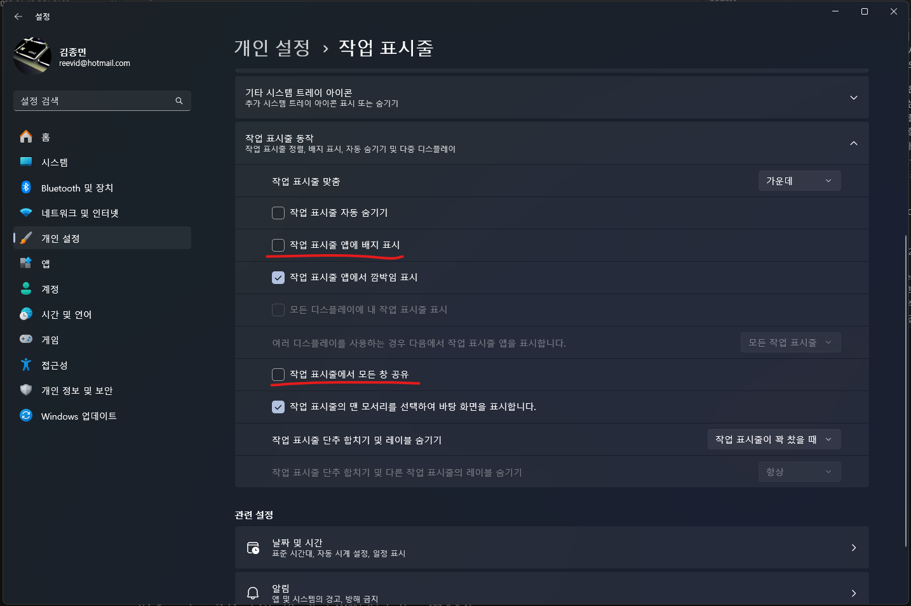

원격 데스크톱 프로토콜(RDP)을 사용하여 원격 세션에 연결할 때 작업 표시줄이 사라지는 문제가 발생하는 경우가 있다. 이는 업무 효율성을 저하시키는 불편한 문제이지만, 간단한 설정 변경으로 해결할 수 있다.

## 문제의 원인

작업 표시줄이 사라지는 현상은 주로 다음과 같은 Windows의 작업 표시줄 설정과 관련이 있다:

||
|:---:|
|Windows 작업 표시줄 설정 화면|

1. "작업 표시줄 앱에 표시" 설정
2. "작업 표시줄에 모든 창 공유" 설정

이러한 설정들이 활성화되어 있을 경우, 원격 세션에서 작업 표시줄 관련 문제가 발생할 수 있다.

## 해결 방법

### 작업 표시줄 설정 변경하기

1. Windows 설정을 연다 (Windows 키 + I)
2. "개인 설정" > "작업 표시줄"로 이동한다
3. 다음 두 가지 설정을 비활성화한다:
   - "작업 표시줄 앱에 표시" 옵션을 끈다
   - "작업 표시줄에 모든 창 공유" 옵션을 끈다
4. 설정을 적용하고 원격 세션을 다시 연결한다

이러한 설정 변경 후에는 작업 표시줄 관련 문제가 상당 부분 해결된다.

## Explorer.exe 재실행하기

작업 표시줄 설정을 변경해도 문제가 지속되는 경우, Windows Explorer 프로세스를 재시작하는 방법을 시도해볼 수 있다. 이는 다음과 같은 두 가지 방법으로 수행할 수 있다:

### Task Manager를 통한 재시작

1. Task Manager를 연다 (Ctrl + Shift + Esc)
2. "Processes" 탭에서 "Windows Explorer"를 찾는다
3. 우클릭 후 "Restart"를 선택한다

||
|:---:|
|Task Manager에서 Explorer 재시작 화면|

### Command Prompt를 통한 재시작

1. Command Prompt를 관리자 권한으로 실행한다 (Windows 키 + X > Windows PowerShell(관리자))
2. 다음 명령어들을 순서대로 입력한다:
   ```cmd
   taskkill /f /im explorer.exe
   start explorer.exe
   ```

이러한 Explorer 재시작 과정을 통해 작업 표시줄이 정상적으로 복구되는 경우가 많다. 만약 문제가 계속되면, 원격 세션을 완전히 종료하고 다시 연결하는 것이 좋다.

## 결론

RDP 원격 세션에서 발생하는 작업 표시줄 문제는 간단한 설정 변경만으로도 해결할 수 있다. 이러한 설정 최적화를 통해 더욱 효율적인 원격 작업 환경을 구축할 수 있다. 위의 해결 방법을 통해 작업 표시줄 관련 문제를 해결하고 원활한 원격 작업을 수행할 수 있을 것이다.
