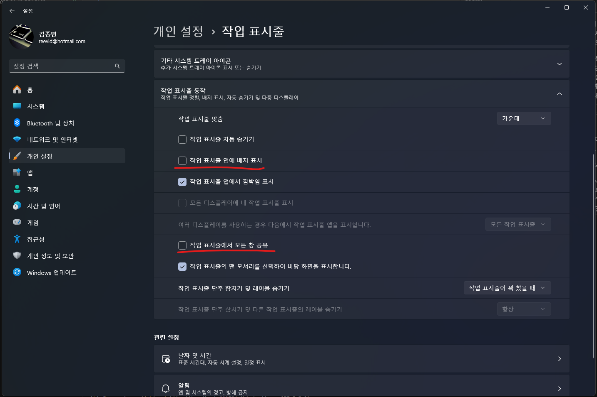
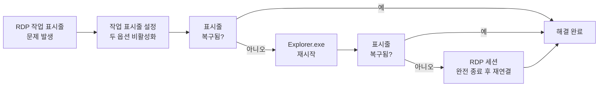

## 개요

**원격 데스크톱 프로토콜(RDP)**으로 Windows 원격 세션에 접속한 뒤 작업 표시줄이 보이지 않거나 사라지는 현상은 원격 업무 환경에서 자주 보고된다. 작업 표시줄이 없으면 실행 중인 앱 전환, 시스템 트레이 확인, 시작 메뉴 접근이 불편해져 업무 효율이 떨어진다. 이 글에서는 해당 현상의 **주요 원인**과 **해결 절차**를 단계별로 정리하고, 문제가 지속될 때 시도할 수 있는 **추가 조치**까지 안내한다. Windows 설정 변경과 **Explorer 재시작**을 중심으로, 트러블슈팅 순서를 한눈에 볼 수 있는 플로우를 함께 제시한다.

**대상 독자**: RDP로 원격 PC에 접속해 업무하는 사용자, 사내 원격 지원·관리자, 작업 표시줄 관련 문제를 직접 해결해야 하는 실무자.

---

## 문제의 원인

작업 표시줄이 RDP 세션에서 사라지거나 숨겨지는 현상은 주로 **Windows 작업 표시줄의 멀티 세션·앱 공유 관련 설정**과 연관된다. 로컬 PC와 원격 PC의 작업 표시줄을 통합해 보여 주는 기능이 켜져 있으면, 원격 세션에서는 표시줄이 비어 보이거나 갱신되지 않는 경우가 있다.

다음 두 설정이 활성화되어 있을 때 이 문제가 자주 발생한다.

1. **"작업 표시줄 앱에 표시"**  
   여러 디스플레이 또는 세션에 걸쳐 작업 표시줄에 앱 아이콘을 공유하는 옵션이다. RDP 세션을 하나의 "디스플레이"처럼 다루는 경우, 로컬과 원격 간 동기화 문제로 원격 쪽 표시줄이 비정상 동작할 수 있다.

2. **"작업 표시줄에 모든 창 공유"**  
   모든 창을 작업 표시줄에 공통으로 표시하는 설정이다. 원격 세션과 로컬 세션의 창 목록이 섞이면서, 원격 세션에서 표시줄이 갱신되지 않거나 비어 보일 수 있다.

아래 캡처는 **원격 세션(또는 문제가 발생하는 PC)**에서 열어야 하는 Windows 작업 표시줄 설정 화면이다. 로컬 PC가 아니라 **RDP로 접속한 그 컴퓨터**에서 설정을 변경해야 한다.

|  |
| :------------------------------------------------------------------: |
| Windows 작업 표시줄 설정 화면 |

---

## 해결 절차 요약 (트러블슈팅 플로우)

아래 플로우는 "작업 표시줄 설정 변경 → 필요 시 Explorer 재시작 → 그래도 안 되면 재연결" 순서를 따른다. 각 단계를 수행한 뒤 **문제 해결 여부**를 확인하고, 해결되지 않으면 다음 단계로 진행하면 된다.


```mermaid
flowchart LR
  Start["RDP 작업 표시줄</br>문제 발생"]
  Step1["작업 표시줄 설정</br>두 옵션 비활성화"]
  Step2["Explorer.exe</br>재시작"]
  Step3["RDP 세션</br>완전 종료 후 재연결"]
  Check1["표시줄</br>복구됨?"]
  Check2["표시줄</br>복구됨?"]
  End["해결 완료"]

  Start --> Step1
  Step1 --> Check1
  Check1 -->|"예"| End
  Check1 -->|"아니오"| Step2
  Step2 --> Check2
  Check2 -->|"예"| End
  Check2 -->|"아니오"| Step3
  Step3 --> End
```

- **1단계**: 작업 표시줄 설정에서 "작업 표시줄 앱에 표시", "작업 표시줄에 모든 창 공유"를 **끈다**.
- **2단계**: 설정 변경 후에도 문제가 있으면 **Windows Explorer**를 재시작한다 (작업 관리자 또는 명령어).
- **3단계**: 위로도 해결되지 않으면 RDP 세션을 **완전히 로그오프한 뒤 다시 연결**한다.

---

## 1단계: 작업 표시줄 설정 변경

작업 표시줄이 사라지는 문제를 해결할 때 가장 먼저 시도할 부분은 **작업 표시줄 관련 옵션을 비활성화**하는 것이다. 아래 순서는 **RDP로 접속한 원격 PC**에서 수행한다.

1. **Windows 설정**을 연다.  
   - 키보드: `Windows 키 + I`
2. **개인 설정** → **작업 표시줄**로 이동한다.
3. 다음 두 옵션을 **끈다**.
   - **"작업 표시줄 앱에 표시"** → 끔
   - **"작업 표시줄에 모든 창 공유"** → 끔
4. 설정 창을 닫고, 필요하면 **RDP 세션을 한 번 끊었다가 다시 연결**해 본다.

이렇게 변경한 뒤에는 대부분의 환경에서 작업 표시줄이 다시 보이거나 정상적으로 갱신된다. 변경 후에도 표시줄이 비어 있거나 반응이 없으면 2단계(Explorer 재시작)로 진행한다.

---

## 2단계: Explorer.exe 재시작

설정을 바꿨는데도 작업 표시줄이 복구되지 않으면 **Windows Explorer 프로세스**를 재시작해 보는 것이 좋다. Explorer가 작업 표시줄과 시작 메뉴를 담당하므로, 일시적인 오류는 재시작으로 해소되는 경우가 많다. 아래 두 가지 방법 중 편한 것을 사용하면 된다.

### 방법 A: 작업 관리자에서 재시작

1. **작업 관리자**를 연다.  
   - `Ctrl + Shift + Esc`
2. **프로세스** 탭에서 **Windows Explorer**를 찾는다.
3. **Windows Explorer**를 우클릭한 뒤 **다시 시작(Restart)**을 선택한다.

|  |
| :--------------------------------------------------------------------: |
| 작업 관리자에서 Explorer 재시작 화면 |

잠시 후 바탕 화면과 작업 표시줄이 다시 그려진다. 로그인 세션은 유지되므로 열려 있던 앱은 그대로 두고 표시줄만 갱신할 수 있다.

### 방법 B: 명령 프롬프트(또는 PowerShell)에서 재시작

명령줄로 처리하려면 **관리자 권한**으로 명령 프롬프트 또는 PowerShell을 연 뒤 아래를 순서대로 실행한다.

1. **관리자 권한 셸** 실행  
   - `Windows 키 + X` → **터미널(관리자)** 또는 **Windows PowerShell(관리자)** 선택
2. 다음 두 명령을 순서대로 입력한다.

```cmd
taskkill /f /im explorer.exe
start explorer.exe
```

- `taskkill /f /im explorer.exe`: 실행 중인 Explorer 프로세스를 강제 종료한다.
- `start explorer.exe`: Explorer를 다시 띄워 작업 표시줄과 바탕 화면을 복구한다.

이 과정을 거치면 작업 표시줄이 정상적으로 다시 나타나는 경우가 많다. 그래도 문제가 계속되면 3단계인 **RDP 세션 완전 종료 후 재연결**을 시도한다.

---

## 3단계: RDP 세션 완전 종료 후 재연결

1·2단계를 적용해도 작업 표시줄이 복구되지 않으면, **원격 세션 자체를 한 번 끝낸 뒤 다시 접속**하는 것이 좋다. "연결 끊기"가 아니라 **로그오프**로 세션을 완전히 종료해야 한다.

- **로그오프**: 원격 PC에서 **시작 메뉴 → 사용자 아이콘 → 로그오프** 또는 `Ctrl + Alt + End` 후 로그오프  
- 그 다음 RDP 클라이언트에서 **다시 연결**해 새 세션을 연다.

이렇게 하면 세션과 Explorer 상태가 초기화되어, 설정 변경 효과가 확실히 적용된 상태로 작업 표시줄을 사용할 수 있는 경우가 많다.

---

## 적용 후 확인 사항 (체크리스트)

아래 항목을 확인해 보면, 해결이 제대로 되었는지와 재발 방지 설정이 들어갔는지 점검할 수 있다.

- [ ] **원격 PC**에서 Windows 설정 → 개인 설정 → 작업 표시줄을 열었다.
- [ ] **"작업 표시줄 앱에 표시"** 옵션을 **끔**으로 두었다.
- [ ] **"작업 표시줄에 모든 창 공유"** 옵션을 **끔**으로 두었다.
- [ ] 필요 시 **Windows Explorer**를 작업 관리자 또는 `taskkill`/`start`로 재시작했다.
- [ ] 문제가 지속될 때는 **로그오프 후 RDP 재연결**까지 진행했다.
- [ ] 재연결 후에도 작업 표시줄이 보이고, 시작 메뉴·시스템 트레이·실행 중인 앱 아이콘이 정상 동작한다.

---

## 정리

RDP 원격 세션에서 작업 표시줄이 사라지는 현상은 **작업 표시줄의 "앱 표시"·"모든 창 공유" 설정**과 **Explorer 프로세스** 상태로 대부분 설명할 수 있다. 먼저 해당 설정 두 가지를 비활성화하고, 필요하면 Explorer를 재시작한 뒤, 그래도 해결되지 않을 때만 세션을 완전히 끊고 다시 연결하는 순서를 따르면 된다. 위 체크리스트와 트러블슈팅 플로우를 참고해 원격 업무 환경을 안정적으로 유지할 수 있다.
