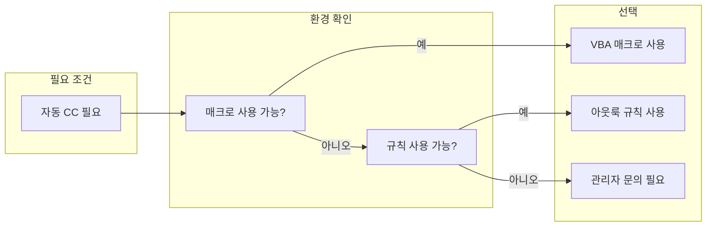

## 개요

Outlook에서 이메일을 보낼 때 **본인을 참조(CC)로 자동 추가**하면, 보낸 메일을 "보낸 편지함"이 아니라 **받은 편지함**에서 바로 확인할 수 있어 업무 추적과 기록 관리가 편해진다. 팀 단위로 발신 메일을 공유해야 하거나, 본인이 CC에 포함되어야 하는 업무가 반복되는 경우에도 매번 수동으로 CC를 넣지 않아도 된다.

이 포스트에서는 **아웃룩 규칙(Rules)** 과 **VBA 매크로** 두 가지 방법을 소개하고, 각각의 설정 절차·장단점·주의사항을 정리한다.

### 이 포스트에서 다루는 내용

- 자동 CC가 필요한 상황과 기대 효과
- **방법 1**: 아웃룩 규칙 마법사를 이용한 자동 CC 설정
- **방법 2**: VBA 매크로를 이용한 자동 CC 설정
- 두 방법의 비교와 선택 가이드
- 적용 시 유의사항(보안 정책, 메일 중복, 예외 처리)
- 참고 문헌(공식 문서 링크)

### 추천 대상

- Outlook으로 업무 메일을 주로 사용하는 직장인
- 보낸 메일을 받은 편지함 기준으로 관리하고 싶은 사용자
- 팀 내 발신 메일 자동 공유(CC)가 필요한 지원 센터·영업·관리 부서
- 규칙 또는 매크로 사용이 허용된 환경의 사용자

---

## 방법 선택 가이드

환경에 따라 **규칙**과 **VBA** 중 하나를 선택하면 된다. 아래 흐름도는 선택 시 고려할 기준을 요약한 것이다.



- **규칙**: 별도 코드 없이 UI만으로 설정 가능. 클라이언트 기준으로 동작하며, 해당 PC에서 Outlook이 실행 중일 때만 적용된다.
- **VBA**: 메일 발송 직전에 스크립트가 실행되어 CC를 추가한다. 회사·기관 보안 정책으로 매크로가 비활성화된 경우 사용할 수 없다.

---

## 방법 1: 아웃룩 규칙을 이용한 자동 CC 설정

아웃룩의 **규칙 및 알림** 기능으로 "내가 보낸 모든 메시지에 특정 수신자(본인)를 CC로 추가"하는 규칙을 만든다.

### 적용 조건

- **클라이언트 규칙**이므로, 규칙을 만든 **해당 컴퓨터**에서 **Outlook이 실행 중일 때만** 적용된다.
- 다른 PC나 웹 메일에서 보낸 메일에는 적용되지 않는다. 사용하는 PC마다 동일 규칙을 만들어 둘 수 있다.

### 설정 절차

1. **Outlook 실행** 후 상단 메뉴에서 **파일** → **정보** → **규칙 및 알림 관리**로 이동한다.
2. **규칙 및 알림** 대화 상자에서 **새 규칙**을 클릭해 **규칙 마법사**를 연다.
3. **"보낸 메시지에 적용"** 또는 **Apply rule on messages I send**에 해당하는 템플릿을 선택한 뒤 **다음**을 클릭한다.
4. **조건 선택** 화면에서 모든 조건 체크를 해제한다. "이 규칙을 모든 보낸 메시지에 적용하시겠습니까?" 같은 경고가 나오면 **예**를 선택한다.
5. **조치 지정** 화면에서 **"메시지를 지정된 사람/배분 목록에게 보낸 사람에게 CC로 보낸다"** (또는 "Cc the message to people or public group") 옵션을 선택한다.
6. 규칙 설명 영역에서 **"지정된 사람/배분 목록"** 링크를 클릭해 **본인의 이메일 주소**를 입력·선택한 뒤 확인한다.
7. **다음**을 눌러 예외 조건이 필요하면 설정하고, 없으면 그대로 진행한다.
8. 규칙 이름을 입력하고(예: "내 메일 자동 CC"), **"이 규칙 사용"**에 체크한 뒤 **마침**을 클릭한다.

설정이 끝나면 해당 PC의 Outlook에서 메일을 보낼 때마다 본인이 자동으로 CC에 포함된다. 작성 화면의 CC란에는 표시되지 않고, 실제 발송 시에만 CC가 추가된다.

### 규칙 해제·예외

- **일시 해제**: **파일** → **규칙 및 알림 관리**에서 해당 규칙의 체크를 해제하면 된다.
- **메일별 예외**: 규칙 마법사에서 "특정 카테고리가 지정된 경우 제외" 같은 예외를 넣어 두고, CC를 넣고 싶지 않은 메일에만 그 카테고리를 붙이는 방식으로 사용할 수 있다. (Microsoft 지원 문서의 "Use a category to turn off the automatic Cc on a per-message basis" 참고.)

---

## 방법 2: VBA 매크로를 이용한 자동 CC 설정

Outlook의 **Application_ItemSend** 이벤트를 사용하면, 메일을 보내기 직전에 VBA 코드로 본인 주소를 CC에 추가할 수 있다.

### 적용 조건

- **매크로 실행이 허용된 환경**이어야 한다. 회사·기관에서 매크로를 차단하면 사용할 수 없다.
- 반드시 **해당 PC의 Outlook**에서만 동작하는 클라이언트 스크립트이다.

### 설정 절차

1. Outlook에서 **Alt + F11**을 눌러 **VBA 편집기**를 연다.
2. 왼쪽 **프로젝트** 창에서 **ThisOutlookSession**을 더블 클릭한다.
3. 아래 코드를 붙여 넣고, `myemail@domain.com` 부분을 **본인의 이메일 주소**로 바꾼다.

```vb
Private Sub Application_ItemSend(ByVal Item As Object, Cancel As Boolean)
    Dim mail As Outlook.MailItem

    If TypeName(Item) = "MailItem" Then
        Set mail = Item
        mail.Recipients.Add "myemail@domain.com"
        mail.Recipients(mail.Recipients.Count).Type = olCC
        Set mail = Nothing
    End If
End Sub
```

4. 저장한 뒤 VBA 편집기를 닫고, 필요하면 **Outlook을 한 번 재시작**한다.
5. 이후 해당 Outlook에서 메일을 보낼 때마다 위 스크립트가 실행되어 본인 주소가 자동으로 CC에 추가된다.

### 코드 설명

- **Application_ItemSend**: 사용자가 보내기 버튼을 누르거나 프로그램에서 `Send`를 호출할 때 발생하는 이벤트이다.
- **MailItem**인 경우에만 `Recipients.Add`로 수신자를 추가하고, 추가된 수신자의 `Type`을 `olCC`로 설정해 참조로 넣는다.
- 자세한 API는 Microsoft Learn의 [Application.ItemSend](https://learn.microsoft.com/en-us/office/vba/api/outlook.application.itemsend), [MailItem.Recipients](https://learn.microsoft.com/en-us/office/vba/api/outlook.mailitem.recipients) 문서를 참고하면 된다.

---

## 두 방법 비교

| 구분 | 아웃룩 규칙 | VBA 매크로 |
|------|-------------|------------|
| **설정 난이도** | UI만으로 가능, 비교적 쉬움 | VBA 편집기 사용, 코드 수정 필요 |
| **코드/스크립트** | 없음 | VBA 코드 필요 |
| **보안 정책 영향** | 규칙이 허용된 환경이면 사용 가능 | 매크로 허용 시에만 사용 가능 |
| **동작 범위** | 해당 PC, Outlook 실행 중일 때 | 해당 PC, Outlook 실행 중일 때 |
| **예외 처리** | 규칙 예외·카테고리 등으로 메일별 제외 가능 | 코드 수정으로 조건 분기 필요 |
| **유지보수** | 규칙 UI에서 수정·해제 | VBA 코드 수정 후 저장 |

공통적으로 **클라이언트 규칙/스크립트**이므로, 사용하는 컴퓨터와 Outlook이 켜져 있어야 하며, 웹 메일이나 다른 클라이언트에는 적용되지 않는다.

---

## 유의 사항

- **회사·기관 환경**: 규칙 생성이나 VBA 매크로가 정책상 제한될 수 있다. 반드시 IT 부서나 관리자에게 허용 여부를 확인한 뒤 적용하는 것이 좋다.
- **메일 중복**: 자동 CC를 쓰면 본인 받은 편지함에 보낸 메일 사본이 쌓이므로, **메일함 용량**과 **정기적인 보관·정리** 계획을 두는 것이 좋다.
- **예외가 필요한 경우**: 특정 메일만 CC를 넣지 않으려면 규칙 방식에서는 "예외" 조건이나 카테고리를 활용하고, VBA 방식에서는 조건문을 추가해 구현할 수 있다.

---

## 참고 문헌

1. Microsoft Support, **"Automatically Cc (carbon copy) someone on every email you send"**  
   [https://support.microsoft.com/en-us/office/automatically-cc-carbon-copy-someone-on-every-email-you-send-0e8e32e9-777f-49fc-878f-41ed7c58677a](https://support.microsoft.com/en-us/office/automatically-cc-carbon-copy-someone-on-every-email-you-send-0e8e32e9-777f-49fc-878f-41ed7c58677a)

2. Microsoft Learn, **"Application.ItemSend event (Outlook)"**  
   [https://learn.microsoft.com/en-us/office/vba/api/outlook.application.itemsend](https://learn.microsoft.com/en-us/office/vba/api/outlook.application.itemsend)

3. Microsoft Learn, **"MailItem.Recipients property (Outlook)"**  
   [https://learn.microsoft.com/en-us/office/vba/api/outlook.mailitem.recipients](https://learn.microsoft.com/en-us/office/vba/api/outlook.mailitem.recipients)

4. Microsoft Support, **"Manage email messages by using rules in Outlook"**  
   [https://support.microsoft.com/en-au/office/manage-email-messages-by-using-rules-in-outlook-c24f5dea-9465-4df4-ad17-a50704d66c59](https://support.microsoft.com/en-au/office/manage-email-messages-by-using-rules-in-outlook-c24f5dea-9465-4df4-ad17-a50704d66c59)

---

정리하면, **설정이 간단한 규칙**을 우선 적용하고, 매크로가 허용된 환경에서 더 세밀한 제어가 필요할 때 **VBA**를 고려하면 된다. 두 방법 모두 해당 PC의 Outlook에서만 동작하므로, 사용하는 환경과 정책을 확인한 뒤 적용하는 것이 중요하다.
