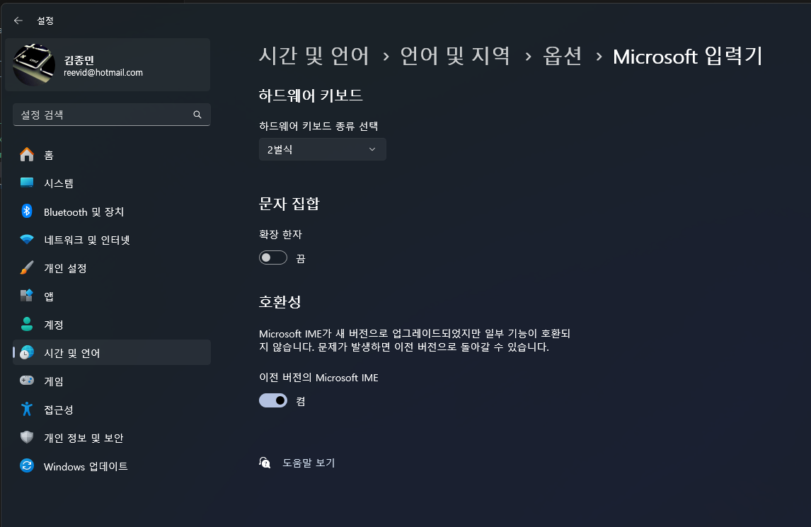

## 개요

원격 데스크톱( RDP ) 세션에서 **Visual Studio Code**( VSCode ), **1Password** 등 특정 애플리케이션을 사용할 때 한글( 한국어 ) 키보드 입력이 전혀 되지 않거나 조합이 깨지는 문제가 발생할 수 있다. 이 포스트는 해당 현상의 **원인**을 정리하고, **이전 버전 Windows IME**를 사용하도록 설정해 해결하는 방법을 단계별로 안내한다.

**대상 독자**: 원격 PC에서 VSCode·1Password 등을 쓰는 개발자·IT 담당자, RDP 환경에서 한글 입력 오류를 겪는 사용자.

---

## 문제 현상

다음과 같은 증상이 **원격 세션에서만** 특정 앱에 한정되어 나타난다.

- **VSCode**: 에디터·터미널·검색창 등에 한글 입력 시 글자가 안 써지거나, 영문만 입력됨.
- **1Password**: 검색창·비밀번호 필드 등에 한글 입력 불가.
- **기타**: Electron 기반 또는 특정 UI 프레임워크를 쓰는 앱에서만 키보드 입력이 막히고, 메모장·탐색기 등 다른 앱은 정상.

로컬(같은 PC에서 직접 사용)에서는 동일 앱에서 한글이 정상 입력되는 경우가 많다.

---

## 원인 요약

Windows 10/11의 **새로운 Microsoft IME**(입력기)와 일부 애플리케이션(특히 원격 세션에서 동작하는 경우) 간 **호환성 문제**로 인해, 해당 앱 창에 키보드 이벤트가 제대로 전달되지 않거나 IME 조합이 적용되지 않는다.  
**이전 버전 Microsoft IME**를 사용하도록 시스템 설정을 바꾸면, 같은 환경에서도 한글 입력이 정상 동작하는 경우가 많다.

---

## 해결 방법

아래 순서대로 진행하면 된다. 전체 흐름은 다음 Mermaid 플로우차트를 참고하면 된다.

```mermaid
flowchart LR
  StartNode["시작"]
  OpenSettings["설정 앱 열기</br>Win + I"]
  TimeAndLanguage["시간 및 언어"]
  LanguageRegion["언어 및 지역"]
  AdminLang["관리자 언어 설정"]
  AdvancedKb["고급 키보드 설정"]
  UseLegacyIme["이전 버전 IME 사용</br>체크"]
  ApplyBtn["적용"]
  Reboot["재시작"]
  EndNode["완료"]

  StartNode --> OpenSettings
  OpenSettings --> TimeAndLanguage
  TimeAndLanguage --> LanguageRegion
  LanguageRegion --> AdminLang
  AdminLang --> AdvancedKb
  AdvancedKb --> UseLegacyIme
  UseLegacyIme --> ApplyBtn
  ApplyBtn --> Reboot
  Reboot --> EndNode
```

### 1단계: Windows 설정 열기

1. **Windows 키 + I**를 눌러 **설정** 앱을 연다.
2. 왼쪽에서 **"시간 및 언어"** 섹션으로 이동한다.
3. 왼쪽 메뉴에서 **"언어 및 지역"**을 선택한다.

### 2단계: 이전 버전 IME 활성화

1. 오른쪽 **"관련 설정"** 영역에서 **"관리자 언어 설정"** 링크를 클릭한다.
2. 열리는 **Region** 창에서 **"고급 키보드 설정"** 링크를 클릭한다.
3. **"이전 버전의 Microsoft IME 사용"** 옵션에 **체크**를 넣는다.
4. **"적용"** 버튼을 누른다.

|  |
| :---: |
| 이전 버전 IME 설정 화면 |

### 3단계: 시스템 재시작

- 설정 변경이 완전히 반영되도록 **Windows를 한 번 재시작**한다.
- 재시작 후 **원격 데스크톱에 다시 연결**한 뒤, VSCode·1Password 등에서 한글 입력이 되는지 확인한다.

---

## 주의사항

- **시스템 전역 적용**: 이 설정은 해당 PC의 **모든 사용자·모든 앱**에 적용된다. IME 동작 방식이 바뀌므로, 새 IME 전용 기능을 쓰는 최신 앱에서는 기대와 다르게 동작할 수 있다.
- **Windows 업데이트**: 큰 버전 업데이트나 누적 업데이트 후에 설정이 **초기화**되는 경우가 있다. 한글 입력 문제가 다시 생기면 위 단계를 다시 진행해 보면 된다.
- **임시 해결책**: 근본 원인은 Microsoft IME와 앱 간 호환성이다. 향후 Windows 또는 각 앱(VSCode, 1Password 등) 쪽 업데이트로 개선될 수 있으므로, 주기적으로 업데이트 내용을 확인하는 것이 좋다.

---

## 정리 및 참고

- **요약**: 원격 세션에서 VSCode·1Password 등에서 한글이 안 써질 때는, **이전 버전의 Microsoft IME 사용** 옵션을 켜고 재시작하면 대부분 해결된다.
- **한 줄**: RDP 환경에서 특정 앱 한글 입력 오류는 Windows 새 IME 호환성 문제이며, 관리자 언어 설정에서 이전 버전 IME를 사용하도록 바꾸면 해결할 수 있다.

