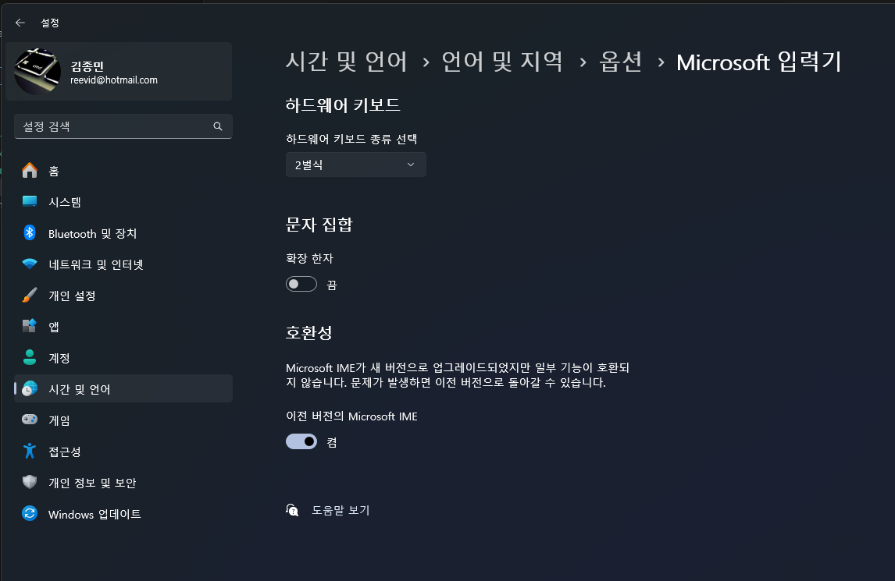

원격 데스크톱 세션에서 Visual Studio Code나 1Password와 같은 특정 애플리케이션을 사용할 때 키보드 입력이 되지 않는 문제가 발생할 수 있다. 이는 Windows의 새로운 IME(Input Method Editor) 시스템과의 호환성 문제로 인한 것이다. 이 문제를 해결하기 위해 이전 버전의 Windows IME를 사용하도록 설정하는 방법을 알아보자.

## 문제 현상

- 원격 데스크톱 연결 시 VSCode에서 키보드 입력이 되지 않음
- 1Password에서 검색이나 입력이 동작하지 않음
- 특정 애플리케이션에서만 키보드 입력이 막힘

## 해결 방법

### 1. Windows 설정 열기

1. Windows 키 + I를 눌러 설정 앱을 연다
2. "시간 및 언어" 섹션으로 이동한다
3. 왼쪽 메뉴에서 "언어 및 지역"을 선택한다

### 2. 이전 버전 IME 활성화

1. "관련 설정" 섹션에서 "관리자 언어 설정"을 클릭한다
2. "고급 키보드 설정"을 선택한다
3. "이전 버전의 Microsoft IME 사용" 옵션을 체크한다
4. "적용" 버튼을 클릭한다

||
|:---:|
|이전 버전 IME 설정 화면|

### 3. 시스템 재시작

- 설정 변경을 완전히 적용하기 위해 Windows를 재시작한다
- 재시작 후 원격 데스크톱에 다시 연결한다

## 주의사항

- 이 설정은 전체 시스템의 IME 동작에 영향을 미친다
- 일부 최신 애플리케이션에서는 새로운 IME 기능을 사용할 수 없게 된다
- Windows 업데이트 후 설정이 초기화될 수 있으므로 문제 발생 시 재설정이 필요할 수 있다

## 결론

이전 버전의 Windows IME를 사용하도록 설정하면 원격 데스크톱 세션에서 발생하는 키보드 입력 문제를 해결할 수 있다. 다만, 이는 임시적인 해결책일 수 있으며, 향후 Microsoft나 각 애플리케이션 개발사가 이 문제를 해결하기 위한 업데이트를 제공할 수 있다. 정기적으로 관련 업데이트를 확인하는 것이 좋다.
