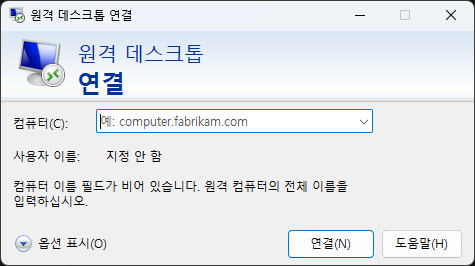
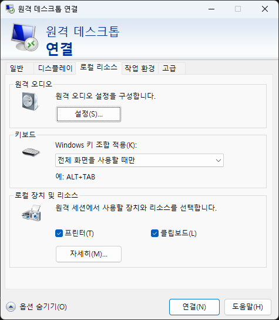
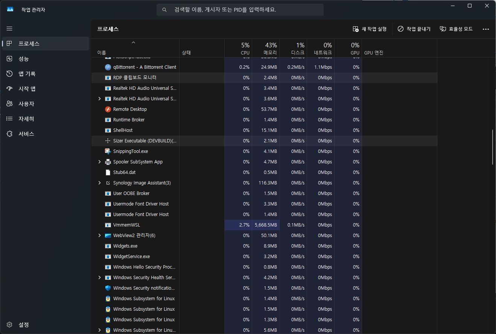

원격 데스크톱 프로토콜(RDP)을 사용하다 보면 호스트와 원격 세션 간의 클립보드 공유가 정상적으로 작동하지 않는 문제가 종종 발생한다. 이는 업무 효율을 크게 저하시킬 수 있는 심각한 문제이므로, 이번 글에서는 이러한 문제의 주요 원인과 해결 방법에 대해 자세히 알아보고자 한다.

## 문제 원인

1. **RDP 설정 미비**: Clipboard 공유 옵션이 비활성화되어 있을 수 있다.
2. **rdpclip.exe 프로세스 문제**: Clipboard 공유를 담당하는 프로세스가 제대로 작동하지 않을 수 있다.

## 해결 방법

### 1. RDP 설정 확인

1. 원격 데스크톱 연결(mstsc.exe)을 실행한다.
2. "옵션 표시"을 클릭하여 고급 설정을 연다.
3. "로컬 리소스" 탭으로 이동한다.
4. "클립보드" 옵션이 체크되어 있는지 확인한다.
5. "자세히"를 클릭하여 추가 클립보드 리소스가 공유되도록 설정한다.

||
|:---:|
|RDP 연결 설정의 "옵션 표시"|

||
|:---:|
|RDP 연결 설정의 로컬 리소스 탭|

### 2. rdpclip.exe 프로세스 재시작

1. Remote session에서 Task Manager를 연다(Ctrl + Shift + Esc).
2. "Processes" 탭에서 "rdpclip.exe"(한글로는 "RDP 클립보드 모니터")를 찾는다.
3. 해당 프로세스를 선택하고 "End Task"를 클릭한다.
4. "File" > "Run new task"를 선택한다.
5. "rdpclip.exe"를 입력하고 Enter를 눌러 프로세스를 다시 시작한다.

||
|:---:|
|Task Manager의 Processes 탭|

## 결론

이번 글에서는 RDP 원격 세션과 호스트 간 클립보드 공유 문제의 주요 원인과 해결 방법에 대해 자세히 알아보았다. 이러한 문제를 해결하면 업무 효율을 크게 높일 수 있으며, 원격 작업에 대한 불편함을 줄일 수 있다. 또한, 이러한 문제를 해결하는 과정에서 원격 데스크톱 연결의 다양한 기능과 설정을 이해할 수 있을 것이다.
