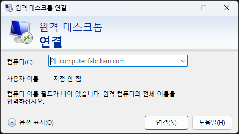
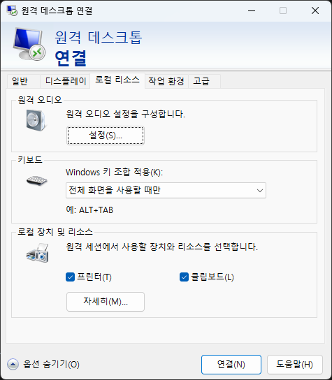
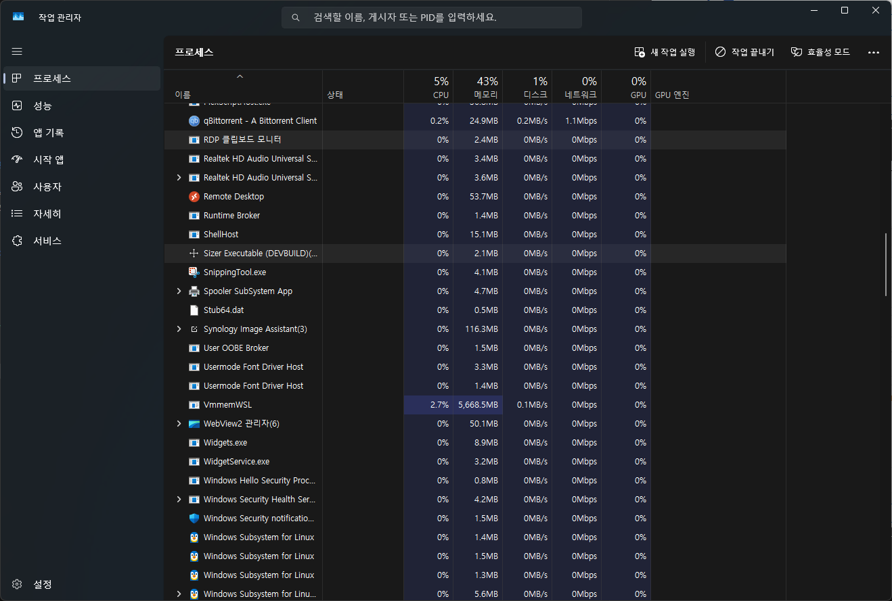
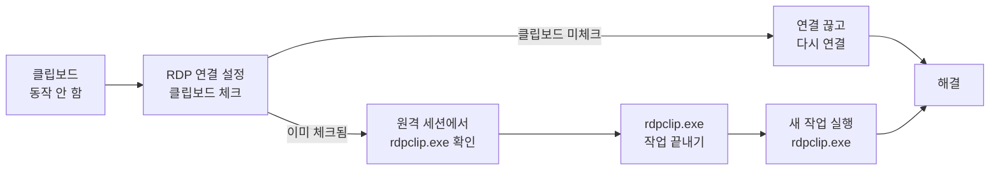

## 개요

원격 데스크톱 프로토콜(RDP, Remote Desktop Protocol)을 사용하면 다른 PC의 바탕 화면을 네트워크를 통해 조작할 수 있다. 이때 **클립보드 공유**가 되면 로컬(호스트)에서 복사한 텍스트나 이미지를 원격 세션에 붙여넣거나, 반대로 원격에서 복사한 내용을 로컬에서 쓸 수 있어 업무 효율이 크게 올라간다. 그런데 이 기능이 동작하지 않는 경우가 자주 발생하며, 원인을 모르면 해결이 어렵다.

**이 포스트에서 다루는 내용**

- RDP 클립보드 공유가 실패할 때의 **주요 원인** 정리
- **연결 설정**에서 클립보드 옵션 확인 방법
- 원격 세션 내 **rdpclip.exe** 재시작 절차
- 위 과정을 한눈에 보는 **트러블슈팅 플로우** 다이어그램

**추천 대상**

- Windows 원격 데스크톱(mstsc, Windows 앱 등)으로 업무용 PC에 접속하는 사용자
- 호스트↔원격 간 복사·붙여넣기가 안 되어 불편을 겪는 사람
- 원인 파악과 단계별 조치를 한 문서에서 보고 싶은 사람

---

## 문제 원인

RDP에서 클립보드가 호스트와 원격 세션 간에 동기화되지 않는 현상은 주로 아래 두 가지에서 비롯된다.

### 1. RDP 연결 설정에서 클립보드 미활성화

클립보드 리디렉션은 **연결 시점**에 클라이언트 설정으로 결정된다. 기본값이 켜져 있더라도, 사용자가 옵션을 건드렸거나 .rdp 파일에서 비활성화되어 있으면 공유가 되지 않는다. 따라서 "로컬 리소스"에서 **클립보드** 항목이 체크되어 있는지 반드시 확인해야 한다.

### 2. rdpclip.exe 프로세스 이상

원격 세션 쪽에서는 **rdpclip.exe**(RDP 클립보드 모니터)가 호스트와 원격의 클립보드를 동기화한다. 이 프로세스가 멈추거나 비정상 종료되면 복사·붙여넣기가 동작하지 않는다. 장시간 세션 유지, 메모리 부족, 또는 특정 앱과의 충돌 등으로 rdpclip이 중단되는 경우가 있다.

---

## 해결 방법

### 1단계: RDP 연결 설정에서 클립보드 확인

연결 **전에** 로컬 PC(호스트가 아닌, RDP 클라이언트를 실행하는 쪽)에서 아래 순서로 확인한다.

1. **원격 데스크톱 연결**(mstsc.exe)을 실행한다.
2. **"옵션 표시"**를 클릭해 고급 설정을 연다.
3. **"로컬 리소스"** 탭으로 이동한다.
4. **"클립보드"** 옵션이 체크되어 있는지 확인한다. 체크 해제되어 있으면 다시 켠다.
5. 필요하면 **"자세히"**를 눌러 추가 리소스 공유를 설정한 뒤 저장한다.

이후 **다시 연결**해야 설정이 적용된다. 이미 연결된 세션에서는 이 설정 변경이 반영되지 않는다.

|  |
| :---: |
| RDP 연결 설정의 "옵션 표시" |

|  |
| :---: |
| RDP 연결 설정의 로컬 리소스 탭 |

### 2단계: 원격 세션에서 rdpclip.exe 재시작

연결 설정이 올바른데도 클립보드가 동작하지 않으면, **원격 세션 안에서** rdpclip.exe를 재시작한다.

1. 원격 세션에서 **작업 관리자**를 연다. (Ctrl + Shift + Esc)
2. **"프로세스"** 탭에서 **"rdpclip.exe"**(한글: RDP 클립보드 모니터)를 찾는다.
3. 해당 프로세스를 선택한 뒤 **"작업 끝내기"**를 클릭한다.
4. 메뉴 **파일** → **새 작업 실행**을 선택한다.
5. **"rdpclip.exe"**를 입력하고 Enter를 눌러 프로세스를 다시 시작한다.

재시작 후에는 별도 로그아웃 없이 곧바로 복사·붙여넣기를 시도해 보면 된다.

|  |
| :---: |
| 작업 관리자의 프로세스 탭에서 rdpclip.exe 확인 |

---

## 트러블슈팅 플로우

아래 플로우차트는 "클립보드가 안 된다"는 상황에서 어떤 순서로 점검하면 좋은지 정리한 것이다. 먼저 연결 설정을 확인하고, 그래도 안 되면 원격 세션에서 rdpclip을 재시작하는 흐름이다.

```mermaid
flowchart LR
  Start["클립보드</br>동작 안 함"]
  CheckRdp["RDP 연결 설정</br>클립보드 체크"]
  Reconnect["연결 끊고</br>다시 연결"]
  CheckRdpclip["원격 세션에서</br>rdpclip.exe 확인"]
  EndTask["rdpclip.exe</br>작업 끝내기"]
  RunNew["새 작업 실행</br>rdpclip.exe"]
  Resolved["해결"]
  Start --> CheckRdp
  CheckRdp -->|"클립보드 미체크"| Reconnect
  Reconnect --> Resolved
  CheckRdp -->|"이미 체크됨"| CheckRdpclip
  CheckRdpclip --> EndTask
  EndTask --> RunNew
  RunNew --> Resolved
```

---

## 요약

| 구분 | 내용 |
| --- | --- |
| **원인** | (1) RDP 연결 시 클립보드 옵션 비활성화 (2) 원격 세션의 rdpclip.exe 비정상 종료 |
| **조치 1** | mstsc 옵션 표시 → 로컬 리소스 → 클립보드 체크 후 재연결 |
| **조치 2** | 원격 세션 작업 관리자에서 rdpclip.exe 끝내기 후 새 작업으로 rdpclip.exe 실행 |
| **효과** | 호스트↔원격 간 복사·붙여넣기 복구로 원격 작업 효율 향상 |

RDP 클립보드 문제는 대부분 **설정 확인**과 **rdpclip 재시작**으로 해결할 수 있다. 위 단계를 적용한 뒤에도 현상이 반복되면, 그룹 정책·방화벽·보안 소프트웨어 등에서 클립보드 리디렉션을 제한하고 있는지 추가로 확인하는 것이 좋다.

---

## 참고 문헌

1. [Compare Remote Desktop client features across platforms](https://learn.microsoft.com/en-us/windows-server/remote/remote-desktop-services/clients/remote-desktop-app-compare) — Microsoft Learn. RDP 클라이언트별 기능 비교(클립보드 리디렉션 등).
2. [Remote Desktop Services](https://learn.microsoft.com/en-us/windows-server/remote/remote-desktop-services/) — Microsoft Learn. Windows Server 원격 데스크톱 서비스 개요.
3. [Enable Remote Desktop on your PC](https://learn.microsoft.com/en-us/windows-server/remote/remote-desktop-services/clients/remote-desktop-allow-access) — Microsoft Learn. PC에서 원격 데스크톱 활성화 및 연결 방법.
