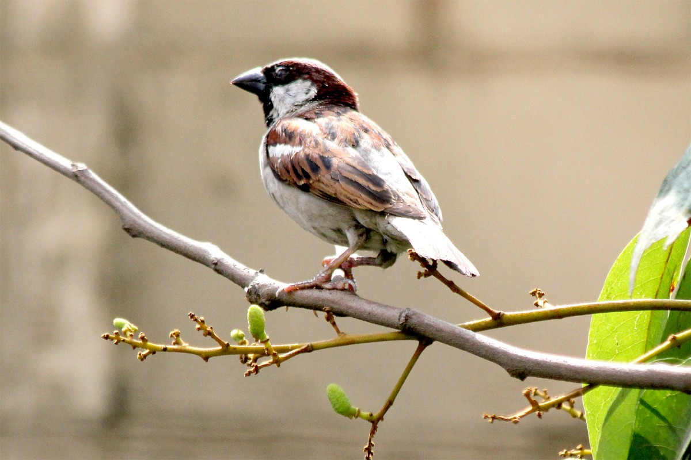

새가 나뭇가지에 앉을 때 과연 새는 나뭇가지를 믿을까, 아니면 자신의 날개를 믿을까? 이는 우리의 삶에 대한 깊은 통찰을 제공하는 질문이다.

||
|:---:|
|새가 나뭇가지에 앉아 자신의 날개를 접고 있는 모습|

## 새와 나뭇가지의 교훈

수많은 새들이 매일 나뭇가지에 앉는다. 그러나 나뭇가지가 부러져서 새가 떨어져 죽는 일은 거의 일어나지 않는다. 이는 새들이 가진 본능적인 지혜를 보여준다:

1. 새는 나뭇가지가 부러질 것을 걱정하지 않는다
2. 설령 나뭇가지가 부러지더라도 자신의 날개로 날 수 있다는 것을 알고 있다
3. 나뭇가지와 자신의 날개, 두 가지 모두를 신뢰한다

## 삶에 대한 통찰

이러한 새들의 모습은 우리 삶에 중요한 교훈을 준다:

- 환경을 신뢰하되, 자신의 능력도 함께 믿어야 한다
- 실패의 가능성에 대한 두려움이 우리를 마비시켜서는 안 된다
- 위기 상황에서도 우리에게는 항상 대안이 있다는 것을 기억해야 한다

## 결론

새들은 나뭇가지만을 신뢰하지 않는다. 그들은 자신의 날개도 함께 믿는다. 이것이 바로 그들이 자유롭게 비상할 수 있는 이유이다. 우리도 환경을 신뢰하되, 그에 못지않게 자신의 능력을 믿어야 한다. 이러한 균형 잡힌 신뢰야말로 진정한 성장과 발전의 토대가 된다.
