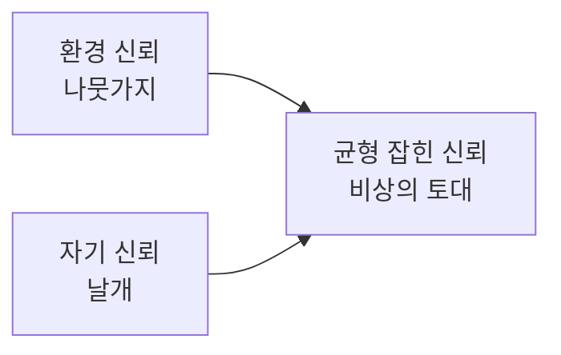

## 개요

> "새는 나뭇가지를 믿을까, 자신의 날개를 믿을까?"

이 질문은 환경에 대한 신뢰와 자기 자신에 대한 신뢰의 균형을 되묻는 유명한 비유다. 새가 나뭇가지에 앉을 때, 그가 진정으로 믿는 것은 부러질 수 있는 나뭇가지가 아니라, 언제든 다시 날 수 있는 **자기 날개**라는 통찰을 담고 있다. 이 글에서는 이 인용의 의미를 풀어보고, 일과 성장에 어떻게 적용할 수 있는지 정리한다.

**이 글을 추천하는 대상**
- 환경·조건에 과도하게 의존하는 느낌이 드는 사람
- 실패나 불확실성 때문에 움찔하는 사람
- 자기효능감(self-efficacy)과 자기신뢰에 관심 있는 사람

---

## 새와 나뭇가지의 교훈

수많은 새들이 매일 나뭇가지에 앉는다. 그런데 나뭇가지가 부러져서 새가 떨어져 죽는 일은 거의 없다. 새들은 본능적으로 다음을 보여준다:

1. **새는 나뭇가지가 부러질 것을 걱정하지 않는다** — 불확실성을 두려워해 앉지 않거나, 나뭇가지만 바라보지 않는다.
2. **나뭇가지가 부러져도 자신의 날개로 날 수 있다는 것을 안다** — 외부 조건이 무너져도 대안은 자기 능력에 있다.
3. **나뭇가지와 자신의 날개, 둘 다 신뢰한다** — 환경을 활용하되, 최종적으로는 자기 날개를 믿기 때문에 비상할 수 있다.

즉, 새는 “나뭇가지만 믿는” 존재가 아니다. **환경(나뭇가지)과 자기 능력(날개)에 대한 균형 잡힌 신뢰**가 있어서 위기가 와도 다시 날 수 있다.

---

## 신뢰의 균형: 환경 vs 자기

이 비유를 “어디에 신뢰를 두는가”라는 관점에서 도식화하면 다음과 같다.

```mermaid
graph LR
  ExternalTrust["환경 신뢰</br>나뭇가지"]
  SelfTrust["자기 신뢰</br>날개"]
  BalancedTrust["균형 잡힌 신뢰</br>비상의 토대"]
  ExternalTrust --> BalancedTrust
  SelfTrust --> BalancedTrust
```

- **환경 신뢰(나뭇가지)**: 회사, 시장, 도구, 사람, 제도 등 외부 조건에 대한 신뢰. 필요하지만 이것만으로는 부족하다.
- **자기 신뢰(날개)**: 나의 능력, 판단, 학습력, 회복력에 대한 신뢰. 조건이 바뀌어도 다시 일어서고 날아오를 수 있는 근거다.
- **균형 잡힌 신뢰**: 둘 중 하나에만 치우치지 않고, 환경을 활용하면서도 최종 책임과 대안은 자기에게 있다고 보는 태도. 이게 “비상의 토대”가 된다.

---

## 삶과 커리어에 대한 통찰

이 비유가 주는 메시지를 일상과 커리어에 옮기면 다음과 같다.

- **환경을 신뢰하되, 자신의 능력도 함께 믿어야 한다**  
  좋은 팀, 좋은 회사, 좋은 시장은 도움이 되지만, 그게 없어지거나 바뀌어도 “내가 다시 배우고, 옮기고, 적응할 수 있다”는 믿음이 있으면 덜 흔들린다.

- **실패 가능성에 대한 두려움이 행동을 마비시키지 않게 한다**  
  나뭇가지가 부러질 수 있다는 걸 알면서도 새는 앉는다. 우리도 “실패할 수 있음”을 인정한 뒤, “그래도 나는 대처할 수 있다”는 자기신뢰를 키우는 쪽이 유리하다.

- **위기 상황에서도 대안은 있다는 것을 기억한다**  
  나뭇가지가 부러지면 날개로 날아오른다. 커리어·관계·건강에서도 “이 조건이 무너지면 끝”이 아니라 “다른 길, 다른 방법, 다른 환경”을 찾을 수 있다는 믿음이 회복력으로 이어진다.

---

## 심리학과의 연결: 자기효능감(Self-Efficacy)

이 비유는 심리학의 **자기효능감(self-efficacy)** 개념과 잘 맞닿아 있다. Bandura에 따르면, 자기효능감은 “특정 목표를 달성하기 위해 필요한 행동을 할 수 있다는 개인의 믿음”이다. 높은 자기효능감을 가진 사람은:

- 어려운 과제를 “피해야 할 위협”이 아니라 “극복할 대상”으로 본다.
- 실패 후에도 더 빨리 회복하고, 실패를 “노력 부족” 등 통제 가능한 요인으로 돌리며 다시 도전한다.
- 스트레스와 우울에 덜 취약하다.

반대로, **환경(나뭇가지)에만 신뢰를 두고 자기 능력(날개)에 대한 믿음이 약하면**, 조건이 나빠질 때 무력감·학습된 무기력에 빠지기 쉽다. 따라서 “나뭇가지도 쓰되, 결국 믿는 것은 내 날개”라는 비유는, **자기효능감을 의식적으로 키우는 태도**와 같은 방향을 가리킨다.

---

## 결론

새는 나뭇가지만 믿지 않는다. **자신의 날개도 함께 믿기 때문에** 나뭇가지에 앉을 수 있고, 부러져도 다시 날 수 있다. 우리도 환경을 신뢰하되, 그에 못지않게 **자기 능력과 내면의 힘을 신뢰**할 때, 위기와 변화 속에서도 비상할 수 있다. 이러한 균형 잡힌 신뢰가 진정한 성장과 회복력의 토대가 된다.

**한 줄 요약**  
환경(나뭇가지)을 활용하되, 최종적으로 믿고 키워야 할 것은 자기 능력(날개)이다.

---

## 참고 문헌

1. Wikipedia. *Self-efficacy*.  
   <https://en.wikipedia.org/wiki/Self-efficacy>
2. American Psychological Association. *Psychology topics*.  
   <https://www.apa.org/topics>
3. Ackerman, C. E. *What Is Self-Efficacy? (Incl. 8 Examples & Scales)*. PositivePsychology.com.  
   <https://positivepsychology.com/self-efficacy/>
