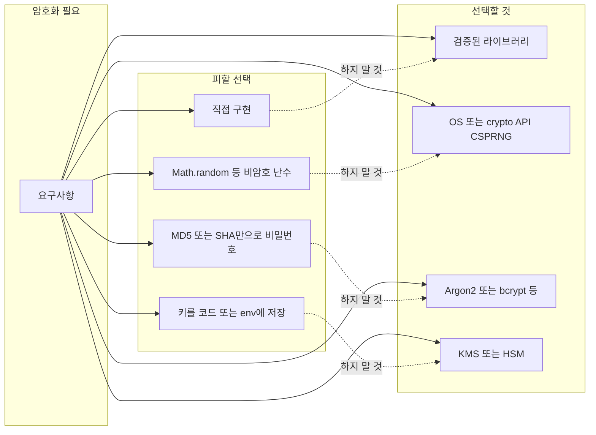

## 개요

암호화는 현대 소프트웨어에서 데이터 보호의 핵심이지만, 잘못 구현하면 오히려 허점이 된다. Latacora의 에세이 [How to Not Do Crypto](https://latacora.micro.blog/2018/04/03/cryptographic-right-answers.html)는 개발자가 자주 저지르는 암호화·보안 실수와 “암호학적으로 올바른 선택”을 명확히 정리한 자료다. 이 글에서는 해당 내용을 바탕으로 **실수 유형**, **올바른 접근**, **의사결정 흐름**, **실무 체크리스트**를 구조화해 정리한다.

**대상 독자**: 백엔드·풀스택 개발자, DevOps·보안을 다루는 엔지니어, 암호화/인증을 직접 손대는 모든 개발자.

---

## 왜 “직접 구현”이 위험한가

암호화 알고리즘은 수학적 엄밀성과 구현 세부(타이밍 공격, 부채널, 에러 처리 등)가 결합된 영역이다. 작은 실수 한 번이 전체 시스템을 무너뜨리는 경우가 많다. 따라서 **규칙 한 가지**를 먼저 받아들이는 것이 좋다.

> **직접 암호화 알고리즘을 설계·구현하지 말고, 검증된 라이브러리와 표준 프로토콜을 사용하라.**

---

## 자주 발생하는 보안 실수 유형

### 1. 직접 암호화 구현하기

**문제**: AES, SHA, 난수 생성 등을 “간단히” 직접 구현하거나, 논문만 보고 코드로 옮기려는 시도.

**위험**: 구현 오류, 부채널 유출, 표준 모드/패딩 오용으로 인한 취약점.

**대응**:
- **libsodium**, 언어별 표준 crypto API(예: Go `crypto/*`, Node `crypto`, .NET `System.Security.Cryptography`) 사용.
- “암호화적으로 올바른 답”이 이미 정리된 문서(예: Latacora 블로그)를 참고해 **무엇을 쓸지**만 선택.

### 2. 잘못된 난수 생성기 사용

**문제**: `Math.random()`, `rand()`, 또는 시간·PID 기반 시드 사용.

**위험**: 키·nonce·토큰이 예측 가능해져 세션 하이재킹, 인증 우회로 이어질 수 있음.

**대응**:
- **CSPRNG**(Cryptographically Secure Pseudo-Random Number Generator)만 사용.
- 예: 브라우저 `crypto.getRandomValues()`, Go `crypto/rand`, OS의 `/dev/urandom` 또는 동등 API.

### 3. 취약한 패스워드 저장

**문제**: 평문 저장, MD5/SHA-1 단순 해시, salt 없음, 반복 횟수 부족.

**위험**: DB 유출 시 대량 계정 탈취, 레인보우 테이블·GPU 브루트포스에 노출.

**대응**:
- **Argon2**(우선), **bcrypt**, **scrypt**, **PBKDF2** 등 전용 비밀번호 해시 사용.
- **Salt**는 반드시 사용하고, **work factor**(반복 횟수)를 하드웨어에 맞게 조정.

### 4. 잘못된 키 관리

**문제**: 소스 코드·환경 변수에 키 하드코딩, 키 순환 없음, 권한 없는 접근 가능한 저장소.

**위험**: 리포지토리 유출·내부자·침해 시 키가 그대로 노출.

**대응**:
- **KMS**(Key Management Service) 또는 HSM 사용.
- 정기적인 **키 순환**과 최소 권한 접근 정책 적용.

---

## 올바른 접근 흐름 (의사결정)

아래 다이어그램은 “암호화가 필요할 때” 어떻게 선택하면 되는지 단순화한 흐름이다. 노드 ID는 camelCase, 라벨에 등호·특수문자가 있으면 큰따옴표로 감쌌다.

- **요구사항**에서 출발해, “직접 구현·비암호 난수·단순 해시·코드 내 키”는 피하고, 오른쪽 **검증된 라이브러리·CSPRNG·전용 비밀번호 해시·KMS**로 매핑하는 구조다.

---

## 실무 체크리스트

다음 항목을 코드 리뷰·보안 점검 시 활용할 수 있다.

| 구분 | 확인 항목 |
|------|-----------|
| **암호화** | AES 등 블록 암호를 직접 구현하지 않았는가? 표준 라이브러리·libsodium 사용 여부 |
| **난수** | 키·nonce·토큰 생성에 CSPRNG만 사용하는가? `Math.random`/`rand()` 미사용 여부 |
| **비밀번호** | Argon2/bcrypt/scrypt/PBKDF2 + salt + 적절한 work factor 사용 여부 |
| **키 관리** | 키가 소스·env에 평문으로 있지 않은가? KMS/HSM·권한·순환 정책 여부 |
| **통신** | TLS 등 검증된 프로토콜 사용, 자체 프로토콜 설계 지양 여부 |
| **업데이트** | 사용 중인 암호화 라이브러리·의존성 보안 패치 적용 여부 |

---

## 결론 및 한 줄 정리

- **암호화는 직접 구현하지 말고**, 검증된 라이브러리와 표준에만 의존하는 것이 가장 안전하다.
- **난수**는 반드시 CSPRNG, **비밀번호**는 Argon2/bcrypt 등 전용 해시, **키**는 KMS·HSM으로 관리한다.
- 보안은 한 번 설정으로 끝나지 않으므로, **정기적인 코드 리뷰·의존성 점검·키 순환**을 습관화하는 것이 좋다.

**한 줄 요약**: “직접 하지 말고, 검증된 라이브러리와 표준만 쓴다.”

---

## 참고 문헌

1. **Latacora** — [Cryptographic Right Answers](https://latacora.micro.blog/2018/04/03/cryptographic-right-answers.html) (How to Not Do Crypto). 암호화 선택지에 대한 실무 가이드.
2. **OWASP** — [Password Storage Cheat Sheet](https://cheatsheetseries.owasp.org/cheatsheets/Password_Storage_Cheat_Sheet.html). 비밀번호 저장 시 권장 알고리즘·파라미터.
3. **NIST** — [Recommendation for Password-Based Key Derivation](https://nvlpubs.nist.gov/nistpubs/Legacy/SP/nistspecialpublication800-132.pdf) (SP 800-132). PBKDF2 등 KDF 사용 가이드.
