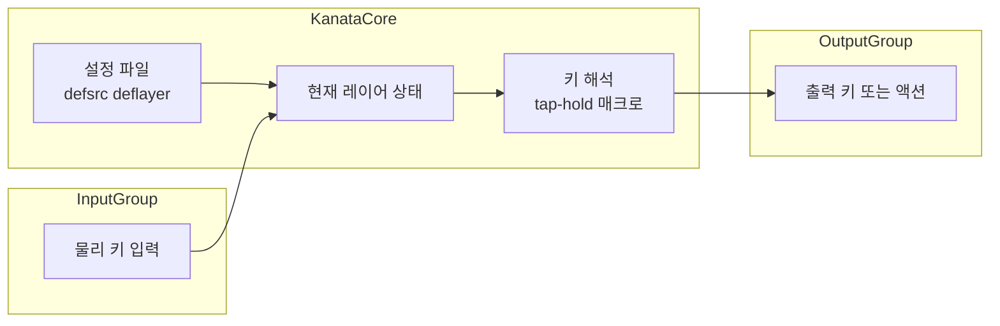

Kanata는 Rust로 작성된 **크로스플랫폼 키보드 리매퍼**로, 키 입력을 가로채어 레이어·tap-hold·매크로 등으로 재정의합니다. Windows, Linux, macOS에서 동일한 설정 파일을 쓸 수 있어, 프로그래머와 파워 유저에게 인기 있습니다.

**공식 저장소:** [Kanata (jtroo/kanata)](https://github.com/jtroo/kanata)

**목차:** [개요](#개요) · [동작 구조](#동작-구조) · [설치](#설치) · [핵심 기능](#핵심-기능) · [설정 예시](#설정-예시) · [장단점과 비교](#장단점과-비교) · [활용 시나리오](#활용-시나리오) · [종합 평가](#종합-평가) · [참고 자료](#참고-자료)

---

## 개요

### 도구 정보

| 항목 | 내용 |
|------|------|
| **이름** | Kanata |
| **언어** | Rust |
| **플랫폼** | Windows, Linux, macOS |
| **라이선스** | MIT |
| **설정 방식** | 텍스트 설정 파일 (S-expression 스타일) |

커널/드라이버 수준이 아니라 **사용자 공간에서 키보드 입력을 후킹**해, 정의한 규칙에 따라 다른 키·조합·매크로로 바꿔줍니다. 설정은 `defsrc`, `deflayer`, `deftest` 등으로 레이어와 동작을 선언하는 방식입니다.

### 추천 대상

- **레이어·tap-hold**로 Caps Lock을 Ctrl 등으로 쓰고 싶은 사람  
- **동일 키맵**을 회사 PC(Windows)·집(Linux/macOS)에서 쓰고 싶은 사람  
- **매크로·복합키**로 반복 입력을 줄이고 싶은 사람  
- **Rust/오픈소스** 기반 도구를 선호하는 사람  

---

## 동작 구조

Kanata는 OS의 키보드 입력을 받아, 현재 레이어와 설정 규칙에 따라 출력 키(또는 액션)를 결정합니다. 전체 흐름은 아래와 같이 단순화할 수 있습니다.



- **defsrc**: 물리 키보드의 키 목록 정의  
- **deflayer**: 레이어별로 “어떤 물리 키 → 어떤 동작”으로 매핑할지 정의  
- 레이어 전환, tap-hold, 매크로 등은 모두 설정 규칙에 따라 한 번에 해석된 뒤, 최종 **출력 키/액션**으로 나갑니다.

---

## 설치

### Windows

[winget](https://github.com/microsoft/winget-cli)으로 설치할 수 있습니다.

```powershell
winget install kanata
```

### Linux

Rust 툴체인이 있으면 `cargo install`로 설치합니다.

```bash
cargo install kanata
```

### macOS

Homebrew로 설치합니다.

```bash
brew install kanata
```

설치 후 설정 파일 경로와 실행 방법은 [공식 문서](https://github.com/jtroo/kanata#usage)를 참고하면 됩니다.

---

## 핵심 기능

### 1. 다중 레이어

- 여러 **레이어**를 정의하고, 특정 키(또는 조합)로 레이어를 전환할 수 있습니다.  
- 레이어마다 서로 다른 키 매핑을 두어, 한 키보드로 여러 “키보드 레이아웃”을 쓰는 효과를 냅니다.  
- 예: 기본 레이어 + 숫자/기호 전용 레이어, 한/영 전환 레이어 등.

### 2. Tap-Hold

- **짧게 누르면** 한 동작(예: 해당 문자), **길게 누르면** 다른 동작(예: Modifier)을 하도록 설정할 수 있습니다.  
- 예: `a`를 짧게 누르면 `a`, 길게 누르면 `Ctrl`로 동작하게 해서, 왼손 홈라인에서 Modifier를 쓰는 식으로 활용할 수 있습니다.

### 3. 복합 키와 매크로

- 여러 키를 **순서대로** 또는 **동시에** 눌렀을 때 하나의 동작으로 묶을 수 있습니다.  
- **매크로**로 긴 문자열·명령 조합을 한 번에 입력하도록 설정할 수 있어, 반복 타이핑을 줄이는 데 유용합니다.

### 4. 설정 파일 기반

- 모든 설정이 **텍스트 파일** 하나(또는 include로 나눈 여러 파일)에 정의됩니다.  
- 버전 관리(Git)에 넣고, 다른 PC에서 그대로 복사해 쓰기 좋습니다.  
- 커뮤니티에서 공유하는 설정을 참고하거나 수정해 쓰기 쉽습니다.

---

## 설정 예시

아래는 **defsrc**로 물리 키를 나열하고, **deflayer**로 기본 레이어를 정의한 최소 예시입니다. `@cap`은 Caps Lock 키에 tap-hold 등을 적용할 때 자주 쓰는 식별자입니다.

```
(defsrc
  esc  1    2    3    4    5    6    7    8    9    0    -    =    bspc
  tab  q    w    e    r    t    y    u    i    o    p    [    ]    \
  caps a    s    d    f    g    h    j    k    l    ;    '    ret
  lsft z    x    c    v    b    n    m    ,    .    /    rsft
  lctl lmet lalt           spc            ralt rmet rctl
)

(deflayer base
  esc  1    2    3    4    5    6    7    8    9    0    -    =    bspc
  tab  q    w    e    r    t    y    u    i    o    p    [    ]    \
  @cap a    s    d    f    g    h    j    k    l    ;    '    ret
  lsft z    x    c    v    b    n    m    ,    .    /    rsft
  lctl lmet lalt           spc            ralt rmet rctl
)
```

- **defsrc**: 실제 키보드의 키 코드 순서를 선언합니다.  
- **deflayer base**: “base” 레이어에서 각 위치에 어떤 키(또는 `@cap` 같은 특수 동작)가 나갈지 정의합니다.  
- 더 많은 레이어, tap-hold 옵션, 매크로는 [Kanata 문서](https://github.com/jtroo/kanata)의 설정 문법을 따라 추가하면 됩니다.

---

## 장단점과 비교

### 장점

| 구분 | 설명 |
|------|------|
| **성능** | Rust 기반이라 지연이 적고, CPU·메모리 사용량이 낮습니다. |
| **크로스플랫폼** | Windows·Linux·macOS에서 같은 설정 파일을 그대로 쓸 수 있습니다. |
| **확장성** | 레이어·tap-hold·매크로·조합키 등으로 복잡한 키맵을 표현할 수 있습니다. |
| **버전 관리** | 설정이 텍스트라 Git으로 관리·공유·백업이 쉽습니다. |
| **오픈소스** | MIT 라이선스로 코드와 동작을 검증하고 수정할 수 있습니다. |

### 단점 및 주의사항

- **학습 곡선**: S-expression 스타일 설정 문법과 개념(레이어, tap-hold 등)을 익혀야 합니다.  
- **권한**: OS별로 키보드 입력 후킹을 위해 **관리자 권한** 또는 **접근성 권한**이 필요할 수 있습니다.  
- **플랫폼별 이슈**: OS·키보드 드라이버에 따라 특정 키나 조합이 다르게 동작할 수 있어, 실제 환경에서 테스트가 필요합니다.

### 다른 도구와의 비교

- **AutoHotkey (Windows)**: 스크립트로 키·마우스·창 조작까지 넓게 다루지만, Windows 전용이고 “키보드만” 쓰는 경우 Kanata가 더 단순할 수 있습니다.  
- **Karabiner (macOS)**: macOS 전용이고 GUI 설정이 강점이지만, 크로스플랫폼·텍스트 설정을 원하면 Kanata가 유리합니다.  
- **QMK/ZMK (펌웨어)**: 키보드 **펌웨어** 단에서 리매핑하는 방식이라, 키보드 자체를 바꿀 수 있는 경우 선택지가 됩니다. Kanata는 **기존 키보드**를 그대로 두고 OS 레벨에서 바꾸고 싶을 때 적합합니다.

---

## 활용 시나리오

1. **Caps Lock → Ctrl (또는 Escape)**  
   tap-hold로 Caps Lock을 “짧게 누르면 Esc, 길게 누르면 Ctrl”로 쓰는 등, Vim·터미널 사용자에게 자주 쓰이는 패턴입니다.  
2. **동일 키맵 멀티 OS**  
   회사(Windows)·집(Linux/macOS)에서 같은 `kanata.kbd`를 두고, 레이어·단축키를 통일해 사용합니다.  
3. **반복 입력 매크로**  
   자주 쓰는 이메일 서명·코드 스니펫·명령어를 한 단축키에 매크로로 묶어 생산성을 높입니다.  
4. **손가락 부담 감소**  
   tap-hold로 홈라인에서 Modifier를 쓰거나, 자주 쓰는 조합을 한 손으로 누르도록 바꿔 RSI 위험을 줄일 수 있습니다.

---

## 종합 평가

**장점:** Rust 기반의 빠른 동작, Windows·Linux·macOS 공통 설정, 레이어·tap-hold·매크로 등 표현력이 높고, 텍스트 설정으로 버전 관리와 공유가 쉽습니다.  

**단점:** 설정 문법과 개념을 익혀야 하며, OS별 권한·호환성 확인이 필요합니다.  

**한 줄 평:** 기존 키보드를 그대로 두고, OS 레벨에서 강력하게 키맵을 커스터마이징하고 싶은 프로그래머·파워 유저에게 Kanata는 매우 실용적인 선택이다.

---

## 참고 자료

1. **Kanata 공식 저장소** — [https://github.com/jtroo/kanata](https://github.com/jtroo/kanata)  
   소스 코드, 이슈, 사용법·설정 문법 요약이 있습니다.  
2. **Rust 공식 사이트** — [https://www.rust-lang.org](https://www.rust-lang.org)  
   Kanata가 Rust로 작성된 만큼, 언어와 생태계 이해에 도움이 됩니다.  
3. **Remapping (Wikipedia)** — [https://en.wikipedia.org/wiki/Remapping](https://en.wikipedia.org/wiki/Remapping)  
   키보드 키 재정의 등 리매핑 개념의 일반적인 배경 지식을 참고할 수 있습니다.
